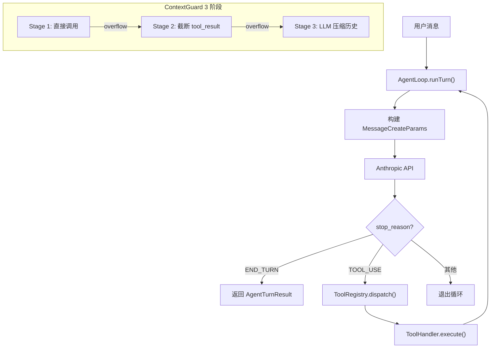

# Agent Core -- "The while-true heart of every conversation"

## 1. 核心概念

Agent Core 是 enterprise-claw-4j 的核心引擎, 将 light 版的 main() 循环重构为 Spring 管理的可扩展服务。
核心组件:

- **AgentLoop**: `@Service`, while-true 工具调用循环, 根据 `stop_reason` 分发, 50 次迭代上限防止无限循环
- **ToolRegistry**: `@Service`, Spring 自动收集所有 `ToolHandler` 实现, 提供 `dispatch()` + `getSchemas()`
- **ContextGuard**: `@Service`, 3 阶段上下文溢出恢复 (直接调用 -> 截断 tool_result -> LLM 压缩历史)
- **AgentConfig**: 不可变 record, 封装 Agent 配置 (id, name, personality, model, dmScope)
- **DmScope**: 4 级会话隔离粒度 (MAIN / PER_PEER / PER_CHANNEL_PEER / PER_ACCOUNT_CHANNEL_PEER)

关键抽象表:

| 组件 | 职责 |
|------|------|
| AgentLoop | `@Service`, while-true 工具循环, 50 次迭代上限 |
| ToolHandler | 接口: `getName()` + `getSchema()` + `execute(Map)` |
| ToolRegistry | `@Service`, 自动注册 + 按 name 分发 |
| ContextGuard | `@Service`, 3 阶段上下文保护 |
| AgentConfig | record: id, name, personality, model, dmScope |
| TokenEstimator | `@Component`, 英文 4chars/token, CJK 1.5chars/token |

6 个内置工具:

| 工具 | 功能 | 安全措施 |
|------|------|---------|
| read_file | 读取工作区文件 | 路径遍历保护 |
| write_file | 写入文件 | 自动创建父目录 |
| edit_file | 精确字符串替换 | old_string 唯一性校验 |
| bash | 执行 Shell 命令 | 危险命令检测 (rm -rf /, mkfs, fork bomb) |
| memory_write | 写入记忆 | 分类存储 |
| memory_search | 搜索记忆 | TF-IDF + 向量混合检索 |

## 2. 架构图



## 3. 关键代码片段

### AgentLoop -- while-true 工具循环

```java
@Service
public class AgentLoop {
    private static final int MAX_TOOL_ITERATIONS = 50;

    public AgentTurnResult runTurn(String systemPrompt,
                                    List<MessageParam> messages,
                                    List<ToolUnion> tools,
                                    AnthropicClient client,
                                    String model) {
        List<ToolCallRecord> toolCalls = new ArrayList<>();

        for (int i = 0; i < MAX_TOOL_ITERATIONS; i++) {
            MessageCreateParams params = MessageCreateParams.builder()
                .model(model)
                .maxTokens(maxTokens)
                .system(systemPrompt)
                .messages(messages)
                .tools(tools)
                .build();

            Message response = client.messages().create(params);

            // 根据 stop_reason 分发
            if (response.stopReason() == StopReason.END_TURN) {
                return buildResult(response, toolCalls);
            }
            if (response.stopReason() != StopReason.TOOL_USE) {
                return buildResult(response, toolCalls);
            }

            // 提取工具调用并执行
            messages = handleToolUse(response, messages, toolCalls);
        }

        // 超过迭代上限, 返回最后一个结果
        return buildResult(lastResponse, toolCalls);
    }
}
```

> AgentLoop 的核心逻辑与 light 版 S01/S02 的 while 循环完全一致,
> 只是多了 50 次迭代上限和 Spring `@Service` 注解。
> `handleToolUse()` 内部调用 `ToolRegistry.dispatch()` 执行工具。

### ToolHandler 接口 + 自动注册

```java
// 接口: 所有工具的统一契约
public interface ToolHandler {
    String getName();
    ToolDefinition getSchema();
    String execute(Map<String, Object> input);
}

// ToolRegistry: Spring 自动收集所有 @Component 实现
@Service
public class ToolRegistry {
    private final Map<String, ToolHandler> handlers;

    public ToolRegistry(List<ToolHandler> handlerList) {
        this.handlers = handlerList.stream()
            .collect(Collectors.toMap(ToolHandler::getName, h -> h));
    }

    public String dispatch(String toolName, Map<String, Object> input) {
        ToolHandler handler = handlers.get(toolName);
        if (handler == null) throw new ToolExecutionException(toolName, input);
        return handler.execute(input);
    }

    public List<ToolUnion> getSchemas() {
        return handlers.values().stream()
            .map(ToolHandler::getSchema)
            .map(ToolUnion::ofTool)
            .toList();
    }
}
```

> Spring 的依赖注入自动将所有 `ToolHandler` 实现收集到 `List<ToolHandler>` 中,
> ToolRegistry 在构造函数中按 name 建立分发表。
> 新增工具只需实现接口 + `@Component`, 无需修改任何已有代码。

### BashToolHandler -- 危险命令检测

```java
@Component
public class BashToolHandler implements ToolHandler {
    private static final List<Pattern> DANGEROUS = List.of(
        Pattern.compile("rm\\s+-rf\\s+/"),
        Pattern.compile("mkfs"),
        Pattern.compile("dd\\s+if=.*of=/dev/"),
        Pattern.compile(":\\(\\)\\s*\\{.*\\}"),  // fork bomb
        Pattern.compile("chmod\\s+777\\s+/")
    );

    @Override
    public String execute(Map<String, Object> input) {
        String command = (String) input.get("command");
        for (Pattern p : DANGEROUS) {
            if (p.matcher(command).find())
                throw new ToolExecutionException("bash", "Dangerous command blocked");
        }
        // ProcessBuilder 执行, 50K 输出截断
        ProcessBuilder pb = new ProcessBuilder("sh", "-c", command)
            .redirectErrorStream(true);
        // ... 执行并截断输出
    }
}
```

> 与 light 版的 `DANGEROUS_COMMANDS` 字符串匹配不同, enterprise 版使用正则 Pattern,
> 能匹配更多变形 (如 `rm  -rf  /`, `rm -rf --no-preserve-root /`)。
> 所有工具输出截断到 50K, 防止上下文爆炸。

### ContextGuard -- 3 阶段恢复

```java
@Service
public class ContextGuard {
    private final TokenEstimator tokenEstimator;

    public List<MessageParam> guard(List<MessageParam> messages,
                                     int budget,
                                     AnthropicClient client,
                                     String model) {
        // Stage 1: 调用方直接尝试正常调用
        //          如果 API 返回 overflow 错误, 进入 Stage 2

        // Stage 2: 截断 tool_result (保留 30% 原始长度)
        //          对 messages 中最长的 tool_result 进行截断
        //          截断后重新尝试调用

        // Stage 3: LLM 压缩历史
        //          前 50% 消息 -> LLM 生成摘要
        //          保留最近 20% 消息不变
        //          摘要 + 最近消息 = 新的 messages 列表
    }
}
```

> 与 light 版 S03/S09 的嵌入式保护逻辑相比, enterprise 版将其抽取为独立 `@Service`。
> 渐进式恢复策略: 先零成本截断 (Stage 2), 再 LLM 调用压缩 (Stage 3),
> 两阶段设计避免不必要的 API 开销。

### DmScope -- 4 级会话隔离

```java
public enum DmScope {
    MAIN,                     // 全局共享 -- 所有用户共用一个会话
    PER_PEER,                 // 按用户隔离 -- 每个用户独立会话
    PER_CHANNEL_PEER,         // 按渠道+用户隔离 -- 同一用户在不同渠道有不同会话
    PER_ACCOUNT_CHANNEL_PEER  // 按账户+渠道+用户隔离 (最细粒度)
}
```

> SessionStore 根据 DmScope 构建不同的 session key:
> - `MAIN`: `"default"`
> - `PER_PEER`: `"user:{userId}"`
> - `PER_CHANNEL_PEER`: `"channel:{channelId}:user:{userId}"`
> - `PER_ACCOUNT_CHANNEL_PEER`: `"account:{accountId}:channel:{channelId}:user:{userId}"`

### TokenEstimator -- 中英文混合估算

```java
@Component
public class TokenEstimator {
    // 英文: ~4 chars/token
    // CJK: ~1.5 chars/token
    public int estimate(String text) {
        int cjk = 0, ascii = 0;
        for (char c : text.toCharArray()) {
            if (isCJK(c)) cjk++; else ascii++;
        }
        return ascii / 4 + (int)(cjk / 1.5);
    }
}
```

> light 版的 `text.length() / 4` 对纯英文足够, 但中文对话会严重低估。
> enterprise 版区分 CJK 字符和 ASCII, 估算更准确。

## 4. 与 light 版本的对比

| 维度 | light-claw-4j | enterprise-claw-4j |
|------|--------------|-------------------|
| Agent 循环 | S01 单文件 main() | `@Service` AgentLoop |
| 工具注册 | 手动 `Map.of("name", handler)` | Spring 自动收集 ToolHandler |
| 工具数量 | S02: 4 个 (bash, read/write/edit) | 6 个 (+ memory_write, memory_search) |
| 上下文保护 | S03/S09: 嵌入式 | 独立 `@Service` ContextGuard |
| 错误处理 | `System.err.println` | ToolExecutionException + 日志 |
| Token 估算 | 简单除 4 | 中英文混合 (4 / 1.5 chars per token) |
| 会话隔离 | 单会话 | DmScope 4 级隔离 |
| 配置 | 硬编码常量 | AgentConfig record |
| 迭代上限 | 无 (while true) | 50 次 |

## 5. 扩展指南

添加自定义工具只需 3 步:

1. 创建类实现 `ToolHandler` 接口
2. 添加 `@Component` 注解
3. Spring 自动注册到 `ToolRegistry`, 无需修改任何已有代码

```java
@Component
public class MyCustomTool implements ToolHandler {
    @Override
    public String getName() { return "my_tool"; }

    @Override
    public ToolDefinition getSchema() {
        return new ToolDefinition("my_tool", "Description",
            Map.of("type", "object",
                   "properties", Map.of("input", Map.of("type", "string"))));
    }

    @Override
    public String execute(Map<String, Object> input) {
        String arg = (String) input.get("input");
        // ... 自定义逻辑
        return "result: " + arg;
    }
}
```

## 6. 学习要点

1. **while-true + stop_reason 是 Agent 循环的本质**: 无论 light 版还是 enterprise 版, 核心循环都是 `while(true) { call API; check stopReason; if TOOL_USE dispatch; else break; }`. Enterprise 版加了 50 次迭代上限防止无限循环。

2. **Strategy 模式实现可插拔工具**: ToolHandler 接口 + `@Component` 自动注册. 新增工具只需实现接口, 无需修改 AgentLoop 代码. 这比 light 版的手动 Map 更易扩展, 符合开闭原则。

3. **ContextGuard 的渐进式恢复**: 先零成本截断 (Stage 2), 再 LLM 调用压缩 (Stage 3). 两阶段设计避免不必要的 API 开销. 与 light 版的嵌入式逻辑相比, 独立 Service 更易测试和复用。

4. **DmScope 提供灵活的会话隔离**: 从全局共享到按渠道+用户隔离, 满足不同部署场景. SessionStore 根据 scope 构建不同的 session key, 切换隔离级别只需改一行配置。

5. **安全第一的工具设计**: BashToolHandler 用正则拦截危险命令; 文件工具用 `safePath()` 防止路径遍历; 所有工具输出截断到 50K 防止上下文爆炸. 比 light 版的字符串匹配更健壮。
