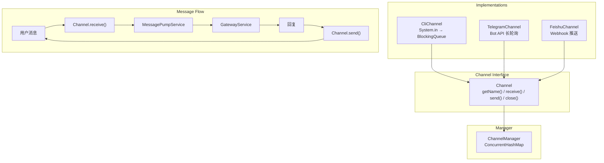

# Channels -- "One interface, many platforms"

## 1. 核心概念

enterprise-claw-4j 的多渠道系统通过 Strategy 模式统一不同消息平台。Gateway 只看统一的 `InboundMessage`,
不关心消息来自 CLI、Telegram 还是飞书。添加新平台 = 实现 `Channel` 接口的 `receive()` + `send()` + 加 `@Component`。

关键设计：
- `Channel` 接口定义四个方法：`getName()`、`receive()`（非阻塞）、`send()`、`close()`
- `InboundMessage` record 将所有平台的消息标准化为 `(text, senderId, channel, accountId, peerId, guildId, isGroup, media, raw, timestamp)`
- `ChannelManager` 是 Spring 构造注入收集的 name-to-channel 注册表，管理生命周期
- `@ConditionalOnProperty` 实现 Telegram / 飞书按需注册，未配置时对应类根本不会被实例化

本节实现 3 个 Channel：CLI（标准输入输出）、Telegram（Bot API 长轮询）、飞书（Webhook 推送）。

关键抽象表:

| 组件 | 职责 |
|------|------|
| Channel | 接口: 统一收发消息 |
| ChannelManager | @Service: 注册表 + 生命周期管理 |
| InboundMessage | record: 统一入站消息格式 |
| MediaAttachment | record: 媒体附件 (type, url, mimeType) |
| CliChannel | @Component: System.in → LinkedBlockingQueue |
| TelegramChannel | @Component + @ConditionalOnProperty |
| FeishuChannel | @Component + @ConditionalOnProperty |
| FeishuWebhookController | @RestController: POST /webhook/feishu |

## 2. 架构图



## 3. 关键代码片段

### Channel 接口 -- 统一契约

```java
public interface Channel {
    String getName();
    Optional<InboundMessage> receive();  // 非阻塞
    void send(String peerId, String text);
    void close();
}
```

> 四个方法构成渠道的最小契约。`receive()` 返回 `Optional` 表达非阻塞语义:
> 有消息就返回, 没有就返回 `Optional.empty()`。MessagePumpService 以 100ms 间隔轮询所有渠道。

### CliChannel -- 终端交互

```java
@Component
public class CliChannel implements Channel {
    private final LinkedBlockingQueue<InboundMessage> queue = new LinkedBlockingQueue<>();
    private volatile boolean running = true;

    @PostConstruct
    void startReader() {
        Thread.ofVirtual().name("cli-reader").start(() -> {
            Scanner scanner = new Scanner(System.in);
            while (running) {
                String line = scanner.nextLine();
                queue.offer(new InboundMessage(
                    line, "user", "cli", "default", "user", null, false, List.of(), null, Instant.now()));
            }
        });
    }

    @Override
    public Optional<InboundMessage> receive() {
        return Optional.ofNullable(queue.poll());  // 非阻塞
    }

    @Override
    public void send(String peerId, String text) {
        System.out.println(text);
    }
}
```

> 与 light 版直接在主线程 `Scanner.nextLine()` 阻塞不同, enterprise 版在独立虚拟线程中读取 System.in,
> 通过 `LinkedBlockingQueue` 缓冲, `receive()` 用 `queue.poll()` 非阻塞返回。
> 永远注册, 无需 `@ConditionalOnProperty`。

### TelegramChannel -- Bot API 长轮询

```java
@Component
@ConditionalOnProperty(name = "channels.telegram.enabled", havingValue = "true")
public class TelegramChannel implements Channel {
    private final LinkedHashSet<Long> seenIds = new LinkedHashSet<>(5000);

    @PostConstruct
    void startPolling() {
        Thread.ofVirtual().name("telegram-poller").start(() -> {
            while (running) {
                // getUpdates 长轮询 (timeout=30s)
                // 去重: seenIds (5000 ID 滑动窗口)
                // MarkdownV2 转义 + 4096 字符分片
            }
        });
    }
}
```

> `@ConditionalOnProperty` 确保只在 `channels.telegram.enabled=true` 时才注册为 Spring Bean。
> `seenIds` 用 `LinkedHashSet` 实现 O(1) 查重 + FIFO 淘汰, 容量 5000 防止内存泄漏。
> 发送时自动处理 MarkdownV2 转义 + 4096 字符分片, Agent 只管生成内容, 不关心平台限制。

### FeishuChannel -- Webhook + Token 管理

```java
@Component
@ConditionalOnProperty(name = "channels.feishu.enabled", havingValue = "true")
public class FeishuChannel implements Channel {
    private volatile String tenantToken;
    private volatile Instant tokenExpiry;

    // 提前 5 分钟刷新 tenant_access_token
    void ensureToken() {
        if (tenantToken == null || Instant.now().isAfter(tokenExpiry.minus(5, ChronoUnit.MINUTES))) {
            // POST /open-apis/auth/v3/tenant_access_token/internal
        }
    }

    // 401 时递归重试 (max depth 2)
    void sendWithRetry(String peerId, String text, int depth) {
        if (depth > 2) throw new ChannelException("feishu", "Auth failed after retry");
        // POST /open-apis/im/v1/messages
        // if 401: ensureToken() + sendWithRetry(peerId, text, depth + 1)
    }
}
```

> `tenant_access_token` 有效期 2 小时, 提前 5 分钟刷新避免临界态失效。
> 401 时递归重试 (最大深度 2), 保证发送不因 Token 过期而失败。
> `volatile` 修饰 token 字段, 确保多线程可见性。

### FeishuWebhookController -- HMAC 签名验证

```java
@RestController
@ConditionalOnProperty(name = "channels.feishu.enabled", havingValue = "true")
public class FeishuWebhookController {
    @PostMapping("/webhook/feishu")
    ResponseEntity<?> handle(@RequestBody String body,
                              @RequestHeader("X-Lark-Signature") String signature) {
        // HMAC-SHA256 常量时间比较 (防时序攻击)
        // URL 验证挑战: 返回 challenge
        // 消息事件: 放入 FeishuChannel 的 BlockingQueue
    }
}
```

> 签名验证使用 `MessageDigest.isEqual()` 做常量时间比较, 防止时序攻击推断密钥。
> URL 验证挑战在飞书配置 Webhook 时自动触发, 返回 `challenge` 完成握手。
> 消息事件解析后放入 FeishuChannel 的 `BlockingQueue`, 由 `receive()` 消费。

### ChannelManager -- 生命周期管理

```java
@Service
public class ChannelManager {
    private final ConcurrentHashMap<String, Channel> channels;

    public ChannelManager(List<Channel> channelList) {
        this.channels = new ConcurrentHashMap<>(
            channelList.stream().collect(Collectors.toMap(Channel::getName, c -> c)));
    }

    public void stopReceiving() { /* set running=false on all */ }
    public void closeAll() { /* close all channels */ }
}
```

> Spring 构造注入 `List<Channel>` 自动收集所有 `@Component` 渠道实现。
> `ConcurrentHashMap` 保证线程安全的注册表查询。
> `stopReceiving()` 和 `closeAll()` 由 `GracefulShutdownManager` 在关闭阶段调用,
> 确保消息不丢失。

## 4. 渠道配置

### 启用 Telegram

```yaml
# application.yml
channels:
  telegram:
    enabled: true
    token: ${TELEGRAM_BOT_TOKEN}
```

### 启用飞书

```yaml
channels:
  feishu:
    enabled: true
    app-id: ${FEISHU_APP_ID}
    app-secret: ${FEISHU_APP_SECRET}
    verification-token: ${FEISHU_VERIFICATION_TOKEN}
```

### 环境变量

```bash
# .env
TELEGRAM_ENABLED=true
TELEGRAM_BOT_TOKEN=123456:ABC-DEF

FEISHU_ENABLED=true
FEISHU_APP_ID=cli_xxx
FEISHU_APP_SECRET=xxx
FEISHU_VERIFICATION_TOKEN=xxx
```

> `@ConditionalOnProperty` 读取 `channels.telegram.enabled` 和 `channels.feishu.enabled`。
> 未配置或为 `false` 时, 对应渠道类不会被 Spring 实例化, 零开销。
> CLI 渠道永远注册, 无需配置。

## 5. InboundMessage 统一格式

```java
public record InboundMessage(
    String text,           // 消息文本
    String senderId,       // 发送者 ID
    String channel,        // 渠道名 (cli/telegram/feishu)
    String accountId,      // 账户 ID (Bot ID)
    String peerId,         // 对等 ID (用于回复)
    String guildId,        // 群组 ID (Telegram 群/飞书群)
    boolean isGroup,       // 是否群组消息
    List<MediaAttachment> media,  // 媒体附件
    Object raw,            // 原始 payload
    Instant timestamp      // 时间戳
) {}
```

> 所有渠道的消息最终都标准化为这个 record。GatewayService 只看 `InboundMessage`,
> 不关心消息来自哪个平台。`peerId` 在私聊中是 userId, 在群聊中是 chatId, 用于会话隔离。
> `guildId` 记录群组信息, `isGroup` 标记是否为群聊消息。

## 6. 与 light 版本的对比

| 维度 | light-claw-4j (S04) | enterprise-claw-4j |
|------|---------------------|-------------------|
| 渠道抽象 | 接口 + if-else 分发 | Strategy + @Component 自动注册 |
| CLI | Scanner.nextLine() 阻塞 | LinkedBlockingQueue + 虚拟线程 |
| Telegram | 骨架实现 | 完整实现: 长轮询 + 去重 + MarkdownV2 |
| 飞书 | 骨架实现 | 完整实现: Webhook + HMAC + Token 刷新 |
| 条件注册 | 手动 if | @ConditionalOnProperty |
| 生命周期 | 无 | ChannelManager.stopReceiving() / closeAll() |
| InboundMessage | 8 字段 record | 10 字段 record (+guildId, +timestamp) |
| 媒体附件 | List<Map<String, Object>> | List<MediaAttachment> (类型安全) |
| 消息缓冲 | 无 | LinkedBlockingQueue 统一缓冲 |

## 7. 学习要点

1. **Strategy 模式 + Spring 自动收集**: Channel 接口定义统一契约, 各渠道独立实现 `@Component`。ChannelManager 通过构造注入 `List<Channel>` 自动收集所有实现。新增渠道只需实现接口 + 加注解, 无需修改任何已有代码。

2. **@ConditionalOnProperty 实现按需加载**: Telegram 和飞书渠道只在配置 `enabled=true` 时才注册为 Spring Bean。未配置时对应类根本不会被实例化, 零开销。这是 Spring Boot 条件化 Bean 注册的标准用法。

3. **非阻塞 receive() + MessagePump 轮询**: 所有 Channel 的 `receive()` 使用 `queue.poll()` 非阻塞返回。MessagePumpService 以 100ms 间隔轮询所有渠道, 避免阻塞主线程。这是典型的 "pull 模式" 消费者设计。

4. **飞书 Token 自动刷新**: `tenant_access_token` 有效期 2 小时, 提前 5 分钟刷新。401 时递归重试 (max depth 2), 保证发送不因 Token 过期而失败。`volatile` 修饰 token 字段确保多线程可见性。

5. **HMAC-SHA256 常量时间比较**: 飞书 Webhook 签名验证使用 `MessageDigest.isEqual()` 做常量时间比较, 防止时序攻击推断密钥。这是安全编码的基本实践, 绝对不能用 `String.equals()` 比较签名。
