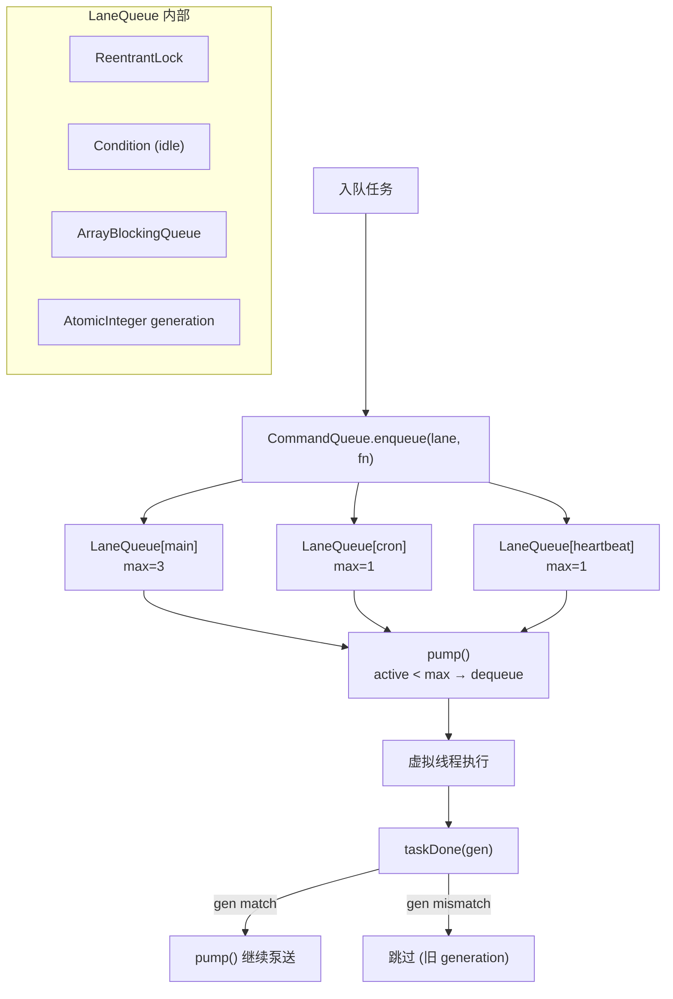

# Concurrency -- "Named lanes serialize the chaos"

## 1. 核心概念

Concurrency 模块提供命名 Lane 并发控制系统:

- **CommandQueue**: @Service, 中央调度器, 将 callable 路由到命名的 LaneQueue.
- **LaneQueue**: FIFO 队列 + 可配置 maxConcurrency. ReentrantLock + Condition 保证线程安全, 虚拟线程执行任务.
- **Generation-based cancellation**: 每个 lane 维护 generation 计数器. reset() 时递增, 旧 generation 任务被取消.
- **ConcurrencyProperties**: @ConfigurationProperties, 外部化 lane 配置.

默认 3 个 lane (通过 application.yml 配置):

| Lane | maxConcurrency | 用途 |
|------|---------------|------|
| main | 3 | 用户对话 |
| cron | 1 | 定时任务 |
| heartbeat | 1 | 心跳检查 |

关键抽象表:

| 组件 | 职责 |
|------|------|
| CommandQueue | @Service: 中央调度器, 惰性创建 lane |
| LaneQueue | FIFO 队列 + ReentrantLock + Condition |
| QueuedItem | record: (Callable, CompletableFuture, generation) |
| LaneStatus | record: (name, activeCount, queueSize, generation) |
| ConcurrencyProperties | @ConfigurationProperties: Map<String, LaneConfig> |

## 2. 架构图



## 3. 关键代码片段

### LaneQueue -- FIFO + generation 取消

```java
public class LaneQueue {
    private final ReentrantLock lock = new ReentrantLock();
    private final Condition idle = lock.newCondition();
    private final ArrayBlockingQueue<QueuedItem> deque = new ArrayBlockingQueue<>(1024);
    private final AtomicInteger activeCount = new AtomicInteger(0);
    private final AtomicInteger generation = new AtomicInteger(0);

    public CompletableFuture<Object> enqueue(Callable<Object> task) {
        CompletableFuture<Object> future = new CompletableFuture<>();
        lock.lock();
        try {
            deque.offer(new QueuedItem(task, future, generation.get()));
            pump();
        } finally {
            lock.unlock();
        }
        return future;
    }

    void pump() {
        while (activeCount.get() < maxConcurrency) {
            QueuedItem item = deque.poll();
            if (item == null) break;
            if (item.gen() != generation.get()) {
                item.future().cancel(false);  // 旧 generation → 取消
                continue;
            }
            activeCount.incrementAndGet();
            Thread.ofVirtual().name("lane-" + name + "-worker").start(() -> runTask(item));
        }
    }

    void taskDone(int expectedGen) {
        activeCount.decrementAndGet();
        if (expectedGen == generation.get()) {
            pump();  // generation 匹配 → 继续泵送
        }
        idle.signalAll();
    }

    void reset() {
        generation.incrementAndGet();  // 旧任务失效
        idle.signalAll();
    }
}
```

### CommandQueue -- 惰性创建 lane

```java
@Service
public class CommandQueue {
    private final ConcurrentHashMap<String, LaneQueue> lanes = new ConcurrentHashMap<>();

    public CompletableFuture<Object> enqueue(String laneName, Callable<Object> task) {
        LaneQueue lane = lanes.computeIfAbsent(laneName,
            name -> new LaneQueue(name, getConcurrency(name)));
        return lane.enqueue(task);
    }

    public void resetAll() {
        lanes.values().forEach(LaneQueue::reset);
    }
}
```

### CompletableFuture 回调 -- 异步结果传播

```java
// 用户对话: 阻塞等待
CompletableFuture<Object> future = commandQueue.enqueue("main", () -> {
    return agentLoop.runTurn(system, messages, tools);
});
Object result = future.get(120, TimeUnit.SECONDS);

// 心跳: 异步回调
CompletableFuture<Object> future = commandQueue.enqueue("heartbeat", () -> {
    return heartbeatService.executeHeartbeat();
});
future.whenComplete((result, exc) -> {
    if (exc == null) broadcast("heartbeat.output", result);
});
```

## 4. 配置

```yaml
# application.yml -- Lane 配置
concurrency:
  lanes:
    main:
      max-concurrency: ${LANE_MAIN_CONCURRENCY:3}
    cron:
      max-concurrency: ${LANE_CRON_CONCURRENCY:1}
    heartbeat:
      max-concurrency: ${LANE_HEARTBEAT_CONCURRENCY:1}
```

## 5. 与 light 版本的对比

| 维度 | light-claw-4j (S10) | enterprise-claw-4j |
|------|---------------------|-------------------|
| Lane 创建 | 硬编码 3 个 | ConcurrencyProperties 外部化 |
| 并发数 | maxConcurrency=1 | main=3, 可配置 |
| 线程安全 | int + ReentrantLock | AtomicInteger + ReentrantLock |
| 注册 | CommandQueue 内部 | Spring @Service, 惰性 computeIfAbsent |
| 配置 | 代码中 new | application.yml 环境变量 |
| 死锁检测 | DeadlockDetector (ThreadMXBean) | 移除 (生产环境用外部监控) |

## 6. 学习要点

1. **命名 lane 按关注点隔离并发**: main 处理用户对话 (max=3, 允许并行), cron 处理定时任务 (max=1, 串行), heartbeat 处理心跳 (max=1). 不同 lane 互不阻塞.

2. **Generation-based cancellation 无锁失效**: reset() 只递增 AtomicInteger, 旧任务在 pump() 和 taskDone() 中检测 generation 不匹配时自动取消. 无需遍历队列.

3. **CompletableFuture 提供灵活的结果处理**: 用户对话用 future.get() 阻塞等待; 心跳和 cron 用 whenComplete() 异步回调. 同一个队列机制, 两种消费模式.

4. **ConcurrentHashMap.computeIfAbsent 惰性创建**: Lane 按需创建, 不需要预定义. 新增 lane 只需在配置中添加一行.

5. **虚拟线程作为 worker 线程**: 每个任务在 Thread.ofVirtual() 中执行, 不占用平台线程. 适合 I/O 密集型 Agent 调用.
