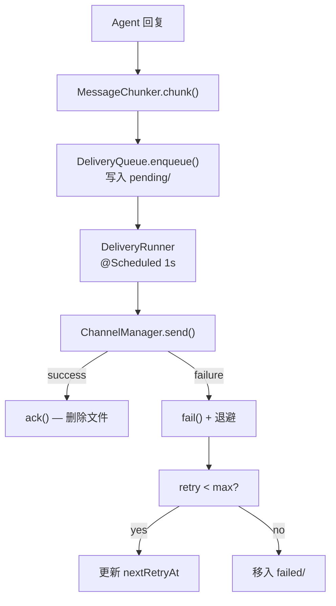

# Delivery -- "Write to disk first, then try to send"

## 1. 核心概念

Delivery 模块实现可靠的消息投递管线:

- **DeliveryQueue**: @Service, WAL 风格持久化队列. 消息先写入磁盘 (tmp + fsync + atomic move), 再尝试投递. 失败时指数退避重试.
- **DeliveryRunner**: @Service, @Scheduled 轮询器 (默认 1s 间隔). 加载 pending 条目, 过滤 nextRetryAt, 投递/确认/失败.
- **MessageChunker**: 工具类, 渠道感知消息分片. 先按段落边界拆分, 超长段落硬切.
- **QueuedDelivery**: record, 投递条目 (id, channel, to, text, retryCount, nextRetryAt, lastError).

关键抽象表:

| 组件 | 职责 |
|------|------|
| DeliveryQueue | @Service: WAL 持久化 (pending/ + failed/) |
| DeliveryRunner | @Service: @Scheduled 投递轮询 |
| MessageChunker | 渠道感知分片 (Telegram 4096, Discord 2000) |
| QueuedDelivery | record: 投递条目 |

文件布局:
```
workspace/delivery-queue/
├── pending/          # 待投递
│   └── {id}.json
└── failed/           # 投递失败 (超过 max retries)
    └── {id}.json
```

退避时间表: `[5s, 25s, 2min, 10min]` (带 ±20% 随机抖动)

## 2. 架构图



## 3. 关键代码片段

### DeliveryQueue -- WAL 原子写入

```java
@Service
public class DeliveryQueue {
    @PostConstruct
    void init() {
        Files.createDirectories(pendingDir);
        Files.createDirectories(failedDir);
    }

    public void enqueue(QueuedDelivery delivery) {
        Path file = pendingDir.resolve(delivery.id() + ".json");
        FileUtils.writeAtomically(file, JsonUtils.toJson(delivery));
        // tmp + fsync + atomic move
    }

    public void ack(String deliveryId) {
        Files.deleteIfExists(pendingDir.resolve(deliveryId + ".json"));
    }

    public void fail(QueuedDelivery delivery, String error) {
        int newRetry = delivery.retryCount() + 1;
        if (newRetry >= maxRetries) {
            // 移入 failed/
            moveToFailed(delivery, error);
        } else {
            // 更新退避时间
            long backoff = computeBackoff(newRetry);
            QueuedDelivery updated = new QueuedDelivery(
                delivery.id(), delivery.channel(), delivery.to(), delivery.text(),
                delivery.createdAt(), newRetry, Instant.now().plusSeconds(backoff), error);
            FileUtils.writeAtomically(pendingDir.resolve(delivery.id() + ".json"),
                JsonUtils.toJson(updated));
        }
    }
}
```

### DeliveryRunner -- @Scheduled 轮询

```java
@Service
public class DeliveryRunner {
    @Scheduled(fixedDelayString = "${delivery.poll-interval-ms:1000}")
    void processQueue() {
        List<QueuedDelivery> pending = loadPending();
        Instant now = Instant.now();

        for (QueuedDelivery d : pending) {
            if (d.nextRetryAt() != null && now.isBefore(d.nextRetryAt())) continue;
            try {
                List<String> chunks = MessageChunker.chunk(d.text(), d.channel());
                for (String chunk : chunks) {
                    channelManager.send(d.channel(), d.to(), chunk);
                }
                deliveryQueue.ack(d.id());
            } catch (Exception e) {
                deliveryQueue.fail(d, e.getMessage());
            }
        }
    }
}
```

### MessageChunker -- 渠道感知分片

```java
public class MessageChunker {
    private static final Map<String, Integer> LIMITS = Map.of(
        "telegram", 4096, "discord", 2000, "feishu", 4096);

    public static List<String> chunk(String text, String channel) {
        int limit = LIMITS.getOrDefault(channel, Integer.MAX_VALUE);
        if (text.length() <= limit) return List.of(text);
        // 先按 \n\n 段落边界拆分
        // 超长段落硬切
    }
}
```

### FileUtils.writeAtomically -- 崩溃安全

```java
static void writeAtomically(Path target, String content) {
    Path tmp = target.resolveSibling(
        ".tmp." + ProcessHandle.current().pid() + "." + target.getFileName());
    Files.writeString(tmp, content, CREATE, TRUNCATE_EXISTING);
    try (var fos = Files.newOutputStream(tmp, SYNC)) { fos.flush(); }
    Files.move(tmp, target, ATOMIC_MOVE, REPLACE_EXISTING);
}
```

## 4. 配置

```yaml
# application.yml
delivery:
  poll-interval-ms: ${DELIVERY_POLL_INTERVAL:1000}
  max-retries: ${DELIVERY_MAX_RETRIES:5}
  backoff-base-seconds: ${DELIVERY_BACKOFF_BASE:5}
  backoff-multiplier: ${DELIVERY_BACKOFF_MULTIPLIER:5.0}
  jitter-factor: ${DELIVERY_JITTER:0.2}
```

## 5. 与 light 版本的对比

| 维度 | light-claw-4j (S08) | enterprise-claw-4j |
|------|---------------------|-------------------|
| 投递触发 | 后台 Thread + sleep | @Scheduled fixedDelay |
| 队列管理 | 内部类 | DeliveryQueue @Service |
| 分片 | 内联方法 | MessageChunker 工具类 |
| 退避配置 | 硬编码常量 | @ConfigurationProperties |
| 失败恢复 | 启动时手动扫描 | @PostConstruct 自动恢复 |
| 重试 | /retry 命令 | retryFailed() + API 端点 |

## 6. 学习要点

1. **WAL (Write-Ahead Log) 保证崩溃不丢消息**: enqueue() 时先写磁盘再返回. 即使投递过程中崩溃, 重启后 DeliveryRunner 扫描 pending/ 恢复.

2. **@Scheduled 替代手动线程管理**: Spring 的 @Scheduled 自动管理线程池和调度. 配合 spring.task.scheduling.pool.size=4 虚拟线程池, 无需手动创建线程.

3. **原子文件写入: tmp + fsync + rename**: writeAtomically() 先写临时文件, fsync 强制落盘, 再 atomic move. 如果 fsync 和 rename 之间崩溃, 临时文件在下次启动时被清理.

4. **退避时间表 + 抖动防止惊群**: 指数退避 [5s, 25s, 2min, 10min] + ±20% 随机抖动. 抖动避免多个失败消息同时重试对下游服务造成压力.

5. **渠道感知分片保持语义完整**: 先按 \n\n 段落边界拆分 (保持段落完整), 超长段落才硬切. 不同平台不同限制: Telegram 4096, Discord 2000.
