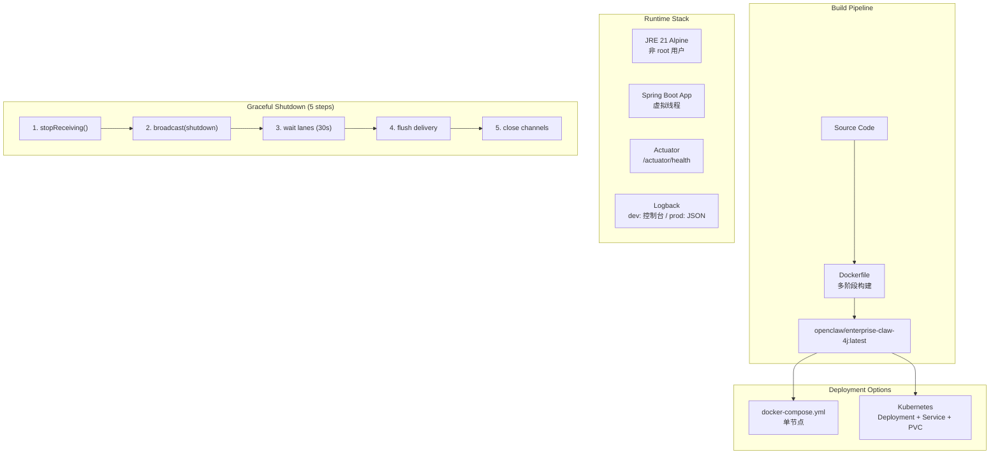

# Deployment -- "From dev machine to production cluster"

## 1. 核心概念

Deployment 模块覆盖 enterprise-claw-4j 从开发到生产的完整部署流程:

- **Dockerfile**: 多阶段构建 — JDK 21 Alpine 构建 → JRE 21 Alpine 运行. 非 root 用户, 容器感知 JVM, 内置健康检查.
- **docker-compose.yml**: 单节点部署 — 命名卷持久化, 内存限制 (512M), 优雅关闭 (30s), 自动重启.
- **K8s deployment.yaml**: Kubernetes 部署 — Deployment (单副本) + ClusterIP Service + PersistentVolumeClaim. Liveness/Readiness 探针.
- **GracefulShutdownManager**: @Component, SmartLifecycle (phase=MAX_VALUE). 5 步有序关闭: 停接收 → 广播 → 等待 lane → 刷新队列 → 关闭渠道.
- **WorkspaceHealthIndicator**: @Component, Spring Actuator 健康检查, 验证工作区目录读写权限.
- **Spring Profiles**: dev (DEBUG 日志) / prod (INFO + JSON 结构化日志 + Prometheus 端点).

关键抽象表:

| 组件 | 职责 |
|------|------|
| Dockerfile | 多阶段构建: JDK → JRE Alpine |
| docker-compose.yml | 单节点编排: 卷 + 内存限制 + 重启策略 |
| k8s/deployment.yaml | K8s: Deployment + Service + PVC |
| GracefulShutdownManager | 5 步优雅关闭 (SmartLifecycle) |
| WorkspaceHealthIndicator | Actuator 健康检查 |
| application-{profile}.yml | 环境配置覆写 |

## 2. 架构图



## 3. 关键代码片段

### Dockerfile — 多阶段构建

```dockerfile
# ---- 构建阶段 ----
FROM eclipse-temurin:21-jdk-alpine AS builder
WORKDIR /build
COPY pom.xml .
RUN mvn dependency:go-offline -B          # 依赖缓存层
COPY src ./src
RUN mvn clean package -DskipTests -B

# ---- 运行阶段 ----
FROM eclipse-temurin:21-jre-alpine
RUN addgroup -S claw4j && adduser -S claw4j -G claw4j   # 非 root
WORKDIR /app
COPY --from=builder /build/target/app.jar app.jar
RUN mkdir -p /app/workspace && chown -R claw4j:claw4j /app
USER claw4j

ENV JAVA_OPTS="\
-XX:+UseContainerSupport \
-XX:MaxRAMPercentage=75.0 \
-Dserver.shutdown=graceful"

EXPOSE 8080
HEALTHCHECK --interval=30s --timeout=5s \
    CMD wget -qO- http://localhost:8080/actuator/health || exit 1

ENTRYPOINT ["sh", "-c", "exec java ${JAVA_OPTS} -jar app.jar"]
```

### docker-compose.yml — 单节点编排

```yaml
services:
  claw4j:
    build: .
    image: openclaw/enterprise-claw-4j:latest
    ports:
      - "8080:8080"
    env_file: .env
    environment:
      - SPRING_PROFILES_ACTIVE=prod
    volumes:
      - claw4j-workspace:/app/workspace     # 命名卷持久化
    deploy:
      resources:
        limits:
          memory: 512M
    restart: unless-stopped
    healthcheck:
      test: ["CMD", "wget", "-qO-", "http://localhost:8080/actuator/health"]
      interval: 30s
      start_period: 30s

volumes:
  claw4j-workspace:
    driver: local
```

### K8s Deployment — 单副本 + PVC

```yaml
apiVersion: apps/v1
kind: Deployment
metadata:
  name: claw4j
spec:
  replicas: 1          # JSONL 文件存储不支持多副本并发写入
  template:
    spec:
      containers:
        - name: claw4j
          image: openclaw/enterprise-claw-4j:latest
          env:
            - name: SPRING_PROFILES_ACTIVE
              value: "prod"
          envFrom:
            - secretRef:
                name: claw4j-secrets     # API Key 等敏感配置
          resources:
            requests: { memory: "256Mi" }
            limits: { memory: "512Mi" }
          livenessProbe:
            httpGet: { path: /actuator/health/liveness, port: 8080 }
          readinessProbe:
            httpGet: { path: /actuator/health/readiness, port: 8080 }
          volumeMounts:
            - name: workspace
              mountPath: /app/workspace
      volumes:
        - name: workspace
          persistentVolumeClaim:
            claimName: claw4j-workspace   # 1Gi ReadWriteOnce
```

> **replicas: 1**: 当前使用 JSONL 文件存储, 不支持多副本并发写入.
> 生产环境如需多副本, 应替换为数据库 (PostgreSQL/MongoDB) 后端.

### GracefulShutdownManager — 5 步有序关闭

```java
@Component
public class GracefulShutdownManager implements SmartLifecycle {
    private volatile boolean running = true;
    
    @Override
    public int getPhase() {
        return Integer.MAX_VALUE;  // 最后关闭
    }
    
    @Override
    public void stop() {
        // Step 1: 停止接收新消息
        channelManager.stopReceiving();
        
        // Step 2: 广播关闭通知
        webSocketHandler.broadcast("server.shutdown",
            Map.of("reason", "graceful", "timestamp", Instant.now()));
        
        // Step 3: 等待 lane 队列清空 (30s 超时)
        commandQueue.waitForIdle(Duration.ofSeconds(30));
        
        // Step 4: 刷新投递队列
        deliveryQueue.flush();
        
        // Step 5: 关闭所有渠道
        channelManager.closeAll();
        
        running = false;
    }
}
```

### WorkspaceHealthIndicator — Actuator 健康检查

```java
@Component
public class WorkspaceHealthIndicator extends AbstractHealthIndicator {
    @Override
    protected void doHealthCheck(Health.Builder builder) {
        Path workspace = Path.of(workspacePath);
        if (!Files.isDirectory(workspace)) {
            builder.down().withDetail("error", "workspace directory not found");
            return;
        }
        // 验证读写权限
        Path testFile = workspace.resolve(".health-check");
        Files.writeString(testFile, "ok");
        String content = Files.readString(testFile);
        Files.delete(testFile);
        
        builder.up()
            .withDetail("path", workspace.toAbsolutePath())
            .withDetail("writable", true);
    }
}
```

### application.yml — 主配置

```yaml
spring:
  application:
    name: enterprise-claw-4j
  threads:
    virtual:
      enabled: true                    # 虚拟线程
  lifecycle:
    timeout-per-shutdown-phase: 30s    # 优雅关闭超时

server:
  port: ${SERVER_PORT:8080}
  shutdown: graceful                   # 优雅关闭

management:
  endpoints:
    web:
      exposure:
        include: health,info,metrics   # Actuator 端点
  endpoint:
    health:
      show-details: when-authorized
```

### logback-spring.xml — 日志配置

```xml
<!-- 开发环境: 彩色控制台 -->
<springProfile name="default | dev">
    <consoleAppender name="CONSOLE">
        <encoder>
            <pattern>%clr(%d{HH:mm:ss}){faint} %-5level [%thread] %logger : %msg%n</pattern>
        </encoder>
    </consoleAppender>
</springProfile>

<!-- 生产环境: JSON 结构化日志 (Logstash 格式) -->
<springProfile name="prod">
    <consoleAppender name="JSON_CONSOLE">
        <encoder class="net.logstash.logback.encoder.LogstashEncoder">
            <customFields>{"app_name":"enterprise-claw-4j"}</customFields>
        </encoder>
    </consoleAppender>
</springProfile>
```

## 4. 快速开始

### 本地开发

```bash
# 1. 配置环境变量
cp .env.example .env
# 编辑 .env, 填入 ANTHROPIC_API_KEY

# 2. 编译运行
mvn spring-boot:run

# 3. 检查健康状态
curl http://localhost:8080/actuator/health
```

### Docker 部署

```bash
# 1. 配置
cp .env.example .env

# 2. 构建并启动
docker compose up -d

# 3. 查看日志
docker compose logs -f claw4j

# 4. 检查状态
curl http://localhost:8080/actuator/health
```

### Kubernetes 部署

```bash
# 1. 创建 Secret
kubectl create secret generic claw4j-secrets \
  --from-literal=ANTHROPIC_API_KEY=sk-ant-xxx

# 2. 部署
kubectl apply -f k8s/deployment.yaml

# 3. 检查状态
kubectl get pods -l app=claw4j
kubectl port-forward svc/claw4j 8080:8080

# 4. 健康检查
curl http://localhost:8080/actuator/health
```

## 5. 环境变量参考

| 变量 | 默认值 | 说明 |
|------|--------|------|
| ANTHROPIC_API_KEY | (必需) | Anthropic API Key |
| MODEL_ID | claude-sonnet-4-20250514 | 主模型 |
| MAX_TOKENS | 8096 | 最大生成 token 数 |
| SERVER_PORT | 8080 | 服务端口 |
| WORKSPACE_PATH | ./workspace | 工作空间路径 |
| CONTEXT_BUDGET | 180000 | 上下文 token 预算 |
| DEFAULT_AGENT | luna | 默认 Agent ID |
| HEARTBEAT_INTERVAL | 1800 | 心跳间隔 (秒) |
| HEARTBEAT_START_HOUR | 9 | 活跃开始时段 |
| HEARTBEAT_END_HOUR | 22 | 活跃结束时段 |
| TELEGRAM_ENABLED | false | 启用 Telegram |
| TELEGRAM_BOT_TOKEN | | Telegram Bot Token |
| FEISHU_ENABLED | false | 启用飞书 |
| FEISHU_APP_ID | | 飞书 App ID |
| FEISHU_APP_SECRET | | 飞书 App Secret |
| DELIVERY_MAX_RETRIES | 5 | 最大投递重试次数 |
| DELIVERY_POLL_INTERVAL | 1000 | 投递轮询间隔 (ms) |
| LANE_MAIN_CONCURRENCY | 3 | main lane 并发数 |
| LANE_CRON_CONCURRENCY | 1 | cron lane 并发数 |
| LANE_HEARTBEAT_CONCURRENCY | 1 | heartbeat lane 并发数 |

## 6. Actuator 端点

| 端点 | 说明 |
|------|------|
| /actuator/health | 健康状态 (含工作区读写检查) |
| /actuator/health/liveness | 存活探针 |
| /actuator/health/readiness | 就绪探针 |
| /actuator/info | 应用信息 |
| /actuator/metrics | Micrometer 指标 |
| /actuator/prometheus | (prod) Prometheus 格式指标 |

## 7. 与 light 版本的对比

| 维度 | light-claw-4j | enterprise-claw-4j |
|------|--------------|-------------------|
| 运行方式 | mvn exec:java | mvn spring-boot:run / Docker / K8s |
| 配置 | .env 文件 | application.yml + 环境变量 |
| 日志 | System.out.println | logback-spring.xml (dev/prod) |
| 健康检查 | 无 | Actuator + 自定义 HealthIndicator |
| 关闭 | Ctrl+C | 5 步优雅关闭 (SmartLifecycle) |
| 容器化 | 无 | Dockerfile 多阶段构建 + compose + K8s |
| 指标 | 无 | Micrometer + Prometheus (prod) |
| 多环境 | 无 | Spring Profiles (dev/prod) |

## 8. 学习要点

1. **多阶段构建优化镜像大小**: 构建阶段使用 JDK (含编译工具), 运行阶段使用 JRE (仅运行时). 最终镜像从 ~500MB 缩小到 ~200MB. 依赖下载单独一层, 代码变更不触发重新下载.

2. **非 root 用户 + 容器感知 JVM**: `adduser -S claw4j` 创建非 root 用户, 减少容器逃逸风险. `-XX:+UseContainerSupport -XX:MaxRAMPercentage=75.0` 让 JVM 感知容器内存限制, 避免超过 cgroup 限制被 OOM Kill.

3. **SmartLifecycle 实现有序关闭**: phase=MAX_VALUE 保证最后关闭. 5 步流程: 停接收 → 广播通知 → 等 lane 清空 → 刷新投递 → 关闭渠道. 每步都有超时保护, 防止无限等待.

4. **Spring Profiles 分离环境配置**: dev 模式下 DEBUG 日志输出到控制台; prod 模式下 JSON 结构化日志输出到 stdout (供日志收集器采集), Actuator 端点扩展到 Prometheus.

5. **replicas: 1 是 JSONL 存储的约束**: JSONL 文件存储不支持多进程并发写入. K8s 部署明确设为单副本. 如需水平扩展, 需将 SessionStore/BindingStore/DeliveryQueue 迁移到数据库 (如 PostgreSQL + JSONB).
