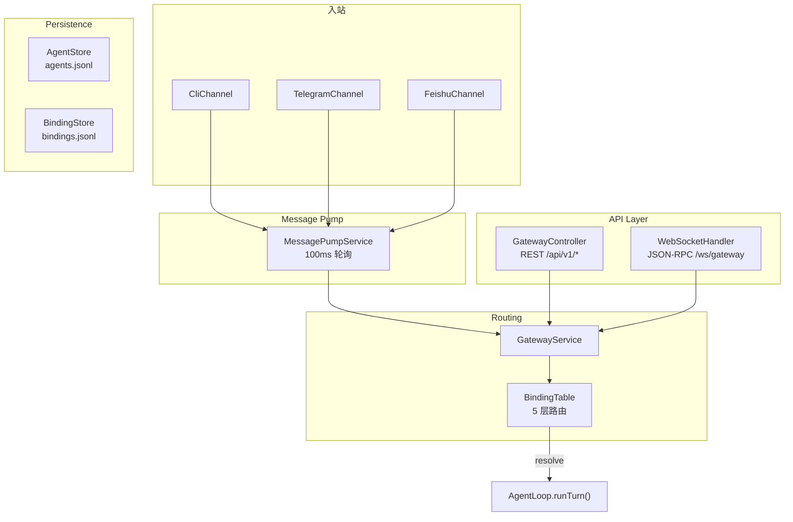

# Gateway -- "Route every message to the right agent"

## 1. 核心概念

Gateway 是 enterprise-claw-4j 的路由中枢, 负责将入站消息路由到正确的 Agent:

- **BindingTable**: 5 层路由绑定表, 使用 CopyOnWriteArrayList + 懒排序缓存. Tier 从 1 (最精确) 到 5 (默认), first-match-wins.
- **GatewayService**: 中央路由服务: resolve binding → build session → run agent turn → return result.
- **GatewayController**: REST API (CRUD agents, bindings, sessions, send message).
- **GatewayWebSocketHandler**: WebSocket JSON-RPC 2.0 (send, bindings, agents, sessions, status + 通知推送).
- **MessagePumpService**: 虚拟线程消息泵, 100ms 轮询所有 Channel, 路由到 GatewayService.
- **AgentManager**: ConcurrentHashMap 注册表, 管理 AgentConfig.
- **AgentStore / BindingStore**: JSONL 持久化, @PostConstruct 加载.

5 层路由 Tier:

| Tier | 匹配维度 | 示例 |
|------|---------|------|
| 1 | peer (精确用户) | Telegram 用户 123456 → agent-A |
| 2 | guild (群组) | 飞书群 "技术讨论" → agent-B |
| 3 | account (账户) | Bot A 的所有消息 → agent-C |
| 4 | channel (渠道) | 所有 Telegram 消息 → agent-D |
| 5 | default (默认) | 兜底 → luna |

关键抽象表:

| 组件 | 职责 |
|------|------|
| Binding | record: tier, key, agentId, priority, metadata |
| BindingTable | @Service: CopyOnWriteArrayList + 懒排序缓存 |
| BindingStore | @Service: JSONL 持久化 + ReentrantLock |
| AgentManager | @Service: ConcurrentHashMap 注册表 |
| AgentStore | @Service: JSONL 持久化 + 正则 ID 校验 |
| GatewayService | @Service: 路由 + 执行 |
| GatewayController | @RestController: /api/v1/* |
| GatewayWebSocketHandler | @Component: JSON-RPC 2.0 |
| MessagePumpService | @Service: 消息泵 |
| ResolvedBinding | record: agentId + matched Binding |

## 2. 架构图



## 3. 关键代码片段

### Binding -- 5 层路由规则

```java
public record Binding(
    int tier,        // 1=peer, 2=guild, 3=account, 4=channel, 5=default
    String key,      // 匹配键 (peer_id / guild_id / account_id / channel_name / "*")
    String agentId,  // 路由目标 Agent
    int priority,    // 同 tier 内优先级 (越小越优先)
    Map<String, Object> metadata
) implements Comparable<Binding> {
    @Override
    public int compareTo(Binding o) {
        int cmp = Integer.compare(this.tier, o.tier);
        return cmp != 0 ? cmp : Integer.compare(this.priority, o.priority);
    }
}
```

### BindingTable -- 懒排序缓存

```java
@Service
public class BindingTable {
    private final CopyOnWriteArrayList<Binding> bindings = new CopyOnWriteArrayList<>();
    private volatile List<Binding> sortedCache;  // 懒缓存

    public ResolvedBinding resolve(String channel, String peerId,
                                    String guildId, String accountId) {
        List<Binding> sorted = sortedCache;
        if (sorted == null) {
            sorted = bindings.stream().sorted().toList();
            sortedCache = sorted;
        }
        for (Binding b : sorted) {
            if (matches(b, channel, peerId, guildId, accountId)) {
                return new ResolvedBinding(b.agentId(), b);
            }
        }
        return null;
    }

    public void add(Binding binding) {
        bindings.add(binding);
        sortedCache = null;  // 失效缓存
    }
}
```

> 与 light 版 S05 的 `List<Binding>` + 每次排序不同, enterprise 版用 `volatile sortedCache` 实现懒缓存:
> 首次查询时排序并缓存, 后续查询直接使用缓存; 新增/删除绑定时将缓存置 null 失效, 下次查询重建。
> CopyOnWriteArrayList 保证读操作无锁, 适合读多写少的路由场景。

### GatewayService -- 路由 + 执行

```java
@Service
public class GatewayService {
    public RouteResult route(InboundMessage msg) {
        // 1. 解析绑定
        ResolvedBinding resolved = bindingTable.resolve(
            msg.channel(), msg.peerId(), msg.guildId(), msg.accountId());
        String agentId = resolved != null ? resolved.agentId() : defaultAgent;

        // 2. 构建 session key (基于 DmScope)
        AgentConfig config = agentManager.get(agentId);
        String sessionKey = agentManager.buildSessionKey(config, msg);

        // 3. 获取/创建 session
        List<MessageParam> messages = sessionStore.loadSession(agentId, sessionKey);

        // 4. 追加用户消息
        messages.add(MessageParam.builder()
            .role(Role.USER)
            .content(msg.text())
            .build());

        // 5. 运行 Agent
        AgentTurnResult result = agentLoop.runTurn(systemPrompt, messages, tools);

        // 6. 持久化
        sessionStore.appendTranscript(agentId, sessionKey, event);

        return new RouteResult(agentId, result.text());
    }
}
```

> GatewayService 是整个网关的编排中心: 它将路由解析 (BindingTable)、Agent 管理 (AgentManager)、
> 会话存储 (SessionStore)、Agent 执行 (AgentLoop) 串联为一条完整的处理管线。
> 与 light 版在 REPL 里手动调用不同, enterprise 版由 MessagePump 或 API 层自动触发。

### GatewayController -- REST API

```java
@RestController
@RequestMapping("/api/v1")
public class GatewayController {
    // Agent CRUD
    @PostMapping("/agents")
    @GetMapping("/agents")
    @GetMapping("/agents/{id}")
    @DeleteMapping("/agents/{id}")

    // Binding CRUD
    @PostMapping("/bindings")
    @GetMapping("/bindings")
    @DeleteMapping("/bindings/{id}")

    // Session 管理
    @GetMapping("/sessions")
    @DeleteMapping("/sessions/{id}")

    // 发送消息
    @PostMapping("/send")

    // 状态
    @GetMapping("/status")
}
```

> light 版通过 REPL 命令 (`/bindings`, `/agents`, `/sessions`) 管理网关, enterprise 版提供完整的 REST API。
> 所有异常由 `GlobalExceptionHandler` 统一处理, 映射为 HTTP 状态码和 JSON 错误响应。

### WebSocket JSON-RPC 2.0

```java
@Component
public class GatewayWebSocketHandler extends TextWebSocketHandler {
    // JSON-RPC 方法
    // send, bindings.set, bindings.list, bindings.remove
    // agents.list, agents.register, sessions.list, status

    // 广播通知
    void broadcast(String method, Object params) {
        String msg = toJsonRpcNotification(method, params);
        for (WebSocketSession s : sessions) {
            s.sendMessage(new TextMessage(msg));
        }
    }
    // 通知类型: typing, typing.stop, server.shutdown, heartbeat.output, cron.output
}
```

> 与 light 版的 `WebSocketServer` (Java-WebSocket 库) 不同, enterprise 版使用 Spring 的
> `TextWebSocketHandler`, 通过 `WebSocketConfig` 注册端点 `/ws/gateway`。
> 连接管理由 Spring 容器处理, 无需手动管理线程池。

### MessagePumpService -- 消息泵

```java
@Service
public class MessagePumpService {
    @PostConstruct
    void startPump() {
        Thread.ofVirtual().name("message-pump").start(() -> {
            while (running) {
                for (Channel channel : channelManager.getAll()) {
                    Optional<InboundMessage> msg = channel.receive();
                    if (msg.isPresent()) {
                        RouteResult result = gatewayService.route(msg.get());
                        channel.send(msg.get().peerId(), result.text());
                    }
                }
                Thread.sleep(Duration.ofMillis(100));
            }
        });
    }
}
```

> MessagePump 是 enterprise 版独有的组件, light 版没有对应物 (light 版用 REPL 直接交互)。
> 它解耦了渠道和网关: 渠道只负责收发消息, MessagePump 负责轮询和路由。
> 新增渠道 (如 Slack、Discord) 只需实现 Channel 接口, 无需修改网关代码。

## 4. REST API 参考

| 方法 | 路径 | 说明 |
|------|------|------|
| POST | /api/v1/agents | 注册 Agent |
| GET | /api/v1/agents | 列出所有 Agent |
| GET | /api/v1/agents/{id} | 获取 Agent 详情 |
| DELETE | /api/v1/agents/{id} | 删除 Agent |
| POST | /api/v1/bindings | 添加路由规则 |
| GET | /api/v1/bindings | 列出路由规则 |
| DELETE | /api/v1/bindings/{id} | 删除路由规则 |
| GET | /api/v1/sessions | 列出会话 |
| DELETE | /api/v1/sessions/{id} | 删除会话 |
| POST | /api/v1/send | 发送消息 (同步) |
| GET | /api/v1/status | 系统状态 |

### POST /api/v1/send

```json
{
  "channel": "cli",
  "peer_id": "user",
  "text": "你好"
}
```

Response:
```json
{
  "agent_id": "luna",
  "text": "你好！有什么可以帮你的吗？"
}
```

### POST /api/v1/bindings

```json
{
  "tier": 1,
  "key": "telegram:123456",
  "agent_id": "coding-assistant",
  "priority": 0
}
```

> REST API 与 light 版的 REPL 命令一一对应: `/agents` 对应 `/agents`, `/bindings` 对应 `/bindings`,
> `/send` 对应 REPL 中的直接输入。但 REST API 支持远程调用, 可被外部程序 (Web UI、CI/CD) 集成。

## 5. WebSocket JSON-RPC 参考

连接: `ws://localhost:8080/ws/gateway`

### 请求格式

```json
{
  "jsonrpc": "2.0",
  "method": "send",
  "params": {"channel": "cli", "peer_id": "user", "text": "你好"},
  "id": 1
}
```

### 通知 (服务器推送)

```json
{"jsonrpc": "2.0", "method": "typing", "params": {"agent_id": "luna"}}
{"jsonrpc": "2.0", "method": "heartbeat.output", "params": {"text": "..."}}
{"jsonrpc": "2.0", "method": "cron.output", "params": {"job_id": "...", "text": "..."}}
{"jsonrpc": "2.0", "method": "server.shutdown", "params": {"reason": "graceful"}}
```

> 与 light 版 S05 的 `ws://localhost:8765` 不同, enterprise 版使用 Spring WebSocket 端点
> `/ws/gateway`, 默认端口 8080。JSON-RPC 2.0 协议完全一致, 但通知类型更多:
> 除了 `typing`, 还有 `heartbeat.output`, `cron.output`, `server.shutdown`。

## 6. 与 light 版本的对比

| 维度 | light-claw-4j (S05) | enterprise-claw-4j |
|------|---------------------|-------------------|
| 路由 | 5 层 HashMap | 5 层 CopyOnWriteArrayList + 懒排序 |
| 持久化 | 无 | JSONL (AgentStore, BindingStore) |
| API | 无 | REST + WebSocket JSON-RPC |
| 消息泵 | 无 (直接 REPL) | MessagePumpService 虚拟线程 |
| Agent 管理 | 无 | AgentManager + CRUD API |
| 异常处理 | try-catch print | GlobalExceptionHandler → HTTP 状态码 |

> light 版 S05 的路由在单文件内实现, 用 `List<Binding>` 每次遍历时排序, 无持久化,
> 退出即丢失。enterprise 版将路由拆分为 BindingTable (内存路由) + BindingStore (JSONL 持久化),
> `@PostConstruct` 启动时自动加载, 运行时动态增删, 重启后规则不丢失。

## 7. 学习要点

1. **5 层路由表: 精确匹配优先**: Tier 1 (peer) 最精确, Tier 5 (default) 兜底. First-match-wins 保证确定性路由. 懒排序缓存在读多写少场景下高效.

2. **CopyOnWriteArrayList + volatile 缓存**: 绑定规则读远多于写. CopyOnWriteArrayList 保证读操作无锁; volatile sortedCache 在写时失效, 下次读时重建. 典型的读优化策略.

3. **REST + WebSocket 双协议**: REST 适合管理操作 (CRUD), WebSocket 适合实时交互 (send + typing 通知). JSON-RPC 2.0 提供标准化请求/响应格式.

4. **MessagePump 解耦渠道和网关**: 渠道只负责收发消息, MessagePump 负责轮询和路由. 新增渠道无需修改网关代码.

5. **GlobalExceptionHandler 统一错误响应**: 所有异常映射到 HTTP 状态码 (404 AgentException, 503 ProfileExhaustedException, 502 ChannelException), 返回统一 JSON 格式.
