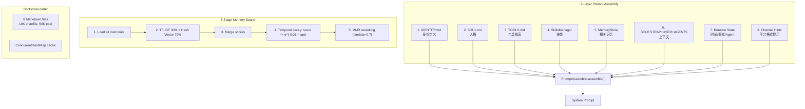

# Intelligence -- "8 layers of context, 5 stages of search"

## 1. 核心概念

Intelligence 模块负责构建 Agent 的智能行为: 系统提示词组装, 记忆检索, 技能发现:

- **PromptAssembler**: `@Service`, 8 层系统提示词组装 — 将多个 Markdown 文件、技能定义、记忆检索结果和运行时状态组装为完整的系统提示词.
- **MemoryStore**: `@Service`, 5 阶段混合检索管线 — 加载 → 双路搜索 (TF-IDF 30% + Hash向量 70%) → 合并 → 时间衰减 → MMR 重排序.
- **BootstrapLoader**: `@Service`, 加载 8 个工作区 Markdown 文件 (IDENTITY/SOUL/TOOLS/MEMORY/HEARTBEAT/BOOTSTRAP/USER/AGENTS.md), 支持 FULL/MINIMAL/NONE 模式.
- **SkillsManager**: `@Service`, 发现 workspace/skills/ 下的 SKILL.md 文件, 解析 YAML frontmatter, 注入系统提示词.

关键抽象表:

| 组件 | 职责 |
|------|------|
| PromptAssembler | `@Service`, 8 层提示词组装 |
| PromptContext | record: channel, isGroup, isHeartbeat, userMessage |
| MemoryStore | `@Service`, 5 阶段混合检索 |
| MemoryEntry | record: content, category, timestamp, source, score |
| BootstrapLoader | `@Service`, 8 个 MD 文件加载 + ConcurrentHashMap 缓存 |
| LoadMode | enum: FULL, MINIMAL, NONE |
| SkillsManager | `@Service`, SKILL.md 发现 + frontmatter 解析 |
| Skill | record: name, description, version, body, sourcePath |

## 2. 架构图



## 3. 关键代码片段

### PromptAssembler -- 8 层组装

```java
@Service
public class PromptAssembler {
    public String assemble(PromptContext ctx, String agentId, String model) {
        StringBuilder sb = new StringBuilder();

        // Layer 1: 身份定义
        String identity = bootstrapLoader.load("IDENTITY.md");
        if (identity != null) sb.append(identity).append("\n\n");

        // Layer 2: 人格
        String soul = bootstrapLoader.load("SOUL.md");
        if (soul != null) sb.append(soul).append("\n\n");

        // Layer 3: 工具指南
        String tools = bootstrapLoader.load("TOOLS.md");
        if (tools != null) sb.append(tools).append("\n\n");

        // Layer 4: 技能
        String skills = skillsManager.renderPromptBlock();
        if (skills != null) sb.append(skills).append("\n\n");

        // Layer 5: 相关记忆
        if (ctx.userMessage() != null) {
            List<MemoryEntry> memories = memoryStore.hybridSearch(ctx.userMessage(), 5);
            if (!memories.isEmpty()) {
                sb.append("## Relevant Memories\n");
                memories.forEach(m -> sb.append("- ").append(m.content()).append("\n"));
                sb.append("\n");
            }
        }

        // Layer 6: 启动上下文 + 用户信息 + Agent 说明
        String bootstrap = bootstrapLoader.load("BOOTSTRAP.md");
        String user = bootstrapLoader.load("USER.md");
        String agents = bootstrapLoader.load("AGENTS.md");
        // ... append if present

        // Layer 7: 运行时状态
        sb.append("## Current State\n");
        sb.append("- Time: ").append(Instant.now()).append("\n");
        sb.append("- Agent: ").append(agentId).append("\n");
        sb.append("- Model: ").append(model).append("\n");

        // Layer 8: 渠道提示
        if ("telegram".equals(ctx.channel())) {
            sb.append("\n## Platform Notes\n");
            sb.append("Respond in Markdown. Avoid overly long messages.\n");
        }

        return sb.toString();
    }
}
```

> 与 light 版 S06 的 `buildSystemPrompt()` 内联函数不同, enterprise 版将提示词组装抽取为独立 `@Service`.
> `PromptContext` 作为 record 传入, 携带渠道、心跳标记、用户消息等上下文信息, 解耦了组装逻辑与调用方.

### MemoryStore -- 5 阶段混合检索

```java
@Service
public class MemoryStore {
    // Stage 1: 加载所有记忆 (evergreen + daily)
    // evergreen: workspace/MEMORY.md 解析
    // daily: workspace/memory/*.jsonl 逐行读取

    // Stage 2: 双路搜索
    double tfidfScore(String query, MemoryEntry entry) {
        // TF-IDF 关键词匹配 (权重 30%)
        // 自定义 tokenizer 支持 CJK 字符 + 双语停用词
        // 文档频率缓存, 增量更新
    }

    double vectorScore(String query, MemoryEntry entry) {
        // Hash 向量匹配 (权重 70%)
        // 64 维随机投影 (token hash seed)
        // 余弦相似度
    }

    // Stage 3: 合并得分
    // mergedScore = 0.3 * tfidf + 0.7 * vector

    // Stage 4: 时间衰减
    // score *= Math.exp(-0.01 * ageInDays)

    // Stage 5: MMR 重排序 (lambda=0.7)
    List<MemoryEntry> mmrRerank(List<MemoryEntry> candidates, double lambda) {
        // Maximal Marginal Relevance
        // 平衡相关性和多样性
        // Jaccard 相似度计算冗余度
    }

    public List<MemoryEntry> hybridSearch(String query, int topK) {
        // 5 stage pipeline
    }
}
```

> 搜索管线与 light 版 S06 的混合检索逻辑一致, 但 enterprise 版将其封装为 `@Service`,
> 支持依赖注入和配置化权重 (TF-IDF / Hash Vector 比例可调).
> `MemoryEntry` 新增 `category` 和 `source` 字段, 支持按类别和来源过滤.

### BootstrapLoader -- 8 文件加载 + 缓存

```java
@Service
public class BootstrapLoader {
    private static final List<String> FILES = List.of(
        "IDENTITY.md", "SOUL.md", "TOOLS.md", "MEMORY.md",
        "HEARTBEAT.md", "BOOTSTRAP.md", "USER.md", "AGENTS.md");
    private static final int MAX_FILE_CHARS = 10_000;
    private static final int MAX_TOTAL_CHARS = 50_000;

    private final ConcurrentHashMap<String, String> cache = new ConcurrentHashMap<>();

    @PostConstruct
    void init() {
        for (String file : FILES) load(file);
    }

    public String load(String filename) {
        return cache.computeIfAbsent(filename, this::readFile);
    }

    public void reload() {
        cache.clear();
        init();
    }
}
```

> 与 light 版 S06 的 `BootstrapLoader` 直接 `Files.readString` 不同, enterprise 版增加了 `ConcurrentHashMap` 缓存,
> 启动时预加载所有文件 (`@PostConstruct`), 运行时从缓存读取. `reload()` 方法清空缓存并重新加载,
> 支持运行时热更新配置文件. 单文件上限 10K, 总计上限 50K, 比 light 版 (20K/150K) 更保守,
> 为多 Agent 并发场景留出更多 Token 空间.

### SkillsManager -- SKILL.md 发现

```java
@Service
public class SkillsManager {
    private static final int MAX_SKILLS = 150;
    private static final int MAX_TOTAL_CHARS = 30_000;

    // 从多个目录扫描 SKILL.md 文件
    // 解析 YAML frontmatter: name, description, invocation, version
    // 按目录优先级排序
    // 限制: 最多 150 个技能, 总字符数 30K

    public String renderPromptBlock() {
        StringBuilder sb = new StringBuilder("## Available Skills\n");
        for (Skill skill : skills) {
            sb.append("### ").append(skill.name()).append("\n");
            sb.append(skill.description()).append("\n");
            sb.append("Invocation: ").append(skill.invocation()).append("\n\n");
            sb.append(skill.body()).append("\n\n");
        }
        return sb.toString();
    }
}
```

> light 版的 `SkillsManager` 是普通类, enterprise 版升级为 `@Service`, 支持依赖注入.
> 技能上限从隐式限制变为显式常量 (150 个 / 30K 字符), 防止技能过多导致提示词溢出.
> `Skill` record 包含 `sourcePath`, 支持按来源追溯和去重.

### MemoryEntry -- 记忆条目

```java
public record MemoryEntry(
    String content,     // 记忆内容
    String category,    // 分类 (general/preference/fact/etc.)
    Instant timestamp,  // 时间戳
    String source,      // 来源 ("daily"/"evergreen")
    double score        // 检索得分 (搜索时填充)
) {}
```

> 与 light 版的匿名 Map 表示不同, enterprise 版使用 record 类型, 字段不可变, 类型安全.
> `category` 支持按分类过滤, `source` 区分永久记忆和每日记忆, `score` 在检索时填充.

## 4. 工作区文件说明

| 文件 | 用途 | 限制 |
|------|------|------|
| IDENTITY.md | Agent 身份和角色定义 | 10K chars |
| SOUL.md | 人格和沟通风格 | 10K chars |
| TOOLS.md | 工具使用指南 | 10K chars |
| MEMORY.md | 永久记忆 (evergreen) | 10K chars |
| HEARTBEAT.md | 心跳检查指令 | 10K chars |
| BOOTSTRAP.md | 额外启动上下文 | 10K chars |
| USER.md | 用户特定信息 | 10K chars |
| AGENTS.md | 多 Agent 协作说明 | 10K chars |

技能目录结构:
```
workspace/skills/
└── example-skill/
    └── SKILL.md
        ---
        name: example-skill
        description: A sample skill
        invocation: /example
        ---
        # Skill Instructions
        ...
```

## 5. 与 light 版本的对比

| 维度 | light-claw-4j (S06) | enterprise-claw-4j |
|------|---------------------|-------------------|
| 提示词层数 | 8 层 (内联构建) | 8 层 (PromptAssembler `@Service`) |
| 记忆检索 | 简单关键词匹配 | 5 阶段混合 (TF-IDF + 向量 + 衰减 + MMR) |
| 技能 | 无 | SkillsManager: SKILL.md + frontmatter |
| 文件加载 | 直接 Files.readString | BootstrapLoader + ConcurrentHashMap 缓存 |
| 加载模式 | 无 | FULL / MINIMAL / NONE |
| Token 限制 | 无 | 单文件 10K, 总计 50K |

## 6. 学习要点

1. **8 层提示词构建可维护性**: 每层有独立来源 (文件/服务/运行时), 修改某层不影响其他层. 分层组装比一个超大 prompt 文件更易维护.

2. **5 阶段混合检索平衡精度和多样性**: TF-IDF 捕捉关键词匹配, Hash 向量捕捉语义相似度, 时间衰减保证新信息优先, MMR 减少冗余. 四种策略组合优于单一策略.

3. **Hash 向量: 无需外部模型**: 64 维随机投影从 token hash 生成, 不依赖 Embedding 模型. 适合自包含部署场景.

4. **ConcurrentHashMap 缓存 + reload()**: 文件变更后调用 `reload()` 清空缓存, 下次 `load()` 时重新读取. 适合运行时更新配置文件.

5. **技能系统通过 SKILL.md 实现 Zero-Code 扩展**: 新增技能只需在 skills/ 下创建目录 + SKILL.md, 无需写 Java 代码. YAML frontmatter 定义元数据, Markdown body 定义行为.
