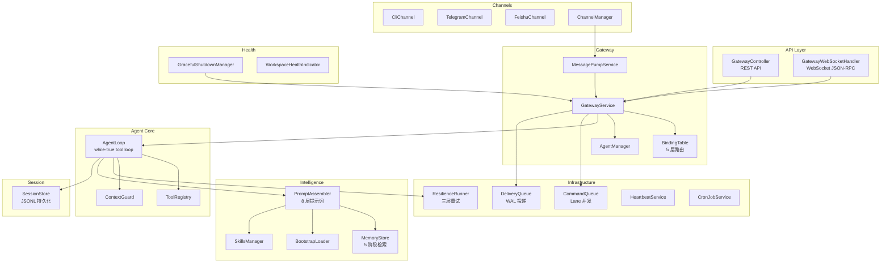
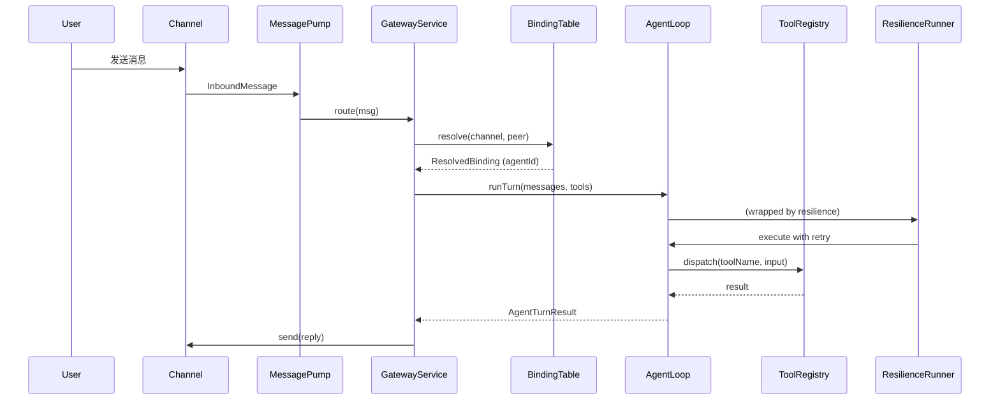

# enterprise-claw-4j 概览 -- "From light scripts to enterprise services"

## 1. 核心概念

enterprise-claw-4j 是 light-claw-4j 的企业级重写。light-claw-4j 用 10 个单文件 Session (S01-S10) 渐进式构建 Agent 网关；enterprise-claw-4j 将全部 10 个 Session 的功能整合为一个 Spring Boot 3.5.3 应用，采用模块化包结构、依赖注入、外部化配置、容器化部署。

核心公式：

```
light-claw-4j:   10 个独立 Session 文件 → 手动组装 → main() 启动
enterprise-claw-4j: 14 个包 80+ 类 → Spring 容器管理 → Docker/K8s 部署
```

关键差异对比表：

| 维度 | light-claw-4j | enterprise-claw-4j |
|------|--------------|-------------------|
| 框架 | 单文件 Java (Maven) | Spring Boot 3.5.3 |
| 包结构 | 10 个 Session 文件 + common/ | 14 个包，80+ 类 |
| 配置 | .env 文件 | application.yml + @ConfigurationProperties |
| 生命周期 | main() 方法 | Spring 容器管理 (@PostConstruct / @PreDestroy) |
| 渠道 | CLI only (S04 有 Telegram/飞书骨架) | CLI + Telegram + 飞书，条件注册 |
| API | 无 | REST API + WebSocket JSON-RPC |
| 部署 | mvn exec:java | Docker / K8s |
| 线程 | 手动 Thread.ofVirtual() | Spring 虚拟线程 + @Scheduled |
| 会话 | JSONL 文件 | JSONL + 元数据索引 + DmScope 隔离 |
| 记忆 | 文件读写 | 5 阶段混合检索 (TF-IDF + 向量 + 时间衰减 + MMR) |
| 关闭 | Ctrl+C | 5 步优雅关闭 (SmartLifecycle) |

## 2. 架构图

### 包关系图



### 请求流程



## 3. 项目结构

```
enterprise-claw-4j/
├── pom.xml                              # Spring Boot 3.5.3 + Java 21
├── Dockerfile                           # 多阶段构建 (JDK → JRE Alpine)
├── docker-compose.yml                   # 单节点部署
├── k8s/                                 # Kubernetes 部署清单
│   └── deployment.yaml                  # Deployment + Service + PVC
├── .env.example                         # 环境变量模板
├── src/main/java/com/openclaw/enterprise/
│   ├── EnterpriseClaw4jApplication.java # @SpringBootApplication 入口
│   ├── agent/                           # Agent 核心
│   │   ├── AgentConfig.java             # Agent 配置 (id, name, model, dmScope)
│   │   ├── AgentLoop.java               # while-true 工具调用循环
│   │   ├── AgentTurnResult.java         # 转结果 (text, toolCalls, tokens)
│   │   ├── ContextGuard.java            # 3 阶段上下文溢出恢复
│   │   ├── DmScope.java                 # 会话隔离粒度枚举
│   │   ├── TokenUsage.java              # Token 使用统计
│   │   └── ToolCallRecord.java          # 工具调用记录
│   ├── auth/                            # 认证扩展点
│   │   ├── AuthFilter.java              # 认证过滤器接口
│   │   └── DefaultAuthFilter.java       # 默认: 允许所有请求
│   ├── channel/                         # 多渠道消息
│   │   ├── Channel.java                 # 渠道接口
│   │   ├── ChannelManager.java          # 渠道生命周期管理
│   │   ├── InboundMessage.java          # 统一入站消息
│   │   ├── MediaAttachment.java         # 媒体附件
│   │   └── impl/                        # 渠道实现
│   │       ├── CliChannel.java          # 终端交互
│   │       ├── TelegramChannel.java     # Telegram Bot
│   │       ├── FeishuChannel.java       # 飞书机器人
│   │       └── FeishuWebhookController.java  # 飞书 Webhook 端点
│   ├── common/                          # 公共工具
│   │   ├── Claw4jException.java         # 业务异常基类
│   │   ├── FileUtils.java               # 原子写入, 安全路径
│   │   ├── JsonUtils.java               # Jackson JSON 工具
│   │   ├── TokenEstimator.java          # Token 估算器
│   │   └── exceptions/                  # 异常层次 (7 种)
│   ├── concurrency/                     # Lane 并发控制
│   │   ├── CommandQueue.java            # 中央调度器
│   │   ├── LaneQueue.java               # FIFO 队列 + generation 取消
│   │   ├── LaneStatus.java              # Lane 状态快照
│   │   └── QueuedItem.java              # 队列条目
│   ├── config/                          # Spring 配置
│   │   ├── AnthropicConfig.java         # API 客户端 Bean
│   │   ├── AppConfig.java               # 全局配置 + 工作空间初始化
│   │   ├── AppProperties.java           # 所有 @ConfigurationProperties
│   │   ├── ConcurrencyProperties.java   # Lane 配置
│   │   ├── SchedulingConfig.java        # @EnableScheduling + 虚拟线程池
│   │   └── WebSocketConfig.java         # WebSocket 端点注册
│   ├── delivery/                        # 可靠投递
│   │   ├── DeliveryQueue.java           # WAL 持久化队列
│   │   ├── DeliveryRunner.java          # @Scheduled 投递轮询
│   │   ├── MessageChunker.java          # 渠道感知分片
│   │   └── QueuedDelivery.java          # 投递条目
│   ├── gateway/                         # 网关路由
│   │   ├── AgentManager.java            # Agent 注册表
│   │   ├── AgentStore.java              # Agent 配置持久化
│   │   ├── Binding.java                 # 5 层路由规则
│   │   ├── BindingStore.java            # 路由规则持久化
│   │   ├── BindingTable.java            # 路由解析 (懒排序缓存)
│   │   ├── GatewayController.java       # REST API
│   │   ├── GatewayService.java          # 路由 + 执行
│   │   ├── GatewayWebSocketHandler.java # WebSocket JSON-RPC
│   │   ├── GlobalExceptionHandler.java  # 统一异常处理
│   │   ├── MessagePumpService.java      # 消息泵 (渠道 → 网关)
│   │   └── ResolvedBinding.java         # 解析结果
│   ├── health/                          # 可观测性
│   │   ├── GracefulShutdownManager.java # 5 步优雅关闭
│   │   └── WorkspaceHealthIndicator.java # Actuator 健康检查
│   ├── intelligence/                    # 智能层
│   │   ├── BootstrapLoader.java         # 8 个 Markdown 文件加载
│   │   ├── LoadMode.java                # FULL/MINIMAL/NONE
│   │   ├── MemoryEntry.java             # 记忆条目
│   │   ├── MemoryStore.java             # 5 阶段混合检索
│   │   ├── PromptAssembler.java         # 8 层系统提示词组装
│   │   ├── PromptContext.java           # 提示词上下文
│   │   ├── Skill.java                   # 技能定义
│   │   └── SkillsManager.java           # 技能发现与加载
│   ├── resilience/                      # 弹性重试
│   │   ├── AuthProfile.java             # API Key 配置 + 冷却追踪
│   │   ├── FailoverReason.java          # 密封接口: 6 种失败原因
│   │   ├── ProfileManager.java          # 配置选择与冷却管理
│   │   └── ResilienceRunner.java        # 三层重试洋葱
│   ├── scheduler/                       # 定时任务
│   │   ├── CronJob.java                 # 定时任务实体
│   │   ├── CronJobService.java          # @Scheduled 定时触发
│   │   ├── CronPayload.java             # 密封接口: AgentTurn/SystemEvent
│   │   ├── CronPayloadDeserializer.java # Jackson 多态反序列化
│   │   ├── CronSchedule.java            # 密封接口: At/Every/CronExpression
│   │   ├── CronScheduleDeserializer.java
│   │   └── HeartbeatService.java        # @Scheduled 心跳
│   ├── session/                         # 会话持久化
│   │   ├── SessionMeta.java             # 会话元数据
│   │   ├── SessionStore.java            # JSONL 追加/重放
│   │   └── TranscriptEvent.java         # 事件记录
│   └── tool/                            # 工具系统
│       ├── ToolDefinition.java          # 工具定义
│       ├── ToolHandler.java             # 工具处理器接口
│       ├── ToolRegistry.java            # 自动注册 + 分发
│       └── handlers/                    # 6 个内置工具
│           ├── BashToolHandler.java
│           ├── EditFileToolHandler.java
│           ├── MemorySearchToolHandler.java
│           ├── MemoryWriteToolHandler.java
│           ├── ReadFileToolHandler.java
│           └── WriteFileToolHandler.java
├── src/main/resources/
│   ├── application.yml                  # 主配置
│   ├── application-dev.yml              # 开发环境
│   ├── application-prod.yml             # 生产环境
│   └── logback-spring.xml               # 日志配置
└── workspace/                           # 运行时工作区
    ├── IDENTITY.md                      # 身份定义
    ├── SOUL.md                          # 人格
    ├── TOOLS.md                         # 工具指南
    ├── MEMORY.md                        # 永久记忆
    ├── HEARTBEAT.md                     # 心跳指令
    ├── BOOTSTRAP.md                     # 启动上下文
    ├── USER.md                          # 用户信息
    ├── AGENTS.md                        # 多 Agent 说明
    ├── CRON.json                        # 定时任务配置
    └── skills/                          # 技能定义目录
        └── example-skill/
            └── SKILL.md
```

## 4. Spring Boot 集成点

enterprise-claw-4j 深度集成 Spring Boot 生态，以下是关键注解的使用位置：

| 注解 | 用途 |
|------|------|
| @SpringBootApplication | 入口类 `EnterpriseClaw4jApplication` |
| @Service | 业务逻辑 (AgentLoop, SessionStore, GatewayService, MemoryStore 等) |
| @Component | 渠道实现、工具处理器、WebSocket Handler |
| @Configuration | AnthropicConfig, AppConfig, SchedulingConfig, WebSocketConfig |
| @ConfigurationProperties | AppProperties, AnthropicProperties, ConcurrencyProperties 等 |
| @RestController | GatewayController, FeishuWebhookController |
| @Scheduled | DeliveryRunner, CronJobService, HeartbeatService |
| @PostConstruct | 初始化 (工作空间创建、持久化数据加载) |
| @PreDestroy | 清理 (MessagePump 停止、资源释放) |
| @ConditionalOnProperty | Telegram / Feishu 渠道按需注册 |
| SmartLifecycle | GracefulShutdownManager (最后关闭，最先停止接收请求) |

典型用法示例：

```java
// 条件注册: 只在配置启用时才创建 Telegram 渠道
@Component
@ConditionalOnProperty(name = "claw4j.channels.telegram.enabled", havingValue = "true")
public class TelegramChannel implements Channel { ... }

// SmartLifecycle: 优雅关闭
@Component
public class GracefulShutdownManager implements SmartLifecycle {
    @Override
    public int getPhase() { return Integer.MAX_VALUE; } // 最后关闭
    @Override
    public void stop(Runnable callback) { /* 5 步关闭 */ callback.run(); }
}
```

## 5. 依赖说明

| 依赖 | 版本 | 用途 |
|------|------|------|
| spring-boot-starter-web | 3.5.3 | REST API + 内嵌 Tomcat |
| spring-boot-starter-websocket | 3.5.3 | WebSocket 支持 |
| spring-boot-starter-actuator | 3.5.3 | 健康检查 + 指标 |
| spring-boot-starter-validation | 3.5.3 | 参数校验 |
| spring-retry | - | 声明式重试 |
| anthropic-java | 2.19.0 | Anthropic Claude API SDK |
| jackson-dataformat-yaml | - | YAML 配置解析 |
| dotenv-java | 3.0.0 | .env 文件加载 |
| cron-utils | 9.2.1 | Cron 表达式解析 |
| logstash-logback-encoder | - | JSON 结构化日志 |

所有 Spring Boot Starter 版本由 `spring-boot-starter-parent` 统一管理，无需单独指定。

## 6. 设计模式

enterprise-claw-4j 中使用了多种经典与现代设计模式：

### 6.1 Strategy 模式 -- Channel 接口 / ToolHandler 接口

渠道和工具都以接口抽象，运行时通过 Spring 自动注入具体实现。新增渠道只需实现 `Channel` 接口并加 `@Component`；新增工具只需实现 `ToolHandler` 接口。

```java
public interface Channel { void send(String peerId, String text); }
public interface ToolHandler { String execute(Map<String, Object> input); }
```

### 6.2 Sealed Interface + Pattern Matching -- CronSchedule / CronPayload / FailoverReason

利用 Java 21 的 sealed interface 和 switch pattern matching 实现类型安全的多态。编译器保证 switch 覆盖所有子类型，不会遗漏分支。

```java
public sealed interface CronSchedule permits At, Every, CronExpression { }
// switch 中使用 pattern matching，编译器穷举检查
String desc = switch (schedule) {
    case At a      -> "at " + a.time();
    case Every e   -> "every " + e.interval();
    case CronExpression c -> c.expression();
};
```

### 6.3 Template Method 模式 -- ToolHandler.execute()

`ToolHandler` 定义统一的执行模板，子类只需关注具体的工具逻辑。`ToolRegistry` 负责调度、日志、异常包装。

### 6.4 Chain of Responsibility -- ContextGuard 3 阶段恢复

上下文溢出时按 3 个阶段逐级尝试恢复：截断工具结果 → 裁剪历史消息 → 重置会话。每一阶段独立工作，前一个阶段失败才进入下一个。

### 6.5 Observer / Broadcast -- WebSocket 通知

GatewayService 在处理完消息后，通过 `GatewayWebSocketHandler` 向所有连接的 WebSocket 客户端广播状态更新。客户端无需轮询。

### 6.6 WAL (Write-Ahead Log) -- DeliveryQueue

投递队列在发送消息前先将内容持久化到磁盘，发送成功后标记完成。进程崩溃后重启时自动重放未完成的消息，保证不丢失。

### 6.7 Generation-Based Invalidation -- LaneQueue

每个 Lane 维护一个 generation 计数器。新消息到达时递增 generation，旧消息被标记为过期自动跳过。避免手动取消带来的并发问题。

### 6.8 Lazy Cache with Invalidated Sort -- BindingTable

绑定规则列表在首次查询时排序并缓存，新增或修改规则时标记缓存失效。下次查询时重新排序。读多写少场景下的最优策略。

### 6.9 Conditional Bean Registration -- @ConditionalOnProperty

Telegram 和飞书渠道通过 `@ConditionalOnProperty` 实现按需注册。未配置的渠道不会创建 Bean，不占用资源，也不会启动连接。

## 7. 学习要点

enterprise-claw-4j 相比 light-claw-4j，在学习曲线上有几个关键跳跃点：

### 7.1 从单文件到模块化

light-claw-4j 的每个 Session 是一个独立的 Java 文件，手动 `new` 出依赖对象。enterprise-claw-4j 用 Spring 依赖注入替代手动实例化：`@Service` 标记业务类，`@Component` 标记基础设施类，构造器注入保证不可变性。

**核心转变**: "谁来创建对象" 从开发者代码转移到 Spring 容器。

### 7.2 Java 21 现代特性

企业版充分利用 Java 21 的语言特性：

- **sealed interface** -- `CronSchedule`, `CronPayload`, `FailoverReason` 等密封接口，编译器穷举检查
- **pattern matching** -- switch 表达式中直接匹配类型和拆解字段
- **virtual threads** -- Spring Boot 3.5.3 原生支持虚拟线程，无需手动 `Thread.ofVirtual()`
- **records** -- `Binding`, `MemoryEntry`, `InboundMessage` 等不可变数据载体

### 7.3 外部化配置

light-claw-4j 用 `.env` 文件 + `System.getenv()` 读取配置。enterprise-claw-4j 用 `@ConfigurationProperties` 将配置映射为类型安全的 Java 对象，支持多环境 profile (`application-dev.yml`, `application-prod.yml`)，配置验证由 Bean Validation 自动完成。

**核心转变**: "字符串环境变量" 到 "类型安全的配置类"。

### 7.4 生产就绪

企业版添加了完整的生产级基础设施：

- **健康检查** -- `WorkspaceHealthIndicator` 集成 Spring Boot Actuator，`/actuator/health` 端点可被监控系统调用
- **优雅关闭** -- `GracefulShutdownManager` 实现 `SmartLifecycle`，5 步关闭保证消息不丢失
- **结构化日志** -- logstash-logback-encoder 输出 JSON 格式日志，方便 ELK / Loki 采集
- **容器化** -- Dockerfile 多阶段构建 (JDK 编译 → JRE Alpine 运行)，docker-compose.yml 单节点部署，k8s/ 目录提供 Kubernetes 部署清单

### 7.5 线程安全

多渠道并发场景下，enterprise-claw-4j 大量使用并发原语：

- **ConcurrentHashMap** -- Agent 注册表、渠道管理器、绑定表等读多写少场景
- **ReentrantLock** -- Lane 队列的入队/出队操作需要互斥
- **volatile** -- `GracefulShutdownManager` 的运行状态标志，保证多线程可见性
- **CopyOnWriteArrayList** -- WebSocket 连接列表，读远多于写

**核心原则**: 共享可变状态必须受并发原语保护，不可变对象 (record, String) 天然线程安全。
