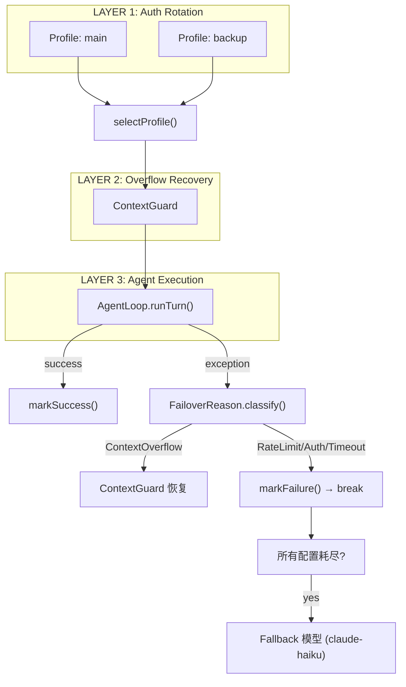

# Resilience -- "When one profile fails, rotate to the next"

## 1. 核心概念

Resilience 模块实现三层重试洋葱, 处理 LLM API 调用的各种失败:

- **ResilienceRunner**: @Service, 三层嵌套 — Layer 1 (Auth Profile 轮换) → Layer 2 (Context Overflow 恢复) → Layer 3 (AgentLoop 执行).
- **ProfileManager**: @Service, 管理多个 AuthProfile, 选择第一个非冷却的配置.
- **AuthProfile**: API Key 配置 + volatile 冷却追踪 (cooldownUntil, failureReason, lastGoodAt). 双重检查锁定缓存 AnthropicClient.
- **FailoverReason**: sealed interface, 6 种失败变体, 各带不同冷却时间.

FailoverReason 冷却时间表:

| 原因 | 冷却时间 |
|------|----------|
| RateLimit (429) | 120s |
| AuthError (401/403) | 300s |
| Timeout | 60s |
| Billing (402) | 300s |
| ContextOverflow | 0s (原地恢复) |
| Unknown | 120s |

关键抽象表:

| 组件 | 职责 |
|------|------|
| ResilienceRunner | @Service: 三层重试洋葱 |
| ProfileManager | @Service: 配置选择与冷却管理 |
| AuthProfile | API Key + volatile 冷却状态 + 双重检查锁定客户端缓存 |
| FailoverReason | sealed interface: 6 种失败原因 + 冷却时间 |
| ContextOverflowException | 上下文溢出异常 (携带 estimatedTokens + budget) |
| ProfileExhaustedException | 所有配置耗尽异常 |

## 2. 架构图



## 3. 关键代码片段

### FailoverReason -- sealed interface + pattern matching

```java
public sealed interface FailoverReason {
    int cooldownSeconds();

    static FailoverReason classify(Exception exc) {
        // 1. 尝试提取 HTTP 状态码 (反射 + 正则)
        // 2. 按状态码分类: 429→RateLimit, 401/403→AuthError, 402→Billing
        // 3. 按消息文本分类: timeout→Timeout, context/token/overflow→ContextOverflow
        // 4. 默认: Unknown
    }

    record RateLimit() implements FailoverReason {
        public int cooldownSeconds() { return 120; }
    }
    record AuthError() implements FailoverReason {
        public int cooldownSeconds() { return 300; }
    }
    record Timeout() implements FailoverReason {
        public int cooldownSeconds() { return 60; }
    }
    record Billing() implements FailoverReason {
        public int cooldownSeconds() { return 300; }
    }
    record ContextOverflow() implements FailoverReason {
        public int cooldownSeconds() { return 0; }
    }
    record Unknown() implements FailoverReason {
        public int cooldownSeconds() { return 120; }
    }
}
```

### AuthProfile -- volatile 冷却 + 双重检查锁定

```java
public class AuthProfile {
    private volatile double cooldownUntil = 0;
    private volatile String failureReason;
    private volatile double lastGoodAt;
    private volatile AnthropicClient cachedClient;

    public AnthropicClient getOrCreateClient() {
        if (cachedClient != null) return cachedClient;
        synchronized (this) {
            if (cachedClient == null) {
                cachedClient = AnthropicClient.builder()
                    .apiKey(apiKey)
                    .baseUrl(baseUrl)
                    .build();
            }
            return cachedClient;
        }
    }

    public void markFailure(FailoverReason reason) {
        this.failureReason = reason.getClass().getSimpleName();
        this.cooldownUntil = epochSeconds() + reason.cooldownSeconds();
    }

    public boolean isAvailable() {
        return epochSeconds() >= cooldownUntil;
    }
}
```

### ProfileManager -- 选择非冷却配置

```java
@Service
public class ProfileManager {
    private final List<AuthProfile> profiles;

    public ProfileManager(AnthropicProperties props) {
        this.profiles = props.profiles().stream()
            .filter(p -> p.apiKey() != null && !p.apiKey().isBlank())
            .map(p -> new AuthProfile(p.name(), p.apiKey(), p.baseUrl()))
            .toList();
    }

    public AuthProfile selectProfile() {
        for (AuthProfile p : profiles) {
            if (p.isAvailable()) return p;
        }
        return null;  // 全部冷却中
    }
}
```

### ResilienceRunner -- 三层洋葱

```java
@Service
public class ResilienceRunner {
    public AgentTurnResult run(String system, List<MessageParam> messages,
                                List<ToolUnion> tools) {
        int maxIter = Math.min(Math.max(3 + 5 * profiles.size(), 32), 160);

        for (int rotation = 0; rotation < profiles.size(); rotation++) {
            AuthProfile profile = profileManager.selectProfile();
            if (profile == null) break;

            AnthropicClient client = profile.getOrCreateClient();

            try {
                return agentLoop.runTurn(system, messages, tools, client, model);
            } catch (Exception exc) {
                FailoverReason reason = FailoverReason.classify(exc);

                if (reason instanceof FailoverReason.ContextOverflow) {
                    // Layer 2: ContextGuard 恢复
                    messages = contextGuard.guard(messages, budget, client, model);
                    rotation--;  // 不消耗 profile 轮次
                    continue;
                }

                profile.markFailure(reason);
                // break to next profile (Layer 1)
            }
        }

        // Fallback: 降级到 claude-haiku
        return tryFallback(system, messages, tools);
    }
}
```

## 4. 配置

```yaml
# application.yml -- 多 Profile 配置
anthropic:
  model-id: claude-sonnet-4-20250514
  max-tokens: 8096
  profiles:
    - name: main
      api-key: ${ANTHROPIC_API_KEY}
      base-url: ${ANTHROPIC_BASE_URL:}
    - name: backup
      api-key: ${ANTHROPIC_API_KEY_BACKUP:}
      base-url: ${ANTHROPIC_BASE_URL_BACKUP:}
```

## 5. 与 light 版本的对比

| 维度 | light-claw-4j (S09) | enterprise-claw-4j |
|------|---------------------|-------------------|
| 重试结构 | 三层嵌套 for 循环 | ResilienceRunner @Service |
| 失败分类 | enum + switch | sealed interface + pattern matching |
| 配置管理 | 内部 List | @ConfigurationProperties 外部化 |
| 客户端缓存 | 每次创建 | 双重检查锁定缓存 |
| 异常层次 | RuntimeException | ProfileExhaustedException + ContextOverflowException |
| Fallback | 硬编码 | 可配置模型链 |

## 6. 学习要点

1. **sealed interface + record 实现类型安全的原因分类**: 6 种 FailoverReason 各自是 record, 编译器保证 switch 完整性. 比 enum 更灵活, 每个 variant 可以携带不同数据.

2. **volatile 冷却追踪 + 双重检查锁定**: AuthProfile 的 cooldownUntil 和 cachedClient 使用 volatile 保证可见性. getOrCreateClient() 用 DCL 避免重复创建 AnthropicClient.

3. **三层洋葱: 外层轮换, 中层恢复, 内层执行**: Layer 1 轮换 profile, Layer 2 处理 overflow (不消耗轮次), Layer 3 实际执行. overflow 时 rotation-- 回退, 让同一个 profile 重试.

4. **Fallback 模型降级**: 所有 profile 耗尽后降级到 claude-haiku. 生产环境中可以配置多条 fallback 链.

5. **FailoverReason.classify() 先提取 HTTP 状态码**: SDK 异常可能包含 HTTP 状态码. classify() 先通过反射和正则提取状态码, 再按消息文本匹配, 提高分类准确性.
