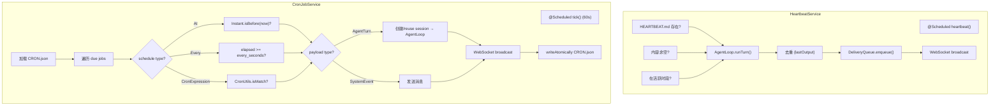

# Scheduler -- "Time-based triggers for proactive agents"

## 1. 核心概念

Scheduler 模块实现基于时间的主动式 Agent 行为:

- **HeartbeatService**: @Service, @Scheduled 心跳检查. 3 个前置检查: HEARTBEAT.md 存在 + 内容非空 + 在活跃时段内. 执行心跳 via AgentLoop, 去重防重复.
- **CronJobService**: @Service, @Scheduled (60s) 定时触发. 支持三种调度类型: At (一次性), Every (固定间隔), CronExpression (标准 cron). 两种负载: AgentTurn (调用 Agent) 和 SystemEvent (发送消息).
- **CronSchedule**: sealed interface, 三种调度变体 -- `At(Instant)`, `Every(int seconds)`, `CronExpression(String)`. 自定义 Jackson 反序列化器.
- **CronPayload**: sealed interface, 两种负载 -- `AgentTurn(agentId, prompt)`, `SystemEvent(message)`.
- **CronJob**: 可变实体, 连续错误 5 次后自动禁用.

关键抽象表:

| 组件 | 职责 |
|------|------|
| HeartbeatService | @Service: @Scheduled 心跳 |
| CronJobService | @Service: @Scheduled 定时触发 |
| CronJob | 定时任务实体: id, label, schedule, payload, enabled, errorCount |
| CronSchedule | sealed interface: At / Every / CronExpression |
| CronPayload | sealed interface: AgentTurn / SystemEvent |

## 2. 架构图



## 3. 关键代码片段

### CronSchedule -- sealed interface

```java
public sealed interface CronSchedule permits
        CronSchedule.At, CronSchedule.Every, CronSchedule.CronExpression {

    record At(Instant at) implements CronSchedule {}
    record Every(int everySeconds, Instant anchor) implements CronSchedule {}
    record CronExpression(String expr, String tz) implements CronSchedule {}
}

// 自定义 Jackson 反序列化器: 按 JSON 字段名区分
// "at" → At, "every_seconds" → Every, "expr" → CronExpression
```

### CronPayload -- sealed interface

```java
public sealed interface CronPayload permits
        CronPayload.AgentTurn, CronPayload.SystemEvent {

    record AgentTurn(String agentId, String message) implements CronPayload {}
    record SystemEvent(String text) implements CronPayload {}
}
```

### CronJob -- 可变实体 + 自动禁用

```java
public class CronJob {
    private String id;
    private String label;
    private CronSchedule schedule;
    private CronPayload payload;
    private boolean deleteAfterRun;
    private boolean enabled = true;
    private int errorCount;
    private Instant lastRunAt;

    private static final int MAX_CONSECUTIVE_ERRORS = 5;

    public void recordSuccess() {
        errorCount = 0;
        lastRunAt = Instant.now();
    }

    public void recordError() {
        errorCount++;
        if (errorCount >= MAX_CONSECUTIVE_ERRORS) {
            enabled = false;
        }
    }
}
```

### CronJobService -- @Scheduled tick

```java
@Service
public class CronJobService {
    @PostConstruct
    void init() {
        // 加载 workspace/CRON.json
        List<CronJob> loaded = JsonUtils.fromJson(content, new TypeReference<>() {});
        this.jobs = new CopyOnWriteArrayList<>(loaded);
    }

    @Scheduled(fixedRate = 60000)
    void tick() {
        Instant now = Instant.now();
        for (CronJob job : jobs) {
            if (!job.isEnabled()) continue;
            if (!isDue(job, now)) continue;
            executeJob(job);
        }
    }

    boolean isDue(CronJob job, Instant now) {
        return switch (job.getSchedule()) {
            case CronSchedule.At(var at) -> !now.isBefore(at);
            case CronSchedule.Every(var secs, var anchor) ->
                Duration.between(anchor, now).toSeconds() >= secs;
            case CronSchedule.CronExpression(var expr, var tz) ->
                CronUtils.isMatch(expr, now, tz);
        };
    }

    void executeJob(CronJob job) {
        try {
            switch (job.getPayload()) {
                case CronPayload.AgentTurn(var agentId, var msg) -> {
                    // 创建/reuse session, 调用 AgentLoop
                }
                case CronPayload.SystemEvent(var text) -> {
                    // 直接发送消息
                }
            }
            job.recordSuccess();
        } catch (Exception e) {
            job.recordError();  // 5 次连续错误后自动禁用
        }
        // 原子持久化
        FileUtils.writeAtomically(cronPath, JsonUtils.toJson(jobs));
        // 记录到 cron-runs.jsonl
        JsonUtils.appendJsonl(runsPath, runRecord);
    }
}
```

### HeartbeatService -- 3 前置检查 + 去重

```java
@Service
public class HeartbeatService {
    @Scheduled(fixedDelayString = "${heartbeat.interval-seconds:1800}000")
    void heartbeat() {
        // Check 1: HEARTBEAT.md 存在?
        String instructions = bootstrapLoader.load("HEARTBEAT.md");
        if (instructions == null || instructions.isBlank()) return;

        // Check 2: 在活跃时段? (默认 9:00-22:00)
        int hour = LocalTime.now().getHour();
        if (hour < startHour || hour >= endHour) return;

        // Check 3: lane-busy?
        // (通过 CommandQueue 检查 heartbeat lane)

        // 执行心跳
        String result = agentLoop.runTurn(systemPrompt, messages, tools);

        // 去重: 跳过 HEARTBEAT_OK 标记
        if (result.contains("HEARTBEAT_OK")) return;

        // 去重: 跳过与上次相同的输出
        if (result.equals(lastOutput)) return;
        lastOutput = result;

        // 入队投递 + 广播
        deliveryQueue.enqueue(new QueuedDelivery(...));
        webSocketHandler.broadcast("heartbeat.output", Map.of("text", result));
    }
}
```

## 4. CRON.json 配置示例

```json
{
  "jobs": [
    {
      "id": "morning-briefing",
      "name": "Morning Briefing",
      "enabled": true,
      "schedule": { "kind": "cron", "expr": "0 9 * * *", "tz": "Asia/Shanghai" },
      "payload": { "kind": "agent_turn", "message": "Give a morning briefing." }
    },
    {
      "id": "remind-meeting",
      "name": "Meeting Reminder",
      "enabled": true,
      "schedule": { "kind": "at", "at": "2026-04-30T09:30:00+08:00" },
      "payload": { "kind": "system_event", "text": "Meeting at 10:00 AM" },
      "delete_after_run": true
    },
    {
      "id": "health-check",
      "name": "System Health Check",
      "enabled": true,
      "schedule": { "kind": "every", "every_seconds": 3600 },
      "payload": { "kind": "agent_turn", "message": "Check system health." }
    }
  ]
}
```

## 5. 与 light 版本的对比

| 维度 | light-claw-4j (S07) | enterprise-claw-4j |
|------|---------------------|-------------------|
| 心跳 | Thread + sleep 循环 | @Scheduled + 配置化间隔 |
| Cron | 内部解析 | CronSchedule sealed interface + 自定义反序列化 |
| 调度类型 | every + cron | At + Every + CronExpression |
| 负载类型 | agent_turn | AgentTurn + SystemEvent (sealed interface) |
| 错误处理 | 无 | 5 次连续错误自动禁用 |
| 持久化 | 无 | CRON.json + cron-runs.jsonl |
| 去重 | 无 | lastOutput 去重 + HEARTBEAT_OK 标记 |

## 6. 学习要点

1. **sealed interface + pattern matching 实现类型安全的多态调度**: CronSchedule 和 CronPayload 使用 sealed interface, switch 表达式保证编译时穷举所有变体. 新增类型时编译器会报错提醒.

2. **自定义 Jackson 反序列化器处理 JSON 多态**: CronScheduleDeserializer 和 CronPayloadDeserializer 根据 JSON 字段名 (at/every_seconds/expr, agent_turn/system_event) 判断具体类型. 比默认的 @JsonTypeInfo 更可控.

3. **连续错误自动禁用防止无限重试**: errorCount >= 5 时 enabled=false, 避免有问题的 cron 任务持续消耗 API 额度. 管理员可通过 API 重新启用.

4. **心跳去重 + HEARTBEAT_OK 标记**: 如果心跳结果与上次相同或包含 HEARTBEAT_OK, 不入队投递. 减少无效消息推送.

5. **@Scheduled + 虚拟线程池**: Spring 的 @Scheduled 配合 SchedulingConfig 中的虚拟线程池, 不占用平台线程. 心跳和 cron 调度都是非阻塞的.
