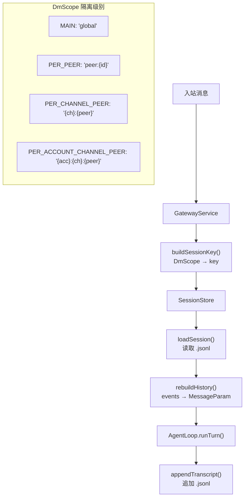

# Sessions -- "JSONL append-only, replay on load"

## 1. 核心概念

Session 模块负责 Agent 会话的持久化和重放:

- **SessionStore**: `@Service`, 基于 JSONL 的会话存储. 按 Agent + sessionKey 隔离, `ReentrantLock` 保证写入串行化.
- **TranscriptEvent**: record, 原子事件记录 (user/assistant/tool_use/tool_result).
- **SessionMeta**: record, 会话元数据 (id, agentId, label, messageCount, timestamps).
- **DmScope**: 4 级隔离粒度 -- MAIN, PER_PEER, PER_CHANNEL_PEER, PER_ACCOUNT_CHANNEL_PEER.
- **rebuildHistory()**: 核心方法, 将独立的 transcript events 重建为 Anthropic API 所需的 `MessageParam` 列表. 关键: 多个连续的 assistant 事件 (text + tool_use) 必须合并为单个 ASSISTANT `MessageParam`.

关键抽象表:

| 组件 | 职责 |
|------|------|
| SessionStore | `@Service`: JSONL 追加/重放, 按 Agent 锁 |
| TranscriptEvent | record: 原子事件 (type, role, content, toolName, toolId, input) |
| SessionMeta | record: 会话元数据 (id, agentId, label, messageCount) |
| DmScope | enum: 4 级隔离粒度 |

文件布局:

```
workspace/.sessions/
└── agents/
    └── {agentId}/
        ├── sessions.json              # 会话索引
        └── sessions/
            └── {sessionId}.jsonl      # 会话事件流
```

## 2. 架构图



## 3. 关键代码片段

### TranscriptEvent -- 原子事件

```java
@JsonInclude(JsonInclude.Include.NON_NULL)
public record TranscriptEvent(
    String type,       // "user" / "assistant" / "tool_use" / "tool_result"
    String role,       // "user" / "assistant"
    String content,    // 文本内容
    String toolName,   // 工具名 (tool_use only)
    String toolId,     // 工具调用 ID (tool_use only)
    Object input,      // 工具输入 (tool_use only)
    Instant timestamp
) {}
```

### rebuildHistory -- 事件 → MessageParam

```java
// 核心逻辑: 合并连续的 assistant + tool_use 事件为单个 ASSISTANT MessageParam
List<MessageParam> rebuildHistory(List<TranscriptEvent> events) {
    List<MessageParam> messages = new ArrayList<>();
    List<ContentBlockParam> assistantBlocks = null;

    for (TranscriptEvent event : events) {
        switch (event.type()) {
            case "user" -> {
                flushAssistant(messages, assistantBlocks);
                assistantBlocks = null;
                messages.add(MessageParam.builder()
                    .role(Role.USER)
                    .content(event.content())
                    .build());
            }
            case "assistant" -> {
                flushAssistant(messages, assistantBlocks);
                assistantBlocks = new ArrayList<>();
                assistantBlocks.add(TextBlockParam.builder()
                    .text(event.content()).build());
            }
            case "tool_use" -> {
                // 追加到当前 assistant blocks (与上一个 assistant 同属一个 MessageParam)
                if (assistantBlocks == null) assistantBlocks = new ArrayList<>();
                assistantBlocks.add(ToolUseBlockParam.builder()
                    .id(event.toolId())
                    .name(event.toolName())
                    .input(event.input().toString())
                    .build());
            }
            case "tool_result" -> {
                flushAssistant(messages, assistantBlocks);
                assistantBlocks = null;
                messages.add(MessageParam.builder()
                    .role(Role.USER)
                    .content(List.of(ToolResultBlockParam.builder()
                        .toolUseId(event.toolId())
                        .content(event.content())
                        .build()))
                    .build());
            }
        }
    }
    flushAssistant(messages, assistantBlocks);
    return messages;
}
```

### SessionStore -- 按 Agent 粒度锁

```java
@Service
public class SessionStore {
    private final ConcurrentHashMap<String, ReentrantLock> agentLocks = new ConcurrentHashMap<>();

    public void appendTranscript(String agentId, String sessionId, TranscriptEvent event) {
        ReentrantLock lock = agentLocks.computeIfAbsent(agentId, k -> new ReentrantLock());
        lock.lock();
        try {
            // 1. 追加事件到 .jsonl 文件
            JsonUtils.appendJsonl(transcriptPath, event);
            // 2. 更新 sessions.json 索引 (messageCount, lastActive)
        } finally {
            lock.unlock();
        }
    }

    public String createSession(String agentId) {
        String sessionId;
        int attempts = 0;
        do {
            sessionId = "sess_" + UUID.randomUUID().toString().substring(0, 8);
            attempts++;
        } while (sessionExists(agentId, sessionId) && attempts < 3);
        // 初始化 sessions.json 索引
        return sessionId;
    }
}
```

### DmScope → sessionKey 构建

```java
// AgentManager.buildSessionKey()
public String buildSessionKey(AgentConfig config, InboundMessage msg) {
    return switch (config.dmScope()) {
        case MAIN -> "global";
        case PER_PEER -> "peer:" + msg.senderId();
        case PER_CHANNEL_PEER -> msg.channel() + ":" + msg.peerId();
        case PER_ACCOUNT_CHANNEL_PEER -> msg.accountId() + ":" + msg.channel() + ":" + msg.peerId();
    };
}
```

## 4. 与 light 版本的对比

| 维度 | light-claw-4j (S03) | enterprise-claw-4j |
|------|---------------------|-------------------|
| 存储 | 单一 JSONL 文件 | 按 Agent 隔离目录 |
| 锁 | 全局 `ReentrantLock` | 按 Agent `ConcurrentHashMap<String, Lock>` |
| 隔离 | 无 | DmScope 4 级粒度 |
| 索引 | 无 | sessions.json 元数据索引 |
| 重建 | 直接读取 | rebuildHistory() 合并 assistant + tool_use |
| 碰撞处理 | 无 | 3 次重试 UUID |

## 5. 学习要点

1. **JSONL 追加写入天然适合会话流**: 每个 `TranscriptEvent` 独立一行, 追加写入不阻塞读取. 崩溃恢复只需重新读取最后一行.

2. **rebuildHistory 解决 API 格式差异**: Anthropic API 要求 assistant 消息的 text 和 tool_use 在同一个 `MessageParam` 中. 但 JSONL 中它们是独立事件. `rebuildHistory()` 用状态机将连续的 assistant + tool_use 事件合并.

3. **按 Agent 粒度锁避免全局竞争**: 不同 Agent 的会话写入互不阻塞. `ConcurrentHashMap<String, ReentrantLock>` 惰性创建锁, 内存开销可控.

4. **DmScope 灵活控制隔离边界**: 从全局共享到按渠道+用户隔离, 同一个 Agent 可以在不同场景下使用不同隔离策略. sessionKey 的构建完全由 `DmScope` 决定.

5. **sessions.json 索引 + .jsonl 事件流分离**: 索引存储元数据 (label, messageCount, timestamps), 事件流存储完整对话. 查询列表时只读索引, 重放时才读事件流.
