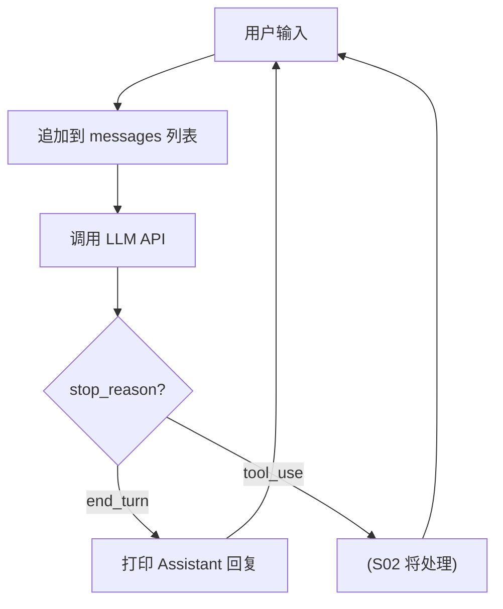

# S01 Agent Loop -- "Agent 就是 while True + stop_reason"

## 1. 核心概念

Agent 的本质就是一个循环：接收用户输入，调用 LLM API，根据 `stop_reason` 决定下一步。
本节展示最简单的 Agent -- 没有 tool，只有 `end_turn`，即"问答式"对话。

核心公式：

```
while True:
    user_input -> messages[] -> LLM API -> stop_reason?
        if "end_turn"  -> 打印回复
        if "tool_use"  -> (下一节)
```

Agent loop 的结构不会随着功能增加而改变。后续添加 tool、session、channel，
都是在同一个 while 循环上叠加层，循环骨架不变。

## 2. 架构图



## 3. 关键代码片段

### Java: Scanner + AnthropicOkHttpClient

```java
// 输入: Java 用 Scanner
Scanner scanner = new Scanner(System.in);
String userInput = scanner.nextLine().trim();

// SDK 客户端: Java 用 Builder 模式
AnthropicClient client = AnthropicOkHttpClient.builder()
        .fromEnv()  // 自动读取 ANTHROPIC_API_KEY 环境变量
        .build();

// 消息管理: 不可变的 MessageParam 对象
List<MessageParam> messages = new ArrayList<>();
messages.add(MessageParam.builder()
        .role(MessageParam.Role.USER)
        .content(userInput)
        .build());

// API 调用
Message response = client.messages().create(
    MessageCreateParams.builder()
        .model("claude-sonnet-4-20250514")
        .maxTokens(8096)
        .system("You are a helpful AI assistant.")
        .messages(messages)
        .build()
);
```

### Python 对比: input() + Anthropic()

```python
# 输入: Python 用 input()
user_input = input("> ").strip()

# SDK 客户端: Python 直接实例化
client = Anthropic()  # 自动读取 ANTHROPIC_API_KEY

# 消息管理: Python 用字典列表
messages = []
messages.append({"role": "user", "content": user_input})

# API 调用
response = client.messages.create(
    model="claude-sonnet-4-20250514",
    max_tokens=8096,
    system="You are a helpful AI assistant.",
    messages=messages
)
```

**核心差异**：
- Java 用 `MessageParam` 不可变对象 + Builder 模式；Python 用普通 dict
- Java 的 `response.content()` 是 `List<ContentBlock>`，需用 stream 过滤；Python 直接访问 `response.content`
- Java SDK 需要 `AnthropicOkHttpClient`；Python SDK 只需 `Anthropic()`

## 4. 运行方式

```bash
# 1. 确保 .env 文件已配置
cp .env.example .env
# 编辑 .env, 填入 ANTHROPIC_API_KEY=sk-ant-xxxxx

# 2. 编译并运行
mvn compile exec:java -Dexec.mainClass="com.claw0.sessions.S01AgentLoop"
```

## 5. REPL 命令

| 命令 | 说明 |
|------|------|
| `quit` | 退出程序 |
| `exit` | 退出程序 |
| `Ctrl+C` | 强制退出 |

## 6. 使用案例

### 案例 1: 基本问答

```
============================================================
  claw0  |  Section 01: Agent Loop
  Model: claude-sonnet-4-20250514
  Type 'quit' or 'exit' to leave. Ctrl+C also works.
============================================================

You > 什么是 Agent?

Assistant: Agent 的核心就是一个循环 (while True):
1. 接收输入
2. 调用 LLM API
3. 根据 stop_reason 决定下一步动作

当 stop_reason 为 "end_turn" 时, 表示模型已完成回答。

You > 谢谢, 退出
Goodbye.
```

### 案例 2: 多轮对话 (上下文记忆)

Agent 通过 `messages` 列表携带完整历史, 模型能看到之前所有对话:

```
You > 我叫小明

Assistant: 你好小明！有什么可以帮你的吗？

You > 我叫什么名字?

Assistant: 你叫小明。

You > quit
Goodbye.
```

> 第二轮问答中, 模型能回答"我叫什么名字"是因为 `messages` 列表保留了第一轮的对话历史。
> 每次 API 调用都携带从开始到现在的全部消息, 这就是 LLM "无状态" 特性的体现。

### 案例 3: API 错误处理

当 API 调用失败时 (如网络超时、Key 无效), Agent 会回滚历史并继续循环:

```
You > 讲个笑话

API Error: 403: {error={type=forbidden, message=Request not allowed}}

You > 检查一下 .env 配置是否正确...
```

> 错误发生时, 刚追加的用户消息会被移除 (`messages.remove`), 避免历史中出现
> 孤立的 user 消息导致后续 API 调用因角色交替规则失败。

### 案例 4: 使用第三方 Anthropic 兼容 API

在 `.env` 中配置 `ANTHROPIC_BASE_URL` 即可接入兼容接口:

```bash
# .env
ANTHROPIC_API_KEY=your-third-party-key
ANTHROPIC_BASE_URL=https://open.bigmodel.cn/api/anthropic
MODEL_ID=glm-5.1
```

```
============================================================
  claw0  |  Section 01: Agent Loop
  Model: glm-5.1
  Type 'quit' or 'exit' to leave. Ctrl+C also works.
============================================================

You > 你好
Assistant: 你好！我是你的 AI 助手，有什么可以帮你的吗？
```

## 7. 学习要点

1. **Agent 核心就是循环 + stop_reason 分发**：不管后续加多少功能，这个骨架不变。理解了这一点，就理解了所有 Agent 框架的本质。
2. **Anthropic Java SDK 使用 Builder 模式**：`MessageCreateParams.builder()...build()` 是标准用法，所有参数都通过 builder 链式调用设置。
3. **消息是不可变的 MessageParam 对象**：Java 中消息是 `MessageParam` 对象，通过 `response.toParam()` 可以直接将 API 响应转回 `MessageParam` 追加到历史中。
4. **system prompt 是每次调用时设置的**：不是会话级别的设置，而是每次 API 调用都传入。这意味着你可以在不同轮次使用不同的 system prompt。
