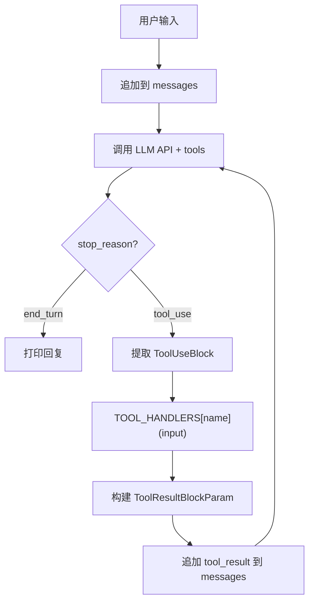

# S02 Tool Use -- "给模型装上双手"

## 1. 核心概念

Tool Use = JSON Schema 定义（告诉模型有哪些工具） + Handler 分发表（执行模型选择的工具）。
Agent loop 结构不变，只是 `stop_reason == "tool_use"` 时，查表执行工具，将结果回传给 LLM。

模型输出 tool_use 时，代码需要：
1. 从响应中提取 `ToolUseBlock`（包含 name、input、id）
2. 在 `TOOL_HANDLERS` 中按 name 查找对应的 handler
3. 执行 handler，将结果用 `ToolResultBlockParam` 包装回传
4. 继续内层循环，让模型看到工具结果后决定下一步

本节实现 4 个工具：`bash`、`read_file`、`write_file`、`edit_file`。

## 2. 架构图



## 3. 关键代码片段

### Java: ProcessBuilder + ToolUnion + 分发表

```java
// 工具 Schema 定义: 用 JsonValue 构建 JSON Schema
Tool tool = Tool.builder()
    .name("bash")
    .description("Run a shell command")
    .inputSchema(Tool.InputSchema.builder()
        .type(JsonValue.from("object"))
        .properties(propsBuilder.build())
        .required(List.of("command"))
        .build())
    .build();

// ToolUnion 包装: API 要求 List<ToolUnion>
static final List<ToolUnion> TOOLS = List.of(
    ToolUnion.ofTool(bashTool),
    ToolUnion.ofTool(readFileTool)
);

// 分发表: Map<String, Function<Map<String,Object>, String>>
static final Map<String, Function<Map<String, Object>, String>> TOOL_HANDLERS
    = new LinkedHashMap<>();
TOOL_HANDLERS.put("bash", S02ToolUse::toolBash);

// 执行工具调用: 用 ProcessBuilder 替代 Python 的 subprocess.run
ProcessBuilder pb = new ProcessBuilder("sh", "-c", command)
    .directory(WORKDIR.toFile())
    .redirectErrorStream(true);

// 工具结果回传: ToolResultBlockParam 必须携带 tool_use_id
toolResultBlocks.add(ContentBlockParam.ofToolResult(
    ToolResultBlockParam.builder()
        .toolUseId(toolUse.id())  // 关键: 匹配请求的 id
        .content(result)
        .build()));
```

### Python 对比

```python
# Python 的工具定义是纯 dict
tools = [{
    "name": "bash",
    "description": "Run a shell command",
    "input_schema": { "type": "object", "properties": {...} }
}]

# Python 执行命令
result = subprocess.run(command, shell=True, capture_output=True, text=True)

# Python 回传工具结果
messages.append({
    "role": "user",
    "content": [{"type": "tool_result", "tool_use_id": id, "content": result}]
})
```

**核心差异**：
- Java 用 `ToolUnion.ofTool()` 包装、`JsonValue.from()` 构建 schema；Python 直接用 dict
- Java 用 `ProcessBuilder` 执行命令；Python 用 `subprocess.run()`
- Java 用 `Function<Map<String,Object>,String>` 做分发表；Python 用 `dict[str, Callable]`

## 4. 运行方式

```bash
mvn compile exec:java -Dexec.mainClass="com.claw0.sessions.S02ToolUse"
```

## 5. REPL 命令

| 命令 | 说明 |
|------|------|
| `quit` | 退出程序 |
| `exit` | 退出程序 |
| `Ctrl+C` | 强制退出 |

## 6. 使用案例

### 案例 1: 执行 Shell 命令 (bash)

```
============================================================
  claw0  |  Section 02: Tool Use
  Model: claude-sonnet-4-20250514
  Workdir: /home/user/project
  Tools: bash, read_file, write_file, edit_file
  Type 'quit' or 'exit' to leave. Ctrl+C also works.
============================================================

You > 当前目录有哪些文件?

  [tool: bash] ls -la
Assistant: 当前目录下有以下文件:

- pom.xml          (Maven 项目配置)
- src/             (源代码目录)
- .env             (环境变量配置)
- README.md        (项目说明)
```

### 案例 2: 读取文件 (read_file)

```
You > 看看 pom.xml 里用了什么版本的 Java

  [tool: read_file] pom.xml
Assistant: pom.xml 中配置的 Java 版本是 21:
  <java.version>21</java.version>
  同时还使用了 Anthropic SDK 2.18.0 和 Jackson 2.19.0。
```

### 案例 3: 写入文件 (write_file)

```
You > 帮我创建一个 hello.sh 脚本, 输出 Hello World

  [tool: write_file] hello.sh
Assistant: 已创建 hello.sh, 内容如下:
  #!/bin/bash
  echo "Hello World"

  你可以用 `bash hello.sh` 运行它。
```

### 案例 4: 编辑文件 (edit_file) — 先读后改

```
You > 把 hello.sh 里的 Hello World 改成 Bonjour le monde

  [tool: read_file] hello.sh
  [tool: edit_file] hello.sh (replace 11 chars)
Assistant: 已将 hello.sh 中的 "Hello World" 替换为 "Bonjour le monde"。
```

> edit_file 要求 old_string 在文件中唯一匹配。模型会先 read_file 获取精确文本,
> 再用 edit_file 替换。如果 old_string 匹配多次, 工具会拒绝执行并要求提供更多上下文。

### 案例 5: 多工具连续调用

```
You > 创建一个 notes.txt 写入今天的日期, 然后读出来确认内容正确

  [tool: bash] date +%Y-%m-%d
  [tool: write_file] notes.txt
  [tool: read_file] notes.txt
Assistant: 已完成:

1. 用 bash 获取今天的日期: 2026-04-19
2. 写入 notes.txt: "Today is 2026-04-19"
3. 读取确认内容正确

notes.txt 内容为: "Today is 2026-04-19"
```

> 模型在一次回答中连续调用了 3 个工具 (bash → write_file → read_file)。
> 内层 while 循环处理这种连续调用: 每次工具结果送回后, 模型决定是继续调工具还是 end_turn。

### 案例 6: 安全防护 — 路径穿越与危险命令

```
You > 读取 /etc/shadow

  [tool: read_file] /etc/shadow
Assistant: Error: Path traversal blocked: /etc/shadow resolves outside WORKDIR
无法读取该文件, 路径被安全检查拦截。

You > 执行 rm -rf /

  [tool: bash] rm -rf /
Assistant: Error: Refused to run dangerous command containing 'rm -rf /'
危险命令被过滤, 未执行。
```

> `safePath()` 确保文件操作限制在 WORKDIR 内, `DANGEROUS_COMMANDS` 黑名单拦截危险 shell 命令。

## 7. 学习要点

1. **Tool 是数据（Schema）+ Handler 分发表**：模型只看到 JSON Schema 描述，不看到实现。Handler 是一个 `Map<String, Function>`，按工具名查找执行。
2. **ToolUnion 包装 Tool 对象给 API**：Anthropic Java SDK 要求 `List<ToolUnion>`，用 `ToolUnion.ofTool(tool)` 包装。这是因为 API 联合类型在 Java 中需要容器。
3. **ToolResultBlockParam 必须携带 tool_use_id**：模型可能同时调用多个工具，`tool_use_id` 用于匹配请求和结果。缺少 id 会导致 API 报错。
4. **危险命令过滤是必要的安全层**：`DANGEROUS_COMMANDS` 列表拦截 `rm -rf /`、`mkfs` 等命令。`safePath()` 防止路径遍历攻击，确保文件操作不越界。
