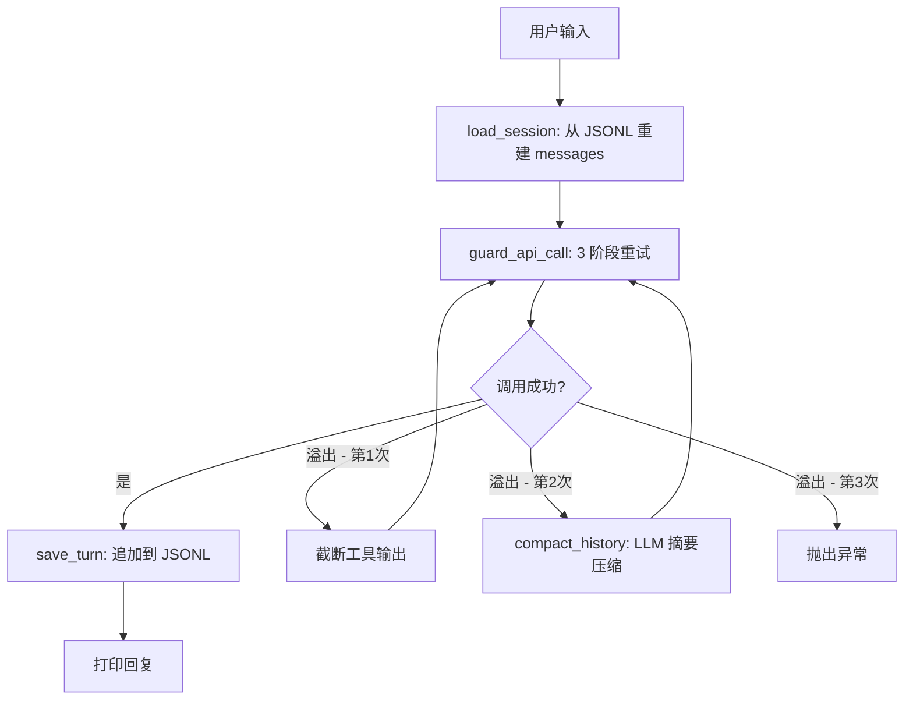

# S03 Sessions & Context Guard -- "会话是 JSONL 文件。写入时追加, 读取时重放。过大时进行摘要压缩。"

## 1. 核心概念

在 S02 的 Agent loop 基础上叠加两层：

- **SessionStore**：JSONL 持久化 -- 每轮对话追加一行 JSON，恢复时重放全部行重建 `messages[]`
- **ContextGuard**：3 阶段上下文溢出保护 -- 正常调用 -> 截断工具输出 -> 压缩历史 -> 抛异常

会话生命周期：
1. 启动时加载最近会话（或创建新会话）
2. 每轮用户输入和助手回复都追加到 JSONL 文件
3. 工具调用和结果也持久化
4. 切换会话时重放目标会话的 JSONL 重建消息列表

ContextGuard 三阶段重试：
- 第 1 次：正常调用
- 第 2 次（溢出）：截断过长的工具输出
- 第 3 次（仍溢出）：用 LLM 将前 50% 历史压缩为摘要
- 超过重试次数：抛出异常

## 2. 架构图



## 3. 关键代码片段

### Java: Jackson ObjectMapper + JSONL 追加

```java
// JSONL 追加: Jackson 序列化 + Files.writeString(APPEND)
public static void appendJsonl(Path file, Object record) throws IOException {
    Files.createDirectories(file.getParent());
    String line = MAPPER.writeValueAsString(record) + "\n";
    Files.writeString(file, line,
        StandardOpenOption.CREATE, StandardOpenOption.APPEND);
}

// 会话 ID: 12 位 hex 字符串
String sessionId = UUID.randomUUID().toString()
    .replace("-", "").substring(0, 12);

// Token 估算: 简单的 4 字符 = 1 token
static int estimateTokens(String text) {
    return text.length() / 4;
}

// 历史压缩: 前 50% 用 LLM 生成摘要
List<MessageParam> compactHistory(List<MessageParam> messages) {
    int compressCount = Math.max(2, (int)(total * 0.5));
    List<MessageParam> old = messages.subList(0, compressCount);
    List<MessageParam> recent = messages.subList(compressCount, total);
    // 调用 LLM 生成摘要...
    String summaryText = callLLM("Summarize...", serializeForSummary(old));
    // 返回: [摘要user, 确认assistant] + recent
}
```

### Python 对比

```python
# Python 的 JSONL 追加更简洁
with open(path, "a") as f:
    f.write(json.dumps(record) + "\n")

# Python 用 @dataclass 定义数据结构
@dataclass
class SessionMeta:
    label: str
    created_at: str
    message_count: int

# Java 用 record 类型
record Binding(String agentId, int tier, ...) implements Comparable<Binding> {}

# Python 读取 JSONL
records = [json.loads(line) for line in open(path) if line.strip()]
```

**核心差异**：
- Java 用 Jackson `ObjectMapper` 处理 JSON；Python 用 `json` 标准库
- Java 用 `record` 定义数据结构（不可变、自动生成 equals/hashCode）；Python 用 `@dataclass`
- Java 的 `subList` 返回原列表的视图（修改会影响原列表）；Python 的切片创建新列表

## 4. 运行方式

```bash
mvn compile exec:java -Dexec.mainClass="com.claw0.sessions.S03Sessions"
```

## 5. REPL 命令

| 命令 | 说明 |
|------|------|
| `/new [label]` | 创建新会话，可选标签 |
| `/list` | 列出所有会话（按最近活跃排序） |
| `/switch <id>` | 切换到指定会话（支持前缀匹配） |
| `/context` | 显示当前上下文 token 用量（进度条） |
| `/compact` | 手动压缩历史（前 50% 生成摘要） |
| `/help` | 显示帮助 |
| `quit` / `exit` | 退出 |

## 6. 学习要点

1. **JSONL 是追加式会话存储的理想格式**：每行一条 JSON 记录，追加写入不需要读取-修改-写入，天然支持并发安全。恢复时逐行读取重建消息列表。
2. **ContextGuard 3 阶段保护防止 token 溢出**：先截断工具输出（最常见的原因），再用 LLM 摘要压缩历史（保留关键信息），最后才抛异常。
3. **会话 ID 用 12 位 hex 字符串**：`UUID.randomUUID()` 去掉横线取前 12 位，足够唯一且人类可读。前缀匹配方便切换。
4. **rebuildHistory 处理消息交替规则**：API 要求 user/assistant 严格交替，tool_use 属于 assistant，tool_result 属于 user。JSONL 重放时需要正确合并连续的 tool_result 块。
