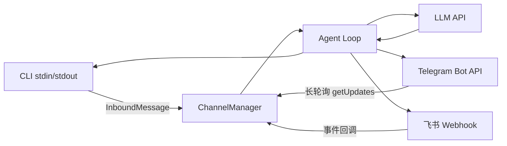

# S04 Channels -- "同一大脑, 多个嘴巴"

## 1. 核心概念

Channel（通道）是对不同消息平台的抽象。Agent loop 只看统一的 `InboundMessage`，
不关心消息来自 CLI、Telegram 还是飞书。添加新平台 = 实现 `Channel` 接口的 `receive()` + `send()`。

关键设计：
- `Channel` 接口定义三个方法：`name()`、`receive()`、`send()`
- `InboundMessage` record 将所有平台的消息标准化为 `(text, senderId, channel, accountId, peerId)`
- `ChannelManager` 是简单的 name-to-adapter 注册表
- 每个平台处理自己的认证、限流、消息格式差异

本节实现 3 个 Channel：CLI（标准输入输出）、Telegram（Bot API 长轮询）、飞书（Webhook）。

## 2. 架构图



## 3. 关键代码片段

### Java: interface Channel + record InboundMessage

```java
// Channel 接口: Java 用 interface，Python 用 ABC
interface Channel {
    String name();
    Optional<InboundMessage> receive();
    boolean send(String to, String text);
    default void close() {}
}

// InboundMessage: Java 用 record，不可变数据载体
record InboundMessage(
    String text, String senderId, String channel,
    String accountId, String peerId, boolean isGroup,
    List<Map<String, Object>> media, Map<String, Object> raw
) {}

// Telegram 长轮询: Java 用 java.net.http.HttpClient
HttpClient http = HttpClient.newBuilder()
    .connectTimeout(Duration.ofSeconds(35))
    .build();
HttpRequest req = HttpRequest.newBuilder()
    .uri(URI.create(baseUrl + "/getUpdates"))
    .header("Content-Type", "application/json")
    .POST(HttpRequest.BodyPublishers.ofString(body))
    .build();
HttpResponse<String> resp = http.send(req, HttpResponse.BodyHandlers.ofString());

// ChannelManager: 简单的注册表模式
static class ChannelManager {
    final Map<String, Channel> channels = new LinkedHashMap<>();
    void register(Channel channel) {
        channels.put(channel.name(), channel);
    }
    Channel get(String name) { return channels.get(name); }
}
```

### Python 对比

```python
# Python 用 ABC (抽象基类)
from abc import ABC, abstractmethod
class Channel(ABC):
    @abstractmethod
    def receive(self) -> Optional[InboundMessage]: ...
    @abstractmethod
    def send(self, to: str, text: str) -> bool: ...

# Python 用 @dataclass
@dataclass
class InboundMessage:
    text: str
    sender_id: str
    channel: str
    ...

# Python Telegram 用 requests 库
resp = requests.post(f"{base_url}/getUpdates", json=params, timeout=35)
data = resp.json()
```

**核心差异**：
- Java `interface` 有默认方法（`default void close()`）；Python `ABC` 用 `@abstractmethod`
- Java `record` 自动生成构造器、getter、equals、hashCode；Python `@dataclass` 类似但可变
- Java `Optional<InboundMessage>` 显式表达可能为空；Python 用 `Optional[InboundMessage]` 类型注解
- Java 用 `java.net.http.HttpClient`（JDK 11+）；Python 用 `requests` 或 `httpx`

## 4. 运行方式

```bash
# 仅 CLI 模式（不需要额外配置）
mvn compile exec:java -Dexec.mainClass="com.claw0.sessions.S04Channels"

# 启用 Telegram: 在 .env 中添加
# TELEGRAM_BOT_TOKEN=123456:ABC-xxx
# TELEGRAM_ALLOWED_CHATS=chat_id1,chat_id2

# 启用飞书: 在 .env 中添加
# FEISHU_APP_ID=cli_xxx
# FEISHU_APP_SECRET=xxx
```

## 5. REPL 命令

| 命令 | 说明 |
|------|------|
| `/channels` | 列出已注册的通道 |
| `/accounts` | 列出已配置的账号（token 脱敏显示） |
| `/help` | 显示帮助 |
| `quit` / `exit` | 退出 |

## 6. 使用案例

### 案例 1: CLI 模式基本交互

最简单的模式: 只启用 CLI 通道, 不需要任何额外配置。

```
============================================================
  claw0  |  Section 04: Channels
  Model: claude-sonnet-4-20250514
  Channels: cli
  Commands: /channels /accounts /help  |  quit/exit
============================================================

You > 你好，介绍一下你自己

Assistant: 你好！我是一个连接了多个消息渠道的 AI 助手。
我可以通过 CLI、Telegram 或飞书与你对话，还拥有记忆工具，
可以保存和检索笔记。有什么可以帮你的吗？

You > quit
Goodbye.
```

> 启动时 `Channels: cli` 表示只注册了 CLI 通道。Telegram 和飞书通道
> 需要在 `.env` 中配置对应的环境变量才会激活。

### 案例 2: 记忆工具 — 写入与搜索

Agent 拥有 `memory_write` 和 `memory_search` 两个工具, 可以跨会话持久化信息:

```
You > 帮我记住: 项目 deadline 是 6月15日

  [tool: memory_write] 24 chars
Assistant: 好的，已记住: 项目 deadline 是 6月15日。

You > 我之前让你记住什么了？

  [tool: memory_search] 之前让你记住什么了
Assistant: 你之前让我记住了: 项目 deadline 是 6月15日。
```

> `memory_write` 将内容追加到 `workspace/MEMORY.md` 和每日 JSONL 日志中。
> `memory_search` 通过关键词搜索 MEMORY.md 中的匹配行。
> 两个工具的调用由 LLM 自主决策 — 我们只定义了 Schema, LLM 决定何时调用。

### 案例 3: 多渠道并行 — CLI + Telegram

在 `.env` 中配置 `TELEGRAM_BOT_TOKEN` 后, Telegram 通道自动激活:

```bash
# .env
ANTHROPIC_API_KEY=sk-ant-api03-xxxxx
TELEGRAM_BOT_TOKEN=1234567890:AAH_xxxxxxxxxxxxx
TELEGRAM_ALLOWED_CHATS=987654321
```

```
  [+] Channel registered: cli
  [+] Channel registered: telegram
  [telegram] Polling started for tg-primary
============================================================
  claw0  |  Section 04: Channels
  Model: claude-sonnet-4-20250514
  Channels: cli, telegram
  Commands: /channels /accounts /help  |  quit/exit
============================================================

  [telegram] 987654321: 帮我查一下北京今天天气

Assistant: [通过 Telegram 回复] 北京今天晴, 气温 18-26°C, 适宜出行。

You > /channels
  - cli
  - telegram

You > /accounts
  - telegram/tg-primary  token=12345678...
```

> Telegram 轮询在独立虚拟线程中运行, 通过 `ConcurrentLinkedQueue` 将消息传递给主线程。
> `TELEGRAM_ALLOWED_CHATS` 限制只处理指定 chat_id 的消息, 防止 bot 被陌生人滥用。
> CLI 和 Telegram 的消息交替处理 — Telegram 队列优先排空, 然后才检查 CLI 输入。

### 案例 4: 多用户会话隔离

同一个 bot 可以同时与多个用户对话, 每个对话有独立的消息历史:

```
  [telegram] 111222333: 我叫小红
                           ← runAgentTurn: sk=agent:main:direct:telegram:111222333

  [telegram] 444555666: 我叫什么名字?
                           ← runAgentTurn: sk=agent:main:direct:telegram:444555666

Assistant: [回复 444555666] 抱歉, 我不知道你的名字。你还没有告诉我呢。

  [telegram] 111222333: 我叫什么名字?
                           ← runAgentTurn: sk=agent:main:direct:telegram:111222333

Assistant: [回复 111222333] 你叫小红。
```

> 会话键格式: `agent:main:direct:{channel}:{peerId}`。不同用户/群聊有不同 peerId,
> 因此消息历史完全隔离。用户 A 的对话不会影响用户 B 的上下文。

### 案例 5: Telegram 长消息自动分片

Telegram 单条消息限制 4096 字符。Agent 回复超过限制时, `chunkMessage()` 自动拆分:

```
You > 详细解释 Java 的垃圾回收机制

  [telegram] sendTyping → 987654321
Assistant: [分片 1/3] Java 垃圾回收（GC）是自动内存管理的核心机制...（前 4096 字符）
          [分片 2/3] G1 收集器将堆划分为多个 Region...（中间 4096 字符）
          [分片 3/3] ZGC 是新一代低延迟收集器...（剩余字符）
```

> 分片策略优先在换行符处切割（保持段落完整），找不到换行符才硬切。
> 这是 Channel 的职责 — agent 只管生成内容, 不关心平台限制。

### 案例 6: REPL 管理命令

```
You > /channels
  - cli
  - telegram
  - feishu

You > /accounts
  - telegram/tg-primary  token=12345678...
  - feishu/feishu-primary  token=(none)

You > /help
  /channels  /accounts  /help  quit/exit

You > /channels    ← 注意: 不存在的命令不会报错, 会当作普通消息发给 LLM

Assistant: 你输入了 /channels，这似乎是一条命令...
```

> `/` 开头的命令由 `handleReplCommand` 拦截处理。未匹配的 `/xxx` 不会被拦截,
> 会作为普通消息发送给 LLM。`quit` 和 `exit` 不以 `/` 开头, 直接在主循环中判断。

### 案例 7: 偏移量持久化 — 重启后不重复处理

Telegram `getUpdates` API 用 offset 标记已处理消息。程序重启时从文件恢复 offset:

```
# 第一次运行, 处理了 update_id=42 的消息
# 文件 workspace/.state/telegram/offset-tg-primary.txt 内容: 43

# ...程序重启...

# 第二次运行, loadOffset() 读取文件返回 43
# getUpdates(offset=43) 只返回 update_id >= 43 的新消息
# update_id=42 不会重复处理
```

> 如果 offset 文件不存在或损坏, 默认 offset=0, 会重新处理所有未确认消息。
> `seen` 集合在内存中去重（防止同一次 poll 返回重复消息），超过 5000 条自动清空。

### 案例 8: API 错误与回滚

当 LLM API 调用失败时, agent 回滚会话历史并继续循环:

```
You > 写一首关于春天的诗

API Error: 503: {"type":"overloaded","message":"Server is busy"}

You > 再试一次

  [tool: memory_write] 春天的灵感: 樱花、细雨、新芽... 26 chars
Assistant: 好的，这次成功了。我已将灵感保存到记忆中。
```

> 错误发生时, 刚追加的 user 消息和可能的 assistant 消息会被移除,
> 保持 `user → assistant → user → assistant` 的角色交替规则不被破坏。
> 主循环不会退出, 用户可以继续输入。

## 8. 学习要点

1. **Channel 接口解耦 Agent 逻辑和 I/O**：Agent loop 不需要知道消息来自哪个平台。`receive()` 返回标准 `InboundMessage`，`send(to, text)` 处理平台差异。
2. **每个 Channel 处理自己的认证和限流**：Telegram 用 Bot Token + 长轮询 + offset 持久化；飞书用 App ID/Secret + tenant_access_token 自动刷新。
3. **InboundMessage 将所有输入标准化为统一格式**：`(channel, userId, text)` 三元组是核心。`peerId` 在私聊中是 userId，在群聊中是 chatId，用于会话隔离。
4. **ChannelManager 是简单的 name-to-adapter 注册表**：`Map<String, Channel>`，`register()` 时注册，`get(name)` 时查找。这是最简单的策略模式实现。
5. **消息缓冲处理平台特有行为**：Telegram 媒体组缓冲 (500ms) 合并同一批发送的多张图片；文本合并缓冲 (1s) 拼接被 Telegram 拆分的长粘贴。这些都在 Channel 层透明处理。
6. **飞书群聊 @bot 过滤**：群聊中只响应 @机器人的消息，避免 bot 对所有群消息都回复。`botMentioned()` 检查 mentions 列表中的 open_id 匹配。
