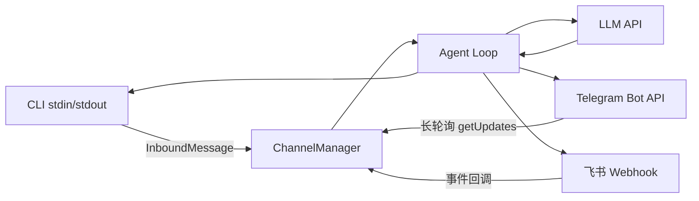

# S04 Channels -- "同一大脑, 多个嘴巴"

## 1. 核心概念

Channel（通道）是对不同消息平台的抽象。Agent loop 只看统一的 `InboundMessage`，
不关心消息来自 CLI、Telegram 还是飞书。添加新平台 = 实现 `Channel` 接口的 `receive()` + `send()`。

关键设计：
- `Channel` 接口定义三个方法：`name()`、`receive()`、`send()`
- `InboundMessage` record 将所有平台的消息标准化为 `(text, senderId, channel, accountId, peerId)`
- `ChannelManager` 是简单的 name-to-adapter 注册表
- 每个平台处理自己的认证、限流、消息格式差异

本节实现 3 个 Channel：CLI（标准输入输出）、Telegram（Bot API 长轮询）、飞书（Webhook）。

## 2. 架构图



## 3. 关键代码片段

### Java: interface Channel + record InboundMessage

```java
// Channel 接口: Java 用 interface，Python 用 ABC
interface Channel {
    String name();
    Optional<InboundMessage> receive();
    boolean send(String to, String text);
    default void close() {}
}

// InboundMessage: Java 用 record，不可变数据载体
record InboundMessage(
    String text, String senderId, String channel,
    String accountId, String peerId, boolean isGroup,
    List<Map<String, Object>> media, Map<String, Object> raw
) {}

// Telegram 长轮询: Java 用 java.net.http.HttpClient
HttpClient http = HttpClient.newBuilder()
    .connectTimeout(Duration.ofSeconds(35))
    .build();
HttpRequest req = HttpRequest.newBuilder()
    .uri(URI.create(baseUrl + "/getUpdates"))
    .header("Content-Type", "application/json")
    .POST(HttpRequest.BodyPublishers.ofString(body))
    .build();
HttpResponse<String> resp = http.send(req, HttpResponse.BodyHandlers.ofString());

// ChannelManager: 简单的注册表模式
static class ChannelManager {
    final Map<String, Channel> channels = new LinkedHashMap<>();
    void register(Channel channel) {
        channels.put(channel.name(), channel);
    }
    Channel get(String name) { return channels.get(name); }
}
```

### Python 对比

```python
# Python 用 ABC (抽象基类)
from abc import ABC, abstractmethod
class Channel(ABC):
    @abstractmethod
    def receive(self) -> Optional[InboundMessage]: ...
    @abstractmethod
    def send(self, to: str, text: str) -> bool: ...

# Python 用 @dataclass
@dataclass
class InboundMessage:
    text: str
    sender_id: str
    channel: str
    ...

# Python Telegram 用 requests 库
resp = requests.post(f"{base_url}/getUpdates", json=params, timeout=35)
data = resp.json()
```

**核心差异**：
- Java `interface` 有默认方法（`default void close()`）；Python `ABC` 用 `@abstractmethod`
- Java `record` 自动生成构造器、getter、equals、hashCode；Python `@dataclass` 类似但可变
- Java `Optional<InboundMessage>` 显式表达可能为空；Python 用 `Optional[InboundMessage]` 类型注解
- Java 用 `java.net.http.HttpClient`（JDK 11+）；Python 用 `requests` 或 `httpx`

## 4. 运行方式

```bash
# 仅 CLI 模式（不需要额外配置）
mvn compile exec:java -Dexec.mainClass="com.claw0.sessions.S04Channels"

# 启用 Telegram: 在 .env 中添加
# TELEGRAM_BOT_TOKEN=123456:ABC-xxx
# TELEGRAM_ALLOWED_CHATS=chat_id1,chat_id2

# 启用飞书: 在 .env 中添加
# FEISHU_APP_ID=cli_xxx
# FEISHU_APP_SECRET=xxx
```

## 5. REPL 命令

| 命令 | 说明 |
|------|------|
| `/channels` | 列出已注册的通道 |
| `/accounts` | 列出已配置的账号（token 脱敏显示） |
| `/help` | 显示帮助 |
| `quit` / `exit` | 退出 |

## 6. 学习要点

1. **Channel 接口解耦 Agent 逻辑和 I/O**：Agent loop 不需要知道消息来自哪个平台。`receive()` 返回标准 `InboundMessage`，`send(to, text)` 处理平台差异。
2. **每个 Channel 处理自己的认证和限流**：Telegram 用 Bot Token + 长轮询 + offset 持久化；飞书用 App ID/Secret + tenant_access_token 自动刷新。
3. **InboundMessage 将所有输入标准化为统一格式**：`(channel, userId, text)` 三元组是核心。`peerId` 在私聊中是 userId，在群聊中是 chatId，用于会话隔离。
4. **ChannelManager 是简单的 name-to-adapter 注册表**：`Map<String, Channel>`，`register()` 时注册，`get(name)` 时查找。这是最简单的策略模式实现。
