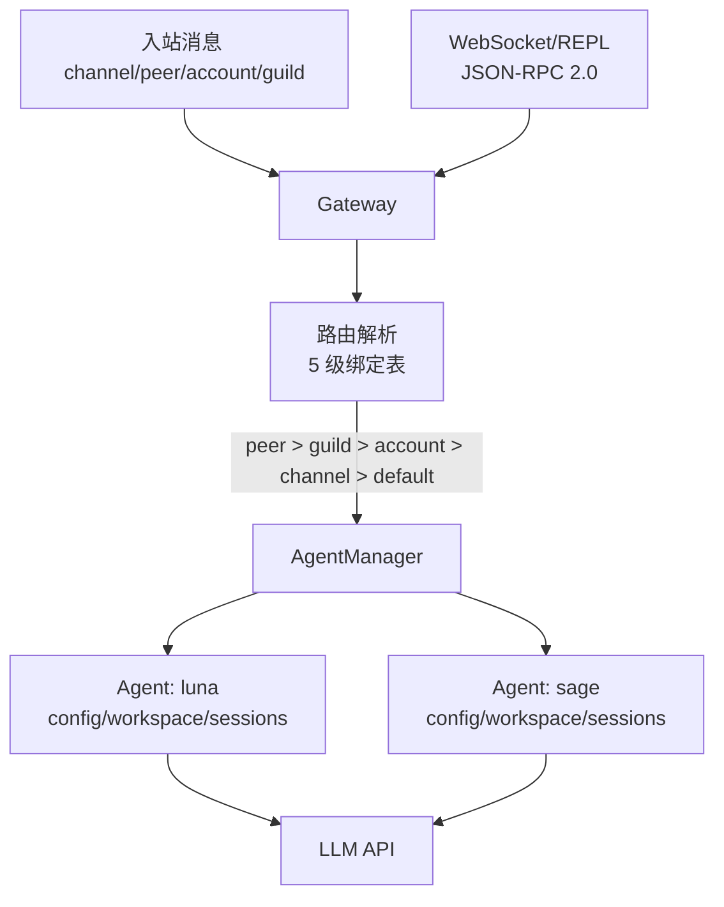

# S05 Gateway & Routing -- "每条消息都能找到归宿"

## 1. 核心概念

Gateway 是消息中枢：每条入站消息通过 5 级绑定表解析为 `(agent_id, session_key)`。
不同用户、不同平台可以路由到不同的 Agent，每个 Agent 有独立的配置、工作空间和会话存储。

5 级路由优先级（从高到低）：
1. **peer** -- 将特定用户路由到指定 Agent
2. **guild** -- 群组/服务器级别
3. **account** -- Bot 账号级别
4. **channel** -- 整个通道（如所有 Telegram 消息）
5. **default** -- 兜底匹配

Gateway 还提供 WebSocket + JSON-RPC 2.0 接口，用于外部程序（REPL、Web UI）连接。
每个 Agent 独立配置（模型、人格、DM 隔离策略），互不干扰。

## 2. 架构图



## 3. 关键代码片段

### Java: WebSocketServer + BindingTable + JSON-RPC 2.0

```java
// WebSocket 服务器: 基于 Java-WebSocket 库
static class GatewayServer extends WebSocketServer {
    @Override
    public void onMessage(WebSocket conn, String message) {
        Map<String, Object> req = JsonUtils.toMap(message);
        Object id = req.get("id");
        String method = (String) req.get("method");
        // JSON-RPC 2.0 分发
        Object result = switch (method) {
            case "send" -> handleSend(params);
            case "bindings.set" -> handleBindSet(params);
            case "bindings.list" -> handleBindList();
            default -> throw new RuntimeException("Unknown method");
        };
        conn.send(JsonUtils.toJson(Map.of(
            "jsonrpc", "2.0", "result", result, "id", id)));
    }
}

// 5 级绑定表: 按 tier 排序, 首次匹配胜出
Optional<Binding> resolve(String channel, String accountId,
                          String guildId, String peerId) {
    for (Binding b : bindings) {  // 已按 tier 升序排列
        boolean match = switch (b.tier()) {
            case 1 -> b.matchValue().equals(peerId);   // peer
            case 2 -> b.matchValue().equals(guildId);   // guild
            case 3 -> b.matchValue().equals(accountId); // account
            case 4 -> b.matchValue().equals(channel);   // channel
            case 5 -> true;                              // default
            default -> false;
        };
        if (match) return Optional.of(b);
    }
    return Optional.empty();
}

// AgentManager: 每个 Agent 独立的 config/workspace/sessions
record AgentConfig(String id, String name, String personality,
                   String model, String dmScope) {
    String systemPrompt() {
        return "You are " + name + ". Personality: " + personality;
    }
}

// dm_scope 控制会话隔离粒度
// "per-peer"      -> agent:{id}:direct:{peer}
// "per-channel-peer" -> agent:{id}:{ch}:direct:{peer}
// "main"          -> agent:{id}:main (共享会话)
```

### Python 对比

```python
# Python 用 websockets 库（异步）
import websockets
async def handle(ws):
    msg = json.loads(await ws.recv())
    result = dispatch(msg["method"], msg["params"])
    await ws.send(json.dumps({"jsonrpc": "2.0", "result": result, "id": msg["id"]}))

# Java 用 Java-WebSocket 库（同步回调）
# Python 的 async/await vs Java 的 Thread + callback

# 绑定表排序: Java 用 Comparable 接口
record Binding(...) implements Comparable<Binding> {
    public int compareTo(Binding o) {
        int cmp = Integer.compare(this.tier, o.tier);
        return cmp != 0 ? cmp : Integer.compare(o.priority, this.priority);
    }
}
```

**核心差异**：
- Java 用 `Java-WebSocket` 库的同步回调模式；Python 用 `websockets` 的 async/await 模式
- Java 的 `switch` 表达式（JDK 14+）可以直接返回值；Python 用 `match/case`（3.10+）
- Java 用 `record` + `Comparable` 接口实现排序；Python 用 `sort(key=lambda b: (b.tier, -b.priority))`
- Java 用 `Semaphore(4)` 限制并发 Agent 数量；Python 用 `asyncio.Semaphore(4)`

## 4. 运行方式

```bash
mvn compile exec:java -Dexec.mainClass="com.claw0.sessions.S05GatewayRouting"
```

启动后进入 REPL，可用命令管理绑定、Agent、会话，也可用 `/gateway` 启动 WebSocket 服务。

## 5. REPL 命令

| 命令 | 说明 |
|------|------|
| `/bindings` | 列出所有路由绑定（彩色显示层级） |
| `/route <channel> <peer>` | 模拟路由解析，显示匹配结果 |
| `/agents` | 列出已注册的 Agent |
| `/sessions` | 列出活跃会话 |
| `/switch <agent_id>` | 强制切换到指定 Agent（`/switch off` 恢复路由） |
| `/gateway` | 启动 WebSocket Gateway（后台运行） |
| `quit` / `exit` | 退出 |

## 6. 使用案例

### 案例 1: 默认路由 — 消息自动分发给 Luna

启动后内置两个 Agent: Luna（温暖型, 默认兜底）和 Sage（分析型）。
CLI 用户的消息没有匹配到任何特定规则, 走 Tier 5 default 兜底 → Luna。

```
================================================================
  claw0  |  Section 05: Gateway & Routing
  Model: claude-sonnet-4-20250514
================================================================
  /bindings  /route <ch> <peer>  /agents  /sessions  /switch <id>  /gateway

You > 你好，推荐一本适合周末看的书

  [route] Matched: [default] default=* -> agent:luna (pri=0)
  -> Luna (luna) | agent:luna:direct:repl-user

Luna: 你好呀！周末看书是最棒的放松方式了！✨
我推荐《百年孤独》——马尔克斯的魔幻现实主义让人沉浸其中。
你平时喜欢什么类型的书呢？小说、历史还是科普？

You > quit
Goodbye.
```

> 路由解析打印了两行信息: 第一行是匹配到的绑定规则, 第二行是最终的 agent 和 session key。
> `agent:luna:direct:repl-user` 表示 Luna 的 per-peer 隔离, repl-user 的独立会话。

### 案例 2: 查看路由绑定 — /bindings

默认配置了 3 条绑定规则, 按层级彩色显示:

```
You > /bindings

Route Bindings (3):
  [peer] peer_id=discord:admin-001 -> agent:sage (pri=10)
  [channel] channel=telegram -> agent:sage (pri=0)
  [default] default=* -> agent:luna (pri=0)
```

> 颜色区分: peer (洋红) > guild (蓝) > account (青) > channel (绿) > default (灰)。
> 列表已按 tier 升序排列, 最上面的规则优先匹配。

### 案例 3: 测试路由解析 — /route

模拟不同来源的消息, 查看会被路由到哪个 Agent:

```
You > /route cli repl-user

Route Resolution:
  Input:   ch=cli peer=repl-user acc=- guild=-
  Agent:   luna (Luna)
  Session: agent:luna:direct:repl-user

You > /route telegram 12345

Route Resolution:
  Input:   ch=telegram peer=12345 acc=- guild=-
  Agent:   sage (Sage)
  Session: agent:sage:direct:12345

You > /route discord admin-001

Route Resolution:
  Input:   ch=discord peer=admin-001 acc=- guild=-
  Agent:   sage (Sage)
  Session: agent:sage:direct:admin-001
```

> 同一个 Discord 管理员, 即使不通过 Telegram 发消息, Tier 1 的 peer_id 规则也能匹配。
> 注意 `peer_id=discord:admin-001` 的格式: `channel:peerId` 精确匹配, 避免跨渠道 ID 冲突。

### 案例 4: 强制切换 Agent — /switch

跳过路由匹配, 强制使用指定 Agent:

```
You > /switch sage
  Forcing: sage

You > 用一句话解释量子纠缠

  -> Sage (sage) | agent:sage:direct:repl-user
Sage: 量子纠缠是指两个粒子在测量前处于关联态, 对一个的测量会瞬间确定另一个的状态。

You > /switch off
  Routing mode restored.

You > 同样的问题, 让 Luna 回答

  [route] Matched: [default] default=* -> agent:luna (pri=0)
  -> Luna (luna) | agent:luna:direct:repl-user
Luna: 好问题！想象你有两枚神奇的硬币, 不管它们相隔多远...
```

> `/switch` 后所有消息都发给指定 Agent, 跳过绑定表匹配。`/switch off` 恢复自动路由。
> 同一个 repl-user 的会话键 `agent:luna:direct:repl-user` 和 `agent:sage:direct:repl-user` 是独立的,
> 所以 Luna 和 Sage 各自只能看到发给自己的那部分对话历史。

### 案例 5: 查看 Agent 和会话

```
You > /agents

Agents (2):
  luna (Luna)  model=claude-sonnet-4-20250514  dm_scope=per-peer
    warm, curious, and encouraging. You love asking follow-up questions.
  sage (Sage)  model=claude-sonnet-4-20250514  dm_scope=per-peer
    direct, analytical, and concise. You prefer facts over opinions.

You > /sessions

Sessions (2):
  agent:luna:direct:repl-user (4 msgs)
  agent:sage:direct:repl-user (2 msgs)
```

> 每条会话记录显示会话键和消息数量。两个 Agent 对同一个 CLI 用户有各自独立的会话。

### 案例 6: 工具调用 — read_file + get_current_time

Agent 可以使用 `read_file` 和 `get_current_time` 工具:

```
You > 现在几点了？

  [tool: get_current_time]
Luna: 现在是 2026-04-25 14:32:07 UTC 哦！你那边是几点呀？

You > 读一下 workspace 目录下的 notes.txt

  [tool: read_file] notes.txt
Luna: 我看到了 notes.txt 的内容, 里面写着:
"Meeting notes: deploy v2.3 on Friday"
需要我帮你做什么吗？
```

> `read_file` 通过 `safePath()` 限制只能读取 workspace 目录内的文件,
> 防止路径遍历攻击 (如 `../../../etc/passwd` 会被拦截)。
> 文件内容超过 `MAX_TOOL_OUTPUT` (30000 字符) 时自动截断。

### 案例 7: WebSocket 网关 — JSON-RPC 2.0

启动网关后, 外部程序可以通过 WebSocket 连接:

```
You > /gateway
  Gateway started on ws://localhost:8765
  Gateway running in background on ws://localhost:8765
```

使用 `wscat` (或其他 WebSocket 客户端) 连接并测试:

```bash
# 安装 wscat
npm install -g wscat

# 连接网关
wscat -c ws://localhost:8765
```

```
# 查看网关状态
> {"jsonrpc": "2.0", "id": 1, "method": "status", "params": {}}
< {"jsonrpc": "2.0", "result": {"running":true, "uptime_seconds":42,
    "connected_clients":1, "agent_count":2, "binding_count":3}, "id": 1}

# 列出所有 Agent
> {"jsonrpc": "2.0", "id": 2, "method": "agents.list", "params": {}}
< {"jsonrpc": "2.0", "result": [{"id":"luna", "name":"Luna",
    "model":"claude-sonnet-4-20250514", "dm_scope":"per-peer",
    "personality":"warm, curious..."}, ...], "id": 2}

# 发送消息 (自动路由 → Luna)
> {"jsonrpc": "2.0", "id": 3, "method": "send", "params": {
    "text": "hello", "channel": "websocket", "peer_id": "user-A"}}
< {"jsonrpc": "2.0", "result": {"agent_id":"luna",
    "session_key":"agent:luna:direct:user-a", "reply":"Hello! How can I help?"}, "id": 3}

# 指定 Agent 发送 (跳过路由 → Sage)
> {"jsonrpc": "2.0", "id": 4, "method": "send", "params": {
    "text": "分析一下微服务的优缺点", "agent_id": "sage",
    "channel": "websocket", "peer_id": "user-A"}}
< {"jsonrpc": "2.0", "result": {"agent_id":"sage",
    "session_key":"agent:sage:direct:user-a", "reply":"..."}, "id": 4}

# 发送格式错误的 JSON
> {invalid json
< {"jsonrpc": "2.0", "error": {"code": -32700, "message": "Parse error"}, "id": null}

# 调用未知方法
> {"jsonrpc": "2.0", "id": 5, "method": "unknown", "params": {}}
< {"jsonrpc": "2.0", "error": {"code": -32000, "message": "Unknown method: unknown"}, "id": 5}
```

> JSON-RPC 2.0 协议: 每个请求携带 `id`, 响应中原样返回用于匹配。JSON 解析失败返回 -32700,
> 业务错误返回 -32000, 未知方法返回 -32000。

### 案例 8: 通过 JSON-RPC 动态添加绑定规则

```
# 添加规则: 所有飞书消息路由给 Luna
> {"jsonrpc": "2.0", "id": 10, "method": "bindings.set", "params": {
    "agent_id": "luna", "tier": 4, "match_key": "channel",
    "match_value": "feishu", "priority": 5}}
< {"jsonrpc": "2.0", "result": {"ok": true,
    "binding": "[channel] channel=feishu -> agent:luna (pri=5)"}, "id": 10}

# 查看绑定列表
> {"jsonrpc": "2.0", "id": 11, "method": "bindings.list", "params": {}}
< {"jsonrpc": "2.0", "result": [
    {"agent_id":"sage","tier":1,"match_key":"peer_id","match_value":"discord:admin-001","priority":10},
    {"agent_id":"sage","tier":4,"match_key":"channel","match_value":"telegram","priority":0},
    {"agent_id":"luna","tier":4,"match_key":"channel","match_value":"feishu","priority":5},
    {"agent_id":"luna","tier":5,"match_key":"default","match_value":"*","priority":0}
  ], "id": 11}
```

> 绑定规则运行时可增删, 无需重启网关。新的绑定立即生效。

### 案例 9: typing 状态推送

WebSocket 客户端会收到 agent 处理状态的实时通知:

```
# 客户端发送请求
> {"jsonrpc": "2.0", "id": 20, "method": "send", "params": {"text": "讲个故事"}}

# 网关广播 typing 通知 (agent 开始处理)
< {"jsonrpc": "2.0", "method": "typing", "params": {"agent_id": "luna", "typing": true}}

# 最终响应
< {"jsonrpc": "2.0", "result": {"agent_id":"luna", "session_key":"...", "reply":"..."}, "id": 20}

# 网关广播 typing 结束
< {"jsonrpc": "2.0", "method": "typing", "params": {"agent_id": "luna", "typing": false}}
```

> `typing` 通知是 JSON-RPC 通知 (没有 `id`), 客户端可据此显示"正在输入..."指示器。
> typing 在信号量获取后触发, 释放前取消。

## 8. 学习要点

1. **5 级路由：peer > guild > account > channel > default**：匹配时按层级从高到低，首次匹配胜出。同级按 priority 降序。这覆盖了"特定用户用特定 Agent"到"兜底默认 Agent"的所有场景。
2. **WebSocket 替代 HTTP 用于双向 REPL**：HTTP 是请求-响应模式，WebSocket 允许服务器主动推送（如 typing 通知）。JSON-RPC 2.0 在 WebSocket 上提供结构化的请求/响应协议。
3. **每个 Agent 独立的工作空间、配置和会话存储**：AgentManager 为每个 Agent 创建独立目录结构（`workspace-{id}/`、`sessions/`），不同 Agent 的文件系统和对话历史完全隔离。
4. **dm_scope 控制会话隔离粒度**：`per-peer` 每人一个会话、`per-channel-peer` 每通道每人一个、`main` 所有用户共享一个会话。这决定了多用户场景下的上下文隔离策略。
5. **Semaphore 限制并发 Agent 数量**：`tryAcquire()` 是非阻塞的 — 超过 4 个并发请求时立即返回"Server busy"，而不是排队等待，避免 WebSocket 连接超时。
6. **typing 广播实现实时反馈**：Agent 开始处理时广播 `{"method": "typing", "typing": true}`，处理完毕后广播 `false`。客户端可据此显示"正在输入..."状态。
