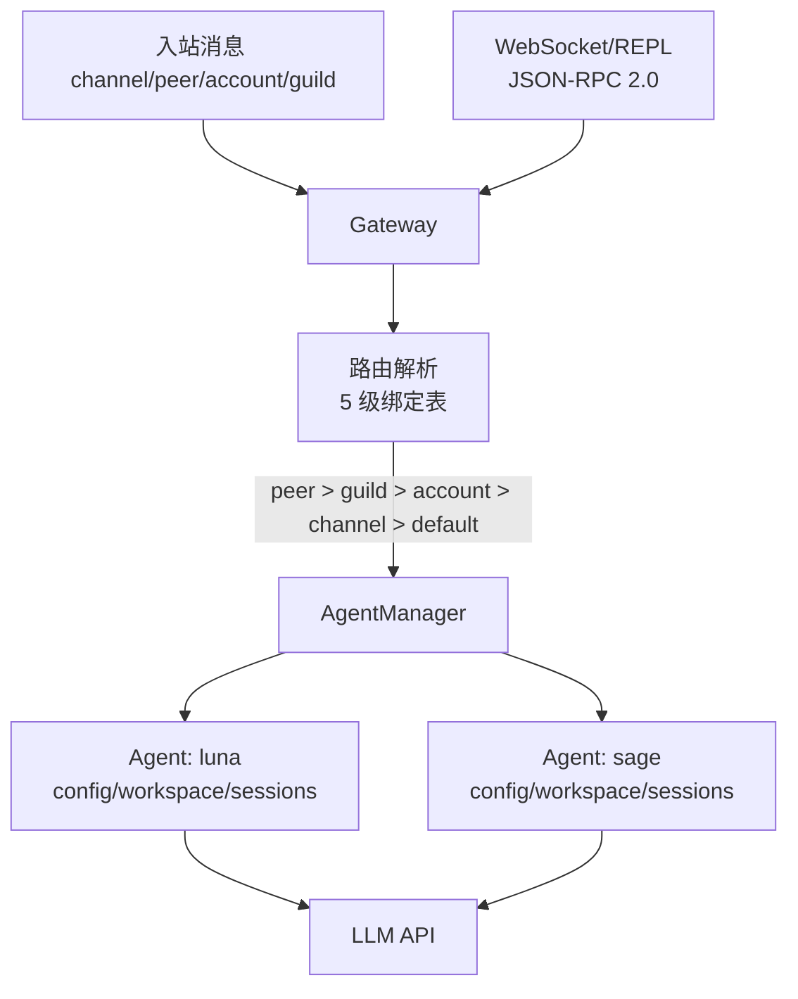

# S05 Gateway & Routing -- "每条消息都能找到归宿"

## 1. 核心概念

Gateway 是消息中枢：每条入站消息通过 5 级绑定表解析为 `(agent_id, session_key)`。
不同用户、不同平台可以路由到不同的 Agent，每个 Agent 有独立的配置、工作空间和会话存储。

5 级路由优先级（从高到低）：
1. **peer** -- 将特定用户路由到指定 Agent
2. **guild** -- 群组/服务器级别
3. **account** -- Bot 账号级别
4. **channel** -- 整个通道（如所有 Telegram 消息）
5. **default** -- 兜底匹配

Gateway 还提供 WebSocket + JSON-RPC 2.0 接口，用于外部程序（REPL、Web UI）连接。
每个 Agent 独立配置（模型、人格、DM 隔离策略），互不干扰。

## 2. 架构图



## 3. 关键代码片段

### Java: WebSocketServer + BindingTable + JSON-RPC 2.0

```java
// WebSocket 服务器: 基于 Java-WebSocket 库
static class GatewayServer extends WebSocketServer {
    @Override
    public void onMessage(WebSocket conn, String message) {
        Map<String, Object> req = JsonUtils.toMap(message);
        Object id = req.get("id");
        String method = (String) req.get("method");
        // JSON-RPC 2.0 分发
        Object result = switch (method) {
            case "send" -> handleSend(params);
            case "bindings.set" -> handleBindSet(params);
            case "bindings.list" -> handleBindList();
            default -> throw new RuntimeException("Unknown method");
        };
        conn.send(JsonUtils.toJson(Map.of(
            "jsonrpc", "2.0", "result", result, "id", id)));
    }
}

// 5 级绑定表: 按 tier 排序, 首次匹配胜出
Optional<Binding> resolve(String channel, String accountId,
                          String guildId, String peerId) {
    for (Binding b : bindings) {  // 已按 tier 升序排列
        boolean match = switch (b.tier()) {
            case 1 -> b.matchValue().equals(peerId);   // peer
            case 2 -> b.matchValue().equals(guildId);   // guild
            case 3 -> b.matchValue().equals(accountId); // account
            case 4 -> b.matchValue().equals(channel);   // channel
            case 5 -> true;                              // default
            default -> false;
        };
        if (match) return Optional.of(b);
    }
    return Optional.empty();
}

// AgentManager: 每个 Agent 独立的 config/workspace/sessions
record AgentConfig(String id, String name, String personality,
                   String model, String dmScope) {
    String systemPrompt() {
        return "You are " + name + ". Personality: " + personality;
    }
}

// dm_scope 控制会话隔离粒度
// "per-peer"      -> agent:{id}:direct:{peer}
// "per-channel-peer" -> agent:{id}:{ch}:direct:{peer}
// "main"          -> agent:{id}:main (共享会话)
```

### Python 对比

```python
# Python 用 websockets 库（异步）
import websockets
async def handle(ws):
    msg = json.loads(await ws.recv())
    result = dispatch(msg["method"], msg["params"])
    await ws.send(json.dumps({"jsonrpc": "2.0", "result": result, "id": msg["id"]}))

# Java 用 Java-WebSocket 库（同步回调）
# Python 的 async/await vs Java 的 Thread + callback

# 绑定表排序: Java 用 Comparable 接口
record Binding(...) implements Comparable<Binding> {
    public int compareTo(Binding o) {
        int cmp = Integer.compare(this.tier, o.tier);
        return cmp != 0 ? cmp : Integer.compare(o.priority, this.priority);
    }
}
```

**核心差异**：
- Java 用 `Java-WebSocket` 库的同步回调模式；Python 用 `websockets` 的 async/await 模式
- Java 的 `switch` 表达式（JDK 14+）可以直接返回值；Python 用 `match/case`（3.10+）
- Java 用 `record` + `Comparable` 接口实现排序；Python 用 `sort(key=lambda b: (b.tier, -b.priority))`
- Java 用 `Semaphore(4)` 限制并发 Agent 数量；Python 用 `asyncio.Semaphore(4)`

## 4. 运行方式

```bash
mvn compile exec:java -Dexec.mainClass="com.claw0.sessions.S05GatewayRouting"
```

启动后进入 REPL，可用命令管理绑定、Agent、会话，也可用 `/gateway` 启动 WebSocket 服务。

## 5. REPL 命令

| 命令 | 说明 |
|------|------|
| `/bindings` | 列出所有路由绑定（彩色显示层级） |
| `/route <channel> <peer>` | 模拟路由解析，显示匹配结果 |
| `/agents` | 列出已注册的 Agent |
| `/sessions` | 列出活跃会话 |
| `/switch <agent_id>` | 强制切换到指定 Agent（`/switch off` 恢复路由） |
| `/gateway` | 启动 WebSocket Gateway（后台运行） |
| `quit` / `exit` | 退出 |

## 6. 学习要点

1. **5 级路由：peer > guild > account > channel > default**：匹配时按层级从高到低，首次匹配胜出。同级按 priority 降序。这覆盖了"特定用户用特定 Agent"到"兜底默认 Agent"的所有场景。
2. **WebSocket 替代 HTTP 用于双向 REPL**：HTTP 是请求-响应模式，WebSocket 允许服务器主动推送。JSON-RPC 2.0 在 WebSocket 上提供结构化的请求/响应协议。
3. **每个 Agent 独立的工作空间、配置和会话存储**：AgentManager 为每个 Agent 创建独立目录结构（`workspace-{id}/`、`sessions/`），不同 Agent 的文件系统和对话历史完全隔离。
4. **dm_scope 控制会话隔离粒度**：`per-peer` 每人一个会话、`per-channel-peer` 每通道每人一个、`main` 所有用户共享一个会话。这决定了多用户场景下的上下文隔离策略。
