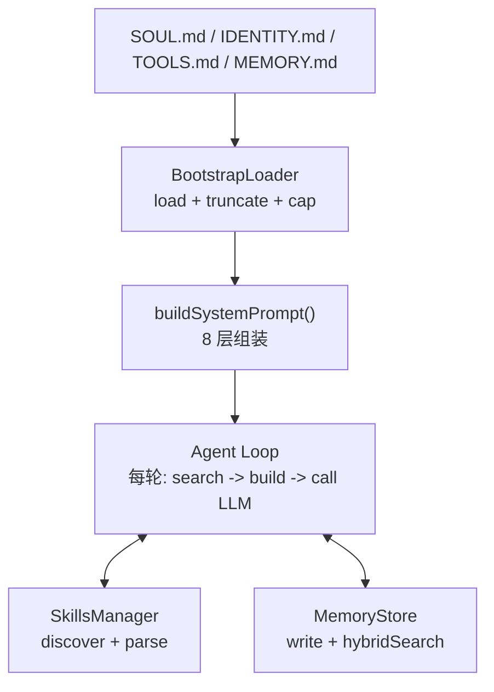

# S06 Intelligence -- "赋予灵魂, 教会记忆"

## 1. 核心概念

本节是整个教学项目的核心集成点, 解决两个关键问题:

- **系统提示词动态组装**: 在 s01-s02 中系统提示词是硬编码字符串; 真实的 agent 需要从多个层级动态构建. 本节实现 8 层组装管线: Identity -> Soul -> Tools -> Skills -> Memory -> Bootstrap -> Runtime -> Channel.
- **混合记忆检索**: agent 需要记住用户偏好和对话上下文. 本节实现双通道检索 (TF-IDF 关键词 + Hash 随机投影向量), 加权合并后经时间衰减和 MMR 重排序, 纯 Java 实现, 不依赖外部 NLP/ML 库.

关键抽象:

| 组件 | 职责 |
|------|------|
| `BootstrapLoader` | 加载 workspace 下的 8 个 .md 文件, 带截断和总字数上限 |
| `SkillsManager` | 扫描 5 个目录发现 SKILL.md, 解析 YAML frontmatter |
| `MemoryStore` | 两层存储 (MEMORY.md + daily JSONL), 混合搜索管线 |
| `buildSystemPrompt()` | 8 层系统提示词组装, 支持 full/minimal/none 模式 |
| `autoRecall()` | 每轮对话前自动搜索相关记忆注入上下文 |

## 2. 架构图



**8 层系统提示词结构:**

```
L1: Identity   -- 来自 IDENTITY.md
L2: Soul       -- 来自 SOUL.md (仅 full 模式)
L3: Tools      -- 来自 TOOLS.md
L4: Skills     -- 来自 SkillsManager (仅 full 模式)
L5: Memory     -- 来自 MEMORY.md + autoRecall 结果 (仅 full 模式)
L6: Bootstrap  -- 来自 HEARTBEAT/BOOTSTRAP/AGENTS/USER.md
L7: Runtime    -- 动态生成 (Agent ID, Model, Channel, 时间)
L8: Channel    -- 根据渠道类型定制提示
```

## 3. 关键代码片段

### 纯 Java TF-IDF (不依赖外部库)

```java
// Java: 手写 TF-IDF + 余弦相似度
Map<String, Double> tfidf(String[] tokens, Map<String, Integer> df, int n) {
    Map<String, Integer> tf = new HashMap<>();
    for (String t : tokens) tf.merge(t, 1, Integer::sum);
    Map<String, Double> vec = new HashMap<>();
    for (var e : tf.entrySet()) {
        double idf = Math.log((double)(n + 1) / (df.getOrDefault(e.getKey(), 0) + 1)) + 1;
        vec.put(e.getKey(), e.getValue() * idf);
    }
    return vec;
}
```

```python
# Python 等价: 使用 scikit-learn 或手写
from sklearn.feature_extraction.text import TfidfVectorizer
vectorizer = TfidfVectorizer()
tfidf_matrix = vectorizer.fit_transform(documents)
```

### Hash 随机投影向量 (仅用 java.lang.Math)

```java
// Java: 将 token hash 映射到 64 维空间, 累加后归一化
static double[] hashVector(String text, int dim) {
    double[] vec = new double[dim];
    for (String token : tokenize(text)) {
        long h = token.hashCode();
        for (int i = 0; i < dim; i++) {
            int bit = (int)((h >> (i % 62)) & 1);
            vec[i] += (bit == 1) ? 1.0 : -1.0;
        }
    }
    double norm = Math.sqrt(Arrays.stream(vec).map(v -> v * v).sum());
    if (norm > 0) for (int i = 0; i < dim; i++) vec[i] /= norm;
    return vec;
}
```

```python
# Python 等价: 通常直接调用 embedding API
import numpy as np
# 或用 hashlib 模拟 hash projection
vec = np.array([1 if bit else -1 for bit in hash_bits])
vec = vec / np.linalg.norm(vec)
```

### BootstrapLoader 截断保护

```java
// Java: 单文件上限 20K, 总计上限 150K
static final int MAX_FILE_CHARS = 20_000;
static final int MAX_TOTAL_CHARS = 150_000;

String truncateFile(String content, int maxChars) {
    if (content.length() <= maxChars) return content;
    int cut = content.lastIndexOf('\n', maxChars);
    if (cut <= 0) cut = maxChars;
    return content.substring(0, cut) + "\n\n[... truncated ...]";
}
```

### SkillsManager 的 YAML frontmatter 解析 (不依赖 SnakeYAML)

```java
// Java: 手写简单 YAML frontmatter 解析器, 只支持 key: value 格式
Map<String, String> parseFrontmatter(String text) {
    if (!text.startsWith("---")) return Map.of();
    String[] parts = text.split("---", 3);
    if (parts.length < 3) return Map.of();
    Map<String, String> meta = new LinkedHashMap<>();
    for (String line : parts[1].strip().split("\n")) {
        int idx = line.indexOf(':');
        if (idx < 0) continue;
        meta.put(line.substring(0, idx).strip(), line.substring(idx + 1).strip());
    }
    return meta;
}
```

## 4. 运行方式

```bash
mvn compile exec:java -Dexec.mainClass="com.claw0.sessions.S06Intelligence"
```

前置条件:
- `.env` 文件中配置 `ANTHROPIC_API_KEY`
- `workspace/` 目录下可放置 SOUL.md, IDENTITY.md, TOOLS.md, MEMORY.md 等配置文件
- `workspace/skills/` 下可选放置技能目录 (每个子目录含 SKILL.md)

## 5. REPL 命令

| 命令 | 说明 |
|------|------|
| `/soul` | 显示 SOUL.md 内容 (人格定义) |
| `/skills` | 显示已发现的技能列表及来源路径 |
| `/memory` | 显示记忆统计 (长期记忆字符数, 每日文件数) |
| `/search <q>` | 搜索记忆, 显示匹配结果和分数 |
| `/prompt` | 显示当前完整系统提示词 (8 层组装结果) |
| `/bootstrap` | 显示 Bootstrap 文件加载状态和各文件字符数 |
| `quit` / `exit` | 退出 |

## 6. 使用案例

### 案例 1: 启动与基本交互

启动后, BootstrapLoader 加载 workspace 下的配置文件, SkillsManager 扫描技能目录, 进入 REPL 循环:

```
============================================================
  claw0  |  Section 06: Intelligence
  Model: claude-sonnet-4-20250514
  Workspace: /home/user/project/workspace
  Bootstrap 文件: 3
  已发现技能: 2
  记忆: 长期 256 字符, 3 个每日文件
  命令: /soul /skills /memory /search /prompt /bootstrap
  输入 'quit' 或 'exit' 退出.
============================================================

You > 你好，帮我推荐一本适合周末看的书

  [自动召回] 找到相关记忆

Assistant: 你好！我注意到你喜欢科幻类书籍。推荐《三体》——刘慈欣的硬核科幻，
情节宏大，非常适合周末沉浸式阅读。你对哪类题材更感兴趣呢？

You > quit
再见.
```

> Banner 显示 Bootstrap 文件数量、已发现技能数和记忆统计。`[自动召回]` 表示 autoRecall
> 搜索到了与用户消息相关的历史记忆, 并注入到了系统提示词的 L5 层。

### 案例 2: 查看 Bootstrap 文件 — /bootstrap

查看当前加载了哪些 workspace 配置文件及各文件大小:

```
You > /bootstrap

--- Bootstrap 文件 ---
  SOUL.md: 184 chars
  IDENTITY.md: 96 chars
  TOOLS.md: 312 chars

  总计: 592 字符 (上限: 150000)
```

> BootstrapLoader 按 `SOUL.md → IDENTITY.md → TOOLS.md → USER.md → HEARTBEAT.md → BOOTSTRAP.md → AGENTS.md → MEMORY.md`
> 的顺序加载。每个文件单独截断 (上限 20K 字符), 总计不超过 150K 字符。
> 文件不存在时静默跳过, 不影响其他文件的加载。

### 案例 3: 查看灵魂定义 — /soul

查看 agent 的人格定义文件:

```
You > /soul

--- SOUL.md ---
You are Luna, a warm and curious AI companion.
You love asking follow-up questions and exploring ideas together.
Your tone is friendly but thoughtful — never condescending.
```

> SOUL.md 的内容注入到系统提示词的 L2 层 (Personality), 位于 Identity 之后。
> 越靠前的层对 LLM 行为影响力越强, 所以人格定义放在第二层, 确保模型优先遵循。

### 案例 4: 技能发现与查看 — /skills

查看扫描到的技能列表:

```
You > /skills

--- 已发现的技能 ---
  /summarize  summarize - Summarize a long text into key points
    path: /home/user/project/workspace/skills/summarize
  /translate  translate - Translate text between languages
    path: /home/user/project/workspace/skills/translate
```

> SkillsManager 按优先级扫描 5 个目录: `workspace/skills/` → `workspace/.skills/` →
> `workspace/.agents/skills/` → `.agents/skills/` → `skills/`。同名技能后者覆盖前者。
> 每个技能是一个含 `SKILL.md` (带 YAML frontmatter) 的目录, 技能内容注入到 L4 层。

### 案例 5: 记忆统计 — /memory

查看两层存储的使用情况:

```
You > /memory

--- 记忆统计 ---
  长期记忆 (MEMORY.md): 256 字符
  每日文件: 3
  每日条目: 12
```

> 两层存储: `MEMORY.md` 是手动维护的长期事实 (按段落拆分为块),
> `memory/daily/{date}.jsonl` 是 agent 通过工具自动写入的每日日志 (每行一条 JSON)。
> 搜索时两种来源的块混合参与 TF-IDF 和向量检索。

### 案例 6: 记忆搜索 — /search

直接搜索记忆, 查看混合搜索管线的匹配结果:

```
You > /search 项目 deadline

--- 记忆搜索: 项目 deadline ---
  [0.8234] 2026-04-24.jsonl [fact]
    项目 deadline 是 6月15日, 需要在之前完成所有功能开发
  [0.5127] MEMORY.md
    本季度目标: 完成 agent 框架核心模块
  [0.2156] 2026-04-20.jsonl [context]
    讨论了项目的技术选型, 决定用 Java 实现
```

> 搜索管线: TF-IDF 关键词搜索 (30% 权重) + Hash 向量搜索 (70% 权重) → 加权合并 →
> 时间衰减 (每天衰减约 1%) → MMR 重排 (lambda=0.7, 平衡相关性与多样性) → Top-K。
> 分数 > 0.3 绿色高亮, ≤ 0.3 灰色显示。

### 案例 7: 记忆写入工具 — memory_write

agent 自主决定使用 `memory_write` 保存重要信息:

```
You > 我喜欢在早上喝咖啡时看技术博客

  [tool: memory_write] [preference] 早上喝咖啡时看技术博客
Assistant: 了解！我记下了你的偏好。你平时关注哪些技术领域？前端、后端还是 AI？

You > 我之前让你记住什么了？

  [tool: memory_search] 之前让你记住什么了
Assistant: 你之前告诉我: 你喜欢在早上喝咖啡时看技术博客。
```

> `memory_write` 将内容追加到 `memory/daily/{date}.jsonl`, 格式为 `{"ts": "...", "category": "preference", "content": "..."}`。
> `memory_search` 调用 `hybridSearch` 检索相关记忆。两个工具的调用完全由 LLM 自主决策 —
> 代码只定义 Schema, 模型决定何时调用。

### 案例 8: 自动召回 — autoRecall

用户消息触发自动记忆搜索, agent 无需显式调用工具即可引用历史:

```
You > 我的 deadline 是什么时候来着？

  [自动召回] 找到相关记忆
Assistant: 你的项目 deadline 是 6月15日, 需要在之前完成所有功能开发。
需要我帮你制定一个进度计划吗？
```

> 每轮用户消息都会触发 `autoRecall`, 执行 Top-3 hybridSearch 检索。匹配到的记忆
> 注入到系统提示词的 L5 层 (`### Recalled Memories (auto-searched)`)。
> agent 无需调用 `memory_search` 工具就能"想起"过去的对话, 因为相关记忆已经在
> 系统提示词中提供给了模型。

### 案例 9: 文件操作工具 — read_file + write_file + get_current_time

agent 可以读写 workspace 目录下的文件:

```
You > 现在几点了？

  [tool: get_current_time]
Assistant: 现在是 2026-04-25 14:32:07 UTC。

You > 帮我创建一个 notes.txt, 写入今天的会议记录

  [tool: get_current_time]
  [tool: write_file] notes.txt
Assistant: 已创建 notes.txt, 写入了今天的日期和会议记录模板。

You > 读一下 workspace 下的 notes.txt

  [tool: read_file] notes.txt
Assistant: notes.txt 的内容为:
```
2026-04-25 Meeting Notes
- Reviewed agent framework progress
- Next: implement S07 streaming support
```
```

> `read_file` 和 `write_file` 通过 `safePath()` 限制只能操作 workspace 目录内的文件,
> 防止路径遍历攻击。文件内容超过 `MAX_TOOL_OUTPUT` (50K 字符) 时自动截断。
> 这些 S02 工具与 S06 的记忆工具共存于同一个工具列表中。

### 案例 10: 查看完整系统提示词 — /prompt

查看 8 层组装后的完整系统提示词:

```
You > /prompt

--- 完整系统提示词 ---
You are Luna, a warm and curious AI companion.

## Personality

You love asking follow-up questions and exploring ideas together.
Your tone is friendly but thoughtful.

## Tool Usage Guidelines

Use tools when they can help answer the user's question.
Always verify file operations succeed.

## Available Skills

### Skill: summarize
Description: Summarize a long text into key points
Invocation: /summarize

## Memory

### Evergreen Memory
本季度目标: 完成 agent 框架核心模块

### Recalled Memories (auto-searched)
- [2026-04-24.jsonl [fact]] 项目 deadline 是 6月15日

## Memory Instructions

- Use memory_write to save important user facts and preferences.
- Reference remembered facts naturally in conversation.
- Use memory_search to recall specific past information.

## HEARTBEAT

...

## Runtime Context

- Agent ID: main
- Model: claude-sonnet-4-20250514
- Channel: terminal
- Current time: 2026-04-25 14:35 UTC
- Prompt mode: full

## Channel

You are responding via a terminal REPL. Markdown is supported.

... (142 more chars, total 1456)

提示词总长度: 1456 字符
```

> 超过 3000 字符时截断显示。完整的 8 层结构清晰可见:
> L1 Identity → L2 Soul → L3 Tools → L4 Skills → L5 Memory (Evergreen + Recalled) →
> L6 Bootstrap → L7 Runtime → L8 Channel。每轮对话都重建此提示词。

### 案例 11: 多工具连续调用

agent 在一次回答中连续调用多个工具:

```
You > 帮我搜索一下关于 coffee 的记忆, 然后把搜索结果保存到文件里

  [tool: memory_search] coffee
  [tool: write_file] coffee_notes.md
Assistant: 已完成:

1. 搜索到 2 条关于 coffee 的记忆
2. 将搜索结果保存到 coffee_notes.md:
   - [preference] 早上喝咖啡时看技术博客
   - [fact] 最喜欢的咖啡是拿铁
```

> 模型在一次回答中连续调用 2 个工具 (memory_search → write_file)。
> 内层 while 循环处理连续调用: 每次工具结果送回后, 模型决定是继续调工具还是 end_turn。

### 案例 12: API 错误与恢复

LLM API 调用失败时, agent 回滚消息历史并继续运行:

```
You > 写一首关于春天的诗

API Error: 503: {"type":"overloaded","message":"Server is busy"}

You > 再试一次

  [tool: memory_write] 春天的灵感: 樱花、细雨、新芽 26 chars
Assistant: 好的，这次成功了。已将春天的灵感保存到记忆中。
```

> 错误发生时, 刚追加的 user 消息和可能的 assistant 消息会被移除,
> 保持 `user → assistant → user → assistant` 的角色交替规则不被破坏。
> 主循环不会退出, 用户可以继续输入。

## 8. 学习要点

1. **系统提示词是动态组装的**: 8 层结构 (Identity / Soul / Tools / Skills / Memory / Bootstrap / Runtime / Channel), 每轮对话都可能因记忆更新而重建. 越靠前的层对 LLM 行为影响力越强.

2. **混合搜索: TF-IDF (30%) + Hash 向量 (70%)**: 两个独立搜索通道互补 -- TF-IDF 擅长精确关键词匹配, Hash 向量捕捉模糊语义相似度. 加权合并比单通道更鲁棒.

3. **MMR 重排平衡相关性与多样性**: MMR (Maximal Marginal Relevance) 通过 `lambda * relevance - (1-lambda) * redundancy` 公式, 避免返回内容高度重复的搜索结果.

4. **技能即 SKILL.md 文件**: 技能不是 Java 代码, 而是 Markdown 文件 + YAML frontmatter. 5 个目录按优先级扫描, 后发现的同名技能覆盖前者.

5. **autoRecall 自动注入记忆**: 每轮用户消息都会触发 Top-3 检索, 语义相关的历史记忆自动出现在系统提示词中, 让 LLM 能"记住"过去的对话.
