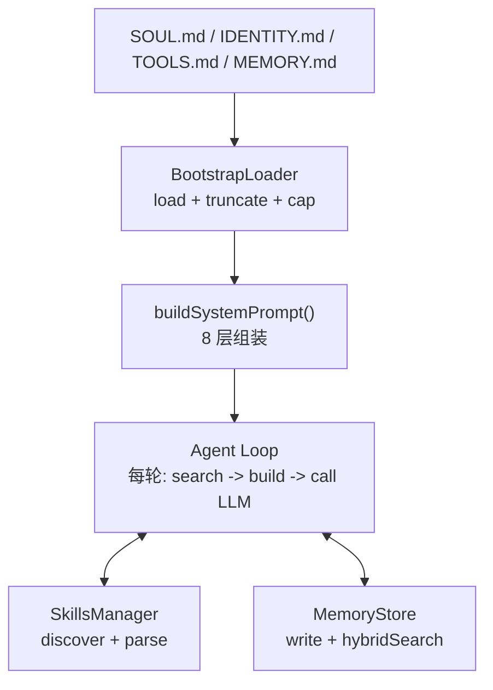

# S06 Intelligence -- "赋予灵魂, 教会记忆"

## 1. 核心概念

本节是整个教学项目的核心集成点, 解决两个关键问题:

- **系统提示词动态组装**: 在 s01-s02 中系统提示词是硬编码字符串; 真实的 agent 需要从多个层级动态构建. 本节实现 8 层组装管线: Identity -> Soul -> Tools -> Skills -> Memory -> Bootstrap -> Runtime -> Channel.
- **混合记忆检索**: agent 需要记住用户偏好和对话上下文. 本节实现双通道检索 (TF-IDF 关键词 + Hash 随机投影向量), 加权合并后经时间衰减和 MMR 重排序, 纯 Java 实现, 不依赖外部 NLP/ML 库.

关键抽象:

| 组件 | 职责 |
|------|------|
| `BootstrapLoader` | 加载 workspace 下的 8 个 .md 文件, 带截断和总字数上限 |
| `SkillsManager` | 扫描 5 个目录发现 SKILL.md, 解析 YAML frontmatter |
| `MemoryStore` | 两层存储 (MEMORY.md + daily JSONL), 混合搜索管线 |
| `buildSystemPrompt()` | 8 层系统提示词组装, 支持 full/minimal/none 模式 |
| `autoRecall()` | 每轮对话前自动搜索相关记忆注入上下文 |

## 2. 架构图



**8 层系统提示词结构:**

```
L1: Identity   -- 来自 IDENTITY.md
L2: Soul       -- 来自 SOUL.md (仅 full 模式)
L3: Tools      -- 来自 TOOLS.md
L4: Skills     -- 来自 SkillsManager (仅 full 模式)
L5: Memory     -- 来自 MEMORY.md + autoRecall 结果 (仅 full 模式)
L6: Bootstrap  -- 来自 HEARTBEAT/BOOTSTRAP/AGENTS/USER.md
L7: Runtime    -- 动态生成 (Agent ID, Model, Channel, 时间)
L8: Channel    -- 根据渠道类型定制提示
```

## 3. 关键代码片段

### 纯 Java TF-IDF (不依赖外部库)

```java
// Java: 手写 TF-IDF + 余弦相似度
Map<String, Double> tfidf(String[] tokens, Map<String, Integer> df, int n) {
    Map<String, Integer> tf = new HashMap<>();
    for (String t : tokens) tf.merge(t, 1, Integer::sum);
    Map<String, Double> vec = new HashMap<>();
    for (var e : tf.entrySet()) {
        double idf = Math.log((double)(n + 1) / (df.getOrDefault(e.getKey(), 0) + 1)) + 1;
        vec.put(e.getKey(), e.getValue() * idf);
    }
    return vec;
}
```

```python
# Python 等价: 使用 scikit-learn 或手写
from sklearn.feature_extraction.text import TfidfVectorizer
vectorizer = TfidfVectorizer()
tfidf_matrix = vectorizer.fit_transform(documents)
```

### Hash 随机投影向量 (仅用 java.lang.Math)

```java
// Java: 将 token hash 映射到 64 维空间, 累加后归一化
static double[] hashVector(String text, int dim) {
    double[] vec = new double[dim];
    for (String token : tokenize(text)) {
        long h = token.hashCode();
        for (int i = 0; i < dim; i++) {
            int bit = (int)((h >> (i % 62)) & 1);
            vec[i] += (bit == 1) ? 1.0 : -1.0;
        }
    }
    double norm = Math.sqrt(Arrays.stream(vec).map(v -> v * v).sum());
    if (norm > 0) for (int i = 0; i < dim; i++) vec[i] /= norm;
    return vec;
}
```

```python
# Python 等价: 通常直接调用 embedding API
import numpy as np
# 或用 hashlib 模拟 hash projection
vec = np.array([1 if bit else -1 for bit in hash_bits])
vec = vec / np.linalg.norm(vec)
```

### BootstrapLoader 截断保护

```java
// Java: 单文件上限 20K, 总计上限 150K
static final int MAX_FILE_CHARS = 20_000;
static final int MAX_TOTAL_CHARS = 150_000;

String truncateFile(String content, int maxChars) {
    if (content.length() <= maxChars) return content;
    int cut = content.lastIndexOf('\n', maxChars);
    if (cut <= 0) cut = maxChars;
    return content.substring(0, cut) + "\n\n[... truncated ...]";
}
```

### SkillsManager 的 YAML frontmatter 解析 (不依赖 SnakeYAML)

```java
// Java: 手写简单 YAML frontmatter 解析器, 只支持 key: value 格式
Map<String, String> parseFrontmatter(String text) {
    if (!text.startsWith("---")) return Map.of();
    String[] parts = text.split("---", 3);
    if (parts.length < 3) return Map.of();
    Map<String, String> meta = new LinkedHashMap<>();
    for (String line : parts[1].strip().split("\n")) {
        int idx = line.indexOf(':');
        if (idx < 0) continue;
        meta.put(line.substring(0, idx).strip(), line.substring(idx + 1).strip());
    }
    return meta;
}
```

## 4. 运行方式

```bash
mvn compile exec:java -Dexec.mainClass="com.claw0.sessions.S06Intelligence"
```

前置条件:
- `.env` 文件中配置 `ANTHROPIC_API_KEY`
- `workspace/` 目录下可放置 SOUL.md, IDENTITY.md, TOOLS.md, MEMORY.md 等配置文件
- `workspace/skills/` 下可选放置技能目录 (每个子目录含 SKILL.md)

## 5. REPL 命令

| 命令 | 说明 |
|------|------|
| `/soul` | 显示 SOUL.md 内容 (人格定义) |
| `/skills` | 显示已发现的技能列表及来源路径 |
| `/memory` | 显示记忆统计 (长期记忆字符数, 每日文件数) |
| `/search <q>` | 搜索记忆, 显示匹配结果和分数 |
| `/prompt` | 显示当前完整系统提示词 (8 层组装结果) |
| `/bootstrap` | 显示 Bootstrap 文件加载状态和各文件字符数 |
| `quit` / `exit` | 退出 |

## 6. 学习要点

1. **系统提示词是动态组装的**: 8 层结构 (Identity / Soul / Tools / Skills / Memory / Bootstrap / Runtime / Channel), 每轮对话都可能因记忆更新而重建. 越靠前的层对 LLM 行为影响力越强.

2. **混合搜索: TF-IDF (30%) + Hash 向量 (70%)**: 两个独立搜索通道互补 -- TF-IDF 擅长精确关键词匹配, Hash 向量捕捉模糊语义相似度. 加权合并比单通道更鲁棒.

3. **MMR 重排平衡相关性与多样性**: MMR (Maximal Marginal Relevance) 通过 `lambda * relevance - (1-lambda) * redundancy` 公式, 避免返回内容高度重复的搜索结果.

4. **技能即 SKILL.md 文件**: 技能不是 Java 代码, 而是 Markdown 文件 + YAML frontmatter. 5 个目录按优先级扫描, 后发现的同名技能覆盖前者.

5. **autoRecall 自动注入记忆**: 每轮用户消息都会触发 Top-3 检索, 语义相关的历史记忆自动出现在系统提示词中, 让 LLM 能"记住"过去的对话.
