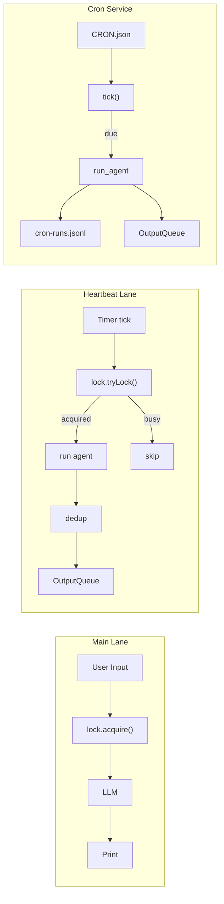

# S07 Heartbeat & Cron -- "Not just reactive -- proactive"

## 1. 核心概念

前 6 节的 agent 都是被动响应模式: 用户发消息 -> agent 回复. 本节引入主动执行能力:

- **HeartbeatRunner**: 定时后台线程检查"是否应该运行?", 用非阻塞 `tryLock()` 获取锁; 如果用户正在对话则自动跳过, 保证用户优先.
- **CronService**: 从 `CRON.json` 加载定时任务, 支持 3 种调度类型 (`at` / `every` / `cron`), 到期时调用 LLM 执行后台任务.
- **OutputQueue 模式**: heartbeat 和 cron 的输出通过 `ConcurrentLinkedQueue` 传递给 REPL 主循环打印, 实现后台线程与主线程的解耦.

关键设计: 用共享的 `ReentrantLock` 实现 lane 互斥. 用户对话用阻塞 `lock()` 获取, heartbeat 用非阻塞 `tryLock()` -- 拿不到就跳过.

## 2. 架构图



## 3. 关键代码片段

### ReentrantLock + tryLock() 实现用户优先

```java
// Java: 用户用阻塞锁, heartbeat 用非阻塞锁
ReentrantLock laneLock = new ReentrantLock();

// 用户对话 -- 阻塞获取 (用户始终优先)
laneLock.lock();
try {
    // ... 调用 LLM ...
} finally {
    laneLock.unlock();
}

// Heartbeat -- 非阻塞获取, 忙则跳过
boolean acquired = laneLock.tryLock();
if (!acquired) return;  // 用户在用, 自动跳过
try {
    // ... 执行心跳 ...
} finally {
    laneLock.unlock();
}
```

```python
# Python 等价: threading.Lock
import threading
lane_lock = threading.Lock()

# 用户对话
with lane_lock:  # 阻塞等待
    call_llm(...)

# Heartbeat
acquired = lane_lock.acquire(blocking=False)
if not acquired:
    return  # 跳过
try:
    run_heartbeat(...)
finally:
    lane_lock.release()
```

### ScheduledExecutorService + 虚拟线程

```java
// Java: 用虚拟线程作为 daemon 后台线程
ScheduledExecutorService scheduler = Executors.newSingleThreadScheduledExecutor(r -> {
    Thread t = Thread.ofVirtual().name("heartbeat-loop").unstarted(r);
    t.setDaemon(true);
    return t;
});
scheduler.scheduleWithFixedDelay(() -> {
    ShouldRunResult check = shouldRun();
    if (check.shouldRun) execute();
}, 1, 1, TimeUnit.SECONDS);
```

```python
# Python 等价: threading.Timer
import threading
def heartbeat_loop():
    if should_run():
        execute()
    threading.Timer(1.0, heartbeat_loop).start()
```

### Heartbeat 4 项前置检查

```java
ShouldRunResult shouldRun() {
    // 检查 1: HEARTBEAT.md 文件存在
    if (!Files.exists(heartbeatPath))
        return new ShouldRunResult(false, "HEARTBEAT.md not found");
    // 检查 2: HEARTBEAT.md 内容非空
    if (Files.readString(heartbeatPath).strip().isEmpty())
        return new ShouldRunResult(false, "HEARTBEAT.md is empty");
    // 检查 3: 距上次运行间隔足够 (默认 30 分钟)
    if (elapsed < intervalSeconds)
        return new ShouldRunResult(false, "interval not elapsed");
    // 检查 4: 在活跃时段内 (默认 9:00-22:00)
    if (!inHours)
        return new ShouldRunResult(false, "outside active hours");
    return new ShouldRunResult(true, "all checks passed");
}
```

### CronService 支持 at/every/cron 三种调度

```java
// Java: 使用 cron-utils 解析标准 cron 表达式
private static final CronParser CRON_PARSER = new CronParser(
    CronDefinitionBuilder.instanceDefinitionFor(CronType.UNIX));

double computeNext(CronJob job, double now) {
    switch (job.scheduleKind) {
        case "at"    -> { /* 一次性 ISO 时间戳 */ }
        case "every" -> { /* 固定间隔: anchor + N * interval */ }
        case "cron"  -> {
            var cron = CRON_PARSER.parse(expr);
            var next = ExecutionTime.forCron(cron)
                .nextExecution(ZonedDateTime.now());
            return next.map(zdt -> (double) zdt.toEpochSecond()).orElse(0.0);
        }
    }
}
```

## 4. 运行方式

```bash
mvn compile exec:java -Dexec.mainClass="com.claw0.sessions.S07HeartbeatCron"
```

前置条件:
- `.env` 文件中配置 `ANTHROPIC_API_KEY`
- 可选: `workspace/HEARTBEAT.md` 配置心跳指令
- 可选: `workspace/CRON.json` 配置定时任务

## 5. REPL 命令

| 命令 | 说明 |
|------|------|
| `/heartbeat` | 显示心跳状态 (enabled, interval, last_run, next_in, active_hours) |
| `/trigger` | 手动触发一次心跳 (绕过间隔检查) |
| `/cron` | 列出所有 cron 任务及状态 |
| `/cron-trigger <id>` | 手动触发指定 cron 任务 |
| `/lanes` | 检查 lane 锁状态 (main 是否被占用) |
| `/help` | 显示帮助信息 |
| `quit` / `exit` | 退出 |

## 6. 使用案例

### 案例 1: 启动 — Heartbeat + Cron 自动运行

启动后, HeartbeatRunner 在后台线程中每秒检查是否应该运行, CronService 每秒检查是否有到期任务:

```
============================================================
  claw0  |  Section 07: Heartbeat & Cron
  Model: claude-sonnet-4-20250514
  Heartbeat: on (1800s)
  Cron jobs: 3
  /help for commands. quit to exit.
============================================================

You > 你好，介绍一下你自己

Assistant: 你好！我是一个支持主动执行后台任务的 AI 助手。我可以定期检查
邮件、生成摘要、执行定时任务, 同时正常与你对话。有什么可以帮你的吗？

[cron] [每日早报] Good morning! 今日天气晴, 气温 18-26°C...

You > quit
再见.
```

> Banner 显示 Heartbeat 状态 (on/off + 间隔秒数) 和 Cron 任务数量。
> `[cron]` 标记的消息是 CronService 后台执行的结果, 通过 OutputQueue 传递给 REPL 主循环打印。
> 用户对话期间 cron 消息会排队, 等用户输入时才显示。

### 案例 2: 查看心跳状态 — /heartbeat

```
You > /heartbeat

  enabled: true
  running: false
  should_run: false
  reason: interval not elapsed (1200s remaining)
  last_run: 2026-04-26T03:30:00Z
  next_in: 1200s
  interval: 1800s
  active_hours: 9:00-22:00
  queue_size: 0
```

> `enabled` 表示 HEARTBEAT.md 文件是否存在 (文件即开关)。
> `should_run: false` + `reason` 说明当前为何不运行: 间隔未到/不在活跃时段/正在运行/HEARTBEAT.md 缺失。
> `interval: 1800s` = 30 分钟, 可通过环境变量 `HEARTBEAT_INTERVAL` 配置。

### 案例 3: 手动触发心跳 — /trigger

绕过间隔检查, 立即执行一次心跳:

```
You > /trigger

  triggered, output queued (128 chars)
[heartbeat] 注意到你有 3 封未读邮件, 主题涉及 Q2 项目进度评审和周五会议安排。

You >
```

> `/trigger` 忽略 30 分钟间隔限制, 但仍然受 lane 锁约束 — 如果用户正在对话中则无法触发。
> 心跳 prompt 来自 HEARTBEAT.md 的指令 + MEMORY.md 的记忆上下文 + 当前时间。
> LLM 返回 "HEARTBEAT_OK" 时表示没有需要报告的内容, 不会推送。

### 案例 4: 查看 Lane 锁状态 — /lanes

检查用户对话通道和心跳通道的状态:

```
You > /lanes

  main_locked: false  heartbeat_running: false

You > 帮我查一下明天的日程

  [tool: memory_search]
Assistant: 明天 10:00 有项目周会, 14:00 有代码评审。

You > /lanes

  main_locked: false  heartbeat_running: false
```

> `main_locked` 表示用户对话锁是否被持有。对话结束后锁已释放。
> `heartbeat_running` 表示心跳是否正在执行。两个都为 false 时, 下一个心跳 tick 可以获取锁。

### 案例 5: HEARTBEAT.md 配置与去重

在 `workspace/HEARTBEAT.md` 中写入心跳指令:

```markdown
You are a proactive assistant. Check if there's anything the user should know.
If nothing noteworthy, respond with exactly: HEARTBEAT_OK
Keep your response under 2 sentences.
```

连续触发时, 相同输出会被去重:

```
You > /trigger
  triggered, output queued (85 chars)
[heartbeat] 今天是你订阅的续费日, 记得检查自动扣款是否成功。

You > /trigger
  HEARTBEAT_OK (nothing to report)

You > /trigger
  duplicate content (skipped)
```

> 第一次触发: 有新内容, 推送到队列。第二次: LLM 返回 HEARTBEAT_OK, 无需报告。
> 第三次: 如果输出与上次相同, 去重跳过, 避免重复打扰用户。

### 案例 6: CRON.json 配置 — 三种调度类型

在 `workspace/CRON.json` 中定义定时任务:

```json
{
  "jobs": [
    {
      "id": "morning-summary",
      "name": "每日早报",
      "enabled": true,
      "schedule": {"kind": "cron", "expr": "0 9 * * *"},
      "payload": {"kind": "agent_turn", "message": "生成今日简报: 天气、日程、待办"}
    },
    {
      "id": "hourly-check",
      "name": "每小时检查",
      "enabled": true,
      "schedule": {"kind": "every", "every_seconds": 3600},
      "payload": {"kind": "agent_turn", "message": "检查是否有需要提醒用户的事项"}
    },
    {
      "id": "one-time-reminder",
      "name": "一次性提醒",
      "enabled": true,
      "schedule": {"kind": "at", "at": "2026-04-26T18:00:00"},
      "payload": {"kind": "system_event", "text": "该准备下班了! 别忘了拿快递。"},
      "delete_after_run": true
    }
  ]
}
```

> **cron**: 标准 5 字段 cron 表达式 (分 时 日 月 周)。`0 9 * * *` = 每天早上 9 点。
> **every**: 固定间隔, `every_seconds: 3600` = 每 3600 秒。可选 `anchor` 指定起始时间。
> **at**: 一次性任务, 指定 ISO 时间戳。`delete_after_run: true` 运行后自动删除。
> **payload.kind**: `agent_turn` = 调用 LLM 执行, `system_event` = 直接输出文本。

### 案例 7: 查看 Cron 任务 — /cron

```
You > /cron

  [ON] morning-summary - 每日早报 in 28800s
  [ON] hourly-check - 每小时检查 in 1200s
  [ON] one-time-reminder - 一次性提醒 in 14400s
```

> `[ON]`/`[OFF]` 显示任务启用状态。连续错误 5 次后自动切换为 `[OFF]`。
> `in Ns` 显示距下次运行的秒数。一次性任务执行后从列表消失。

### 案例 8: 手动触发 Cron 任务 — /cron-trigger

```
You > /cron-trigger hourly-check

  '每小时检查' triggered (errors=0)
[cron] [每小时检查] 没有发现需要特别提醒的事项, 一切正常。
```

> 手动触发忽略调度时间, 立即执行。输出通过 OutputQueue 传递给 REPL。
> `errors=0` 表示该任务没有连续错误记录。

### 案例 9: Cron 自动禁用 — 连续错误保护

当定时任务连续失败 5 次后自动禁用:

```
[cron] [broken-task] [cron error: API rate limit exceeded]
[cron] [broken-task] [cron error: API rate limit exceeded]
[cron] [broken-task] [cron error: API rate limit exceeded]
[cron] [broken-task] [cron error: API rate limit exceeded]
[cron] [broken-task] [cron error: API rate limit exceeded]
  Job 'broken-task' auto-disabled after 5 consecutive errors: API rate limit exceeded

You > /cron

  [ON] morning-summary - 每日早报 in 28800s
  [OFF] broken-task - 故障任务 err:5
```

> 每次执行失败 `consecutiveErrors` 递增, 成功时归零。达到阈值 (默认 5) 时 `enabled` 设为 false。
> 自动禁用避免持续失败的 API 调用白白消耗额度, 等待人工介入修复。
> 运行日志追加到 `workspace/cron/cron-runs.jsonl`, 包含 job_id、时间、状态和输出预览。

### 案例 10: 记忆工具 — 后台任务与对话共享

用户对话和后台任务都可以使用记忆工具:

```
You > 记住: 我对花生过敏

  [tool: memory_write]
Assistant: 已记住, 你对花生过敏。我会避免在餐饮推荐中包含花生相关食物。

[cron] [每日早报] 今日简报: 天气晴, 气温 20-28°C。午餐推荐: 清蒸鲈鱼...

You > 我对什么过敏？

  [tool: memory_search]
Assistant: 你对花生过敏。
```

> memory_write 将内容追加到 MEMORY.md。memory_search 做行级搜索。
> 后台任务 (心跳、cron) 的系统提示词中也包含 MEMORY.md 内容, 因此 LLM 可以参考已有记忆。

### 案例 11: Lane 互斥 — 用户优先

用户正在对话时, 心跳自动跳过; 用户空闲时, 心跳正常执行:

```
You > 帮我写一个复杂的排序算法

  [tool: memory_write]
Assistant: 已实现一个归并排序...

                          ← heartbeat tick: tryLock() 失败 → 自动跳过
                          ← heartbeat tick: tryLock() 失败 → 自动跳过

You > 谢谢, 再见。

                          ← heartbeat tick: tryLock() 成功 → 执行心跳检查
[heartbeat] 检查到你的订阅将在 3 天后到期, 建议提前续费。
```

> 用户对话期间: `laneLock.lock()` 持有锁, heartbeat 的 `tryLock()` 返回 false, 自动跳过。
> 用户输入 `quit` 后锁释放, 下一个心跳 tick 成功获取锁并执行。
> 这是 ReentrantLock 的非阻塞模式 (`tryLock`) 实现的优先级机制。

## 8. 学习要点

1. **Heartbeat 使用 tryLock() 实现非阻塞用户优先**: 用户对话用 `lock()` 阻塞等待, heartbeat 用 `tryLock()` 非阻塞尝试. 拿不到锁说明用户在对话, 心跳自动跳过.

2. **4 项前置检查避免无效心跳**: HEARTBEAT.md 存在 -> 内容非空 -> 间隔足够 -> 在活跃时段内. 只有全部通过才执行心跳调用.

3. **CronService 支持 at/every/cron 三种调度类型**: "at" 是一次性任务 (运行后删除), "every" 是固定间隔, "cron" 是标准 5 字段 cron 表达式. 连续错误达到阈值 (默认 5 次) 自动禁用.

4. **OutputQueue 模式解耦后台线程与 REPL**: heartbeat 和 cron 的输出不直接 `System.out.println`, 而是通过 `ConcurrentLinkedQueue` 传递. REPL 主循环每轮先排空队列再等待用户输入.

5. **ShutdownHook 优雅关闭**: `Runtime.getRuntime().addShutdownHook()` 注册关闭钩子, Ctrl+C 时依次停止 heartbeat 线程、cron 调度器, 确保资源释放.
