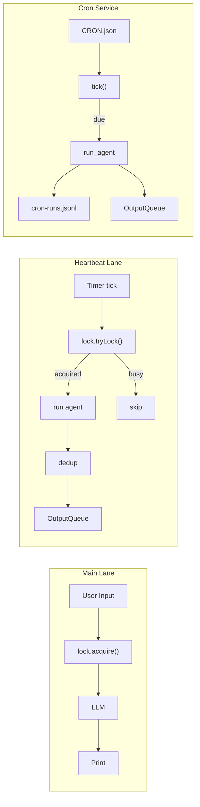

# S07 Heartbeat & Cron -- "Not just reactive -- proactive"

## 1. 核心概念

前 6 节的 agent 都是被动响应模式: 用户发消息 -> agent 回复. 本节引入主动执行能力:

- **HeartbeatRunner**: 定时后台线程检查"是否应该运行?", 用非阻塞 `tryLock()` 获取锁; 如果用户正在对话则自动跳过, 保证用户优先.
- **CronService**: 从 `CRON.json` 加载定时任务, 支持 3 种调度类型 (`at` / `every` / `cron`), 到期时调用 LLM 执行后台任务.
- **OutputQueue 模式**: heartbeat 和 cron 的输出通过 `ConcurrentLinkedQueue` 传递给 REPL 主循环打印, 实现后台线程与主线程的解耦.

关键设计: 用共享的 `ReentrantLock` 实现 lane 互斥. 用户对话用阻塞 `lock()` 获取, heartbeat 用非阻塞 `tryLock()` -- 拿不到就跳过.

## 2. 架构图



## 3. 关键代码片段

### ReentrantLock + tryLock() 实现用户优先

```java
// Java: 用户用阻塞锁, heartbeat 用非阻塞锁
ReentrantLock laneLock = new ReentrantLock();

// 用户对话 -- 阻塞获取 (用户始终优先)
laneLock.lock();
try {
    // ... 调用 LLM ...
} finally {
    laneLock.unlock();
}

// Heartbeat -- 非阻塞获取, 忙则跳过
boolean acquired = laneLock.tryLock();
if (!acquired) return;  // 用户在用, 自动跳过
try {
    // ... 执行心跳 ...
} finally {
    laneLock.unlock();
}
```

```python
# Python 等价: threading.Lock
import threading
lane_lock = threading.Lock()

# 用户对话
with lane_lock:  # 阻塞等待
    call_llm(...)

# Heartbeat
acquired = lane_lock.acquire(blocking=False)
if not acquired:
    return  # 跳过
try:
    run_heartbeat(...)
finally:
    lane_lock.release()
```

### ScheduledExecutorService + 虚拟线程

```java
// Java: 用虚拟线程作为 daemon 后台线程
ScheduledExecutorService scheduler = Executors.newSingleThreadScheduledExecutor(r -> {
    Thread t = Thread.ofVirtual().name("heartbeat-loop").unstarted(r);
    t.setDaemon(true);
    return t;
});
scheduler.scheduleWithFixedDelay(() -> {
    ShouldRunResult check = shouldRun();
    if (check.shouldRun) execute();
}, 1, 1, TimeUnit.SECONDS);
```

```python
# Python 等价: threading.Timer
import threading
def heartbeat_loop():
    if should_run():
        execute()
    threading.Timer(1.0, heartbeat_loop).start()
```

### Heartbeat 4 项前置检查

```java
ShouldRunResult shouldRun() {
    // 检查 1: HEARTBEAT.md 文件存在
    if (!Files.exists(heartbeatPath))
        return new ShouldRunResult(false, "HEARTBEAT.md not found");
    // 检查 2: HEARTBEAT.md 内容非空
    if (Files.readString(heartbeatPath).strip().isEmpty())
        return new ShouldRunResult(false, "HEARTBEAT.md is empty");
    // 检查 3: 距上次运行间隔足够 (默认 30 分钟)
    if (elapsed < intervalSeconds)
        return new ShouldRunResult(false, "interval not elapsed");
    // 检查 4: 在活跃时段内 (默认 9:00-22:00)
    if (!inHours)
        return new ShouldRunResult(false, "outside active hours");
    return new ShouldRunResult(true, "all checks passed");
}
```

### CronService 支持 at/every/cron 三种调度

```java
// Java: 使用 cron-utils 解析标准 cron 表达式
private static final CronParser CRON_PARSER = new CronParser(
    CronDefinitionBuilder.instanceDefinitionFor(CronType.CRON4J));

double computeNext(CronJob job, double now) {
    switch (job.scheduleKind) {
        case "at"    -> { /* 一次性 ISO 时间戳 */ }
        case "every" -> { /* 固定间隔: anchor + N * interval */ }
        case "cron"  -> {
            var cron = CRON_PARSER.parse(expr);
            var next = ExecutionTime.forCron(cron)
                .nextExecution(ZonedDateTime.now());
            return next.map(zdt -> (double) zdt.toEpochSecond()).orElse(0.0);
        }
    }
}
```

## 4. 运行方式

```bash
mvn compile exec:java -Dexec.mainClass="com.claw0.sessions.S07HeartbeatCron"
```

前置条件:
- `.env` 文件中配置 `ANTHROPIC_API_KEY`
- 可选: `workspace/HEARTBEAT.md` 配置心跳指令
- 可选: `workspace/CRON.json` 配置定时任务

## 5. REPL 命令

| 命令 | 说明 |
|------|------|
| `/heartbeat` | 显示心跳状态 (enabled, interval, last_run, next_in, active_hours) |
| `/trigger` | 手动触发一次心跳 (绕过间隔检查) |
| `/cron` | 列出所有 cron 任务及状态 |
| `/cron-trigger <id>` | 手动触发指定 cron 任务 |
| `/lanes` | 检查 lane 锁状态 (main 是否被占用) |
| `/help` | 显示帮助信息 |
| `quit` / `exit` | 退出 |

## 6. 学习要点

1. **Heartbeat 使用 tryLock() 实现非阻塞用户优先**: 用户对话用 `lock()` 阻塞等待, heartbeat 用 `tryLock()` 非阻塞尝试. 拿不到锁说明用户在对话, 心跳自动跳过.

2. **4 项前置检查避免无效心跳**: HEARTBEAT.md 存在 -> 内容非空 -> 间隔足够 -> 在活跃时段内. 只有全部通过才执行心跳调用.

3. **CronService 支持 at/every/cron 三种调度类型**: "at" 是一次性任务 (运行后删除), "every" 是固定间隔, "cron" 是标准 5 字段 cron 表达式. 连续错误达到阈值 (默认 5 次) 自动禁用.

4. **OutputQueue 模式解耦后台线程与 REPL**: heartbeat 和 cron 的输出不直接 `System.out.println`, 而是通过 `ConcurrentLinkedQueue` 传递. REPL 主循环每轮先排空队列再等待用户输入.

5. **ShutdownHook 优雅关闭**: `Runtime.getRuntime().addShutdownHook()` 注册关闭钩子, Ctrl+C 时依次停止 heartbeat 线程、cron 调度器, 确保资源释放.
