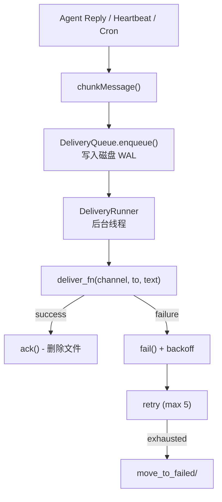

# S08 Delivery -- "Write to disk first, then try to send"

## 1. 核心概念

前 7 节中 agent 的回复直接打印到终端. 本节引入可靠的投递队列, 解决真实场景中的消息投递问题:

- **预写日志 (WAL)**: 消息先写入磁盘再尝试发送. 如果发送失败, 指数退避重试. 如果进程崩溃, 重启时扫描磁盘恢复未完成的消息.
- **渠道感知分片**: 不同平台消息长度限制不同 (Telegram 4096, Discord 2000). `chunkMessage()` 先按段落拆分, 再对超长段落硬切.
- **原子文件写入**: 先写临时文件 -> fsync -> 原子 rename, 保证崩溃时数据一致性.

关键抽象:

| 组件 | 职责 |
|------|------|
| `QueuedDelivery` | 队列条目数据结构 (id, channel, to, text, retryCount, nextRetryAt) |
| `DeliveryQueue` | 磁盘持久化的可靠队列 (enqueue/ack/fail/moveToFailed) |
| `DeliveryRunner` | 后台投递线程, 启动时恢复 + 每秒轮询 |
| `writeAtomically()` | 原子写入: tmp + fsync + rename |
| `chunkMessage()` | 渠道感知的消息分片 |

## 2. 架构图



**退避时间表:** `[5s, 25s, 2min, 10min]` (带 +-20% 随机抖动)

## 3. 关键代码片段

### 原子文件写入: tmp + fsync + rename

```java
// Java: 原子写入, 保证崩溃安全
static void writeAtomically(Path target, String content) throws IOException {
    Path tmp = target.resolveSibling(
        ".tmp." + ProcessHandle.current().pid() + "." + target.getFileName());
    Files.writeString(tmp, content, CREATE, TRUNCATE_EXISTING);
    // 强制刷盘: 确保数据落盘后再 rename
    try (var fos = Files.newOutputStream(tmp, SYNC)) { fos.flush(); }
    Files.move(tmp, target, ATOMIC_MOVE, REPLACE_EXISTING);
}
```

```python
# Python 等价: 使用 os.replace (原子 rename)
import os, tempfile
with tempfile.NamedTemporaryFile(dir=parent, delete=False, mode='w') as f:
    f.write(content)
    f.flush()
    os.fsync(f.fileno())
os.replace(f.name, target)  # 原子替换
```

### 指数退避 + +-20% 抖动

```java
// Java: 退避时间表 + 随机抖动, 防止惊群效应
static final int[] BACKOFF_MS = {5_000, 25_000, 120_000, 600_000};
static final int MAX_RETRIES = 5;

static long computeBackoffMs(int retryCount) {
    int idx = Math.min(retryCount - 1, BACKOFF_MS.length - 1);
    long base = BACKOFF_MS[idx];
    long jitter = (long)((Math.random() - 0.5) * 2 * (base * 0.2));
    return Math.max(0, base + jitter);
}
```

```python
# Python 等价
import random, math
BACKOFF_MS = [5000, 25000, 120000, 600000]
def compute_backoff(retry_count):
    base = BACKOFF_MS[min(retry_count - 1, len(BACKOFF_MS) - 1)]
    jitter = int((random.random() - 0.5) * 2 * base * 0.2)
    return max(0, base + jitter)
```

### 渠道感知消息分片

```java
// Java: 先按段落拆分, 再对超长段落硬切
static final Map<String, Integer> CHANNEL_LIMITS = Map.of(
    "telegram", 4096, "discord", 2000, "whatsapp", 4096, "default", 4096);

static List<String> chunkMessage(String text, String channel) {
    int limit = CHANNEL_LIMITS.getOrDefault(channel, 4096);
    if (text.length() <= limit) return List.of(text);
    List<String> chunks = new ArrayList<>();
    for (String para : text.split("\n\n")) {
        // 尝试追加到当前块
        if (!chunks.isEmpty() && last.length() + para.length() + 2 <= limit) {
            chunks.set(lastIdx, last + "\n\n" + para);
        } else {
            // 超长段落硬切
            while (para.length() > limit) {
                chunks.add(para.substring(0, limit));
                para = para.substring(limit);
            }
            if (!para.isEmpty()) chunks.add(para);
        }
    }
    return chunks;
}
```

### QueuedDelivery 的 JSON 序列化

```java
// Java: record + toMap/fromMap 模式实现 JSON 序列化
record QueuedDelivery(String id, String channel, String to, String text,
                      int retryCount, String lastError,
                      double enqueuedAt, double nextRetryAt) {
    Map<String, Object> toMap() { /* ... */ }
    static QueuedDelivery fromMap(Map<String, Object> data) { /* ... */ }
}
```

## 4. 运行方式

```bash
mvn compile exec:java -Dexec.mainClass="com.claw0.sessions.S08Delivery"
```

前置条件:
- `.env` 文件中配置 `ANTHROPIC_API_KEY`
- `workspace/delivery-queue/` 目录自动创建, 存放队列状态文件
- `workspace/delivery-queue/failed/` 存放投递失败的消息

## 5. REPL 命令

| 命令 | 说明 |
|------|------|
| `/queue` | 显示待处理的消息 (ID, 重试次数, 等待时间) |
| `/failed` | 显示投递失败的消息 (ID, 错误信息) |
| `/retry` | 将所有失败消息移回队列重新投递 |
| `/simulate-failure` | 切换模拟失败模式 (0% <-> 50% 失败率) |
| `/heartbeat` | 显示心跳状态 |
| `/trigger` | 手动触发一次心跳 |
| `/stats` | 显示投递统计 (pending/failed/attempted/succeeded/errors) |

## 6. 学习要点

1. **WAL 保证崩溃不丢消息**: 消息在调用 `enqueue()` 时就写入磁盘 JSON 文件. 即使投递过程中进程崩溃, 重启后 `recoveryScan()` 会扫描队列目录恢复所有未完成的消息.

2. **原子文件写入: tmp + fsync + rename**: 先写临时文件, 调用 fsync 强制落盘, 再用 `Files.move(ATOMIC_MOVE)` 原子替换. 如果 fsync 和 rename 之间崩溃, 临时文件会被 cleanup 清理.

3. **指数退避 + 抖动防止惊群**: 退避时间表 `[5s, 25s, 2min, 10min]` 外加 +-20% 随机抖动. 抖动确保多个失败消息不会在同一时刻集体重试, 避免对下游服务造成突发压力.

4. **平台感知的分片策略**: Telegram 限制 4096 字符, Discord 限制 2000. `chunkMessage()` 两级拆分: 先按 `\n\n` 段落边界拆分 (保持语义完整), 再对超长段落硬切.

5. **失败消息可手动重试**: 超过最大重试次数 (5 次) 的消息移入 `failed/` 目录. 通过 `/retry` 命令可重置重试计数并移回队列.
