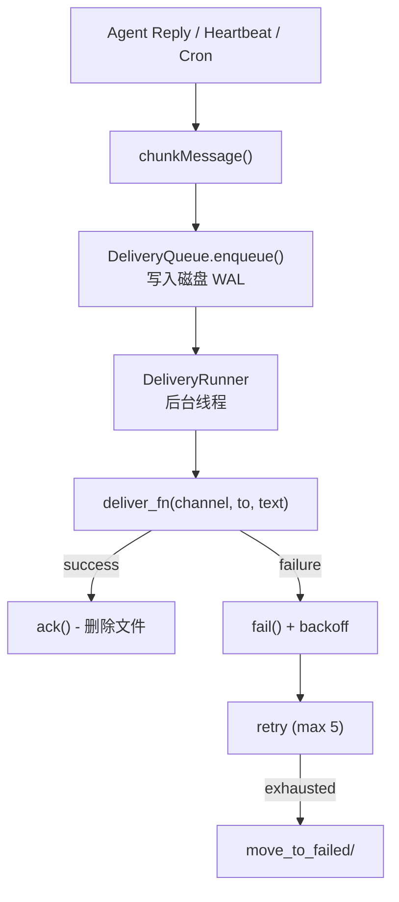

# S08 Delivery -- "Write to disk first, then try to send"

## 1. 核心概念

前 7 节中 agent 的回复直接打印到终端. 本节引入可靠的投递队列, 解决真实场景中的消息投递问题:

- **预写日志 (WAL)**: 消息先写入磁盘再尝试发送. 如果发送失败, 指数退避重试. 如果进程崩溃, 重启时扫描磁盘恢复未完成的消息.
- **渠道感知分片**: 不同平台消息长度限制不同 (Telegram 4096, Discord 2000). `chunkMessage()` 先按段落拆分, 再对超长段落硬切.
- **原子文件写入**: 先写临时文件 -> fsync -> 原子 rename, 保证崩溃时数据一致性.

关键抽象:

| 组件 | 职责 |
|------|------|
| `QueuedDelivery` | 队列条目数据结构 (id, channel, to, text, retryCount, nextRetryAt) |
| `DeliveryQueue` | 磁盘持久化的可靠队列 (enqueue/ack/fail/moveToFailed) |
| `DeliveryRunner` | 后台投递线程, 启动时恢复 + 每秒轮询 |
| `writeAtomically()` | 原子写入: tmp + fsync + rename |
| `chunkMessage()` | 渠道感知的消息分片 |

## 2. 架构图



**退避时间表:** `[5s, 25s, 2min, 10min]` (带 +-20% 随机抖动)

## 3. 关键代码片段

### 原子文件写入: tmp + fsync + rename

```java
// Java: 原子写入, 保证崩溃安全
static void writeAtomically(Path target, String content) throws IOException {
    Path tmp = target.resolveSibling(
        ".tmp." + ProcessHandle.current().pid() + "." + target.getFileName());
    Files.writeString(tmp, content, CREATE, TRUNCATE_EXISTING);
    // 强制刷盘: 确保数据落盘后再 rename
    try (var fos = Files.newOutputStream(tmp, SYNC)) { fos.flush(); }
    Files.move(tmp, target, ATOMIC_MOVE, REPLACE_EXISTING);
}
```

```python
# Python 等价: 使用 os.replace (原子 rename)
import os, tempfile
with tempfile.NamedTemporaryFile(dir=parent, delete=False, mode='w') as f:
    f.write(content)
    f.flush()
    os.fsync(f.fileno())
os.replace(f.name, target)  # 原子替换
```

### 指数退避 + +-20% 抖动

```java
// Java: 退避时间表 + 随机抖动, 防止惊群效应
static final int[] BACKOFF_MS = {5_000, 25_000, 120_000, 600_000};
static final int MAX_RETRIES = 5;

static long computeBackoffMs(int retryCount) {
    int idx = Math.min(retryCount - 1, BACKOFF_MS.length - 1);
    long base = BACKOFF_MS[idx];
    long jitter = (long)((Math.random() - 0.5) * 2 * (base * 0.2));
    return Math.max(0, base + jitter);
}
```

```python
# Python 等价
import random, math
BACKOFF_MS = [5000, 25000, 120000, 600000]
def compute_backoff(retry_count):
    base = BACKOFF_MS[min(retry_count - 1, len(BACKOFF_MS) - 1)]
    jitter = int((random.random() - 0.5) * 2 * base * 0.2)
    return max(0, base + jitter)
```

### 渠道感知消息分片

```java
// Java: 先按段落拆分, 再对超长段落硬切
static final Map<String, Integer> CHANNEL_LIMITS = Map.of(
    "telegram", 4096, "discord", 2000, "whatsapp", 4096, "default", 4096);

static List<String> chunkMessage(String text, String channel) {
    int limit = CHANNEL_LIMITS.getOrDefault(channel, 4096);
    if (text.length() <= limit) return List.of(text);
    List<String> chunks = new ArrayList<>();
    for (String para : text.split("\n\n")) {
        // 尝试追加到当前块
        if (!chunks.isEmpty() && last.length() + para.length() + 2 <= limit) {
            chunks.set(lastIdx, last + "\n\n" + para);
        } else {
            // 超长段落硬切
            while (para.length() > limit) {
                chunks.add(para.substring(0, limit));
                para = para.substring(limit);
            }
            if (!para.isEmpty()) chunks.add(para);
        }
    }
    return chunks;
}
```

### QueuedDelivery 的 JSON 序列化

```java
// Java: record + toMap/fromMap 模式实现 JSON 序列化
record QueuedDelivery(String id, String channel, String to, String text,
                      int retryCount, String lastError,
                      double enqueuedAt, double nextRetryAt) {
    Map<String, Object> toMap() { /* ... */ }
    static QueuedDelivery fromMap(Map<String, Object> data) { /* ... */ }
}
```

## 4. 运行方式

```bash
mvn compile exec:java -Dexec.mainClass="com.claw0.sessions.S08Delivery"
```

前置条件:
- `.env` 文件中配置 `ANTHROPIC_API_KEY`
- `workspace/delivery-queue/` 目录自动创建, 存放队列状态文件
- `workspace/delivery-queue/failed/` 存放投递失败的消息

## 5. REPL 命令

| 命令 | 说明 |
|------|------|
| `/queue` | 显示待处理的消息 (ID, 重试次数, 等待时间) |
| `/failed` | 显示投递失败的消息 (ID, 错误信息) |
| `/retry` | 将所有失败消息移回队列重新投递 |
| `/simulate-failure` | 切换模拟失败模式 (0% <-> 50% 失败率) |
| `/heartbeat` | 显示心跳状态 |
| `/trigger` | 手动触发一次心跳 |
| `/stats` | 显示投递统计 (pending/failed/attempted/succeeded/errors) |

## 6. 使用案例

### 案例 1: 启动 — 恢复扫描 + 正常投递

启动时 DeliveryRunner 先扫描磁盘恢复上次未完成的消息, 然后进入 REPL:

```
  [delivery] Recovery: queue is clean
============================================================
  claw0  |  Section 08: Delivery
  Model: claude-sonnet-4-20250514
  Queue: /home/user/project/workspace/delivery-queue
  Commands:
    /queue             - show pending deliveries
    /failed            - show failed deliveries
    /retry             - retry all failed
    /simulate-failure  - toggle 50% failure rate
    /heartbeat         - heartbeat status
    /trigger           - manually trigger heartbeat
    /stats             - delivery statistics
  Type 'quit' or 'exit' to leave.
============================================================

You > 你好

  [delivery] [console] -> user: 你好！有什么可以帮你的吗？...
Assistant: 你好！有什么可以帮你的吗？
```

> `Recovery: queue is clean` 表示队列目录为空, 没有需要恢复的消息。
> Agent 的回复同时打印到终端 (给用户看) 和入队到 DeliveryQueue (模拟真实投递)。
> `[delivery]` 标记显示投递成功。

### 案例 2: 查看投递队列 — /queue

```
You > /queue

  Queue is empty.
```

投递成功后队列为空 (文件已删除)。模拟失败模式下可以看到待处理条目:

```
You > /simulate-failure
  console fail rate -> 50% (unreliable)

You > 帮我写一首短诗

Assistant: 春风拂柳绿，细雨润花红。鸟鸣深树里，人在画图中。
  [warn] Delivery a3b7c2d1... failed (retry 1/5), next retry in 5s: [console] Simulated delivery failure to user
  [delivery] [console] -> user: 春风拂柳绿，细雨润花红。鸟鸣深树里，人在画图中。...

You > /queue

  Pending deliveries (1):
    a3b7c2d1... retry=1, wait 3s "春风拂柳绿，细雨润花红。鸟鸣深树里..."
```

> 失败率 50% 时, 约一半的投递会失败。失败后 `retry=1` 表示已重试 1 次,
> `wait 3s` 表示距下次重试还需等待 3 秒。退避时间表: 5s → 25s → 2min → 10min。

### 案例 3: 退避重试 — 指数退避可视化

持续模拟失败, 观察退避时间递增:

```
You > /simulate-failure
  console fail rate -> 50% (unreliable)

You > 发一条消息

  [warn] Delivery f1a2b3c4... failed (retry 1/5), next retry in 5s: ...
  [warn] Delivery f1a2b3c4... failed (retry 2/5), next retry in 25s: ...
  [warn] Delivery f1a2b3c4... failed (retry 3/5), next retry in 120s: ...
  [warn] Delivery f1a2b3c4... failed (retry 4/5), next retry in 600s: ...
  [warn] Delivery f1a2b3c4... -> failed/ (retry 5/5): ...
```

> 退避时间指数增长: 5s → 25s → 120s (2min) → 600s (10min)。
> 每次退避带 ±20% 随机抖动, 防止多个失败消息同时重试 (惊群效应)。
> 重试 5 次后消息移入 `failed/` 目录, 不再自动重试。

### 案例 4: 查看失败消息 — /failed

```
You > /failed

  Failed deliveries (1):
    f1a2b3c4... retries=5 error="[console] Simulated delivery fai" "春风拂柳绿，细雨润花红..."
```

> 失败条目显示: ID 前缀、重试次数、错误信息预览、消息内容预览。
> 文件存储在 `workspace/delivery-queue/failed/` 目录下。

### 案例 5: 重试失败消息 — /retry

将所有失败消息移回队列, 重置重试计数:

```
You > /simulate-failure
  console fail rate -> 0% (reliable)

You > /retry
  Moved 1 entries back to queue.

  [delivery] [console] -> user: 春风拂柳绿，细雨润花红...

You > /failed

  No failed deliveries.
```

> `/retry` 将 `failed/` 目录下的条目移回队列, 重置 `retry_count=0`, `next_retry_at=0`。
> 由于已将失败率恢复为 0%, 重试立即成功投递, 队列文件被删除。

### 案例 6: 崩溃恢复 — 进程重启后恢复未完成消息

模拟进程崩溃时队列中仍有待处理消息:

```
You > /simulate-failure
  console fail rate -> 50% (unreliable)

You > 测试消息

  [warn] Delivery 7e8f9a0b... failed (retry 1/5), next retry in 5s: ...

You > quit
Delivery runner stopped. Queue state preserved on disk.
```

队列文件保留在磁盘上 (`workspace/delivery-queue/7e8f9a0b1234.json`):

```json
{
  "id": "7e8f9a0b1234",
  "channel": "console",
  "to": "user",
  "text": "测试回复内容...",
  "retry_count": 1,
  "last_error": "[console] Simulated delivery failure to user",
  "enqueued_at": 1745673600.0,
  "next_retry_at": 1745673605.0
}
```

重新启动程序:

```
  [delivery] Recovery: 1 pending
```

> 退出时 `Queue state preserved on disk` 表示队列文件未删除, 持久化在磁盘。
> 重启后 `Recovery: 1 pending` 自动恢复崩溃前的消息并继续投递。

### 案例 7: 心跳 — 自动定时消息

心跳运行器每 120 秒生成一条系统消息并入队投递:

```
  [heartbeat] triggered #1
  [delivery] [console] -> user: [Heartbeat #1] System check at 2026-04-26 14:32:07 -- all OK...

  [heartbeat] triggered #2
  [delivery] [console] -> user: [Heartbeat #2] System check at 2026-04-26 14:34:07 -- all OK...
```

查看心跳状态:

```
You > /heartbeat

  Heartbeat: enabled=true, interval=120.0s, runs=2, last=2026-04-26T14:34:07Z
```

手动触发心跳:

```
You > /trigger

  [heartbeat] triggered #3
  [delivery] [console] -> user: [Heartbeat #3] System check at 2026-04-26 14:35:15 -- all OK...
```

> 心跳消息通过 DeliveryQueue 入队, 与 agent 回复走相同的投递管线。
> 如果投递失败, 心跳消息也会享受退避重试保护。

### 案例 8: 消息分片 — Discord 2000 字符限制

渠道为 discord 时, 超过 2000 字符的消息自动分片:

```
You > /simulate-failure
  console fail rate -> 0% (reliable)

You > 详细解释 Java 的垃圾回收机制

Assistant: [超过 2000 字符的长回复...]
  [delivery] [console] -> user: Java 垃圾回收（GC）是自动内存管理...
  [delivery] [console] -> user: G1 收集器将堆划分为多个 Region...
  [delivery] [console] -> user: ZGC 是新一代低延迟收集器...
```

> 分片策略: 先按 `\n\n` 段落边界拆分 (保持语义完整), 单个段落超限时硬切。
> 不同平台限制: Telegram 4096, Discord 2000, WhatsApp 4096。

### 案例 9: 投递统计 — /stats

```
You > /stats

  Delivery stats: pending=0, failed=0, attempted=12, succeeded=10, errors=2
```

> 统计字段: pending (队列中待处理)、failed (失败目录中)、attempted (总尝试次数)、
> succeeded (成功投递)、errors (投递失败次数)。成功 + errors 应等于 attempted。

### 案例 10: 记忆工具 — 对话中的工具调用

```
You > 记住: 项目部署时间是每周五下午

  [tool: memory_write]
Assistant: 已记住, 项目部署时间是每周五下午。

You > 我之前让你记住什么了？

  [tool: memory_search]
Assistant: 你告诉我: 项目部署时间是每周五下午。
```

> agent 可以使用 memory_write 和 memory_search 工具。回复同时打印到终端并投递到队列。

### 案例 11: 完整流程 — 失败 → 退避 → 重试成功 → 队列清空

```
You > /simulate-failure
  console fail rate -> 50% (unreliable)

You > hello

  [warn] Delivery c4d5e6f7... failed (retry 1/5), next retry in 5s: [console] Simulated...

You > /queue

  Pending deliveries (1):
    c4d5e6f7... retry=1, wait 3s "hello..."

  [delivery] [console] -> user: Hello! How can I help?...

You > /queue

  Queue is empty.

You > /simulate-failure
  console fail rate -> 0% (reliable)

You > /stats

  Delivery stats: pending=0, failed=0, attempted=3, succeeded=2, errors=1
```

> 完整流程: 消息入队 → 首次投递失败 → 退避等待 → 自动重试成功 → 文件删除。
> 切换回 0% 失败率后, 后续消息不再出现投递失败。

## 8. 学习要点

1. **WAL 保证崩溃不丢消息**: 消息在调用 `enqueue()` 时就写入磁盘 JSON 文件. 即使投递过程中进程崩溃, 重启后 `recoveryScan()` 会扫描队列目录恢复所有未完成的消息.

2. **原子文件写入: tmp + fsync + rename**: 先写临时文件, 调用 fsync 强制落盘, 再用 `Files.move(ATOMIC_MOVE)` 原子替换. 如果 fsync 和 rename 之间崩溃, 临时文件会被 cleanup 清理.

3. **指数退避 + 抖动防止惊群**: 退避时间表 `[5s, 25s, 2min, 10min]` 外加 +-20% 随机抖动. 抖动确保多个失败消息不会在同一时刻集体重试, 避免对下游服务造成突发压力.

4. **平台感知的分片策略**: Telegram 限制 4096 字符, Discord 限制 2000. `chunkMessage()` 两级拆分: 先按 `\n\n` 段落边界拆分 (保持语义完整), 再对超长段落硬切.

5. **失败消息可手动重试**: 超过最大重试次数 (5 次) 的消息移入 `failed/` 目录. 通过 `/retry` 命令可重置重试计数并移回队列.
