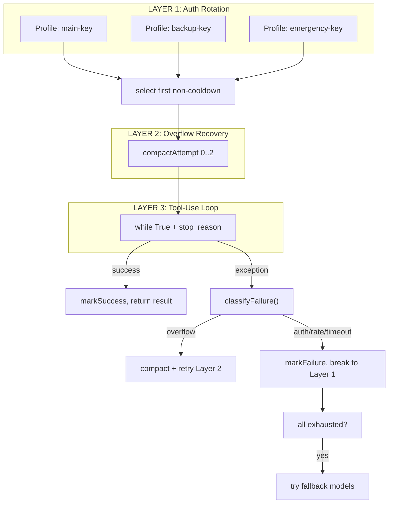

# S09 Resilience -- "When one call fails, rotate and retry."

## 1. 核心概念

LLM API 调用可能因多种原因失败: 速率限制 (429)、认证过期 (401)、上下文溢出、超时等. 本节实现三层重试洋葱, 每层处理不同类别的失败:

- **Layer 1 (认证轮换)**: 在多个 API key 配置之间轮转. 某个 key 速率受限时自动切换到下一个, 避免单点故障.
- **Layer 2 (溢出恢复)**: 上下文 token 超限时, 用 LLM 将前 50% 消息压缩为摘要, 保留最近 20% 不变, 然后重试.
- **Layer 3 (工具调用循环)**: 标准的 `while(true)` + `stop_reason` 分发, 处理连续的工具调用.

如果所有配置耗尽, 还会尝试 fallback 模型作为最后手段.

关键抽象:

| 组件 | 职责 |
|------|------|
| `FailoverReason` | 枚举: RATE_LIMIT/AUTH/TIMEOUT/BILLING/OVERFLOW/UNKNOWN, 各带冷却时间 |
| `AuthProfile` | API key 配置 + volatile 冷却追踪 |
| `ProfileManager` | 选择第一个非冷却配置, 标记成功/失败 |
| `ContextGuard` | token 估算 + LLM 摘要压缩 |
| `ResilienceRunner` | 三层嵌套: auth rotation -> overflow recovery -> tool loop |
| `SimulatedFailure` | 测试辅助: 下次 API 调用时注入模拟错误 |

## 2. 架构图



**FailoverReason 冷却时间表:**

| 原因 | 冷却时间 |
|------|----------|
| RATE_LIMIT (429) | 120s |
| AUTH (401/403) | 300s |
| TIMEOUT | 60s |
| BILLING (402) | 300s |
| OVERFLOW | 0s (原地压缩重试) |

## 3. 关键代码片段

### classifyFailure() 检查异常消息字符串

```java
// Java: 根据异常消息分类失败原因
static FailoverReason classifyFailure(Exception exc) {
    String msg = exc.getMessage().toLowerCase();
    if (msg.contains("rate") || msg.contains("429"))
        return FailoverReason.RATE_LIMIT;
    if (msg.contains("auth") || msg.contains("401") || msg.contains("key"))
        return FailoverReason.AUTH;
    if (msg.contains("timeout") || msg.contains("timed out"))
        return FailoverReason.TIMEOUT;
    if (msg.contains("billing") || msg.contains("quota") || msg.contains("402"))
        return FailoverReason.BILLING;
    if (msg.contains("context") || msg.contains("token") || msg.contains("overflow"))
        return FailoverReason.OVERFLOW;
    return FailoverReason.UNKNOWN;
}
```

### ProfileManager 选择非冷却配置

```java
// Java: 按顺序选择第一个冷却已过期的配置
AuthProfile selectProfile() {
    double now = epochSeconds();
    for (AuthProfile p : profiles) {
        if (now >= p.cooldownUntil) return p;
    }
    return null;  // 全部在冷却中
}
```

### ContextGuard 压缩历史 (LLM 摘要)

```java
// Java: 将前 50% 消息压缩为 LLM 生成的摘要
List<MessageParam> compactHistory(List<MessageParam> messages,
                                   AnthropicClient apiClient, String model) {
    int keepCount = Math.max(4, (int)(total * 0.2));   // 保留最近 20%
    int compressCount = Math.max(2, (int)(total * 0.5)); // 压缩前 50%
    // ... 将旧消息展平为纯文本 ...
    String summaryPrompt = "Summarize the following conversation concisely...";
    Message summaryResp = apiClient.messages().create(/* ... */);
    // 替换为: [摘要] + "Understood" + 最近消息
}
```

### 三层重试洋葱核心循环

```java
// Java: 三层嵌套
RunResult run(String system, List<MessageParam> messages, List<ToolUnion> tools) {
    // LAYER 1: Auth Rotation
    for (int rotation = 0; rotation < profiles.size(); rotation++) {
        AuthProfile profile = selectProfile();
        AnthropicClient apiClient = createClient(profile.apiKey);

        // LAYER 2: Overflow Recovery
        for (int compact = 0; compact < MAX_OVERFLOW_COMPACTION; compact++) {
            try {
                // LAYER 3: Tool-Use Loop
                return runAttempt(apiClient, modelId, system, msgs, tools);
            } catch (Exception exc) {
                FailoverReason reason = classifyFailure(exc);
                if (reason == OVERFLOW) {
                    msgs = guard.compactHistory(msgs, apiClient, modelId);
                    continue;  // 重试 Layer 2
                }
                markFailure(profile, reason, reason.cooldownSeconds);
                break;  // 跳到下一个 profile (Layer 1)
            }
        }
    }
    // Fallback models...
}
```

### SimulatedFailure 测试辅助

```java
// Java: 下次 API 调用时注入模拟错误, 方便观察重试行为
static class SimulatedFailure {
    static final Map<String, String> TEMPLATES = Map.of(
        "rate_limit", "Error code: 429 -- rate limit exceeded",
        "auth",       "Error code: 401 -- authentication failed",
        "overflow",   "Error: context window token overflow"
    );
    void checkAndFire() {
        if (pending != null) {
            String reason = pending;
            pending = null;
            throw new RuntimeException(TEMPLATES.get(reason));
        }
    }
}
```

## 4. 运行方式

```bash
mvn compile exec:java -Dexec.mainClass="com.claw0.sessions.S09Resilience"
```

前置条件:
- `.env` 文件中配置 `ANTHROPIC_API_KEY`
- 默认创建 3 个演示 profile (使用相同 key; 生产环境应使用不同 key)

## 5. REPL 命令

| 命令 | 说明 |
|------|------|
| `/profiles` | 显示所有 profile 状态 (available / cooldown + 剩余秒数) |
| `/cooldowns` | 显示当前活跃的冷却 |
| `/simulate-failure <reason>` | 为下次 API 调用装备模拟失败 |
| `/fallback` | 显示 fallback 模型链 |
| `/stats` | 显示重试统计 (attempts/successes/failures/compactions/rotations) |
| `/help` | 显示帮助信息 |
| `quit` / `exit` | 退出 |

模拟失败原因: `rate_limit`, `auth`, `timeout`, `billing`, `overflow`, `unknown`

## 6. 学习要点

1. **三层洋葱: auth rotation 包裹 overflow recovery 包裹 tool loop**: 最外层轮换 API key, 中间层处理上下文溢出, 最内层是标准的工具调用循环. 每层只处理自己关心的失败类型, 其他向外传播.

2. **每个 FailoverReason 对应不同冷却时间**: 速率限制冷却 120s, 认证失败冷却 300s, 超时冷却 60s, 溢出不冷却 (原地压缩重试). 分类驱动策略, 避免对不可恢复的错误 (如 key 失效) 做无意义重试.

3. **基于 generation 的任务取消防止过期任务**: 虽然 S09 本身未使用 generation (这是 S10 的概念), 但 `maxIterations` 限制工具循环的最大迭代次数, 防止无限循环.

4. **Fallback 模型作为最后手段**: 所有 profile 耗尽后, 尝试备选模型 (如 claude-haiku). 这层甚至会在 rate_limit/timeout 类型的 profile 上重置冷却, 给予最后一次机会.

5. **SimulatedFailure 使测试无需真实故障**: `/simulate-failure auth` 会在下次 API 调用时注入 401 错误, 让你直接观察三层洋葱如何处理认证失败、配置轮换和冷却标记.
