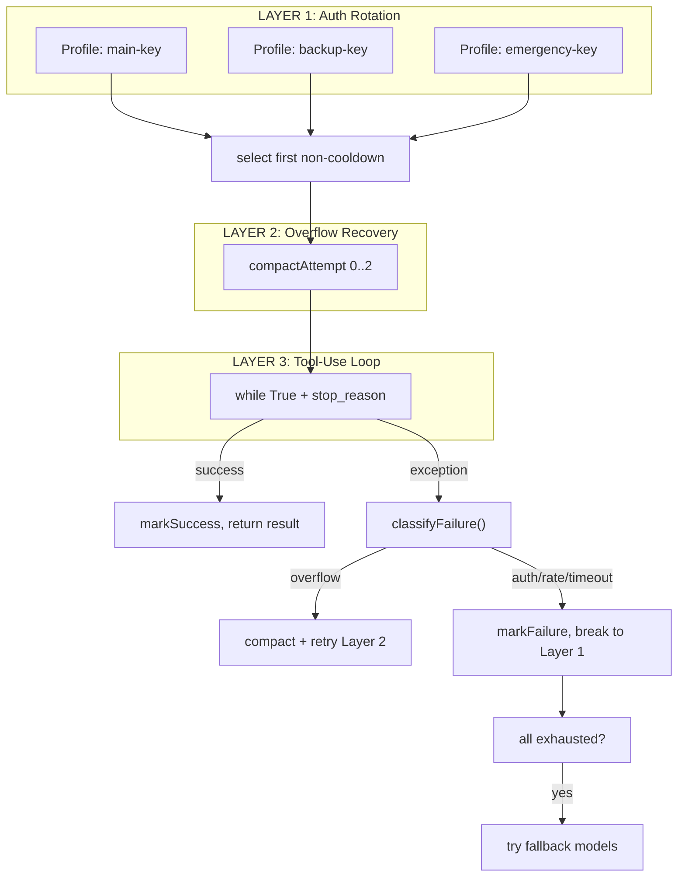

# S09 Resilience -- "When one call fails, rotate and retry."

## 1. 核心概念

LLM API 调用可能因多种原因失败: 速率限制 (429)、认证过期 (401)、上下文溢出、超时等. 本节实现三层重试洋葱, 每层处理不同类别的失败:

- **Layer 1 (认证轮换)**: 在多个 API key 配置之间轮转. 某个 key 速率受限时自动切换到下一个, 避免单点故障.
- **Layer 2 (溢出恢复)**: 上下文 token 超限时, 用 LLM 将前 50% 消息压缩为摘要, 保留最近 20% 不变, 然后重试.
- **Layer 3 (工具调用循环)**: 标准的 `while(true)` + `stop_reason` 分发, 处理连续的工具调用.

如果所有配置耗尽, 还会尝试 fallback 模型作为最后手段.

关键抽象:

| 组件 | 职责 |
|------|------|
| `FailoverReason` | 枚举: RATE_LIMIT/AUTH/TIMEOUT/BILLING/OVERFLOW/UNKNOWN, 各带冷却时间 |
| `AuthProfile` | API key 配置 + volatile 冷却追踪 |
| `ProfileManager` | 选择第一个非冷却配置, 标记成功/失败 |
| `ContextGuard` | token 估算 + LLM 摘要压缩 |
| `ResilienceRunner` | 三层嵌套: auth rotation -> overflow recovery -> tool loop |
| `SimulatedFailure` | 测试辅助: 下次 API 调用时注入模拟错误 |

## 2. 架构图



**FailoverReason 冷却时间表:**

| 原因 | 冷却时间 |
|------|----------|
| RATE_LIMIT (429) | 120s |
| AUTH (401/403) | 300s |
| TIMEOUT | 60s |
| BILLING (402) | 300s |
| OVERFLOW | 0s (原地压缩重试) |

## 3. 关键代码片段

### classifyFailure() 检查异常消息字符串

```java
// Java: 根据异常消息分类失败原因
static FailoverReason classifyFailure(Exception exc) {
    String msg = exc.getMessage().toLowerCase();
    if (msg.contains("rate") || msg.contains("429"))
        return FailoverReason.RATE_LIMIT;
    if (msg.contains("auth") || msg.contains("401") || msg.contains("key"))
        return FailoverReason.AUTH;
    if (msg.contains("timeout") || msg.contains("timed out"))
        return FailoverReason.TIMEOUT;
    if (msg.contains("billing") || msg.contains("quota") || msg.contains("402"))
        return FailoverReason.BILLING;
    if (msg.contains("context") || msg.contains("token") || msg.contains("overflow"))
        return FailoverReason.OVERFLOW;
    return FailoverReason.UNKNOWN;
}
```

### ProfileManager 选择非冷却配置

```java
// Java: 按顺序选择第一个冷却已过期的配置
AuthProfile selectProfile() {
    double now = epochSeconds();
    for (AuthProfile p : profiles) {
        if (now >= p.cooldownUntil) return p;
    }
    return null;  // 全部在冷却中
}
```

### ContextGuard 两阶段溢出恢复

```java
// Java: Stage 1 截断 tool_result, Stage 2 压缩历史
// Stage 1: 截断过大的 tool_result 块 (保留 maxTokens*4*0.3 字符)
List<MessageParam> truncateToolResults(List<MessageParam> messages) {
    int maxChars = (int) (maxTokens * 4 * 0.3);
    // ... 遍历 content blocks, 截断超长 tool_result ...
}

// Stage 2: 将前 50% 消息压缩为 LLM 生成的摘要
List<MessageParam> compactHistory(List<MessageParam> messages,
                                   AnthropicClient apiClient, String model) {
    int keepCount = Math.max(4, (int)(total * 0.2));   // 保留最近 20%
    int compressCount = Math.max(2, (int)(total * 0.5)); // 压缩前 50%
    // ... 将旧消息展平为纯文本 ...
    String summaryPrompt = "Summarize the following conversation concisely...";
    Message summaryResp = apiClient.messages().create(/* ... */);
    // 替换为: [摘要] + "Understood" + 最近消息
}
```

### 三层重试洋葱核心循环

```java
// Java: 三层嵌套
RunResult run(String system, List<MessageParam> messages, List<ToolUnion> tools) {
    // LAYER 1: Auth Rotation
    for (int rotation = 0; rotation < profiles.size(); rotation++) {
        AuthProfile profile = selectProfile();
        AnthropicClient apiClient = createClient(profile.apiKey);

        // LAYER 2: Overflow Recovery
        for (int compact = 0; compact < MAX_OVERFLOW_COMPACTION; compact++) {
            try {
                // LAYER 3: Tool-Use Loop
                return runAttempt(apiClient, modelId, system, msgs, tools);
            } catch (Exception exc) {
                FailoverReason reason = classifyFailure(exc);
                if (reason == OVERFLOW) {
                    // 两阶段恢复: 先截断, 再压缩
                    msgs = guard.truncateToolResults(msgs);      // Stage 1
                    msgs = guard.compactHistory(msgs, apiClient, modelId); // Stage 2
                    continue;  // 重试 Layer 2
                }
                markFailure(profile, reason, reason.cooldownSeconds);
                break;  // 跳到下一个 profile (Layer 1)
            }
        }
    }
    // Fallback models...
}
```

### SimulatedFailure 测试辅助

```java
// Java: 下次 API 调用时注入模拟错误, 方便观察重试行为
static class SimulatedFailure {
    static final Map<String, String> TEMPLATES = Map.of(
        "rate_limit", "Error code: 429 -- rate limit exceeded",
        "auth",       "Error code: 401 -- authentication failed",
        "overflow",   "Error: context window token overflow"
    );
    void checkAndFire() {
        if (pending != null) {
            String reason = pending;
            pending = null;
            throw new RuntimeException(TEMPLATES.get(reason));
        }
    }
}
```

## 4. 运行方式

```bash
mvn compile exec:java -Dexec.mainClass="com.claw0.sessions.S09Resilience"
```

前置条件:
- `.env` 文件中配置 `ANTHROPIC_API_KEY`
- 默认创建 3 个演示 profile (使用相同 key; 生产环境应使用不同 key)

## 5. REPL 命令

| 命令 | 说明 |
|------|------|
| `/profiles` | 显示所有 profile 状态 (available / cooldown + 剩余秒数) |
| `/cooldowns` | 显示当前活跃的冷却 |
| `/simulate-failure <reason>` | 为下次 API 调用装备模拟失败 |
| `/fallback` | 显示 fallback 模型链 |
| `/stats` | 显示重试统计 (attempts/successes/failures/compactions/rotations) |
| `/help` | 显示帮助信息 |
| `quit` / `exit` | 退出 |

模拟失败原因: `rate_limit`, `auth`, `timeout`, `billing`, `overflow`, `unknown`

## 6. 使用案例

### 案例 1: 启动 — 多配置 + 正常对话

启动时创建 3 个演示 profile (使用相同 key), Banner 显示配置信息和 fallback 模型链:

```
================================================================
  claw0  |  Section 09: Resilience
  Model: claude-sonnet-4-20250514
  Profiles: main-key, backup-key, emergency-key
  Fallback: claude-haiku-4-20250514
  Tools: get_current_time, read_file, write_file, memory_write, memory_search
  /help for commands. quit to exit.
================================================================

You > 你好，介绍一下你自己

  [resilience] Rotating to profile 'main-key'
Assistant: 你好！我是一个具备三层重试保护的 AI 助手。即使遇到 API 限流或网络问题，
我也能自动切换配置、压缩上下文、尝试备用模型来保证回复。有什么可以帮你的吗？

You > quit
再见.
```

> Banner 显示: 主模型、所有 profile 名称、fallback 模型链和可用工具。
> `[resilience] Rotating to profile 'main-key'` 表示 Layer 1 选中了第一个可用配置。

### 案例 2: 查看 Profile 状态 — /profiles

```
You > /profiles

  Profiles:
    main-key         available            last_good=1745673600.0
    backup-key       available            last_good=0.0
    emergency-key    available            last_good=0.0
```

> `available` 表示配置可用 (绿色), `cooldown` 表示冷却中 (黄色)。
> `last_good` 是上次成功调用的时间戳。0.0 表示尚未使用过。

### 案例 3: 模拟速率限制 — Layer 1 认证轮换

注入 429 错误, 观察自动切换 profile:

```
You > /simulate-failure rate_limit
  [resilience] Armed: rate_limit (will fire on next API call)

You > 帮我写一首短诗

  [resilience] Rotating to profile 'main-key'
  [warn] Failure on profile 'main-key': Error code: 429 -- rate limit exceeded
  [resilience] Profile 'main-key' -> cooldown 120s (reason=rate_limit)
  [resilience] Rotating to profile 'backup-key'
Assistant: 春风拂柳绿，细雨润花红。鸟鸣深树里，人在画图中。
```

> Layer 1 捕获 429 错误, 将 `main-key` 标记为冷却 120s, 自动切换到 `backup-key` 重试。
> 用户无感知 — 请求在备用配置上成功完成。

### 案例 4: 查看冷却状态 — /cooldowns

```
You > /cooldowns

  Active cooldowns:
    main-key: 95s remaining (reason: rate_limit)
```

> `main-key` 因速率限制进入冷却, 显示剩余秒数和失败原因。
> 120s 后冷却到期, 该 profile 自动恢复为可用状态。

### 案例 5: 模拟认证失败 — 冷却标记

注入 401 错误, 观察更长的冷却时间:

```
You > /simulate-failure auth
  [resilience] Armed: auth (will fire on next API call)

You > hello

  [resilience] Rotating to profile 'backup-key'
  [warn] Failure on profile 'backup-key': Error code: 401 -- authentication failed
  [resilience] Profile 'backup-key' -> cooldown 300s (reason=auth)
  [resilience] Rotating to profile 'emergency-key'
Assistant: Hello! How can I help you today?

You > /profiles

  Profiles:
    main-key         cooldown             last_good=1745673600.0  failure=rate_limit
    backup-key       cooldown             last_good=0.0  failure=auth
    emergency-key    available            last_good=1745673665.0
```

> AUTH 失败冷却 300s (5 分钟), 比 RATE_LIMIT 的 120s 更长。
> 两个 profile 都在冷却中, 只剩 `emergency-key` 可用。

### 案例 6: 所有 Profile 耗尽 — Fallback 模型

连续注入失败, 观察三层洋葱的完整降级:

```
You > /simulate-failure rate_limit
  [resilience] Armed: rate_limit

You > /simulate-failure rate_limit
  [resilience] Already armed, skipping (one at a time)

You > 再试一次
  [resilience] Armed: rate_limit (will fire on next API call)

You > hello

  [resilience] Rotating to profile 'emergency-key'
  [warn] Failure on profile 'emergency-key': Error code: 429 -- rate limit exceeded
  [resilience] Profile 'emergency-key' -> cooldown 120s (reason=rate_limit)
  [resilience] Primary profiles exhausted, trying fallback models...
  [resilience] Fallback: model='claude-haiku-4-20250514', profile='emergency-key'
Assistant: Hello! I'm running on a fallback model. How can I help?
```

> 所有主 profile 耗尽后, 自动切换到 fallback 模型 (`claude-haiku-4-20250514`)。
> Fallback 层会重置冷却中的 profile 给最后一次机会, 但使用更轻量的模型。

### 案例 7: 模拟上下文溢出 — Layer 2 压缩

注入 overflow 错误, 观察两阶段恢复:

```
You > /simulate-failure overflow
  [resilience] Armed: overflow (will fire on next API call)

You > 讲一个很长的故事

  [resilience] Rotating to profile 'main-key'
  [warn] Failure on profile 'main-key': Error: context window token overflow
  [resilience] Context overflow (attempt 1/3), compacting...
  [resilience] Compacted 8 messages -> summary (256 chars)
Assistant: 很久以前，在一个遥远的王国里...
```

> Layer 2 捕获 overflow 错误, 先 Stage 1 截断 tool_result 块, 再 Stage 2 用 LLM 压缩前 50% 消息。
> 压缩后保留最近 20% (至少 4 条) 消息不变, 用摘要替代旧消息, 然后重试。

### 案例 8: 查看重试统计 — /stats

```
You > /stats

  Resilience stats:
    Attempts:    12
    Successes:   10
    Failures:    2
    Compactions: 1
    Rotations:   3
    Max iter:    20
```

> 统计字段: Attempts (总请求次数), Successes (成功), Failures (失败),
> Compactions (上下文压缩次数), Rotations (profile 轮换次数), Max iter (单次最大迭代)。

### 案例 9: 查看 Fallback 模型链 — /fallback

```
You > /fallback

  Fallback model chain:
    1. claude-haiku-4-20250514
  Primary model: claude-sonnet-4-20250514
```

> 主模型是 `claude-sonnet-4-20250514`, fallback 链包含一个备选模型。
> 当所有主 profile 耗尽时, 按顺序尝试 fallback 链中的模型。

### 案例 10: 记忆工具 — 工具调用循环正常工作

```
You > 记住: 项目部署时间是每周五下午

  [tool: memory_write]
Assistant: 已记住, 项目部署时间是每周五下午。

You > 我之前让你记住什么了？

  [tool: memory_search]
Assistant: 你告诉我: 项目部署时间是每周五下午。
```

> 三层重试洋葱包裹了工具调用循环 (Layer 3), 工具使用不受影响。
> 即使遇到临时故障, 重试机制保证工具调用最终能完成。

### 案例 11: 完整降级流程 — 速率限制 → 认证轮换 → Fallback

```
You > /simulate-failure rate_limit
  [resilience] Armed: rate_limit

You > 发一条消息

  [resilience] Rotating to profile 'main-key'
  [warn] Failure on profile 'main-key': Error code: 429 -- rate limit exceeded
  [resilience] Profile 'main-key' -> cooldown 120s (reason=rate_limit)
  [resilience] Rotating to profile 'backup-key'
Assistant: 好的，这是你的消息！

You > /cooldowns

  Active cooldowns:
    main-key: 115s remaining (reason: rate_limit)

You > /stats

  Resilience stats:
    Attempts:    3
    Successes:   2
    Failures:    1
    Compactions: 0
    Rotations:   1
    Max iter:    20
```

> 完整流程: 模拟速率限制 → Layer 1 轮换到 backup-key → 请求成功 → 查看冷却状态和统计。
> Compactions=0 表示没有触发上下文压缩, Rotations=1 表示发生了一次 profile 轮换。

## 8. 学习要点

1. **三层洋葱: auth rotation 包裹 overflow recovery 包裹 tool loop**: 最外层轮换 API key, 中间层处理上下文溢出, 最内层是标准的工具调用循环. 每层只处理自己关心的失败类型, 其他向外传播.

2. **每个 FailoverReason 对应不同冷却时间**: 速率限制冷却 120s, 认证失败冷却 300s, 超时冷却 60s, 溢出不冷却 (原地压缩重试). 分类驱动策略, 避免对不可恢复的错误 (如 key 失效) 做无意义重试.

3. **两阶段溢出恢复: Stage 1 截断 + Stage 2 压缩**: 上下文溢出时先调用 `truncateToolResults()` 截断过大的 `tool_result` 块 (保留 `maxTokens*4*0.3` 字符), 再调用 `compactHistory()` 用 LLM 将前 50% 消息压缩为摘要. 两阶段设计保证先用零成本截断尝试恢复, 截断不够时再用 LLM 调用压缩.

4. **Fallback 模型作为最后手段**: 所有 profile 耗尽后, 尝试备选模型 (如 claude-haiku). 这层甚至会在 rate_limit/timeout 类型的 profile 上重置冷却, 给予最后一次机会.

5. **SimulatedFailure 使测试无需真实故障**: `/simulate-failure auth` 会在下次 API 调用时注入 401 错误, 让你直接观察三层洋葱如何处理认证失败、配置轮换和冷却标记.
