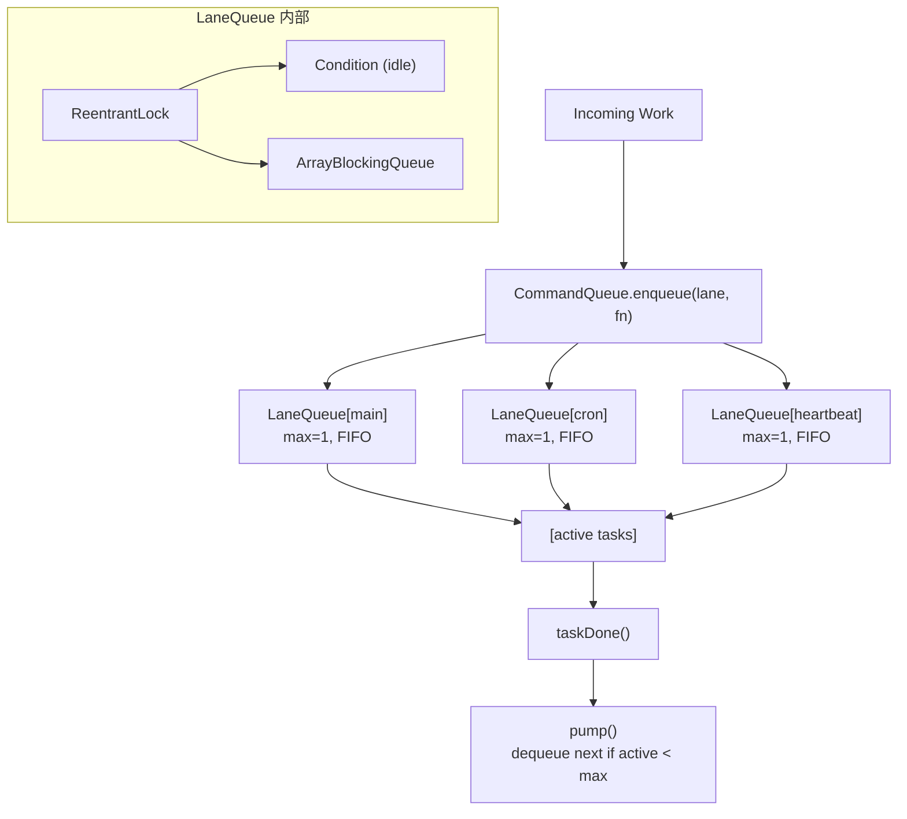

# S10 Concurrency -- "Named lanes serialize the chaos"

## 1. 核心概念

S07 用单个 `ReentrantLock` 保护 agent 执行, 但只有一个 lane 意味着所有后台任务互相阻塞. S10 引入命名 lane 系统:

- **LaneQueue**: 每个 lane 是一个 FIFO 队列 + 可配置的 `maxConcurrency`. 任务以 `Callable<Object>` 入队, 在虚拟线程中执行, 结果通过 `CompletableFuture` 返回.
- **CommandQueue**: 中央调度器, 将 callable 路由到命名的 LaneQueue. 支持惰性创建 lane.
- **Generation-based cancellation**: 每个 lane 维护一个 generation 计数器. 重启时递增 generation, 来自旧 generation 的过期任务完成时不会重新泵送队列.
- **DeadlockDetector**: 使用 `ThreadMXBean.findDeadlockedThreads()` 定期检测死锁.

默认 3 个 lane:

| Lane | maxConcurrency | 用途 |
|------|---------------|------|
| `main` | 1 | 用户对话, 序列化执行 |
| `cron` | 1 | 定时任务 |
| `heartbeat` | 1 | 心跳检查 |

## 2. 架构图



**QueuedItem 三元组:** `(Callable task, CompletableFuture future, int generation)`

## 3. 关键代码片段

### LaneQueue: ReentrantLock + Condition + ArrayBlockingQueue

```java
// Java: 单个命名 lane 的 FIFO 队列 + 并发控制
static class LaneQueue {
    private final ReentrantLock lock = new ReentrantLock();
    private final Condition idle = lock.newCondition();
    private final ArrayBlockingQueue<QueuedItem> deque = new ArrayBlockingQueue<>(1024);
    private int activeCount = 0;
    private int generation = 0;

    CompletableFuture<Object> enqueue(Callable<Object> task) {
        CompletableFuture<Object> future = new CompletableFuture<>();
        lock.lock();
        try {
            deque.offer(new QueuedItem(task, future, generation));
            pump();  // 尝试启动任务
        } finally {
            lock.unlock();
        }
        return future;
    }

    void pump() {
        while (activeCount < maxConcurrency) {
            QueuedItem item = deque.poll();
            if (item == null) break;
            if (item.gen() != generation) {
                item.future().cancel(false);  // 过期任务直接取消
                continue;
            }
            activeCount++;
            Thread.ofVirtual().name("lane-" + name + "-worker").start(() -> runTask(item));
        }
    }
}
```

```python
# Python 等价: threading.Lock + collections.deque
import threading, collections
class LaneQueue:
    def __init__(self, name, max_concurrency=1):
        self.lock = threading.Lock()
        self.deque = collections.deque()
        self.active_count = 0
        self.generation = 0
```

### Generation-based 过期任务过滤

```java
// Java: taskDone 只在 generation 匹配时重新泵送
void taskDone(int expectedGen) {
    lock.lock();
    try {
        activeCount--;
        if (expectedGen == generation) {
            pump();  // generation 匹配, 继续泵送
        }
        idle.signalAll();  // 唤醒等待空闲的线程
    } finally {
        lock.unlock();
    }
}

// reset: 递增 generation, 使旧任务失效
void resetGeneration() {
    lock.lock();
    try {
        generation++;
        idle.signalAll();
    } finally {
        lock.unlock();
    }
}
```

### CompletableFuture + whenComplete 异步回调

```java
// Java: 用户对话入队 main lane, 等待结果
CompletableFuture<Object> future = cmdQueue.enqueue(LANE_MAIN, () -> {
    return executeUserTurn(userInput, messages, systemPrompt, memory);
});

// 注册完成回调
future.whenComplete((result, exc) -> {
    if (exc != null) {
        printLane(laneName, "error: " + exc.getMessage());
    } else {
        printLane(laneName, "result: " + result.toString());
    }
});

// 或阻塞等待
Object result = future.get(120, TimeUnit.SECONDS);
```

### DeadlockDetector 死锁检测

```java
// Java: 使用 ThreadMXBean 每 10 秒检测死锁
static class DeadlockDetector {
    void check() {
        ThreadMXBean tmx = ManagementFactory.getThreadMXBean();
        long[] deadlocked = tmx.findDeadlockedThreads();
        if (deadlocked != null && deadlocked.length > 0) {
            for (ThreadInfo info : tmx.getThreadInfo(deadlocked)) {
                // 报告死锁线程名和状态
            }
            onDeadlock.accept(report);
        }
    }
}
```

### Lane-busy 检查替代 tryLock()

```java
// S07: 用 tryLock() 检查是否忙
boolean acquired = laneLock.tryLock();
if (!acquired) return;

// S10: 用 lane 的 active count 检查
LaneQueue lane = commandQueue.getOrCreateLane(LANE_HEARTBEAT);
Map<String, Object> laneStats = lane.stats();
if ((int) laneStats.get("active") > 0) return;  // lane 忙, 跳过
commandQueue.enqueue(LANE_HEARTBEAT, () -> { /* ... */ });
```

## 4. 运行方式

```bash
mvn compile exec:java -Dexec.mainClass="com.claw0.sessions.S10Concurrency"
```

前置条件:
- `.env` 文件中配置 `ANTHROPIC_API_KEY`
- 可选: `workspace/HEARTBEAT.md` 配置心跳指令
- 可选: `workspace/CRON.json` 配置定时任务

## 5. REPL 命令

| 命令 | 说明 |
|------|------|
| `/lanes` | 显示所有 lane 状态 (active `[*.]`, queued, max, generation) |
| `/queue` | 显示各 lane 待处理数量 |
| `/enqueue <lane> <msg>` | 手动向指定 lane 入队任务 |
| `/concurrency <lane> <N>` | 修改 lane 的 maxConcurrency |
| `/generation` | 显示各 lane 的 generation 计数器 |
| `/reset` | 模拟重启: 递增所有 generation, 旧任务失效 |
| `/heartbeat` | 显示心跳状态 |
| `/trigger` | 手动触发心跳 |
| `/cron` | 列出 cron 任务 |
| `/help` | 显示帮助信息 |

## 6. 学习要点

1. **命名 lane 替换单个锁, 实现按关注点序列化**: 不再所有任务竞争一把锁. main/cron/heartbeat 各自有独立队列, 互不阻塞. 同一 lane 内通过 `maxConcurrency=1` 保证顺序.

2. **Generation 计数器防止过期任务重新泵送**: 重启时调用 `resetAll()` 递增所有 lane 的 generation. 旧 generation 的任务完成时 `taskDone()` 发现 generation 不匹配, 不触发 `pump()`, 避免唤醒旧生命周期的后续工作.

3. **CompletableFuture 提供异步结果传播**: `enqueue()` 返回 `CompletableFuture`, 调用方可以选择 `future.get()` 阻塞等待 (如用户对话), 或 `future.whenComplete()` 注册回调 (如 heartbeat/cron).

4. **Lane-busy 检查替代 tryLock()**: S10 不再用 `ReentrantLock.tryLock()` 判断是否忙, 而是检查 lane 的 `activeCount`. 这更语义化 -- "heartbeat lane 是否有活跃工作?" 比锁的粒度更合适.

5. **DeadlockDetector 使用 ThreadMXBean 进行运行时监控**: 每 10 秒调用 `findDeadlockedThreads()` 检测死锁. 检测到时报告线程名和状态, 帮助诊断并发问题. 这在生产环境中是重要的可观测性工具.
