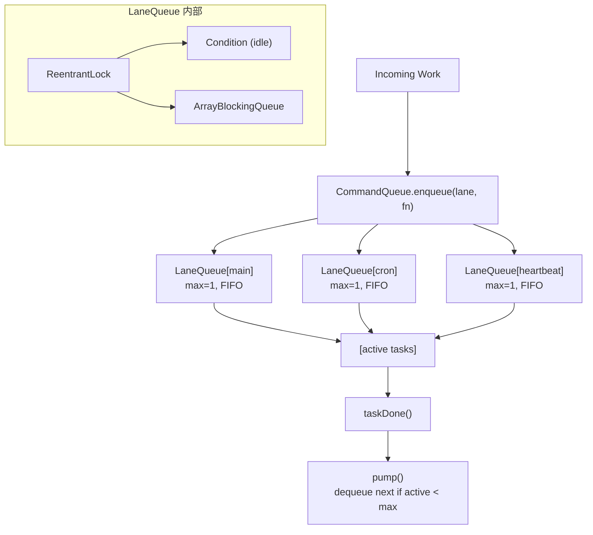

# S10 Concurrency -- "Named lanes serialize the chaos"

## 1. 核心概念

S07 用单个 `ReentrantLock` 保护 agent 执行, 但只有一个 lane 意味着所有后台任务互相阻塞. S10 引入命名 lane 系统:

- **LaneQueue**: 每个 lane 是一个 FIFO 队列 + 可配置的 `maxConcurrency`. 任务以 `Callable<Object>` 入队, 在虚拟线程中执行, 结果通过 `CompletableFuture` 返回.
- **CommandQueue**: 中央调度器, 将 callable 路由到命名的 LaneQueue. 支持惰性创建 lane.
- **Generation-based cancellation**: 每个 lane 维护一个 generation 计数器. 重启时递增 generation, 来自旧 generation 的过期任务完成时不会重新泵送队列.
- **DeadlockDetector**: 使用 `ThreadMXBean.findDeadlockedThreads()` 定期检测死锁.

默认 3 个 lane:

| Lane | maxConcurrency | 用途 |
|------|---------------|------|
| `main` | 1 | 用户对话, 序列化执行 |
| `cron` | 1 | 定时任务 |
| `heartbeat` | 1 | 心跳检查 |

## 2. 架构图



**QueuedItem 三元组:** `(Callable task, CompletableFuture future, int generation)`

## 3. 关键代码片段

### LaneQueue: ReentrantLock + Condition + ArrayBlockingQueue

```java
// Java: 单个命名 lane 的 FIFO 队列 + 并发控制
static class LaneQueue {
    private final ReentrantLock lock = new ReentrantLock();
    private final Condition idle = lock.newCondition();
    private final ArrayBlockingQueue<QueuedItem> deque = new ArrayBlockingQueue<>(1024);
    private int activeCount = 0;
    private int generation = 0;

    CompletableFuture<Object> enqueue(Callable<Object> task) {
        CompletableFuture<Object> future = new CompletableFuture<>();
        lock.lock();
        try {
            deque.offer(new QueuedItem(task, future, generation));
            pump();  // 尝试启动任务
        } finally {
            lock.unlock();
        }
        return future;
    }

    void pump() {
        while (activeCount < maxConcurrency) {
            QueuedItem item = deque.poll();
            if (item == null) break;
            if (item.gen() != generation) {
                item.future().cancel(false);  // 过期任务直接取消
                continue;
            }
            activeCount++;
            Thread.ofVirtual().name("lane-" + name + "-worker").start(() -> runTask(item));
        }
    }
}
```

```python
# Python 等价: threading.Lock + collections.deque
import threading, collections
class LaneQueue:
    def __init__(self, name, max_concurrency=1):
        self.lock = threading.Lock()
        self.deque = collections.deque()
        self.active_count = 0
        self.generation = 0
```

### Generation-based 过期任务过滤

```java
// Java: taskDone 只在 generation 匹配时重新泵送
void taskDone(int expectedGen) {
    lock.lock();
    try {
        activeCount--;
        if (expectedGen == generation) {
            pump();  // generation 匹配, 继续泵送
        }
        idle.signalAll();  // 唤醒等待空闲的线程
    } finally {
        lock.unlock();
    }
}

// reset: 递增 generation, 使旧任务失效
void resetGeneration() {
    lock.lock();
    try {
        generation++;
        idle.signalAll();
    } finally {
        lock.unlock();
    }
}
```

### CompletableFuture + whenComplete 异步回调

```java
// Java: 用户对话入队 main lane, 等待结果
CompletableFuture<Object> future = cmdQueue.enqueue(LANE_MAIN, () -> {
    return executeUserTurn(userInput, messages, systemPrompt, memory);
});

// 注册完成回调
future.whenComplete((result, exc) -> {
    if (exc != null) {
        printLane(laneName, "error: " + exc.getMessage());
    } else {
        printLane(laneName, "result: " + result.toString());
    }
});

// 或阻塞等待
Object result = future.get(120, TimeUnit.SECONDS);
```

### DeadlockDetector 死锁检测

```java
// Java: 使用 ThreadMXBean 每 10 秒检测死锁
static class DeadlockDetector {
    void check() {
        ThreadMXBean tmx = ManagementFactory.getThreadMXBean();
        long[] deadlocked = tmx.findDeadlockedThreads();
        if (deadlocked != null && deadlocked.length > 0) {
            for (ThreadInfo info : tmx.getThreadInfo(deadlocked)) {
                // 报告死锁线程名和状态
            }
            onDeadlock.accept(report);
        }
    }
}
```

### Lane-busy 检查替代 tryLock()

```java
// S07: 用 tryLock() 检查是否忙
boolean acquired = laneLock.tryLock();
if (!acquired) return;

// S10: 用 lane 的 active count 检查
LaneQueue lane = commandQueue.getOrCreateLane(LANE_HEARTBEAT);
Map<String, Object> laneStats = lane.stats();
if ((int) laneStats.get("active") > 0) return;  // lane 忙, 跳过
commandQueue.enqueue(LANE_HEARTBEAT, () -> { /* ... */ });
```

## 4. 运行方式

```bash
mvn compile exec:java -Dexec.mainClass="com.claw0.sessions.S10Concurrency"
```

前置条件:
- `.env` 文件中配置 `ANTHROPIC_API_KEY`
- 可选: `workspace/HEARTBEAT.md` 配置心跳指令
- 可选: `workspace/CRON.json` 配置定时任务

## 5. REPL 命令

| 命令 | 说明 |
|------|------|
| `/lanes` | 显示所有 lane 状态 (active `[*.]`, queued, max, generation) |
| `/queue` | 显示各 lane 待处理数量 |
| `/enqueue <lane> <msg>` | 手动向指定 lane 入队任务 |
| `/concurrency <lane> <N>` | 修改 lane 的 maxConcurrency |
| `/generation` | 显示各 lane 的 generation 计数器 |
| `/reset` | 模拟重启: 递增所有 generation, 旧任务失效 |
| `/heartbeat` | 显示心跳状态 |
| `/trigger` | 手动触发心跳 |
| `/cron` | 列出 cron 任务 |
| `/help` | 显示帮助信息 |

## 6. 使用案例

### 案例 1: 启动 — 三 lane + 心跳 + Cron

启动时创建 3 个 lane (main/cron/heartbeat), 初始化 HeartbeatRunner 和 CronService:

```
============================================================
  claw0  |  Section 10: Concurrency
  Model: claude-sonnet-4-20250514
  Lanes: main, cron, heartbeat
  Heartbeat: on (1800s)
  Cron jobs: 2
  Deadlock detector: active
  /help for commands. quit to exit.
============================================================

You > 你好

  [main] processing...
Assistant: 你好！有什么可以帮你的吗？
```

> Banner 显示: lane 名称列表、心跳状态 (on/off + 间隔)、cron 任务数、死锁检测器。
> 用户对话通过 `main` lane 序列化执行, `[main] processing...` 表示任务已入队。

### 案例 2: 查看 Lane 状态 — /lanes

```
You > /lanes

  main          active=[.]  queued=0  max=1  gen=0
  cron          active=[.]  queued=0  max=1  gen=0
  heartbeat     active=[.]  queued=0  max=1  gen=0
```

> `active=[.]` 表示 0 个活跃任务 (max=1, 用 `.` 表示空闲位, `*` 表示活跃位)。
> 如果有活跃任务, 显示为 `active=[*]`。`queued` 是队列中等待的任务数。
> `gen=0` 是 generation 计数器, `/reset` 后递增。

### 案例 3: Lane 并发执行 — main 不阻塞 heartbeat

用户对话在 main lane 中执行时, heartbeat 和 cron 在各自的 lane 中独立运行:

```
You > 帮我写一首关于并发编程的短诗

  [main] processing...

                          ← heartbeat tick: lane 空闲 → 入队执行
  [heartbeat] output queued (85 chars)
  [heartbeat] 今天是你订阅的续费日, 记得检查自动扣款是否成功。

Assistant: 线程如溪流, 各自奔涌不回头。
锁住的不是代码, 是对秩序的渴望。
Lane 是河床, 任务是水——有序, 但不停息。
```

> 用户对话在 main lane 执行期间, heartbeat tick 检查自己的 lane (空闲) 并入队执行。
> 两个 lane 互不阻塞 — main 处理用户请求, heartbeat 独立运行。
> REPL 循环每轮先排空 heartbeat 和 cron 的输出队列, 再等待用户输入。

### 案例 4: 手动入队 — /enqueue

向指定 lane 手动入队一个 LLM 调用:

```
You > /enqueue main 帮我翻译 "Hello World" 成法语

  Enqueueing into 'main': 帮我翻译 "Hello World" 成法语...

You > /lanes

  main          active=[*]  queued=0  max=1  gen=0
  cron          active=[.]  queued=0  max=1  gen=0
  heartbeat     active=[.]  queued=0  max=1  gen=0

  [main] result: "Hello World" 的法语翻译是 "Bonjour le Monde"。
```

> `/enqueue` 将任务入队到指定 lane, 通过 `runAgentSingleTurn` 调用 LLM。
> 入队后任务异步执行, 完成后通过 `whenComplete` 回调打印结果。
> `/lanes` 可以看到 main lane 的 `active=[*]` (有活跃任务)。

### 案例 5: 修改并发数 — /concurrency

动态修改 lane 的 maxConcurrency:

```
You > /concurrency main 3
  main: max_concurrency 1 -> 3

You > /lanes

  main          active=[...]  queued=0  max=3  gen=0
  cron          active=[.]  queued=0  max=1  gen=0
  heartbeat     active=[.]  queued=0  max=1  gen=0
```

> `max_concurrency` 从 1 改为 3, active bar 从 `[*]` 变为 `[...]` (3 个空位)。
> 修改后如果队列中有等待的任务, `setMaxConcurrency()` 内部自动调用 `pump()` 启动更多任务。
> 生产环境可根据负载动态调整并发数。

### 案例 6: Generation 重置 — /reset

模拟重启场景, 使旧任务失效:

```
You > /enqueue cron 每小时检查一次邮件
  Enqueueing into 'cron': 每小时检查一次邮件...

You > /generation

  main: generation=0
  cron: generation=0
  heartbeat: generation=0

You > /reset

  Generation incremented on all lanes:
    main: generation -> 1
    cron: generation -> 1
    heartbeat: generation -> 1
  Stale tasks from the old generation will be ignored.

You > /generation

  main: generation=1
  cron: generation=1
  heartbeat: generation=1
```

> `/reset` 调用 `resetAll()`, 递增所有 lane 的 generation。
> 队列中来自旧 generation (gen=0) 的任务在 `pump()` 时被检测到并取消。
> `taskDone()` 中 generation 不匹配时不触发 pump, 避免旧生命周期污染新生命周期。
> 这模拟了进程重启后的恢复行为 — 旧任务自然失效。

### 案例 7: 查看队列 — /queue

```
You > /enqueue main 任务A
  Enqueueing into 'main': 任务A...

You > /enqueue main 任务B
  Enqueueing into 'main': 任务B...

You > /queue

  main: 1 queued, 1 active
```

> main lane 正在执行 "任务A" (active=1), "任务B" 在队列中等待 (queued=1)。
> maxConcurrency=1 保证 main lane 内顺序执行 — A 完成后 B 才会启动。

### 案例 8: 心跳状态 — /heartbeat

```
You > /heartbeat

  enabled: true
  should_run: false
  reason: interval not elapsed (1200s remaining)
  last_run: 2026-04-26T06:30:00Z
  next_in: 1200s
  interval: 1800s
  active_hours: 9:00-22:00
  queue_size: 0
```

> 8 个状态字段: enabled (HEARTBEAT.md 是否存在)、should_run + reason (为何不运行)、
> last_run (上次执行时间)、next_in (距下次运行的秒数)、interval (间隔)、
> active_hours (活跃时段)、queue_size (输出队列中待打印的消息数)。

### 案例 9: 手动触发心跳 — /trigger

```
You > /trigger

  Heartbeat tick triggered.
  [heartbeat] output queued (128 chars)
  [heartbeat] 检测到你有 3 封未读邮件, 主题涉及项目进度评审。
```

> `/trigger` 调用 `heartbeatTick()`, 绕过间隔检查但仍然受 lane-busy 检查约束。
> 内部等待 500ms 让异步任务完成, 然后排空输出队列打印结果。
> 如果 heartbeat lane 已有活跃任务, tick 会跳过 (非阻塞语义)。

### 案例 10: Cron 任务列表 — /cron

在 `workspace/CRON.json` 中定义定时任务:

```json
{
  "jobs": [
    {
      "id": "hourly-check",
      "name": "每小时检查",
      "enabled": true,
      "schedule": {"kind": "every", "every_seconds": 3600},
      "payload": {"kind": "agent_turn", "message": "检查是否有需要提醒用户的事项"}
    }
  ]
}
```

查看 cron 状态:

```
You > /cron

  [ON] hourly-check - 每小时检查 in 2800s
```

> `[ON]`/`[OFF]` 显示任务启用状态。连续错误 5 次后自动切换为 `[OFF]`。
> `in 2800s` 显示距下次运行的秒数。

### 案例 11: 记忆工具 — 跨 lane 共享记忆

用户对话和后台任务都可以使用记忆工具:

```
You > 记住: 我对花生过敏

  [tool: memory_write]
Assistant: 已记住, 你对花生过敏。

  [heartbeat] 检测到附近有一家新开的花生酱主题餐厅, 但考虑到你对花生过敏, 建议避开。

You > 我对什么过敏？

  [tool: memory_search]
Assistant: 你对花生过敏。
```

> `memory_write` 将内容追加到 `workspace/MEMORY.md`, 所有 lane 共享同一个文件。
> 心跳任务在构建 prompt 时加载 MEMORY.md 内容, 因此能引用用户记忆。
> 跨 lane 共享记忆通过文件系统实现, 无需额外同步机制。

### 案例 12: 完整流程 — 用户对话 + 后台任务并发

```
You > /lanes

  main          active=[.]  queued=0  max=1  gen=0
  cron          active=[.]  queued=0  max=1  gen=0
  heartbeat     active=[.]  queued=0  max=1  gen=0

You > 帮我总结一下今天的工作

  [main] processing...

  [cron] [每小时检查] 没有发现需要特别提醒的事项, 一切正常。

Assistant: 根据我们的对话记录, 今天的工作包括:
1. 完成了并发系统的 lane 架构设计
2. 实现了 generation-based 任务取消
3. 集成了死锁检测看门狗

You > /lanes

  main          active=[.]  queued=0  max=1  gen=0
  cron          active=[.]  queued=0  max=1  gen=0
  heartbeat     active=[.]  queued=0  max=1  gen=0
```

> 完整流程: 用户消息入队 main lane → main 处理中 cron tick 到期 → cron 入队 cron lane →
> 两个 lane 并行执行 → REPL 先排空 cron 输出, 再显示 assistant 回复。
> 三个 lane 互不阻塞, 各自独立运行。

## 8. 学习要点

1. **命名 lane 替换单个锁, 实现按关注点序列化**: 不再所有任务竞争一把锁. main/cron/heartbeat 各自有独立队列, 互不阻塞. 同一 lane 内通过 `maxConcurrency=1` 保证顺序.

2. **Generation 计数器防止过期任务重新泵送**: 重启时调用 `resetAll()` 递增所有 lane 的 generation. 旧 generation 的任务完成时 `taskDone()` 发现 generation 不匹配, 不触发 `pump()`, 避免唤醒旧生命周期的后续工作.

3. **CompletableFuture 提供异步结果传播**: `enqueue()` 返回 `CompletableFuture`, 调用方可以选择 `future.get()` 阻塞等待 (如用户对话), 或 `future.whenComplete()` 注册回调 (如 heartbeat/cron).

4. **Lane-busy 检查替代 tryLock()**: S10 不再用 `ReentrantLock.tryLock()` 判断是否忙, 而是检查 lane 的 `activeCount`. 这更语义化 -- "heartbeat lane 是否有活跃工作?" 比锁的粒度更合适.

5. **DeadlockDetector 使用 ThreadMXBean 进行运行时监控**: 每 10 秒调用 `findDeadlockedThreads()` 检测死锁. 检测到时报告线程名和状态, 帮助诊断并发问题. 这在生产环境中是重要的可观测性工具.
