# claw0 Java 重写可行性分析

> **分析对象**: claw0 — 渐进式 AI Agent 网关教学项目（~7,400 行 Python）
> **目标语言**: Java 17+ 及 Java 生态技术栈
> **结论**: **完全可行**，且 Java 生态在并发、类型安全、企业级框架方面有天然优势

---

## 目录

1. [可行性结论](#1-可行性结论)
2. [Python 特性与 Java 对照映射](#2-python-特性与-java-对照映射)
3. [依赖替换方案](#3-依赖替换方案)
4. [逐模块重写分析](#4-逐模块重写分析)
5. [Java 技术栈选型建议](#5-java-技术栈选型建议)
6. [两种重写方案对比](#6-两种重写方案对比)
7. [方案一：轻量级重写（推荐）](#7-方案一轻量级重写推荐)
8. [方案二：Spring Boot 企业级重写](#8-方案二spring-boot-企业级重写)
9. [重写后项目结构](#9-重写后项目结构)
10. [关键设计挑战与解法](#10-关键设计挑战与解法)
11. [工作量估算](#11-工作量估算)
12. [风险与注意事项](#12-风险与注意事项)
13. [实施路线图](#13-实施路线图)

---

## 1. 可行性结论

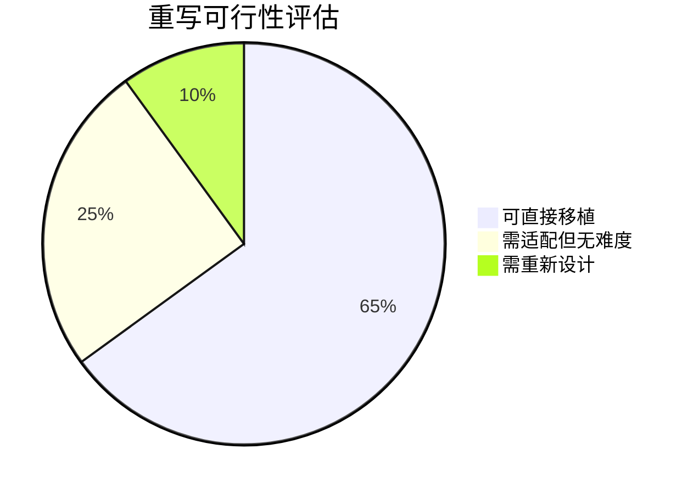

| 维度 | 评估 | 说明 |
|------|------|------|
| **语言特性兼容性** | ✅ 完全可行 | 无元编程、无 monkey-patch、无 `eval()/exec()`，均为标准 OOP 模式 |
| **第三方库替代** | ✅ 完全可行 | Anthropic 官方提供 Java SDK，其余均有成熟替代 |
| **并发模型** | ✅ Java 更优 | `java.util.concurrent` 比 Python threading 更强大、更安全 |
| **设计模式兼容性** | ✅ 完全可行 | 所有模式（分发表、ABC、观察者、Builder）在 Java 中有原生支持 |
| **I/O 模型** | ✅ 完全可行 | `java.nio` 提供完整的文件/网络 I/O 支持 |
| **教学可读性** | ⚠️ 需注意 | Java 更冗长，需刻意控制代码量以保持教学性 |

**总结**: claw0 的架构设计干净、模式标准，不依赖任何 Python "黑魔法"。Java 重写不仅可行，且在类型安全、并发控制、企业级扩展性方面有天然优势。

---

## 2. Python 特性与 Java 对照映射

### 2.1 语言特性逐项对照

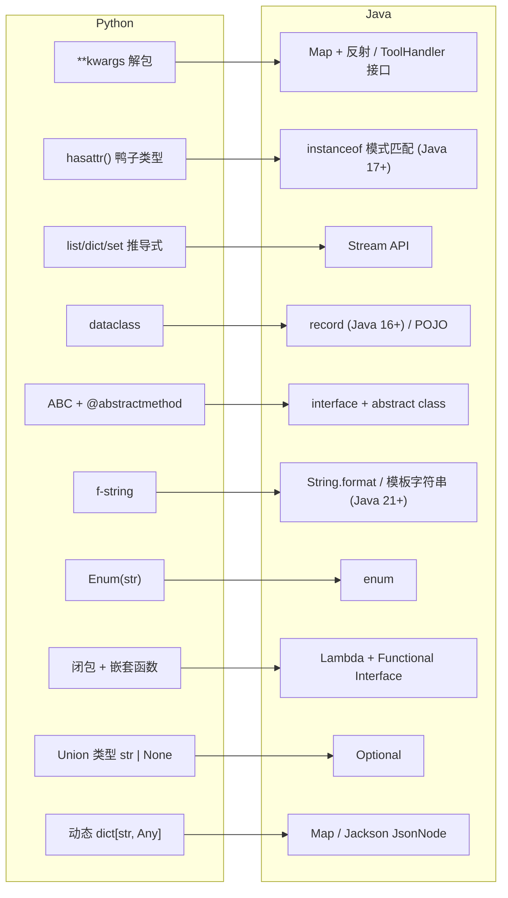

### 2.2 关键难点分析

#### 难点 1：`**kwargs` 工具分发（中等难度）

**Python 原代码**:
```python
TOOL_HANDLERS = {"bash": tool_bash, "read_file": tool_read_file, ...}

def process_tool_call(name, input):
    handler = TOOL_HANDLERS.get(name)
    return handler(**input)   # dict 直接解包为函数参数
```

**Java 解法 — ToolHandler 接口**:
```java
@FunctionalInterface
public interface ToolHandler {
    String execute(Map<String, Object> input);
}

Map<String, ToolHandler> TOOL_HANDLERS = Map.of(
    "bash", input -> toolBash((String) input.get("command"),
                               (Integer) input.getOrDefault("timeout", 30)),
    "read_file", input -> toolReadFile((String) input.get("file_path"))
);

public String processToolCall(String name, Map<String, Object> input) {
    ToolHandler handler = TOOL_HANDLERS.get(name);
    if (handler == null) return "Error: Unknown tool '" + name + "'";
    return handler.execute(input);
}
```

#### 难点 2：鸭子类型 `hasattr(block, "text")`（低难度）

**Python**:
```python
for block in response.content:
    if hasattr(block, "text"):
        text += block.text
```

**Java（Anthropic Java SDK 已有类型）**:
```java
for (ContentBlock block : response.getContent()) {
    if (block instanceof TextBlock tb) {
        text.append(tb.getText());
    } else if (block instanceof ToolUseBlock tub) {
        // 处理工具调用
    }
}
```

#### 难点 3：非阻塞 stdin 轮询（中等难度）

**Python**: `select.select([sys.stdin], [], [], 0.5)`

**Java 解法**: 后台线程 + BlockingQueue

```java
BlockingQueue<String> inputQueue = new LinkedBlockingQueue<>();
Thread inputThread = new Thread(() -> {
    Scanner scanner = new Scanner(System.in);
    while (scanner.hasNextLine()) {
        inputQueue.put(scanner.nextLine());
    }
}, "stdin-reader");
inputThread.setDaemon(true);
inputThread.start();

// 非阻塞读取
String line = inputQueue.poll(500, TimeUnit.MILLISECONDS);
```

#### 难点 4：动态消息列表 `list[dict]`（低难度）

**Python**:
```python
messages.append({"role": "user", "content": user_input})
messages.append({"role": "assistant", "content": response.content})
```

**Java（使用 Anthropic Java SDK 类型）**:
```java
List<MessageParam> messages = new ArrayList<>();
messages.add(MessageParam.ofUser(userInput));
messages.add(MessageParam.ofAssistant(response.getContent()));
```

---

## 3. 依赖替换方案

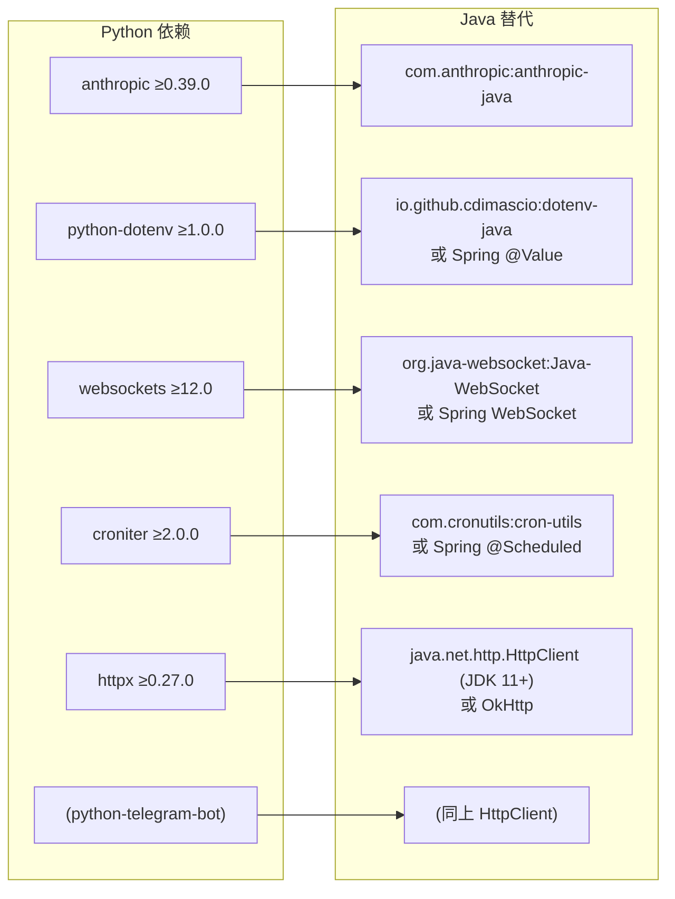

### 详细替代方案

| Python 依赖 | Java 替代 | Maven 坐标 | 说明 |
|-------------|----------|------------|------|
| `anthropic` | Anthropic Java SDK | `com.anthropic:anthropic-java` | 官方 SDK，API 完全对等 |
| `python-dotenv` | dotenv-java | `io.github.cdimascio:dotenv-java:3.0.0` | `.env` 文件加载，API 类似 |
| `websockets` | Java-WebSocket | `org.java-websocket:Java-WebSocket:1.5.6` | 轻量 WebSocket 服务端/客户端 |
| `croniter` | cron-utils | `com.cronutils:cron-utils:9.2.1` | Cron 表达式解析与下次执行时间计算 |
| `httpx` | JDK HttpClient | `java.net.http.HttpClient` (内置) | JDK 11+ 内置，零额外依赖 |
| — | Jackson | `com.fasterxml.jackson.core:jackson-databind` | JSON 序列化/反序列化 |
| — | SLF4J + Logback | `ch.qos.logback:logback-classic` | 替代 print 的日志体系 |

---

## 4. 逐模块重写分析

### 4.1 重写难度热力图

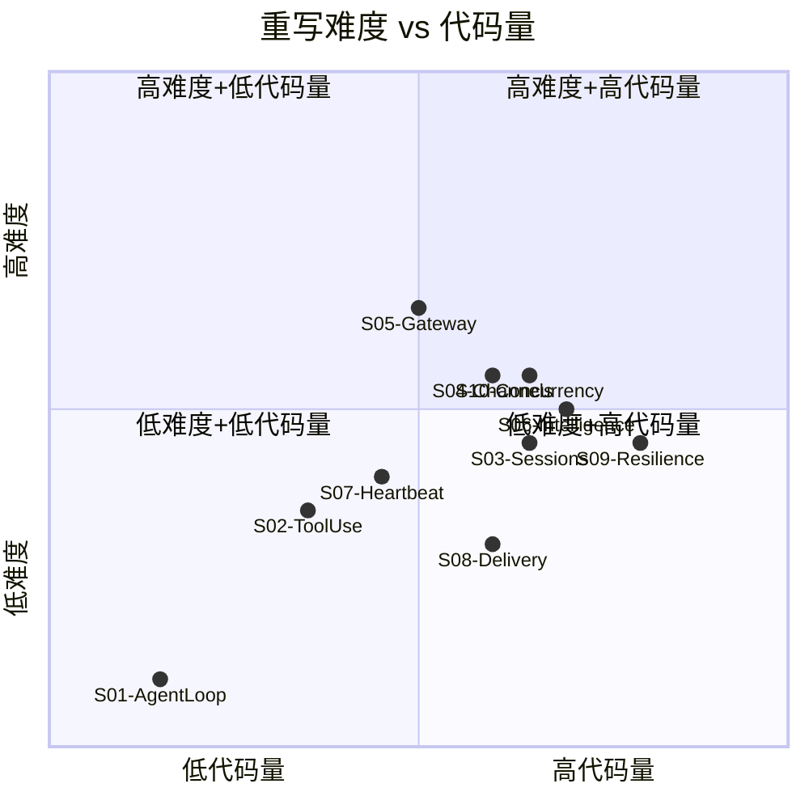

### 4.2 逐模块分析

| Session | Python 行数 | Java 预估行数 | 难度 | 关键适配点 |
|---------|-----------|-------------|------|----------|
| S01: Agent Loop | 172 | ~250 | ⭐ | `Scanner` 替代 `input()`，Anthropic Java SDK 调用 |
| S02: Tool Use | 439 | ~600 | ⭐⭐ | `ToolHandler` 接口替代 `**kwargs` 分发，`ProcessBuilder` 替代 `subprocess` |
| S03: Sessions | 873 | ~1,200 | ⭐⭐ | JSONL 读写用 Jackson，`BufferedWriter.append()` 替代 file append |
| S04: Channels | 792 | ~1,100 | ⭐⭐⭐ | Telegram/Feishu HTTP 用 `HttpClient`，`Channel` 接口设计 |
| S05: Gateway | 626 | ~900 | ⭐⭐⭐ | WebSocket 服务端，`CompletableFuture` 替代 asyncio |
| S06: Intelligence | 905 | ~1,300 | ⭐⭐⭐ | TF-IDF 纯 Java 实现，YAML frontmatter 解析 |
| S07: Heartbeat & Cron | 659 | ~900 | ⭐⭐ | `ScheduledExecutorService` / `cron-utils` |
| S08: Delivery | 869 | ~1,100 | ⭐⭐ | `Files.move(ATOMIC_MOVE)` 原子写入，`ScheduledExecutorService` 轮询 |
| S09: Resilience | 1,133 | ~1,500 | ⭐⭐⭐ | 多 `AnthropicClient` 实例管理，异常分类 |
| S10: Concurrency | 903 | ~1,200 | ⭐⭐⭐ | `ReentrantLock` + `Condition` + `CompletableFuture` |
| **合计** | **~7,400** | **~10,050** | — | — |

---

## 5. Java 技术栈选型建议

### 5.1 两条路线对比

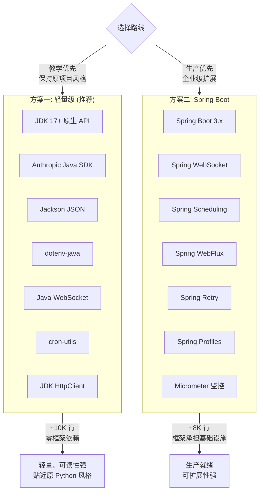

---

## 6. 两种重写方案对比

| 对比维度 | 方案一：轻量级 | 方案二：Spring Boot |
|---------|-------------|-------------------|
| **目标受众** | 学习者、理解 Agent 网关原理 | 工程团队、生产环境部署 |
| **框架依赖** | 仅 JDK + 4~5 个小库 | Spring Boot 全家桶 |
| **代码行数** | ~10,000 行 | ~8,000 行（框架承担一部分） |
| **启动速度** | 毫秒级 | 2~5 秒（Spring 容器初始化） |
| **学习曲线** | 低（纯 Java）| 中（需理解 Spring 概念） |
| **并发模型** | 手动 `ExecutorService` | Spring `@Async` + `@Scheduled` |
| **配置管理** | `dotenv-java` | `application.yml` + `@Value` |
| **WebSocket** | Java-WebSocket 库 | Spring WebSocket |
| **定时任务** | `cron-utils` + `ScheduledExecutorService` | `@Scheduled(cron="...")` |
| **HTTP 客户端** | `java.net.http.HttpClient` | Spring `WebClient` / `RestTemplate` |
| **韧性容错** | 手写重试逻辑（保持教学性） | Spring Retry + Resilience4j |
| **可观测性** | 日志 + print | Micrometer + Actuator |
| **部署** | `java -jar app.jar` | Spring Boot Fat JAR / Docker |

---

## 7. 方案一：轻量级重写（推荐）

> 保持 claw0 原有的 **教学渐进性** 和 **单文件独立运行** 特性

### 7.1 技术选型

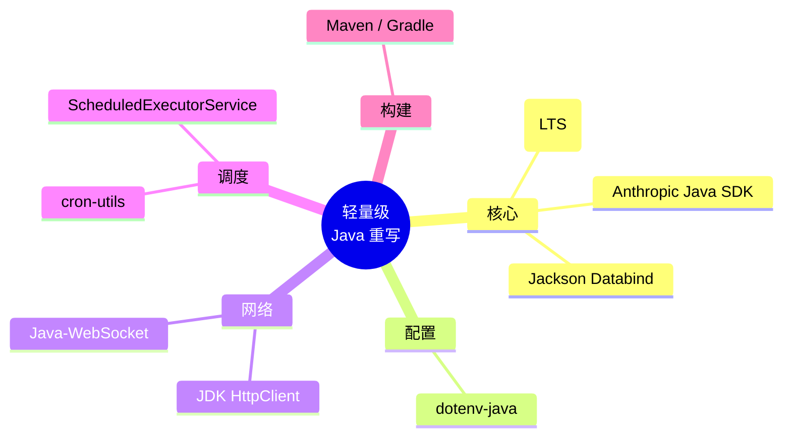

### 7.2 Maven 依赖

```xml
<dependencies>
    <!-- Anthropic Claude API -->
    <dependency>
        <groupId>com.anthropic</groupId>
        <artifactId>anthropic-java</artifactId>
        <version>1.x.x</version>
    </dependency>

    <!-- JSON -->
    <dependency>
        <groupId>com.fasterxml.jackson.core</groupId>
        <artifactId>jackson-databind</artifactId>
        <version>2.17.0</version>
    </dependency>

    <!-- .env 配置 -->
    <dependency>
        <groupId>io.github.cdimascio</groupId>
        <artifactId>dotenv-java</artifactId>
        <version>3.0.0</version>
    </dependency>

    <!-- WebSocket 服务端 -->
    <dependency>
        <groupId>org.java-websocket</groupId>
        <artifactId>Java-WebSocket</artifactId>
        <version>1.5.6</version>
    </dependency>

    <!-- Cron 表达式解析 -->
    <dependency>
        <groupId>com.cronutils</groupId>
        <artifactId>cron-utils</artifactId>
        <version>9.2.1</version>
    </dependency>

    <!-- 日志 -->
    <dependency>
        <groupId>ch.qos.logback</groupId>
        <artifactId>logback-classic</artifactId>
        <version>1.4.14</version>
    </dependency>
</dependencies>
```

### 7.3 核心类设计

```mermaid
classDiagram
    class AgentLoop {
        -List~MessageParam~ messages
        -AnthropicClient client
        -String modelId
        -String systemPrompt
        +run() void
    }

    class ToolHandler {
        <<interface>>
        +execute(Map input) String
    }

    class ToolRegistry {
        -Map~String, ToolHandler~ handlers
        -List~ToolDefinition~ schemas
        +register(name, schema, handler) void
        +dispatch(name, input) String
    }

    class SessionStore {
        -Path sessionDir
        -Map~String, SessionMeta~ index
        +appendTranscript(sessionId, event) void
        +rebuildHistory(sessionId) List
        +createSession(label) String
        +loadSession(sessionId) List
    }

    class ContextGuard {
        -int contextBudget
        +guardApiCall(client, kwargs) Message
        -truncateToolResults(messages) void
        -compactHistory(client, messages) void
        +estimateTokens(text) int
    }

    class Channel {
        <<interface>>
        +receive() Optional~InboundMessage~
        +send(to, text) boolean
        +close() void
    }

    class CLIChannel {
        +receive() Optional~InboundMessage~
        +send(to, text) boolean
    }

    class TelegramChannel {
        -HttpClient http
        -String token
        -long offset
        +receive() Optional~InboundMessage~
        +send(to, text) boolean
    }

    class FeishuChannel {
        -HttpClient http
        -String appId
        -String appSecret
        +receive() Optional~InboundMessage~
        +send(to, text) boolean
    }

    class BindingTable {
        -List~Binding~ bindings
        +resolve(message) String
        +addBinding(binding) void
    }

    class AgentManager {
        -Map~String, AgentConfig~ agents
        +register(config) void
        +getAgent(id) AgentConfig
    }

    class GatewayServer {
        -WebSocketServer server
        -BindingTable bindings
        -AgentManager agents
        +start(host, port) void
        +dispatch(method, params) Object
    }

    class BootstrapLoader {
        -Path workspaceDir
        -Map~String, String~ files
        +load(mode) Map
    }

    class SkillsManager {
        -List~Skill~ skills
        +discover(dirs) void
        +renderPromptBlock() String
    }

    class MemoryStore {
        -Path memoryDir
        +write(key, value) void
        +search(query, topK) List
        -tfidfSearch(query) List
        -vectorSearch(query) List
    }

    class HeartbeatRunner {
        -ScheduledExecutorService executor
        -ReentrantLock laneLock
        +start() void
        +stop() void
    }

    class CronService {
        -List~CronJob~ jobs
        -ScheduledExecutorService executor
        +loadJobs(path) void
        +start() void
        +tick() void
    }

    class DeliveryQueue {
        -Path queueDir
        +enqueue(delivery) String
        +ack(id) void
        +fail(id, error) void
        +loadPending() List
    }

    class DeliveryRunner {
        -DeliveryQueue queue
        -ScheduledExecutorService executor
        +start() void
    }

    class ProfileManager {
        -List~AuthProfile~ profiles
        +selectProfile() Optional~AuthProfile~
        +markFailure(profile, reason) void
        +markSuccess(profile) void
    }

    class ResilienceRunner {
        -ProfileManager profileMgr
        -ContextGuard contextGuard
        +run(messages, tools, system) Pair
    }

    class LaneQueue {
        -String name
        -int maxConcurrency
        -Deque~QueuedItem~ deque
        -ReentrantLock lock
        -Condition condition
        -AtomicInteger generation
        +enqueue(callable) CompletableFuture
        +waitForIdle(timeout) void
    }

    class CommandQueue {
        -Map~String, LaneQueue~ lanes
        +enqueue(lane, callable) CompletableFuture
        +resetAll() void
        +waitForAll(timeout) void
    }

    Channel <|.. CLIChannel
    Channel <|.. TelegramChannel
    Channel <|.. FeishuChannel
    AgentLoop --> ToolRegistry
    AgentLoop --> SessionStore
    AgentLoop --> ContextGuard
    GatewayServer --> BindingTable
    GatewayServer --> AgentManager
    ResilienceRunner --> ProfileManager
    ResilienceRunner --> ContextGuard
    CommandQueue --> LaneQueue
```

### 7.4 核心代码示例

#### S01: Agent Loop

```java
public class S01AgentLoop {

    private static final String MODEL_ID = Config.get("MODEL_ID", "claude-sonnet-4-20250514");
    private static final AnthropicClient client = AnthropicClient.builder()
            .apiKey(Config.get("ANTHROPIC_API_KEY"))
            .build();

    public static void main(String[] args) {
        List<MessageParam> messages = new ArrayList<>();
        Scanner scanner = new Scanner(System.in);

        System.out.println("claw0-java | Section 01: The Agent Loop");

        while (true) {
            System.out.print("\033[36m\033[1mYou > \033[0m");
            String input = scanner.nextLine().trim();
            if (input.isEmpty()) continue;
            if ("quit".equals(input) || "exit".equals(input)) break;

            messages.add(MessageParam.ofUser(input));

            try {
                Message response = client.messages().create(MessageCreateParams.builder()
                        .model(MODEL_ID)
                        .maxTokens(8096)
                        .system(SYSTEM_PROMPT)
                        .messages(messages)
                        .build());

                if ("end_turn".equals(response.stopReason())) {
                    String text = response.getContent().stream()
                            .filter(b -> b instanceof TextBlock)
                            .map(b -> ((TextBlock) b).getText())
                            .collect(Collectors.joining());
                    System.out.println("\n\033[32m\033[1mAssistant:\033[0m " + text + "\n");
                    messages.add(MessageParam.ofAssistant(response.getContent()));
                }
            } catch (Exception e) {
                System.out.println("API Error: " + e.getMessage());
                messages.remove(messages.size() - 1);
            }
        }
    }
}
```

#### S02: Tool Dispatch

```java
@FunctionalInterface
public interface ToolHandler {
    String execute(Map<String, Object> input);
}

public class ToolRegistry {
    private final Map<String, ToolHandler> handlers = new LinkedHashMap<>();
    private final List<Tool> schemas = new ArrayList<>();

    public void register(String name, Tool schema, ToolHandler handler) {
        schemas.add(schema);
        handlers.put(name, handler);
    }

    public String dispatch(String name, Map<String, Object> input) {
        ToolHandler handler = handlers.get(name);
        if (handler == null) return "Error: Unknown tool '" + name + "'";
        try {
            return handler.execute(input);
        } catch (Exception e) {
            return "Error: " + name + " failed: " + e.getMessage();
        }
    }
}
```

#### S10: LaneQueue

```java
public class LaneQueue {
    private final String name;
    private final int maxConcurrency;
    private final Deque<QueuedItem> deque = new ArrayDeque<>();
    private final ReentrantLock lock = new ReentrantLock();
    private final Condition idle = lock.newCondition();
    private final AtomicInteger generation = new AtomicInteger(0);
    private int activeCount = 0;

    public CompletableFuture<Object> enqueue(Callable<Object> task) {
        CompletableFuture<Object> future = new CompletableFuture<>();
        lock.lock();
        try {
            deque.addLast(new QueuedItem(task, future, generation.get()));
            pump();
        } finally {
            lock.unlock();
        }
        return future;
    }

    private void pump() {
        while (activeCount < maxConcurrency && !deque.isEmpty()) {
            QueuedItem item = deque.pollFirst();
            if (item.generation() != generation.get()) {
                item.future().cancel(false);
                continue;
            }
            activeCount++;
            int gen = generation.get();
            Thread.ofVirtual().name(name + "-worker").start(() -> {
                try {
                    Object result = item.task().call();
                    item.future().complete(result);
                } catch (Exception e) {
                    item.future().completeExceptionally(e);
                } finally {
                    taskDone(gen);
                }
            });
        }
    }

    private void taskDone(int expectedGen) {
        lock.lock();
        try {
            activeCount--;
            if (generation.get() == expectedGen) pump();
            if (activeCount == 0 && deque.isEmpty()) idle.signalAll();
        } finally {
            lock.unlock();
        }
    }
}
```

---

## 8. 方案二：Spring Boot 企业级重写

> 利用 Spring 生态减少基础设施代码，聚焦业务逻辑

### 8.1 技术选型

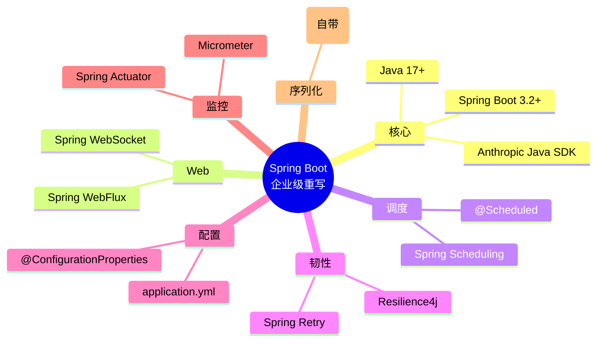

### 8.2 关键优势：框架替代手写代码

| claw0 手写模块 | Spring 替代 | 代码量节省 |
|---------------|-----------|----------|
| HeartbeatRunner (计时器线程) | `@Scheduled(fixedRate=1800000)` | ~80% |
| CronService (cron 解析+调度) | `@Scheduled(cron="0 9 * * *")` | ~90% |
| GatewayServer (WebSocket) | `@ServerEndpoint` / `WebSocketHandler` | ~60% |
| DeliveryRunner (后台轮询) | `@Scheduled` + `@Async` | ~70% |
| ProfileManager (配置管理) | `@ConfigurationProperties` + `@Profile` | ~50% |
| 重试逻辑 | `@Retryable` + `@Recover` | ~80% |

### 8.3 Spring Boot 配置示例

```yaml
# application.yml
anthropic:
  api-key: ${ANTHROPIC_API_KEY}
  model-id: claude-sonnet-4-20250514
  base-url: ${ANTHROPIC_BASE_URL:}
  profiles:
    - name: main
      api-key: ${ANTHROPIC_API_KEY}
    - name: backup
      api-key: ${ANTHROPIC_BACKUP_KEY:}

gateway:
  websocket:
    port: 8080
  binding:
    default-agent: luna

heartbeat:
  interval: 1800
  active-start: 9
  active-end: 22

channels:
  telegram:
    token: ${TELEGRAM_BOT_TOKEN:}
  feishu:
    app-id: ${FEISHU_APP_ID:}
    app-secret: ${FEISHU_APP_SECRET:}

workspace:
  path: ./workspace
```

### 8.4 Spring 核心组件

```java
@Service
public class HeartbeatService {

    @Scheduled(fixedRateString = "${heartbeat.interval:1800}000")
    public void heartbeat() {
        if (!isWithinActiveHours()) return;
        // 执行心跳检查...
    }
}

@Service
public class CronJobService {

    @Scheduled(cron = "${cron.morning-briefing:0 0 9 * * *}")
    public void morningBriefing() {
        agentService.runTurn("morning-briefing",
            "Check today's calendar and give a brief summary.");
    }
}

@Configuration
@EnableRetry
public class ResilienceConfig {

    @Bean
    @Retryable(maxAttempts = 3,
               backoff = @Backoff(delay = 5000, multiplier = 5))
    public AnthropicClient anthropicClient(AuthProfileManager profileMgr) {
        AuthProfile profile = profileMgr.selectAvailable();
        return AnthropicClient.builder()
                .apiKey(profile.getApiKey())
                .build();
    }
}
```

---

## 9. 重写后项目结构

### 9.1 方案一（轻量级）

```
claw0-java/
├── pom.xml
├── .env.example
├── src/main/java/com/claw0/
│   ├── sessions/                        # 10 个独立可运行的 Session
│   │   ├── S01AgentLoop.java            # ~250 行
│   │   ├── S02ToolUse.java              # ~600 行
│   │   ├── S03Sessions.java             # ~1,200 行
│   │   ├── S04Channels.java             # ~1,100 行
│   │   ├── S05GatewayRouting.java        # ~900 行
│   │   ├── S06Intelligence.java          # ~1,300 行
│   │   ├── S07HeartbeatCron.java         # ~900 行
│   │   ├── S08Delivery.java              # ~1,100 行
│   │   ├── S09Resilience.java            # ~1,500 行
│   │   └── S10Concurrency.java           # ~1,200 行
│   └── common/                          # 共享工具类（可选）
│       ├── Config.java                   # .env 加载
│       ├── AnsiColors.java              # ANSI 终端颜色
│       └── JsonUtils.java               # Jackson 工具
├── workspace/                           # 原样保留
│   ├── SOUL.md
│   ├── IDENTITY.md
│   └── ...
└── docs/                               # 每个 Session 的文档
    ├── s01_agent_loop.md
    └── ...
```

### 9.2 方案二（Spring Boot）

```
claw0-spring/
├── pom.xml
├── src/main/java/com/claw0/
│   ├── Claw0Application.java
│   ├── config/
│   │   ├── AnthropicConfig.java
│   │   ├── WebSocketConfig.java
│   │   └── ResilienceConfig.java
│   ├── agent/
│   │   ├── AgentLoop.java
│   │   ├── ToolHandler.java
│   │   ├── ToolRegistry.java
│   │   └── AgentConfig.java
│   ├── session/
│   │   ├── SessionStore.java
│   │   └── ContextGuard.java
│   ├── channel/
│   │   ├── Channel.java
│   │   ├── CLIChannel.java
│   │   ├── TelegramChannel.java
│   │   └── FeishuChannel.java
│   ├── gateway/
│   │   ├── GatewayController.java
│   │   ├── BindingTable.java
│   │   └── AgentManager.java
│   ├── intelligence/
│   │   ├── BootstrapLoader.java
│   │   ├── SkillsManager.java
│   │   └── MemoryStore.java
│   ├── scheduler/
│   │   ├── HeartbeatService.java
│   │   └── CronJobService.java
│   ├── delivery/
│   │   ├── DeliveryQueue.java
│   │   └── DeliveryRunner.java
│   ├── resilience/
│   │   ├── ProfileManager.java
│   │   └── ResilienceRunner.java
│   └── concurrency/
│       ├── LaneQueue.java
│       └── CommandQueue.java
├── src/main/resources/
│   ├── application.yml
│   └── workspace/                       # 打包到 JAR 内
└── workspace/                           # 外部可覆盖
```

---

## 10. 关键设计挑战与解法

### 10.1 挑战一览

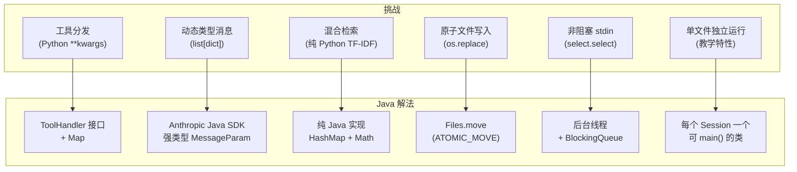

### 10.2 详解：TF-IDF 纯 Java 实现

Python 原代码在 `MemoryStore` 中用 ~60 行实现了完整的 TF-IDF + 哈希向量检索。Java 重写方案：

```java
public class TfIdfSearch {

    public double[] tfidf(String[] tokens, Map<String, Integer> df, int totalDocs) {
        Map<String, Long> tf = Arrays.stream(tokens)
                .collect(Collectors.groupingBy(t -> t, Collectors.counting()));

        double[] vec = new double[df.size()];
        int i = 0;
        for (var entry : df.entrySet()) {
            long termFreq = tf.getOrDefault(entry.getKey(), 0L);
            double idf = Math.log((double) totalDocs / (1 + entry.getValue()));
            vec[i++] = termFreq * idf;
        }
        return vec;
    }

    public double cosine(double[] a, double[] b) {
        double dot = 0, normA = 0, normB = 0;
        for (int i = 0; i < a.length; i++) {
            dot += a[i] * b[i];
            normA += a[i] * a[i];
            normB += b[i] * b[i];
        }
        double denom = Math.sqrt(normA) * Math.sqrt(normB);
        return denom == 0 ? 0 : dot / denom;
    }
}
```

### 10.3 详解：原子文件写入

```java
public class AtomicFileWriter {

    public static void writeAtomically(Path target, String content) throws IOException {
        Path tmp = target.resolveSibling(target.getFileName() + ".tmp." + UUID.randomUUID());
        try {
            Files.writeString(tmp, content, StandardCharsets.UTF_8);
            // fsync
            try (FileChannel fc = FileChannel.open(tmp, StandardOpenOption.WRITE)) {
                fc.force(true);
            }
            // 原子移动
            Files.move(tmp, target, StandardCopyOption.ATOMIC_MOVE,
                       StandardCopyOption.REPLACE_EXISTING);
        } catch (IOException e) {
            Files.deleteIfExists(tmp);
            throw e;
        }
    }
}
```

---

## 11. 工作量估算

### 11.1 方案一（轻量级）

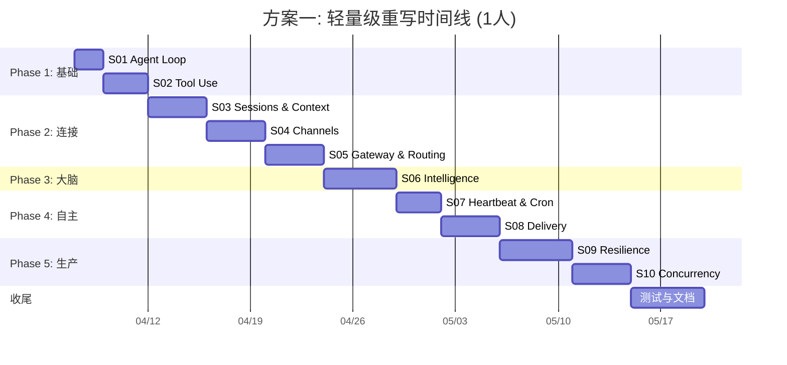

| 阶段 | 工时（人天） | 说明 |
|------|-----------|------|
| Phase 1: 基础 (S01-S02) | 5 | 最简单，熟悉 SDK |
| Phase 2: 连接 (S03-S05) | 12 | JSONL 序列化、HTTP 客户端、WebSocket |
| Phase 3: 大脑 (S06) | 5 | TF-IDF 实现、YAML 解析 |
| Phase 4: 自主 (S07-S08) | 7 | 定时器、原子文件 I/O |
| Phase 5: 生产 (S09-S10) | 9 | 并发是重点 |
| 测试与文档 | 5 | 单元测试 + Session 文档 |
| **合计** | **~43 人天（约 8~9 周）** | 1 人全职 |

### 11.2 方案二（Spring Boot）

| 阶段 | 工时（人天） | 节省原因 |
|------|-----------|---------|
| 项目脚手架 + 配置 | 2 | Spring Initializr |
| Agent 核心 (S01-S02) | 4 | 与方案一接近 |
| Sessions (S03) | 3 | Jackson 自带 |
| Channels (S04) | 3 | Spring WebClient |
| Gateway (S05) | 3 | Spring WebSocket |
| Intelligence (S06) | 5 | 无框架优势 |
| Heartbeat + Cron (S07) | 1 | `@Scheduled` 一行代码 |
| Delivery (S08) | 3 | `@Async` + `@Scheduled` |
| Resilience (S09) | 2 | Spring Retry / Resilience4j |
| Concurrency (S10) | 3 | Spring `@Async` + `TaskExecutor` |
| 测试与文档 | 4 | |
| **合计** | **~33 人天（约 6~7 周）** | 节省 ~25% |

---

## 12. 风险与注意事项

### 12.1 风险矩阵

| 风险 | 概率 | 影响 | 缓解措施 |
|------|------|------|---------|
| Anthropic Java SDK API 差异 | 中 | 高 | 先跑通 S01/S02 验证 SDK 兼容性 |
| Java 代码量膨胀影响教学性 | 高 | 中 | 使用 `record`、`var`、Stream API 精简；每个 Session 控制在 1 个文件内 |
| 单文件运行性受限 | 中 | 中 | 每个 Session 类都有独立 `main()` 方法，保持渐进可运行性 |
| JSONL 序列化行为差异 | 低 | 低 | 统一使用 Jackson，写测试覆盖边界情况 |
| subprocess 行为差异 | 低 | 低 | `ProcessBuilder` 在 Linux/macOS/Windows 上行为一致 |
| 虚拟线程兼容性 | 低 | 低 | 可选特性，JDK 21+ 可用，fallback 到平台线程 |

### 12.2 注意事项

1. **保持教学性**: claw0 的核心价值是教学，不要过度工程化。每个 Session 应该 **一个文件、一个 main()、一个概念**。

2. **Anthropic Java SDK 验证优先**: 在正式开始前，先写一个最小原型调通 Claude API，确认：
   - `messages.create()` 参数与 Python 版对等
   - `response.content` 中 `TextBlock` / `ToolUseBlock` 类型正确
   - `tool_result` 消息格式正确

3. **JSON 序列化一致性**: Python 的 `json.dumps` 与 Jackson 的 `ObjectMapper` 在处理特殊字符、Unicode、空值时可能有微小差异。写 JSONL 文件时需确保两端互通。

4. **编码统一**: 始终使用 `StandardCharsets.UTF_8`，避免平台默认编码问题。

5. **Java 版本选择**:
   - **最低 Java 17** — `record`、`sealed class`、`instanceof` 模式匹配
   - **推荐 Java 21** — 虚拟线程（LaneQueue 天然适配）、String Templates（预览）

---

## 13. 实施路线图

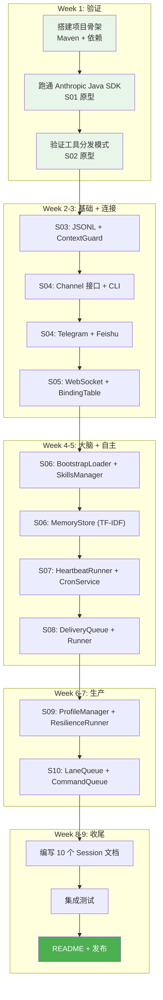

### 推荐启动步骤

1. **Day 1**: 创建 Maven 项目，添加所有依赖，跑通 `S01AgentLoop.main()`
2. **Day 2-3**: 实现 `ToolHandler` 接口 + `ToolRegistry`，跑通 `S02ToolUse.main()`
3. **Day 4**: 回顾 S01+S02 代码量，评估是否需要调整 Java 版的编码风格
4. **Day 5+**: 按 Session 顺序逐步推进

---

## 附录：推荐的 Java 版本特性利用

| Java 版本 | 可用特性 | 在 claw0 中的应用 |
|-----------|---------|------------------|
| Java 17 (LTS) | `record`、`sealed`、`instanceof` 模式匹配 | `InboundMessage`、`QueuedDelivery` 用 record；`ContentBlock` 用 sealed |
| Java 17 | `switch` 表达式 | `stop_reason` 分支、`FailoverReason` 分类 |
| Java 21 (LTS) | 虚拟线程 `Thread.ofVirtual()` | `LaneQueue` 工作线程、`DeliveryRunner` 后台线程 |
| Java 21 | `SequencedCollection` | `Deque` 操作更直观 |
| Java 21 | String Templates（预览） | 替代繁琐的字符串拼接 |
