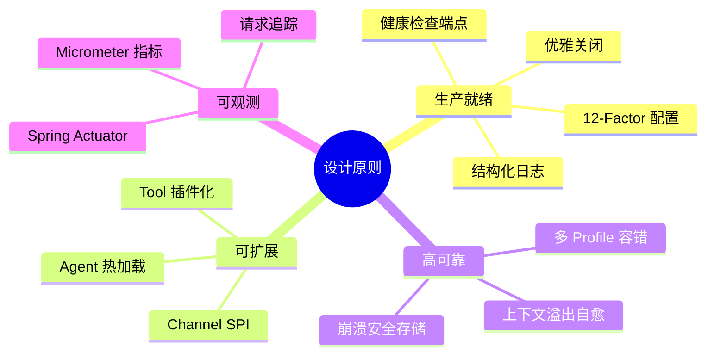
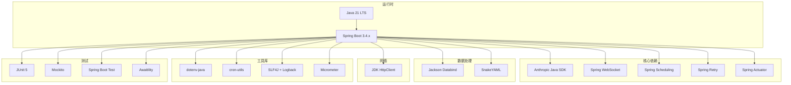
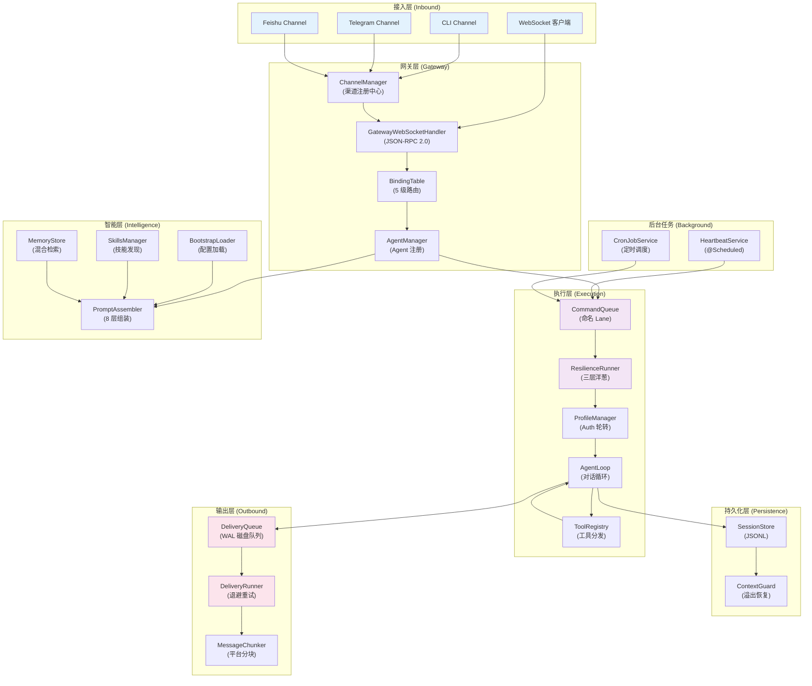
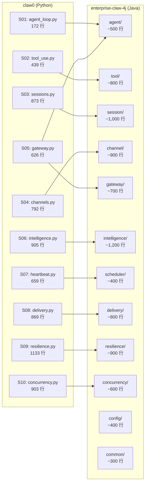
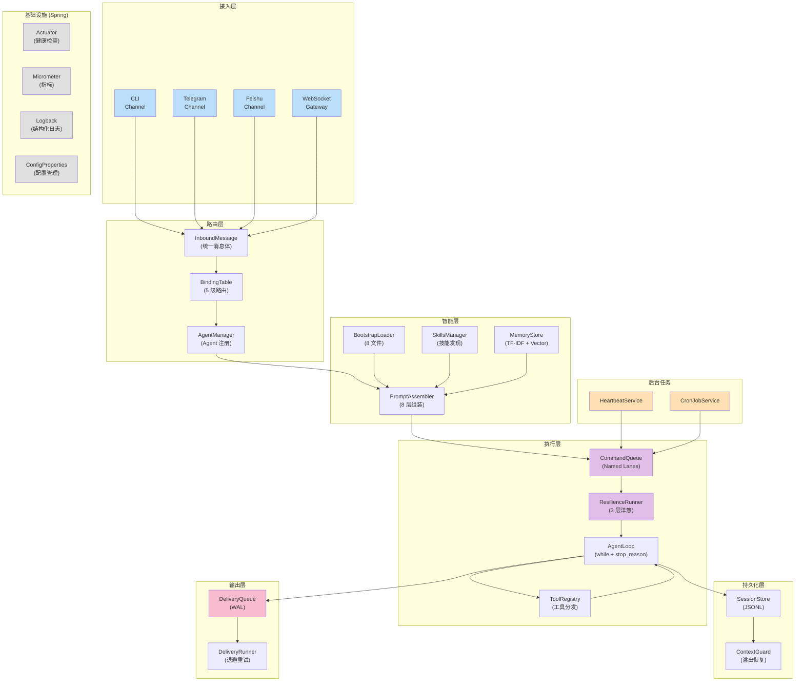

# enterprise-claw-4j 总览与技术选型

> **项目名称**: enterprise-claw-4j  
> **项目定位**: 基于 Spring Boot 的生产级 AI Agent 网关  
> **源项目**: claw0 (~7,400 行 Python) — 渐进式 AI Agent 网关教学项目  
> **目标语言**: Java 21 (LTS) + Spring Boot 3.4  
> **构建工具**: Maven  
> **存储方案**: 文件系统 (JSONL)  
> **代码风格**: 注释以中文为主，日志以英文为主

---

## 目录

1. [项目目标与范围](#1-项目目标与范围)
2. [技术栈选型](#2-技术栈选型)
3. [核心依赖清单](#3-核心依赖清单)
4. [项目结构总览](#4-项目结构总览)
5. [模块职责一览](#5-模块职责一览)
6. [与 claw0 的映射关系](#6-与-claw0-的映射关系)
7. [架构总览图](#7-架构总览图)

---

## 1. 项目目标与范围

### 1.1 核心目标

将 claw0 教学项目重写为一个**可生产部署**的 AI Agent 网关系统，满足以下需求：

- **多渠道接入**: CLI、Telegram、飞书、WebSocket 网关
- **多 Agent 路由**: 5 级绑定表，按 peer/guild/account/channel/default 路由
- **智能体人格系统**: 8 层系统提示词组装，混合记忆检索
- **可靠消息投递**: 崩溃安全的 Write-Ahead 队列，指数退避重试
- **韧性容错**: 三层重试洋葱（Auth 轮转 → 上下文压缩 → 工具循环）
- **并发调度**: 命名 Lane 队列，FIFO 有序保证

### 1.2 不在范围内

| 排除项 | 理由 |
|--------|------|
| 多语言代码镜像（en/zh/ja） | 生产项目无需三语并行 |
| 教学渐进性（单文件独立运行） | 使用 Spring Boot 标准分层 |
| 前端 UI | 仅提供 WebSocket/REST API |
| 数据库（关系型/NoSQL） | 第一期沿用 JSONL 文件存储 |

### 1.3 设计原则



---

## 2. 技术栈选型

### 2.1 技术栈总览



### 2.2 Java 21 关键特性利用

| 特性 | 应用场景 | 说明 |
|------|---------|------|
| **虚拟线程 (Project Loom)** | LaneQueue 工作线程、Channel 轮询线程 | 轻量级并发，替代平台线程池 |
| **record** | `InboundMessage`, `QueuedDelivery`, `AuthProfile` 等 DTO | 不可变数据载体，减少样板代码 |
| **sealed interface** | `ContentBlock`, `FailoverReason` | 穷举类型匹配，编译期安全 |
| **instanceof 模式匹配** | API 响应体解析 | 简化类型检查与转换 |
| **switch 表达式** | `stop_reason` 分支、错误分类 | 更简洁的分支逻辑 |
| **SequencedCollection** | `Deque` 操作 | API 更直观 |
| **String Templates (Preview)** | 日志消息格式化 | 可选使用 |

### 2.3 Spring Boot 框架替代手写代码的收益

| claw0 手写模块 | Spring 替代方案 | 代码量节省 |
|---------------|---------------|----------|
| HeartbeatRunner (计时器线程) | `@Scheduled(fixedRate=...)` | ~80% |
| CronService (cron 解析+调度) | `@Scheduled(cron="...")` + cron-utils | ~70% |
| GatewayServer (WebSocket) | Spring WebSocket (`WebSocketHandler`) | ~60% |
| DeliveryRunner (后台轮询) | `@Scheduled` + `@Async` | ~70% |
| ProfileManager (配置管理) | `@ConfigurationProperties` | ~50% |
| 重试逻辑 | `@Retryable` + `@Recover` | ~80% |
| 健康检查 | Spring Actuator `/actuator/health` | 100%（零代码） |
| 指标收集 | Micrometer + Actuator `/actuator/metrics` | ~90% |

---

## 3. 核心依赖清单

### 3.1 Maven BOM 与父 POM

```xml
<parent>
    <groupId>org.springframework.boot</groupId>
    <artifactId>spring-boot-starter-parent</artifactId>
    <version>3.4.4</version>
</parent>

<properties>
    <java.version>21</java.version>
    <anthropic-sdk.version>1.2.0</anthropic-sdk.version>
    <dotenv.version>3.0.0</dotenv.version>
    <cron-utils.version>9.2.1</cron-utils.version>
    <awaitility.version>4.2.0</awaitility.version>
</properties>
```

### 3.2 完整依赖表

| 分组 | Artifact | 版本 | 用途 | 对应 claw0 依赖 |
|------|----------|------|------|---------------|
| **Spring** | `spring-boot-starter-web` | (BOM) | REST API + 嵌入式 Tomcat | — |
| | `spring-boot-starter-websocket` | (BOM) | WebSocket 网关 | `websockets` |
| | `spring-boot-starter-actuator` | (BOM) | 健康检查 + 指标 | — |
| | `spring-retry` | (BOM) | 重试注解 | 手写重试 |
| **AI** | `anthropic-java` | 1.2.x | Claude API 客户端 | `anthropic` |
| **JSON** | `jackson-databind` | (BOM) | JSON 序列化 | 内置 `json` |
| | `jackson-dataformat-yaml` | (BOM) | YAML frontmatter 解析 | — |
| **配置** | `dotenv-java` | 3.0.0 | `.env` 文件加载 | `python-dotenv` |
| **调度** | `cron-utils` | 9.2.1 | Cron 表达式解析 | `croniter` |
| **日志** | `logback-classic` | (BOM) | 结构化日志 | `print()` |
| **指标** | `micrometer-core` | (BOM) | 运行时指标 | — |
| **HTTP** | `java.net.http.HttpClient` | (JDK) | Telegram/飞书 HTTP | `httpx` |
| **测试** | `spring-boot-starter-test` | (BOM) | 测试框架 | — |
| | `awaitility` | 4.2.0 | 异步测试断言 | — |

### 3.3 Maven 依赖配置

```xml
<dependencies>
    <!-- ===== Spring Boot Starters ===== -->
    <dependency>
        <groupId>org.springframework.boot</groupId>
        <artifactId>spring-boot-starter-web</artifactId>
    </dependency>
    <dependency>
        <groupId>org.springframework.boot</groupId>
        <artifactId>spring-boot-starter-websocket</artifactId>
    </dependency>
    <dependency>
        <groupId>org.springframework.boot</groupId>
        <artifactId>spring-boot-starter-actuator</artifactId>
    </dependency>
    <dependency>
        <groupId>org.springframework</groupId>
        <artifactId>spring-retry</artifactId>
    </dependency>
    <dependency>
        <groupId>org.springframework.boot</groupId>
        <artifactId>spring-boot-starter-aop</artifactId>
    </dependency>

    <!-- ===== AI SDK ===== -->
    <dependency>
        <groupId>com.anthropic</groupId>
        <artifactId>anthropic-java</artifactId>
        <version>${anthropic-sdk.version}</version>
    </dependency>

    <!-- ===== JSON & YAML ===== -->
    <dependency>
        <groupId>com.fasterxml.jackson.dataformat</groupId>
        <artifactId>jackson-dataformat-yaml</artifactId>
    </dependency>

    <!-- ===== 配置 ===== -->
    <dependency>
        <groupId>io.github.cdimascio</groupId>
        <artifactId>dotenv-java</artifactId>
        <version>${dotenv.version}</version>
    </dependency>

    <!-- ===== 调度 ===== -->
    <dependency>
        <groupId>com.cronutils</groupId>
        <artifactId>cron-utils</artifactId>
        <version>${cron-utils.version}</version>
    </dependency>

    <!-- ===== 测试 ===== -->
    <dependency>
        <groupId>org.springframework.boot</groupId>
        <artifactId>spring-boot-starter-test</artifactId>
        <scope>test</scope>
    </dependency>
    <dependency>
        <groupId>org.awaitility</groupId>
        <artifactId>awaitility</artifactId>
        <version>${awaitility.version}</version>
        <scope>test</scope>
    </dependency>
</dependencies>
```

---

## 4. 项目结构总览

```
enterprise-claw-4j/
├── pom.xml
├── .env.example                          # 环境变量模板
├── src/
│   ├── main/
│   │   ├── java/com/openclaw/enterprise/
│   │   │   ├── EnterpriseClaw4jApplication.java    # Spring Boot 入口
│   │   │   │
│   │   │   ├── config/                   # ──── 配置层 ────
│   │   │   │   ├── AnthropicConfig.java            # Claude SDK 配置
│   │   │   │   ├── WebSocketConfig.java            # WebSocket 端点注册
│   │   │   │   ├── SchedulingConfig.java           # 定时任务配置
│   │   │   │   ├── RetryConfig.java                # 重试策略配置
│   │   │   │   └── AppProperties.java              # 集中配置属性
│   │   │   │
│   │   │   ├── agent/                    # ──── Agent 核心 ────
│   │   │   │   ├── AgentLoop.java                  # 核心对话循环
│   │   │   │   ├── AgentConfig.java                # Agent 配置 (record)
│   │   │   │   ├── AgentManager.java               # Agent 注册中心
│   │   │   │   └── AgentTurnResult.java            # 对话回合结果 (record)
│   │   │   │
│   │   │   ├── tool/                     # ──── 工具系统 ────
│   │   │   │   ├── ToolHandler.java                # 工具处理接口
│   │   │   │   ├── ToolRegistry.java               # 工具注册与分发
│   │   │   │   ├── ToolDefinition.java             # 工具 Schema 定义
│   │   │   │   └── handlers/                       # 内置工具实现
│   │   │   │       ├── BashToolHandler.java
│   │   │   │       ├── ReadFileToolHandler.java
│   │   │   │       ├── WriteFileToolHandler.java
│   │   │   │       ├── EditFileToolHandler.java
│   │   │   │       ├── MemoryWriteToolHandler.java
│   │   │   │       └── MemorySearchToolHandler.java
│   │   │   │
│   │   │   ├── session/                  # ──── 会话持久化 ────
│   │   │   │   ├── SessionStore.java               # JSONL 读写
│   │   │   │   ├── SessionMeta.java                # 会话元数据 (record)
│   │   │   │   └── ContextGuard.java               # 三阶段上下文溢出恢复
│   │   │   │
│   │   │   ├── channel/                  # ──── 渠道抽象 ────
│   │   │   │   ├── Channel.java                    # 渠道接口
│   │   │   │   ├── InboundMessage.java             # 统一入站消息 (record)
│   │   │   │   ├── ChannelManager.java             # 渠道注册中心
│   │   │   │   └── impl/
│   │   │   │       ├── CliChannel.java
│   │   │   │       ├── TelegramChannel.java
│   │   │   │       └── FeishuChannel.java
│   │   │   │
│   │   │   ├── gateway/                  # ──── 网关与路由 ────
│   │   │   │   ├── GatewayWebSocketHandler.java    # WebSocket 消息处理
│   │   │   │   ├── BindingTable.java               # 5 级路由绑定表
│   │   │   │   ├── Binding.java                    # 路由规则 (record)
│   │   │   │   └── GatewayController.java          # REST API 管理端点
│   │   │   │
│   │   │   ├── intelligence/             # ──── 智能层 ────
│   │   │   │   ├── BootstrapLoader.java            # 系统提示词加载器
│   │   │   │   ├── SkillsManager.java              # 技能发现与注册
│   │   │   │   ├── Skill.java                      # 技能定义 (record)
│   │   │   │   ├── MemoryStore.java                # 记忆存储与检索
│   │   │   │   └── PromptAssembler.java            # 8 层提示词组装器
│   │   │   │
│   │   │   ├── scheduler/                # ──── 定时调度 ────
│   │   │   │   ├── HeartbeatService.java           # 心跳服务
│   │   │   │   ├── CronJobService.java             # Cron 任务调度
│   │   │   │   └── CronJob.java                    # Cron 任务定义 (record)
│   │   │   │
│   │   │   ├── delivery/                 # ──── 可靠投递 ────
│   │   │   │   ├── DeliveryQueue.java              # Write-Ahead 磁盘队列
│   │   │   │   ├── DeliveryRunner.java             # 投递执行器
│   │   │   │   ├── QueuedDelivery.java             # 投递条目 (record)
│   │   │   │   └── MessageChunker.java             # 消息分块器
│   │   │   │
│   │   │   ├── resilience/               # ──── 韧性容错 ────
│   │   │   │   ├── ResilienceRunner.java           # 三层重试洋葱
│   │   │   │   ├── ProfileManager.java             # Auth Profile 轮转
│   │   │   │   ├── AuthProfile.java                # 认证配置 (record)
│   │   │   │   └── FailoverReason.java             # 失败分类 (sealed)
│   │   │   │
│   │   │   ├── concurrency/              # ──── 并发控制 ────
│   │   │   │   ├── LaneQueue.java                  # 命名 FIFO 队列
│   │   │   │   └── CommandQueue.java               # 多 Lane 调度器
│   │   │   │
│   │   │   └── common/                   # ──── 公共工具 ────
│   │   │       ├── JsonUtils.java                  # Jackson 工具
│   │   │       ├── FileUtils.java                  # 原子写入等文件操作
│   │   │       └── TokenEstimator.java             # Token 估算器
│   │   │
│   │   └── resources/
│   │       ├── application.yml                     # 主配置文件
│   │       ├── application-dev.yml                 # 开发环境配置
│   │       ├── application-prod.yml                # 生产环境配置
│   │       └── logback-spring.xml                  # 日志配置
│   │
│   └── test/
│       └── java/com/openclaw/enterprise/
│           ├── agent/
│           ├── session/
│           ├── channel/
│           ├── gateway/
│           ├── intelligence/
│           ├── delivery/
│           ├── resilience/
│           └── concurrency/
│
├── workspace/                            # Agent 工作区（外部可覆盖）
│   ├── SOUL.md
│   ├── IDENTITY.md
│   ├── TOOLS.md
│   ├── USER.md
│   ├── MEMORY.md
│   ├── HEARTBEAT.md
│   ├── BOOTSTRAP.md
│   ├── AGENTS.md
│   ├── CRON.json
│   └── skills/
│       └── example-skill/
│           └── SKILL.md
│
└── docs/                                 # 项目文档
    └── ...
```

---

## 5. 模块职责一览



### 模块职责表

| 模块 | 包名 | 核心类 | 职责 | claw0 对应 |
|------|------|--------|------|----------|
| **Agent 核心** | `agent` | `AgentLoop`, `AgentManager` | 对话循环、Agent 生命周期 | S01, S05 |
| **工具系统** | `tool` | `ToolRegistry`, `ToolHandler` | 工具注册、分发、安全执行 | S02 |
| **会话持久化** | `session` | `SessionStore`, `ContextGuard` | JSONL 读写、上下文溢出恢复 | S03 |
| **渠道抽象** | `channel` | `Channel`, `ChannelManager` | 平台标准化、消息收发 | S04 |
| **网关路由** | `gateway` | `BindingTable`, `GatewayWebSocketHandler` | 5 级路由、JSON-RPC | S05 |
| **智能层** | `intelligence` | `PromptAssembler`, `MemoryStore` | 提示词组装、记忆检索 | S06 |
| **定时调度** | `scheduler` | `HeartbeatService`, `CronJobService` | 心跳、Cron 任务 | S07 |
| **可靠投递** | `delivery` | `DeliveryQueue`, `DeliveryRunner` | WAL 队列、退避重试 | S08 |
| **韧性容错** | `resilience` | `ResilienceRunner`, `ProfileManager` | 三层重试、Auth 轮转 | S09 |
| **并发控制** | `concurrency` | `LaneQueue`, `CommandQueue` | 命名队列、FIFO 调度 | S10 |

---

## 6. 与 claw0 的映射关系



### 代码量对比

| 维度 | claw0 (Python) | enterprise-claw-4j (Java) | 变化 |
|------|---------------|--------------------------|------|
| **核心业务代码** | ~7,400 行 | ~7,600 行 | +3% |
| **配置 & 公共** | — | ~700 行 | 新增 |
| **总代码量** | ~7,400 行 | ~8,300 行 | +12% |
| **测试代码** | 0 | ~4,000 行 | 新增 |

> **说明**: Spring Boot 框架承担了大量基础设施代码（定时器、WebSocket、重试、健康检查），因此 Java 版业务代码量与 Python 版接近，远低于轻量级方案的 ~10,050 行估算。

---

## 7. 架构总览图

### 7.1 分层架构



### 7.2 Spring Boot 配置文件

```yaml
# application.yml
spring:
  application:
    name: enterprise-claw-4j
  threads:
    virtual:
      enabled: true                    # 启用虚拟线程

# ===== Anthropic 配置 =====
anthropic:
  model-id: ${MODEL_ID:claude-sonnet-4-20250514}
  max-tokens: ${MAX_TOKENS:8096}
  profiles:
    - name: main
      api-key: ${ANTHROPIC_API_KEY}
      base-url: ${ANTHROPIC_BASE_URL:}
    - name: backup
      api-key: ${ANTHROPIC_BACKUP_KEY:}
      base-url: ${ANTHROPIC_BACKUP_BASE_URL:}

# ===== 网关配置 =====
gateway:
  default-agent: luna
  max-concurrent-agents: 4

# ===== 心跳配置 =====
heartbeat:
  interval-seconds: ${HEARTBEAT_INTERVAL:1800}
  active-start-hour: 9
  active-end-hour: 22

# ===== 渠道配置 =====
channels:
  telegram:
    enabled: ${TELEGRAM_ENABLED:false}
    token: ${TELEGRAM_BOT_TOKEN:}
  feishu:
    enabled: ${FEISHU_ENABLED:false}
    app-id: ${FEISHU_APP_ID:}
    app-secret: ${FEISHU_APP_SECRET:}

# ===== 工作区配置 =====
workspace:
  path: ${WORKSPACE_PATH:./workspace}
  context-budget: ${CONTEXT_BUDGET:180000}

# ===== 投递配置 =====
delivery:
  poll-interval-ms: 1000
  max-retries: 4
  backoff-base-seconds: 5
  backoff-multiplier: 5.0
  jitter-factor: 0.2

# ===== 并发配置 =====
concurrency:
  lanes:
    main:
      max-concurrency: 1
    cron:
      max-concurrency: 1
    heartbeat:
      max-concurrency: 1

# ===== Actuator =====
management:
  endpoints:
    web:
      exposure:
        include: health,info,metrics
  health:
    defaults:
      enabled: true
```
