# enterprise-claw-4j 模块设计与类定义

> 本文档详细定义每个模块的类设计、接口规范、数据模型和关键算法

---

## 目录

1. [agent 模块 — Agent 核心](#1-agent-模块)
2. [tool 模块 — 工具系统](#2-tool-模块)
3. [session 模块 — 会话持久化](#3-session-模块)
4. [channel 模块 — 渠道抽象](#4-channel-模块)
5. [gateway 模块 — 网关与路由](#5-gateway-模块)
6. [intelligence 模块 — 智能层](#6-intelligence-模块)
7. [scheduler 模块 — 定时调度](#7-scheduler-模块)
8. [delivery 模块 — 可靠投递](#8-delivery-模块)
9. [resilience 模块 — 韧性容错](#9-resilience-模块)
10. [concurrency 模块 — 并发控制](#10-concurrency-模块)
11. [config 模块 — 配置管理](#11-config-模块)
12. [common 模块 — 公共工具](#12-common-模块)

---

## 1. agent 模块

> 对应 claw0: S01 Agent Loop + S05 AgentManager

### 1.1 类图

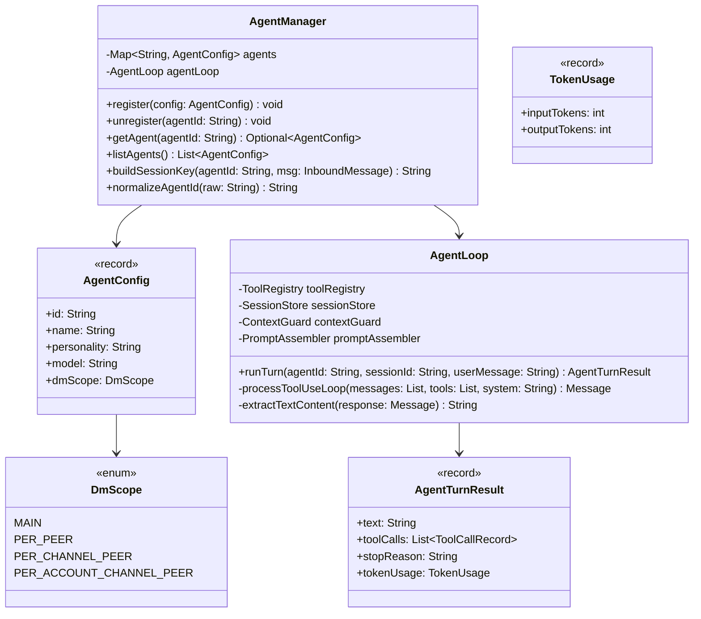
```mermaid
classDiagram
    class AgentLoop {
        -ToolRegistry toolRegistry
        -SessionStore sessionStore
        -ContextGuard contextGuard
        -PromptAssembler promptAssembler
        +runTurn(agentId: String, sessionId: String, userMessage: String) AgentTurnResult
        -processToolUseLoop(messages: List, tools: List, system: String) Message
        -extractTextContent(response: Message) String
    }

    class AgentConfig {
        <<record>>
        +id: String
        +name: String
        +personality: String
        +model: String
        +dmScope: DmScope
    }

    class DmScope {
        <<enum>>
        MAIN
        PER_PEER
        PER_CHANNEL_PEER
        PER_ACCOUNT_CHANNEL_PEER
    }

    class AgentManager {
        -Map~String, AgentConfig~ agents
        -AgentLoop agentLoop
        +register(config: AgentConfig) void
        +unregister(agentId: String) void
        +getAgent(agentId: String) Optional~AgentConfig~
        +listAgents() List~AgentConfig~
        +buildSessionKey(agentId: String, msg: InboundMessage) String
        +normalizeAgentId(raw: String) String
    }

    class AgentTurnResult {
        <<record>>
        +text: String
        +toolCalls: List~ToolCallRecord~
        +stopReason: String
        +tokenUsage: TokenUsage
    }

    class TokenUsage {
        <<record>>
        +inputTokens: int
        +outputTokens: int
    }

    AgentConfig --> DmScope
    AgentManager --> AgentConfig
    AgentManager --> AgentLoop
    AgentLoop --> AgentTurnResult
```

### 1.2 关键接口

```java
/**
 * Agent 对话循环 — 系统核心
 * 每次调用 runTurn() 代表一个完整的用户-助手对话回合。
 * 内含工具使用的内层循环：当 stop_reason == "tool_use" 时持续处理。
 *
 * 注意: Anthropic Java SDK (v2.20.0) 底层使用 OkHttp。
 * 客户端通过 AnthropicOkHttpClient 构建：
 *   AnthropicClient client = AnthropicOkHttpClient.builder()
 *       .apiKey(apiKey)
 *       .build();
 * 或通过环境变量自动配置：
 *   AnthropicClient client = AnthropicOkHttpClient.fromEnv();
 */
@Service
public class AgentLoop {

    /**
     * 执行一个对话回合
     * @param agentId   Agent 标识
     * @param sessionId 会话 ID
     * @param userMessage 用户输入
     * @return 包含助手回复文本、工具调用记录、Token 用量的结果
     */
    public AgentTurnResult runTurn(String agentId, String sessionId, String userMessage);
}
```

```java
/**
 * Agent 配置 — 定义一个 Agent 的身份与行为参数
 */
public record AgentConfig(
    String id,                  // 标识符，[a-z0-9][a-z0-9_-]{0,63}
    String name,                // 显示名
    String personality,         // 人格描述
    String model,               // 使用的模型 ID
    DmScope dmScope             // 会话隔离粒度
) {}
```

### 1.3 会话键构建规则

| DmScope | 会话键格式 | 示例 |
|---------|-----------|------|
| `MAIN` | `agent:{agentId}:main` | `agent:luna:main` |
| `PER_PEER` | `agent:{agentId}:peer:{peerId}` | `agent:luna:peer:12345` |
| `PER_CHANNEL_PEER` | `agent:{agentId}:{channel}:{peerId}` | `agent:luna:telegram:12345` |
| `PER_ACCOUNT_CHANNEL_PEER` | `agent:{agentId}:{accountId}:{channel}:{peerId}` | `agent:luna:bot1:telegram:12345` |

---

## 2. tool 模块

> 对应 claw0: S02 Tool Use

### 2.1 类图

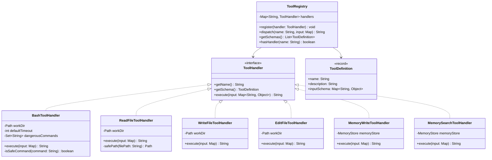
```mermaid
classDiagram
    class ToolHandler {
        <<interface>>
        +getName() String
        +getSchema() ToolDefinition
        +execute(input: Map~String, Object~) String
    }

    class ToolRegistry {
        -Map~String, ToolHandler~ handlers
        +register(handler: ToolHandler) void
        +dispatch(name: String, input: Map) String
        +getSchemas() List~ToolDefinition~
        +hasHandler(name: String) boolean
    }

    class ToolDefinition {
        <<record>>
        +name: String
        +description: String
        +inputSchema: Map~String, Object~
    }

    class BashToolHandler {
        -Path workDir
        -int defaultTimeout
        -Set~String~ dangerousCommands
        +execute(input: Map) String
        -isSafeCommand(command: String) boolean
    }

    class ReadFileToolHandler {
        -Path workDir
        +execute(input: Map) String
        -safePath(filePath: String) Path
    }

    class WriteFileToolHandler {
        -Path workDir
        +execute(input: Map) String
    }

    class EditFileToolHandler {
        -Path workDir
        +execute(input: Map) String
    }

    class MemoryWriteToolHandler {
        -MemoryStore memoryStore
        +execute(input: Map) String
    }

    class MemorySearchToolHandler {
        -MemoryStore memoryStore
        +execute(input: Map) String
    }

    ToolHandler <|.. BashToolHandler
    ToolHandler <|.. ReadFileToolHandler
    ToolHandler <|.. WriteFileToolHandler
    ToolHandler <|.. EditFileToolHandler
    ToolHandler <|.. MemoryWriteToolHandler
    ToolHandler <|.. MemorySearchToolHandler
    ToolRegistry --> ToolHandler
    ToolRegistry --> ToolDefinition
```

### 2.2 关键接口

```java
/**
 * 工具处理器接口 — 所有工具实现此接口
 * 实现类标注 @Component 后，通过 Spring 自动注入注册到 ToolRegistry：
 *
 *   @Service
 *   public class ToolRegistry {
 *       public ToolRegistry(List<ToolHandler> handlers) {
 *           handlers.forEach(h -> this.handlers.put(h.getName(), h));
 *       }
 *   }
 */
public interface ToolHandler {
    /** 工具名称，与 Claude API 的 tool_name 对应 */
    String getName();

    /** JSON Schema 定义，发送给 Claude 用于理解工具参数 */
    ToolDefinition getSchema();

    /**
     * 执行工具
     * @param input Claude 提供的参数 Map
     * @return 工具执行结果文本（将作为 tool_result 返回给 Claude）
     */
    String execute(Map<String, Object> input);
}
```

### 2.3 安全措施

| 安全层 | 实现 | 说明 |
|--------|------|------|
| **路径穿越防护** | `safePath()` 方法 | 确保所有文件操作在 `WORKDIR` 内，调用 `Path.normalize()` 并验证前缀 |
| **危险命令黑名单** | `Set<Pattern>` | 拒绝 `rm -rf /`, `mkfs`, `> /dev/sd`, `dd if=` 等 |
| **输出截断** | `MAX_TOOL_OUTPUT = 50,000` | 超长输出自动截断，附带提示 |
| **子进程超时** | `ProcessBuilder` + `waitFor(timeout)` | 默认 30 秒 |

---

## 3. session 模块

> 对应 claw0: S03 Sessions & Context Guard

### 3.1 类图

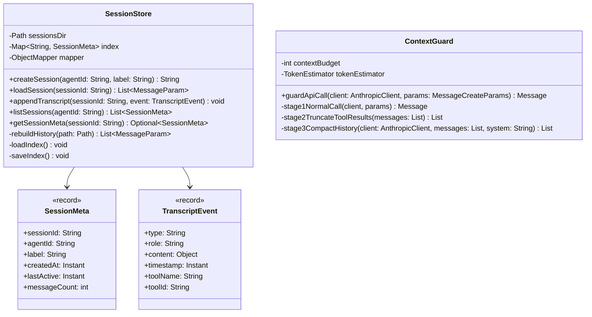
```mermaid
classDiagram
    class SessionStore {
        -Path sessionsDir
        -Map~String, SessionMeta~ index
        -ObjectMapper mapper
        +createSession(agentId: String, label: String) String
        +loadSession(sessionId: String) List~MessageParam~
        +appendTranscript(sessionId: String, event: TranscriptEvent) void
        +listSessions(agentId: String) List~SessionMeta~
        +getSessionMeta(sessionId: String) Optional~SessionMeta~
        -rebuildHistory(path: Path) List~MessageParam~
        -loadIndex() void
        -saveIndex() void
    }

    class SessionMeta {
        <<record>>
        +sessionId: String
        +agentId: String
        +label: String
        +createdAt: Instant
        +lastActive: Instant
        +messageCount: int
    }

    class TranscriptEvent {
        <<record>>
        +type: String
        +role: String
        +content: Object
        +timestamp: Instant
        +toolName: String
        +toolId: String
    }

    class ContextGuard {
        -int contextBudget
        -TokenEstimator tokenEstimator
        +guardApiCall(client: AnthropicClient, params: MessageCreateParams) Message
        -stage1NormalCall(client, params) Message
        -stage2TruncateToolResults(messages: List) List
        -stage3CompactHistory(client: AnthropicClient, messages: List, system: String) List
    }

    SessionStore --> SessionMeta
    SessionStore --> TranscriptEvent
```

> **并发安全**: 多个 Lane（main、cron、heartbeat）可能同时操作同一 Agent 的会话。`SessionStore` 使用 Agent 级别的 `ReentrantLock`（`ConcurrentHashMap<String, ReentrantLock>`）保护写操作，确保同一 Agent 的 JSONL 追加写入是串行化的。

### 3.2 JSONL 事件格式

每个会话文件 (`{sessionId}.jsonl`) 包含以下事件类型：

```json
// 用户消息
{"type":"user","content":"你好","ts":"2026-04-05T10:00:00Z"}

// 助手文本回复
{"type":"assistant","content":[{"type":"text","text":"你好！"}],"ts":"..."}

// 工具调用
{"type":"tool_use","tool_name":"bash","tool_id":"toolu_123","input":{"command":"ls"},"ts":"..."}

// 工具结果
{"type":"tool_result","tool_id":"toolu_123","content":"file1.txt\nfile2.txt","ts":"..."}
```

### 3.3 ContextGuard 三阶段策略

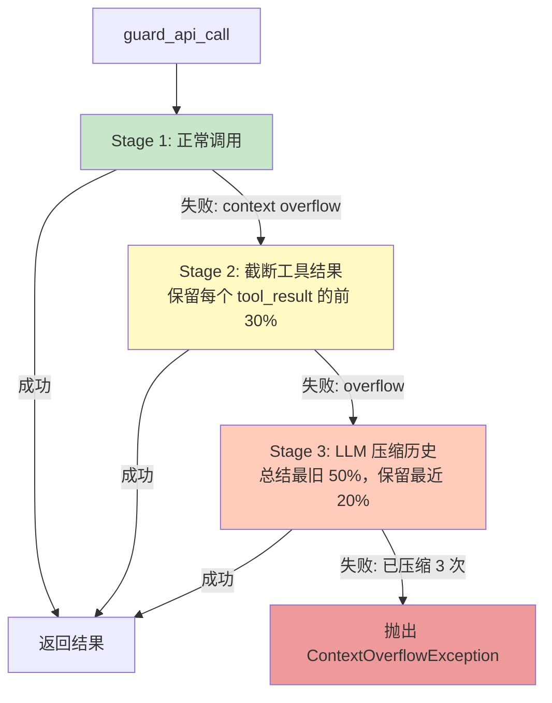
```mermaid
flowchart TB
    START[guard_api_call] --> S1["Stage 1: 正常调用"]
    S1 -->|成功| OK[返回结果]
    S1 -->|"失败: context overflow"| S2["Stage 2: 截断工具结果\n保留每个 tool_result 的前 30%"]
    S2 -->|成功| OK
    S2 -->|"失败: overflow"| S3["Stage 3: LLM 压缩历史\n总结最旧 50%，保留最近 20%"]
    S3 -->|成功| OK
    S3 -->|"失败: 已压缩 3 次"| FAIL[抛出 ContextOverflowException]

    style S1 fill:#c8e6c9
    style S2 fill:#fff9c4
    style S3 fill:#ffccbc
    style FAIL fill:#ef9a9a
```

### 3.4 Token 估算

```java
/**
 * 启发式 Token 估算器
 * 规则: 1 token ≈ 4 字符 (英文)
 *       中文/日文字符按 1.5x 系数
 */
public class TokenEstimator {
    public int estimate(String text);
    public int estimateMessages(List<MessageParam> messages);
}
```

---

## 4. channel 模块

> 对应 claw0: S04 Channels

### 4.1 类图

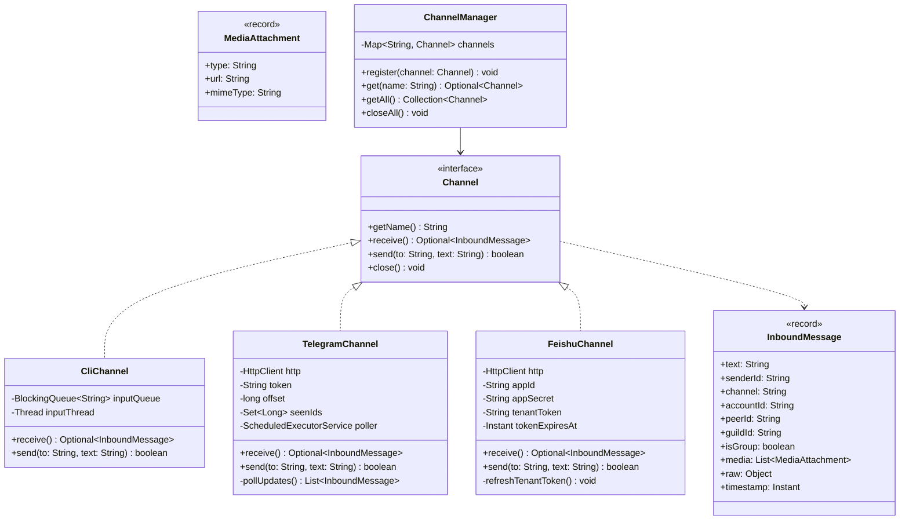
```mermaid
classDiagram
    class Channel {
        <<interface>>
        +getName() String
        +receive() Optional~InboundMessage~
        +send(to: String, text: String) boolean
        +close() void
    }

    class InboundMessage {
        <<record>>
        +text: String
        +senderId: String
        +channel: String
        +accountId: String
        +peerId: String
        +guildId: String
        +isGroup: boolean
        +media: List~MediaAttachment~
        +raw: Object
        +timestamp: Instant
    }

    class MediaAttachment {
        <<record>>
        +type: String
        +url: String
        +mimeType: String
    }

    class ChannelManager {
        -Map~String, Channel~ channels
        +register(channel: Channel) void
        +get(name: String) Optional~Channel~
        +getAll() Collection~Channel~
        +closeAll() void
    }

    class CliChannel {
        -BlockingQueue~String~ inputQueue
        -Thread inputThread
        +receive() Optional~InboundMessage~
        +send(to: String, text: String) boolean
    }

    class TelegramChannel {
        -HttpClient http
        -String token
        -long offset
        -Set~Long~ seenIds
        -ScheduledExecutorService poller
        +receive() Optional~InboundMessage~
        +send(to: String, text: String) boolean
        -pollUpdates() List~InboundMessage~
    }

    class FeishuChannel {
        -HttpClient http
        -String appId
        -String appSecret
        -String tenantToken
        -Instant tokenExpiresAt
        +receive() Optional~InboundMessage~
        +send(to: String, text: String) boolean
        -refreshTenantToken() void
    }

    Channel <|.. CliChannel
    Channel <|.. TelegramChannel
    Channel <|.. FeishuChannel
    ChannelManager --> Channel
    Channel ..> InboundMessage
```

### 4.2 渠道特性对比

| 特性 | CLI | Telegram | 飞书 |
|------|-----|----------|------|
| **消息接收** | `BlockingQueue` + 后台 stdin 线程 | HTTP 长轮询 (getUpdates) | Webhook 事件回调 |
| **去重** | 不需要 | `Set<Long>` 消息 ID 去重 (上限 5000) | 事件 ID 去重 |
| **消息分块** | 不限制 | 4,096 字符 / 消息 | 平台限制 |
| **媒体组缓冲** | — | 500ms 缓冲同组媒体 | — |
| **文本合并** | — | 1s 内连续消息合并 | — |
| **认证** | — | Bot Token | OAuth tenant_access_token (自动刷新) |
| **@检测** | — | — | Bot mention 检测 |
| **Spring 集成** | 无条件注册（始终可用） | `@ConditionalOnProperty(channels.telegram.enabled)` | `@ConditionalOnProperty(channels.feishu.enabled)` |

### 4.3 Telegram 长轮询实现

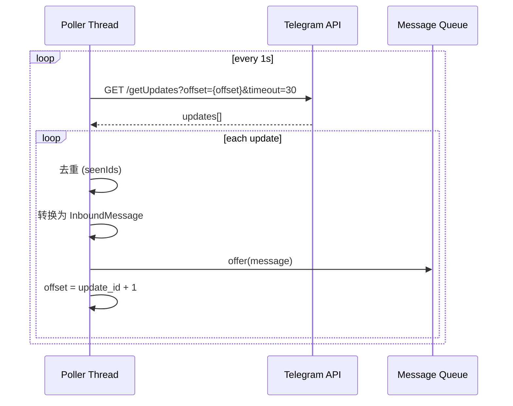
```mermaid
sequenceDiagram
    participant P as Poller Thread
    participant API as Telegram API
    participant Q as Message Queue

    loop every 1s
        P->>API: GET /getUpdates?offset={offset}&timeout=30
        API-->>P: updates[]
        loop each update
            P->>P: 去重 (seenIds)
            P->>P: 转换为 InboundMessage
            P->>Q: offer(message)
            P->>P: offset = update_id + 1
        end
    end
```

### 4.4 飞书 OAuth Token 刷新

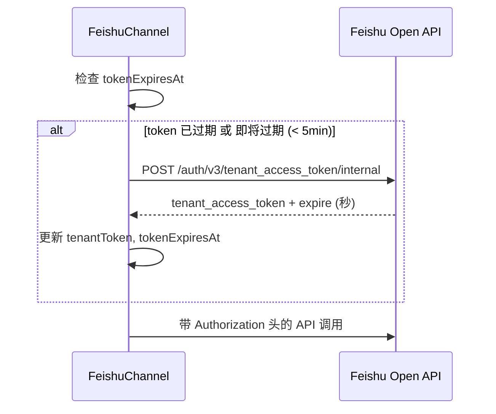
```mermaid
sequenceDiagram
    participant FC as FeishuChannel
    participant API as Feishu Open API

    FC->>FC: 检查 tokenExpiresAt
    alt token 已过期 或 即将过期 (< 5min)
        FC->>API: POST /auth/v3/tenant_access_token/internal
        API-->>FC: tenant_access_token + expire (秒)
        FC->>FC: 更新 tenantToken, tokenExpiresAt
    end
    FC->>API: 带 Authorization 头的 API 调用
```

---

## 5. gateway 模块

> 对应 claw0: S05 Gateway & Routing

### 5.1 类图

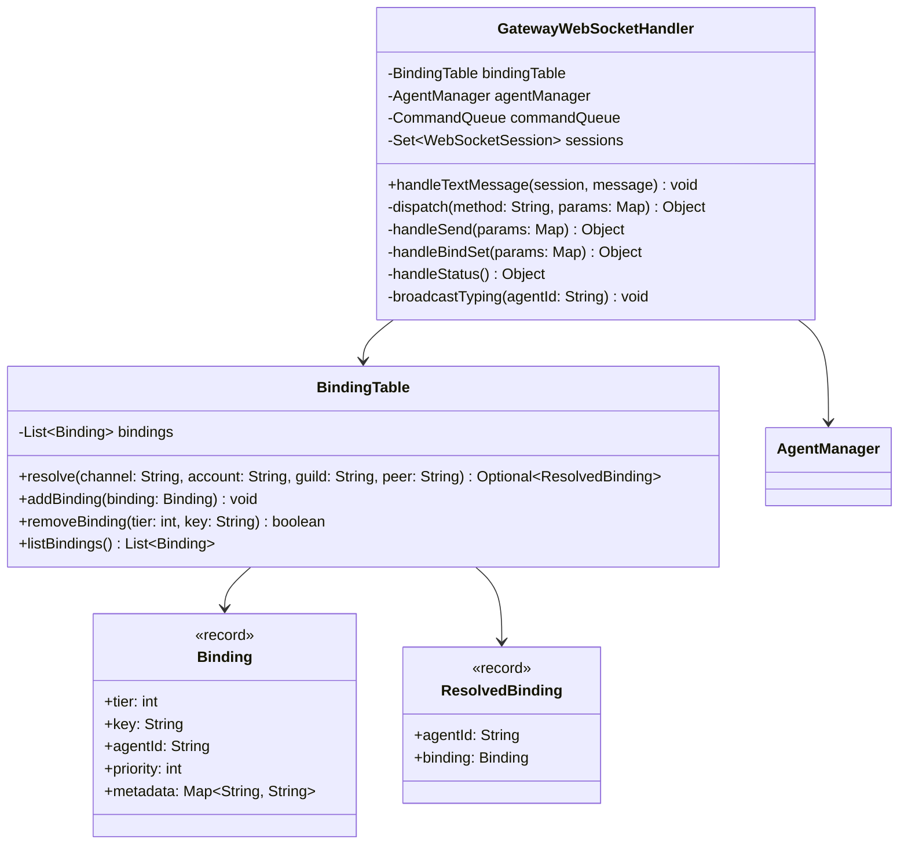
```mermaid
classDiagram
    class GatewayWebSocketHandler {
        -BindingTable bindingTable
        -AgentManager agentManager
        -CommandQueue commandQueue
        -Set~WebSocketSession~ sessions
        +handleTextMessage(session, message) void
        -dispatch(method: String, params: Map) Object
        -handleSend(params: Map) Object
        -handleBindSet(params: Map) Object
        -handleStatus() Object
        -broadcastTyping(agentId: String) void
    }

    class BindingTable {
        -List~Binding~ bindings
        +resolve(channel: String, account: String, guild: String, peer: String) Optional~ResolvedBinding~
        +addBinding(binding: Binding) void
        +removeBinding(tier: int, key: String) boolean
        +listBindings() List~Binding~
    }

    class Binding {
        <<record>>
        +tier: int
        +key: String
        +agentId: String
        +priority: int
        +metadata: Map~String, String~
    }

    class ResolvedBinding {
        <<record>>
        +agentId: String
        +binding: Binding
    }

    GatewayWebSocketHandler --> BindingTable
    GatewayWebSocketHandler --> AgentManager
    BindingTable --> Binding
    BindingTable --> ResolvedBinding
```

### 5.2 5 级绑定表

```mermaid
flowchart TB
    MSG["InboundMessage"] --> R{resolve()}
    R -->|"Tier 1: peer={peer_id}"| T1["精确用户 → Agent"]
    R -->|"Tier 2: guild={guild_id}"| T2["群组/服务器 → Agent"]
    R -->|"Tier 3: account={account_id}"| T3["Bot 账号 → Agent"]
    R -->|"Tier 4: channel={channel}"| T4["渠道类型 → Agent"]
    R -->|"Tier 5: default"| T5["全局兜底 → Agent"]

    T1 -->|"首个匹配"| RES[返回 agentId]
    T2 -->|"回退"| RES
    T3 -->|"回退"| RES
    T4 -->|"回退"| RES
    T5 -->|"回退"| RES
```

**排序规则**: `(tier ASC, priority DESC)` — 低 tier 优先，同 tier 内高 priority 优先。

### 5.3 JSON-RPC 2.0 协议

WebSocket 消息格式遵循 JSON-RPC 2.0：

```json
// 请求
{
    "jsonrpc": "2.0",
    "id": "req-001",
    "method": "send",
    "params": {
        "agent_id": "luna",
        "text": "Hello!",
        "channel": "telegram",
        "peer_id": "12345"
    }
}

// 响应 (成功)
{
    "jsonrpc": "2.0",
    "id": "req-001",
    "result": {"status": "ok", "text": "...assistant reply..."}
}

// 响应 (错误)
{
    "jsonrpc": "2.0",
    "id": "req-001",
    "error": {"code": -32601, "message": "Method not found"}
}
```

**支持的 method**：

| Method | 说明 | 参数 |
|--------|------|------|
| `send` | 发送消息给 Agent | `agent_id`, `text`, `channel`, `peer_id` |
| `bindings.set` | 设置路由规则 | `tier`, `key`, `agent_id`, `priority` |
| `bindings.list` | 列出所有绑定 | — |
| `bindings.remove` | 移除绑定 | `tier`, `key` |
| `sessions.list` | 列出会话 | `agent_id` |
| `agents.list` | 列出 Agent | — |
| `agents.register` | 注册 Agent | `AgentConfig` 字段 |
| `status` | 网关状态 | — |

### 5.4 GatewayController (REST API)

除 WebSocket 外，提供 REST 管理端点：

```
GET    /api/v1/agents              # 列出所有 Agent
POST   /api/v1/agents              # 注册 Agent
DELETE /api/v1/agents/{id}         # 注销 Agent
GET    /api/v1/bindings            # 列出路由规则
POST   /api/v1/bindings            # 添加路由规则
DELETE /api/v1/bindings/{tier}/{key}
GET    /api/v1/sessions?agent={id} # 列出会话
GET    /api/v1/status              # 网关状态
POST   /api/v1/send                # 发送消息 (同步)
```

---

## 6. intelligence 模块

> 对应 claw0: S06 Intelligence

### 6.1 类图

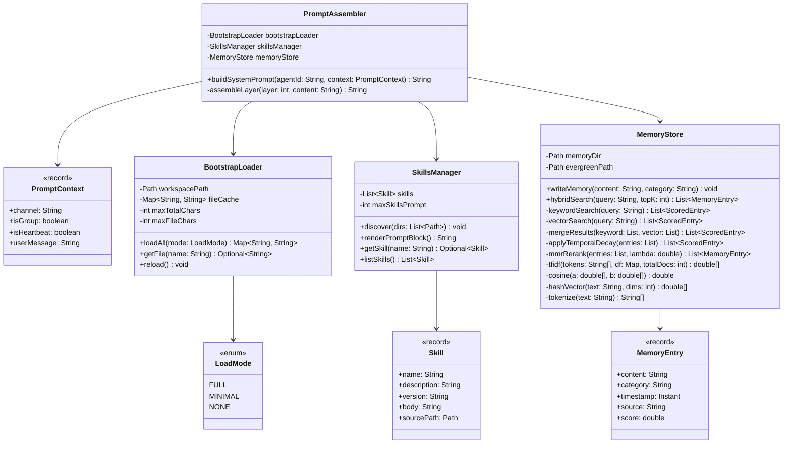
```mermaid
classDiagram
    class PromptAssembler {
        -BootstrapLoader bootstrapLoader
        -SkillsManager skillsManager
        -MemoryStore memoryStore
        +buildSystemPrompt(agentId: String, context: PromptContext) String
        -assembleLayer(layer: int, content: String) String
    }

    class PromptContext {
        <<record>>
        +channel: String
        +isGroup: boolean
        +isHeartbeat: boolean
        +userMessage: String
    }

    class BootstrapLoader {
        -Path workspacePath
        -Map~String, String~ fileCache
        -int maxTotalChars
        -int maxFileChars
        +loadAll(mode: LoadMode) Map~String, String~
        +getFile(name: String) Optional~String~
        +reload() void
    }

    class LoadMode {
        <<enum>>
        FULL
        MINIMAL
        NONE
    }

    class SkillsManager {
        -List~Skill~ skills
        -int maxSkillsPrompt
        +discover(dirs: List~Path~) void
        +renderPromptBlock() String
        +getSkill(name: String) Optional~Skill~
        +listSkills() List~Skill~
    }

    class Skill {
        <<record>>
        +name: String
        +description: String
        +version: String
        +body: String
        +sourcePath: Path
    }

    class MemoryStore {
        -Path memoryDir
        -Path evergreenPath
        +writeMemory(content: String, category: String) void
        +hybridSearch(query: String, topK: int) List~MemoryEntry~
        -keywordSearch(query: String) List~ScoredEntry~
        -vectorSearch(query: String) List~ScoredEntry~
        -mergeResults(keyword: List, vector: List) List~ScoredEntry~
        -applyTemporalDecay(entries: List) List~ScoredEntry~
        -mmrRerank(entries: List, lambda: double) List~MemoryEntry~
        -tfidf(tokens: String[], df: Map, totalDocs: int) double[]
        -cosine(a: double[], b: double[]) double
        -hashVector(text: String, dims: int) double[]
        -tokenize(text: String) String[]
    }

    class MemoryEntry {
        <<record>>
        +content: String
        +category: String
        +timestamp: Instant
        +source: String
        +score: double
    }

    PromptAssembler --> BootstrapLoader
    PromptAssembler --> SkillsManager
    PromptAssembler --> MemoryStore
    PromptAssembler --> PromptContext
    SkillsManager --> Skill
    MemoryStore --> MemoryEntry
    BootstrapLoader --> LoadMode
```

### 6.2 8 层系统提示词组装

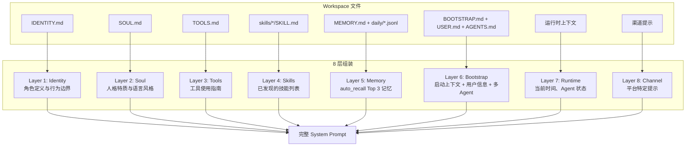
```mermaid
flowchart TB
    subgraph "Workspace 文件"
        F1["IDENTITY.md"]
        F2["SOUL.md"]
        F3["TOOLS.md"]
        F4["skills/*/SKILL.md"]
        F5["MEMORY.md + daily/*.jsonl"]
        F6["BOOTSTRAP.md + USER.md + AGENTS.md"]
        F7["运行时上下文"]
        F8["渠道提示"]
    end

    subgraph "8 层组装"
        L1["Layer 1: Identity\n角色定义与行为边界"]
        L2["Layer 2: Soul\n人格特质与语言风格"]
        L3["Layer 3: Tools\n工具使用指南"]
        L4["Layer 4: Skills\n已发现的技能列表"]
        L5["Layer 5: Memory\nauto_recall Top 3 记忆"]
        L6["Layer 6: Bootstrap\n启动上下文 + 用户信息 + 多Agent"]
        L7["Layer 7: Runtime\n当前时间、Agent 状态"]
        L8["Layer 8: Channel\n平台特定提示"]
    end

    F1 --> L1
    F2 --> L2
    F3 --> L3
    F4 --> L4
    F5 --> L5
    F6 --> L6
    F7 --> L7
    F8 --> L8

    L1 --> SP["完整 System Prompt"]
    L2 --> SP
    L3 --> SP
    L4 --> SP
    L5 --> SP
    L6 --> SP
    L7 --> SP
    L8 --> SP
```

### 6.3 混合记忆检索算法

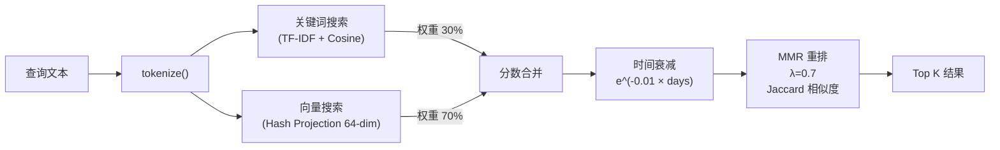
```mermaid
flowchart LR
    Q["查询文本"] --> TOK["tokenize()"]

    TOK --> KW["关键词搜索\n(TF-IDF + Cosine)"]
    TOK --> VS["向量搜索\n(Hash Projection 64-dim)"]

    KW -->|"权重 30%"| MG["分数合并"]
    VS -->|"权重 70%"| MG

    MG --> TD["时间衰减\ne^(-0.01 × days)"]
    TD --> MMR["MMR 重排\nλ=0.7\nJaccard 相似度"]
    MMR --> TOP["Top K 结果"]
```

**TF-IDF 实现要点**:
- **分词**: 按空格 + 标点分词，小写化，去除停用词
- **TF**: 词频 / 文档总词数
- **IDF**: log(总文档数 / (1 + 包含该词的文档数))
- **相似度**: 余弦相似度

**Hash Vector 实现要点**:
- 对每个 token 计算 `hashCode()`
- 用 hash 值做伪随机投影到 64 维空间
- 归一化为单位向量

### 6.4 技能发现路径（优先级递增）

```
1. workspace/skills/             (最低优先级)
2. workspace/.skills/
3. workspace/.agents/skills/
4. {cwd}/.agents/skills/
5. {cwd}/skills/                 (最高优先级，覆盖同名)
```

- **技能格式**: 包含 `SKILL.md` 的目录
- **SKILL.md 格式**: YAML frontmatter (`name`, `description`, `version`) + Markdown body
- **上限**: 150 个技能，总计 30,000 字符

---

## 7. scheduler 模块

> 对应 claw0: S07 Heartbeat & Cron

### 7.1 类图

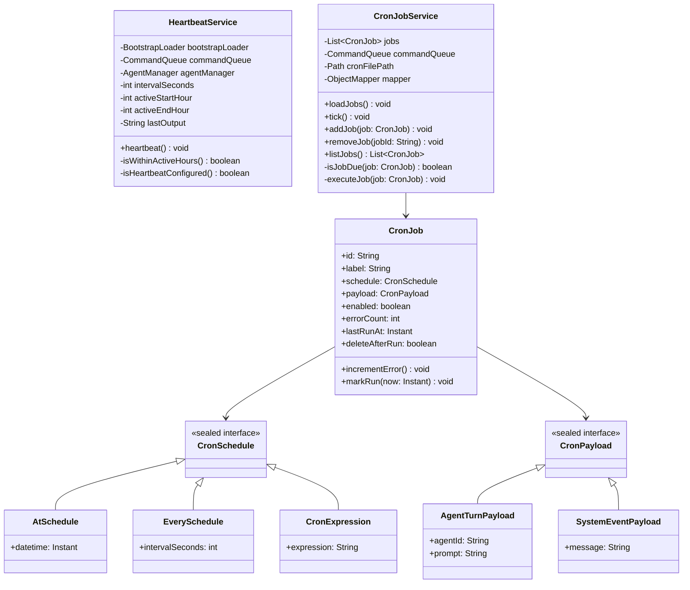
```mermaid
classDiagram
    class HeartbeatService {
        -BootstrapLoader bootstrapLoader
        -CommandQueue commandQueue
        -AgentManager agentManager
        -int intervalSeconds
        -int activeStartHour
        -int activeEndHour
        -String lastOutput
        +heartbeat() void
        -isWithinActiveHours() boolean
        -isHeartbeatConfigured() boolean
    }

    class CronJobService {
        -List~CronJob~ jobs
        -CommandQueue commandQueue
        -Path cronFilePath
        -ObjectMapper mapper
        +loadJobs() void
        +tick() void
        +addJob(job: CronJob) void
        +removeJob(jobId: String) void
        +listJobs() List~CronJob~
        -isJobDue(job: CronJob) boolean
        -executeJob(job: CronJob) void
    }

    class CronJob {
        +id: String
        +label: String
        +schedule: CronSchedule
        +payload: CronPayload
        +enabled: boolean
        +errorCount: int
        +lastRunAt: Instant
        +deleteAfterRun: boolean
        +incrementError() void
        +markRun(now: Instant) void
    }

    class CronSchedule {
        <<sealed interface>>
    }

    class AtSchedule {
        +datetime: Instant
    }

    class EverySchedule {
        +intervalSeconds: int
    }

    class CronExpression {
        +expression: String
    }

    class CronPayload {
        <<sealed interface>>
    }

    class AgentTurnPayload {
        +agentId: String
        +prompt: String
    }

    class SystemEventPayload {
        +message: String
    }

    CronSchedule <|-- AtSchedule
    CronSchedule <|-- EverySchedule
    CronSchedule <|-- CronExpression
    CronPayload <|-- AgentTurnPayload
    CronPayload <|-- SystemEventPayload
    CronJobService --> CronJob
    CronJob --> CronSchedule
    CronJob --> CronPayload
```

### 7.2 Spring 调度集成

```java
@Service
public class HeartbeatService {

    /**
     * Spring @Scheduled 驱动的心跳
     * 替代 claw0 中手写的 threading.Timer 循环
     */
    @Scheduled(fixedRateString = "${heartbeat.interval-seconds:1800}000")
    public void heartbeat() {
        // 4 个前置条件检查：
        // 1. HEARTBEAT.md 存在且非空
        // 2. 距上次心跳已过间隔
        // 3. 在活跃时段内
        // 4. heartbeat lane 未在执行中
        if (!isHeartbeatConfigured() || !isWithinActiveHours()) return;

        commandQueue.enqueue("heartbeat", () -> {
            // 执行心跳对话回合...
        });
    }
}
```

### 7.3 Cron 任务自动禁用

- 连续 5 次错误 (`CRON_AUTO_DISABLE_THRESHOLD = 5`) 自动禁用任务
- 运行日志写入 `workspace/cron/cron-runs.jsonl`
- 支持 `deleteAfterRun` 一次性任务

---

## 8. delivery 模块

> 对应 claw0: S08 Delivery

### 8.1 类图

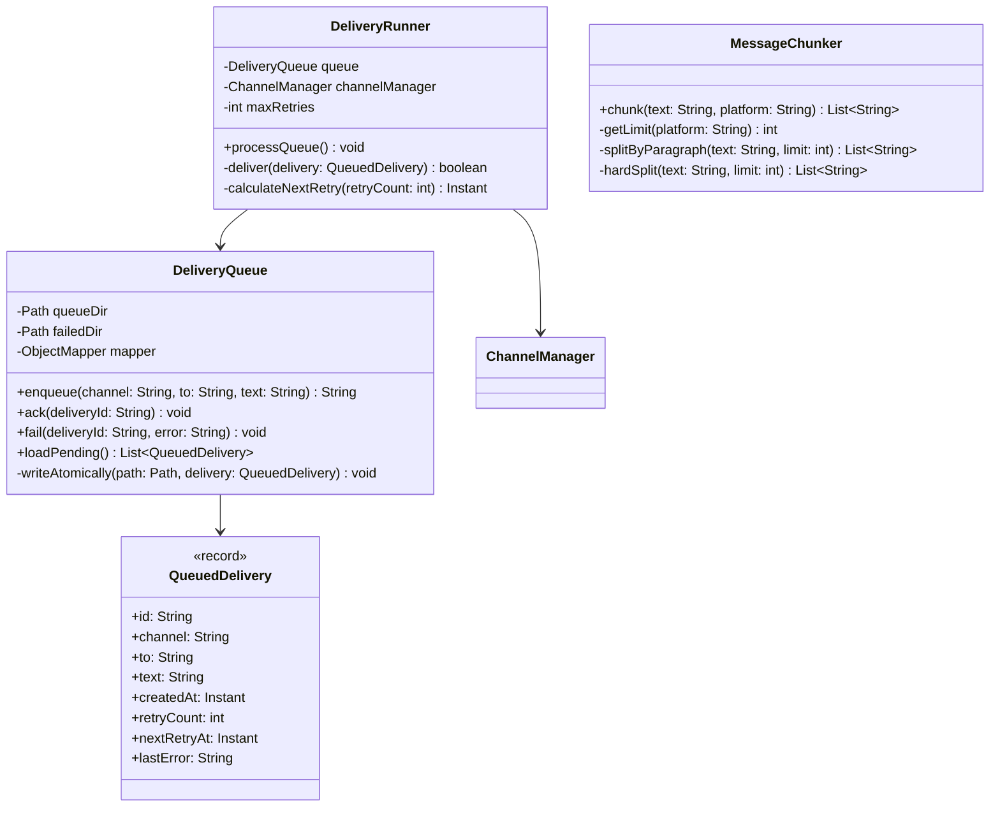
```mermaid
classDiagram
    class DeliveryQueue {
        -Path queueDir
        -Path failedDir
        -ObjectMapper mapper
        +enqueue(channel: String, to: String, text: String) String
        +ack(deliveryId: String) void
        +fail(deliveryId: String, error: String) void
        +loadPending() List~QueuedDelivery~
        -writeAtomically(path: Path, delivery: QueuedDelivery) void
    }

    class QueuedDelivery {
        <<record>>
        +id: String
        +channel: String
        +to: String
        +text: String
        +createdAt: Instant
        +retryCount: int
        +nextRetryAt: Instant
        +lastError: String
    }

    class DeliveryRunner {
        -DeliveryQueue queue
        -ChannelManager channelManager
        -int maxRetries
        +processQueue() void
        -deliver(delivery: QueuedDelivery) boolean
        -calculateNextRetry(retryCount: int) Instant
    }

    class MessageChunker {
        +chunk(text: String, platform: String) List~String~
        -getLimit(platform: String) int
        -splitByParagraph(text: String, limit: int) List~String~
        -hardSplit(text: String, limit: int) List~String~
    }

    DeliveryRunner --> DeliveryQueue
    DeliveryRunner --> ChannelManager
    DeliveryQueue --> QueuedDelivery
```

### 8.2 Write-Ahead 队列流程

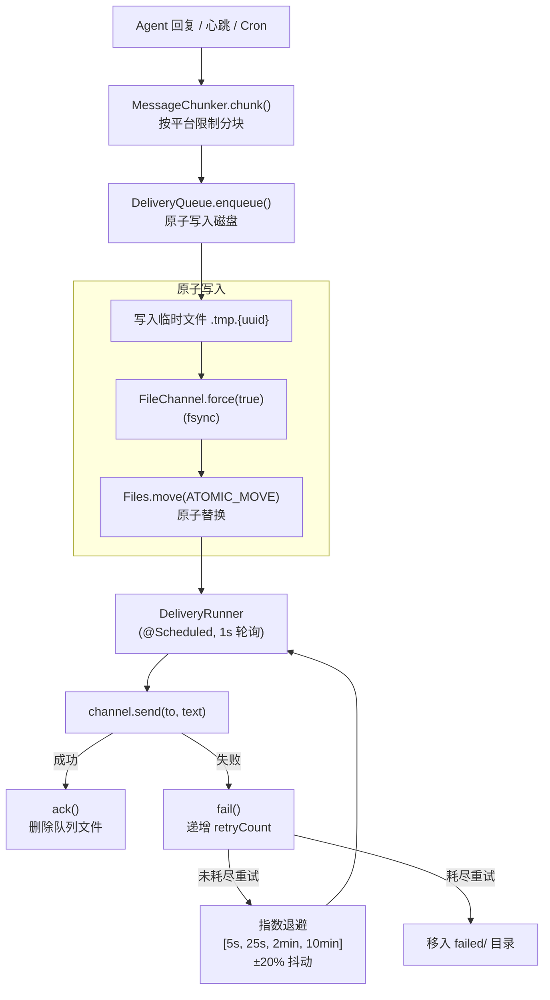
```mermaid
flowchart TB
    SRC["Agent 回复 / 心跳 / Cron"] --> CK["MessageChunker.chunk()\n按平台限制分块"]
    CK --> ENQ["DeliveryQueue.enqueue()\n原子写入磁盘"]

    subgraph "原子写入"
        W1["写入临时文件 .tmp.{uuid}"]
        W2["FileChannel.force(true)\n(fsync)"]
        W3["Files.move(ATOMIC_MOVE)\n原子替换"]
        W1 --> W2 --> W3
    end

    ENQ --> W1

    W3 --> DR["DeliveryRunner\n(@Scheduled, 1s 轮询)"]
    DR --> DEL["channel.send(to, text)"]

    DEL -->|成功| ACK["ack()\n删除队列文件"]
    DEL -->|失败| FAIL["fail()\n递增 retryCount"]
    FAIL -->|"未耗尽重试"| BACK["指数退避\n[5s, 25s, 2min, 10min]\n±20% 抖动"]
    FAIL -->|"耗尽重试"| DEAD["移入 failed/ 目录"]
    BACK --> DR
```

### 8.3 退避时间表

| 重试次数 | 基础延迟 | 计算公式 |
|---------|---------|---------|
| 1 | 5 秒 | `base × multiplier^0` |
| 2 | 25 秒 | `base × multiplier^1` |
| 3 | 2 分 5 秒 | `base × multiplier^2` |
| 4 | 10 分 25 秒 | `base × multiplier^3` |

每次延迟加入 ±20% 随机抖动：`delay × (1 + random(-0.2, 0.2))`

### 8.4 平台分块限制

| 平台 | 字符限制 |
|------|---------|
| Telegram 消息 | 4,096 |
| Telegram 图片说明 | 1,024 |
| Discord | 2,000 |
| WhatsApp | 4,096 |
| CLI | 无限制 |

---

## 9. resilience 模块

> 对应 claw0: S09 Resilience

### 9.1 类图

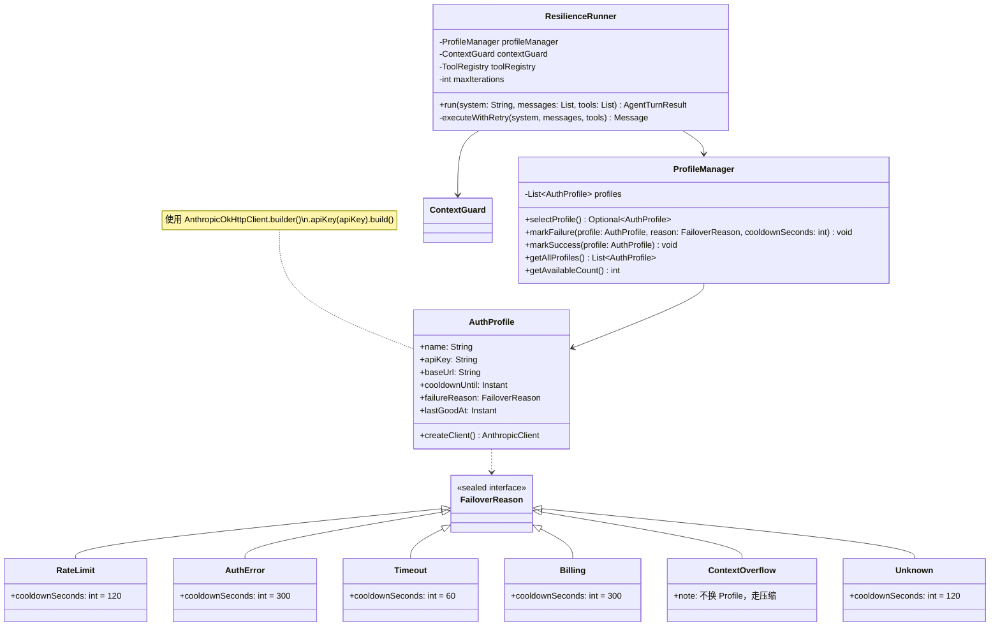
```mermaid
classDiagram
    class ResilienceRunner {
        -ProfileManager profileManager
        -ContextGuard contextGuard
        -ToolRegistry toolRegistry
        -int maxIterations
        +run(system: String, messages: List, tools: List) AgentTurnResult
        -executeWithRetry(system, messages, tools) Message
    }

    class ProfileManager {
        -List~AuthProfile~ profiles
        +selectProfile() Optional~AuthProfile~
        +markFailure(profile: AuthProfile, reason: FailoverReason, cooldownSeconds: int) void
        +markSuccess(profile: AuthProfile) void
        +getAllProfiles() List~AuthProfile~
        +getAvailableCount() int
    }

    class AuthProfile {
        +name: String
        +apiKey: String
        +baseUrl: String
        +cooldownUntil: Instant
        +failureReason: FailoverReason
        +lastGoodAt: Instant
        +createClient() AnthropicClient
    }

    note for AuthProfile "使用 AnthropicOkHttpClient.builder()\n.apiKey(apiKey).build()"

    class FailoverReason {
        <<sealed interface>>
    }
    class RateLimit {
        +cooldownSeconds: int = 120
    }
    class AuthError {
        +cooldownSeconds: int = 300
    }
    class Timeout {
        +cooldownSeconds: int = 60
    }
    class Billing {
        +cooldownSeconds: int = 300
    }
    class ContextOverflow {
        +note: 不换 Profile，走压缩
    }
    class Unknown {
        +cooldownSeconds: int = 120
    }

    FailoverReason <|-- RateLimit
    FailoverReason <|-- AuthError
    FailoverReason <|-- Timeout
    FailoverReason <|-- Billing
    FailoverReason <|-- ContextOverflow
    FailoverReason <|-- Unknown

    ResilienceRunner --> ProfileManager
    ResilienceRunner --> ContextGuard
    ProfileManager --> AuthProfile
    AuthProfile ..> FailoverReason
```

### 9.2 三层重试洋葱

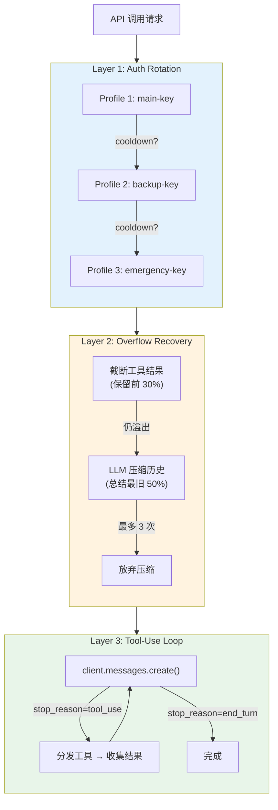
```mermaid
flowchart TB
    START["API 调用请求"] --> L1

    subgraph L1["Layer 1: Auth Rotation"]
        direction TB
        P1["Profile 1: main-key"]
        P2["Profile 2: backup-key"]
        P3["Profile 3: emergency-key"]
        P1 -->|"cooldown?"| P2
        P2 -->|"cooldown?"| P3
    end

    L1 --> L2

    subgraph L2["Layer 2: Overflow Recovery"]
        direction TB
        TR["截断工具结果\n(保留前 30%)"]
        CP["LLM 压缩历史\n(总结最旧 50%)"]
        TR -->|"仍溢出"| CP
        CP -->|"最多 3 次"| FAIL2["放弃压缩"]
    end

    L2 --> L3

    subgraph L3["Layer 3: Tool-Use Loop"]
        direction TB
        CALL["client.messages.create()"]
        CALL -->|"stop_reason=tool_use"| DISP["分发工具 → 收集结果"]
        DISP --> CALL
        CALL -->|"stop_reason=end_turn"| DONE["完成"]
    end

    style L1 fill:#e3f2fd
    style L2 fill:#fff3e0
    style L3 fill:#e8f5e9
```

### 9.3 失败分类逻辑

```java
/**
 * 根据异常类型和 HTTP 状态码分类失败原因
 */
public sealed interface FailoverReason {

    record RateLimit()       implements FailoverReason {}  // HTTP 429
    record AuthError()       implements FailoverReason {}  // HTTP 401/403
    record Timeout()         implements FailoverReason {}  // 请求超时
    record Billing()         implements FailoverReason {}  // 账单相关
    record ContextOverflow() implements FailoverReason {}  // 上下文溢出 (不换 Profile)
    record Unknown()         implements FailoverReason {}  // 其他

    static FailoverReason classify(Exception ex) {
        // 根据异常消息和 HTTP 状态码分类
        return switch (ex) {
            case RateLimitException _ -> new RateLimit();
            case AuthenticationException _ -> new AuthError();
            // ...
        };
    }
}
```

### 9.4 降级链

当所有 Profile 都在冷却中时，尝试降级模型链：

```
claude-sonnet-4-20250514 → claude-haiku-4-20250514
```

### 9.5 最大迭代次数计算

```java
int maxIterations = Math.min(
    Math.max(BASE_RETRY + PER_PROFILE * profileCount, 32),
    160
);
```

---

## 10. concurrency 模块

> 对应 claw0: S10 Concurrency

### 10.1 类图

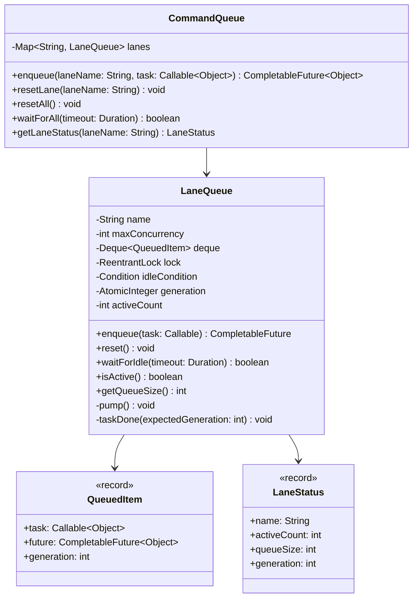
```mermaid
classDiagram
    class CommandQueue {
        -Map~String, LaneQueue~ lanes
        +enqueue(laneName: String, task: Callable~Object~) CompletableFuture~Object~
        +resetLane(laneName: String) void
        +resetAll() void
        +waitForAll(timeout: Duration) boolean
        +getLaneStatus(laneName: String) LaneStatus
    }

    class LaneQueue {
        -String name
        -int maxConcurrency
        -Deque~QueuedItem~ deque
        -ReentrantLock lock
        -Condition idleCondition
        -AtomicInteger generation
        -int activeCount
        +enqueue(task: Callable) CompletableFuture
        +reset() void
        +waitForIdle(timeout: Duration) boolean
        +isActive() boolean
        +getQueueSize() int
        -pump() void
        -taskDone(expectedGeneration: int) void
    }

    class QueuedItem {
        <<record>>
        +task: Callable~Object~
        +future: CompletableFuture~Object~
        +generation: int
    }

    class LaneStatus {
        <<record>>
        +name: String
        +activeCount: int
        +queueSize: int
        +generation: int
    }

    CommandQueue --> LaneQueue
    LaneQueue --> QueuedItem
    LaneQueue --> LaneStatus
```

### 10.2 LaneQueue 核心逻辑

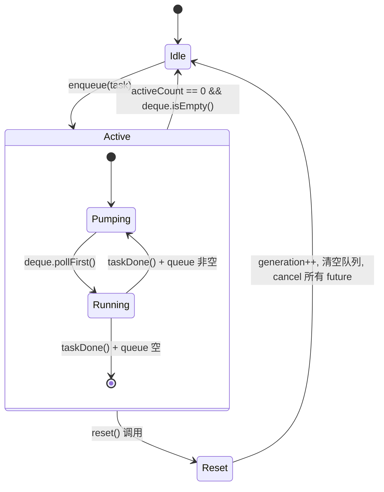
```mermaid
stateDiagram-v2
    [*] --> Idle
    Idle --> Active: enqueue(task)

    state Active {
        [*] --> Pumping
        Pumping --> Running: deque.pollFirst()
        Running --> Pumping: taskDone() + queue 非空
        Running --> [*]: taskDone() + queue 空
    }

    Active --> Idle: activeCount == 0 && deque.isEmpty()
    Active --> Reset: reset() 调用
    Reset --> Idle: generation++, 清空队列, cancel 所有 future
```

### 10.3 虚拟线程集成

```java
/**
 * LaneQueue 使用 Java 21 虚拟线程执行任务
 * 每个任务在独立的虚拟线程中运行，轻量且高效
 */
private void pump() {
    while (activeCount < maxConcurrency && !deque.isEmpty()) {
        QueuedItem item = deque.pollFirst();
        if (item.generation() != generation.get()) {
            item.future().cancel(false);  // 过期任务直接取消
            continue;
        }
        activeCount++;
        int gen = generation.get();
        Thread.ofVirtual()
              .name(name + "-worker-" + gen)
              .start(() -> {
                  try {
                      Object result = item.task().call();
                      item.future().complete(result);
                  } catch (Exception e) {
                      item.future().completeExceptionally(e);
                  } finally {
                      taskDone(gen);
                  }
              });
    }
}
```

### 10.4 用户对话完整流程

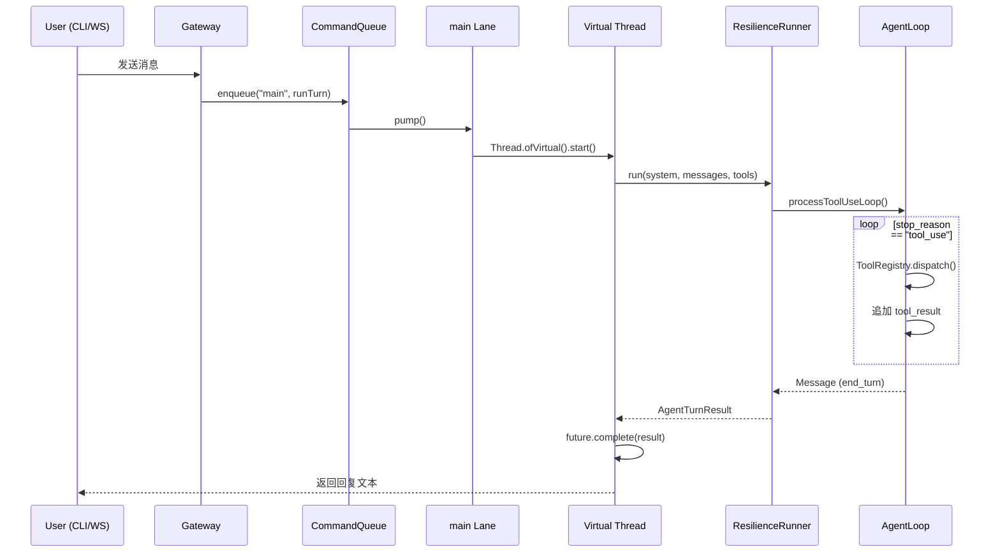
```mermaid
sequenceDiagram
    participant U as User (CLI/WS)
    participant GW as Gateway
    participant CQ as CommandQueue
    participant ML as main Lane
    participant VT as Virtual Thread
    participant RR as ResilienceRunner
    participant AL as AgentLoop

    U->>GW: 发送消息
    GW->>CQ: enqueue("main", runTurn)
    CQ->>ML: pump()
    ML->>VT: Thread.ofVirtual().start()
    VT->>RR: run(system, messages, tools)
    RR->>AL: processToolUseLoop()

    loop stop_reason == "tool_use"
        AL->>AL: ToolRegistry.dispatch()
        AL->>AL: 追加 tool_result
    end

    AL-->>RR: Message (end_turn)
    RR-->>VT: AgentTurnResult
    VT->>VT: future.complete(result)
    VT-->>U: 返回回复文本
```

---

## 11. config 模块

### 11.1 集中配置属性

```java
@ConfigurationProperties(prefix = "anthropic")
public record AnthropicProperties(
    String modelId,
    int maxTokens,
    List<ProfileConfig> profiles
) {
    public record ProfileConfig(
        String name,
        String apiKey,
        String baseUrl
    ) {}
}

@ConfigurationProperties(prefix = "gateway")
public record GatewayProperties(
    String defaultAgent,
    int maxConcurrentAgents
) {}

@ConfigurationProperties(prefix = "heartbeat")
public record HeartbeatProperties(
    int intervalSeconds,
    int activeStartHour,
    int activeEndHour
) {}

@ConfigurationProperties(prefix = "channels")
public record ChannelProperties(
    TelegramConfig telegram,
    FeishuConfig feishu
) {
    public record TelegramConfig(boolean enabled, String token) {}
    public record FeishuConfig(boolean enabled, String appId, String appSecret) {}
}

@ConfigurationProperties(prefix = "workspace")
public record WorkspaceProperties(
    String path,
    int contextBudget
) {}

@ConfigurationProperties(prefix = "delivery")
public record DeliveryProperties(
    int pollIntervalMs,
    int maxRetries,
    int backoffBaseSeconds,
    double backoffMultiplier,
    double jitterFactor
) {}
```

### 11.2 配置类

```java
@Configuration
@EnableScheduling
@EnableRetry
@EnableConfigurationProperties({
    AnthropicProperties.class,
    GatewayProperties.class,
    HeartbeatProperties.class,
    ChannelProperties.class,
    WorkspaceProperties.class,
    DeliveryProperties.class
})
public class AppConfig {
    // Bean 定义...
}
```

### 11.3 优雅关闭

```java
/**
 * 实现 SmartLifecycle，在 Spring 容器关闭时：
 * 1. 停止接收新的入站消息（关闭 Channel 轮询）
 * 2. 等待进行中的 Agent 对话回合完成（CommandQueue.waitForAll）
 * 3. 处理剩余的投递队列（DeliveryRunner flush）
 * 4. 关闭所有 Channel 连接
 */
@Component
public class GracefulShutdownManager implements SmartLifecycle {

    private final CommandQueue commandQueue;
    private final ChannelManager channelManager;
    private final DeliveryRunner deliveryRunner;

    @Override
    public void stop(Runnable callback) {
        channelManager.stopReceiving();
        commandQueue.waitForAll(Duration.ofSeconds(30));
        deliveryRunner.flush();
        channelManager.closeAll();
        callback.run();
    }
}
```

---

## 12. common 模块

### 12.1 JsonUtils

```java
/**
 * Jackson 工具类 — 统一 JSON 序列化/反序列化配置
 */
public class JsonUtils {
    private static final ObjectMapper MAPPER = new ObjectMapper()
        .registerModule(new JavaTimeModule())
        .disable(SerializationFeature.WRITE_DATES_AS_TIMESTAMPS)
        .setSerializationInclusion(Include.NON_NULL);

    public static String toJson(Object obj);
    public static <T> T fromJson(String json, Class<T> clazz);
    public static <T> T fromJson(String json, TypeReference<T> typeRef);
    public static void appendJsonl(Path file, Object obj);
    public static <T> List<T> readJsonl(Path file, Class<T> clazz);
}
```

### 12.2 FileUtils

```java
/**
 * 文件操作工具 — 原子写入、安全路径检查
 */
public class FileUtils {
    /** 原子写入：tmp + fsync + atomic move */
    public static void writeAtomically(Path target, String content);

    /** 追加写入一行 */
    public static void appendLine(Path file, String line);

    /** 路径安全检查 — 防止穿越 */
    public static Path safePath(Path base, String relative);
}
```

### 12.3 TokenEstimator

```java
/**
 * Token 估算器 — 用于 ContextGuard 的预估
 */
public class TokenEstimator {
    /** 估算单个文本的 token 数 */
    public int estimate(String text);

    /** 估算消息列表的总 token 数 */
    public int estimateMessages(List<MessageParam> messages);
}
```
