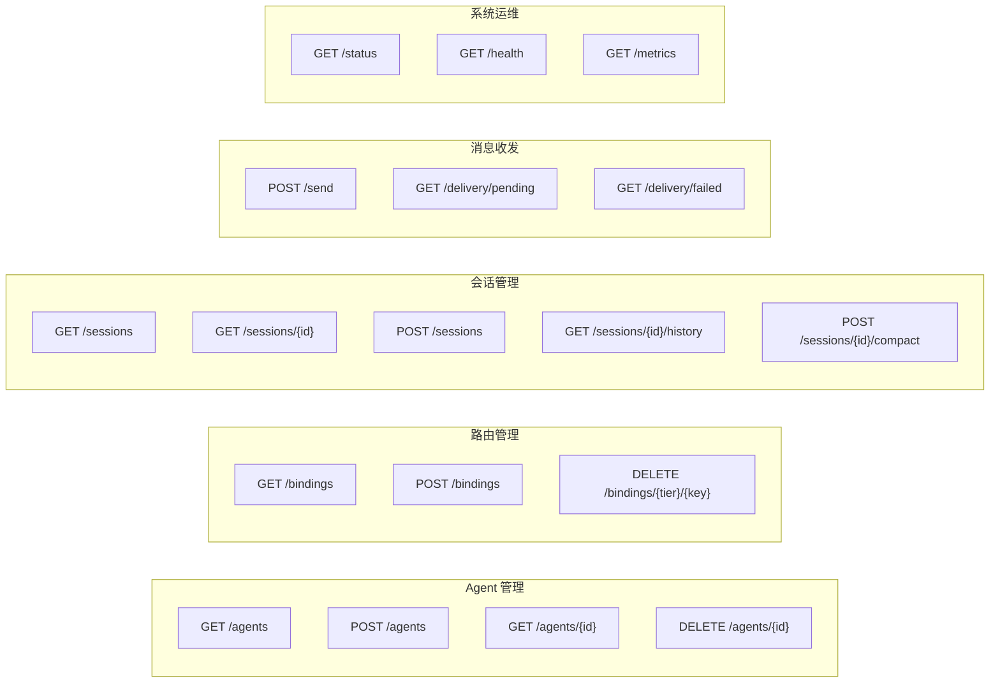
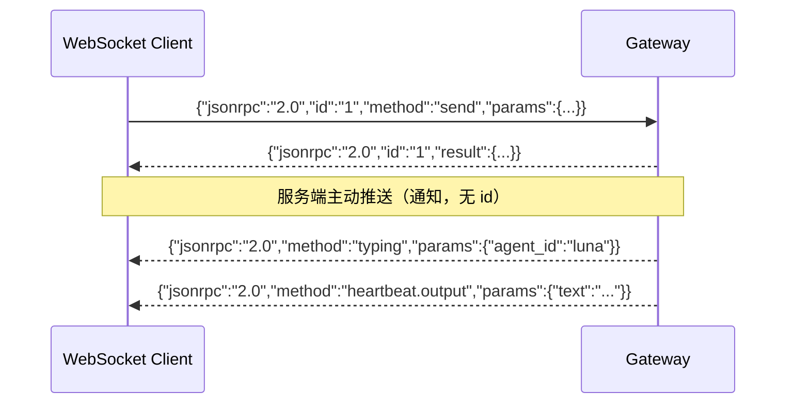
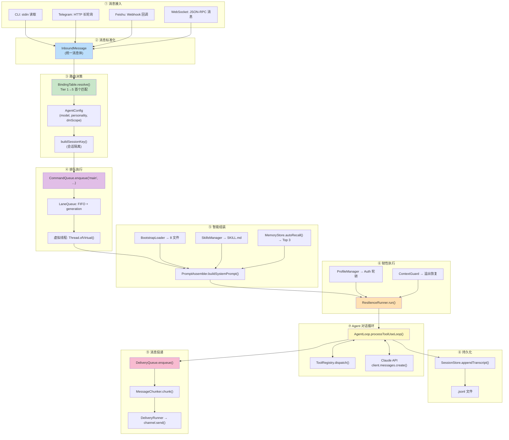
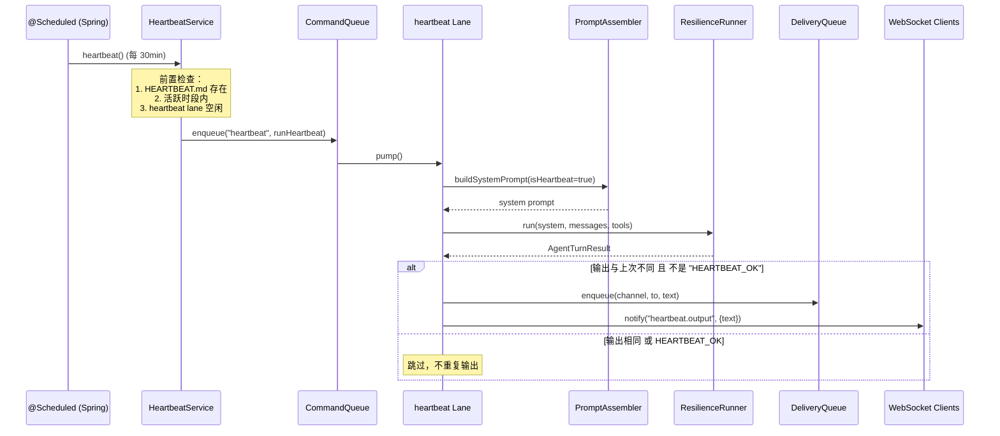
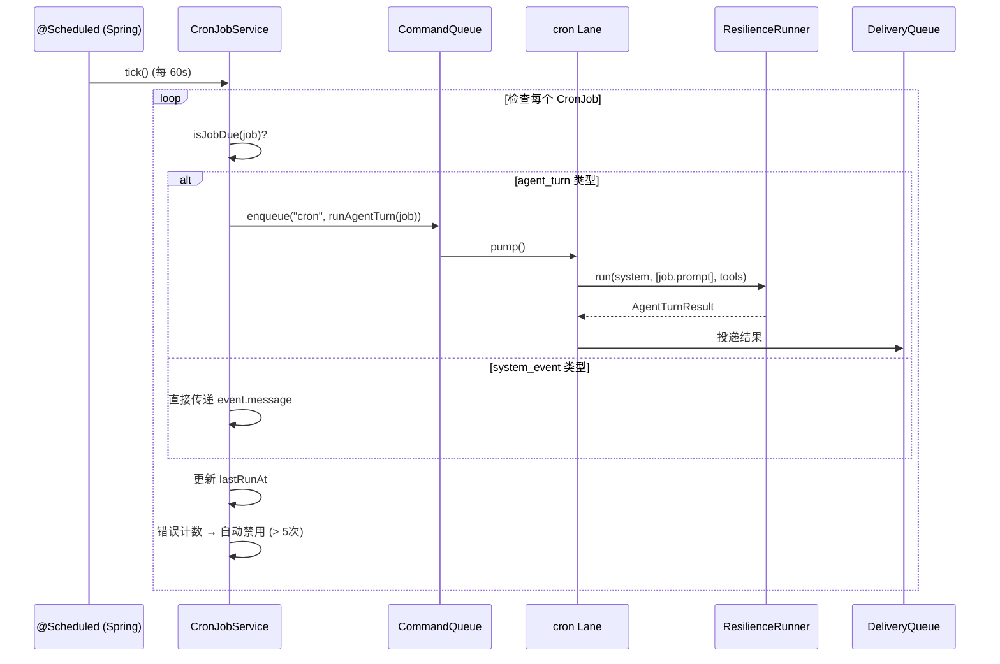
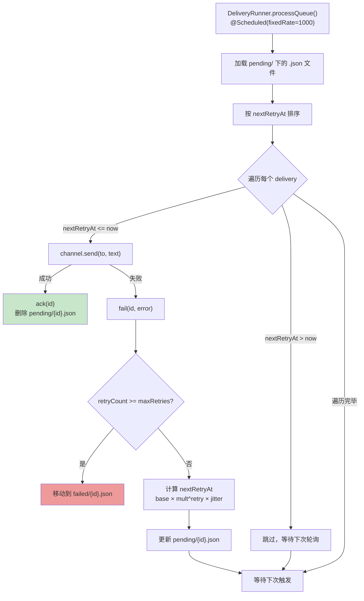
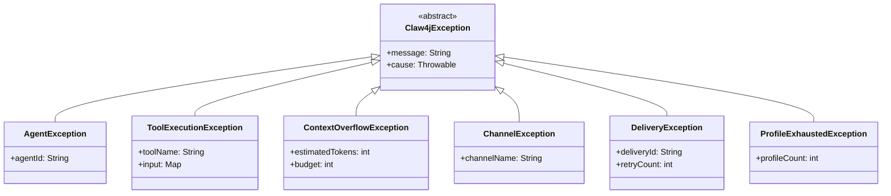
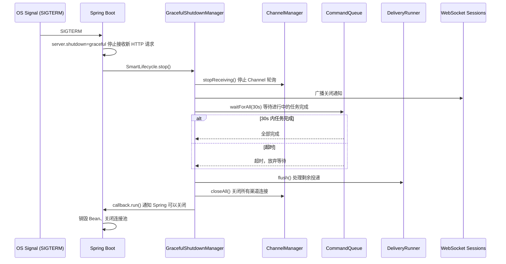

# enterprise-claw-4j API 设计与数据流

> 本文档定义系统的 REST API、WebSocket 协议、消息格式和端到端数据流

---

## 目录

1. [REST API 设计](#1-rest-api-设计)
2. [WebSocket 协议](#2-websocket-协议)
3. [端到端数据流](#3-端到端数据流)
4. [核心数据模型](#4-核心数据模型)
5. [错误处理规范](#5-错误处理规范)
6. [配置文件格式](#6-配置文件格式)
7. [Docker 部署](#7-docker-部署)
8. [优雅关闭流程](#8-优雅关闭流程)

---

## 1. REST API 设计

### 1.1 API 总览

基础路径: `/api/v1`



### 1.2 Agent 管理 API

#### `GET /api/v1/agents` — 列出所有 Agent

**响应示例**:
```json
{
    "agents": [
        {
            "id": "luna",
            "name": "Luna",
            "personality": "温暖、好奇、轻幽默",
            "model": "claude-sonnet-4-20250514",
            "dm_scope": "PER_PEER"
        },
        {
            "id": "sage",
            "name": "Sage",
            "personality": "直接、分析型",
            "model": "claude-sonnet-4-20250514",
            "dm_scope": "MAIN"
        }
    ]
}
```

#### `POST /api/v1/agents` — 注册 Agent

**请求**:
```json
{
    "id": "nova",
    "name": "Nova",
    "personality": "创意型、发散思维",
    "model": "claude-sonnet-4-20250514",
    "dm_scope": "PER_PEER"
}
```

**响应**: `201 Created`
```json
{
    "id": "nova",
    "status": "registered"
}
```

**验证规则**:
- `id`: 必填，匹配 `[a-z0-9][a-z0-9_-]{0,63}`
- `name`: 必填，1-128 字符
- `model`: 可选，默认取配置中的 `anthropic.model-id`
- `dm_scope`: 可选，默认 `PER_PEER`

#### `DELETE /api/v1/agents/{id}` — 注销 Agent

**响应**: `204 No Content`

---

### 1.3 路由管理 API

#### `GET /api/v1/bindings` — 列出所有路由规则

**响应**:
```json
{
    "bindings": [
        {"tier": 5, "key": "default", "agent_id": "luna", "priority": 0},
        {"tier": 4, "key": "telegram", "agent_id": "luna", "priority": 0},
        {"tier": 1, "key": "user_12345", "agent_id": "sage", "priority": 10}
    ]
}
```

#### `POST /api/v1/bindings` — 添加路由规则

**请求**:
```json
{
    "tier": 1,
    "key": "user_12345",
    "agent_id": "sage",
    "priority": 10
}
```

**Tier 定义**:

| Tier | 匹配维度 | Key 格式 |
|------|---------|---------|
| 1 | peer_id (精确用户) | 用户标识符 |
| 2 | guild_id (群组/服务器) | 群组标识符 |
| 3 | account_id (Bot 账号) | Bot 账号标识符 |
| 4 | channel (渠道类型) | `telegram` / `feishu` / `cli` |
| 5 | default (全局兜底) | `default` |

#### `DELETE /api/v1/bindings/{tier}/{key}` — 移除绑定

**响应**: `204 No Content`

---

### 1.4 会话管理 API

#### `GET /api/v1/sessions?agent_id={id}` — 列出会话

**响应**:
```json
{
    "sessions": [
        {
            "session_id": "sess_abc123",
            "agent_id": "luna",
            "label": "对话-20260405",
            "created_at": "2026-04-05T10:00:00Z",
            "last_active": "2026-04-05T14:30:00Z",
            "message_count": 42
        }
    ]
}
```

#### `POST /api/v1/sessions` — 创建新会话

**请求**:
```json
{
    "agent_id": "luna",
    "label": "新对话"
}
```

#### `GET /api/v1/sessions/{id}/history` — 获取会话历史

**查询参数**: `?limit=50&offset=0`

**响应**:
```json
{
    "session_id": "sess_abc123",
    "messages": [
        {"role": "user", "content": "你好"},
        {"role": "assistant", "content": [{"type": "text", "text": "你好！"}]}
    ],
    "total_count": 42
}
```

#### `POST /api/v1/sessions/{id}/compact` — 压缩会话历史

**响应**:
```json
{
    "session_id": "sess_abc123",
    "before_tokens": 150000,
    "after_tokens": 45000,
    "messages_compacted": 30
}
```

---

### 1.5 消息收发 API

#### `POST /api/v1/send` — 发送消息 (同步)

**请求**:
```json
{
    "agent_id": "luna",
    "text": "今天天气怎么样？",
    "channel": "api",
    "peer_id": "user_001",
    "session_id": "sess_abc123"
}
```

**响应**:
```json
{
    "text": "我没有实时获取天气的能力...",
    "stop_reason": "end_turn",
    "tool_calls": [
        {"name": "bash", "input": {"command": "curl wttr.in"}, "result": "..."}
    ],
    "token_usage": {
        "input_tokens": 1234,
        "output_tokens": 567
    },
    "session_id": "sess_abc123"
}
```

#### `GET /api/v1/delivery/pending` — 查看待投递消息

#### `GET /api/v1/delivery/failed` — 查看投递失败消息

---

### 1.6 系统运维 API

#### `GET /api/v1/status` — 网关状态

**响应**:
```json
{
    "status": "running",
    "uptime_seconds": 86400,
    "agents": {
        "count": 2,
        "list": ["luna", "sage"]
    },
    "channels": {
        "active": ["cli", "telegram"],
        "count": 2
    },
    "lanes": {
        "main": {"active": 0, "queued": 0, "generation": 1},
        "cron": {"active": 0, "queued": 0, "generation": 1},
        "heartbeat": {"active": 0, "queued": 0, "generation": 1}
    },
    "profiles": {
        "total": 2,
        "available": 2,
        "in_cooldown": 0
    },
    "delivery": {
        "pending": 0,
        "failed": 0
    }
}
```

#### Spring Actuator 端点

| 端点 | 用途 |
|------|------|
| `GET /actuator/health` | 健康检查 (K8s liveness/readiness) |
| `GET /actuator/info` | 应用信息 |
| `GET /actuator/metrics` | Micrometer 指标 |
| `GET /actuator/metrics/{name}` | 指定指标详情 |

---

## 2. WebSocket 协议

### 2.1 连接端点

```
ws://localhost:8080/ws/gateway
```

### 2.2 消息格式 (JSON-RPC 2.0)



### 2.3 支持的 Method

#### 客户端 → 服务端

| Method | 参数 | 说明 |
|--------|------|------|
| `send` | `{agent_id, text, channel?, peer_id?, session_id?}` | 发送消息给 Agent |
| `bindings.set` | `{tier, key, agent_id, priority?}` | 设置路由规则 |
| `bindings.list` | `{}` | 列出所有绑定 |
| `bindings.remove` | `{tier, key}` | 移除绑定 |
| `sessions.list` | `{agent_id?}` | 列出会话 |
| `agents.list` | `{}` | 列出 Agent |
| `agents.register` | `{AgentConfig 字段}` | 注册 Agent |
| `status` | `{}` | 获取网关状态 |

#### 服务端 → 客户端 (通知)

| Method | 参数 | 说明 |
|--------|------|------|
| `typing` | `{agent_id}` | Agent 正在处理 |
| `typing.stop` | `{agent_id}` | Agent 处理完成 |
| `heartbeat.output` | `{agent_id, text}` | 心跳输出 |
| `cron.output` | `{job_id, agent_id, text}` | Cron 任务输出 |
| `delivery.failed` | `{delivery_id, error}` | 投递失败通知 |

### 2.4 错误码

| Code | 含义 |
|------|------|
| -32700 | Parse error — 无效 JSON |
| -32600 | Invalid Request — 缺少必需字段 |
| -32601 | Method not found |
| -32602 | Invalid params |
| -32603 | Internal error |
| -32000 | Agent not found |
| -32001 | Session not found |
| -32002 | Agent busy (lane 满载) |

---

## 3. 端到端数据流

### 3.1 用户消息处理流程



### 3.2 心跳处理流程



### 3.3 Cron 任务处理流程



### 3.4 投递重试流程



---

## 4. 核心数据模型

### 4.1 消息格式

#### InboundMessage (入站消息)

```json
{
    "text": "Hello",
    "sender_id": "user_12345",
    "channel": "telegram",
    "account_id": "bot_001",
    "peer_id": "user_12345",
    "guild_id": null,
    "is_group": false,
    "media": [],
    "timestamp": "2026-04-05T10:00:00Z"
}
```

#### AgentTurnResult (对话回合结果)

```json
{
    "text": "这是助手的回复",
    "tool_calls": [
        {
            "name": "bash",
            "tool_id": "toolu_abc123",
            "input": {"command": "ls -la"},
            "result": "total 0\n..."
        }
    ],
    "stop_reason": "end_turn",
    "token_usage": {
        "input_tokens": 1500,
        "output_tokens": 300
    }
}
```

### 4.2 持久化格式

#### JSONL 会话事件

每个 `.jsonl` 文件中的一行：

```json
{"type":"user","content":"写一个 hello world","ts":"2026-04-05T10:00:00Z"}
{"type":"assistant","content":[{"type":"text","text":"好的，我来帮你写："}],"ts":"2026-04-05T10:00:01Z"}
{"type":"tool_use","tool_name":"write_file","tool_id":"toolu_001","input":{"file_path":"hello.py","content":"print('hello')"},"ts":"2026-04-05T10:00:01Z"}
{"type":"tool_result","tool_id":"toolu_001","content":"File written: hello.py","ts":"2026-04-05T10:00:02Z"}
{"type":"assistant","content":[{"type":"text","text":"已经创建了 hello.py 文件"}],"ts":"2026-04-05T10:00:03Z"}
```

#### 会话索引 (sessions.json)

```json
{
    "sess_abc123": {
        "session_id": "sess_abc123",
        "agent_id": "luna",
        "label": "对话-20260405",
        "created_at": "2026-04-05T10:00:00Z",
        "last_active": "2026-04-05T14:30:00Z",
        "message_count": 42
    }
}
```

#### 投递队列条目 (delivery-queue/pending/{id}.json)

```json
{
    "id": "del_xyz789",
    "channel": "telegram",
    "to": "12345",
    "text": "这是一条消息",
    "created_at": "2026-04-05T10:00:00Z",
    "retry_count": 0,
    "next_retry_at": "2026-04-05T10:00:00Z",
    "last_error": null
}
```

#### Cron 任务定义 (CRON.json)

```json
[
    {
        "id": "morning-briefing",
        "label": "Morning Briefing",
        "schedule": {"cron": "0 9 * * *"},
        "payload": {
            "type": "agent_turn",
            "agent_id": "luna",
            "prompt": "Check today's calendar and give a brief summary."
        },
        "enabled": true
    },
    {
        "id": "meeting-reminder",
        "label": "Meeting Reminder",
        "schedule": {"at": "2026-04-05T14:00:00+08:00"},
        "payload": {
            "type": "system_event",
            "message": "You have a meeting in 30 minutes."
        },
        "enabled": true,
        "delete_after_run": true
    },
    {
        "id": "health-check",
        "label": "Health Check",
        "schedule": {"every": 3600},
        "payload": {
            "type": "agent_turn",
            "agent_id": "luna",
            "prompt": "Run a quick system health check."
        },
        "enabled": true
    }
]
```

#### 记忆条目 (memory/daily/{date}.jsonl)

```json
{"content":"用户喜欢 Python","category":"preference","ts":"2026-04-05T10:00:00Z"}
{"content":"项目使用 Maven 构建","category":"project","ts":"2026-04-05T10:30:00Z"}
```

### 4.3 文件系统布局

```
workspace/
├── SOUL.md                         # 人格定义
├── IDENTITY.md                     # 角色与边界
├── TOOLS.md                        # 工具使用指南
├── USER.md                         # 用户上下文
├── MEMORY.md                       # 长期记忆 (Evergreen)
├── HEARTBEAT.md                    # 心跳检查指令
├── BOOTSTRAP.md                    # 启动上下文
├── AGENTS.md                       # 多 Agent 协调
├── CRON.json                       # 定时任务定义
│
├── skills/                         # 技能目录
│   └── example-skill/
│       └── SKILL.md
│
├── .sessions/                      # 会话持久化（自动管理）
│   └── agents/
│       └── {agent_id}/
│           ├── sessions.json       # 会话索引
│           └── sessions/
│               └── {session_id}.jsonl
│
├── memory/                         # 日志记忆（自动管理）
│   └── daily/
│       └── {date}.jsonl
│
├── delivery-queue/                 # 投递队列（自动管理）
│   ├── pending/
│   │   └── {delivery_id}.json
│   └── failed/
│       └── {delivery_id}.json
│
└── cron/                           # Cron 运行日志（自动管理）
    └── cron-runs.jsonl
```

---

## 5. 错误处理规范

### 5.1 异常层级



### 5.2 REST API 错误格式

```json
{
    "error": {
        "code": "AGENT_NOT_FOUND",
        "message": "Agent 'unknown' does not exist",
        "details": {
            "agent_id": "unknown",
            "available_agents": ["luna", "sage"]
        }
    },
    "timestamp": "2026-04-05T10:00:00Z",
    "path": "/api/v1/send"
}
```

### 5.3 错误码表

| HTTP 状态码 | 错误码 | 说明 |
|------------|--------|------|
| 400 | `INVALID_REQUEST` | 请求格式错误 |
| 400 | `INVALID_AGENT_ID` | Agent ID 格式不合法 |
| 404 | `AGENT_NOT_FOUND` | Agent 不存在 |
| 404 | `SESSION_NOT_FOUND` | 会话不存在 |
| 409 | `AGENT_ALREADY_EXISTS` | Agent ID 已被占用 |
| 429 | `AGENT_BUSY` | Agent 正在处理中（Lane 满载）|
| 500 | `INTERNAL_ERROR` | 内部错误 |
| 502 | `UPSTREAM_ERROR` | Claude API 调用失败 |
| 503 | `ALL_PROFILES_EXHAUSTED` | 所有 Auth Profile 均在冷却中 |

---

## 6. 配置文件格式

### 6.1 .env.example

```bash
# ===== 必需配置 =====
ANTHROPIC_API_KEY=sk-ant-xxx

# ===== 可选配置 =====
# 模型
MODEL_ID=claude-sonnet-4-20250514
MAX_TOKENS=8096

# 备用 API 密钥
ANTHROPIC_BACKUP_KEY=
ANTHROPIC_BASE_URL=
ANTHROPIC_BACKUP_BASE_URL=

# 工作区
WORKSPACE_PATH=./workspace
CONTEXT_BUDGET=180000

# 心跳
HEARTBEAT_INTERVAL=1800

# Telegram
TELEGRAM_ENABLED=false
TELEGRAM_BOT_TOKEN=

# 飞书
FEISHU_ENABLED=false
FEISHU_APP_ID=
FEISHU_APP_SECRET=

# 服务器
SERVER_PORT=8080
```

### 6.2 application.yml 完整配置

参见 [00-overview.md 第 7.2 节](./00-overview.md#72-spring-boot-配置文件)

### 6.3 logback-spring.xml 日志配置

```xml
<?xml version="1.0" encoding="UTF-8"?>
<configuration>
    <!-- 控制台输出 -->
    <appender name="CONSOLE" class="ch.qos.logback.core.ConsoleAppender">
        <encoder>
            <pattern>%d{HH:mm:ss.SSS} [%thread] %-5level %logger{36} - %msg%n</pattern>
        </encoder>
    </appender>

    <!-- JSON 文件输出 (生产环境) -->
    <springProfile name="prod">
        <appender name="FILE" class="ch.qos.logback.core.rolling.RollingFileAppender">
            <file>logs/claw4j.log</file>
            <rollingPolicy class="ch.qos.logback.core.rolling.TimeBasedRollingPolicy">
                <fileNamePattern>logs/claw4j.%d{yyyy-MM-dd}.log</fileNamePattern>
                <maxHistory>30</maxHistory>
            </rollingPolicy>
            <encoder class="net.logstash.logback.encoder.LogstashEncoder"/>
        </appender>
    </springProfile>

    <!-- 日志级别 -->
    <logger name="com.openclaw.enterprise" level="DEBUG"/>
    <logger name="com.openclaw.enterprise.agent" level="INFO"/>
    <logger name="com.openclaw.enterprise.resilience" level="DEBUG"/>

    <root level="INFO">
        <appender-ref ref="CONSOLE"/>
    </root>
</configuration>
```

### 6.4 Micrometer 自定义指标

| 指标名称 | 类型 | 标签 | 说明 |
|---------|------|------|------|
| `claw4j.agent.turns` | Counter | `agent_id`, `stop_reason` | Agent 对话回合数 |
| `claw4j.agent.turn.duration` | Timer | `agent_id` | 对话回合耗时 |
| `claw4j.tool.calls` | Counter | `tool_name`, `success` | 工具调用次数 |
| `claw4j.api.calls` | Counter | `profile`, `model`, `success` | Claude API 调用次数 |
| `claw4j.api.tokens.input` | Counter | `model` | 输入 Token 消耗 |
| `claw4j.api.tokens.output` | Counter | `model` | 输出 Token 消耗 |
| `claw4j.delivery.sent` | Counter | `channel`, `success` | 消息投递次数 |
| `claw4j.delivery.retry` | Counter | `channel` | 投递重试次数 |
| `claw4j.delivery.pending` | Gauge | — | 待投递消息数 |
| `claw4j.lane.active` | Gauge | `lane` | Lane 活跃任务数 |
| `claw4j.lane.queued` | Gauge | `lane` | Lane 排队任务数 |
| `claw4j.context.overflow` | Counter | `agent_id`, `stage` | 上下文溢出触发次数 |
| `claw4j.profile.failover` | Counter | `profile`, `reason` | Profile 故障转移次数 |

---

## 7. Docker 部署

### 7.1 Dockerfile（多阶段构建）

```dockerfile
# ===== 构建阶段 =====
FROM eclipse-temurin:21-jdk-alpine AS builder
WORKDIR /build
COPY pom.xml .
COPY src ./src
RUN apk add --no-cache maven && \
    mvn package -DskipTests -q

# ===== 运行阶段 =====
FROM eclipse-temurin:21-jre-alpine
WORKDIR /app

# 创建非 root 用户
RUN addgroup -S claw4j && adduser -S claw4j -G claw4j

COPY --from=builder /build/target/*.jar app.jar
COPY workspace/ /app/workspace/

# workspace 目录需要写权限（会话、投递队列、记忆等）
RUN chown -R claw4j:claw4j /app
USER claw4j

# 健康检查
HEALTHCHECK --interval=30s --timeout=5s --start-period=10s --retries=3 \
    CMD wget -qO- http://localhost:8080/actuator/health || exit 1

EXPOSE 8080
ENTRYPOINT ["java", "-jar", "app.jar"]
```

### 7.2 docker-compose.yml 示例

```yaml
version: "3.9"
services:
  claw4j:
    build: .
    ports:
      - "8080:8080"
    volumes:
      - ./workspace:/app/workspace         # 外部挂载 workspace
      - claw4j-data:/app/workspace/.sessions  # 持久化会话数据
    env_file:
      - .env
    environment:
      - SPRING_PROFILES_ACTIVE=prod
    restart: unless-stopped

volumes:
  claw4j-data:
```

### 7.3 K8s 探针配置

```yaml
# 在 Deployment spec 中
livenessProbe:
  httpGet:
    path: /actuator/health/liveness
    port: 8080
  initialDelaySeconds: 15
  periodSeconds: 10

readinessProbe:
  httpGet:
    path: /actuator/health/readiness
    port: 8080
  initialDelaySeconds: 10
  periodSeconds: 5
```

对应 `application-prod.yml` 配置：

```yaml
management:
  endpoint:
    health:
      probes:
        enabled: true                  # 启用 liveness/readiness 分组
  health:
    livenessstate:
      enabled: true
    readinessstate:
      enabled: true
```

---

## 8. 优雅关闭流程



**关键保证**：
- 进行中的 Agent 对话回合会完成（最多等待 30 秒）
- 已入队但未发送的消息持久化在磁盘 WAL 中，重启后自动恢复
- WebSocket 客户端收到关闭通知，可以重连
