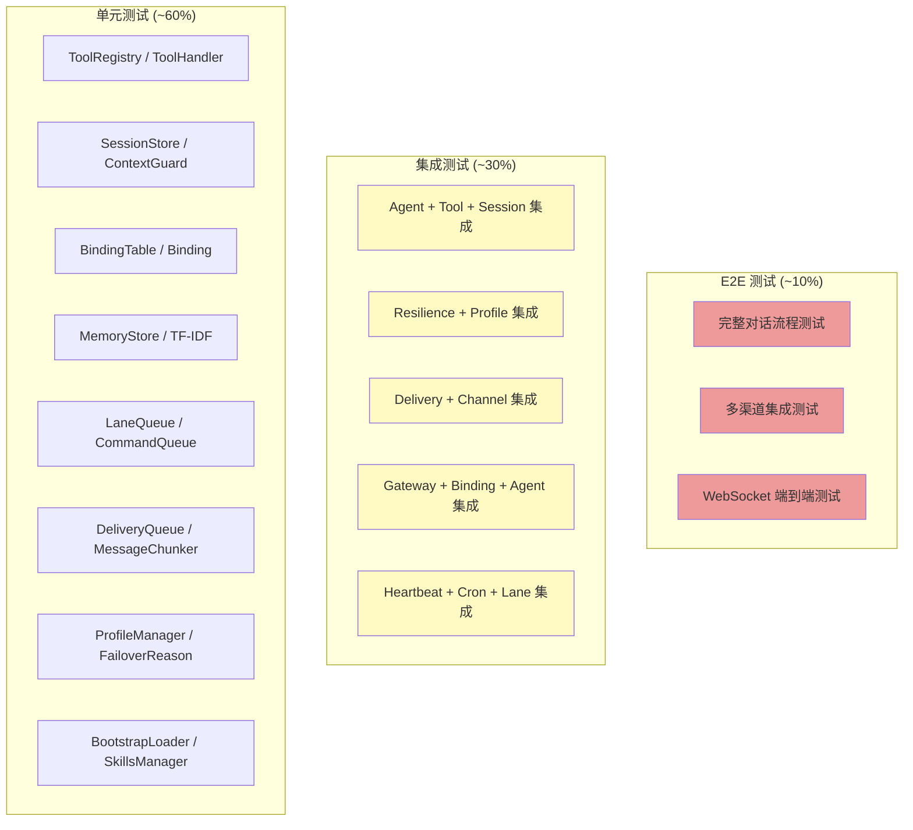
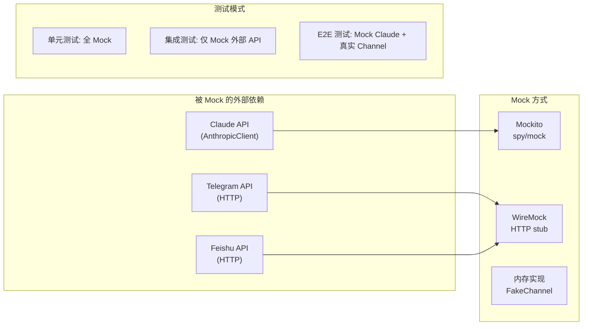
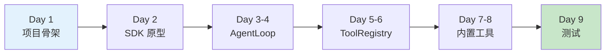
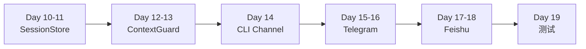
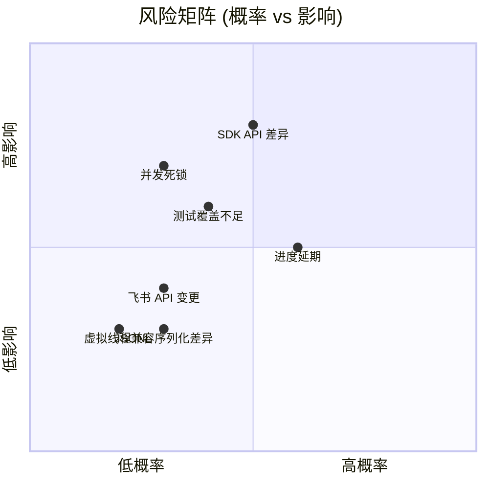
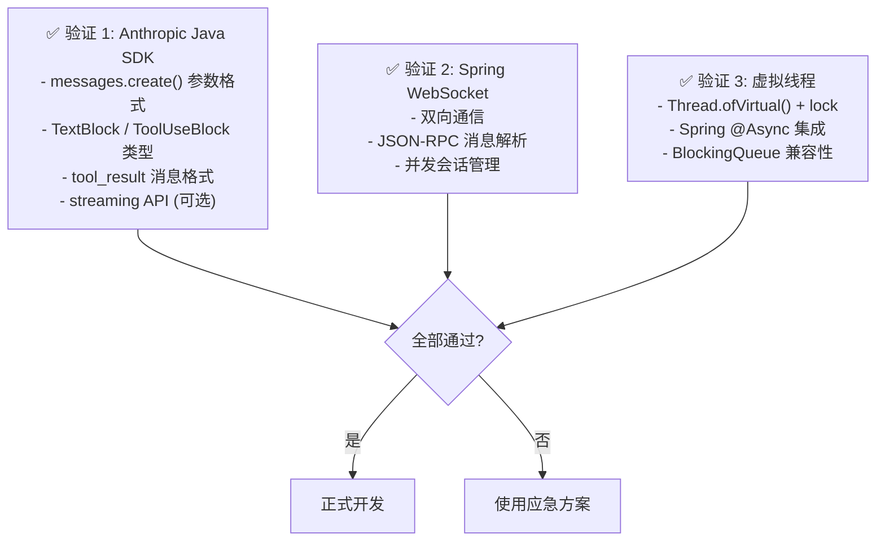
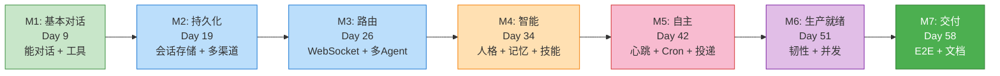

# enterprise-claw-4j 测试策略与实施路线图

> 本文档包含测试策略、实施时间线、Sprint 计划、风险评估和质量标准

---

## 目录

1. [测试策略](#1-测试策略)
2. [实施路线图](#2-实施路线图)
3. [Sprint 计划](#3-sprint-计划)
4. [风险评估与缓解](#4-风险评估与缓解)
5. [质量标准与验收条件](#5-质量标准与验收条件)
6. [里程碑检查点](#6-里程碑检查点)

---

## 1. 测试策略

### 1.1 测试金字塔



### 1.2 模块测试计划

| 模块 | 单元测试 | 集成测试 | 关键测试场景 |
|------|---------|---------|------------|
| **tool** | `ToolRegistryTest` | — | 工具注册/分发、未知工具处理、路径穿越防护、危险命令拦截、输出截断 |
| **session** | `SessionStoreTest`, `ContextGuardTest` | `SessionIntegrationTest` | JSONL 读写、历史重建、三阶段溢出恢复、Token 估算 |
| **channel** | `CliChannelTest` | `TelegramChannelTest` | 消息收发、去重、缓冲合并、Token 刷新 |
| **gateway** | `BindingTableTest` | `GatewayIntegrationTest` | 5 级路由匹配、优先级排序、JSON-RPC 协议、WebSocket 会话管理 |
| **intelligence** | `BootstrapLoaderTest`, `SkillsManagerTest`, `MemoryStoreTest` | — | 文件加载截断、技能发现与覆盖、TF-IDF 搜索、向量检索、MMR 重排 |
| **scheduler** | `CronJobServiceTest` | `HeartbeatIntegrationTest` | Cron 表达式解析、到期判断、自动禁用、心跳前置检查 |
| **delivery** | `DeliveryQueueTest`, `MessageChunkerTest` | `DeliveryIntegrationTest` | 原子写入、退避计算、消息分块、失败移入 failed/ |
| **resilience** | `ProfileManagerTest` | `ResilienceIntegrationTest` | Profile 轮转、冷却计时、失败分类、降级链 |
| **concurrency** | `LaneQueueTest`, `CommandQueueTest` | `ConcurrencyIntegrationTest` | FIFO 保证、Generation 追踪、重置安全、Future 传递 |

### 1.3 测试工具与框架

| 工具 | 用途 |
|------|------|
| **JUnit 5** | 测试框架 |
| **Mockito** | Mock 外部依赖 (Claude API, HTTP 客户端) |
| **Spring Boot Test** | `@SpringBootTest` 集成测试 |
| **Awaitility** | 异步操作断言（等待 Future、轮询结果） |
| **WireMock** | Mock HTTP 端点 (Telegram API, 飞书 API) |
| **Testcontainers** | 可选，未来扩展数据库测试 |

### 1.4 Mock 策略



### 1.5 关键测试场景详解

#### 并发测试 (LaneQueue)

```java
@Test
void shouldExecuteTasksInFIFOOrder() {
    // Given: max_concurrency = 1
    LaneQueue lane = new LaneQueue("test", 1);
    List<Integer> executionOrder = Collections.synchronizedList(new ArrayList<>());

    // When: 快速入队 5 个任务
    List<CompletableFuture<Object>> futures = IntStream.range(0, 5)
        .mapToObj(i -> lane.enqueue(() -> {
            executionOrder.add(i);
            Thread.sleep(10);
            return i;
        }))
        .toList();

    // Then: 所有任务按 FIFO 顺序完成
    CompletableFuture.allOf(futures.toArray(CompletableFuture[]::new)).join();
    assertEquals(List.of(0, 1, 2, 3, 4), executionOrder);
}

@Test
void shouldSkipStaleTasksAfterReset() {
    LaneQueue lane = new LaneQueue("test", 1);
    // 入队一个慢任务
    var f1 = lane.enqueue(() -> { Thread.sleep(1000); return "old"; });
    // 重置
    lane.reset();
    // 入队新任务
    var f2 = lane.enqueue(() -> "new");

    // f1 应该被取消, f2 应该完成
    assertTrue(f1.isCancelled() || f1.isCompletedExceptionally());
    assertEquals("new", f2.join());
}
```

#### 投递重试测试

```java
@Test
void shouldRetryWithExponentialBackoff() {
    // Mock channel.send() 前 3 次失败，第 4 次成功
    when(channel.send(any(), any()))
        .thenThrow(new RuntimeException("timeout"))
        .thenThrow(new RuntimeException("timeout"))
        .thenThrow(new RuntimeException("timeout"))
        .thenReturn(true);

    deliveryQueue.enqueue("telegram", "12345", "hello");

    // 使用 Awaitility 等待投递成功
    await().atMost(Duration.ofMinutes(15)).until(
        () -> deliveryQueue.loadPending().isEmpty()
    );

    // 验证重试了 4 次
    verify(channel, times(4)).send("12345", "hello");
}
```

#### 上下文溢出恢复测试

```java
@Test
void shouldCompactHistoryOnOverflow() {
    // Mock Claude API: 第一次 overflow, 第二次成功
    when(client.messages().create(any()))
        .thenThrow(new OverflowException("context too long"))
        .thenReturn(successResponse);

    ContextGuard guard = new ContextGuard(client, 180_000);
    Message result = guard.guardApiCall(params);

    assertNotNull(result);
    // 验证压缩逻辑被调用
}
```

---

## 2. 实施路线图

### 2.1 总览时间线

```mermaid
gantt
    title enterprise-claw-4j 实施路线图 (1人全职)
    dateFormat YYYY-MM-DD
    axisFormat %m/%d

    section Sprint 1: 骨架与核心
    项目骨架 + Maven 配置        :s1a, 2026-04-07, 1d
    Anthropic SDK 验证原型       :s1b, after s1a, 1d
    AgentLoop + AgentConfig      :s1c, after s1b, 2d
    ToolHandler + ToolRegistry   :s1d, after s1c, 2d
    内置工具 (bash/read/write/edit) :s1e, after s1d, 2d
    Sprint 1 测试                :s1t, after s1e, 1d

    section Sprint 2: 持久化与渠道
    SessionStore (JSONL)         :s2a, after s1t, 2d
    ContextGuard (3 阶段)        :s2b, after s2a, 2d
    Channel 接口 + CLI           :s2c, after s2b, 1d
    TelegramChannel              :s2d, after s2c, 2d
    FeishuChannel                :s2e, after s2d, 2d
    Sprint 2 测试                :s2t, after s2e, 1d

    section Sprint 3: 网关与路由
    BindingTable (5 级路由)      :s3a, after s2t, 2d
    AgentManager                 :s3b, after s3a, 1d
    GatewayWebSocketHandler      :s3c, after s3b, 2d
    GatewayController (REST)     :s3d, after s3c, 1d
    Sprint 3 测试                :s3t, after s3d, 1d

    section Sprint 4: 智能层
    BootstrapLoader              :s4a, after s3t, 2d
    SkillsManager                :s4b, after s4a, 1d
    MemoryStore (TF-IDF + Vector) :s4c, after s4b, 3d
    PromptAssembler (8 层)       :s4d, after s4c, 1d
    Sprint 4 测试                :s4t, after s4d, 1d

    section Sprint 5: 自主与投递
    HeartbeatService             :s5a, after s4t, 1d
    CronJobService               :s5b, after s5a, 2d
    DeliveryQueue (WAL)          :s5c, after s5b, 2d
    DeliveryRunner + Chunker     :s5d, after s5c, 2d
    Sprint 5 测试                :s5t, after s5d, 1d

    section Sprint 6: 韧性与并发
    ProfileManager               :s6a, after s5t, 1d
    ResilienceRunner (3 层洋葱)  :s6b, after s6a, 3d
    LaneQueue (虚拟线程)         :s6c, after s6b, 2d
    CommandQueue                 :s6d, after s6c, 1d
    Sprint 6 测试                :s6t, after s6d, 2d

    section Sprint 7: 集成与交付
    全模块集成                   :s7a, after s6t, 2d
    E2E 测试                     :s7b, after s7a, 2d
    配置优化 + Actuator          :s7c, after s7b, 1d
    文档收尾                     :s7d, after s7c, 2d

    section 里程碑
    M1: 能跑通基本对话            :milestone, m1, after s1t, 0d
    M2: 能持久化 + 多渠道         :milestone, m2, after s2t, 0d
    M3: 能路由 + WebSocket        :milestone, m3, after s3t, 0d
    M4: 有智能体人格              :milestone, m4, after s4t, 0d
    M5: 能自主运行                :milestone, m5, after s5t, 0d
    M6: 生产就绪                  :milestone, m6, after s6t, 0d
    M7: 交付                      :milestone, m7, after s7d, 0d
```

### 2.2 总工时估算

| Sprint | 工时 (人天) | 累计 | 核心交付物 |
|--------|-----------|------|----------|
| Sprint 1: 骨架与核心 | 9 | 9 | AgentLoop, ToolRegistry, 4 个内置工具 |
| Sprint 2: 持久化与渠道 | 10 | 19 | SessionStore, ContextGuard, 3 个 Channel |
| Sprint 3: 网关与路由 | 7 | 26 | BindingTable, WebSocket 网关, REST API |
| Sprint 4: 智能层 | 8 | 34 | BootstrapLoader, SkillsManager, MemoryStore |
| Sprint 5: 自主与投递 | 8 | 42 | HeartbeatService, CronJobService, DeliveryQueue |
| Sprint 6: 韧性与并发 | 9 | 51 | ResilienceRunner, LaneQueue, CommandQueue |
| Sprint 7: 集成与交付 | 7 | 58 | E2E 测试, 文档, 配置优化 |
| **总计** | **~58 人天 (约 12 周)** | — | — |

---

## 3. Sprint 计划

### 3.1 Sprint 1: 骨架与核心 (Day 1-9)

**目标**: 跑通 "用户输入 → Claude API → 工具调用 → 回复" 的完整闭环



**交付清单**:

| 任务 | 产出文件 | 工时 |
|------|---------|------|
| 创建 Maven 项目，添加所有依赖 | `pom.xml`, `application.yml` | 0.5d |
| Spring Boot 入口 + 配置类 | `EnterpriseClaw4jApplication.java`, `AppConfig.java` | 0.5d |
| Anthropic SDK 验证 — 最小原型 | 验证 `messages.create()` 参数格式 | 1d |
| AgentLoop 核心对话循环 | `AgentLoop.java`, `AgentConfig.java` | 2d |
| ToolHandler 接口 + ToolRegistry | `ToolHandler.java`, `ToolRegistry.java` | 1d |
| BashToolHandler | `BashToolHandler.java` | 0.5d |
| ReadFileToolHandler | `ReadFileToolHandler.java` | 0.5d |
| WriteFileToolHandler | `WriteFileToolHandler.java` | 0.5d |
| EditFileToolHandler | `EditFileToolHandler.java` | 0.5d |
| 工具安全措施 (路径检查、命令黑名单) | 安全层集成 | 0.5d |
| 单元测试 | `ToolRegistryTest.java` 等 | 1d |

**验收标准 (里程碑 M1)**:
- [ ] `mvn spring-boot:run` 能启动
- [ ] 通过 REST API 发送消息，收到 Claude 回复
- [ ] Claude 能调用 bash 工具并返回结果
- [ ] 路径穿越被正确拦截
- [ ] 单元测试全部通过

---

### 3.2 Sprint 2: 持久化与渠道 (Day 10-19)

**目标**: 会话能持久化到磁盘，支持 CLI/Telegram/飞书 多渠道接入



**交付清单**:

| 任务 | 产出文件 | 工时 |
|------|---------|------|
| JSONL 读写 + 会话索引 | `SessionStore.java`, `JsonUtils.java` | 2d |
| 历史重建 (`_rebuildHistory`) | SessionStore 内部方法 | (含上) |
| ContextGuard 三阶段策略 | `ContextGuard.java`, `TokenEstimator.java` | 2d |
| Channel 接口定义 | `Channel.java`, `InboundMessage.java` | 0.5d |
| CliChannel | `CliChannel.java` | 0.5d |
| TelegramChannel (长轮询 + 去重 + 分块) | `TelegramChannel.java` | 2d |
| FeishuChannel (OAuth + Webhook) | `FeishuChannel.java` | 2d |
| 测试 | `SessionStoreTest.java`, `ContextGuardTest.java` | 1d |

**验收标准 (里程碑 M2)**:
- [ ] 对话历史通过 JSONL 持久化，重启后可恢复
- [ ] 上下文溢出时自动截断/压缩
- [ ] CLI 渠道可正常交互
- [ ] Telegram 渠道可收发消息（需配置 Bot Token）
- [ ] 飞书渠道可收发消息（需配置 App ID/Secret）

---

### 3.3 Sprint 3: 网关与路由 (Day 20-26)

**目标**: 通过 WebSocket 网关和路由表实现多 Agent 管理

**交付清单**:

| 任务 | 产出文件 | 工时 |
|------|---------|------|
| BindingTable (5 级路由) | `BindingTable.java`, `Binding.java` | 2d |
| AgentManager | `AgentManager.java` | 1d |
| WebSocket 处理器 + JSON-RPC | `GatewayWebSocketHandler.java` | 2d |
| REST 管理端点 | `GatewayController.java` | 1d |
| 测试 | `BindingTableTest.java`, `GatewayIntegrationTest.java` | 1d |

**验收标准 (里程碑 M3)**:
- [ ] WebSocket 客户端可通过 JSON-RPC 发送消息
- [ ] 路由表正确匹配 Tier 1-5
- [ ] REST API 可管理 Agent 和路由规则
- [ ] 多 Agent 可同时注册并独立响应

---

### 3.4 Sprint 4: 智能层 (Day 27-34)

**目标**: Agent 拥有人格、技能和记忆

**交付清单**:

| 任务 | 产出文件 | 工时 |
|------|---------|------|
| BootstrapLoader (8 文件加载) | `BootstrapLoader.java` | 2d |
| SkillsManager (多目录扫描) | `SkillsManager.java`, `Skill.java` | 1d |
| MemoryStore — TF-IDF 关键词搜索 | `MemoryStore.java` | 1.5d |
| MemoryStore — Hash Vector 搜索 | `MemoryStore.java` (续) | 1d |
| MemoryStore — MMR 重排 + 时间衰减 | `MemoryStore.java` (续) | 0.5d |
| PromptAssembler (8 层组装) | `PromptAssembler.java` | 1d |
| 测试 | `MemoryStoreTest.java`, `BootstrapLoaderTest.java` | 1d |

**验收标准 (里程碑 M4)**:
- [ ] 系统提示词包含所有 8 个层级
- [ ] 技能从多个目录正确发现和覆盖
- [ ] 记忆搜索返回相关结果
- [ ] Agent 展现配置的人格特征

---

### 3.5 Sprint 5: 自主与投递 (Day 35-42)

**目标**: Agent 能定时心跳、执行 Cron 任务、可靠投递消息

**交付清单**:

| 任务 | 产出文件 | 工时 |
|------|---------|------|
| HeartbeatService | `HeartbeatService.java` | 1d |
| CronJobService + CRON.json 解析 | `CronJobService.java`, `CronJob.java` | 2d |
| DeliveryQueue (原子写入) | `DeliveryQueue.java`, `FileUtils.java` | 2d |
| DeliveryRunner (退避重试) | `DeliveryRunner.java` | 1d |
| MessageChunker (平台分块) | `MessageChunker.java` | 0.5d |
| MemoryWrite/Search ToolHandler | `MemoryWriteToolHandler.java`, `MemorySearchToolHandler.java` | 0.5d |
| 测试 | `DeliveryQueueTest.java`, `CronJobServiceTest.java` | 1d |

**验收标准 (里程碑 M5)**:
- [ ] 心跳按配置间隔执行，活跃时段外跳过
- [ ] Cron 任务按时触发（at/every/cron 三种格式）
- [ ] 消息通过 WAL 队列投递，崩溃不丢失
- [ ] 投递失败时指数退避重试
- [ ] 超过重试上限移入 failed/ 目录

---

### 3.6 Sprint 6: 韧性与并发 (Day 43-51)

**目标**: 生产级容错和并发控制

**交付清单**:

| 任务 | 产出文件 | 工时 |
|------|---------|------|
| AuthProfile + ProfileManager | `AuthProfile.java`, `ProfileManager.java` | 1d |
| FailoverReason (sealed interface) | `FailoverReason.java` | 0.5d |
| ResilienceRunner (3 层洋葱) | `ResilienceRunner.java` | 2.5d |
| LaneQueue (虚拟线程 + Generation) | `LaneQueue.java` | 2d |
| CommandQueue | `CommandQueue.java` | 1d |
| 集成：全流程走 CommandQueue | 修改 AgentLoop/Heartbeat/Cron | (含上) |
| 测试 | `LaneQueueTest.java`, `ResilienceIntegrationTest.java` | 2d |

**验收标准 (里程碑 M6)**:
- [ ] API 密钥轮转在 429/401 时自动切换
- [ ] 上下文溢出自动截断或压缩
- [ ] 所有任务通过命名 Lane 串行化
- [ ] Generation 追踪防止重置后陈旧任务执行
- [ ] 虚拟线程正常工作

---

### 3.7 Sprint 7: 集成与交付 (Day 52-58)

**目标**: 全系统集成验证，文档收尾

**交付清单**:

| 任务 | 工时 |
|------|------|
| 全模块集成 — 各模块拼装为完整系统 | 2d |
| E2E 测试 — 完整对话流程、多渠道、心跳、Cron | 2d |
| Actuator 配置优化、健康检查自定义 | 1d |
| 文档：README、部署指南、配置说明 | 2d |

**验收标准 (里程碑 M7: 交付)**:
- [ ] 全部测试通过（单元 + 集成 + E2E）
- [ ] `mvn package` 生成可运行的 Fat JAR
- [ ] README 包含快速启动指南
- [ ] Actuator 健康检查正常
- [ ] 所有渠道端到端可用

---

## 4. 风险评估与缓解

### 4.1 风险矩阵



### 4.2 风险详情

| 风险 | 概率 | 影响 | 缓解措施 | 应急方案 |
|------|------|------|---------|---------|
| **Anthropic Java SDK API 与 Python SDK 不一致** | 中 | 高 | Sprint 1 第一件事就是验证 SDK；重点验证 `messages.create()`、`ContentBlock` 类型、`tool_result` 格式 | 如果 SDK 不成熟，直接用 `HttpClient` 封装原始 REST API |
| **虚拟线程与第三方库兼容问题** | 低 | 低 | 在 `application.yml` 中 `spring.threads.virtual.enabled=true` 为可选配置 | 回退到平台线程 `Executors.newFixedThreadPool()` |
| **JSONL 序列化行为差异** | 低 | 低 | 统一使用 Jackson，编写边界测试（空值、Unicode、特殊字符） | 字段级别手动控制序列化 |
| **项目进度延期** | 中 | 中 | 每个 Sprint 有明确的里程碑验收标准；优先完成核心路径 | 裁剪低优先级功能（飞书渠道可延后） |
| **飞书 Open API 变更** | 低 | 中 | 依赖接口抽象，飞书实现可插拔 | 暂时禁用飞书渠道 |
| **测试覆盖不足导致回归** | 中 | 中 | 每个 Sprint 最后一天专门用于测试；关键路径 >80% 覆盖率 | CI 集成自动测试 |
| **并发场景死锁** | 低 | 高 | 使用 `tryLock(timeout)` 替代无限阻塞；所有锁按固定顺序获取 | 加入死锁检测和超时中断 |

### 4.3 技术验证优先级

在正式开发前，必须完成以下技术验证 (Sprint 1 Day 1-2)：



---

## 5. 质量标准与验收条件

### 5.1 代码质量标准

| 维度 | 标准 |
|------|------|
| **测试覆盖率** | 核心模块 (agent, session, resilience, concurrency) ≥ 80%，整体 ≥ 70% |
| **编码规范** | Google Java Style Guide + 中文注释 |
| **日志规范** | 英文日志、结构化格式、包含 `agentId`/`sessionId` 上下文 |
| **异常处理** | 不吞异常、不裸 catch Exception、业务异常有专用类 |
| **线程安全** | 共享状态必须文档化，使用 `@ThreadSafe` / `@NotThreadSafe` 注解 |
| **配置管理** | 零硬编码，全部通过 `application.yml` 或环境变量 |

### 5.2 性能基线

| 指标 | 目标 | 说明 |
|------|------|------|
| 启动时间 | < 5 秒 | Spring Boot 冷启动 |
| 对话回合延迟 | < Claude API 延迟 + 200ms | 系统开销 < 200ms |
| 会话恢复 | < 500ms / 100 条历史 | JSONL 重建 |
| 内存占用 | < 256MB (基础) | 无活跃对话时 |
| 并发对话 | ≥ 4 个同时进行 | 受 Lane 配置影响 |
| 投递延迟 | < 2 秒 (首次) | 从生成到发送 |

### 5.3 最终交付清单

- [ ] 可运行的 Spring Boot Fat JAR
- [ ] 完整的 `application.yml` 配置模板
- [ ] `.env.example` 环境变量模板
- [ ] `workspace/` 目录 + 所有模板文件
- [ ] README.md (快速启动 + 配置说明)
- [ ] API 文档 (REST + WebSocket)
- [ ] 测试报告 (覆盖率 + 通过率)

---

## 6. 里程碑检查点



### 各里程碑 Go/No-Go 检查

| 里程碑 | 必须通过的检查 | No-Go 条件 |
|--------|--------------|-----------|
| **M1** | Claude API 对话正常、工具调用正常、安全措施生效 | SDK 无法调通 → 评估 HTTP 封装方案 |
| **M2** | JSONL 读写正确、溢出恢复有效、至少 CLI 渠道可用 | 序列化格式不兼容 → 重新设计格式 |
| **M3** | 路由表匹配正确、WebSocket 稳定、REST API 可用 | WebSocket 内存泄漏 → 回退到 HTTP long polling |
| **M4** | 8 层提示词正确组装、记忆检索有效 | TF-IDF 精度不足 → 考虑引入 Lucene |
| **M5** | 心跳定时触发、Cron 任务执行、WAL 崩溃安全 | 原子写入在目标 OS 不支持 → 使用文件锁替代 |
| **M6** | Auth 轮转正常、FIFO 保证、Generation 安全 | 死锁出现 → 增加超时和诊断日志 |
| **M7** | 全部测试通过、文档完整、JAR 可独立运行 | 覆盖率 < 60% → 延长测试阶段 |
