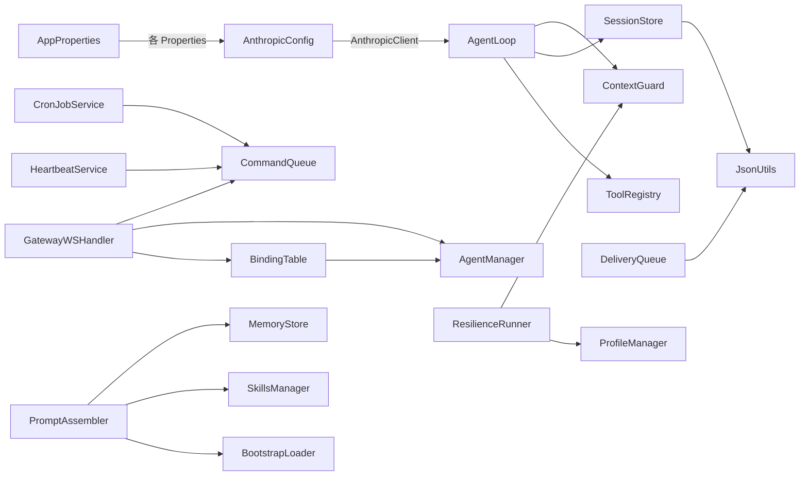

# enterprise-claw-4j 编码执行计划 — 总览

> 本目录包含 7 个 Sprint 的详细编码执行计划，每个 Sprint 独立一个文件。
> 本文档提供全局视角：编码约定、文件清单、模块依赖图、实施顺序。

---

## 1. 文档索引

| 文件 | 内容 |
|------|------|
| [00-plan-overview.md](./00-plan-overview.md) | 总览：约定、依赖图、全局文件清单 |
| [01-sprint1-skeleton.md](./01-sprint1-skeleton.md) | Sprint 1：项目骨架、SDK 验证、AgentLoop、ToolRegistry |
| [02-sprint2-persistence.md](./02-sprint2-persistence.md) | Sprint 2：SessionStore、ContextGuard、Channel 抽象 |
| [03-sprint3-gateway.md](./03-sprint3-gateway.md) | Sprint 3：BindingTable、WebSocket 网关、REST API |
| [04-sprint4-intelligence.md](./04-sprint4-intelligence.md) | Sprint 4：BootstrapLoader、SkillsManager、MemoryStore |
| [05-sprint5-autonomy.md](./05-sprint5-autonomy.md) | Sprint 5：HeartbeatService、CronJobService、DeliveryQueue |
| [06-sprint6-resilience.md](./06-sprint6-resilience.md) | Sprint 6：ResilienceRunner、ProfileManager、LaneQueue |
| [07-sprint7-integration.md](./07-sprint7-integration.md) | Sprint 7：全模块集成、E2E 测试、Docker、优雅关闭 |

---

## 2. 全局编码约定

### 2.1 项目坐标

```
目标目录:  claw-4j/enterprise-claw-4j/
GroupId:   com.openclaw.enterprise
Package:   com.openclaw.enterprise
Java:      21 (LTS)
Framework: Spring Boot 3.5.x
Build:     Maven
```

### 2.2 代码规范

| 维度 | 规范 |
|------|------|
| **注释语言** | 中文（类级 Javadoc、关键逻辑注释） |
| **日志语言** | 英文（结构化，含 agentId/sessionId） |
| **命名** | Google Java Style (camelCase 方法/字段, PascalCase 类) |
| **Record** | 不可变 DTO 优先使用 `record`，可变状态使用 `class` |
| **Sealed** | 密封类型用于穷举匹配：`FailoverReason`, `CronSchedule`, `CronPayload` |
| **线程安全** | 共享状态标注 `@ThreadSafe` / `@NotThreadSafe`，使用 `ReentrantLock` |
| **异常** | 不吞异常，不裸 `catch Exception`，业务异常继承 `Claw4jException` |
| **配置** | 零硬编码，全部走 `application.yml` 或环境变量 |
| **Null 安全** | 返回值用 `Optional<T>`，参数用 `@Nullable` / `@NonNull` |

### 2.3 包结构速查

```
com.openclaw.enterprise/
├── EnterpriseClaw4jApplication.java     # @SpringBootApplication 入口
├── config/                              # 配置层
│   ├── AppConfig.java                   # @EnableScheduling, @EnableRetry, 配置 Bean
│   ├── AnthropicConfig.java             # AnthropicClient Bean
│   ├── WebSocketConfig.java             # WebSocket 端点注册
│   ├── SchedulingConfig.java            # 定时任务线程池配置
│   └── AppProperties.java              # @ConfigurationProperties 集合
├── common/                              # 公共工具 + 异常体系
│   ├── JsonUtils.java
│   ├── FileUtils.java
│   ├── TokenEstimator.java
│   └── exception/                       # 异常层级
│       ├── Claw4jException.java         # 抽象基类
│       ├── AgentException.java
│       ├── ToolExecutionException.java
│       ├── ContextOverflowException.java
│       ├── ChannelException.java
│       ├── DeliveryException.java
│       ├── ProfileExhaustedException.java
│       └── JsonRpcException.java        # JSON-RPC 协议错误
├── agent/                               # Agent 核心
├── tool/                                # 工具系统
├── session/                             # 会话持久化
├── channel/                             # 渠道抽象
├── gateway/                             # 网关路由 + 认证
├── intelligence/                        # 智能层
├── scheduler/                           # 定时调度
├── delivery/                            # 可靠投递
├── resilience/                          # 韧性容错
├── concurrency/                         # 并发控制
└── auth/                                # 认证扩展点
```

### 2.4 Spring Bean 命名约定

| 模式 | 示例 | 说明 |
|------|------|------|
| `@Service` | `AgentLoop`, `SessionStore`, `ToolRegistry` | 核心业务服务 |
| `@Component` | `GracefulShutdownManager`, `CliChannel` | 基础设施组件 |
| `@Configuration` | `AppConfig`, `AnthropicConfig` | 配置类 |
| `@ConditionalOnProperty` | `TelegramChannel`, `FeishuChannel` | 按需注册 |
| `@Primary` + `@ConditionalOnMissingBean` | `DefaultAuthFilter` | 可替换默认实现 |

---

## 3. 全局文件清单与实施顺序

以下按 **严格依赖序** 列出所有需创建的文件。标注了所属 Sprint、claw0 源码映射、预估行数。

### 3.1 Sprint 1 — 骨架与核心 (Day 1-9)

| # | 文件路径 | 类型 | claw0 映射 | 预估行数 | 说明 |
|---|---------|------|-----------|---------|------|
| 1.1 | `pom.xml` | 构建配置 | requirements.txt | 120 | Maven 依赖定义 |
| 1.2 | `src/main/resources/application.yml` | 配置 | .env.example | 80 | Spring Boot 主配置 |
| 1.3 | `src/main/resources/application-dev.yml` | 配置 | — | 15 | 开发环境覆写 |
| 1.4 | `src/main/resources/application-prod.yml` | 配置 | — | 20 | 生产环境覆写 |
| 1.5 | `src/main/resources/logback-spring.xml` | 配置 | — | 40 | 日志配置 |
| 1.6 | `EnterpriseClaw4jApplication.java` | 入口 | s01 main() | 15 | @SpringBootApplication |
| 1.7 | `config/AppConfig.java` | 配置 | — | 40 | @EnableScheduling 等 |
| 1.8 | `config/AnthropicConfig.java` | 配置 | s01 Anthropic() | 30 | 构建 AnthropicClient Bean |
| 1.9 | `config/AppProperties.java` | 配置 | — | 80 | 所有 @ConfigurationProperties |
| 1.10 | `common/JsonUtils.java` | 工具 | s03 json 操作 | 60 | Jackson 单例 ObjectMapper |
| 1.11 | `common/FileUtils.java` | 工具 | s08 atomic write | 60 | 原子写入、安全路径 |
| 1.12 | `common/TokenEstimator.java` | 工具 | s03 token 估算 | 40 | 启发式 token 计数 |
| 1.13 | `tool/ToolHandler.java` | 接口 | s02 TOOL_HANDLERS | 15 | 工具处理器接口 |
| 1.14 | `tool/ToolDefinition.java` | record | s02 TOOLS schema | 15 | 工具 Schema 定义 |
| 1.15 | `tool/ToolRegistry.java` | 服务 | s02 dispatch | 80 | 注册 + 分发 + schema 收集 |
| 1.16 | `tool/handlers/BashToolHandler.java` | 工具 | s02 tool_bash() | 80 | subprocess + 安全 |
| 1.17 | `tool/handlers/ReadFileToolHandler.java` | 工具 | s02 tool_read_file() | 50 | 文件读取 + 路径安全 |
| 1.18 | `tool/handlers/WriteFileToolHandler.java` | 工具 | s02 tool_write_file() | 50 | 文件写入 |
| 1.19 | `tool/handlers/EditFileToolHandler.java` | 工具 | s02 tool_edit_file() | 70 | 编辑操作 |
| 1.20 | `agent/DmScope.java` | enum | s05 DmScope | 10 | 会话隔离粒度 |
| 1.21 | `agent/TokenUsage.java` | record | — | 8 | Token 用量 |
| 1.22 | `agent/AgentTurnResult.java` | record | — | 15 | 对话回合结果 |
| 1.23 | `agent/AgentConfig.java` | record | s05 AgentConfig | 15 | Agent 身份配置 |
| 1.24 | `agent/AgentLoop.java` | 服务 | s01+s02 agent_loop | 150 | 核心对话循环 |
| 1.25 | `.env.example` | 配置 | .env.example | 25 | 环境变量模板 |
| 1.26 | `workspace/` 目录 + 模板文件 | 资源 | workspace/ | — | 拷贝 claw0 workspace/ |
| 1.27 | `common/Claw4jException.java` | 抽象类 | — | 20 | 业务异常基类 |
| 1.28 | `common/exceptions/AgentException.java` | 异常 | — | 10 | Agent 未找到等 |
| 1.29 | `common/exceptions/ToolExecutionException.java` | 异常 | — | 10 | 工具执行失败 |
| 1.30 | `common/exceptions/ContextOverflowException.java` | 异常 | — | 10 | 上下文溢出不可恢复 |
| 1.31 | `common/exceptions/ChannelException.java` | 异常 | — | 10 | 渠道通信失败 |
| 1.32 | `common/exceptions/DeliveryException.java` | 异常 | — | 10 | 投递失败 |
| 1.33 | `common/exceptions/ProfileExhaustedException.java` | 异常 | — | 10 | 所有 Profile 耗尽 |
| 1.34 | `common/exceptions/JsonRpcException.java` | 异常 | — | 10 | JSON-RPC 协议错误 |
| 1.35 | `agent/ToolCallRecord.java` | record | — | 10 | 工具调用记录 |

**Sprint 1 小计: ~1,299 行**

### 3.2 Sprint 2 — 持久化与渠道 (Day 10-19)

| # | 文件路径 | 类型 | claw0 映射 | 预估行数 |
|---|---------|------|-----------|---------|
| 2.1 | `session/TranscriptEvent.java` | record | s03 event 格式 | 30 | 含 input 字段 (tool_use 场景) |
| 2.2 | `session/SessionMeta.java` | record | s03 SessionStore index | 20 |
| 2.3 | `session/SessionStore.java` | 服务 | s03 SessionStore | 250 |
| 2.4 | `session/ContextGuard.java` | 服务 | s03 ContextGuard | 150 |
| 2.5 | `channel/MediaAttachment.java` | record | s04 media | 10 |
| 2.6 | `channel/InboundMessage.java` | record | s04 InboundMessage | 25 |
| 2.7 | `channel/Channel.java` | 接口 | s04 Channel ABC | 15 |
| 2.8 | `channel/ChannelManager.java` | 服务 | s04 ChannelManager | 50 |
| 2.9 | `channel/impl/CliChannel.java` | 组件 | s04 CLIChannel | 80 |
| 2.10 | `channel/impl/TelegramChannel.java` | 组件 | s04 TelegramChannel | 250 |
| 2.11 | `channel/impl/FeishuChannel.java` | 组件 | s04 FeishuChannel | 200 |
| 2.12 | `channel/impl/FeishuWebhookController.java` | 控制器 | s04 飞书 Webhook 回调 | 40 |

**Sprint 2 小计: ~1,115 行**

### 3.3 Sprint 3 — 网关与路由 (Day 20-26)

| # | 文件路径 | 类型 | claw0 映射 | 预估行数 | 说明 |
|---|---------|------|-----------|---------|------|
| 3.1 | `gateway/Binding.java` | record | s05 Binding | 20 | |
| 3.2 | `gateway/ResolvedBinding.java` | record | s05 resolve 结果 | 10 | |
| 3.3 | `gateway/BindingTable.java` | 服务 | s05 BindingTable | 120 | 含预排序优化 |
| 3.4 | `agent/AgentManager.java` | 服务 | s05 AgentManager | 100 | |
| 3.5 | `config/WebSocketConfig.java` | 配置 | s05 server setup | 30 | |
| 3.6 | `gateway/GatewayWebSocketHandler.java` | 组件 | s05 GatewayServer | 220 | 含所有通知方法 |
| 3.7 | `gateway/GatewayController.java` | 控制器 | s05 REST 端点 | 160 | 含全部 REST API |
| 3.8 | `auth/AuthFilter.java` | 接口 | — | 15 | 认证扩展点接口 |
| 3.9 | `auth/DefaultAuthFilter.java` | 组件 | — | 20 | 默认放行实现 (@Primary) |
| 3.10 | `gateway/BindingStore.java` | 服务 | — | 80 | 路由规则 JSONL 持久化 |
| 3.11 | `gateway/AgentStore.java` | 服务 | — | 70 | Agent 配置 JSONL 持久化 |
| 3.12 | `config/ConcurrencyProperties.java` | record | — | 15 | Lane 并发配置 |
| 3.13 | `gateway/GlobalExceptionHandler.java` | 组件 | — | 60 | @RestControllerAdvice 统一错误处理 |
| 3.14 | `gateway/MessagePumpService.java` | 服务 | — | 80 | 轮询所有 Channel → 路由到 BindingTable → CommandQueue |

**Sprint 3 小计: ~1,000 行**

### 3.4 Sprint 4 — 智能层 (Day 27-34)

| # | 文件路径 | 类型 | claw0 映射 | 预估行数 |
|---|---------|------|-----------|---------|
| 4.1 | `intelligence/LoadMode.java` | enum | s06 mode 参数 | 8 |
| 4.2 | `intelligence/BootstrapLoader.java` | 服务 | s06 BootstrapLoader | 150 |
| 4.3 | `intelligence/Skill.java` | record | s06 Skill | 15 |
| 4.4 | `intelligence/SkillsManager.java` | 服务 | s06 SkillsManager | 100 |
| 4.5 | `intelligence/MemoryEntry.java` | record | s06 记忆条目 | 15 |
| 4.6 | `intelligence/MemoryStore.java` | 服务 | s06 MemoryStore | 350 |
| 4.7 | `intelligence/PromptContext.java` | record | s06 上下文 | 15 |
| 4.8 | `intelligence/PromptAssembler.java` | 服务 | s06 assemble | 120 |
| 4.9 | `tool/handlers/MemoryWriteToolHandler.java` | 工具 | s06 memory_write | 30 |
| 4.10 | `tool/handlers/MemorySearchToolHandler.java` | 工具 | s06 memory_search | 30 |

**Sprint 4 小计: ~833 行**

### 3.5 Sprint 5 — 自主与投递 (Day 35-42)

| # | 文件路径 | 类型 | claw0 映射 | 预估行数 |
|---|---------|------|-----------|---------|
| 5.1 | `scheduler/CronSchedule.java` | sealed | s07 CronSchedule | 40 |
| 5.1b | `scheduler/CronScheduleDeserializer.java` | 组件 | — | 30 | Jackson 自定义反序列化 |
| 5.2 | `scheduler/CronPayload.java` | sealed | s07 payload 类型 | 25 |
| 5.3 | `scheduler/CronJob.java` | class | s07 CronJob | 60 |
| 5.4 | `scheduler/CronJobService.java` | 服务 | s07 CronService | 150 |
| 5.5 | `scheduler/HeartbeatService.java` | 服务 | s07 HeartbeatRunner | 100 |
| 5.6 | `config/SchedulingConfig.java` | 配置 | — | 25 |
| 5.7 | `delivery/QueuedDelivery.java` | record | s08 QueuedDelivery | 25 |
| 5.8 | `delivery/MessageChunker.java` | 工具 | s08 chunk 逻辑 | 60 |
| 5.9 | `delivery/DeliveryQueue.java` | 服务 | s08 DeliveryQueue | 120 |
| 5.10 | `delivery/DeliveryRunner.java` | 服务 | s08 DeliveryRunner | 100 |

**Sprint 5 小计: ~735 行**

### 3.6 Sprint 6 — 韧性与并发 (Day 43-51)

| # | 文件路径 | 类型 | claw0 映射 | 预估行数 |
|---|---------|------|-----------|---------|
| 6.1 | `resilience/FailoverReason.java` | sealed | s09 FailoverReason | 50 |
| 6.2 | `resilience/AuthProfile.java` | class | s09 AuthProfile | 60 |
| 6.3 | `resilience/ProfileManager.java` | 服务 | s09 ProfileManager | 100 |
| 6.4 | `resilience/ResilienceRunner.java` | 服务 | s09 ResilienceRunner | 200 |
| 6.5 | `concurrency/LaneStatus.java` | record | s10 LaneStatus | 15 |
| 6.6 | `concurrency/QueuedItem.java` | record | s10 内部队列项 | 10 |
| 6.7 | `concurrency/LaneQueue.java` | 类 | s10 LaneQueue | 200 |
| 6.8 | `concurrency/CommandQueue.java` | 服务 | s10 CommandQueue | 100 |

**Sprint 6 小计: ~735 行**

### 3.7 Sprint 7 — 集成与交付 (Day 52-61)

| # | 文件路径 | 类型 | 预估行数 |
|---|---------|------|---------|
| 7.1 | `config/GracefulShutdownManager.java` | 组件 | 60 |
| 7.2 | `Dockerfile` | 构建 | 30 |
| 7.3 | `.dockerignore` | 配置 | 10 |
| 7.4 | `docker-compose.yml` | 配置 | 30 |
| 7.5 | `README.md` | 文档 | 200 |
| 7.6 | E2E 测试类 (3-5 个) | 测试 | 400 |
| 7.7 | `k8s/` 部署 YAML | 配置 | 80 |

**Sprint 7 小计: ~810 行**

### 3.8 总代码量汇总

| 分类 | 行数 |
|------|------|
| 核心业务代码 (Sprint 1-6) | ~5,507 |
| 配置 & 基础设施 (Sprint 7) | ~410 |
| 测试代码 (各 Sprint 内) | ~4,000 |
| 文档 & 部署 (Sprint 7) | ~400 |
| **总计** | **~10,300 行** |

---

## 4. 跨模块依赖关系

### 4.1 编译时依赖 (必须按序实现)

```mermaid
flowchart TB
    subgraph "Sprint 1"
        POM["pom.xml"]
        CFG["config/ (AppConfig, AnthropicConfig, AppProperties)"]
        CMN["common/ (JsonUtils, FileUtils, TokenEstimator)"]
        TOOL["tool/ (ToolHandler, ToolRegistry, 4 handlers)"]
        AGENT["agent/ (AgentLoop, AgentConfig, AgentTurnResult)"]
    end

    subgraph "Sprint 2"
        SESS["session/ (SessionStore, ContextGuard)"]
        CHAN["channel/ (Channel, CLI, Telegram, Feishu)"]
    end

    subgraph "Sprint 3"
        GW["gateway/ (BindingTable, WebSocketHandler, Controller)"]
        AM["agent/AgentManager"]
    end

    subgraph "Sprint 4"
        INTEL["intelligence/ (BootstrapLoader, SkillsManager, MemoryStore, PromptAssembler)"]
        MEM_TOOL["tool/handlers/ (MemoryWrite, MemorySearch)"]
    end

    subgraph "Sprint 5"
        SCHED["scheduler/ (HeartbeatService, CronJobService)"]
        DELIV["delivery/ (DeliveryQueue, DeliveryRunner, MessageChunker)"]
    end

    subgraph "Sprint 6"
        RESIL["resilience/ (ResilienceRunner, ProfileManager, FailoverReason)"]
        CONCUR["concurrency/ (LaneQueue, CommandQueue)"]
    end

    POM --> CFG --> CMN
    CMN --> TOOL --> AGENT

    AGENT --> SESS
    CMN --> SESS
    AGENT --> CHAN

    AGENT --> AM --> GW
    CHAN --> GW

+    subgraph "Sprint 3 新增"
+        GEH["gateway/GlobalExceptionHandler"]
+        PUMP["gateway/MessagePumpService"]
+    end
+
+    CHAN --> PUMP --> GW

    CMN --> INTEL
    INTEL --> MEM_TOOL

    AGENT --> SCHED
    CHAN --> DELIV

    AGENT --> RESIL
    SESS --> RESIL
    TOOL --> RESIL

    SCHED --> CONCUR
    RESIL --> CONCUR

    style POM fill:#e3f2fd
    style AGENT fill:#fff9c4
    style RESIL fill:#ffe0b2
    style CONCUR fill:#e1bee7
```

### 4.2 Spring Bean 注入依赖



---

## 5. claw0 源码索引

每个 Java 文件映射到具体的 claw0 Python 源码位置，编码时可直接参照。

| Java 模块 | claw0 源文件 | 行数 | 关键函数/类 |
|-----------|-------------|------|------------|
| agent/ | `sessions/en/s01_agent_loop.py` | 173 | `agent_loop()` |
| tool/ | `sessions/en/s02_tool_use.py` | 439 | `TOOLS`, `TOOL_HANDLERS`, `process_tool_call()` |
| session/ | `sessions/en/s03_sessions.py` | 873 | `SessionStore`, `ContextGuard` |
| channel/ | `sessions/en/s04_channels.py` | 792 | `Channel`, `CLIChannel`, `TelegramChannel`, `FeishuChannel` |
| gateway/ | `sessions/en/s05_gateway_routing.py` | 626 | `BindingTable`, `GatewayServer` |
| intelligence/ | `sessions/en/s06_intelligence.py` | 905 | `BootstrapLoader`, `SkillsManager`, `MemoryStore` |
| scheduler/ | `sessions/en/s07_heartbeat_cron.py` | 659 | `HeartbeatRunner`, `CronService` |
| delivery/ | `sessions/en/s08_delivery.py` | 869 | `DeliveryQueue`, `DeliveryRunner` |
| resilience/ | `sessions/en/s09_resilience.py` | 1133 | `ResilienceRunner`, `ProfileManager` |
| concurrency/ | `sessions/en/s10_concurrency.py` | 903 | `LaneQueue`, `CommandQueue` |

> **注意**: claw0 的 3 个语言版本 (en/zh/ja) 逻辑完全一致。编码参照时使用 `en/` (英文注释) 版本即可。

---

## 6. 每个文件的标准编写流程

在实现每个 Java 文件时，遵循以下流程：

```
1. 阅读 claw0 对应源码 → 理解原始逻辑
2. 阅读 01-module-design.md 中该类的设计 → 理解 Java 侧接口
3. 编写 Java 类 → 遵循编码约定
4. 编写对应单元测试 → 覆盖核心路径
5. 验证编译通过 → mvn compile
```

### 单元测试命名约定

```
测试类: {被测类}Test.java
测试方法: should{ExpectedBehavior}When{Condition}
示例:   shouldDispatchToolByName
         shouldRejectDangerousCommand
         shouldRetryWithExponentialBackoff
```

---

## 7. AgentLoop 接口演进时间线

`AgentLoop` 的方法签名随各 Sprint 的集成逐步演化。编码时注意按下表时间线调整：

| Sprint | 签名变化 | 说明 |
|--------|---------|------|
| **Sprint 1** | `runTurn(agentId, sessionId, userMessage)` | 自持 `AnthropicClient`，无会话持久化 |
| **Sprint 2** | 新增依赖 `SessionStore` + `ContextGuard` | `runTurn` 内部加载/保存历史，API 调用通过 `ContextGuard` 包装 |
| **Sprint 4** | 新增依赖 `PromptAssembler` | `runTurn` 内部调用 `buildSystemPrompt()` 构建 system prompt |
| **Sprint 6** | `runTurn(agentId, sessionId, userMessage, client)` | `AnthropicClient` 不再自持，改为参数注入（由 `ResilienceRunner` 提供）|
| **Sprint 6** | 新增 `executeWithClient(client, systemPrompt, messages)` | 内部方法，供 `ResilienceRunner` 调用 |

> **重构策略**: 在 Sprint 6 之前，`AgentLoop` 可以暂时自持一个默认的 `AnthropicClient` Bean。
> Sprint 6 集成时，移除自持 client，改为方法参数。此变更影响所有调用点（Gateway、Heartbeat、Cron）。

---

## 8. 架构约束与部署说明

### 8.1 单实例部署约束

当前设计**明确为单实例部署**，原因如下：
- 文件系统 (JSONL) 作为持久化层，不支持多实例并发写入
- `SessionStore` 使用内存索引 + 文件锁，仅保证单进程内的并发安全
- `DeliveryQueue` 的 WAL 机制依赖本地文件系统
- `MemoryStore` 的内存缓存在多实例间无法同步

> **未来扩展**: 如需水平扩展，可引入 `SessionRepository`、`DeliveryRepository` 等持久化接口抽象层，
> 将 JSONL 文件实现替换为 Redis/PostgreSQL 等分布式存储。此变更不影响业务逻辑层。
