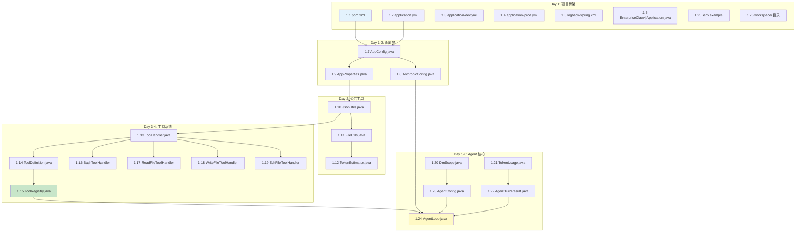

# Sprint 1: 项目骨架与核心 (Day 1-9)

> **目标**: 跑通 "用户输入 → Claude API → 工具调用 → 回复" 完整闭环
> **里程碑 M1**: `mvn spring-boot:run` 启动 → REST 发消息 → Claude 回复 → 工具调用成功
> **claw0 参考**: `sessions/en/s01_agent_loop.py` + `sessions/en/s02_tool_use.py`

---

## 1. 实施依赖图



---

## 2. Day 1: 项目骨架与 Maven 配置

> **⚠️ Day 1 第一步：版本验证**
>
> 在创建任何文件之前，必须先验证所有关键依赖版本在 Maven Central 中可用：
>
> ```bash
> # 验证 Spring Boot 版本
> curl -s "https://search.maven.org/solrsearch/select?q=g:org.springframework.boot+AND+a:spring-boot-starter-parent&rows=5&wt=json" | jq '.response.docs[0].latestVersion'
>
> # 验证 Anthropic SDK 版本
> curl -s "https://search.maven.org/solrsearch/select?q=g:com.anthropic+AND+a:anthropic-java&rows=5&wt=json" | jq '.response.docs[0].latestVersion'
>
> # 验证 cron-utils 版本
> curl -s "https://search.maven.org/solrsearch/select?q=g:com.cronutils+AND+a:cron-utils&rows=5&wt=json" | jq '.response.docs[0].latestVersion'
> ```
>
> 如果指定版本不存在，**立即更新 pom.xml 中的版本号为最新稳定版**，不要等到 Day 2。

### 2.1 文件 1.1 — `pom.xml`

**路径**: `claw-4j/enterprise-claw-4j/pom.xml`

**关键内容**:
```xml
<parent>
    <groupId>org.springframework.boot</groupId>
    <artifactId>spring-boot-starter-parent</artifactId>
    <version>3.5.3</version>
</parent>

<groupId>com.openclaw</groupId>
<artifactId>enterprise-claw-4j</artifactId>
<version>0.1.0-SNAPSHOT</version>

<properties>
    <java.version>21</java.version>
    <anthropic-sdk.version>2.20.0</anthropic-sdk.version>
    <dotenv.version>3.2.0</dotenv.version>
    <cron-utils.version>9.2.1</cron-utils.version>
    <awaitility.version>4.3.0</awaitility.version>
</properties>
```

**依赖清单** (参见 00-overview.md 3.2 节完整列表):
- `spring-boot-starter-web`
- `spring-boot-starter-websocket`
- `spring-boot-starter-actuator`
- `spring-retry` + `spring-boot-starter-aop`
- `spring-boot-starter-validation`
- `anthropic-java` (2.20.x)
- `jackson-dataformat-yaml`
- `dotenv-java` (3.2.0)
- `cron-utils` (9.2.1)
- `spring-boot-starter-test` (test scope)
- `awaitility` (test scope)

**构建插件**:
```xml
<build>
    <plugins>
        <plugin>
            <groupId>org.springframework.boot</groupId>
            <artifactId>spring-boot-maven-plugin</artifactId>
            <configuration>
                <excludes>
                    <exclude>
                        <groupId>org.projectlombok</groupId>
                        <artifactId>lombok</artifactId>
                    </exclude>
                </excludes>
            </configuration>
        </plugin>
    </plugins>
</build>
```

### 2.2 文件 1.2 — `application.yml`

**路径**: `src/main/resources/application.yml`

**claw0 参考**: `vendors/claw0/.env.example` + `vendors/claw0/sessions/en/s01_agent_loop.py` 中的 `os.getenv()` 调用

**关键要点**:
- 完整配置参见 00-overview.md 7.2 节
- 本阶段只需确保 `anthropic.profiles[0].api-key` 能读取环境变量
- `spring.threads.virtual.enabled: true` 启用虚拟线程
- `server.shutdown: graceful` 启用优雅关闭

### 2.3-2.5 配置文件

`application-dev.yml`: 日志级别 DEBUG
`application-prod.yml`: 日志级别 INFO + Actuator 探针
`logback-spring.xml`: 参见 02-api-and-dataflow.md 6.3 节

### 2.4 文件 1.6 — `EnterpriseClaw4jApplication.java`

```java
package com.openclaw.enterprise;

import org.springframework.boot.SpringApplication;
import org.springframework.boot.autoconfigure.SpringBootApplication;

@SpringBootApplication
public class EnterpriseClaw4jApplication {
    public static void main(String[] args) {
        SpringApplication.run(EnterpriseClaw4jApplication.class, args);
    }
}
```

### 2.5 文件 1.25 — `.env.example`

直接复制 `vendors/claw0/.env.example` 并补充 Java 侧新增变量：
```bash
# Sprint 1 新增
ANTHROPIC_API_KEY=sk-ant-xxx    # 必需
MODEL_ID=claude-sonnet-4-20250514
MAX_TOKENS=8096
ANTHROPIC_BASE_URL=
WORKSPACE_PATH=./workspace
SERVER_PORT=8080
```

### 2.6 文件 1.26 — `workspace/` 目录

将 `vendors/claw0/workspace/` 整个目录复制到 `claw-4j/enterprise-claw-4j/workspace/`：
- `SOUL.md`, `IDENTITY.md`, `TOOLS.md`, `USER.md`, `MEMORY.md`
- `HEARTBEAT.md`, `BOOTSTRAP.md`, `AGENTS.md`
- `CRON.json`
- `skills/example-skill/SKILL.md`

---

## 3. Day 1-2: 配置层

### 3.1 文件 1.7 — `AppConfig.java`

**路径**: `config/AppConfig.java`

**职责**: 启用全局注解、注册所有 ConfigurationProperties

```java
@Configuration
@EnableRetry
@EnableConfigurationProperties({
    AnthropicProperties.class,
    GatewayProperties.class,
    HeartbeatProperties.class,
    ChannelProperties.class,
    WorkspaceProperties.class,
    DeliveryProperties.class
})
public class AppConfig {
    // 全局 Bean 定义（如有）
    // 注意: @EnableScheduling 不在此处启用，而是在 Sprint 5 的 SchedulingConfig 中统一管理
}
```

### 3.2 文件 1.8 — `AnthropicConfig.java`

**claw0 参考**: `s01_agent_loop.py` 第 10-15 行 `Anthropic(api_key=...)`

**关键实现**:
```java
@Configuration
public class AnthropicConfig {

    @Bean
    @Primary
    public AnthropicClient anthropicClient(AnthropicProperties props) {
        var primary = props.profiles().getFirst();
        var builder = AnthropicOkHttpClient.builder()
            .apiKey(primary.apiKey());
        if (primary.baseUrl() != null && !primary.baseUrl().isBlank()) {
            builder.baseUrl(primary.baseUrl());
        }
        return builder.build();
    }
}
```

**注意**:
- Anthropic Java SDK v2.20.0 的客户端类是 `AnthropicOkHttpClient`
- 构建方式: `AnthropicOkHttpClient.builder().apiKey(...).build()`
- 后续 Sprint 6 的 `ProfileManager` 会为每个 AuthProfile 独立创建客户端

### 3.3 文件 1.9 — `AppProperties.java`

**claw0 参考**: `.env.example` 中所有环境变量

**包含 6 个 record** (参见 01-module-design.md 11.1 节完整定义):
- `AnthropicProperties` — model-id, max-tokens, profiles[]
- `GatewayProperties` — default-agent, max-concurrent-agents
- `HeartbeatProperties` — interval, active-start/end-hour
- `ChannelProperties` — telegram, feishu 配置
- `WorkspaceProperties` — path (类型为 `Path`，Spring Boot 自动转换), context-budget
- `DeliveryProperties` — poll-interval, max-retries, backoff 参数

> **注意**: `WorkspaceProperties.path` 定义为 `Path` 类型而非 `String`，以避免所有使用处的重复转换。
> Spring Boot `@ConfigurationProperties` 支持 `Path` 类型的自动绑定。

---

## 4. Day 2: 公共工具

### 4.1 文件 1.10 — `JsonUtils.java`

**claw0 参考**: `s03_sessions.py` 中的 `json.dumps()` / `json.loads()` 调用

**关键实现**:
```java
public final class JsonUtils {
    private static final ObjectMapper MAPPER = new ObjectMapper()
        .registerModule(new JavaTimeModule())
        .disable(SerializationFeature.WRITE_DATES_AS_TIMESTAMPS)
        .setSerializationInclusion(JsonInclude.Include.NON_NULL);

    // toJson, fromJson, appendJsonl, readJsonl
    // appendJsonl 是核心方法 — 用于 SessionStore 的 JSONL 追加写入
}
```

**`appendJsonl` 实现要点**:
```java
public static void appendJsonl(Path file, Object obj) {
    // Files.writeString(file, toJson(obj) + "\n", CREATE, APPEND)
    // 注意：不使用 FileChannel，因为 JSONL 是纯追加模式
}
```

**`readJsonl` 实现要点**:
```java
public static <T> List<T> readJsonl(Path file, Class<T> clazz) {
    // Files.readAllLines(file) 逐行 fromJson
    // 空行跳过，格式错误的行记录 warn 日志但继续
}
```

### 4.2 文件 1.11 — `FileUtils.java`

**claw0 参考**: `s08_delivery.py` 第 200-230 行 `_atomic_write()`

**核心方法 — 原子写入**:
```java
public static void writeAtomically(Path target, String content) {
    Path tmp = target.resolveSibling(".tmp." + UUID.randomUUID());
    try {
        Files.writeString(tmp, content);
        try (var ch = FileChannel.open(tmp, StandardOpenOption.WRITE)) {
            ch.force(true);  // fsync
        }
        Files.move(tmp, target, StandardCopyOption.ATOMIC_MOVE);
    } finally {
        Files.deleteIfExists(tmp);  // 清理残留临时文件
    }
}
```

**安全路径检查**:
```java
public static Path safePath(Path base, String relative) {
    Path resolved = base.resolve(relative).normalize();
    if (!resolved.startsWith(base)) {
        throw new SecurityException("Path traversal detected: " + relative);
    }
    return resolved;
}
```

### 4.3 文件 1.12 — `TokenEstimator.java`

**claw0 参考**: `s03_sessions.py` 第 350-370 行 token 估算逻辑

**实现规则**:
- 英文: 1 token ≈ 4 字符
- CJK 字符: 1 字符 ≈ 1.5 token
- 结果向上取整

```java
public int estimate(String text) {
    if (text == null || text.isEmpty()) return 0;
    int asciiChars = 0, cjkChars = 0;
    for (char c : text.toCharArray()) {
        if (isCJK(c)) cjkChars++;
        else asciiChars++;
    }
    return (int) Math.ceil(asciiChars / 4.0 + cjkChars * 1.5);
}
```

---

## 5. Day 3-4: 工具系统

### 5.1 文件 1.13 — `ToolHandler.java`

**claw0 参考**: `s02_tool_use.py` 第 40-50 行 `TOOL_HANDLERS` 字典的值函数

```java
public interface ToolHandler {
    /** 工具名称，与 Claude API 的 tool_name 对应 */
    String getName();

    /** JSON Schema 定义，发送给 Claude 用于理解工具参数 */
    ToolDefinition getSchema();

    /** 执行工具并返回结果文本 */
    String execute(Map<String, Object> input);
}
```

### 5.2 文件 1.14 — `ToolDefinition.java`

```java
public record ToolDefinition(
    String name,
    String description,
    Map<String, Object> inputSchema  // JSON Schema 对象
) {}
```

### 5.3 文件 1.15 — `ToolRegistry.java`

**claw0 参考**: `s02_tool_use.py` 第 15-50 行 `TOOLS` 列表 + `TOOL_HANDLERS` 字典

**关键实现**:
```java
@Service
public class ToolRegistry {
    private final Map<String, ToolHandler> handlers = new LinkedHashMap<>();

    /** 通过 Spring 构造器注入自动收集所有 ToolHandler 实现 */
    public ToolRegistry(List<ToolHandler> handlerList) {
        handlerList.forEach(h -> handlers.put(h.getName(), h));
    }

    /** 分发工具调用 */
    public String dispatch(String name, Map<String, Object> input) {
        ToolHandler handler = handlers.get(name);
        if (handler == null) {
            throw new ToolExecutionException(name, "Unknown tool: " + name);
        }
        return handler.execute(input);
    }

    /** 收集所有工具的 Schema，用于构建 Claude API 的 tools 参数 */
    public List<ToolDefinition> getSchemas() {
        return List.copyOf(handlers.values()).stream()
            .map(ToolHandler::getSchema).toList();
    }
}
```

**Schema 格式 (Claude API)**:
```json
{
    "name": "bash",
    "description": "执行 bash 命令",
    "input_schema": {
        "type": "object",
        "properties": {
            "command": {"type": "string", "description": "要执行的命令"}
        },
        "required": ["command"]
    }
}
```

> **注意**: Anthropic SDK 使用 `input_schema` (snake_case)，不是 `parameters`。

### 5.4 文件 1.16 — `BashToolHandler.java`

**claw0 参考**: `s02_tool_use.py` 第 60-100 行 `tool_bash()`

**安全措施**:
```java
private static final Set<Pattern> DANGEROUS_PATTERNS = Set.of(
    Pattern.compile("rm\\s+-rf\\s+/"),
    Pattern.compile("mkfs"),
    Pattern.compile("dd\\s+if="),
    Pattern.compile(">\\s*/dev/sd"),
    Pattern.compile(":\\(\\)\\s*\\{.*\\}"),  // fork bomb
    Pattern.compile("chmod\\s+-R\\s+777\\s+/")
);

private static final int MAX_OUTPUT = 50_000;
private static final int DEFAULT_TIMEOUT_SECONDS = 30;
```

**核心逻辑**:
```java
public String execute(Map<String, Object> input) {
    String command = (String) input.get("command");
    // 1. 安全检查
    if (!isSafeCommand(command)) {
        return "Error: Dangerous command blocked: " + command;
    }
    // 2. 执行
    ProcessBuilder pb = new ProcessBuilder("bash", "-c", command);
    pb.directory(workDir.toFile());
    pb.redirectErrorStream(true);
    Process proc = pb.start();
    String output = new String(proc.getInputStream().readAllBytes());
    boolean finished = proc.waitFor(timeout, TimeUnit.SECONDS);
    // 3. 截断
    if (output.length() > MAX_OUTPUT) {
        output = output.substring(0, MAX_OUTPUT) + "\n... [truncated]";
    }
    return output;
}
```

### 5.5-5.6 文件 1.17-1.18 — Read/Write 文件工具

**claw0 参考**: `s02_tool_use.py` 第 100-160 行

**关键**: 所有文件操作必须通过 `FileUtils.safePath(workDir, filePath)` 检查

### 5.7 文件 1.19 — `EditFileToolHandler.java`

**claw0 参考**: `s02_tool_use.py` 第 160-200 行 `tool_edit_file()`

支持的操作类型:
- `replace`: 查找 old_text → 替换为 new_text
- `insert`: 在指定行号前插入
- `delete`: 删除指定行范围

---

## 6. Day 5-6: Agent 核心

### 6.1 文件 1.20-1.23 — 数据 records

这 4 个文件是简单 record，无复杂逻辑：
- `DmScope.java`: `MAIN`, `PER_PEER`, `PER_CHANNEL_PEER`, `PER_ACCOUNT_CHANNEL_PEER`
- `TokenUsage.java`: `int inputTokens`, `int outputTokens`
- `AgentTurnResult.java`: `String text`, `List<ToolCallRecord> toolCalls`, `String stopReason`, `TokenUsage tokenUsage`
- `AgentConfig.java`: `String id`, `String name`, `String personality`, `String model`, `DmScope dmScope`

### 6.2 文件 1.24 — `AgentLoop.java` ⭐ 核心

**claw0 参考**:
- 主循环: `s01_agent_loop.py` 第 30-60 行 `agent_loop()`
- 工具分发: `s02_tool_use.py` 第 200-250 行 `process_tool_call()`
- SDK 调用: `s01_agent_loop.py` 第 35-45 行 `client.messages.create()`

**核心结构**:

```java
@Service
public class AgentLoop {
    private final AnthropicClient client;
    private final ToolRegistry toolRegistry;
    private final WorkspaceProperties workspaceProps;
    private final AnthropicProperties anthropicProps;

    /**
     * 执行一个对话回合
     * 等价于 claw0 中一个完整的 agent_loop 迭代
     */
    public AgentTurnResult runTurn(String agentId, String sessionId, String userMessage) {
        // 1. 加载会话历史 (Sprint 2 实现 SessionStore 后接入)
        List<MessageParam> messages = new ArrayList<>();

        // 2. 添加用户消息
        messages.add(MessageParam.builder()
            .role(Role.USER)
            .addText(TextBlock.builder().text(userMessage).build())
            .build());

        // 3. 进入工具使用循环
        return processToolUseLoop(messages);
    }

    /**
     * 工具使用内层循环
     * 等价于 claw0 s01+s02 的 while True + stop_reason 分发
     */
    private AgentTurnResult processToolUseLoop(List<MessageParam> messages) {
        List<ToolCallRecord> toolCalls = new ArrayList<>();
        int totalInputTokens = 0, totalOutputTokens = 0;

        while (true) {
            // 构建 API 参数
            MessageCreateParams params = MessageCreateParams.builder()
                .model(anthropicProps.modelId())
                .maxTokens(anthropicProps.maxTokens())
                .messages(messages)
                .tools(buildToolParams())    // 从 ToolRegistry 获取
                .build();

            // 调用 Claude API
            Message response = client.messages().create(params);

            // 累计 Token 用量
            totalInputTokens += response.usage().inputTokens();
            totalOutputTokens += response.usage().outputTokens();

            // 检查 stop_reason
            String stopReason = response.stopReason().toString();

            if ("end_turn".equals(stopReason)) {
                String text = extractTextContent(response);
                return new AgentTurnResult(text, toolCalls, stopReason,
                    new TokenUsage(totalInputTokens, totalOutputTokens));
            }

            if ("tool_use".equals(stopReason)) {
                // 追加助手消息（含 tool_use blocks）
                messages.add(toMessageParam(response));
                // 处理每个工具调用
                List<ToolResultBlock> toolResults = new ArrayList<>();
                for (var block : response.content()) {
                    if (block instanceof ToolUseBlock toolUse) {
                        String result = toolRegistry.dispatch(
                            toolUse.name(),
                            (Map<String, Object>) toolUse.input()
                        );
                        toolCalls.add(new ToolCallRecord(
                            toolUse.name(), toolUse.id(), toolUse.input(), result));
                        toolResults.add(ToolResultBlock.builder()
                            .toolUseId(toolUse.id())
                            .content(result)
                            .build());
                    }
                }
                // 追加 tool_result 消息
                messages.add(MessageParam.builder()
                    .role(Role.USER)
                    .content(toolResults)
                    .build());
                continue;
            }

            // 其他 stop_reason (max_tokens 等)
            String text = extractTextContent(response);
            return new AgentTurnResult(text, toolCalls, stopReason,
                new TokenUsage(totalInputTokens, totalOutputTokens));
        }
    }
}
```

**SDK 关键点** (Anthropic Java SDK v2.20.0):

| 概念 | SDK 类 | 说明 |
|------|--------|------|
| 创建消息 | `client.messages().create(params)` | 同步调用 |
| 参数构建 | `MessageCreateParams.builder()` | 流式 API |
| 内容块类型 | `TextBlock`, `ToolUseBlock`, `ToolResultBlock` | sealed interface |
| stop_reason | `response.stopReason()` | 枚举: `end_turn`, `tool_use`, `max_tokens` |
| Token 用量 | `response.usage().inputTokens()` | int 值 |

**⚠️ Day 2 必须完成的验证**:

在正式实现 AgentLoop 前，先写一个最小验证测试：

```java
@SpringBootTest
class AnthropicSdkVerificationTest {
    @Test
    void shouldCallMessagesApi() {
        var client = AnthropicOkHttpClient.builder()
            .apiKey(System.getenv("ANTHROPIC_API_KEY"))
            .build();

        var params = MessageCreateParams.builder()
            .model("claude-sonnet-4-20250514")
            .maxTokens(100L)
            .addUserMessage("Say hello in one word")
            .build();

        Message response = client.messages().create(params);
        assertNotNull(response);
        assertFalse(response.content().isEmpty());
    }
}
```

> 此测试需要有效的 `ANTHROPIC_API_KEY`。如果 CI 环境无 key，可标记 `@Disabled` 或用 `assumptions.assumeTrue`。

---

## 7. Day 7-8: 内置工具实现

所有 4 个工具 handler 的详细实现要点见第 5 节。这里补充通用模式：

### 所有 ToolHandler 的共同结构

```java
@Component
public class XxxToolHandler implements ToolHandler {
    private final Path workDir;  // 从 WorkspaceProperties 注入

    @Override
    public String getName() { return "xxx"; }

    @Override
    public ToolDefinition getSchema() {
        return new ToolDefinition("xxx", "描述...", schemaMap);
    }

    @Override
    public String execute(Map<String, Object> input) {
        // 1. 提取参数 (带默认值)
        // 2. 安全检查 (路径、命令)
        // 3. 执行操作
        // 4. 截断输出 (MAX_OUTPUT)
        // 5. 返回结果文本
    }
}
```

### Schema 定义示例 (Bash)

```java
private static final ToolDefinition SCHEMA = new ToolDefinition(
    "bash",
    "Execute a bash command in the working directory",
    Map.of(
        "type", "object",
        "properties", Map.of(
            "command", Map.of(
                "type", "string",
                "description", "The bash command to execute"
            ),
            "timeout", Map.of(
                "type", "integer",
                "description", "Timeout in seconds (default: 30)"
            )
        ),
        "required", List.of("command")
    )
);
```

---

## 8. Day 9: 测试

### 8.1 测试清单

| 测试类 | 测试内容 | 优先级 |
|--------|---------|--------|
| `ToolRegistryTest` | 注册/分发/未知工具/Schema 收集 | P0 |
| `BashToolHandlerTest` | 命令执行/危险拦截/超时/截断 | P0 |
| `ReadFileToolHandlerTest` | 文件读取/路径穿越拦截 | P0 |
| `WriteFileToolHandlerTest` | 文件创建/覆盖 | P1 |
| `EditFileToolHandlerTest` | replace/insert/delete 操作 | P1 |
| `FileUtilsTest` | 原子写入/安全路径检查 | P1 |
| `TokenEstimatorTest` | 英文/CJK/混合文本估算 | P2 |
| `AnthropicSdkVerificationTest` | SDK 可连通性 (需 API Key) | P0 |

### 8.2 关键测试用例

```java
// ToolRegistryTest
@Test void shouldDispatchRegisteredTool()
@Test void shouldThrowOnUnknownTool()
@Test void shouldCollectAllSchemas()

// BashToolHandlerTest
@Test void shouldExecuteEchoCommand()
@Test void shouldBlockRmRfSlash()
@Test void shouldTruncateLongOutput()
@Test void shouldRespectTimeout()

// ReadFileToolHandlerTest
@Test void shouldReadExistingFile()
@Test void shouldRejectPathTraversal()

// FileUtilsTest
@Test void shouldWriteAtomically()
@Test void shouldDetectPathTraversal()
```

---

## 10. 异常体系

### 10.1 文件 1.27 — `Claw4jException.java`

```java
/**
 * 业务异常基类 — 所有 claw4j 自定义异常的父类
 * 携带结构化错误信息，便于统一错误响应
 */
public abstract class Claw4jException extends RuntimeException {
    private final String errorCode;

    protected Claw4jException(String errorCode, String message) {
        super(message);
        this.errorCode = errorCode;
    }

    protected Claw4jException(String errorCode, String message, Throwable cause) {
        super(message, cause);
        this.errorCode = errorCode;
    }

    public String getErrorCode() { return errorCode; }
}
```

### 10.2 异常子类文件 (1.28-1.34)

**每个异常子类遵循统一模式**，放在 `common/exceptions/` 包下：

```java
// AgentException.java — Agent 相关错误 (未找到、已存在、ID 格式错误)
public class AgentException extends Claw4jException {
    private final String agentId;
    public AgentException(String agentId, String message) {
        super("AGENT_ERROR", message);
        this.agentId = agentId;
    }
}

// ToolExecutionException.java — 工具执行失败
public class ToolExecutionException extends Claw4jException {
    private final String toolName;
    private final Map<String, Object> input;
    public ToolExecutionException(String toolName, Map<String, Object> input, String message) {
        super("TOOL_ERROR", message);
        this.toolName = toolName;
        this.input = input;
    }
}

// ContextOverflowException.java — 上下文溢出不可恢复
public class ContextOverflowException extends Claw4jException {
    private final int estimatedTokens;
    private final int budget;
    public ContextOverflowException(int estimatedTokens, int budget) {
        super("CONTEXT_OVERFLOW", "Context overflow after max compaction rounds: estimated=" + estimatedTokens + ", budget=" + budget);
        this.estimatedTokens = estimatedTokens;
        this.budget = budget;
    }
}

// ChannelException.java — 渠道通信失败
public class ChannelException extends Claw4jException {
    private final String channelName;
    public ChannelException(String channelName, String message, Throwable cause) {
        super("CHANNEL_ERROR", message, cause);
        this.channelName = channelName;
    }
}

// DeliveryException.java — 投递失败
public class DeliveryException extends Claw4jException {
    private final String deliveryId;
    public DeliveryException(String deliveryId, String message) {
        super("DELIVERY_ERROR", message);
        this.deliveryId = deliveryId;
    }
    public DeliveryException(String deliveryId, String message, Throwable cause) {
        super("DELIVERY_ERROR", message, cause);
        this.deliveryId = deliveryId;
    }
}

// ProfileExhaustedException.java — 所有 Auth Profile 耗尽
public class ProfileExhaustedException extends Claw4jException {
    private final int profileCount;
    public ProfileExhaustedException(String message) {
        super("PROFILES_EXHAUSTED", message);
        this.profileCount = 0;
    }
}

// JsonRpcException.java — JSON-RPC 协议错误
public class JsonRpcException extends RuntimeException {
    private final int code;
    public JsonRpcException(int code, String message) {
        super(message);
        this.code = code;
    }
    public int getCode() { return code; }
}
```

> **注意**: `JsonRpcException` 继承 `RuntimeException` 而非 `Claw4jException`，因为它属于协议层错误，不是业务异常。

### 10.3 文件 1.35 — `ToolCallRecord.java`

```java
/**
 * 工具调用记录 — 记录一次工具调用的完整信息
 * 被 AgentTurnResult 包含，也被 TranscriptEvent 的 tool_use 事件引用
 */
public record ToolCallRecord(
    String toolName,        // 工具名称
    String toolId,          // 工具调用 ID (tool_use_xxx)
    Map<String, Object> input,   // 工具调用参数
    String result           // 工具执行结果文本
) {}
```

---

## 11. 启动目录初始化

应用启动时需要确保以下目录存在（在 `AppConfig.java` 的 `@PostConstruct` 中执行）：

```java
@Configuration
public class AppConfig {
    @PostConstruct
    void ensureDirectories() {
        Path ws = workspaceProps.path();
        List.of(
            ws.resolve(".sessions/agents"),
            ws.resolve("memory/daily"),
            ws.resolve("delivery-queue/pending"),
            ws.resolve("delivery-queue/failed"),
            ws.resolve("cron"),
            ws.resolve("skills"),
            ws.resolve("logs")
        ).forEach(dir -> {
            try { Files.createDirectories(dir); }
            catch (IOException e) { throw new RuntimeException("Failed to create: " + dir, e); }
        });
    }
}
```

---

## 12. 已知风险与应对（更新）

| 风险 | 应对 |
|------|------|
| Anthropic Java SDK API 不稳定 | Day 2 优先写验证测试，确认 `MessageCreateParams` / `ToolUseBlock` API |
| SDK 类型系统与 Python SDK 不一致 | 准备降级方案：直接用 `HttpClient` 封装 REST API |
| `MessageParam.content()` 类型复杂 | 打印实际返回类型，用 `instanceof` 模式匹配处理 |
| `ToolResultBlock` 构建方式不确定 | 验证测试中覆盖 tool_use 循环场景 |
| Spring Boot 3.5.x 版本不存在 | 先验证 Maven Central 中最新稳定版，降级到 3.4.x |
| Anthropic SDK 2.20.0 版本不存在 | 检查 Maven Central，使用最新稳定版 |
| cron-utils API 签名不确定 | Day 2 技术验证中确认 `nextExecution()` 方法 |

---

## 13. 补充测试清单

在原有测试基础上，增加以下测试：

| 测试类 | 测试内容 | 优先级 |
|--------|---------|--------|
| `Claw4jExceptionTest` | 各异常子类构造 + errorCode 正确 | P1 |
| `ToolCallRecordTest` | record 构造与字段访问 | P2 |
| `AppConfigTest` | 启动目录初始化（验证目录存在） | P1 |

---

## 14. 验收检查清单 (M1)

启动验证命令:
```bash
cd claw-4j/enterprise-claw-4j
mvn spring-boot:run
```

- [ ] `mvn clean compile` 无错误
- [ ] `mvn test` 全部通过
- [ ] `mvn spring-boot:run` 能启动，日志显示 Started EnterpriseClaw4jApplication
- [ ] Actuator 端点 `GET /actuator/health` 返回 `{"status":"UP"}`
- [ ] (手动验证) 创建简单的 REST 端点调用 AgentLoop.runTurn() 并返回结果
- [ ] 工具调用正常：bash echo、文件读写
- [ ] 路径穿越被拦截
- [ ] 危险命令被拦截
- [ ] 异常体系完整：`Claw4jException` 及 6 个子类可正常抛出和捕获
- [ ] `ToolCallRecord` record 正确使用在 `AgentTurnResult` 中
- [ ] 启动后 workspace 子目录（.sessions/, memory/, delivery-queue/）自动创建
