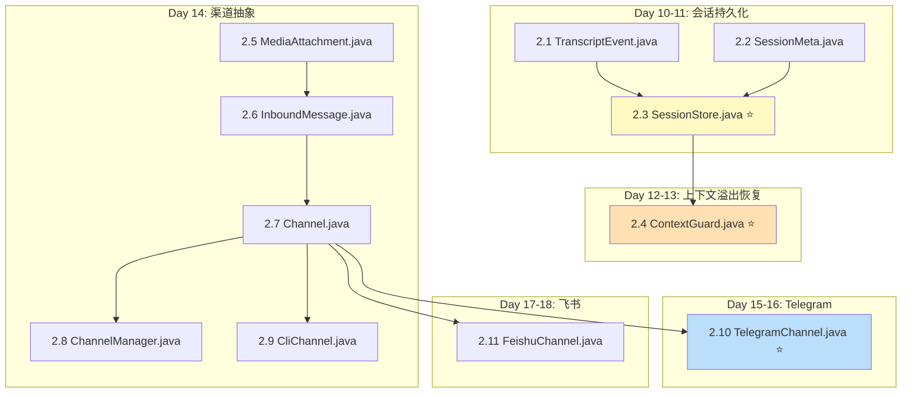
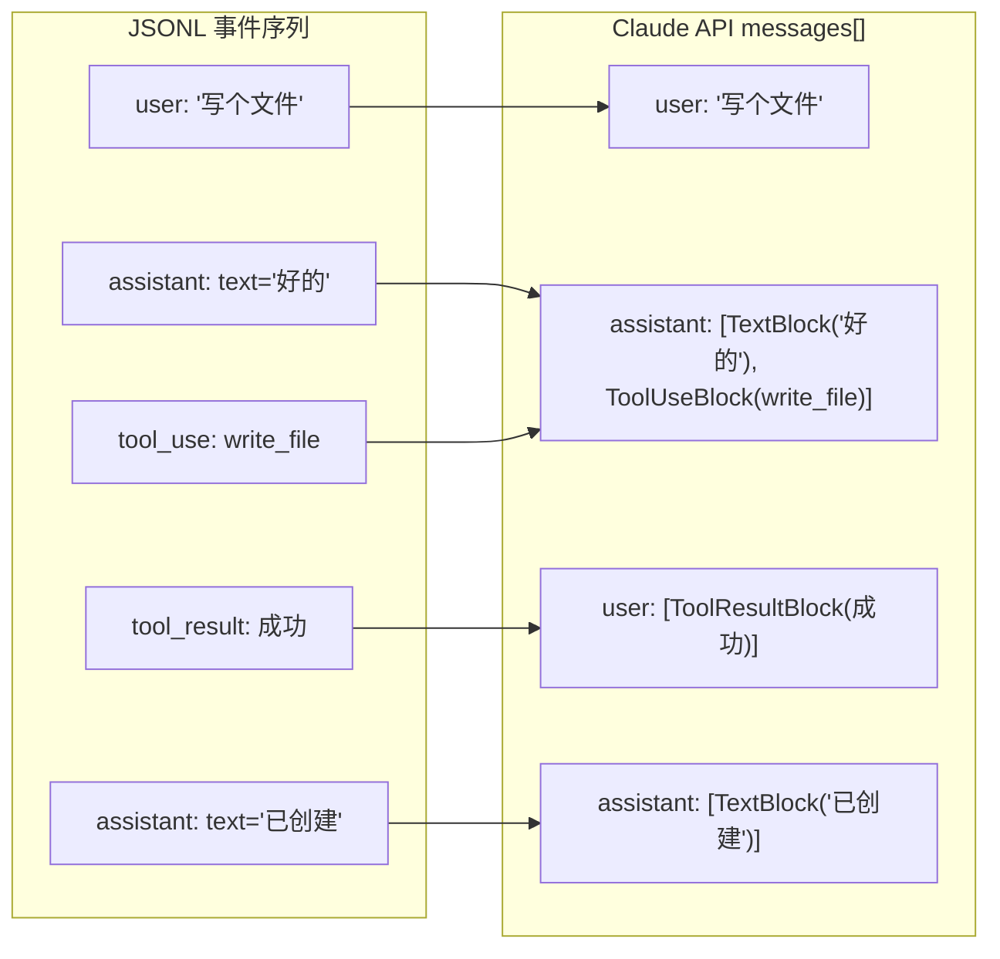
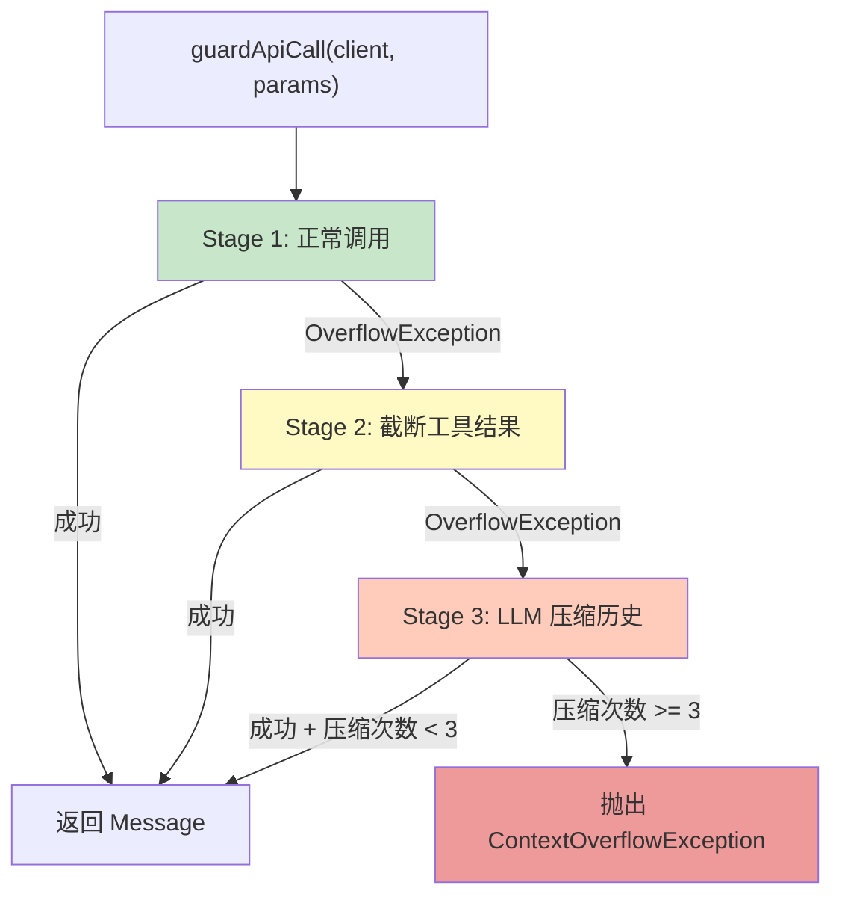
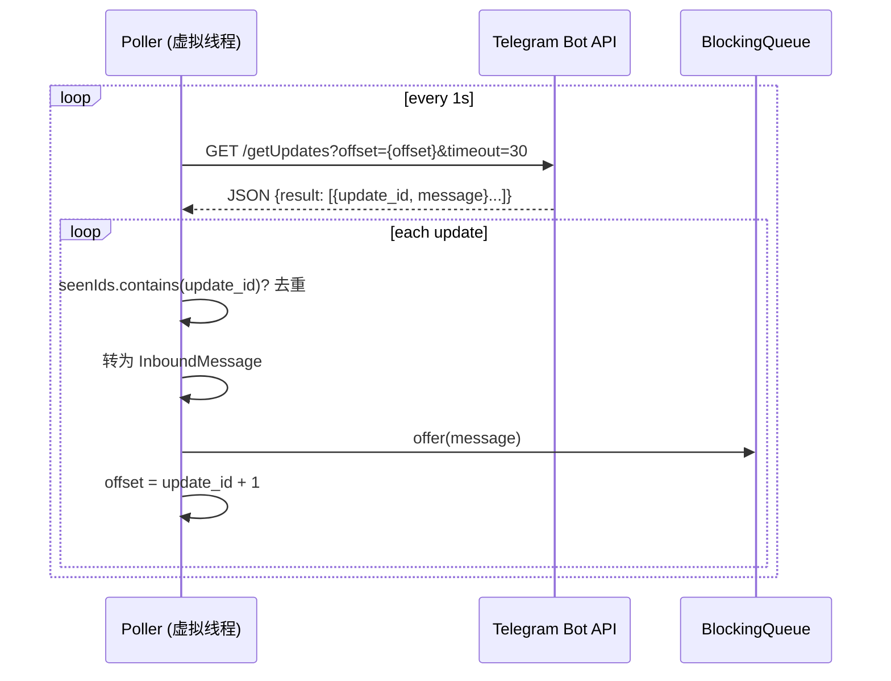
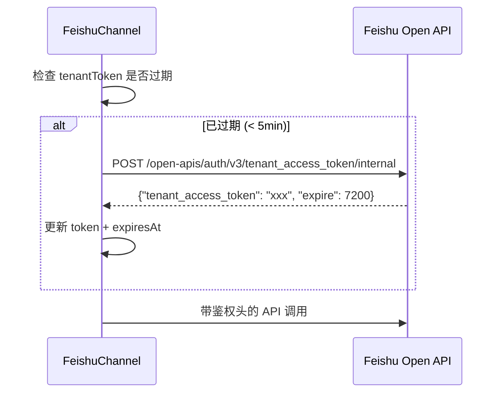

# Sprint 2: 持久化与渠道 (Day 10-19)

> **目标**: 会话 JSONL 持久化，CLI/Telegram/飞书多渠道接入
> **里程碑 M2**: 重启后会话恢复，CLI 可交互，至少一个外部渠道可用
> **claw0 参考**: `sessions/en/s03_sessions.py` + `sessions/en/s04_channels.py`

---

## 1. 实施依赖图



---

## 2. Day 10-11: 会话持久化

### 2.1 文件 2.1 — `TranscriptEvent.java`

**claw0 参考**: `s03_sessions.py` 第 100-150 行 JSONL 事件格式

```java
public record TranscriptEvent(
    String type,         // "user", "assistant", "tool_use", "tool_result"
    String role,         // "user", "assistant"
    Object content,      // String 或 List<ContentBlock>
    String toolName,     // 仅 tool_use
    String toolId,       // 仅 tool_use / tool_result
    Map<String, Object> input,  // 仅 tool_use — 工具调用参数 (历史重建必需)
    Instant timestamp
) {}
```

**序列化注意**: Jackson 需要配置 `@JsonInclude(NON_NULL)` 以跳过 toolUse 场景中为 null 的字段（包括 `toolName`, `toolId`, `input`）。

### 2.2 文件 2.2 — `SessionMeta.java`

**claw0 参考**: `s03_sessions.py` 第 80-100 行 `sessions.json` 索引格式

```java
public record SessionMeta(
    String sessionId,
    String agentId,
    String label,
    Instant createdAt,
    Instant lastActive,
    int messageCount
) {}
```

### 2.3 文件 2.3 — `SessionStore.java` ⭐

**claw0 参考**: `s03_sessions.py` 第 200-500 行 `SessionStore` 类

**核心职责**:
1. JSONL 文件读写
2. 会话索引 (sessions.json) 管理
3. JSONL → Claude API MessageParam 历史重建

**文件系统布局**:
```
workspace/.sessions/agents/{agentId}/
├── sessions.json                # 会话索引
└── sessions/
    ├── {sessionId}.jsonl        # 会话记录
    └── ...
```

**关键方法实现**:

#### `createSession(agentId, label)`

```java
public String createSession(String agentId, String label) {
    String sessionId = "sess_" + UUID.randomUUID().toString().substring(0, 8);
    Path agentDir = sessionsDir.resolve("agents").resolve(agentId);
    Files.createDirectories(agentDir.resolve("sessions"));

    SessionMeta meta = new SessionMeta(
        sessionId, agentId, label,
        Instant.now(), Instant.now(), 0
    );

    // 更新内存索引
    index.computeIfAbsent(agentId, k -> new LinkedHashMap<>())
         .put(sessionId, meta);
    saveIndex(agentId);

    return sessionId;
}
```

**sessionId → agentId 映射**: `appendTranscript()` 需要 `getAgentId(sessionId)` 获取 Agent 级别锁，
但 `sessionId` (格式 `sess_{uuid}`) 不含 agentId 信息。需维护 `Map<String, String> sessionAgentMap`
在 `createSession()` 时注册，在 `loadIndex()` 时重建。

```java
private final Map<String, String> sessionAgentMap = new ConcurrentHashMap<>();
```

#### `appendTranscript(sessionId, event)` — 核心写入方法

```java
public void appendTranscript(String sessionId, TranscriptEvent event) {
    Path jsonlFile = resolveJsonlPath(sessionId);

    // Agent 级别锁，确保同一 Agent 的写入串行化
    ReentrantLock lock = agentLocks.computeIfAbsent(
        getAgentId(sessionId), k -> new ReentrantLock());
    lock.lock();
    try {
        JsonUtils.appendJsonl(jsonlFile, event);
    } finally {
        lock.unlock();
    }

    // 更新索引中的 messageCount 和 lastActive
    updateSessionMeta(sessionId);
}
```

> **并发安全**: 使用 `ConcurrentHashMap<String, ReentrantLock>` 按 Agent 加锁。
> 原因：多个 Lane (main, cron, heartbeat) 可能同时操作同一 Agent 的会话。

#### `loadSession(sessionId)` — JSONL → MessageParam 重建

**claw0 参考**: `s03_sessions.py` 第 350-450 行 `_rebuild_history()`

```java
public List<MessageParam> loadSession(String sessionId) {
    Path jsonlFile = resolveJsonlPath(sessionId);
    if (!Files.exists(jsonlFile)) return new ArrayList<>();

    List<TranscriptEvent> events = JsonUtils.readJsonl(jsonlFile, TranscriptEvent.class);
    return rebuildHistory(events);
}

private List<MessageParam> rebuildHistory(List<TranscriptEvent> events) {
    List<MessageParam> messages = new ArrayList<>();

    for (TranscriptEvent event : events) {
        switch (event.type()) {
            case "user" -> messages.add(MessageParam.builder()
                .role(Role.USER)
                .addText(TextBlock.builder().text((String) event.content()).build())
                .build());

            case "assistant" -> {
                // content 可能是 String 或 List<ContentBlock>
                // 需要根据实际类型处理
                messages.add(toAssistantMessageParam(event));
            }

            case "tool_use" -> {
                // tool_use 是 assistant 消息的一部分
                // 如果上一条已经是 assistant，合并；否则创建新的
                appendToolUseToLastAssistant(messages, event);
            }

            case "tool_result" -> {
                messages.add(MessageParam.builder()
                    .role(Role.USER)
                    .content(List.of(ToolResultBlock.builder()
                        .toolUseId(event.toolId())
                        .content((String) event.content())
                        .build()))
                    .build());
            }
        }
    }
    return messages;
}
```

**⚠️ 重建逻辑的关键难点**:

claw0 的 JSONL 格式中，`tool_use` 和 `assistant` 文本是分开的事件，但 Claude API 要求它们在同一个 assistant message 中。重建时需要：



**处理策略**: 维护一个 "pending assistant builder"，连续的 `assistant` + `tool_use` 事件合并到同一个 MessageParam 中，遇到 `user` 或 `tool_result` 时 flush。

---

## 3. Day 12-13: 上下文溢出恢复

### 3.1 文件 2.4 — `ContextGuard.java` ⭐

**claw0 参考**: `s03_sessions.py` 第 500-700 行 `ContextGuard` 类

**三阶段策略**:



**核心实现**:

```java
@Service
public class ContextGuard {
    private final TokenEstimator tokenEstimator;
    private static final int MAX_COMPACT_ROUNDS = 3;

    // Note: 不持有 AnthropicClient，通过参数传入
    // 这样 Sprint 6 的 ResilienceRunner 可以为每个 Profile 注入不同的 client

    public Message guardApiCall(AnthropicClient client, MessageCreateParams params) {
        try {
            return stage1NormalCall(client, params);
        } catch (Exception ex) {
            if (!isContextOverflow(ex)) throw ex;
        }

        // Stage 2: 截断过长的工具结果
        try {
            var truncated = stage2TruncateToolResults(params);
            return stage1NormalCall(client, truncated);
        } catch (Exception ex) {
            if (!isContextOverflow(ex)) throw ex;
        }

        // Stage 3: LLM 压缩历史
        return stage3CompactHistory(client, params);
    }
}
```

> **设计说明**: ContextGuard 不持有 AnthropicClient，而是通过方法参数传入。
> 这使得 Sprint 6 的 ResilienceRunner 可以在轮转 Profile 时为每次调用注入不同的 client，
> 而 ContextGuard 的溢出恢复逻辑无需关心当前使用的是哪个 Profile。

#### Stage 2 — 截断工具结果

**claw0 参考**: `s03_sessions.py` 第 580-620 行

```java
private MessageCreateParams stage2TruncateToolResults(MessageCreateParams params) {
    List<MessageParam> truncated = new ArrayList<>();
    for (MessageParam msg : params.messages()) {
        if (msg.role() == Role.USER && hasToolResults(msg)) {
            truncated.add(truncateToolResultContent(msg, 0.3));  // 保留前 30%
        } else {
            truncated.add(msg);
        }
    }
    return rebuildParams(params, truncated);
}
```

#### Stage 3 — LLM 压缩历史

**claw0 参考**: `s03_sessions.py` 第 620-700 行

```java
private Message stage3CompactHistory(AnthropicClient client, MessageCreateParams params) {
    List<MessageParam> messages = new ArrayList<>(params.messages());
    int total = messages.size();

    for (int round = 0; round < MAX_COMPACT_ROUNDS; round++) {
        // 取最旧 50%，用 LLM 生成摘要
        int splitPoint = (int) (total * 0.5);
        List<MessageParam> oldPart = messages.subList(0, splitPoint);
        List<MessageParam> recentPart = messages.subList(splitPoint, total);

        // 调用 LLM 生成摘要
        String summary = generateSummary(client, oldPart);

        // 重建消息列表: [摘要] + [最近 50%]
        messages = new ArrayList<>();
        messages.add(MessageParam.builder()
            .role(Role.USER)
            .addText("[Context Summary] " + summary)
            .build());
        messages.addAll(recentPart);

        try {
            return stage1NormalCall(client, rebuildParams(params, messages));
        } catch (Exception ex) {
            if (!isContextOverflow(ex)) throw ex;
            // 继续压缩
        }
    }
    throw new ContextOverflowException("Failed after " + MAX_COMPACT_ROUNDS + " compaction rounds");
}
```

**溢出检测**:

```java
private boolean isContextOverflow(Exception ex) {
    String msg = ex.getMessage().toLowerCase();
    return msg.contains("context") && msg.contains("overflow")
        || msg.contains("too many tokens")
        || msg.contains("max_context")
        || ex.getClass().getSimpleName().contains("Overloaded");  // SDK 异常类名
}
```

> **⚠️ 注意**: Anthropic Java SDK 的溢出异常类型需要在 Day 12 的验证测试中确认。
> 准备降级方案：用异常消息文本匹配而非类型匹配。

---

## 4. Day 14: 渠道抽象

### 4.1 文件 2.5-2.6 — 数据 records

- `MediaAttachment.java`: `String type`, `String url`, `String mimeType`
- `InboundMessage.java`: 参见 01-module-design.md 4.1 节完整字段

### 4.2 文件 2.7 — `Channel.java`

**claw0 参考**: `s04_channels.py` 第 50-70 行 `Channel` ABC

```java
public interface Channel {
    /** 渠道名称 (如 "cli", "telegram", "feishu") */
    String getName();

    /** 非阻塞接收消息，无消息返回 Optional.empty() */
    Optional<InboundMessage> receive();

    /** 发送消息到指定目标 */
    boolean send(String to, String text);

    /** 关闭渠道连接 */
    void close();
}
```

### 4.3 文件 2.8 — `ChannelManager.java`

**claw0 参考**: `s04_channels.py` 第 70-100 行 `ChannelManager`

```java
@Service
public class ChannelManager {
    private final Map<String, Channel> channels = new ConcurrentHashMap<>();

    /** Spring 构造器注入自动收集 */
    public ChannelManager(List<Channel> channelList) {
        channelList.forEach(c -> channels.put(c.getName(), c));
    }

    public void stopReceiving() { /* 停止所有渠道的轮询 */ }
    public void closeAll() { channels.values().forEach(Channel::close); }
}
```

### 4.4 文件 2.9 — `CliChannel.java`

**claw0 参考**: `s04_channels.py` 第 100-150 行 `CLIChannel`

**实现方案**:
- 后台线程读取 `System.in`，放入 `BlockingQueue<String>`
- `receive()` 从队列 poll（非阻塞）
- `send()` 直接 `System.out.println()`

```java
@Component
public class CliChannel implements Channel {
    private final BlockingQueue<String> inputQueue = new LinkedBlockingQueue<>();
    private volatile boolean running = true;

    public CliChannel() {
        // 后台 stdin 读取线程
        Thread.ofVirtual().name("cli-stdin").start(() -> {
            try (var reader = new BufferedReader(new InputStreamReader(System.in))) {
                while (running) {
                    String line = reader.readLine();
                    if (line != null) inputQueue.offer(line);
                    else break;  // EOF
                }
            } catch (IOException e) {
                // 日志记录
            }
        });
    }

    @Override
    public Optional<InboundMessage> receive() {
        String text = inputQueue.poll();
        if (text == null) return Optional.empty();
        return Optional.of(new InboundMessage(
            text, "user", "cli", "cli", "user", null,
            false, List.of(), null, Instant.now()
        ));
    }

    @Override
    public boolean send(String to, String text) {
        System.out.println(text);
        return true;
    }
}
```

---

## 5. Day 15-16: Telegram 渠道

### 5.1 文件 2.10 — `TelegramChannel.java` ⭐

**claw0 参考**: `s04_channels.py` 第 150-400 行 `TelegramChannel`

**条件注册**:
```java
@Component
@ConditionalOnProperty(name = "channels.telegram.enabled", havingValue = "true")
public class TelegramChannel implements Channel { ... }
```

**核心机制 — 长轮询**:



**关键实现细节**:

```java
// 去重集合，上限 5000
private final LinkedHashSet<Long> seenIds = new LinkedHashSet<>();
private static final int MAX_SEEN_IDS = 5000;

// 消息队列
private final BlockingQueue<InboundMessage> messageQueue = new LinkedBlockingQueue<>();

// 轮询线程
@PostConstruct
void startPolling() {
    Thread.ofVirtual().name("telegram-poller").start(() -> {
        while (running) {
            try {
                pollUpdates();
            } catch (Exception e) {
                log.warn("Telegram poll error", e);
                Thread.sleep(Duration.ofSeconds(5));
            }
        }
    });
}

private void pollUpdates() throws Exception {
    HttpRequest request = HttpRequest.newBuilder()
        .uri(URI.create("https://api.telegram.org/bot" + token
            + "/getUpdates?offset=" + offset + "&timeout=30"))
        .GET().build();

    HttpResponse<String> response = httpClient.send(request, BodyHandlers.ofString());
    JsonNode root = objectMapper.readTree(response.body());

    for (JsonNode update : root.path("result")) {
        long updateId = update.path("update_id").asLong();
        if (seenIds.contains(updateId)) continue;

        seenIds.add(updateId);
        if (seenIds.size() > MAX_SEEN_IDS) {
            seenIds.remove(seenIds.iterator().next());  // 移除最旧
        }

        // 转换为 InboundMessage
        JsonNode message = update.path("message");
        InboundMessage inbound = convertToInboundMessage(message);
        messageQueue.offer(inbound);

        offset = updateId + 1;
    }
}
```

**发送 — 支持 Markdown**:

```java
@Override
public boolean send(String to, String text) {
    // 按平台限制分块 (4096 字符)
    List<String> chunks = MessageChunker.chunk(text, "telegram");
    for (String chunk : chunks) {
        // POST /sendMessage
        // body: {"chat_id": to, "text": chunk, "parse_mode": "Markdown"}
    }
    return true;
}
```

---

## 6. Day 17-18: 飞书渠道

### 6.1 文件 2.11 — `FeishuChannel.java`

**claw0 参考**: `s04_channels.py` 第 400-650 行 `FeishuChannel`

**条件注册**: `@ConditionalOnProperty(name = "channels.feishu.enabled", havingValue = "true")`

**OAuth Token 自动刷新**:



**飞书渠道特点**:
- **消息接收**: Webhook 回调 (需要 Spring MVC Controller 端点接收 POST)
- **@提及检测**: 解析消息中的 `mentions` 数组
- **内容类型**: text (纯文本), post (富文本), image (图片)

---

## 7. 集成修改 — 修改 AgentLoop

Sprint 2 完成后，修改 Sprint 1 的 `AgentLoop` 接入 SessionStore：

```java
// AgentLoop.java — 新增 SessionStore 依赖
@Service
public class AgentLoop {
    private final SessionStore sessionStore;  // 新增
    private final ContextGuard contextGuard;  // 新增

    public AgentTurnResult runTurn(String agentId, String sessionId, String userMessage) {
        // 1. 加载历史
        List<MessageParam> messages = sessionStore.loadSession(sessionId);

        // 2. 追加用户消息到 JSONL
        sessionStore.appendTranscript(sessionId,
            new TranscriptEvent("user", "user", userMessage, null, null, null, Instant.now()));

        // 3. 添加用户消息到 API messages
        messages.add(MessageParam.builder()
            .role(Role.USER)
            .addText(TextBlock.builder().text(userMessage).build())
            .build());

        // 4. 用 ContextGuard 包装 API 调用
        AgentTurnResult result = contextGuard.guardedCall(client, params, messages);

        // 5. 持久化助手回复和工具调用
        sessionStore.appendTranscript(sessionId,
            new TranscriptEvent("assistant", "assistant", result.text(), null, null, null, Instant.now()));

        // For tool_use events:
        sessionStore.appendTranscript(sessionId,
            new TranscriptEvent("tool_use", "assistant", null, toolUse.name(), toolUse.id(),
                (Map<String, Object>) toolUse.input(), Instant.now()));

        return result;
    }
}
```

---

## 8. 测试清单

| 测试类 | 关键场景 | 优先级 |
|--------|---------|--------|
| `SessionStoreTest` | 创建/加载/追加/索引管理 | P0 |
| `SessionStoreTest` | JSONL → MessageParam 重建 (含 tool_use 合并) | P0 |
| `SessionStoreTest` | 并发写入安全性 (2 线程同时追加) | P1 |
| `ContextGuardTest` | Stage 1 正常调用 | P0 |
| `TranscriptEventSerializationTest` | JSONL 序列化/反序列化往返 (含 input 字段) | P0 |
| `SessionStoreTest` | sessionId → agentId 映射正确维护 | P1 |
| `ContextGuardTest` | 接受外部 client 参数执行调用 | P0 |
| `ContextGuardTest` | Stage 2 截断工具结果后成功 | P0 |
| `ContextGuardTest` | Stage 3 压缩后成功 | P1 |
| `ContextGuardTest` | 3 次压缩后仍失败 → 抛异常 | P1 |
| `CliChannelTest` | 发送消息到 stdout | P2 |
| `TelegramChannelTest` | Mock HTTP 测试长轮询逻辑 | P1 |
| `FeishuChannelTest` | Mock HTTP 测试 token 刷新 | P2 |

---

## 9. 验收检查清单 (M2)

- [ ] `SessionStore.createSession()` 创建 JSONL 文件和索引
- [ ] `SessionStore.appendTranscript()` 正确追加事件
- [ ] `SessionStore.loadSession()` 重建的 messages 与原始 API 调用一致
- [ ] 上下文溢出时自动恢复 (Stage 2 或 Stage 3 成功)
- [ ] CLI 渠道可正常收发
- [ ] Telegram 渠道可收发 (需 Bot Token)
- [ ] 重启后会话从 JSONL 恢复
- [ ] 并发场景下 JSONL 文件不会损坏
- [ ] TranscriptEvent 的 `input` 字段在 JSONL 中正确序列化和反序列化
- [ ] ContextGuard 不持有自己的 AnthropicClient，通过方法参数传入
- [ ] SessionStore 的 `sessionAgentMap` 正确维护 sessionId → agentId 映射
- [ ] 启动后 `.sessions/` 目录结构正确创建
