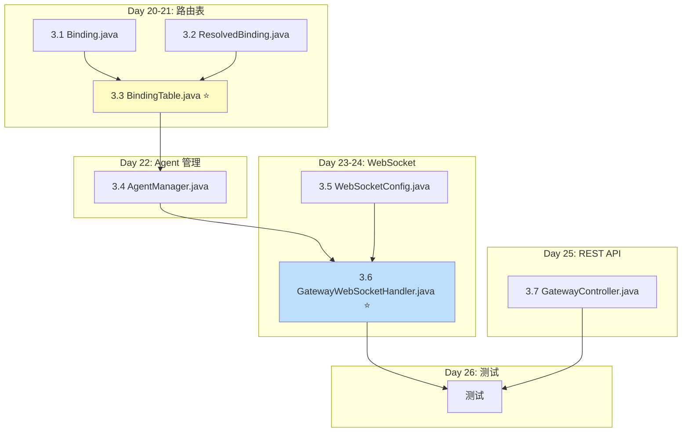
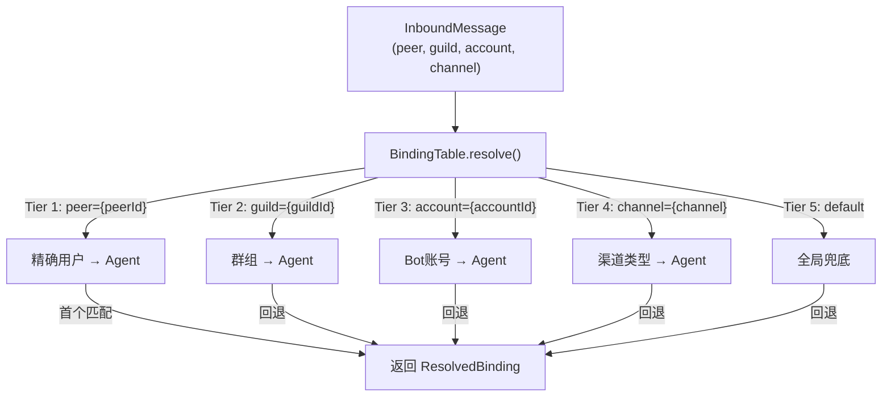

# Sprint 3: 网关与路由 (Day 20-26)

> **目标**: WebSocket 网关 + 5 级路由表 + 多 Agent 管理
> **里程碑 M3**: WS 客户端通过 JSON-RPC 发消息，路由表正确匹配，REST API 可用
> **claw0 参考**: `sessions/en/s05_gateway_routing.py`

---

## 1. 实施依赖图



---

## 2. Day 20-21: 路由表

### 2.1 文件 3.1-3.2 — Binding records

**claw0 参考**: `s05_gateway_routing.py` 第 30-60 行 `Binding` 类

```java
// Binding.java
public record Binding(
    int tier,                           // 1-5
    String key,                         // 匹配键值
    String agentId,                     // 目标 Agent
    int priority,                       // 同 tier 内排序
    Map<String, String> metadata        // 可选元数据
) {}

// ResolvedBinding.java
public record ResolvedBinding(
    String agentId,
    Binding binding
) {}
```

### 2.2 文件 3.3 — `BindingTable.java` ⭐

**claw0 参考**: `s05_gateway_routing.py` 第 60-150 行 `BindingTable` 类

**5 级路由匹配**:



**核心实现**:

```java
@Service
public class BindingTable {
    private final List<Binding> bindings = new CopyOnWriteArrayList<>();

    /**
     * 解析路由：按 tier 升序、priority 降序，返回首个匹配
     */
    public Optional<ResolvedBinding> resolve(String channel, String accountId,
                                              String guildId, String peerId) {
        // 按排序规则遍历: tier ASC, priority DESC
        return bindings.stream()
            .sorted(Comparator
                .comparingInt(Binding::tier)
                .thenComparing(Comparator.comparingInt(Binding::priority).reversed()))
            .filter(b -> matches(b, channel, accountId, guildId, peerId))
            .findFirst()
            .map(b -> new ResolvedBinding(b.agentId(), b));
    }

    private boolean matches(Binding b, String channel, String accountId,
                            String guildId, String peerId) {
        return switch (b.tier()) {
            case 1 -> peerId != null && peerId.equals(b.key());
            case 2 -> guildId != null && guildId.equals(b.key());
            case 3 -> accountId != null && accountId.equals(b.key());
            case 4 -> channel != null && channel.equals(b.key());
            case 5 -> "default".equals(b.key());
            default -> false;
        };
    }
}
```

**线程安全**: 使用 `CopyOnWriteArrayList` — 读多写少场景（绑定变更不频繁）。

### 2.3 文件 — `BindingStore.java`

**JSONL 持久化**: 运行时动态添加的路由绑定需要持久化到磁盘，重启后自动恢复。

```java
@Service
public class BindingStore {
    private final Path storePath;  // workspace/bindings.jsonl
    private final BindingTable bindingTable;

    @PostConstruct
    void loadBindings() {
        if (!Files.exists(storePath)) return;
        JsonUtils.readJsonl(storePath, Binding.class)
            .forEach(bindingTable::addBinding);
    }

    /** 添加绑定并持久化 */
    public void addAndPersist(Binding binding) {
        bindingTable.addBinding(binding);
        appendToStore(binding);
    }

    /** 移除绑定并更新存储 */
    public boolean removeAndPersist(int tier, String key) {
        boolean removed = bindingTable.removeBinding(tier, key);
        if (removed) rewriteStore();
        return removed;
    }

    private void appendToStore(Binding binding) {
        JsonUtils.appendJsonl(storePath, binding);
    }

    private void rewriteStore() {
        // 全量重写 (remove 时需要)
        List<Binding> all = bindingTable.listBindings();
        FileUtils.writeAtomically(storePath,
            all.stream().map(JsonUtils::toJson).collect(Collectors.joining("\n")));
    }
}
```

**文件格式** (`workspace/bindings.jsonl`):
```jsonl
{"tier":5,"key":"default","agentId":"luna","priority":0}
{"tier":4,"key":"telegram","agentId":"luna","priority":0}
{"tier":1,"key":"user_12345","agentId":"sage","priority":10}
```

---

## 3. Day 22: Agent 管理

### 3.1 文件 3.4 — `AgentManager.java`

**claw0 参考**: `s05_gateway_routing.py` 第 150-280 行 `AgentManager` 类

**核心职责**:
1. Agent 注册/注销
2. 会话键构建 (DmScope)
3. 默认 Agent 提供

**会话键构建**:

```java
@Service
public class AgentManager {
    private final Map<String, AgentConfig> agents = new ConcurrentHashMap<>();
    private final GatewayProperties gatewayProps;

    public String buildSessionKey(String agentId, InboundMessage msg) {
        AgentConfig config = getAgent(agentId)
            .orElseThrow(() -> new AgentException(agentId, "Agent not found"));

        return switch (config.dmScope()) {
            case MAIN -> "agent:" + agentId + ":main";
            case PER_PEER -> "agent:" + agentId + ":peer:" + msg.peerId();
            case PER_CHANNEL_PEER -> "agent:" + agentId + ":" + msg.channel() + ":" + msg.peerId();
            case PER_ACCOUNT_CHANNEL_PEER ->
                "agent:" + agentId + ":" + msg.accountId() + ":" + msg.channel() + ":" + msg.peerId();
        };
    }

    /** Agent ID 规范化: 小写，匹配 [a-z0-9][a-z0-9_-]{0,63} */
    public String normalizeAgentId(String raw) {
        String normalized = raw.toLowerCase().replaceAll("[^a-z0-9_-]", "");
        return normalized.substring(0, Math.min(normalized.length(), 64));
    }
}
```

### 3.2.1 文件 — `AgentStore.java`

**JSONL 持久化**: 运行时动态注册的 Agent 配置需要持久化到磁盘。

```java
@Service
public class AgentStore {
    private final Path storePath;  // workspace/agents.jsonl
    private final AgentManager agentManager;

    @PostConstruct
    void loadAgents() {
        if (!Files.exists(storePath)) return;
        JsonUtils.readJsonl(storePath, AgentConfig.class)
            .forEach(agentManager::register);
    }

    /** 注册 Agent 并持久化 */
    public void registerAndPersist(AgentConfig config) {
        agentManager.register(config);
        JsonUtils.appendJsonl(storePath, config);
    }

    /** 注销 Agent 并更新存储 */
    public boolean unregisterAndPersist(String agentId) {
        // AgentManager.unregister 是移除操作
        agentManager.unregister(agentId);
        rewriteStore();
        return true;
    }

    private void rewriteStore() {
        List<AgentConfig> all = agentManager.listAgents();
        FileUtils.writeAtomically(storePath,
            all.stream().map(JsonUtils::toJson).collect(Collectors.joining("\n")));
    }
}
```

**文件格式** (`workspace/agents.jsonl`):
```jsonl
{"id":"luna","name":"Luna","personality":"温暖、好奇、轻幽默","model":"claude-sonnet-4-20250514","dmScope":"PER_PEER"}
```

---

## 3.5 Day 22: 认证扩展点

### 3.5.1 文件 — `AuthFilter.java`

```java
package com.openclaw.enterprise.auth;

/**
 * 认证过滤器接口 — 预留扩展点
 * 默认实现为放行所有请求。生产环境可替换为自定义实现（如 API Key、JWT）。
 *
 * 替换方式：注册一个 @Component 且不使用 @Primary 的实现类即可覆盖默认行为。
 */
public interface AuthFilter {
    /**
     * 校验请求是否被允许
     * @param token 请求携带的认证令牌 (来自 Header、Query 或 WebSocket 握手)
     * @param path 请求路径
     * @return true=放行, false=拒绝
     */
    boolean allow(String token, String path);
}
```

### 3.5.2 文件 — `DefaultAuthFilter.java`

```java
@Component
@Primary
@ConditionalOnMissingBean(AuthFilter.class)
public class DefaultAuthFilter implements AuthFilter {
    @Override
    public boolean allow(String token, String path) {
        return true;  // 默认放行所有请求
    }
}
```

> **扩展方式**: 生产环境中，创建一个 `@Component` 实现类即可自动替换默认行为：
> ```java
> @Component
> public class ApiKeyAuthFilter implements AuthFilter {
>     @Value("${auth.api-key}") private String apiKey;
>     @Override
>     public boolean allow(String token, String path) {
>         return apiKey.equals(token);
>     }
> }
> ```

### 3.6 文件 — `ConcurrencyProperties.java`

```java
@ConfigurationProperties(prefix = "concurrency")
public record ConcurrencyProperties(
    Map<String, LaneConfig> lanes
) {
    public record LaneConfig(int maxConcurrency) {}
}
```

This allows `CommandQueue.getMaxConcurrency()` to read from configuration instead of hardcoding.

---

## 4. Day 23-24: WebSocket 网关

### 4.1 文件 3.5 — `WebSocketConfig.java`

```java
@Configuration
public class WebSocketConfig implements WebSocketConfigurer {
    @Override
    public void registerWebSocketHandlers(WebSocketHandlerRegistry registry) {
        registry.addHandler(gatewayWebSocketHandler(), "/ws/gateway")
            .setAllowedOrigins("*");
    }

    @Bean
    public GatewayWebSocketHandler gatewayWebSocketHandler() {
        return new GatewayWebSocketHandler();
    }
}
```

### 4.2 文件 3.6 — `GatewayWebSocketHandler.java` ⭐

**claw0 参考**: `s05_gateway_routing.py` 第 280-500 行 `GatewayServer` 类

**JSON-RPC 2.0 协议**:

```java
@Component
public class GatewayWebSocketHandler extends TextWebSocketHandler {
    private final BindingTable bindingTable;
    private final AgentManager agentManager;
    private final Set<WebSocketSession> sessions = ConcurrentHashMap.newKeySet();

    @Override
    public void afterConnectionEstablished(WebSocketSession session) {
        sessions.add(session);
    }

    @Override
    protected void handleTextMessage(WebSocketSession session, TextMessage message) {
        try {
            JsonNode request = objectMapper.readTree(message.getPayload());

            String method = request.path("method").asText();
            String id = request.has("id") ? request.path("id").asText() : null;
            JsonNode params = request.path("params");

            Object result = dispatch(method, params);
            sendResponse(session, id, result);

        } catch (Exception e) {
            sendError(session, extractId(message), -32603, e.getMessage());
        }
    }

    private Object dispatch(String method, JsonNode params) {
        return switch (method) {
            case "send"           -> handleSend(params);
            case "bindings.set"   -> handleBindSet(params);
            case "bindings.list"  -> bindingTable.listBindings();
            case "bindings.remove"-> handleBindRemove(params);
            case "sessions.list"  -> handleSessionsList(params);
            case "agents.list"    -> agentManager.listAgents();
            case "agents.register"-> handleAgentRegister(params);
            case "status"         -> handleStatus();
            default -> throw new JsonRpcException(-32601, "Method not found: " + method);
        };
    }
}
```

**`handleSend()` 核心逻辑**:

```java
private Object handleSend(JsonNode params) {
    String channel = params.path("channel").asText("api");
    String peerId = params.path("peer_id").asText("api-user");
    String accountId = params.path("account_id").asText("");
    String guildId = params.path("guild_id").asText(null);

    // 1. 路由解析
    ResolvedBinding binding = bindingTable.resolve(channel, accountId, guildId, peerId)
        .orElseThrow(() -> new AgentException("default", "No binding found"));

    // 2. 会话键构建
    String sessionKey = agentManager.buildSessionKey(binding.agentId(), /* InboundMessage */ ...);

    // 3. 执行对话 (Sprint 6 后通过 CommandQueue，当前直接调用)
    AgentTurnResult result = agentLoop.runTurn(binding.agentId(), sessionKey,
        params.path("text").asText());

    // 4. 投递回复 (Sprint 5 后通过 DeliveryQueue)
    return Map.of("status", "ok", "text", result.text());
}
```

**通知广播**:

```java
/** 向所有 WebSocket 客户端广播 JSON-RPC 通知 */
private void broadcast(String method, Object params) {
    String payload = objectMapper.writeValueAsString(Map.of(
        "jsonrpc", "2.0",
        "method", method,
        "params", params
    ));
    for (WebSocketSession session : sessions) {
        if (session.isOpen()) {
            session.sendMessage(new TextMessage(payload));
        }
    }
}

/** Agent 正在处理中 */
private void broadcastTyping(String agentId) {
    broadcast("typing", Map.of("agent_id", agentId));
}

/** Agent 处理完成 */
private void broadcastTypingStop(String agentId) {
    broadcast("typing.stop", Map.of("agent_id", agentId));
}

/** 心跳输出通知 */
public void notifyHeartbeatOutput(String agentId, String text) {
    broadcast("heartbeat.output", Map.of("agent_id", agentId, "text", text));
}

/** Cron 任务输出通知 */
public void notifyCronOutput(String jobId, String agentId, String text) {
    broadcast("cron.output", Map.of("job_id", jobId, "agent_id", agentId, "text", text));
}

/** 投递失败通知 */
public void notifyDeliveryFailed(String deliveryId, String error) {
    broadcast("delivery.failed", Map.of("delivery_id", deliveryId, "error", error));
}
```

---

## 5. Day 25: REST API

### 5.1 文件 3.7 — `GatewayController.java`

**claw0 参考**: `s05_gateway_routing.py` 中的 REST 端点 (Java 新增，claw0 仅有 WebSocket)

```java
@RestController
@RequestMapping("/api/v1")
public class GatewayController {

    // Agent 管理
    @GetMapping("/agents")
    public ResponseEntity<?> listAgents() { ... }

    @PostMapping("/agents")
    public ResponseEntity<?> registerAgent(@RequestBody @Valid AgentConfig config) { ... }

    @DeleteMapping("/agents/{id}")
    public ResponseEntity<?> unregisterAgent(@PathVariable String id) { ... }

    // 路由管理
    @GetMapping("/bindings")
    public ResponseEntity<?> listBindings() { ... }

    @PostMapping("/bindings")
    public ResponseEntity<?> addBinding(@RequestBody Binding binding) { ... }

    @DeleteMapping("/bindings/{tier}/{key}")
    public ResponseEntity<?> removeBinding(@PathVariable int tier, @PathVariable String key) { ... }

    // 会话管理
    @GetMapping("/sessions")
    public ResponseEntity<?> listSessions(@RequestParam Optional<String> agent_id) { ... }

    @GetMapping("/sessions/{id}/history")
    public ResponseEntity<?> getSessionHistory(@PathVariable String id) { ... }

    @PostMapping("/sessions/{id}/compact")
    public ResponseEntity<?> compactSession(@PathVariable String id) { ... }

    // 消息收发
    @PostMapping("/send")
    public ResponseEntity<?> sendMessage(@RequestBody SendRequest request) { ... }

    // 系统运维
    @GetMapping("/status")
    public ResponseEntity<?> getStatus() { ... }

    // 会话创建
    @PostMapping("/sessions")
    public ResponseEntity<?> createSession(@RequestBody CreateSessionRequest request) { ... }

    // 获取单个 Agent
    @GetMapping("/agents/{id}")
    public ResponseEntity<?> getAgent(@PathVariable String id) { ... }

    // 投递队列查看
    @GetMapping("/delivery/pending")
    public ResponseEntity<?> getPendingDeliveries() { ... }

    @GetMapping("/delivery/failed")
    public ResponseEntity<?> getFailedDeliveries() { ... }

    // WebSocket 通知端点 (内部调用)
    // typing, heartbeat.output, cron.output 等通过 WebSocket 推送
}
```

**统一错误处理**:

```java
@RestControllerAdvice
public class GlobalExceptionHandler {
    @ExceptionHandler(AgentException.class)
    public ResponseEntity<?> handleAgentNotFound(AgentException ex) {
        return ResponseEntity.status(404).body(Map.of(
            "error", Map.of(
                "code", "AGENT_NOT_FOUND",
                "message", ex.getMessage()
            ),
            "timestamp", Instant.now(),
            "path", request.getRequestURI()
        ));
    }
}
```

---

## 6. 测试清单

| 测试类 | 关键场景 | 优先级 |
|--------|---------|--------|
| `BindingTableTest` | 5 级匹配逻辑 | P0 |
| `BindingTableTest` | 同 tier 内 priority 排序 | P0 |
| `BindingTableTest` | 无匹配时返回 empty | P0 |
| `BindingTableTest` | 动态添加/移除绑定 | P1 |
| `AgentManagerTest` | 会话键构建 (4 种 DmScope) | P0 |
| `AgentManagerTest` | Agent ID 规范化 | P1 |
| `GatewayWebSocketHandlerTest` | JSON-RPC 协议解析 | P0 |
| `GatewayWebSocketHandlerTest` | 未知 method 返回 -32601 | P0 |
| `GatewayWebSocketHandlerTest` | 多客户端广播通知 | P1 |
| `GatewayControllerTest` | REST API CRUD | P1 |
| `GatewayIntegrationTest` | WS 连接 → 发消息 → 收回复 | P0 |
| `AuthFilterTest` | DefaultAuthFilter 放行所有请求 | P1 |
| `BindingStoreTest` | JSONL 加载/追加/全量重写 | P0 |
| `AgentStoreTest` | JSONL 加载/注册/注销持久化 | P0 |

---

## 7. 验收检查清单 (M3)

- [ ] `wscat -c ws://localhost:8080/ws/gateway` 连接成功
- [ ] JSON-RPC `send` 方法正常工作
- [ ] `bindings.set` / `bindings.list` / `bindings.remove` 正常
- [ ] `agents.list` / `agents.register` 正常
- [ ] 5 级路由正确匹配（peer > guild > account > channel > default）
- [ ] REST API `GET /api/v1/agents` 返回 Agent 列表
- [ ] REST API `POST /api/v1/send` 发送消息并收到回复
- [ ] 多个 WebSocket 客户端可同时连接
- [ ] 错误请求返回正确的 JSON-RPC 错误码
- [ ] `AuthFilter` 接口 + `DefaultAuthFilter` 默认放行实现正确注册
- [ ] 自定义 `AuthFilter` 实现可覆盖默认实现
- [ ] `BindingStore` 启动时从 `bindings.jsonl` 恢复路由规则
- [ ] `AgentStore` 启动时从 `agents.jsonl` 恢复 Agent 配置
- [ ] 动态添加的绑定和 Agent 重启后不丢失
- [ ] `POST /api/v1/sessions` 创建新会话端点可用
- [ ] `GET /api/v1/agents/{id}` 获取单个 Agent 端点可用
- [ ] WebSocket `typing` / `typing.stop` 通知正常推送
- [ ] `heartbeat.output` / `cron.output` / `delivery.failed` 通知正常推送
