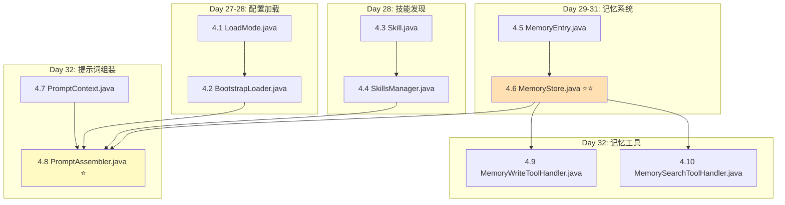
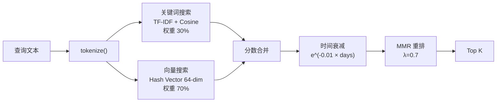

# Sprint 4: 智能层 (Day 27-34)

> **目标**: Agent 拥有人格、技能和记忆
> **里程碑 M4**: 8 层提示词正确组装，技能发现，记忆检索有效
> **claw0 参考**: `sessions/en/s06_intelligence.py`

---

## 1. 实施依赖图



---

## 2. Day 27-28: 配置加载

### 2.1 文件 4.1 — `LoadMode.java`

```java
public enum LoadMode { FULL, MINIMAL, NONE }
```

### 2.2 文件 4.2 — `BootstrapLoader.java`

**claw0 参考**: `s06_intelligence.py` 第 50-180 行 `BootstrapLoader` 类

**加载 8 个 workspace 文件**:

```java
@Service
public class BootstrapLoader {
    private final Path workspacePath;
    private final Map<String, String> fileCache = new ConcurrentHashMap<>();

    private static final List<String> FILE_NAMES = List.of(
        "IDENTITY.md", "SOUL.md", "TOOLS.md", "MEMORY.md",
        "HEARTBEAT.md", "BOOTSTRAP.md", "USER.md", "AGENTS.md"
    );

    // 截断上限
    private static final int MAX_TOTAL_CHARS = 50_000;
    private static final int MAX_FILE_CHARS = 10_000;

    public Map<String, String> loadAll(LoadMode mode) {
        if (mode == LoadMode.NONE) return Map.of();

        Map<String, String> result = new LinkedHashMap<>();
        int totalChars = 0;

        for (String name : FILE_NAMES) {
            String content = loadFile(name);
            if (content == null || content.isBlank()) continue;

            // 截断过长文件
            if (content.length() > MAX_FILE_CHARS) {
                content = content.substring(0, MAX_FILE_CHARS) + "\n... [truncated]";
            }

            // 检查总字符数
            if (totalChars + content.length() > MAX_TOTAL_CHARS) break;

            result.put(name, content);
            totalChars += content.length();
        }

        return result;
    }

    private String loadFile(String name) {
        return fileCache.computeIfAbsent(name, n -> {
            try {
                Path file = workspacePath.resolve(n);
                return Files.exists(file) ? Files.readString(file).trim() : null;
            } catch (IOException e) {
                return null;
            }
        });
    }

    /** 手动刷新缓存 (文件变更时调用) */
    public void reload() {
        fileCache.clear();
    }
}
```

---

## 3. Day 28: 技能发现

### 3.1 文件 4.3 — `Skill.java`

```java
public record Skill(
    String name,
    String description,
    String version,
    String body,        // Markdown 正文
    Path sourcePath     // 源文件路径
) {}
```

### 3.2 文件 4.4 — `SkillsManager.java`

**claw0 参考**: `s06_intelligence.py` 第 180-300 行 `SkillsManager` 类

**技能发现路径 (优先级递增)**:
```
1. workspace/skills/
2. workspace/.skills/
3. workspace/.agents/skills/
4. {cwd}/.agents/skills/
5. {cwd}/skills/           (最高优先级，覆盖同名)
```

**SKILL.md 解析** (YAML frontmatter):

```java
@Service
public class SkillsManager {
    private final Map<String, Skill> skills = new LinkedHashMap<>();
    private static final int MAX_SKILLS = 150;
    private static final int MAX_TOTAL_CHARS = 30_000;

    public void discover(List<Path> dirs) {
        Map<String, Skill> discovered = new LinkedHashMap<>();

        // 按优先级顺序扫描，后扫描的同名技能覆盖先扫描的
        for (Path dir : dirs) {
            if (!Files.isDirectory(dir)) continue;
            try (var stream = Files.walk(dir, 3)) {
                stream.filter(p -> p.getFileName().toString().equals("SKILL.md"))
                      .map(this::parseSkill)
                      .filter(Objects::nonNull)
                      .forEach(s -> discovered.put(s.name(), s));
            }
        }

        // 上限截断
        skills.clear();
        int totalChars = 0;
        for (Skill skill : discovered.values()) {
            if (skills.size() >= MAX_SKILLS) break;
            totalChars += skill.body().length();
            if (totalChars > MAX_TOTAL_CHARS) break;
            skills.put(skill.name(), skill);
        }
    }

    private Skill parseSkill(Path skillFile) {
        String content = Files.readString(skillFile);
        // 解析 YAML frontmatter: ---\nkey: value\n---\nbody
        // 使用 jackson-dataformat-yaml 或手动解析
        Map<String, String> frontmatter = parseFrontmatter(content);
        String body = extractBody(content);
        return new Skill(
            frontmatter.get("name"),
            frontmatter.get("description"),
            frontmatter.getOrDefault("version", "1.0"),
            body,
            skillFile
        );
    }
}
```

**提示词渲染**:

```java
public String renderPromptBlock() {
    if (skills.isEmpty()) return "";
    StringBuilder sb = new StringBuilder("## Available Skills\n\n");
    for (Skill skill : skills.values()) {
        sb.append("### ").append(skill.name()).append("\n");
        sb.append(skill.body()).append("\n\n");
    }
    return sb.toString();
}
```

---

## 4. Day 29-31: 记忆系统

### 4.1 文件 4.5 — `MemoryEntry.java`

```java
public record MemoryEntry(
    String content,
    String category,
    Instant timestamp,
    String source,       // "daily" or "evergreen"
    double score          // 仅搜索结果时使用，存储时为 0.0
) {}
```

### 4.2 文件 4.6 — `MemoryStore.java` ⭐⭐ 最复杂的单文件

**claw0 参考**: `s06_intelligence.py` 第 300-700 行 `MemoryStore` 类

**混合检索架构**:



**存储层**:
- **Evergreen 记忆**: `workspace/MEMORY.md` (手工维护，永不失效)
- **日志记忆**: `workspace/memory/daily/{date}.jsonl` (按天归档)

**核心方法实现**:

#### `writeMemory(content, category)`

```java
public void writeMemory(String content, String category) {
    Path dailyFile = memoryDir.resolve("daily")
        .resolve(LocalDate.now().toString() + ".jsonl");
    Files.createDirectories(dailyFile.getParent());

    Map<String, Object> entry = Map.of(
        "content", content,
        "category", category,
        "ts", Instant.now().toString()
    );
    JsonUtils.appendJsonl(dailyFile, entry);
}
```

#### `hybridSearch(query, topK)` — 核心检索

```java
public List<MemoryEntry> hybridSearch(String query, int topK) {
    // 1. 加载所有记忆条目
    List<MemoryEntry> allEntries = loadAllMemories();

    if (allEntries.isEmpty()) return List.of();

    // 2. 双路检索
    List<ScoredEntry> keywordResults = keywordSearch(query, allEntries);
    List<ScoredEntry> vectorResults = vectorSearch(query, allEntries);

    // 3. 分数合并 (30% keyword + 70% vector)
    Map<String, Double> mergedScores = new HashMap<>();
    for (var r : keywordResults) {
        mergedScores.merge(r.entry().content(), r.score() * 0.3, Double::sum);
    }
    for (var r : vectorResults) {
        mergedScores.merge(r.entry().content(), r.score() * 0.7, Double::sum);
    }

    // 4. 时间衰减
    List<ScoredEntry> merged = mergedScores.entrySet().stream()
        .map(e -> new ScoredEntry(findEntry(allEntries, e.getKey()), e.getValue()))
        .toList();
    merged = applyTemporalDecay(merged);

    // 5. MMR 重排
    return mmrRerank(merged, 0.7, topK);
}
```

#### TF-IDF 实现

```java
private List<ScoredEntry> keywordSearch(String query, List<MemoryEntry> entries) {
    String[] queryTokens = tokenize(query);
    if (queryTokens.length == 0) return List.of();

    // 构建 DF (Document Frequency)
    Map<String, Integer> df = new HashMap<>();
    int totalDocs = entries.size();
    for (MemoryEntry entry : entries) {
        Set<String> uniqueTokens = new HashSet<>(List.of(tokenize(entry.content())));
        for (String token : uniqueTokens) {
            df.merge(token, 1, Integer::sum);
        }
    }

    // 计算查询的 TF-IDF 向量
    double[] queryVec = tfidf(queryTokens, df, totalDocs);

    // 计算每个文档的 TF-IDF 向量并求余弦相似度
    return entries.stream()
        .map(entry -> {
            double[] docVec = tfidf(tokenize(entry.content()), df, totalDocs);
            double score = cosine(queryVec, docVec);
            return new ScoredEntry(entry, score);
        })
        .filter(s -> s.score() > 0)
        .sorted(Comparator.comparingDouble(ScoredEntry::score).reversed())
        .limit(20)
        .toList();
}
```

#### tokenize — 支持中英文混合分词

**分词策略**: 英文按空格+标点分词，中文按字拆分，小写化，去除停用词。

```java
private static final Set<String> STOP_WORDS = Set.of(
    "the", "a", "an", "is", "are", "was", "were", "in", "on", "at", "to", "for",
    "of", "with", "by", "from", "and", "or", "not", "it", "this", "that",
    "的", "了", "在", "是", "我", "有", "和", "就", "不", "人", "都", "一", "个",
    "上", "也", "很", "到", "说", "要", "去", "你", "会", "着", "没有", "看", "好"
);

/**
 * 混合分词: 英文按空格分词，中文按字拆分
 * 示例: "Hello World 你好世界" → ["hello", "world", "你", "好", "世", "界"]
 */
String[] tokenize(String text) {
    if (text == null || text.isBlank()) return new String[0];
    text = text.toLowerCase();

    List<String> tokens = new ArrayList<>();
    StringBuilder asciiBuffer = new StringBuilder();

    for (int i = 0; i < text.length(); i++) {
        char c = text.charAt(i);
        if (isCJK(c)) {
            // 刷出之前累积的英文 token
            flushAsciiBuffer(asciiBuffer, tokens);
            // 每个中文字符作为独立 token
            String charStr = String.valueOf(c);
            if (!STOP_WORDS.contains(charStr)) {
                tokens.add(charStr);
            }
        } else if (Character.isLetterOrDigit(c)) {
            asciiBuffer.append(c);
        } else {
            // 空格或标点 — 刷出英文 buffer
            flushAsciiBuffer(asciiBuffer, tokens);
        }
    }
    flushAsciiBuffer(asciiBuffer, tokens);
    return tokens.toArray(String[]::new);
}

private void flushAsciiBuffer(StringBuilder buffer, List<String> tokens) {
    if (buffer.length() > 0) {
        String word = buffer.toString();
        if (!STOP_WORDS.contains(word) && word.length() > 1) {
            tokens.add(word);
        }
        buffer.setLength(0);
    }
}

private static boolean isCJK(char c) {
    Character.UnicodeBlock block = Character.UnicodeBlock.of(c);
    return block == Character.UnicodeBlock.CJK_UNIFIED_IDEOGRAPHS
        || block == Character.UnicodeBlock.CJK_UNIFIED_IDEOGRAPHS_EXTENSION_A
        || block == Character.UnicodeBlock.CJK_UNIFIED_IDEOGRAPHS_EXTENSION_B
        || block == Character.UnicodeBlock.CJK_COMPATIBILITY_IDEOGRAPHS
        || block == Character.UnicodeBlock.HIRAGANA
        || block == Character.UnicodeBlock.KATAKANA;
}
```

#### Hash Vector 实现

```java
private double[] hashVector(String text, int dims) {
    double[] vec = new double[dims];
    String[] tokens = tokenize(text);

    for (String token : tokens) {
        // 使用 hashCode 做伪随机投影
        Random rng = new Random(token.hashCode());
        for (int i = 0; i < dims; i++) {
            vec[i] += rng.nextGaussian();
        }
    }

    // 归一化
    double norm = Math.sqrt(Arrays.stream(vec).map(v -> v * v).sum());
    if (norm > 0) {
        for (int i = 0; i < dims; i++) vec[i] /= norm;
    }
    return vec;
}
```

#### MMR 重排

```java
private List<MemoryEntry> mmrRerank(List<ScoredEntry> candidates, double lambda, int topK) {
    List<MemoryEntry> selected = new ArrayList<>();
    List<ScoredEntry> remaining = new ArrayList<>(candidates);

    while (!remaining.isEmpty() && selected.size() < topK) {
        ScoredEntry best = null;
        double bestScore = Double.NEGATIVE_INFINITY;

        for (ScoredEntry candidate : remaining) {
            double relevance = candidate.score();
            // 计算与已选条目的最大相似度 (Jaccard)
            double maxSimilarity = selected.stream()
                .mapToDouble(s -> jaccard(candidate.entry().content(), s.content()))
                .max().orElse(0.0);
            double mmrScore = lambda * relevance - (1 - lambda) * maxSimilarity;
            if (mmrScore > bestScore) {
                bestScore = mmrScore;
                best = candidate;
            }
        }

        if (best != null) {
            selected.add(best.entry());
            remaining.remove(best);
        }
    }
    return selected;
}
```

> **性能优化**: `hybridSearch()` 每次调用 `loadAllMemories()` 会重新读取所有 JSONL 文件并重新计算 TF-IDF。
> 对于生产环境，建议在 Day 29 实现时增加启动预加载机制：
> ```java
> @PostConstruct
> void preload() {
>     this.allEntries = loadAllMemories();
>     this.cachedDf = buildDocumentFrequency(allEntries);
> }
> ```
> `writeMemory()` 时增量更新内存缓存，避免每次搜索重新加载。

---

## 5. Day 32: 提示词组装

### 5.1 文件 4.7 — `PromptContext.java`

```java
public record PromptContext(
    String channel,
    boolean isGroup,
    boolean isHeartbeat,
    String userMessage
) {}
```

### 5.2 文件 4.8 — `PromptAssembler.java` ⭐

**claw0 参考**: `s06_intelligence.py` 第 700-850 行组装逻辑

**8 层组装顺序**:

```java
@Service
public class PromptAssembler {
    private final BootstrapLoader bootstrapLoader;
    private final SkillsManager skillsManager;
    private final MemoryStore memoryStore;

    public String buildSystemPrompt(String agentId, PromptContext context) {
        StringBuilder sb = new StringBuilder();

        // Layer 1: Identity (角色定义)
        appendLayer(sb, "## Identity", bootstrapLoader.getFile("IDENTITY.md"));

        // Layer 2: Soul (人格特质)
        appendLayer(sb, "## Personality", bootstrapLoader.getFile("SOUL.md"));

        // Layer 3: Tools (工具使用指南)
        appendLayer(sb, "## Tools Guide", bootstrapLoader.getFile("TOOLS.md"));

        // Layer 4: Skills (已发现技能)
        String skillsPrompt = skillsManager.renderPromptBlock();
        if (!skillsPrompt.isBlank()) {
            appendLayer(sb, null, skillsPrompt);
        }

        // Layer 5: Memory (auto_recall)
        List<MemoryEntry> recalled = memoryStore.hybridSearch(
            context.userMessage(), 3);
        if (!recalled.isEmpty()) {
            sb.append("## Relevant Memories\n\n");
            for (MemoryEntry mem : recalled) {
                sb.append("- ").append(mem.content()).append("\n");
            }
            sb.append("\n");
        }
        // 加载 evergreen 记忆
        String evergreen = bootstrapLoader.getFile("MEMORY.md");
        if (evergreen != null && !evergreen.isBlank()) {
            sb.append(evergreen).append("\n\n");
        }

        // Layer 6: Bootstrap (启动上下文 + 用户信息 + 多Agent)
        appendLayer(sb, "## Context", bootstrapLoader.getFile("BOOTSTRAP.md"));
        appendLayer(sb, "## User Info", bootstrapLoader.getFile("USER.md"));
        appendLayer(sb, "## Multi-Agent", bootstrapLoader.getFile("AGENTS.md"));

        // Layer 7: Runtime (运行时上下文)
        sb.append("## Current Status\n\n");
        sb.append("- Current time: ").append(Instant.now()).append("\n");
        sb.append("- Agent: ").append(agentId).append("\n");
        sb.append("- Channel: ").append(context.channel()).append("\n");
        if (context.isGroup()) sb.append("- Group conversation\n");
        sb.append("\n");

        // Layer 8: Channel hints (平台特定提示)
        sb.append(getChannelHint(context.channel()));

        return sb.toString();
    }

    private String getChannelHint(String channel) {
        return switch (channel) {
            case "telegram" -> "You are on Telegram. Use Markdown for formatting. Keep messages concise.\n";
            case "feishu" -> "You are on Feishu/Lark. Use plain text or rich text format.\n";
            case "cli" -> "You are in a CLI terminal. You can use ANSI formatting if helpful.\n";
            default -> "";
        };
    }
}
```

---

## 6. Day 32: 记忆工具

### 6.1 文件 4.9-4.10 — Memory 工具

```java
@Component
public class MemoryWriteToolHandler implements ToolHandler {
    private final MemoryStore memoryStore;

    @Override
    public String getName() { return "memory_write"; }

    @Override
    public String execute(Map<String, Object> input) {
        String content = (String) input.get("content");
        String category = (String) input.getOrDefault("category", "general");
        memoryStore.writeMemory(content, category);
        return "Memory saved: " + content.substring(0, Math.min(50, content.length()));
    }
}

@Component
public class MemorySearchToolHandler implements ToolHandler {
    private final MemoryStore memoryStore;

    @Override
    public String getName() { return "memory_search"; }

    @Override
    public String execute(Map<String, Object> input) {
        String query = (String) input.get("query");
        int topK = (int) input.getOrDefault("top_k", 5);
        List<MemoryEntry> results = memoryStore.hybridSearch(query, topK);
        return results.stream()
            .map(e -> "[" + e.category() + "] " + e.content())
            .collect(Collectors.joining("\n"));
    }
}
```

---

## 7. 集成修改 — 修改 AgentLoop

Sprint 4 完成后，`AgentLoop` 接入智能层：

```java
// AgentLoop.runTurn() 新增:
String systemPrompt = promptAssembler.buildSystemPrompt(
    agentId, new PromptContext(channel, isGroup, false, userMessage));

// 在 MessageCreateParams 中加入 system prompt:
MessageCreateParams params = MessageCreateParams.builder()
    .model(modelId)
    .maxTokens(maxTokens)
    .system(systemPrompt)     // ← 新增
    .messages(messages)
    .tools(buildToolParams())
    .build();
```

---

## 8. 测试清单

| 测试类 | 关键场景 | 优先级 |
|--------|---------|--------|
| `BootstrapLoaderTest` | 加载 8 个文件 | P0 |
| `BootstrapLoaderTest` | 截断过长文件 | P1 |
| `BootstrapLoaderTest` | 缓存命中与刷新 | P1 |
| `SkillsManagerTest` | 单目录技能发现 | P0 |
| `SkillsManagerTest` | 多目录同名覆盖 | P0 |
| `SkillsManagerTest` | 上限截断 (150 个 / 30000 字符) | P1 |
| `MemoryStoreTest` | 写入 → 读取 | P0 |
| `MemoryStoreTest` | TF-IDF 关键词搜索 | P0 |
| `MemoryStoreTest` | Hash 向量搜索 | P0 |
| `MemoryStoreTest` | 混合检索分数合并 | P1 |
| `MemoryStoreTest` | 时间衰减 | P1 |
| `MemoryStoreTest` | MMR 重排去重 | P1 |
| `MemoryStoreTest` | 中文按字分词 tokenize("你好世界") → ["你","好","世","界"] | P0 |
| `MemoryStoreTest` | 中英混合分词 tokenize("Hello 你好") → ["hello","你","好"] | P0 |
| `MemoryStoreTest` | 中文停用词过滤 (如 "的"、"了"、"在") | P1 |
| `MemoryStoreTest` | 大数据量测试: 插入 500+ 条记忆后搜索性能 (< 500ms) | P1 |
| `MemoryStoreTest` | 启动预加载后搜索无需重新读文件 | P1 |
| `MemoryStoreTest` | 写入时增量更新内存缓存 | P2 |
| `PromptAssemblerTest` | 8 层完整组装 | P0 |
| `PromptAssemblerTest` | 缺少文件时跳过对应层 | P1 |
| `PromptAssemblerTest` | 各渠道 hint 不同 | P2 |

---

## 9. 验收检查清单 (M4)

- [ ] `BootstrapLoader.loadAll()` 加载所有存在的 workspace 文件
- [ ] `SkillsManager.discover()` 从多个目录发现技能，同名覆盖正确
- [ ] `MemoryStore.hybridSearch()` 返回相关结果，评分合理
- [ ] `PromptAssembler.buildSystemPrompt()` 输出包含所有 8 个层级
- [ ] `memory_write` 工具写入的条目可被 `memory_search` 检索到
- [ ] Agent 展现 SOUL.md 中定义的人格特征
- [ ] 缺少 workspace 文件时不崩溃，仅跳过对应层
- [ ] MemoryStore 启动时预加载所有记忆到内存
- [ ] 搜索时不重新读取 JSONL 文件（使用内存缓存）
- [ ] 500+ 条记忆时搜索响应时间 < 500ms
