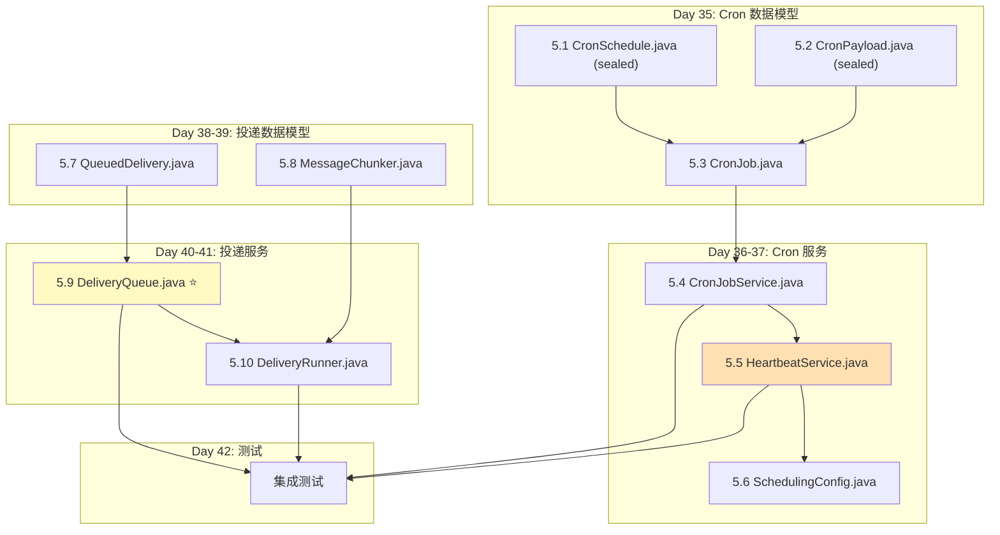
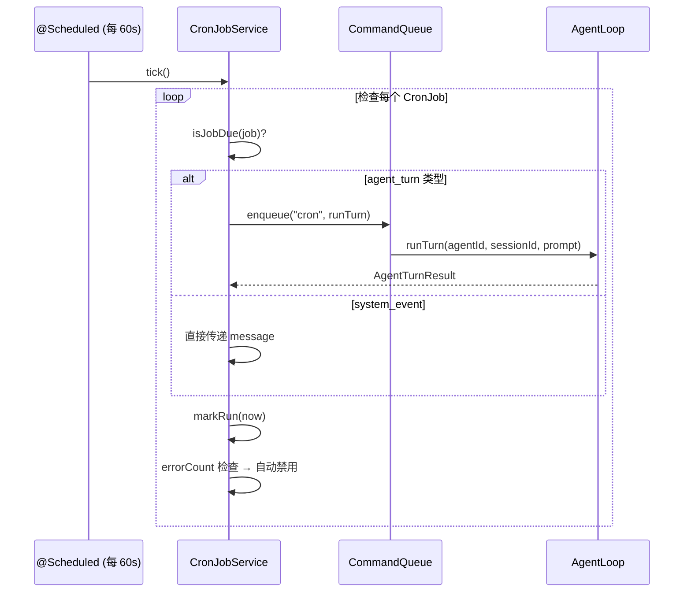
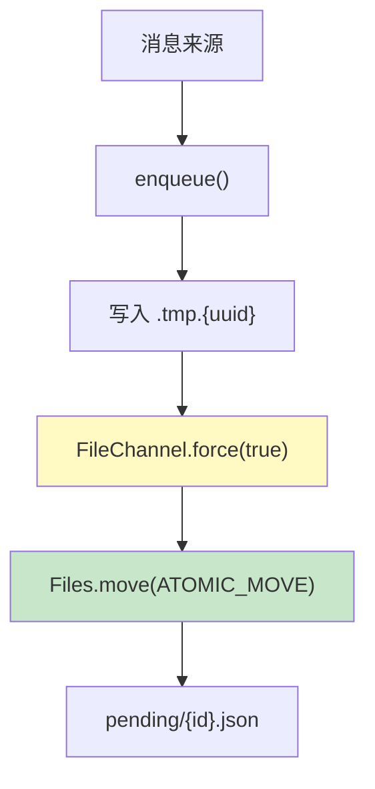

# Sprint 5: 自主与投递 (Day 35-42)

> **目标**: Agent 能定时心跳、执行 Cron 任务、可靠投递消息
> **里程碑 M5**: 心跳定时触发，Cron 任务执行，WAL 崩溃安全投递
> **claw0 参考**: `sessions/en/s07_heartbeat_cron.py` + `sessions/en/s08_delivery.py`

---

## 1. 实施依赖图



---

## 2. Day 35: Cron 数据模型

### 2.1 文件 5.1 — `CronSchedule.java` (sealed interface)

**claw0 参考**: `s07_heartbeat_cron.py` 第 80-130 行 schedule 解析

```java
public sealed interface CronSchedule
    permits CronSchedule.At, CronSchedule.Every, CronSchedule.CronExpression {

    /** 一次性定时 — 指定精确时间 */
    record At(Instant datetime) implements CronSchedule {}

    /** 固定间隔 — 每隔 N 秒 */
    record Every(int intervalSeconds) implements CronSchedule {}

    /** Cron 表达式 — 标准 5 字段 (分 时 日 月 周) */
    record CronExpression(String expression) implements CronSchedule {}
}
```

### 2.1b 文件 5.1b — `CronScheduleDeserializer.java`

**职责**: Jackson 自定义反序列化器，将 CRON.json 中的联合类型 schedule 字段正确反序列化。

**JSON 反序列化**:

CRON.json 中的 schedule 字段是联合类型，需要自定义 Jackson 反序列化器：

```java
public class CronScheduleDeserializer extends JsonDeserializer<CronSchedule> {
    @Override
    public CronSchedule deserialize(JsonParser p, DeserializationContext ctxt) {
        ObjectNode node = p.getCodec().readTree(p);
        if (node.has("at")) {
            return new CronSchedule.At(Instant.parse(node.get("at").asText()));
        } else if (node.has("every")) {
            return new CronSchedule.Every(node.get("every").asInt());
        } else if (node.has("cron")) {
            return new CronSchedule.CronExpression(node.get("cron").asText());
        }
        throw new IllegalArgumentException("Invalid schedule: " + node);
    }
}
```

### 2.2 文件 5.2 — `CronPayload.java` (sealed interface)

```java
public sealed interface CronPayload
    permits CronPayload.AgentTurn, CronPayload.SystemEvent {

    /** Agent 对话 — 需要执行完整的 AgentLoop.runTurn() */
    record AgentTurn(String agentId, String prompt) implements CronPayload {}

    /** 系统事件 — 直接传递消息文本 */
    record SystemEvent(String message) implements CronPayload {}
}
```

### 2.3 文件 5.3 — `CronJob.java`

**claw0 参考**: `s07_heartbeat_cron.py` 第 130-180 行 `CronJob` dataclass

```java
public class CronJob {
    private final String id;
    private final String label;
    private final CronSchedule schedule;
    private final CronPayload payload;
    private boolean enabled;
    private int errorCount;
    private Instant lastRunAt;
    private final boolean deleteAfterRun;

    private static final int AUTO_DISABLE_THRESHOLD = 5;

    public void incrementError() {
        errorCount++;
        if (errorCount >= AUTO_DISABLE_THRESHOLD) {
            enabled = false;
        }
    }

    public void markRun(Instant now) {
        lastRunAt = now;
    }

    // getter 方法...
}
```

---

## 3. Day 36-37: Cron 与心跳服务

### 3.1 文件 5.4 — `CronJobService.java`

**claw0 参考**: `s07_heartbeat_cron.py` 第 200-400 行 `CronService` 类

**核心机制**:



**到期判断**:

```java
@Service
public class CronJobService {
    private final List<CronJob> jobs = new CopyOnWriteArrayList<>();

    @Scheduled(fixedRate = 60_000)  // 每 60 秒检查
    public void tick() {
        Instant now = Instant.now();
        for (CronJob job : jobs) {
            if (!job.isEnabled()) continue;
            if (!isJobDue(job, now)) continue;

            try {
                executeJob(job, now);
                job.markRun(now);
                job.resetErrorCount();  // 成功后重置

                if (job.isDeleteAfterRun()) {
                    jobs.remove(job);
                }
            } catch (Exception e) {
                job.incrementError();
                log.warn("Cron job '{}' failed (errorCount={})", job.getId(), job.getErrorCount());
            }
        }
    }

    private boolean isJobDue(CronJob job, Instant now) {
        return switch (job.getSchedule()) {
            case CronSchedule.At at -> !now.isBefore(at.datetime());
            case CronSchedule.Every every -> {
                if (job.getLastRunAt() == null) yield true;
                yield now.isAfter(job.getLastRunAt().plusSeconds(every.intervalSeconds()));
            }
            case CronSchedule.CronExpression cron -> {
                // 使用 cron-utils 库解析
                var execution = CronParser.parse(cron.expression());
                yield execution.nextExecution(job.getLastRunAt())
                    .map(next -> !now.isBefore(next))
                    .orElse(false);
            }
        };
    }
}
```

**Cron 运行日志**:

```java
/** 记录 Cron 运行日志 */
private void logCronRun(CronJob job, boolean success, String error) {
    Path logFile = workspacePath.resolve("cron").resolve("cron-runs.jsonl");
    Map<String, Object> entry = Map.of(
        "job_id", job.getId(),
        "timestamp", Instant.now().toString(),
        "success", success,
        "error", error != null ? error : ""
    );
    JsonUtils.appendJsonl(logFile, entry);
}
```

**CRON.json 加载**:

```java
public void loadJobs() {
    Path cronFile = workspacePath.resolve("CRON.json");
    if (!Files.exists(cronFile)) return;

    String json = Files.readString(cronFile);
    List<CronJob> loaded = objectMapper.readValue(json,
        new TypeReference<List<CronJob>>() {});
    jobs.clear();
    jobs.addAll(loaded);
}
```

**运行时持久化**:

```java
/** 运行时添加任务并持久化到 CRON.json */
public void addJobAndPersist(CronJob job) {
    jobs.add(job);
    persistJobs();
}

/** 运行时移除任务并持久化 */
public void removeJobAndPersist(String jobId) {
    jobs.removeIf(j -> j.getId().equals(jobId));
    persistJobs();
}

private void persistJobs() {
    try {
        String json = objectMapper.writerWithDefaultPrettyPrinter()
            .writeValueAsString(jobs);
        FileUtils.writeAtomically(cronFilePath, json);
    } catch (IOException e) {
        log.error("Failed to persist CRON.json", e);
    }
}
```

> **持久化策略**: 每次运行时变更（添加/移除/禁用任务）都全量重写 `CRON.json`。
> 使用 `FileUtils.writeAtomically()` 确保写入安全。Cron 任务数量通常 < 50，全量重写开销可忽略。

**WebSocket 通知**:

在 CronJobService 执行任务完成后，投递 Cron 结果时通知 WebSocket 客户端：

```java
gatewayWebSocketHandler.notifyCronOutput(job.getId(), at.agentId(), result.text());
```

> **注意**: `GatewayWebSocketHandler` 需通过构造函数注入到 `CronJobService` 和 `HeartbeatService` 中。

### 3.2 文件 5.5 — `HeartbeatService.java`

**claw0 参考**: `s07_heartbeat_cron.py` 第 400-580 行 `HeartbeatRunner` 类

**4 个前置条件检查**:

```java
@Service
public class HeartbeatService {
    private final PromptAssembler promptAssembler;
    private final DeliveryQueue deliveryQueue;
    private String lastOutput = null;

    @Scheduled(fixedRateString = "${heartbeat.interval-seconds:1800}000")
    public void heartbeat() {
        // 条件 1: HEARTBEAT.md 存在且非空
        if (!isHeartbeatConfigured()) return;
        // 条件 2: 在活跃时段内
        if (!isWithinActiveHours()) return;

        // 执行心跳 (后续 Sprint 6 通过 CommandQueue 调度)
        runHeartbeat();
    }

    private void runHeartbeat() {
        // 构建心跳专用系统提示
        String systemPrompt = promptAssembler.buildSystemPrompt(
            defaultAgentId, new PromptContext("heartbeat", false, true, ""));

        // 添加心跳指令
        String heartbeatInstruction = bootstrapLoader.getFile("HEARTBEAT.md")
            .orElse("Perform a quick health check.");
        // ... 构建 messages 并调用 AgentLoop

        String output = result.text();

        // 输出去重: 与上次相同或为 "HEARTBEAT_OK" 则跳过
        if (output.equals(lastOutput) || "HEARTBEAT_OK".equalsIgnoreCase(output.trim())) {
            return;
        }
        lastOutput = output;

        // 投递结果
        deliveryQueue.enqueue(defaultChannel, defaultPeerId, output);

        // 通过 GatewayWebSocketHandler 通知 WebSocket 客户端
        gatewayWebSocketHandler.notifyHeartbeatOutput(defaultAgentId, output);
    }

    private boolean isWithinActiveHours() {
        int hour = LocalTime.now().getHour();
        return hour >= activeStartHour && hour < activeEndHour;
    }
}
```

### 3.3 文件 5.6 — `SchedulingConfig.java`

```java
@Configuration
@EnableScheduling  // 调度功能在此处统一启用（AppConfig 中不重复声明）
public class SchedulingConfig implements SchedulingConfigurer {
    @Override
    public void configureTasks(ScheduledTaskRegistrar registrar) {
        // 使用虚拟线程执行定时任务
        registrar.setScheduler(Executors.newScheduledThreadPool(4,
            Thread.ofVirtual().name("scheduler-").factory()));
    }
}
```

> **注意**: `@EnableScheduling` 仅在此处声明。Sprint 1 的 `AppConfig` 中不再包含 `@EnableScheduling`，
> 避免重复注册导致混淆。

---

## 4. Day 38-39: 投递数据模型

### 4.1 文件 5.7 — `QueuedDelivery.java`

```java
public record QueuedDelivery(
    String id,
    String channel,
    String to,
    String text,
    Instant createdAt,
    int retryCount,
    Instant nextRetryAt,
    String lastError
) {}
```

### 4.2 文件 5.8 — `MessageChunker.java`

**claw0 参考**: `s08_delivery.py` 第 500-600 行分块逻辑

```java
public class MessageChunker {
    private static final Map<String, Integer> PLATFORM_LIMITS = Map.of(
        "telegram", 4096,
        "telegram_caption", 1024,
        "discord", 2000,
        "whatsapp", 4096,
        "cli", Integer.MAX_VALUE
    );

    public static List<String> chunk(String text, String platform) {
        int limit = PLATFORM_LIMITS.getOrDefault(platform, 4096);
        if (text.length() <= limit) return List.of(text);
        return splitByParagraph(text, limit);
    }

    private static List<String> splitByParagraph(String text, int limit) {
        // 1. 按段落 (\n\n) 分割
        // 2. 尽可能合并短段落，直到接近 limit
        // 3. 单段落超长时硬分割
        List<String> chunks = new ArrayList<>();
        StringBuilder current = new StringBuilder();

        for (String paragraph : text.split("\n\n")) {
            if (current.length() + paragraph.length() + 2 > limit) {
                if (current.length() > 0) {
                    chunks.add(current.toString());
                    current = new StringBuilder();
                }
                // 硬分割超长段落
                if (paragraph.length() > limit) {
                    chunks.addAll(hardSplit(paragraph, limit));
                } else {
                    current.append(paragraph);
                }
            } else {
                if (current.length() > 0) current.append("\n\n");
                current.append(paragraph);
            }
        }
        if (current.length() > 0) chunks.add(current.toString());
        return chunks;
    }
}
```

---

## 5. Day 40-41: 投递服务

### 5.1 文件 5.9 — `DeliveryQueue.java` ⭐

**claw0 参考**: `s08_delivery.py` 第 100-350 行 `DeliveryQueue` 类

**Write-Ahead 原子写入**:



```java
@Service
public class DeliveryQueue {
    private final Path pendingDir;
    private final Path failedDir;

    /**
     * 入队 — 原子写入磁盘
     * 崩溃安全保证：写入完成前进程崩溃，不会留下半成品文件
     */
    public String enqueue(String channel, String to, String text) {
        String id = "del_" + UUID.randomUUID().toString().substring(0, 8);
        QueuedDelivery delivery = new QueuedDelivery(
            id, channel, to, text,
            Instant.now(), 0, Instant.now(), null
        );

        Path target = pendingDir.resolve(id + ".json");
        writeAtomically(target, JsonUtils.toJson(delivery));
        return id;
    }

    private void writeAtomically(Path target, String content) {
        Path tmp = target.resolveSibling(".tmp." + UUID.randomUUID());
        try {
            Files.writeString(tmp, content);
            try (FileChannel ch = FileChannel.open(tmp, StandardOpenOption.WRITE)) {
                ch.force(true);  // fsync — 确保数据落盘
            }
            Files.move(tmp, target, StandardCopyOption.ATOMIC_MOVE);
        } catch (IOException e) {
            Files.deleteIfExists(tmp);
            throw new DeliveryException(id, "Atomic write failed", e);
        }
    }

    /** 确认投递成功 — 删除 pending 文件 */
    public void ack(String deliveryId) {
        Files.deleteIfExists(pendingDir.resolve(deliveryId + ".json"));
    }

    /** 投递失败 — 递增重试或移入 failed/ */
    public void fail(String deliveryId, String error, int maxRetries) {
        Path file = pendingDir.resolve(deliveryId + ".json");
        QueuedDelivery delivery = JsonUtils.fromJson(Files.readString(file), QueuedDelivery.class);

        if (delivery.retryCount() >= maxRetries) {
            // 耗尽重试 → 移入 failed/
            QueuedDelivery failed = new QueuedDelivery(
                delivery.id(), delivery.channel(), delivery.to(), delivery.text(),
                delivery.createdAt(), delivery.retryCount(), null, error);
            writeAtomically(failedDir.resolve(deliveryId + ".json"), JsonUtils.toJson(failed));
            Files.delete(file);
        } else {
            // 递增重试 → 更新 pending
            // (退避时间由 DeliveryRunner 计算)
        }
    }

    /** 加载所有待投递条目 */
    public List<QueuedDelivery> loadPending() { ... }
}
```

### 5.2 文件 5.10 — `DeliveryRunner.java`

**claw0 参考**: `s08_delivery.py` 第 350-500 行 `DeliveryRunner` 类

```java
@Service
public class DeliveryRunner {
    private final DeliveryQueue queue;
    private final ChannelManager channelManager;
    private final DeliveryProperties deliveryProps;

    @Scheduled(fixedRateString = "${delivery.poll-interval-ms:1000}")
    public void processQueue() {
        List<QueuedDelivery> pending = queue.loadPending();

        // 按 nextRetryAt 排序
        pending.sort(Comparator.comparing(QueuedDelivery::nextRetryAt));

        for (QueuedDelivery delivery : pending) {
            // 检查是否到了重试时间
            if (delivery.nextRetryAt().isAfter(Instant.now())) continue;

            boolean success = deliver(delivery);
            if (success) {
                queue.ack(delivery.id());
            } else {
                queue.fail(delivery.id(), "Send failed", deliveryProps.maxRetries());
            }
        }
    }

    private boolean deliver(QueuedDelivery delivery) {
        Optional<Channel> channel = channelManager.get(delivery.channel());
        if (channel.isEmpty()) {
            log.warn("Channel '{}' not found for delivery {}", delivery.channel(), delivery.id());
            return false;
        }
        return channel.get().send(delivery.to(), delivery.text());
    }

    /** 计算下次重试时间 */
    Instant calculateNextRetry(int retryCount) {
        double base = deliveryProps.backoffBaseSeconds();
        double multiplier = deliveryProps.backoffMultiplier();
        double jitter = deliveryProps.jitterFactor();

        long delay = (long) (base * Math.pow(multiplier, retryCount));
        // 加入随机抖动
        delay = (long) (delay * (1 + (Math.random() * 2 - 1) * jitter));
        return Instant.now().plusSeconds(delay);
    }

    /** 优雅关闭时处理剩余投递 */
    public void flush() {
        processQueue();  // 最后处理一轮
    }
}
```

**退避时间表**:

| 重试 | base × mult^retry | ±20% 抖动 |
|------|-------------------|----------|
| 0 | 5s | 4-6s |
| 1 | 25s | 20-30s |
| 2 | 125s (~2min) | 100-150s |
| 3 | 625s (~10min) | 500-750s |
| 4+ | 移入 failed/ | — |

---

## 6. 测试清单

| 测试类 | 关键场景 | 优先级 |
|--------|---------|--------|
| `CronJobServiceTest` | at/every/cron 三种调度到期判断 | P0 |
| `CronJobServiceTest` | 连续 5 次错误自动禁用 | P0 |
| `CronJobServiceTest` | deleteAfterRun 一次性任务 | P1 |
| `CronJobServiceTest` | CRON.json 加载 | P1 |
| `CronJobServiceTest` | 运行时添加任务持久化到 CRON.json | P1 |
| `CronJobServiceTest` | 运行时移除任务并更新文件 | P1 |
| `CronJobServiceTest` | cron-runs.jsonl 日志记录 | P2 |
| `CronScheduleDeserializerTest` | at 格式反序列化: `{"at":"2026-04-05T14:00:00Z"}` | P0 |
| `CronScheduleDeserializerTest` | every 格式反序列化: `{"every":3600}` | P0 |
| `CronScheduleDeserializerTest` | cron 格式反序列化: `{"cron":"0 9 * * *"}` | P0 |
| `CronScheduleDeserializerTest` | 无效格式抛出异常 | P1 |
| `HeartbeatServiceTest` | 活跃时段内触发 | P0 |
| `HeartbeatServiceTest` | 活跃时段外跳过 | P0 |
| `HeartbeatServiceTest` | 输出与上次相同时跳过 | P1 |
| `HeartbeatServiceTest` | HEARTBEAT_OK 不投递 | P1 |
| `DeliveryQueueTest` | 原子写入 (文件存在) | P0 |
| `DeliveryQueueTest` | ack 删除 pending 文件 | P0 |
| `DeliveryQueueTest` | fail 递增重试 | P0 |
| `DeliveryQueueTest` | 耗尽重试移入 failed/ | P0 |
| `MessageChunkerTest` | 按段落分块 | P0 |
| `MessageChunkerTest` | 硬分割超长段落 | P1 |
| `DeliveryRunnerTest` | 指数退避计算 | P1 |
| `HeartbeatIntegrationTest` | 端到端心跳流程 | P1 |

---

## 7. 验收检查清单 (M5)

- [ ] `CRON.json` 中的 at 类型任务在指定时间触发
- [ ] `CRON.json` 中的 every 类型任务按间隔触发
- [ ] `CRON.json` 中的 cron 表达式任务正确解析和触发
- [ ] 心跳在活跃时段 (9:00-22:00) 内触发，活跃时段外跳过
- [ ] 心跳输出与上次相同时不重复投递
- [ ] Cron 任务连续 5 次错误后自动禁用
- [ ] 消息通过 WAL 队列投递，进程崩溃后 pending 文件不丢失
- [ ] 投递失败时指数退避重试
- [ ] 超过重试上限移入 failed/ 目录
- [ ] 消息按平台限制正确分块
- [ ] 运行时添加的 Cron 任务持久化到 `CRON.json`，重启后自动加载
- [ ] Cron 运行日志写入 `workspace/cron/cron-runs.jsonl`
- [ ] 心跳输出通过 `heartbeat.output` WebSocket 通知推送给客户端
- [ ] Cron 任务输出通过 `cron.output` WebSocket 通知推送给客户端
