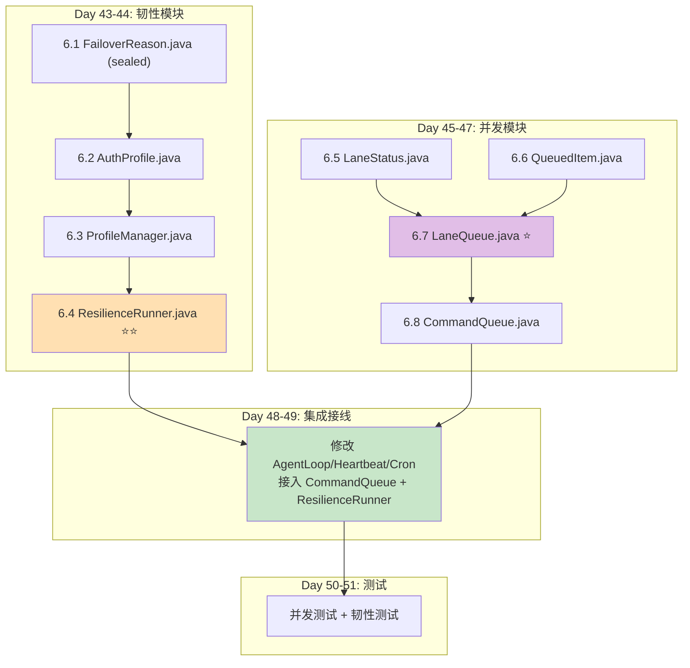
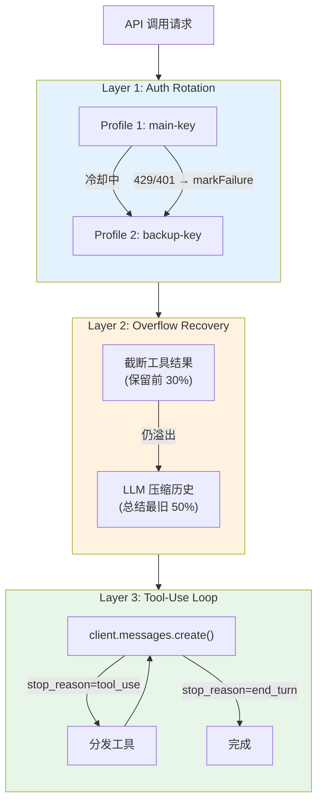
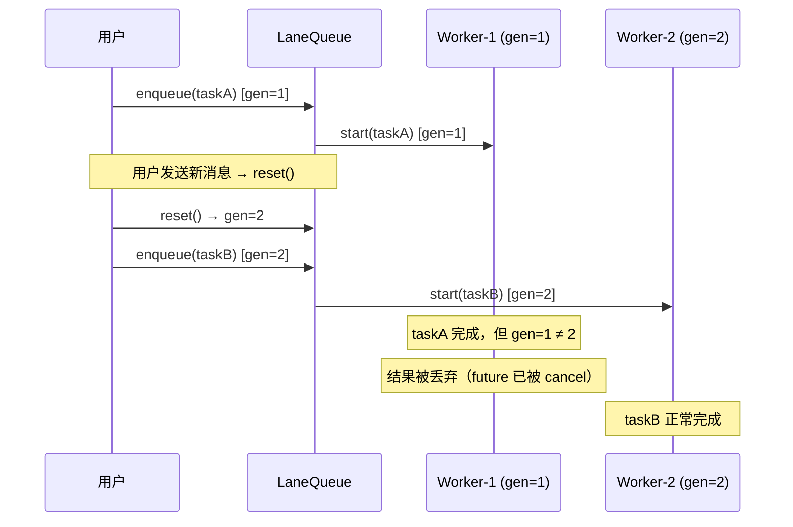

# Sprint 6: 韧性与并发 (Day 43-51)

> **目标**: 生产级容错 (三层重试洋葱) + 并发控制 (命名 Lane 队列)
> **里程碑 M6**: Auth 轮转、上下文溢出自愈、FIFO 有序、虚拟线程正常
> **claw0 参考**: `sessions/en/s09_resilience.py` + `sessions/en/s10_concurrency.py`

---

## 1. 实施依赖图



---

## 2. Day 43-44: 韧性模块

### 2.1 文件 6.1 — `FailoverReason.java` (sealed interface)

**claw0 参考**: `s09_resilience.py` 第 30-80 行 `FailoverReason` 枚举

```java
public sealed interface FailoverReason {

    /** 分类失败原因 */
    static FailoverReason classify(Exception ex) {
        String msg = ex.getMessage() != null ? ex.getMessage().toLowerCase() : "";
        int status = extractHttpStatus(ex);

        if (status == 429) return new RateLimit();
        if (status == 401 || status == 403) return new AuthError();
        if (msg.contains("timeout") || msg.contains("timed out")) return new Timeout();
        if (msg.contains("billing") || msg.contains("credit")) return new Billing();
        if (msg.contains("context") && msg.contains("overflow")) return new ContextOverflow();
        return new Unknown();
    }

    private static int extractHttpStatus(Exception ex) {
        // Anthropic SDK 异常通常包含 HTTP 状态码
        // 具体取法需在 Sprint 1 SDK 验证中确认
        return 0;
    }

    // === 具体类型 ===

    /** HTTP 429 — 请求过快 */
    record RateLimit() implements FailoverReason {
        public int cooldownSeconds() { return 120; }
    }

    /** HTTP 401/403 — 认证失败 */
    record AuthError() implements FailoverReason {
        public int cooldownSeconds() { return 300; }
    }

    /** 请求超时 */
    record Timeout() implements FailoverReason {
        public int cooldownSeconds() { return 60; }
    }

    /** 账单/额度问题 */
    record Billing() implements FailoverReason {
        public int cooldownSeconds() { return 300; }
    }

    /** 上下文溢出 — 不换 Profile，走压缩 */
    record ContextOverflow() implements FailoverReason {
        public int cooldownSeconds() { return 0; }  // 不冷却
    }

    /** 未知错误 */
    record Unknown() implements FailoverReason {
        public int cooldownSeconds() { return 120; }
    }
}
```

### 2.2 文件 6.2 — `AuthProfile.java`

**claw0 参考**: `s09_resilience.py` 第 80-150 行 `AuthProfile` 类

```java
public class AuthProfile {
    private final String name;
    private final String apiKey;
    private final String baseUrl;
    private volatile Instant cooldownUntil = Instant.MIN;
    private volatile FailoverReason failureReason = null;
    private volatile Instant lastGoodAt = Instant.now();

    /** 为此 Profile 创建独立的 AnthropicClient */
    public AnthropicClient createClient() {
        var builder = AnthropicOkHttpClient.builder().apiKey(apiKey);
        if (baseUrl != null && !baseUrl.isBlank()) {
            builder.baseUrl(baseUrl);
        }
        return builder.build();
    }

    public boolean isInCooldown() {
        return Instant.now().isBefore(cooldownUntil);
    }

    public void markFailure(FailoverReason reason) {
        this.failureReason = reason;
        int cooldown = switch (reason) {
            case FailoverReason.RateLimit r -> r.cooldownSeconds();
            case FailoverReason.AuthError a -> a.cooldownSeconds();
            case FailoverReason.Timeout t -> t.cooldownSeconds();
            case FailoverReason.Billing b -> b.cooldownSeconds();
            case FailoverReason.Unknown u -> u.cooldownSeconds();
            case FailoverReason.ContextOverflow c -> 0;
        };
        this.cooldownUntil = Instant.now().plusSeconds(cooldown);
    }

    public void markSuccess() {
        this.lastGoodAt = Instant.now();
        this.cooldownUntil = Instant.MIN;
        this.failureReason = null;
    }
}
```

### 2.3 文件 6.3 — `ProfileManager.java`

**claw0 参考**: `s09_resilience.py` 第 150-300 行 `ProfileManager` 类

```java
@Service
public class ProfileManager {
    private final List<AuthProfile> profiles;

    public ProfileManager(AnthropicProperties props) {
        this.profiles = props.profiles().stream()
            .filter(p -> p.apiKey() != null && !p.apiKey().isBlank())
            .map(p -> new AuthProfile(p.name(), p.apiKey(), p.baseUrl()))
            .toList();
    }

    /** 选择一个可用 (非冷却中) 的 Profile */
    public Optional<AuthProfile> selectProfile() {
        return profiles.stream()
            .filter(p -> !p.isInCooldown())
            .findFirst();
    }

    public void markFailure(AuthProfile profile, FailoverReason reason) {
        profile.markFailure(reason);
    }

    public void markSuccess(AuthProfile profile) {
        profile.markSuccess();
    }

    public int getAvailableCount() {
        return (int) profiles.stream().filter(p -> !p.isInCooldown()).count();
    }
}
```

### 2.4 文件 6.4 — `ResilienceRunner.java` ⭐⭐ 最复杂的服务

**claw0 参考**: `s09_resilience.py` 第 300-600 行 `ResilienceRunner` 类

**三层重试洋葱**:



**核心实现**:

```java
@Service
public class ResilienceRunner {
    private final ProfileManager profileManager;
    private final ContextGuard contextGuard;
    private final ToolRegistry toolRegistry;

    private static final int BASE_RETRY = 3;
    private static final int PER_PROFILE = 5;

    public AgentTurnResult run(String systemPrompt, List<MessageParam> messages,
                               List<ToolDefinition> tools) {
        int maxIterations = Math.min(
            Math.max(BASE_RETRY + PER_PROFILE * profileManager.getAllProfiles().size(), 32),
            160
        );

        int iteration = 0;
        while (iteration < maxIterations) {
            // Layer 1: 选择 Profile
            Optional<AuthProfile> profileOpt = profileManager.selectProfile();
            if (profileOpt.isEmpty()) {
                // 所有 Profile 耗尽 → 降级模型
                return attemptFallbackModel(systemPrompt, messages, tools);
            }

            AuthProfile profile = profileOpt.get();
            AnthropicClient client = profile.createClient();

            try {
                // Layer 2: ContextGuard 包装
                Message response = contextGuard.guardApiCall(client, params);
                profileManager.markSuccess(profile);

                // Layer 3: 工具使用循环
                return processToolUseLoop(client, response, messages, tools);

            } catch (Exception ex) {
                FailoverReason reason = FailoverReason.classify(ex);

                if (reason instanceof FailoverReason.ContextOverflow) {
                    // 上下文溢出不换 Profile，重试
                    iteration++;
                    continue;
                }

                // 其他错误 → 标记 Profile 冷却，换下一个
                profileManager.markFailure(profile, reason);
                iteration++;
            }
        }

        throw new ProfileExhaustedException("All retries exhausted after " + iteration + " iterations");
    }
}
```

**降级模型链**:

```java
private AgentTurnResult attemptFallbackModel(String system, List<MessageParam> messages,
                                              List<ToolDefinition> tools) {
    List<String> fallbackModels = List.of(
        "claude-haiku-4-20250514"
    );

    for (String model : fallbackModels) {
        try {
            // 使用第一个可用的 Profile，但切换模型
            var profile = profileManager.selectProfile().orElseThrow();
            var client = profile.createClient();
            // 用降级模型构建参数
            // ... 调用 API
            return processToolUseLoop(client, response, messages, tools);
        } catch (Exception e) {
            continue;
        }
    }
    throw new ProfileExhaustedException("All profiles and fallback models exhausted");
}
```

---

## 3. Day 45-47: 并发模块

### 3.1 文件 6.5-6.6 — 数据 records

```java
// LaneStatus.java
public record LaneStatus(String name, int activeCount, int queueSize, int generation) {}

// QueuedItem.java (包内可见)
record QueuedItem(Callable<Object> task, CompletableFuture<Object> future, int generation) {}
```

### 3.2 文件 6.7 — `LaneQueue.java` ⭐

**claw0 参考**: `s10_concurrency.py` 第 50-300 行 `LaneQueue` 类

**核心保证**: FIFO + Generation 追踪 + 虚拟线程

```java
@ThreadSafe
public class LaneQueue {
    private final String name;
    private final int maxConcurrency;
    private final Deque<QueuedItem> deque = new ArrayDeque<>();
    private final ReentrantLock lock = new ReentrantLock();
    private final Condition idleCondition = lock.newCondition();
    private final AtomicInteger generation = new AtomicInteger(0);
    private int activeCount = 0;

    public LaneQueue(String name, int maxConcurrency) {
        this.name = name;
        this.maxConcurrency = maxConcurrency;
    }

    /** 入队任务，返回 Future */
    public CompletableFuture<Object> enqueue(Callable<Object> task) {
        lock.lock();
        try {
            CompletableFuture<Object> future = new CompletableFuture<>();
            deque.addLast(new QueuedItem(task, future, generation.get()));
            pump();
            return future;
        } finally {
            lock.unlock();
        }
    }

    /** 重置：取消所有排队任务，递增 generation */
    public void reset() {
        lock.lock();
        try {
            generation.incrementAndGet();
            // 取消所有排队中的 future
            QueuedItem item;
            while ((item = deque.pollFirst()) != null) {
                item.future().cancel(false);
            }
            // 活跃任务会在 taskDone 中因 generation 不匹配而被跳过
        } finally {
            lock.unlock();
        }
    }

    /** 等待所有任务完成 (包括活跃的) */
    public boolean waitForIdle(Duration timeout) throws InterruptedException {
        lock.lock();
        try {
            long remainingNanos = timeout.toNanos();
            while (activeCount > 0 || !deque.isEmpty()) {
                if (remainingNanos <= 0) return false;
                remainingNanos = idleCondition.awaitNanos(remainingNanos);
            }
            return true;
        } finally {
            lock.unlock();
        }
    }

    /** 核心调度：从队列中取任务并在虚拟线程中执行 */
    private void pump() {
        assert lock.isHeldByCurrentThread();

        while (activeCount < maxConcurrency && !deque.isEmpty()) {
            QueuedItem item = deque.pollFirst();

            // 跳过过期任务
            if (item.generation() != generation.get()) {
                item.future().cancel(false);
                continue;
            }

            activeCount++;
            int expectedGen = generation.get();

            Thread.ofVirtual()
                .name(name + "-worker-" + expectedGen)
                .start(() -> {
                    try {
                        Object result = item.task().call();
                        item.future().complete(result);
                    } catch (Exception e) {
                        item.future().completeExceptionally(e);
                    } finally {
                        taskDone(expectedGen);
                    }
                });
        }
    }

    private void taskDone(int expectedGeneration) {
        lock.lock();
        try {
            activeCount--;
            if (activeCount == 0 && deque.isEmpty()) {
                idleCondition.signalAll();
            } else {
                pump();  // 有排队任务，继续泵
            }
        } finally {
            lock.unlock();
        }
    }
}
```

**Generation 追踪的意义**:



### 3.3 文件 6.8 — `CommandQueue.java`

**claw0 参考**: `s10_concurrency.py` 第 300-450 行 `CommandQueue` 类

```java
@Service
public class CommandQueue {
    private final Map<String, LaneQueue> lanes = new ConcurrentHashMap<>();
    private final DeliveryProperties deliveryProps;

    /** 入队到指定 Lane */
    public CompletableFuture<Object> enqueue(String laneName, Callable<Object> task) {
        LaneQueue lane = lanes.computeIfAbsent(laneName,
            name -> new LaneQueue(name, getMaxConcurrency(name)));
        return lane.enqueue(task);
    }

    /** 重置指定 Lane */
    public void resetLane(String laneName) {
        Optional.ofNullable(lanes.get(laneName)).ifPresent(LaneQueue::reset);
    }

    /** 重置所有 Lane */
    public void resetAll() {
        lanes.values().forEach(LaneQueue::reset);
    }

    /** 等待所有 Lane 空闲 */
    public boolean waitForAll(Duration timeout) throws InterruptedException {
        boolean allIdle = true;
        for (LaneQueue lane : lanes.values()) {
            if (!lane.waitForIdle(timeout)) allIdle = false;
        }
        return allIdle;
    }

    public LaneStatus getLaneStatus(String laneName) {
        LaneQueue lane = lanes.get(laneName);
        return lane != null ? lane.getStatus() : null;
    }

    private int getMaxConcurrency(String laneName) {
        // 从配置中读取 concurrency.lanes.{name}.max-concurrency
        return 1;  // 默认值
    }
}
```

---

## 4. Day 48-49: 集成接线

### 4.1 修改 `AgentLoop.java`

```java
// AgentLoop 不再直接调用 Claude API
// 而是通过 ResilienceRunner 包装
@Service
public class AgentLoop {
    private final ResilienceRunner resilienceRunner;  // 替代直接 client 调用

    public AgentTurnResult runTurn(String agentId, String sessionId, String userMessage) {
        // ... 加载历史、构建消息、组装提示词 ...

        // 使用 ResilienceRunner 执行 (替代直接 client.messages().create())
        return resilienceRunner.run(systemPrompt, messages, toolRegistry.getSchemas());
    }
}
```

### 4.2 修改 `HeartbeatService.java`

```java
@Scheduled(fixedRateString = "${heartbeat.interval-seconds:1800}000")
public void heartbeat() {
    if (!isHeartbeatConfigured() || !isWithinActiveHours()) return;

    // 通过 CommandQueue 调度到 heartbeat lane
    commandQueue.enqueue("heartbeat", () -> {
        // ... 心跳逻辑
        return null;
    });
}
```

### 4.3 修改 `CronJobService.java`

```java
private void executeJob(CronJob job, Instant now) {
    if (job.getPayload() instanceof CronPayload.AgentTurn at) {
        commandQueue.enqueue("cron", () -> {
            AgentTurnResult result = agentLoop.runTurn(at.agentId(), sessionId, at.prompt());
            deliveryQueue.enqueue(defaultChannel, defaultPeer, result.text());
            return result;
        });
    }
    // SystemEvent 不需要队列，直接投递
}
```

### 4.4 修改 `GatewayWebSocketHandler.java`

```java
private Object handleSend(JsonNode params) {
    // 通过 CommandQueue 调度到 main lane
    CompletableFuture<Object> future = commandQueue.enqueue("main", () -> {
        return agentLoop.runTurn(agentId, sessionKey, text);
    });

    // 等待结果 (带超时)
    try {
        AgentTurnResult result = (AgentTurnResult) future.get(120, TimeUnit.SECONDS);
        return Map.of("status", "ok", "text", result.text());
    } catch (TimeoutException e) {
        return Map.of("status", "timeout", "text", "Request timed out");
    }
}
```

---

## 5. 测试清单

| 测试类 | 关键场景 | 优先级 |
|--------|---------|--------|
| `FailoverReasonTest` | 异常分类 6 种类型 | P0 |
| `ProfileManagerTest` | Profile 选择 / 冷却 / 恢复 | P0 |
| `ProfileManagerTest` | 全部冷却后返回 empty | P0 |
| `LaneQueueTest` | FIFO 顺序保证 | P0 |
| `LaneQueueTest` | maxConcurrency=1 串行执行 | P0 |
| `LaneQueueTest` | reset 取消过期任务 | P0 |
| `LaneQueueTest` | reset 后新任务正常执行 | P0 |
| `LaneQueueTest` | waitForIdle 超时返回 false | P1 |
| `LaneQueueTest` | 多任务并发入队 | P1 |
| `CommandQueueTest` | 多 Lane 隔离 | P0 |
| `CommandQueueTest` | waitForAll 全部完成 | P1 |
| `CommandQueueTest` | resetAll 重置所有 | P1 |
| `ResilienceRunnerTest` | 成功调用 | P0 |
| `ResilienceRunnerTest` | 429 → 切换 Profile | P0 |
| `ResilienceRunnerTest` | 上下文溢出 → 不换 Profile | P0 |
| `ResilienceRunnerTest` | 所有 Profile 耗尽 → 降级 | P1 |
| `ConcurrencyIntegrationTest` | Heartbeat + Cron + User 共存 | P0 |

---

## 6. 验收检查清单 (M6)

- [ ] API 密钥轮转：主 key 429 时自动切换到备用 key
- [ ] 冷却计时：失败的 Profile 在冷却期内不会被选中
- [ ] 冷却恢复：冷却期结束后 Profile 重新可用
- [ ] 上下文溢出：自动截断工具结果或压缩历史
- [ ] 降级链：所有 Profile 耗尽时尝试 haiku 模型
- [ ] FIFO 保证：同一 Lane 内任务按入队顺序执行
- [ ] Generation 追踪：reset 后陈旧任务被取消
- [ ] 虚拟线程：Worker 线程为虚拟线程 (无平台线程限制)
- [ ] 多 Lane 隔离：main/cron/heartbeat 互不阻塞
- [ ] 无死锁：并发压力测试下无死锁发生
