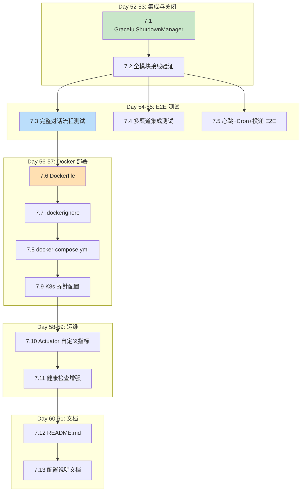
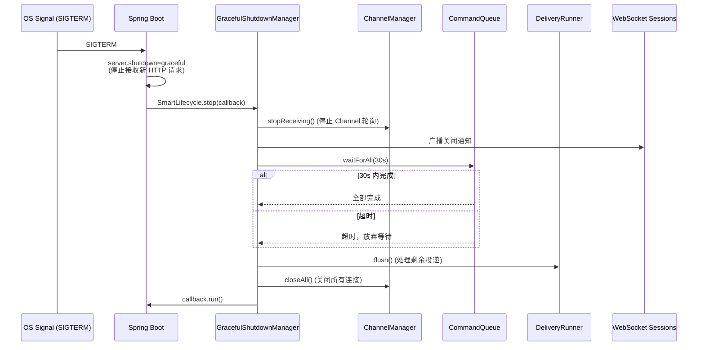

# Sprint 7: 集成与交付 (Day 52-61)

> **目标**: 全系统集成验证、Docker 部署、优雅关闭、文档收尾
> **里程碑 M7**: 全部测试通过，JAR 和 Docker 镜像可独立运行
> **claw0 参考**: 全部 10 个文件的综合验证

---

## 1. 实施依赖图



---

## 2. Day 52-53: 优雅关闭与集成

### 2.1 文件 7.1 — `GracefulShutdownManager.java`

**claw0 参考**: 无直接对应 (claw0 没有优雅关闭)，基于 Spring SmartLifecycle

**关闭流程**:



```java
@Component
public class GracefulShutdownManager implements SmartLifecycle {
    private final ChannelManager channelManager;
    private final CommandQueue commandQueue;
    private final DeliveryRunner deliveryRunner;
    private final Set<WebSocketSession> wsSessions;
    private volatile boolean running = false;

    @Override
    public void start() { running = true; }

    @Override
    public void stop(Runnable callback) {
        log.info("Graceful shutdown initiated");

        // 1. 停止接收新消息
        channelManager.stopReceiving();
        log.info("Channels stopped receiving");

        // 2. 通知 WebSocket 客户端
        broadcastShutdown();
        log.info("WebSocket clients notified");

        // 3. 等待进行中的任务完成
        try {
            boolean completed = commandQueue.waitForAll(Duration.ofSeconds(30));
            log.info("Command queue wait result: completed={}", completed);
        } catch (InterruptedException e) {
            Thread.currentThread().interrupt();
        }

        // 4. 处理剩余投递
        deliveryRunner.flush();
        log.info("Delivery queue flushed");

        // 5. 关闭所有渠道
        channelManager.closeAll();
        log.info("All channels closed");

        running = false;
        callback.run();
    }

    @Override
    public boolean isRunning() { return running; }

    @Override
    public int getPhase() { return Integer.MAX_VALUE; }  // 最后关闭

    private void broadcastShutdown() {
        String payload = JsonUtils.toJson(Map.of(
            "jsonrpc", "2.0",
            "method", "server.shutdown",
            "params", Map.of("message", "Server is shutting down")
        ));
        for (WebSocketSession session : wsSessions) {
            if (session.isOpen()) {
                try {
                    session.sendMessage(new TextMessage(payload));
                } catch (Exception e) {
                    log.debug("Failed to notify WS session", e);
                }
            }
        }
    }
}
```

### 2.2 全模块接线验证

检查所有 Spring Bean 的依赖注入是否完整：

```mermaid
flowchart TB
    subgraph "配置 Bean"
        AC["AnthropicConfig"]
        WC["WebSocketConfig"]
        SC["SchedulingConfig"]
    end

    subgraph "核心 Bean"
        AL["AgentLoop"]
        TR["ToolRegistry"]
        SS["SessionStore"]
        CG["ContextGuard"]
    end

    subgraph "渠道 Bean"
        CM["ChannelManager"]
        CLI["CliChannel"]
        TG["TelegramChannel?"]
        FS["FeishuChannel?"]
    end

    subgraph "网关 Bean"
        GWH["GatewayWSHandler"]
        BT["BindingTable"]
        AM["AgentManager"]
        GC["GatewayController"]
    end

    subgraph "智能 Bean"
        PA["PromptAssembler"]
        BL["BootstrapLoader"]
        SK["SkillsManager"]
        MS["MemoryStore"]
    end

    subgraph "调度 Bean"
        HB["HeartbeatService"]
        CJS["CronJobService"]
    end

    subgraph "投递 Bean"
        DQ["DeliveryQueue"]
        DR["DeliveryRunner"]
        MC["MessageChunker"]
    end

    subgraph "韧性 Bean"
        RR["ResilienceRunner"]
        PM["ProfileManager"]
    end

    subgraph "并发 Bean"
        CQ["CommandQueue"]
    end

    AC --> AL
    AC --> PM
    TR --> AL
    SS --> AL
    CG --> RR --> AL
    PA --> AL
    PM --> RR
    CQ --> GWH
    CQ --> HB
    CQ --> CJS
    DQ --> DR
    CM --> DR

    style AL fill:#fff9c4
    style RR fill:#ffe0b2
    style CQ fill:#e1bee7
```



**验证清单**:
- [ ] `mvn spring-boot:run` 启动无 Bean 注入失败
- [ ] 所有 `@ConditionalOnProperty` 条件 Bean 正确注册/跳过
- [ ] 循环依赖检测通过 (Spring 默认禁止)
- [ ] 无 `UnsatisfiedDependencyException`

### 版本验证清单

> **注意**: 版本验证应在 Sprint 1 Day 1 第一步完成（参见 01-sprint1-skeleton.md §2 的版本验证说明）。
> 此处仅为最终集成前的二次确认。

```bash
# 检查 Maven Central 中的最新版本
curl -s "https://search.maven.org/solrsearch/select?q=g:org.springframework.boot+AND+a:spring-boot-starter-parent&rows=5&wt=json" | jq '.response.docs[0].latestVersion'

curl -s "https://search.maven.org/solrsearch/select?q=g:com.anthropic+AND+a:anthropic-java&rows=5&wt=json" | jq '.response.docs[0].latestVersion'
```

| 依赖 | 指定版本 | 验证结果 |
|------|---------|---------|
| Spring Boot | 3.5.3 | 待验证 |
| Anthropic Java SDK | 2.20.0 | 待验证 |
| cron-utils | 9.2.1 | 待验证 |

> 如指定版本不存在，更新为最新稳定版并修改 `pom.xml`。
>
> **⚠️ logstash-logback-encoder 依赖**: 生产环境的 `logback-spring.xml` 使用了 `LogstashEncoder`
> (`net.logstash.logback.encoder.LogstashEncoder`)，需要在 `pom.xml` 中添加以下依赖：
> ```xml
> <dependency>
>     <groupId>net.logstash.logback</groupId>
>     <artifactId>logstash-logback-encoder</artifactId>
>     <version>8.0</version>
>     <scope>runtime</scope>
> </dependency>
> ```
> 版本号以 Maven Central 最新稳定版为准。

---

## 3. Day 54-55: E2E 测试

### 3.1 完整对话流程测试

```java
@SpringBootTest(webEnvironment = SpringBootTest.WebEnvironment.RANDOM_PORT)
class EndToEndConversationTest {

    @Test
    void shouldCompleteFullConversationLoop() {
        // 1. 通过 REST API 发送消息
        SendRequest request = new SendRequest("luna", "What is 2+2?", "api", "test-user", null);
        ResponseEntity<SendResponse> response = restTemplate.postForEntity(
            "/api/v1/send", request, SendResponse.class);

        // 2. 验证响应
        assertEquals(200, response.getStatusCode().value());
        assertNotNull(response.getBody().text());
        assertNotNull(response.getBody().sessionId());
        assertNotNull(response.getBody().tokenUsage());

        // 3. 验证 JSONL 持久化
        String sessionId = response.getBody().sessionId();
        List<MessageParam> history = sessionStore.loadSession(sessionId);
        assertFalse(history.isEmpty());

        // 4. 验证上下文累积
        SendRequest followUp = new SendRequest("luna", "What did I just ask?",
            "api", "test-user", sessionId);
        ResponseEntity<SendResponse> response2 = restTemplate.postForEntity(
            "/api/v1/send", followUp, SendResponse.class);
        assertTrue(response2.getBody().text().toLowerCase().contains("2+2"));
    }
}
```

### 3.2 WebSocket 端到端测试

```java
@Test
void shouldHandleWebSocketJsonRpc() throws Exception {
    // 1. 连接 WebSocket
    WebSocketStompClient stompClient = new WebSocketStompClient(new SockJsClient(...));
    WebSocketSession session = stompClient.connect("ws://localhost:" + port + "/ws/gateway", ...);

    // 2. 发送 JSON-RPC 请求
    String request = """
        {
            "jsonrpc": "2.0",
            "id": "test-1",
            "method": "send",
            "params": {"agent_id": "luna", "text": "Hello!"}
        }
        """;
    session.sendMessage(new TextMessage(request));

    // 3. 等待响应
    TextMessage response = await().atMost(30, SECONDS).until(() -> responseQueue.poll(), Objects::nonNull);
    JsonNode json = objectMapper.readTree(response.getPayload());
    assertEquals("test-1", json.path("id").asText());
    assertNotNull(json.path("result").path("text").asText());
}
```

### 3.3 心跳 + Cron + 投递端到端

```java
@Test
void shouldExecuteHeartbeatAndDeliver() {
    // 1. 配置心跳 (短间隔用于测试)
    // 2. 等待心跳触发
    // 3. 验证投递队列有新条目
    // 4. 验证投递成功
}
```

### 3.4 优雅关闭测试

```java
@Test
void shouldGracefullyShutdown() {
    // 1. 启动一个长时间运行的对话
    CompletableFuture<SendResponse> longTask = CompletableFuture.supplyAsync(() ->
        restTemplate.postForEntity("/api/v1/send",
            new SendRequest("luna", "Write a long story...", "api", "user", null),
            SendResponse.class).getBody()
    );

    // 2. 触发关闭
    context.close();

    // 3. 验证长任务完成 (不是被杀死)
    SendResponse result = longTask.join();
    assertNotNull(result);
}
```

## 3.5 安全测试

### 安全测试清单

```java
@SpringBootTest(webEnvironment = SpringBootTest.WebEnvironment.RANDOM_PORT)
class SecurityTest {

    @Test
    void shouldAllowAllRequestsWithDefaultAuthFilter() {
        // DefaultAuthFilter 放行所有请求
        ResponseEntity<?> response = restTemplate.getForEntity("/api/v1/agents", Object.class);
        assertEquals(200, response.getStatusCode().value());
    }

    @Test
    void shouldRejectInvalidAgentId() {
        // Agent ID 格式验证: [a-z0-9][a-z0-9_-]{0,63}
        ResponseEntity<?> response = restTemplate.postForEntity("/api/v1/agents",
            Map.of("id", "INVALID ID!", "name", "Bad"), Object.class);
        assertEquals(400, response.getStatusCode().value());
    }

    @Test
    void shouldBlockPathTraversal() {
        // 路径穿越防护
    }

    @Test
    void shouldBlockDangerousCommands() {
        // 危险命令拦截
    }
}
```

### Rate Limiting 说明

> 当前版本不实现内置速率限制。建议通过外部反向代理（如 Nginx）配置：
> ```nginx
> limit_req_zone $binary_remote_addr zone=api:10m rate=10r/s;
> location /api/v1/ {
>     limit_req zone=api burst=20 nodelay;
> }
> ```
> 未来版本可集成 `spring-boot-starter-data-redis` + `Bucket4j` 实现分布式限流。

---

## 4. Day 56-57: Docker 部署

### 4.1 文件 7.6 — `Dockerfile`

```dockerfile
# ===== 构建阶段 =====
FROM eclipse-temurin:21-jdk-alpine AS builder
WORKDIR /build

# 利用 Docker 层缓存：先复制 pom.xml 并下载依赖
# 只有 pom.xml 变化时才重新下载，源码变化不会触发依赖重下载
COPY pom.xml .
RUN apk add --no-cache maven && \
    mvn dependency:go-offline -q

# 再复制源码并编译
COPY src ./src
RUN mvn package -DskipTests -q -o

# ===== 运行阶段 =====
FROM eclipse-temurin:21-jre-alpine
WORKDIR /app

# 安全：非 root 用户
RUN addgroup -S claw4j && adduser -S claw4j -G claw4j

COPY --from=builder /build/target/*.jar app.jar
COPY workspace/ /app/workspace/

RUN chown -R claw4j:claw4j /app
USER claw4j

# 健康检查
HEALTHCHECK --interval=30s --timeout=5s --start-period=10s --retries=3 \
    CMD wget -qO- http://localhost:8080/actuator/health || exit 1

EXPOSE 8080

# JVM 参数：容器感知 + 优雅关闭
ENTRYPOINT ["java", \
    "-XX:+UseContainerSupport", \
    "-XX:MaxRAMPercentage=75.0", \
    "-Dserver.shutdown=graceful", \
    "-Dspring.lifecycle.timeout-per-shutdown-phase=30s", \
    "-jar", "app.jar"]
```

> **Docker 层缓存优化**: `pom.xml` 和 `mvn dependency:go-offline` 在源码之前执行。
> 这样只要 `pom.xml` 不变，依赖下载层会被缓存，大幅加速增量构建。

### 4.2 文件 7.7 — `.dockerignore`

```
target/
.env
.git
.gitignore
*.md
docs/
*.log
workspace/.sessions/
workspace/memory/
workspace/delivery-queue/
workspace/cron/
```

### 4.3 文件 7.8 — `docker-compose.yml`

```yaml
version: "3.9"
services:
  claw4j:
    build: .
    ports:
      - "8080:8080"
    volumes:
      - ./workspace:/app/workspace
      - claw4j-sessions:/app/workspace/.sessions
      - claw4j-memory:/app/workspace/memory
    env_file:
      - .env
    environment:
      - SPRING_PROFILES_ACTIVE=prod
    restart: unless-stopped
    deploy:
      resources:
        limits:
          memory: 512M
        reservations:
          memory: 256M

volumes:
  claw4j-sessions:
  claw4j-memory:
```

### 4.4 文件 7.9 — K8s 配置

> **⚠️ 单实例部署约束**: 当前设计**仅支持单实例部署** (`replicas: 1`)。
> 原因: JSONL 文件系统存储不支持多实例并发写入，`SessionStore` 的内存索引 + 文件锁仅保证单进程安全。
> 未来如需水平扩展，参见 00-plan-overview.md §8.1 的扩展方案。

```yaml
# k8s/deployment.yaml
apiVersion: apps/v1
kind: Deployment
metadata:
  name: enterprise-claw-4j
spec:
  replicas: 1
  selector:
    matchLabels:
      app: claw4j
  template:
    metadata:
      labels:
        app: claw4j
    spec:
      containers:
        - name: claw4j
          image: enterprise-claw-4j:latest
          ports:
            - containerPort: 8080
          envFrom:
            - secretRef:
                name: claw4j-secrets
          livenessProbe:
            httpGet:
              path: /actuator/health/liveness
              port: 8080
            initialDelaySeconds: 15
            periodSeconds: 10
          readinessProbe:
            httpGet:
              path: /actuator/health/readiness
              port: 8080
            initialDelaySeconds: 10
            periodSeconds: 5
          resources:
            limits:
              memory: "512Mi"
            requests:
              memory: "256Mi"
```

---

## 5. Day 58-59: 运维增强

### 5.1 Actuator 自定义指标

在核心 Bean 中注入 `MeterRegistry` 并注册自定义指标：

```java
// AgentLoop.java 中添加
@Autowired
private MeterRegistry registry;

private void recordMetrics(AgentTurnResult result, String agentId) {
    registry.counter("claw4j.agent.turns",
        "agent_id", agentId,
        "stop_reason", result.stopReason()
    ).increment();

    registry.counter("claw4j.api.tokens.input",
        "model", modelId
    ).increment(result.tokenUsage().inputTokens());

    registry.counter("claw4j.api.tokens.output",
        "model", modelId
    ).increment(result.tokenUsage().outputTokens());
}
```

### 5.2 自定义 HealthIndicator

```java
@Component
public class WorkspaceHealthIndicator extends AbstractHealthIndicator {
    private final Path workspacePath;

    @Override
    protected void doHealthCheck(Builder builder) {
        boolean readable = Files.isReadable(workspacePath);
        boolean writable = Files.isWritable(workspacePath);

        if (readable && writable) {
            builder.up().withDetail("path", workspacePath.toString());
        } else {
            builder.down().withDetail("path", workspacePath.toString())
                .withDetail("readable", readable)
                .withDetail("writable", writable);
        }
    }
}
```

### 5.3 文件 7.11b — `WorkspaceHealthIndicator.java`

> 注意：上方 5.2 节展示了 `WorkspaceHealthIndicator` 的代码，此处明确列出该文件为 Sprint 7 需创建的文件之一。

**文件路径**: `src/main/java/com/claw4j/health/WorkspaceHealthIndicator.java`

### 5.4 认证扩展文档

**如何替换默认认证实现**:

1. 创建自定义 AuthFilter 实现:
```java
@Component  // 不使用 @Primary，因为已有 DefaultAuthFilter 用 @Primary
@Primary    // 覆盖默认的 DefaultAuthFilter
public class ApiKeyAuthFilter implements AuthFilter {
    @Value("${auth.api-key}") private String validApiKey;

    @Override
    public boolean allow(String token, String path) {
        if (validApiKey == null || validApiKey.isBlank()) return true;  // 未配置则放行
        return validApiKey.equals(token);
    }
}
```

2. REST API: 请求头 `X-API-Key: xxx`
3. WebSocket: 连接时 query 参数 `?token=xxx`

**application.yml 配置**:
```yaml
auth:
  api-key: ${AUTH_API_KEY:}  # 留空则不启用认证
```

**Nginx 反向代理配置示例** (推荐生产环境使用):
```nginx
server {
    listen 443 ssl;

    location / {
        proxy_pass http://localhost:8080;
        proxy_set_header X-Real-IP $remote_addr;
        proxy_set_header X-Forwarded-For $proxy_add_x_forwarded_for;
        proxy_set_header X-Forwarded-Proto $scheme;
    }

    location /ws/ {
        proxy_pass http://localhost:8080;
        proxy_http_version 1.1;
        proxy_set_header Upgrade $http_upgrade;
        proxy_set_header Connection "upgrade";
    }
}
```

---

## 6. Day 60-61: 文档

### 6.1 文件 7.12 — `README.md`

结构大纲：
1. 项目简介 (1 段)
2. 快速启动 (JAR 方式 + Docker 方式)
3. 配置说明 (.env + application.yml 关键配置)
4. API 文档 (REST 端点表格 + WebSocket 协议)
5. 模块架构 (指向 specs 文档的链接)
6. 开发指南 (构建、测试、代码风格)
7. 部署指南 (Docker、K8s)

### 6.2 文件 7.13 — 配置说明

从 `application.yml` 生成配置参数说明表。

---

## 7. 最终验收清单 (M7)

### 构建与运行
- [ ] `mvn clean package` 无错误
- [ ] `java -jar target/*.jar` 启动正常
- [ ] `docker build -t enterprise-claw-4j .` 构建成功
- [ ] `docker-compose up` 一键启动

### 功能验收
- [ ] CLI 渠道可正常对话
- [ ] Telegram 渠道可收发 (需 Bot Token)
- [ ] 飞书渠道可收发 (需 App ID/Secret)
- [ ] WebSocket JSON-RPC 协议正常
- [ ] REST API 全部端点可用
- [ ] 5 级路由正确匹配
- [ ] 8 层系统提示词正确组装
- [ ] 记忆写入与检索正常
- [ ] 技能发现与加载正常
- [ ] 心跳定时触发
- [ ] Cron 任务按时执行
- [ ] 消息通过 WAL 队列投递
- [ ] 投递失败指数退避重试
- [ ] Auth Profile 轮转
- [ ] 上下文溢出自动恢复
- [ ] 多 Lane 并发隔离
- [ ] SIGTERM 优雅关闭
- [ ] 认证扩展点：默认放行，自定义实现可替换
- [ ] 安全测试：Agent ID 验证、路径穿越拦截、危险命令拦截

### 质量验收
- [ ] 测试覆盖率核心模块 ≥ 80%，整体 ≥ 70%
- [ ] 所有测试通过 (`mvn test`)
- [ ] 所有依赖版本在 Maven Central 可用
- [ ] `SecurityTest` 安全测试通过
- [ ] Actuator `/actuator/health` 返回 UP
- [ ] Actuator `/actuator/metrics` 指标可见
- [ ] 结构化日志正常输出
- [ ] README 包含快速启动指南

### 文件清单
- [ ] Fat JAR (`target/enterprise-claw-4j-0.1.0-SNAPSHOT.jar`)
- [ ] Docker 镜像 (`enterprise-claw-4j:latest`)
- [ ] `docker-compose.yml`
- [ ] `.env.example`
- [ ] `workspace/` 模板文件完整
- [ ] `README.md`
- [ ] K8s 部署 YAML
