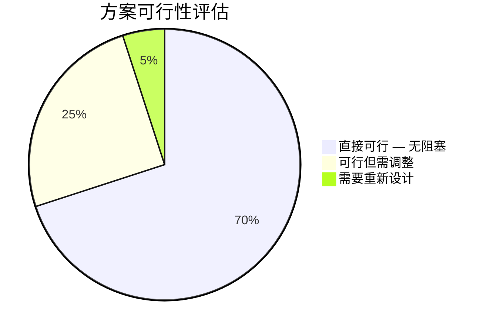
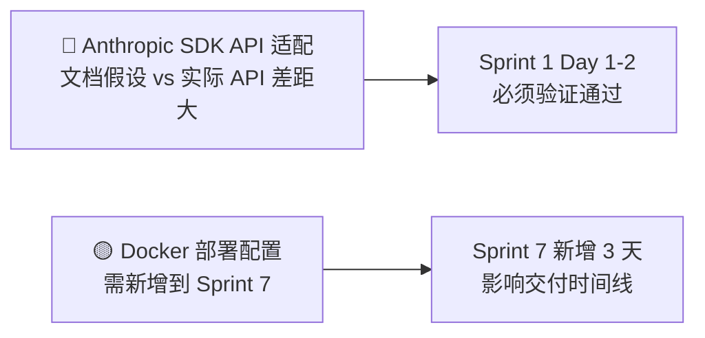
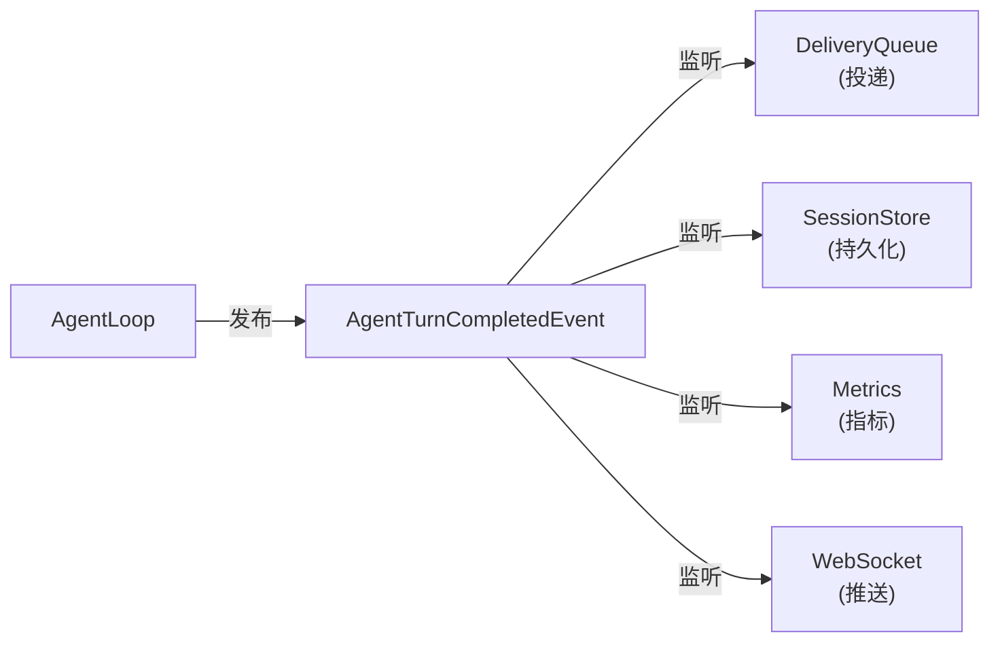

# enterprise-claw-4j 方案审查与改进建议

> 本文档是对 `00-overview.md` ~ `03-testing-and-roadmap.md` 的全面审查结果  
> 包含：依赖版本更新、可行性论证、缺口分析、优化建议

---

## 目录

1. [依赖版本更新](#1-依赖版本更新)
2. [可行性论证](#2-可行性论证)
3. [缺口分析 — 方案中遗漏的内容](#3-缺口分析)
4. [优化建议 — 可以做得更好的地方](#4-优化建议)
5. [需要修正的错误](#5-需要修正的错误)
6. [更新汇总与行动项](#6-更新汇总与行动项)

---

## 1. 依赖版本更新

通过 Maven Central 实时查询（2026-04-05），以下依赖需要更新：

### 1.1 版本对照表

| 依赖 | 文档中版本 | Maven Central 最新版 | 变更说明 |
|------|-----------|---------------------|---------|
| **Spring Boot** | `3.4.4` | **`3.5.3`** ⚠️ | 3.4.x 已接近 EOL（12 个月 OSS 支持期），建议升级到 3.5.x |
| **Anthropic Java SDK** | `1.2.0` (虚构) | **`2.20.0`** 🔴 | 实际 groupId 是 `com.anthropic`，artifactId 是 `anthropic-java`，当前最新 v2.20.0 |
| **dotenv-java** | `3.0.0` | **`3.2.0`** | 小版本更新 |
| **cron-utils** | `9.2.1` | `9.2.1` ✅ | 无变化（最后更新 2023-03） |
| **awaitility** | `4.2.0` | **`4.3.0`** | 小版本更新 |
| **Jackson** | (BOM 管理) | (跟随 Spring Boot BOM) ✅ | — |
| **Logback** | (BOM 管理) | (跟随 Spring Boot BOM) ✅ | — |

### 1.2 Anthropic Java SDK — 重大发现

文档中对 Anthropic Java SDK 的使用方式有多处与实际 SDK API **不一致**，必须纠正：

| 文档中的写法 | 实际 SDK API (v2.20.0) | 影响 |
|-------------|----------------------|------|
| `AnthropicClient.builder().apiKey(...).build()` | `AnthropicOkHttpClient.fromEnv()` 或 `AnthropicOkHttpClient.builder().apiKey(...).build()` | 客户端构造方式不同，SDK 底层使用 OkHttp |
| `client.messages().create(MessageCreateParams.builder()...build())` | 同左 ✅ | 调用方式一致 |
| `response.stopReason()` | `response.stopReason()` → 返回 `StopReason` 枚举 | 需用 `StopReason.END_TURN` 比较 |
| `response.getContent()` 返回 `List<ContentBlock>` | `response.content()` 返回 `List<ContentBlock>` ✅ | 方法名可能是 `content()` 而非 `getContent()` (Kotlin 风格) |
| `block instanceof TextBlock tb` | ✅ `ContentBlock` 是 sealed 类型，支持 pattern matching | 兼容 |
| `.model(MODEL_ID)` 接受字符串 | `.model(Model.CLAUDE_SONNET_4_20250514)` 或 `.model(Model.of(modelId))` | 有预定义常量 |
| `MessageParam.ofUser(...)` / `MessageParam.ofAssistant(...)` | `.addUserMessage(text)` 在 builder 上，或 `MessageParam.ofUser(...)` | 需验证 |
| 不涉及 OkHttp | **SDK 依赖 OkHttp** | 会引入 `okhttp3` 传递依赖 |

> **关键风险**：SDK 底层依赖 OkHttp 而非 JDK HttpClient。这意味着 `spring-boot-starter-web` 的 Tomcat 和 SDK 的 OkHttp 会共存，不会冲突但需注意。

### 1.3 更新后的 Maven properties

```xml
<properties>
    <java.version>21</java.version>
    <spring-boot.version>3.5.3</spring-boot.version>
    <anthropic-sdk.version>2.20.0</anthropic-sdk.version>
    <dotenv.version>3.2.0</dotenv.version>
    <cron-utils.version>9.2.1</cron-utils.version>
    <awaitility.version>4.3.0</awaitility.version>
</properties>
```

### 1.4 Spring Boot 3.5 升级影响

从 3.4 → 3.5 的主要变化：

| 变化项 | 影响 |
|--------|------|
| 虚拟线程默认行为可能调整 | 需验证 `spring.threads.virtual.enabled` 行为是否一致 |
| Actuator 端点变化 | 检查 `management.endpoints` 配置兼容性 |
| Jackson 版本升级 | 序列化行为可能微调，通过 BOM 自动管理 |
| Spring WebSocket 改进 | 可能影响 `WebSocketHandler` API |

---

## 2. 可行性论证

### 2.1 整体可行性评估



### 2.2 逐维度论证

| 维度 | 评估 | 论证 |
|------|------|------|
| **Anthropic SDK 兼容性** | ✅ 可行 | v2.20.0 已经成熟，`MessageCreateParams`/`ContentBlock`/`Tool` 等核心类型齐全。但 API 风格需要从文档中的假设调整为实际 SDK 风格。 |
| **Spring Boot 集成** | ✅ 完全可行 | Spring Boot 3.5 + Java 21 是成熟组合，虚拟线程、WebSocket、Scheduling 全部原生支持 |
| **JSONL 文件存储** | ✅ 可行 | Java NIO 完整支持原子写入、文件监控；Jackson 完美处理 JSONL 格式 |
| **多渠道接入** | ✅ 可行 | CLI (stdin 线程)、Telegram (HttpClient 轮询)、飞书 (OAuth + Webhook) 均有清晰实现路径 |
| **并发模型** | ✅ Java 更优 | `ReentrantLock` + `Condition` + 虚拟线程 比 Python `threading.Lock` 更强大 |
| **混合记忆检索** | ✅ 可行 | TF-IDF + Hash Vector 是纯数学运算，Java 实现甚至更高效 |
| **工时估算** | ⚠️ 偏乐观 | 58 人天对于含测试的完整实现偏紧，尤其是 SDK API 差异、streaming 支持可能增加额外工作量 |

### 2.3 风险最高的环节



---

## 3. 缺口分析

以下是方案中**遗漏或未充分考虑**的内容：

### 3.1 🔴 关键缺失（必须补充）

#### 缺失 1：Docker 部署支持

**问题**：你确认需要同时支持裸机和 Docker/K8s。方案中缺少 Dockerfile 和容器化配置。

**需要补充**：
- `Dockerfile`（多阶段构建）
- `.dockerignore`
- K8s liveness/readiness 探针配置（利用 Actuator）
- 容器化下的文件持久化策略（volume mount for `workspace/`）
- 优雅关闭 (`spring.lifecycle.timeout-per-shutdown-phase`)

#### 缺失 2：Anthropic SDK 真实 API 适配

**问题**：文档中大量代码示例使用了想象中的 SDK API，与实际 v2.20.0 不一致。

**需要纠正的核心点**：
- 客户端构造：使用 `AnthropicOkHttpClient` 而非 `AnthropicClient.builder()`
- OkHttp 传递依赖：SDK 自带 OkHttp，需要理解对项目的影响
- `Model` 枚举常量的使用
- `StopReason` 的比较方式

### 3.2 🟡 重要缺失（建议补充）

#### 缺失 3：优雅关闭 (Graceful Shutdown)

**问题**：生产系统需要在关闭时：
1. 停止接收新请求
2. 等待进行中的 Agent 对话回合完成
3. 将未投递的消息持久化到磁盘
4. 关闭所有 Channel 连接

**建议**：添加 `@PreDestroy` 或 `SmartLifecycle` 实现；`CommandQueue.waitForAll(timeout)` 应在关闭流程中调用。

#### 缺失 4：Workspace 文件热重载

**问题**：claw0 的 workspace 文件（SOUL.md, IDENTITY.md 等）是「换文件 = 换行为」的核心特性。方案中 `BootstrapLoader` 只有 `reload()` 方法，但未定义触发机制。

**建议**：
- 使用 `WatchService` 监控 workspace 目录变更
- 或提供 REST API `POST /api/v1/reload` 手动触发
- 或 Spring `@Scheduled` 定期检查文件修改时间

#### 缺失 5：SessionStore 并发安全

**问题**：多个 Lane（main、cron、heartbeat）可能同时操作同一个 Agent 的会话文件。JSONL 的 `appendTranscript()` 需要考虑并发写入。

**建议**：
- 对 `SessionStore` 的写操作加 Agent 级别的锁（`ConcurrentHashMap<String, ReentrantLock>`）
- 或通过 `CommandQueue` 的串行化保证同一 Agent 不会并发写入

#### 缺失 6：REST API 请求验证 (Bean Validation)

**问题**：方案提到了验证规则（Agent ID 格式、name 长度等），但没有在类设计中体现。

**建议**：使用 `spring-boot-starter-validation` + `@Valid` / `@Pattern` 注解：
```java
public record CreateAgentRequest(
    @NotBlank @Pattern(regexp = "[a-z0-9][a-z0-9_-]{0,63}") String id,
    @NotBlank @Size(max = 128) String name,
    // ...
) {}
```

### 3.3 🟢 小改进（可选）

| 项目 | 说明 |
|------|------|
| **Spring Profiles 文档化** | 当前只提到 `application-dev.yml` / `application-prod.yml`，但没有说明各 Profile 的差异 |
| **API 版本化策略** | 使用了 `/api/v1`，但没有说明版本升级策略 |
| **日志追踪 ID** | 生产系统需要跨请求/跨模块的 trace ID，建议集成 Micrometer Tracing 或 MDC |
| **配置校验** | `@ConfigurationProperties` 加 `@Validated` 注解，启动时验证配置完整性 |
| **健康检查自定义** | 自定义 `HealthIndicator`：Claude API 可达性、Channel 连接状态、磁盘空间 |

---

## 4. 优化建议

### 4.1 架构优化

#### 优化 1：引入事件驱动解耦

**现状**：Agent 回复后直接调用 `DeliveryQueue.enqueue()`，模块间紧耦合。

**建议**：使用 Spring `ApplicationEventPublisher` 发布事件，各模块独立监听：



**收益**：新增功能（如审计日志、Webhook 回调）无需修改 AgentLoop。

#### 优化 2：工具注册自动化

**现状**：`ToolHandler` 实现类需要手动或通过 `ToolRegistry.register()` 注册。

**建议**：利用 Spring 自动注入：
```java
@Service
public class ToolRegistry {
    public ToolRegistry(List<ToolHandler> handlers) {
        handlers.forEach(h -> this.handlers.put(h.getName(), h));
    }
}
```
所有 `@Component` 标注的 `ToolHandler` 自动注册，零配置。

#### 优化 3：ContextGuard 与 ResilienceRunner 职责边界

**现状**：`ContextGuard` 同时出现在 `session` 模块和 `resilience` 模块，存在循环依赖风险。

**建议**：明确 `ContextGuard` 只属于 `session` 模块，`ResilienceRunner` 通过接口依赖它，而非直接引用。

### 4.2 性能优化

| 项目 | 现状 | 建议 | 收益 |
|------|------|------|------|
| **DeliveryRunner 轮询** | 1s 固定轮询 | 改为 `ScheduledExecutorService` + 有任务时立即唤醒 | 减少空轮询开销 |
| **BootstrapLoader 缓存** | 有 `fileCache` 但无失效策略 | 加入文件修改时间检查，仅变更时重载 | 避免每次对话回合读磁盘 |
| **TF-IDF 索引** | 每次搜索重算 | 写入时增量更新 IDF 索引 | 搜索延迟从 O(n·m) 降到 O(m) |
| **JSONL 会话加载** | 每次 `loadSession` 全量读取 | 缓存最近活跃的 N 个会话在内存 | 减少 I/O |

### 4.3 工时优化建议

考虑新增需求（Docker 部署、优雅关闭），建议调整工时：

| Sprint | 原估算 | 调整后 | 变化原因 |
|--------|--------|--------|---------|
| Sprint 1 | 9d | 9d | 不变 |
| Sprint 2 | 10d | 10d | 不变 |
| Sprint 3 | 7d | 7d | 不变 |
| Sprint 4 | 8d | 8d | 不变 |
| Sprint 5 | 8d | 8d | 不变 |
| Sprint 6 | 9d | 9d | 不变 |
| Sprint 7 | 7d | **10d** | +2d Docker/K8s 部署配置 + 1d 优雅关闭实现与测试 |
| **总计** | **58d** | **61d (约 12~13 周)** | +3d |

---

## 5. 需要修正的错误

### 5.1 Anthropic SDK API 错误

| 文件 | 位置 | 错误 | 修正 |
|------|------|------|------|
| `00-overview.md` | §7.2 Spring Boot 配置 | Spring Boot 版本 `3.4.4` | → `3.5.3` |
| `00-overview.md` | §3.2 依赖配置 | `anthropic-sdk.version` = `1.2.0` | → `2.20.0` |
| `00-overview.md` | §3.2 依赖配置 | `dotenv.version` = `3.0.0` | → `3.2.0` |
| `00-overview.md` | §3.2 依赖配置 | `awaitility.version` = `4.2.0` | → `4.3.0` |
| `00-overview.md` | §3.1 Maven 父 POM | `<version>3.4.4</version>` | → `3.5.3` |
| `01-module-design.md` | §1.2 AgentLoop 代码 | 未说明 SDK 构造方式 | 已补充 `AnthropicOkHttpClient` 构造说明 ✅ |
| `01-module-design.md` | §9 Resilience | `AnthropicClient` 类名 | 已补充 `AnthropicOkHttpClient` 注释 ✅ |
| `02-api-and-dataflow.md` | — | 缺少 Docker 部署章节 | 已新增 §7 Docker 部署 + §8 优雅关闭 ✅ |
| `03-testing-and-roadmap.md` | §2.2 总工时 | 58 人天 | 已调整为 61 人天 ✅ |

### 5.2 设计不一致

| 问题 | 位置 | 说明 |
|------|------|------|
| `dotenv-java` 与 Spring 冗余 | `00-overview.md` §3 | Spring Boot 已有 `@Value` + `application.yml`，`dotenv-java` 功能重叠。建议二选一：要么用 Spring 原生机制读取 `${ENV_VAR}`，要么用 dotenv-java 但不重复定义。 |
| `CliChannel` 的 `@ConditionalOnProperty` 描述 | `01-module-design.md` §4.2 | 说「始终启用」但又标注 `@ConditionalOnProperty`，逻辑矛盾。应改为「无条件注册」或「仅在非 headless 模式下启用」。 |
| `CronJob` 用 `record` 但需要可变 `errorCount` | `01-module-design.md` §7.1 | `record` 是不可变的，但 `errorCount`/`lastRunAt` 需要运行时更新。建议用普通 class 或每次创建新 record 实例。 |

---

## 6. 更新汇总与行动项

### 6.1 必须立即修正（文档更新）

- [x] **所有文档**：Spring Boot 版本 `3.4.4` → `3.5.3`
- [x] **所有文档**：Anthropic SDK 版本 `1.2.0` → `2.20.0`
- [x] **所有文档**：dotenv-java `3.0.0` → `3.2.0`
- [x] **所有文档**：awaitility `4.2.0` → `4.3.0`
- [x] **`01-module-design.md`**：修正 Anthropic SDK 客户端构造方式为 `AnthropicOkHttpClient`
- [x] **`01-module-design.md`**：`CronJob` 从 `record` 改为 mutable class

### 6.2 必须补充的新内容

- [x] **Docker 部署**：增加 Dockerfile、.dockerignore、K8s 探针配置（→ `02-api-and-dataflow.md` §7）
- [x] **优雅关闭**：增加 `SmartLifecycle` 关闭流程设计（→ `01-module-design.md` §11.3 + `02-api-and-dataflow.md` §8）
- [x] **请求验证**：增加 `spring-boot-starter-validation` 依赖（→ `00-overview.md` §3.3）
- [x] **SessionStore 并发安全**：增加 Agent 级别锁说明（→ `01-module-design.md` §3.1）
- [ ] ~~Streaming 支持~~ — 第一期不需要，保留 AgentLoop 同步模式

### 6.3 建议性改进

- [ ] 引入 `ApplicationEvent` 解耦 AgentLoop 与 DeliveryQueue
- [x] `ToolHandler` 自动注册（Spring `List<ToolHandler>` 注入）— 已补充到 `01-module-design.md` §2.2
- [ ] Workspace 文件热重载机制
- [ ] Micrometer Tracing / MDC 日志追踪
- [ ] 自定义 `HealthIndicator`（Claude API、Channel、磁盘空间）
- [x] 工时调整为 61 人天 / 约 12~13 周
