# claw0 架构分析文档

> **项目全称**: claw0 — From Zero to One: Build an AI Agent Gateway
> **定位**: 渐进式教学代码库，用 10 个独立可运行的 Python 文件，从零构建一个生产级 AI Agent 网关
> **代码规模**: ~7,000 行 Python，三语并行（English / 中文 / 日本語）
> **开源协议**: MIT

---

## 目录

1. [项目总览](#1-项目总览)
2. [目录结构](#2-目录结构)
3. [依赖清单](#3-依赖清单)
4. [整体分层架构](#4-整体分层架构)
5. [Session 间依赖关系](#5-session-间依赖关系)
6. [逐层详解](#6-逐层详解)
   - [S01: Agent Loop](#s01-agent-loop)
   - [S02: Tool Use](#s02-tool-use)
   - [S03: Sessions & Context Guard](#s03-sessions--context-guard)
   - [S04: Channels](#s04-channels)
   - [S05: Gateway & Routing](#s05-gateway--routing)
   - [S06: Intelligence](#s06-intelligence)
   - [S07: Heartbeat & Cron](#s07-heartbeat--cron)
   - [S08: Delivery](#s08-delivery)
   - [S09: Resilience](#s09-resilience)
   - [S10: Concurrency](#s10-concurrency)
7. [端到端数据流](#7-端到端数据流)
8. [Workspace 配置体系](#8-workspace-配置体系)
9. [贯穿全局的设计模式](#9-贯穿全局的设计模式)
10. [关键设计决策](#10-关键设计决策)
11. [学习路径建议](#11-学习路径建议)

---

## 1. 项目总览

claw0 的核心理念是 **「每节课只引入一个新概念，同时保留所有先前代码」**。10 个 session 从最简单的 `while True` 循环开始，逐步叠加工具调用、会话持久化、多渠道接入、网关路由、智能体人格、定时心跳、可靠投递、韧性容错，直到并发调度——最终形成一个完整的 AI Agent 网关。

完成全部 10 个 session 后，开发者可以自信地阅读 OpenClaw 的生产代码库。

---

## 2. 目录结构

```
claw0/
├── .env.example              # 环境变量模板
├── .gitignore
├── requirements.txt          # 6 个 Python 依赖
├── README.md / .zh.md / .ja.md
├── sessions/
│   ├── en/                   # 英文版：10 个 .py + 10 个 .md
│   ├── zh/                   # 中文版：10 个 .py + 10 个 .md
│   └── ja/                   # 日文版：10 个 .py + 10 个 .md
└── workspace/                # Agent 共享工作区
    ├── SOUL.md               # 人格定义（Luna）
    ├── IDENTITY.md           # 角色与边界
    ├── TOOLS.md              # 工具使用指南
    ├── USER.md               # 用户上下文
    ├── MEMORY.md             # 长期记忆
    ├── HEARTBEAT.md          # 主动检查指令
    ├── BOOTSTRAP.md          # 启动上下文
    ├── AGENTS.md             # 多 Agent 协调
    ├── CRON.json             # 定时任务定义
    └── skills/
        └── example-skill/
            └── SKILL.md      # 技能定义示例
```

每个语言文件夹完全自包含——可运行的 Python 代码与对应的 Markdown 文档并列存放。三种语言的代码逻辑完全一致，仅注释和文档不同。

---

## 3. 依赖清单

| 包名 | 版本要求 | 用途 | 引入 Session |
|------|---------|------|-------------|
| `anthropic` | ≥0.39.0 | Claude API 客户端 | S01 |
| `python-dotenv` | ≥1.0.0 | `.env` 配置加载 | S01 |
| `websockets` | ≥12.0 | 网关 WebSocket 服务 | S05 |
| `croniter` | ≥2.0.0 | Cron 表达式解析 | S07 |
| `python-telegram-bot` | ≥21.0 | Telegram 集成 | S04 |
| `httpx` | ≥0.27.0 | Telegram/Feishu HTTP 客户端 | S04 |

---

## 4. 整体分层架构

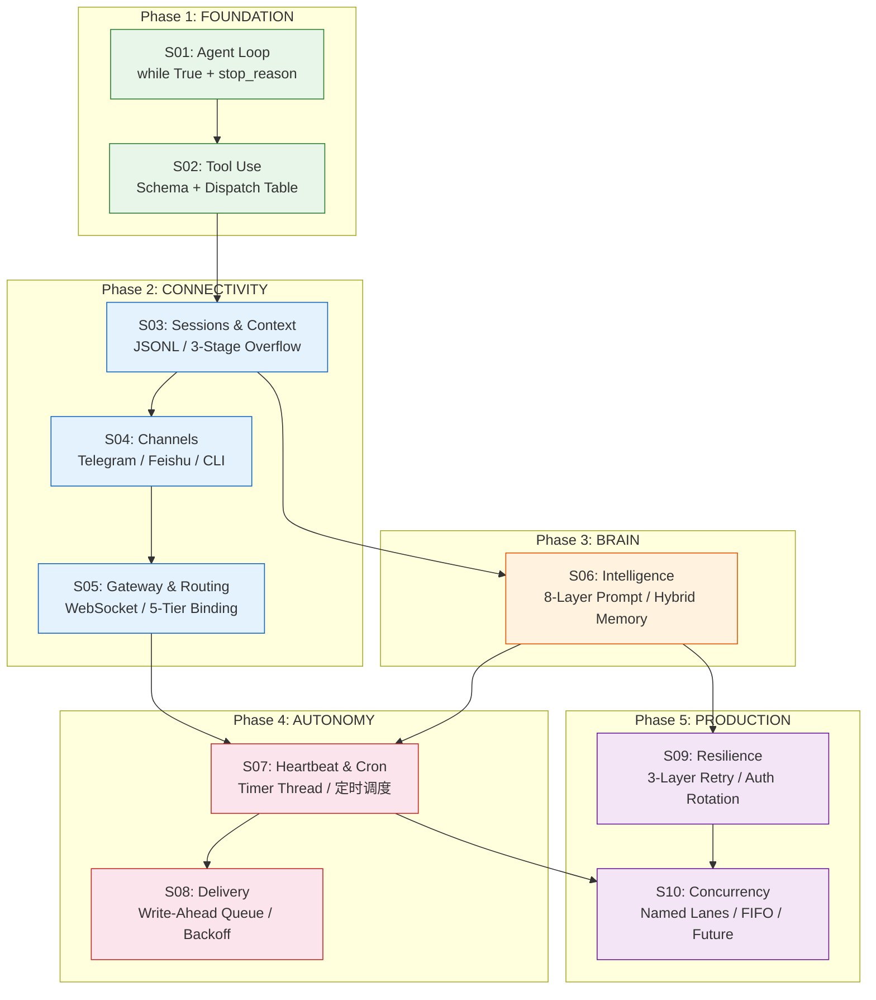
```mermaid
graph TB
    subgraph "Phase 5: PRODUCTION"
        S10["S10: Concurrency<br/>Named Lanes / FIFO / Future"]
        S09["S09: Resilience<br/>3-Layer Retry / Auth Rotation"]
    end

    subgraph "Phase 4: AUTONOMY"
        S08["S08: Delivery<br/>Write-Ahead Queue / Backoff"]
        S07["S07: Heartbeat & Cron<br/>Timer Thread / 定时调度"]
    end

    subgraph "Phase 3: BRAIN"
        S06["S06: Intelligence<br/>8-Layer Prompt / Hybrid Memory"]
    end

    subgraph "Phase 2: CONNECTIVITY"
        S05["S05: Gateway & Routing<br/>WebSocket / 5-Tier Binding"]
        S04["S04: Channels<br/>Telegram / Feishu / CLI"]
        S03["S03: Sessions & Context<br/>JSONL / 3-Stage Overflow"]
    end

    subgraph "Phase 1: FOUNDATION"
        S02["S02: Tool Use<br/>Schema + Dispatch Table"]
        S01["S01: Agent Loop<br/>while True + stop_reason"]
    end

    S01 --> S02 --> S03 --> S04 --> S05
    S03 --> S06
    S05 --> S07
    S06 --> S07 --> S08
    S06 --> S09
    S07 --> S10
    S09 --> S10

    style S01 fill:#e8f5e9,stroke:#2e7d32
    style S02 fill:#e8f5e9,stroke:#2e7d32
    style S03 fill:#e3f2fd,stroke:#1565c0
    style S04 fill:#e3f2fd,stroke:#1565c0
    style S05 fill:#e3f2fd,stroke:#1565c0
    style S06 fill:#fff3e0,stroke:#e65100
    style S07 fill:#fce4ec,stroke:#c62828
    style S08 fill:#fce4ec,stroke:#c62828
    style S09 fill:#f3e5f5,stroke:#6a1b9a
    style S10 fill:#f3e5f5,stroke:#6a1b9a
```

---

## 5. Session 间依赖关系

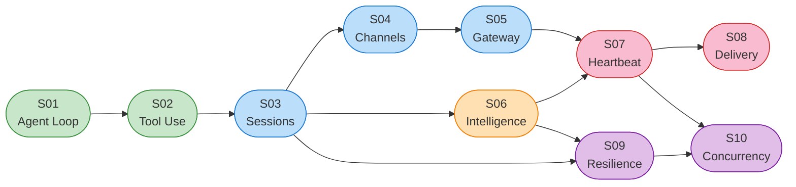
```mermaid
graph LR
    S01([S01<br/>Agent Loop]) --> S02([S02<br/>Tool Use])
    S02 --> S03([S03<br/>Sessions])
    S03 --> S04([S04<br/>Channels])
    S04 --> S05([S05<br/>Gateway])
    S03 --> S06([S06<br/>Intelligence])
    S06 --> S07([S07<br/>Heartbeat])
    S05 --> S07
    S07 --> S08([S08<br/>Delivery])
    S03 --> S09([S09<br/>Resilience])
    S06 --> S09
    S07 --> S10([S10<br/>Concurrency])
    S09 --> S10

    style S01 fill:#c8e6c9,stroke:#388e3c
    style S02 fill:#c8e6c9,stroke:#388e3c
    style S03 fill:#bbdefb,stroke:#1976d2
    style S04 fill:#bbdefb,stroke:#1976d2
    style S05 fill:#bbdefb,stroke:#1976d2
    style S06 fill:#ffe0b2,stroke:#f57c00
    style S07 fill:#f8bbd0,stroke:#d32f2f
    style S08 fill:#f8bbd0,stroke:#d32f2f
    style S09 fill:#e1bee7,stroke:#7b1fa2
    style S10 fill:#e1bee7,stroke:#7b1fa2
```

- **S01→S02**: 基础循环，无外部依赖
- **S03**: 在 S02 之上添加会话持久化
- **S04**: 在 S03 之上添加渠道抽象
- **S05**: 在 S04 之上添加路由和网关
- **S06**: 在 S03 之上添加智能层（系统提示词、记忆、技能）
- **S07**: 合并 S05 网关 + S06 智能层，添加心跳和定时
- **S08**: 在 S07 之上添加可靠投递
- **S09**: 复用 S03 的 ContextGuard + S06 的模型配置，添加韧性
- **S10**: 用命名队列替换 S07 的单一 Lock

---

## 6. 逐层详解

### S01: Agent Loop

> **核心命题**: Agent = `while True` + `stop_reason`

#### 架构图

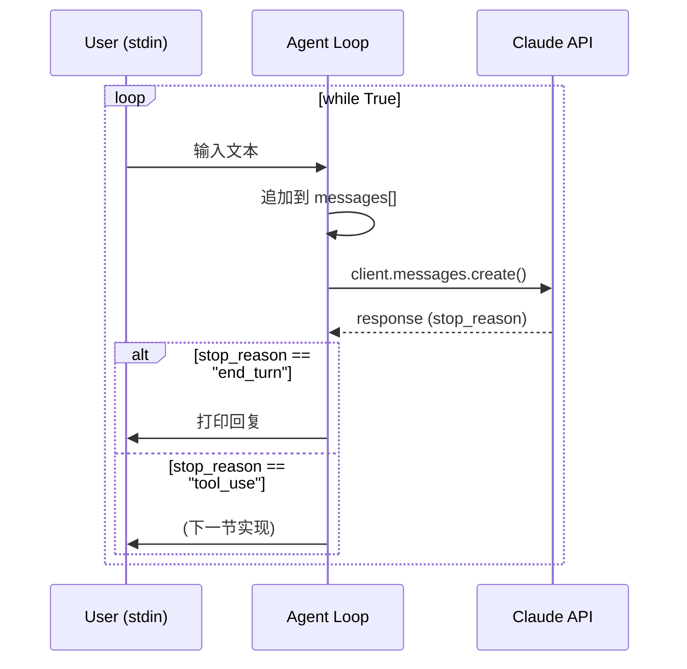
```mermaid
sequenceDiagram
    participant U as User (stdin)
    participant L as Agent Loop
    participant A as Claude API

    loop while True
        U->>L: 输入文本
        L->>L: 追加到 messages[]
        L->>A: client.messages.create()
        A-->>L: response (stop_reason)
        alt stop_reason == "end_turn"
            L->>U: 打印回复
        else stop_reason == "tool_use"
            L->>U: (下一节实现)
        end
    end
```

#### 关键实现

```python
def agent_loop() -> None:
    messages: list[dict] = []           # 内存会话状态
    while True:
        user_input = input("You > ")
        messages.append({"role": "user", "content": user_input})

        response = client.messages.create(
            model=MODEL_ID,
            max_tokens=8096,
            system=SYSTEM_PROMPT,
            messages=messages,
        )

        if response.stop_reason == "end_turn":
            # 提取文本，打印，追加到 messages
            ...
        elif response.stop_reason == "tool_use":
            # S02 中实现
            ...
```

#### 设计要点

- `messages[]` 在内存中累积，跨轮次保持上下文
- API 错误时弹出最后一条 user 消息，允许重试
- 退出方式：`quit` / `exit` / `Ctrl+C`

---

### S02: Tool Use

> **核心命题**: 工具 = JSON Schema（给模型看）+ Handler Map（给代码调用）

#### 架构图

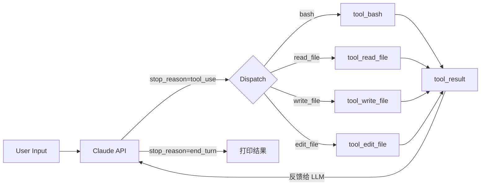
```mermaid
flowchart LR
    U[User Input] --> LLM[Claude API]
    LLM -->|stop_reason=tool_use| D{Dispatch}
    D -->|bash| B[tool_bash]
    D -->|read_file| R[tool_read_file]
    D -->|write_file| W[tool_write_file]
    D -->|edit_file| E[tool_edit_file]
    B --> TR[tool_result]
    R --> TR
    W --> TR
    E --> TR
    TR -->|反馈给 LLM| LLM
    LLM -->|stop_reason=end_turn| O[打印结果]
```

#### 双表设计

| 组件 | 作用 | 对谁可见 |
|------|------|---------|
| `TOOLS: list[dict]` | JSON Schema 定义，描述参数 | 模型 |
| `TOOL_HANDLERS: dict[str, Callable]` | 函数映射表，执行实际逻辑 | 代码 |

```python
# 分发逻辑
def process_tool_call(tool_name: str, tool_input: dict) -> str:
    handler = TOOL_HANDLERS.get(tool_name)
    return handler(**tool_input)
```

#### 安全措施

- **路径穿越防护**: `safe_path()` 确保所有文件操作在 `WORKDIR` 内
- **危险命令黑名单**: `rm -rf /`、`mkfs`、`> /dev/sd`、`dd if=` 被拒绝
- **输出截断**: 工具输出超过 50,000 字符自动截断
- **子进程超时**: 默认 30 秒

#### 内层循环

S02 引入了**内层 while 循环**——模型可能连续调用多个工具，直到 `stop_reason == "end_turn"` 才退出：

```python
# 外层：等待用户输入
while True:
    user_input = input(...)
    messages.append(...)

    # 内层：处理工具链
    while True:
        response = client.messages.create(...)
        if response.stop_reason == "end_turn":
            break
        elif response.stop_reason == "tool_use":
            # 分发工具，收集结果，继续循环
            ...
```

---

### S03: Sessions & Context Guard

> **核心命题**: JSONL 持久化 + 三阶段上下文溢出恢复

#### 架构图

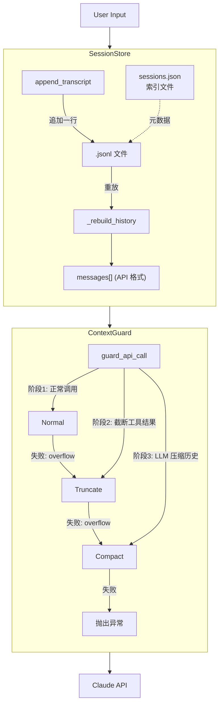
```mermaid
flowchart TB
    subgraph SessionStore
        direction TB
        A[append_transcript] -->|追加一行| J[".jsonl 文件"]
        J -->|重放| R[_rebuild_history]
        R --> M["messages[] (API 格式)"]
        IDX["sessions.json<br/>索引文件"] -.->|元数据| J
    end

    subgraph ContextGuard
        direction TB
        G[guard_api_call]
        G -->|"阶段1: 正常调用"| N[Normal]
        N -->|失败: overflow| T[Truncate]
        G -->|"阶段2: 截断工具结果"| T
        T -->|失败: overflow| C[Compact]
        G -->|"阶段3: LLM 压缩历史"| C
        C -->|失败| E[抛出异常]
    end

    UI[User Input] --> SessionStore
    SessionStore --> ContextGuard
    ContextGuard --> API[Claude API]
```

#### SessionStore 详解

- **存储格式**: 每个会话是一个 `.jsonl` 文件，位于 `workspace/.sessions/agents/{agent_id}/sessions/`
- **写入**: `append_transcript()` 每个事件（user / assistant / tool_use / tool_result）追加一行 JSON
- **读取**: `_rebuild_history()` 逐行重放 JSONL，正确处理消息交替（user/assistant）和 tool_result 分组
- **索引**: `sessions.json` 记录元数据（label、created_at、last_active、message_count）

#### ContextGuard 三阶段重试

| 阶段 | 策略 | 说明 |
|------|------|------|
| 1 | 正常调用 | 直接发送 |
| 2 | 截断工具结果 | 只保留每个 `tool_result` 的前 30% 上下文预算 |
| 3 | 压缩历史 | 用 LLM 总结最旧 50% 的消息，保留最近 20% |

- **Token 估算**: `estimate_tokens(text)` — 启发式，1 token ≈ 4 字符
- **上下文预算**: 默认 180,000 tokens

#### REPL 命令

`/new`、`/list`、`/switch`、`/context`（显示用量条）、`/compact`、`/help`

---

### S04: Channels

> **核心命题**: 平台抽象——所有渠道统一产出 `InboundMessage`

#### 架构图

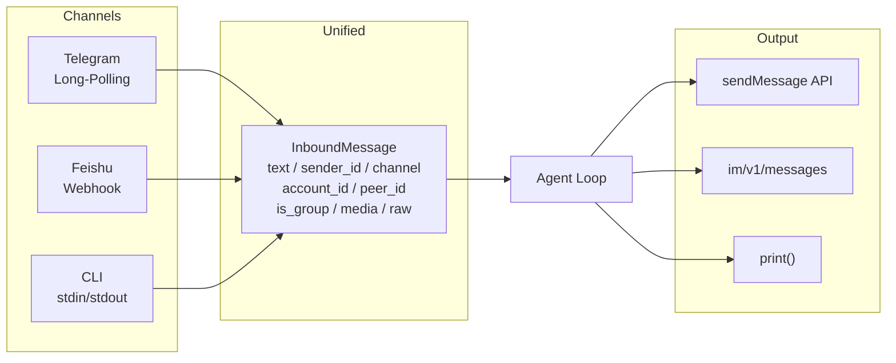
```mermaid
flowchart LR
    subgraph Channels
        TG[Telegram<br/>Long-Polling]
        FS[Feishu<br/>Webhook]
        CLI[CLI<br/>stdin/stdout]
    end

    subgraph Unified
        IM[InboundMessage<br/>text / sender_id / channel<br/>account_id / peer_id<br/>is_group / media / raw]
    end

    subgraph Output
        TGO[sendMessage API]
        FSO[im/v1/messages]
        CO["print()"]
    end

    TG --> IM
    FS --> IM
    CLI --> IM
    IM --> Agent[Agent Loop]
    Agent --> TGO
    Agent --> FSO
    Agent --> CO
```

#### Channel 抽象基类

```python
class Channel(ABC):
    def receive(self) -> InboundMessage | None: ...
    def send(self, to: str, text: str, **kwargs) -> bool: ...
    def close(self) -> None: ...
```

#### 三个实现

| 渠道 | 消息接收方式 | 特殊能力 |
|------|------------|---------|
| **CLIChannel** | `input()` | 始终可用 |
| **TelegramChannel** | HTTP 长轮询（后台守护线程） | Offset 持久化、去重（Set, 5000 上限）、媒体组缓冲（500ms）、文本合并缓冲（1s）、Forum/Topic 支持、消息分块（4096 限制） |
| **FeishuChannel** | Webhook 事件驱动 | OAuth tenant token 自动刷新、国内/国际端点切换、富文本解析、Bot @检测 |

#### ChannelManager

注册中心，提供 `register()`、`get()`、`close_all()` 方法。

#### 会话键构建

```python
build_session_key() → "agent:main:direct:{channel}:{peer_id}"
```

#### 新增工具

- `memory_write`: 向 MEMORY.md 追加内容
- `memory_search`: 关键词搜索记忆

---

### S05: Gateway & Routing

> **核心命题**: 5 级绑定表 + WebSocket 网关 + 多 Agent 路由

#### 5 级绑定表

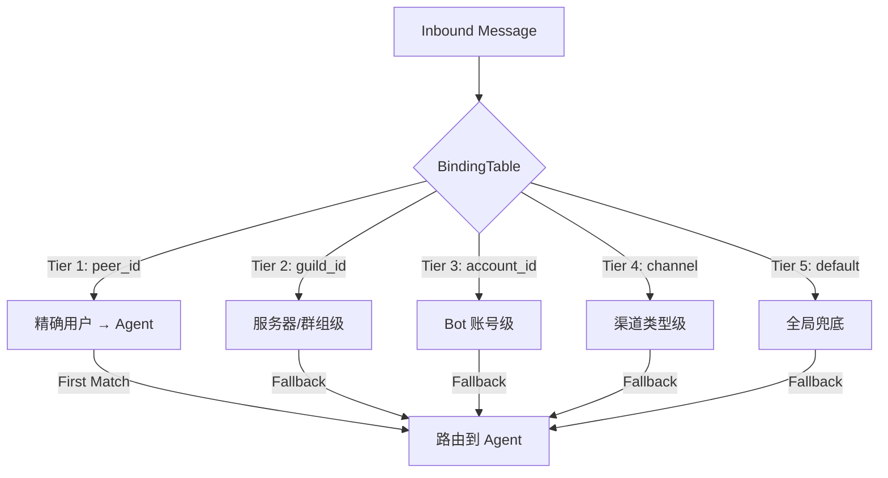
```mermaid
flowchart TB
    MSG[Inbound Message] --> BT{BindingTable}
    BT -->|"Tier 1: peer_id"| A1["精确用户 → Agent"]
    BT -->|"Tier 2: guild_id"| A2["服务器/群组级"]
    BT -->|"Tier 3: account_id"| A3["Bot 账号级"]
    BT -->|"Tier 4: channel"| A4["渠道类型级"]
    BT -->|"Tier 5: default"| A5["全局兜底"]

    A1 -->|First Match| R[路由到 Agent]
    A2 -->|Fallback| R
    A3 -->|Fallback| R
    A4 -->|Fallback| R
    A5 -->|Fallback| R
```

**路由规则**: 按 `(tier, -priority)` 排序，首个匹配的规则胜出。

#### AgentConfig

```python
@dataclass
class AgentConfig:
    id: str              # Agent 标识
    name: str            # 显示名
    personality: str     # 人格描述
    model: str           # 使用的模型
    dm_scope: str        # 会话隔离粒度
```

`dm_scope` 控制会话隔离：

| 值 | 含义 |
|----|------|
| `main` | 所有用户共享一个会话 |
| `per-peer` | 每个用户独立会话 |
| `per-channel-peer` | 每渠道每用户独立 |
| `per-account-channel-peer` | 最细粒度隔离 |

#### WebSocket 网关

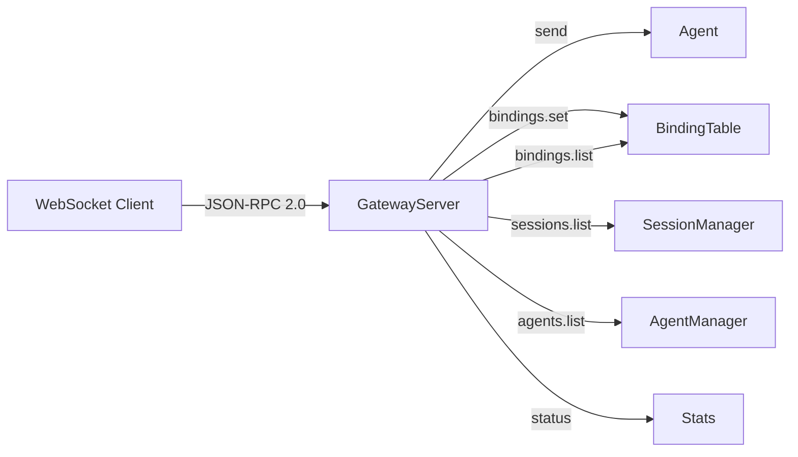
```mermaid
flowchart LR
    WS[WebSocket Client] -->|JSON-RPC 2.0| GW[GatewayServer]
    GW -->|send| Agent
    GW -->|bindings.set| BT[BindingTable]
    GW -->|bindings.list| BT
    GW -->|sessions.list| SM[SessionManager]
    GW -->|agents.list| AM[AgentManager]
    GW -->|status| Stats
```

- **并发控制**: `asyncio.Semaphore(4)` 限制同时执行的 Agent 数
- **Typing 通知**: 广播给所有连接的客户端
- **Agent ID 规范化**: `normalize_agent_id()` 强制 `[a-z0-9][a-z0-9_-]{0,63}` 格式

#### 演示配置

预设两个 Agent：

- **Luna**: 温暖、好奇
- **Sage**: 直接、分析型

---

### S06: Intelligence

> **核心命题**: 系统提示词 = 磁盘文件。换文件 = 换人格。

#### 8 层系统提示词组装

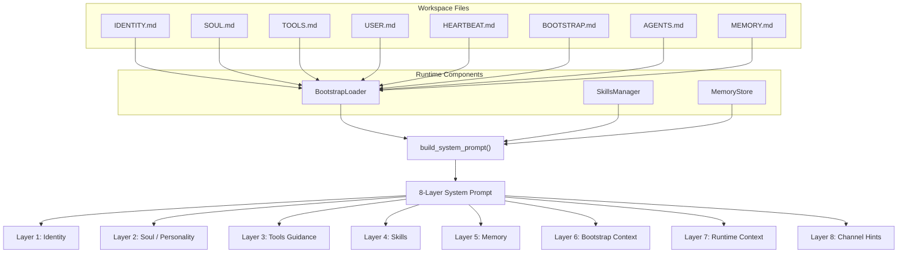
```mermaid
flowchart TB
    subgraph "Workspace Files"
        ID[IDENTITY.md]
        SO[SOUL.md]
        TO[TOOLS.md]
        US[USER.md]
        HB[HEARTBEAT.md]
        BS[BOOTSTRAP.md]
        AG[AGENTS.md]
        ME[MEMORY.md]
    end

    subgraph "Runtime Components"
        BL[BootstrapLoader]
        SK[SkillsManager]
        MS[MemoryStore]
    end

    ID --> BL
    SO --> BL
    TO --> BL
    US --> BL
    HB --> BL
    BS --> BL
    AG --> BL
    ME --> BL

    BL --> BUILD["build_system_prompt()"]
    SK --> BUILD
    MS --> BUILD

    BUILD --> SP["8-Layer System Prompt"]

    SP --> L1["Layer 1: Identity"]
    SP --> L2["Layer 2: Soul / Personality"]
    SP --> L3["Layer 3: Tools Guidance"]
    SP --> L4["Layer 4: Skills"]
    SP --> L5["Layer 5: Memory"]
    SP --> L6["Layer 6: Bootstrap Context"]
    SP --> L7["Layer 7: Runtime Context"]
    SP --> L8["Layer 8: Channel Hints"]
```

#### BootstrapLoader

- 三种加载模式: `full`（全部文件）、`minimal`（仅 AGENTS + TOOLS）、`none`（空）
- 单文件上限: 20,000 字符
- 总量上限: 150,000 字符

#### SkillsManager

- **扫描路径**（优先级递增）:
  1. `workspace/skills/`
  2. `workspace/.skills/`
  3. `workspace/.agents/skills/`
  4. `cwd/.agents/skills/`
  5. `cwd/skills/`
- **技能格式**: 包含 `SKILL.md`（YAML frontmatter + body）的目录
- 后扫描的同名技能覆盖先前的
- 上限: 150 个技能，总计 30,000 字符

#### MemoryStore — 混合检索

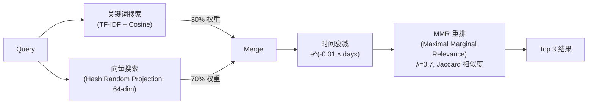
```mermaid
flowchart LR
    Q[Query] --> KW["关键词搜索<br/>(TF-IDF + Cosine)"]
    Q --> VS["向量搜索<br/>(Hash Random Projection, 64-dim)"]
    KW -->|30% 权重| MG[Merge]
    VS -->|70% 权重| MG
    MG --> TD["时间衰减<br/>e^(-0.01 × days)"]
    TD --> MMR["MMR 重排<br/>(Maximal Marginal Relevance)<br/>λ=0.7, Jaccard 相似度"]
    MMR --> TOP3["Top 3 结果"]
```

**两级记忆**:

| 层级 | 存储 | 写入方式 |
|------|------|---------|
| Evergreen | `MEMORY.md` | 手动维护 |
| Daily Logs | `memory/daily/{date}.jsonl` | Agent 工具自动写入 |

**自动召回**: 每次用户发言时，`_auto_recall(user_message)` 搜索记忆并将 Top 3 注入系统提示词。

---

### S07: Heartbeat & Cron

> **核心命题**: 后台定时器线程 + CRON 调度 = 主动式 Agent

#### 双车道互斥模型

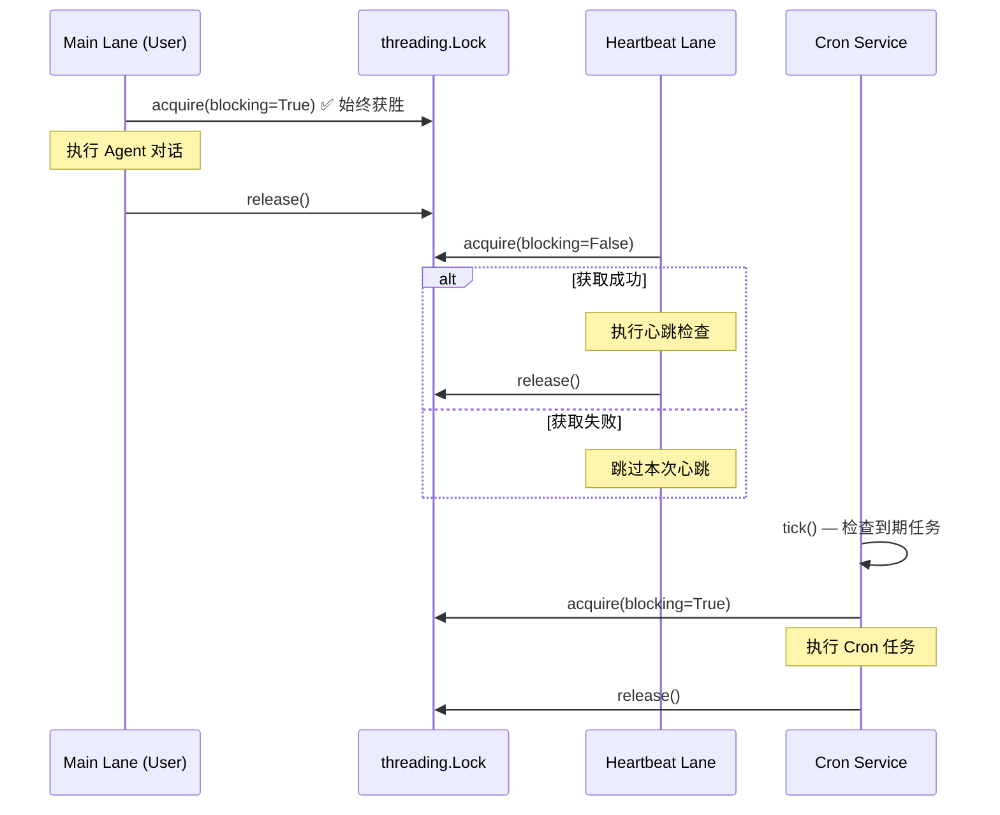
```mermaid
sequenceDiagram
    participant U as Main Lane (User)
    participant Lock as threading.Lock
    participant H as Heartbeat Lane
    participant C as Cron Service

    U->>Lock: acquire(blocking=True) ✅ 始终获胜
    Note over U: 执行 Agent 对话
    U->>Lock: release()

    H->>Lock: acquire(blocking=False)
    alt 获取成功
        Note over H: 执行心跳检查
        H->>Lock: release()
    else 获取失败
        Note over H: 跳过本次心跳
    end

    C->>C: tick() — 检查到期任务
    C->>Lock: acquire(blocking=True)
    Note over C: 执行 Cron 任务
    C->>Lock: release()
```

#### HeartbeatRunner

4 个前置条件检查:
1. `HEARTBEAT.md` 存在
2. 文件非空
3. 距上次心跳已过间隔
4. 在活跃时段内（默认 9:00-22:00）

- **非阻塞锁获取**: 用户优先，心跳让步
- **去重**: 输出与 `_last_output` 相同则跳过
- **哨兵响应**: `"HEARTBEAT_OK"` 表示无需报告
- **输出队列**: 心跳结果排队，在主循环中排出

#### CronService

支持三种调度类型:

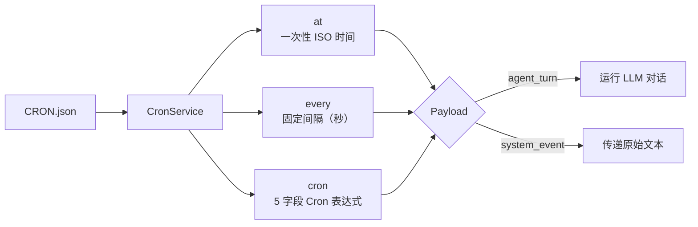
```mermaid
flowchart LR
    CJ["CRON.json"] --> CS[CronService]
    CS --> AT["at<br/>一次性 ISO 时间"]
    CS --> EV["every<br/>固定间隔（秒）"]
    CS --> CR["cron<br/>5 字段 Cron 表达式"]

    AT --> PL{Payload}
    EV --> PL
    CR --> PL

    PL -->|agent_turn| LLM["运行 LLM 对话"]
    PL -->|system_event| SE["传递原始文本"]
```

- 连续 5 次错误自动禁用（`CRON_AUTO_DISABLE_THRESHOLD`）
- 运行日志追加到 `cron/cron-runs.jsonl`
- 支持 `delete_after_run` 一次性任务

---

### S08: Delivery

> **核心命题**: 先写磁盘，再发送。崩溃不丢消息。

#### Write-Ahead Queue 架构

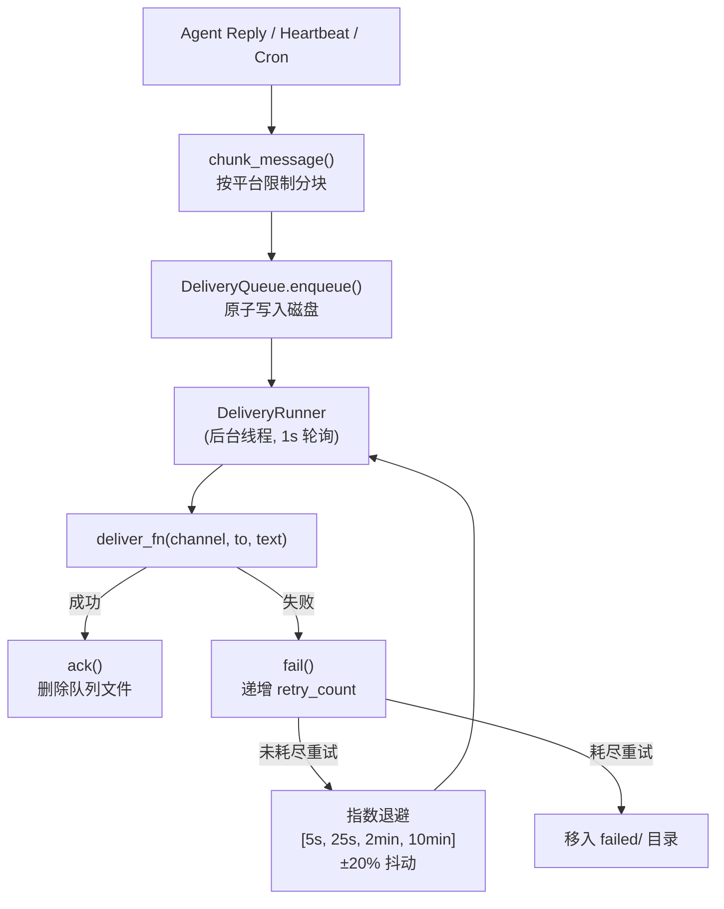
```mermaid
flowchart TB
    SRC["Agent Reply / Heartbeat / Cron"] --> CK["chunk_message()<br/>按平台限制分块"]
    CK --> ENQ["DeliveryQueue.enqueue()<br/>原子写入磁盘"]
    ENQ --> DR["DeliveryRunner<br/>(后台线程, 1s 轮询)"]
    DR --> DEL["deliver_fn(channel, to, text)"]

    DEL -->|成功| ACK["ack()<br/>删除队列文件"]
    DEL -->|失败| FAIL["fail()<br/>递增 retry_count"]
    FAIL -->|未耗尽重试| BACK["指数退避<br/>[5s, 25s, 2min, 10min]<br/>±20% 抖动"]
    FAIL -->|耗尽重试| DEAD["移入 failed/ 目录"]
    BACK --> DR
```

#### 原子写入

```
临时文件 → os.fsync() → os.replace() → 完成
```

崩溃安全：`os.replace()` 是原子操作，写入过程中崩溃不会产生损坏的队列文件。

#### 平台分块限制

| 平台 | 字符限制 |
|------|---------|
| Telegram 消息 | 4,096 |
| Telegram 图片说明 | 1,024 |
| Discord | 2,000 |
| WhatsApp | 4,096 |

分块策略: 先按段落(`\n\n`)切分，再硬切。

#### 退避时间表

| 重试次数 | 基础延迟 |
|---------|---------|
| 1 | 5 秒 |
| 2 | 25 秒 |
| 3 | 2 分钟 |
| 4 | 10 分钟 |

每次延迟加入 ±20% 随机抖动，防止惊群效应。

---

### S09: Resilience

> **核心命题**: 三层重试洋葱 + Auth Profile 轮转 + 降级模型

#### 三层重试洋葱

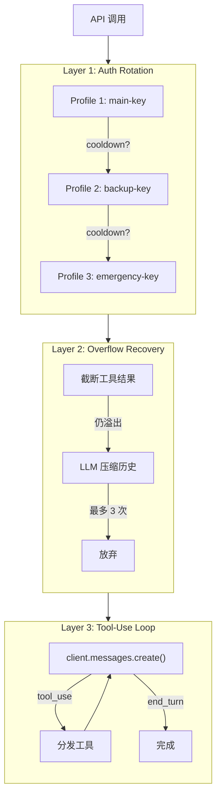
```mermaid
flowchart TB
    START[API 调用] --> L1

    subgraph L1["Layer 1: Auth Rotation"]
        direction TB
        P1[Profile 1: main-key] -->|cooldown?| P2[Profile 2: backup-key]
        P2 -->|cooldown?| P3[Profile 3: emergency-key]
    end

    L1 --> L2

    subgraph L2["Layer 2: Overflow Recovery"]
        direction TB
        TR["截断工具结果"] -->|仍溢出| CP["LLM 压缩历史"]
        CP -->|最多 3 次| FAIL2[放弃]
    end

    L2 --> L3

    subgraph L3["Layer 3: Tool-Use Loop"]
        direction TB
        CALL["client.messages.create()"] -->|tool_use| DISP["分发工具"]
        DISP --> CALL
        CALL -->|end_turn| DONE[完成]
    end
```

#### 失败分类

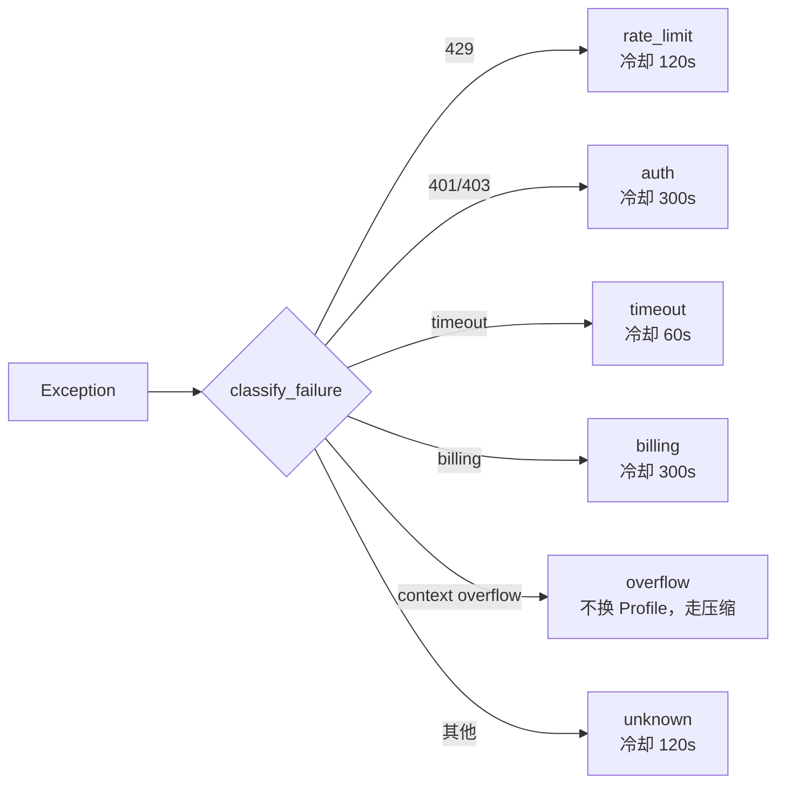
```mermaid
flowchart LR
    EXC[Exception] --> CLS{classify_failure}
    CLS -->|"429"| RL["rate_limit<br/>冷却 120s"]
    CLS -->|"401/403"| AU["auth<br/>冷却 300s"]
    CLS -->|"timeout"| TO["timeout<br/>冷却 60s"]
    CLS -->|"billing"| BL["billing<br/>冷却 300s"]
    CLS -->|"context overflow"| OV["overflow<br/>不换 Profile，走压缩"]
    CLS -->|"其他"| UK["unknown<br/>冷却 120s"]
```

#### ProfileManager

```python
@dataclass
class AuthProfile:
    name: str
    provider: str
    api_key: str
    cooldown_until: float     # time.time() 格式
    failure_reason: str | None
    last_good_at: float | None

class ProfileManager:
    def select_profile(self) -> AuthProfile | None:
        """返回第一个未在冷却中的 Profile"""
    def mark_failure(self, profile, reason, cooldown_seconds): ...
    def mark_success(self, profile): ...
```

#### 降级链

如果所有 Profile 都耗尽，尝试降级模型链（如 `claude-haiku-4-20250514`）。

#### 迭代上限

```python
max_iterations = min(max(BASE_RETRY + PER_PROFILE * n, 32), 160)
```

---

### S10: Concurrency

> **核心命题**: 命名 Lane + FIFO 队列 + Generation 追踪 + Future 结果

#### 命名 Lane 架构

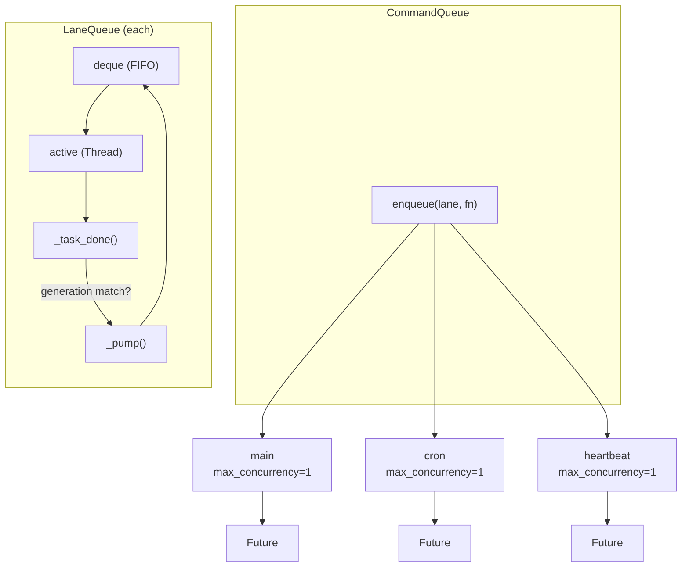
```mermaid
flowchart TB
    subgraph CommandQueue
        direction TB
        ENQ["enqueue(lane, fn)"]
    end

    ENQ --> ML["main<br/>max_concurrency=1"]
    ENQ --> CL["cron<br/>max_concurrency=1"]
    ENQ --> HL["heartbeat<br/>max_concurrency=1"]

    subgraph "LaneQueue (each)"
        direction TB
        DEQUE["deque (FIFO)"] --> ACTIVE["active (Thread)"]
        ACTIVE --> TD["_task_done()"]
        TD -->|"generation match?"| PUMP["_pump()"]
        PUMP --> DEQUE
    end

    ML --> FU1["Future"]
    CL --> FU2["Future"]
    HL --> FU3["Future"]
```

#### LaneQueue 详解

```python
class LaneQueue:
    name: str
    max_concurrency: int          # 默认 1 = 串行化
    _generation: int              # 重启恢复用
    _deque: deque[QueuedItem]     # FIFO 等待队列
    _active_count: int
    _condition: threading.Condition
```

- 每个入队的 callable 在自己的守护线程中运行
- 结果通过 `concurrent.futures.Future` 传递
- **Generation 追踪**: `_task_done()` 只在 generation 匹配时才 pump 下一个任务——陈旧任务被安全忽略

#### 用户对话流程

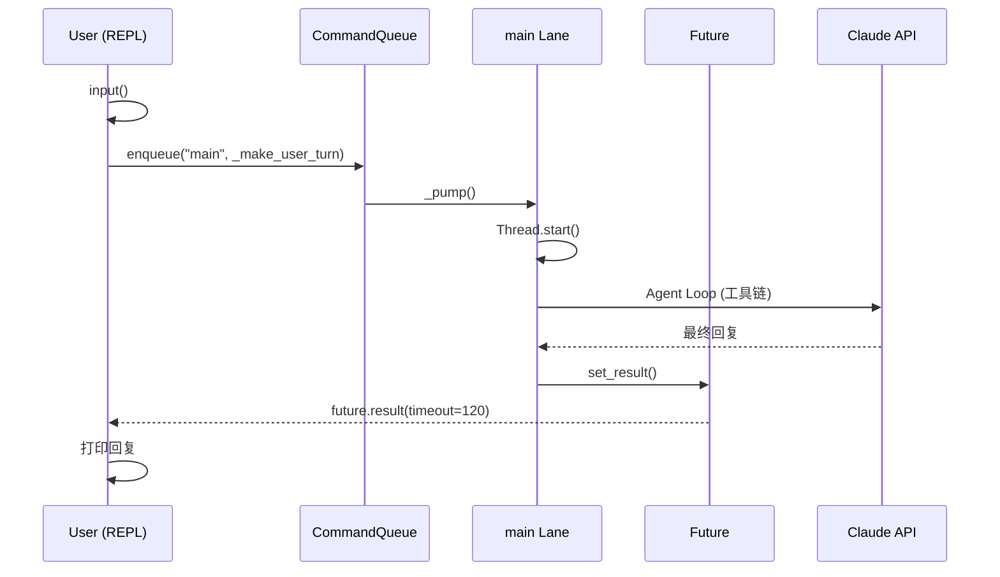
```mermaid
sequenceDiagram
    participant U as User (REPL)
    participant CQ as CommandQueue
    participant ML as main Lane
    participant F as Future
    participant LLM as Claude API

    U->>U: input()
    U->>CQ: enqueue("main", _make_user_turn)
    CQ->>ML: _pump()
    ML->>ML: Thread.start()
    ML->>LLM: Agent Loop (工具链)
    LLM-->>ML: 最终回复
    ML->>F: set_result()
    F-->>U: future.result(timeout=120)
    U->>U: 打印回复
```

---

## 7. 端到端数据流

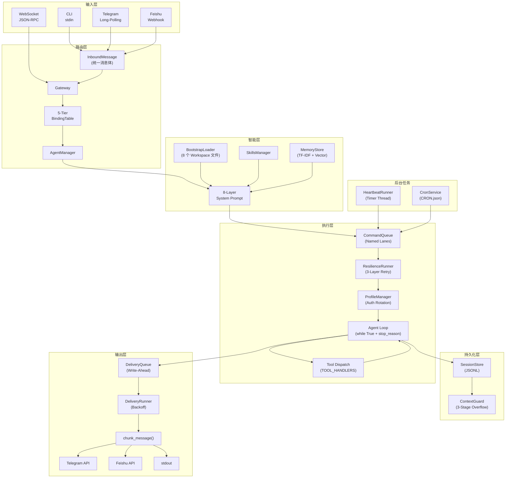
```mermaid
flowchart TB
    subgraph Input["输入层"]
        CLI["CLI<br/>stdin"]
        TG["Telegram<br/>Long-Polling"]
        FS["Feishu<br/>Webhook"]
        WS["WebSocket<br/>JSON-RPC"]
    end

    subgraph Routing["路由层"]
        IM["InboundMessage<br/>(统一消息体)"]
        GW["Gateway"]
        BT["5-Tier<br/>BindingTable"]
        AM["AgentManager"]
    end

    subgraph Brain["智能层"]
        BL["BootstrapLoader<br/>(8 个 Workspace 文件)"]
        SK["SkillsManager"]
        MS["MemoryStore<br/>(TF-IDF + Vector)"]
        SP["8-Layer<br/>System Prompt"]
    end

    subgraph Execution["执行层"]
        CQ["CommandQueue<br/>(Named Lanes)"]
        RR["ResilienceRunner<br/>(3-Layer Retry)"]
        PM["ProfileManager<br/>(Auth Rotation)"]
        AL["Agent Loop<br/>(while True + stop_reason)"]
        TD["Tool Dispatch<br/>(TOOL_HANDLERS)"]
    end

    subgraph Persistence["持久化层"]
        SS["SessionStore<br/>(JSONL)"]
        CG["ContextGuard<br/>(3-Stage Overflow)"]
    end

    subgraph Output["输出层"]
        DQ["DeliveryQueue<br/>(Write-Ahead)"]
        DR["DeliveryRunner<br/>(Backoff)"]
        CK["chunk_message()"]
        TGO["Telegram API"]
        FSO["Feishu API"]
        CLO["stdout"]
    end

    subgraph Background["后台任务"]
        HB["HeartbeatRunner<br/>(Timer Thread)"]
        CS["CronService<br/>(CRON.json)"]
    end

    CLI --> IM
    TG --> IM
    FS --> IM
    WS --> GW

    IM --> GW
    GW --> BT
    BT --> AM

    AM --> SP
    BL --> SP
    SK --> SP
    MS --> SP

    SP --> CQ
    CQ --> RR
    RR --> PM
    PM --> AL
    AL --> TD
    TD --> AL

    AL --> SS
    SS --> CG

    AL --> DQ
    DQ --> DR
    DR --> CK
    CK --> TGO
    CK --> FSO
    CK --> CLO

    HB --> CQ
    CS --> CQ
```

---

## 8. Workspace 配置体系

Workspace 是 claw0 的 **"文件即配置"** 核心。换文件就换行为，无需改代码。

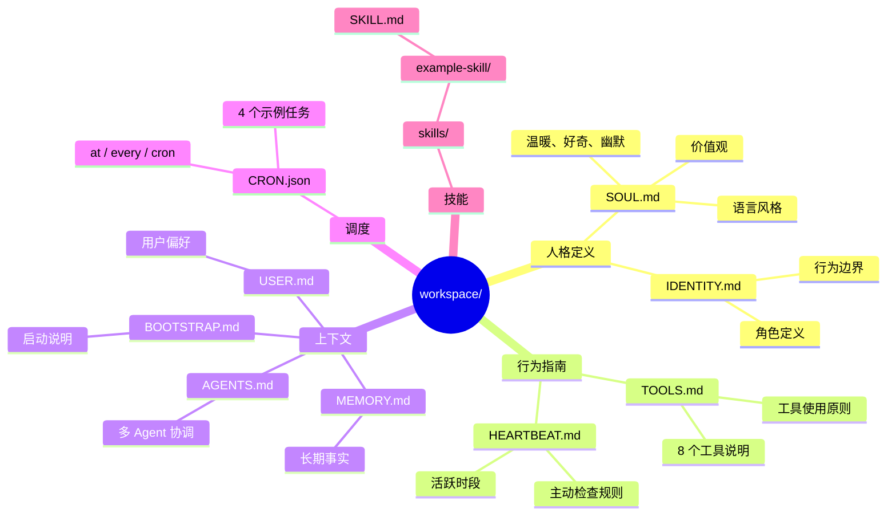
```mermaid
mindmap
    root((workspace/))
        人格定义
            SOUL.md
                温暖、好奇、幽默
                语言风格
                价值观
            IDENTITY.md
                角色定义
                行为边界
        行为指南
            TOOLS.md
                工具使用原则
                8 个工具说明
            HEARTBEAT.md
                主动检查规则
                活跃时段
        上下文
            USER.md
                用户偏好
            MEMORY.md
                长期事实
            BOOTSTRAP.md
                启动说明
            AGENTS.md
                多 Agent 协调
        调度
            CRON.json
                4 个示例任务
                at / every / cron
        技能
            skills/
                example-skill/
                    SKILL.md
```

| 文件 | 角色 | 加载到的层级 |
|------|------|------------|
| `SOUL.md` | 人格特质（Luna: 温暖、好奇、轻幽默） | Layer 2 |
| `IDENTITY.md` | 角色定义与边界 | Layer 1 |
| `TOOLS.md` | 工具使用指导（列出 8 个工具） | Layer 3 |
| `USER.md` | 用户级上下文 | Layer 6 |
| `MEMORY.md` | 长期事实（时区、语言、偏好） | Layer 5 |
| `HEARTBEAT.md` | 后台检查指令（提醒、摘要、跟进） | Heartbeat Prompt |
| `BOOTSTRAP.md` | 启动上下文、工作区布局说明 | Layer 6 |
| `AGENTS.md` | 多 Agent 协调说明 | Layer 6 |
| `CRON.json` | 4 个演示任务（晨报、安全扫描、会议提醒、健康检查） | CronService |
| `skills/*/SKILL.md` | 技能定义（YAML frontmatter + body） | Layer 4 |

---

## 9. 贯穿全局的设计模式

### 9.1 Agent Loop 模式

所有 Session 都保持同一个核心模式：

```python
while True:
    response = client.messages.create(...)
    if response.stop_reason == "end_turn":
        break
    elif response.stop_reason == "tool_use":
        # 分发工具，将结果反馈
        continue
```

### 9.2 工具分发模式

```python
TOOLS = [{"name": "...", "description": "...", "input_schema": {...}}]    # 给模型
TOOL_HANDLERS = {"tool_name": handler_function}                           # 给代码

def process_tool_call(name, input):
    handler = TOOL_HANDLERS.get(name)
    return handler(**input)
```

### 9.3 错误回滚模式

API 调用失败时，始终回滚消息列表：

```python
while messages and messages[-1]["role"] != "user":
    messages.pop()
if messages:
    messages.pop()     # 弹出触发错误的 user 消息
```

### 9.4 REPL 命令模式

每个 Session 都支持 `/` 前缀的命令：

```python
if user_input.startswith("/"):
    if handle_repl_command(...):
        continue
```

### 9.5 后台守护线程模式

```python
stop_event = threading.Event()
thread = threading.Thread(target=loop, daemon=True)
thread.start()

# 在 loop 内部：
stop_event.wait(timeout=1.0)    # 代替 time.sleep()
```

### 9.6 配置加载模式

所有 Session 都使用相同的 `.env` 加载方式：

```python
load_dotenv(Path(__file__).resolve().parent.parent.parent / ".env", override=True)
```

---

## 10. 关键设计决策

| 决策 | 理由 |
|------|------|
| **每个 Session 独立成一个文件** | 无跨文件 import，每个 `.py` 都可独立运行，降低学习门槛 |
| **渐进增强** | 每节只加一个概念，先前代码原封不动，学生可对比 diff |
| **文件即配置** | 人格、记忆、技能、定时任务全部是 Markdown/JSON 文件，换文件 = 换行为 |
| **纯 Python 混合检索** | 不依赖外部向量数据库，用 TF-IDF + Hash 投影教会概念 |
| **崩溃安全持久化** | 会话用 JSONL 追加，投递队列用 `tmp + fsync + os.replace()` 原子写入 |
| **平台抽象层** | `Channel` ABC 让 Agent Loop 不感知平台细节，新增平台只需实现 `receive()` + `send()` |
| **串行化并发** | 命名 Lane 的 `max_concurrency=1` 提供 FIFO 有序保证，同时允许独立工作流 |
| **Generation 追踪** | 防止重启后陈旧任务触发后续调度，实现安全的生命周期管理 |
| **三语并行** | 代码逻辑完全一致，仅注释和文档差异，覆盖英/中/日开发者 |

---

## 11. 学习路径建议

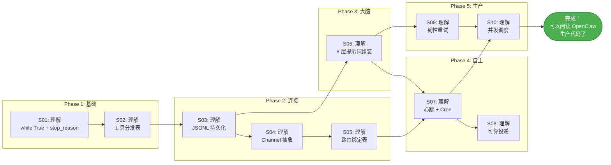
```mermaid
flowchart LR
    subgraph "Phase 1: 基础"
        P1A["S01: 理解<br/>while True + stop_reason"]
        P1B["S02: 理解<br/>工具分发表"]
    end

    subgraph "Phase 2: 连接"
        P2A["S03: 理解<br/>JSONL 持久化"]
        P2B["S04: 理解<br/>Channel 抽象"]
        P2C["S05: 理解<br/>路由绑定表"]
    end

    subgraph "Phase 3: 大脑"
        P3["S06: 理解<br/>8 层提示词组装"]
    end

    subgraph "Phase 4: 自主"
        P4A["S07: 理解<br/>心跳 + Cron"]
        P4B["S08: 理解<br/>可靠投递"]
    end

    subgraph "Phase 5: 生产"
        P5A["S09: 理解<br/>韧性重试"]
        P5B["S10: 理解<br/>并发调度"]
    end

    P1A --> P1B --> P2A --> P2B --> P2C
    P2A --> P3
    P2C --> P4A
    P3 --> P4A --> P4B
    P3 --> P5A
    P4A --> P5B
    P5A --> P5B

    FIN(["完成！<br/>可以阅读 OpenClaw<br/>生产代码了"])
    P5B --> FIN

    style FIN fill:#4caf50,color:#fff,stroke:#2e7d32
```

**建议顺序**: S01 → S02 → S03 → S04 → S05 → S06 → S07 → S08 → S09 → S10

每个 Session 都有配套的 `.md` 文档，建议先读文档理解概念，再读代码理解实现，最后运行代码亲身体验。
