# claw0 Java 轻量级重写实施计划

> **选定方案**: 方案一 — 轻量级重写
> **核心原则**: 保持 claw0 原有的 **教学渐进性** 和 **单文件独立运行（自包含）** 特性
> **目标语言**: Java 21 (LTS)
> **预计工期**: 50 人天（约 10 周，1 人全职）
> **预计代码**: \~11,000 行 Java
> **Anthropic SDK**: anthropic-java 2.20.0 (2026-04-01 发布)

***

## 目录

1. [实施总览](#1-实施总览)
2. [项目初始化](#2-项目初始化)
3. [Phase 1: 基础层 (Week 1)](#3-phase-1-基础层-week-1)
4. [Phase 2: 连接层 (Week 2-3)](#4-phase-2-连接层-week-2-3)
5. [Phase 3: 智能层 (Week 4-5)](#5-phase-3-智能层-week-4-5)
6. [Phase 4: 自主层 (Week 6-7 前半)](#6-phase-4-自主层-week-6-7-前半)
7. [Phase 5: 生产层 (Week 7 后半-Week 9)](#7-phase-5-生产层-week-7-后半-week-9)
8. [Phase 6: 收尾 (Week 10)](#8-phase-6-收尾-week-10)
9. [每个 Session 的详细实施规格](#9-每个-session-的详细实施规格)
10. [共享基础设施](#10-共享基础设施)
11. [自包含模式下的代码组织策略](#11-自包含模式下的代码组织策略)
12. [测试策略](#12-测试策略)
13. [验收标准](#13-验收标准)
14. [编码规范](#14-编码规范)
15. [风险应对预案](#15-风险应对预案)

***

## 1. 实施总览

### 1.1 总体时间线

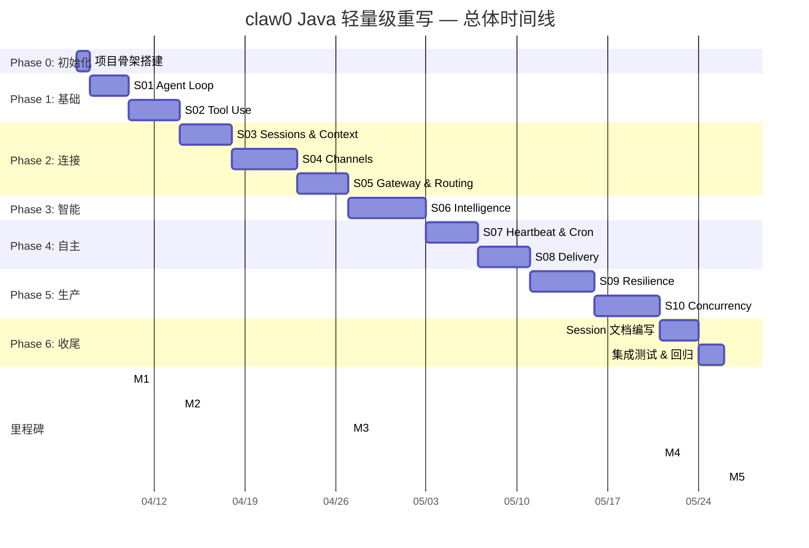

### 1.2 里程碑定义

| 里程碑              | 时间点          | 验收条件                                                                      |
| ---------------- | ------------ | ------------------------------------------------------------------------- |
| **M1: SDK 验证通过** | Week 1 Day 3 | `S01AgentLoop.main()` 能与 Claude API 完成一轮对话（使用 SDK v2.20.0）               |
| **M2: 基础层完成**    | Week 1 Day 7 | `S02ToolUse.main()` 能执行 bash / read\_file / write\_file / edit\_file 四个工具 |
| **M3: 端到端可运行**   | Week 4 末     | S01-S05 全部通过手工测试，CLI 渠道可正常对话                                              |
| **M4: 全功能完成**    | Week 9 末     | S01-S10 全部通过手工测试 + 单元测试                                                   |
| **M5: 交付**       | Week 10 末    | 10 个 Session 文档完成，README 完成，代码可正常构建运行                                     |

### 1.3 交付物清单

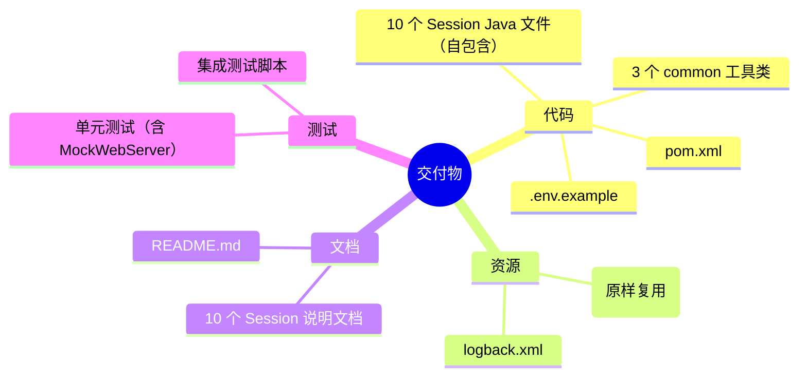

***

## 2. 项目初始化

### 2.1 目标项目结构

```
claw0-java/
├── pom.xml                              # Maven 构建配置
├── .env.example                         # 环境变量模板（从原项目复制）
├── .gitignore
├── README.md
├── src/
│   ├── main/
│   │   ├── java/
│   │   │   └── com/
│   │   │       └── claw0/
│   │   │           ├── common/          # 共享工具类（3 个文件）
│   │   │           │   ├── Config.java
│   │   │           │   ├── AnsiColors.java
│   │   │           │   └── JsonUtils.java
│   │   │           └── sessions/        # 10 个独立 Session（自包含）
│   │   │               ├── S01AgentLoop.java
│   │   │               ├── S02ToolUse.java
│   │   │               ├── S03Sessions.java
│   │   │               ├── S04Channels.java
│   │   │               ├── S05GatewayRouting.java
│   │   │               ├── S06Intelligence.java
│   │   │               ├── S07HeartbeatCron.java
│   │   │               ├── S08Delivery.java
│   │   │               ├── S09Resilience.java
│   │   │               └── S10Concurrency.java
│   │   └── resources/
│   │       └── logback.xml              # 日志配置
│   └── test/
│       └── java/
│           └── com/
│               └── claw0/
│                   └── sessions/
│                       ├── S01AgentLoopTest.java
│                       ├── S02ToolUseTest.java
│                       └── ...
├── workspace/                           # 原样复制自 claw0
│   ├── SOUL.md
│   ├── IDENTITY.md
│   ├── TOOLS.md
│   ├── USER.md
│   ├── MEMORY.md
│   ├── HEARTBEAT.md
│   ├── BOOTSTRAP.md
│   ├── AGENTS.md
│   ├── CRON.json
│   └── skills/
│       └── example-skill/
│           └── SKILL.md
└── docs/                                # Session 说明文档
    ├── s01_agent_loop.md
    ├── s02_tool_use.md
    └── ...
```

### 2.2 pom.xml 完整配置

```xml
<?xml version="1.0" encoding="UTF-8"?>
<project xmlns="http://maven.apache.org/POM/4.0.0"
         xmlns:xsi="http://www.w3.org/2001/XMLSchema-instance"
         xsi:schemaLocation="http://maven.apache.org/POM/4.0.0
                             http://maven.apache.org/xsd/maven-4.0.0.xsd">
    <modelVersion>4.0.0</modelVersion>

    <groupId>com.claw0</groupId>
    <artifactId>claw0-java</artifactId>
    <version>1.0.0</version>
    <packaging>jar</packaging>

    <name>claw0-java</name>
    <description>From Zero to One: Build an AI Agent Gateway (Java Edition)</description>

    <properties>
        <java.version>21</java.version>
        <maven.compiler.source>${java.version}</maven.compiler.source>
        <maven.compiler.target>${java.version}</maven.compiler.target>
        <project.build.sourceEncoding>UTF-8</project.build.sourceEncoding>

        <!-- 依赖版本（2026-04 最新） -->
        <anthropic.version>2.20.0</anthropic.version>
        <jackson.version>2.19.0</jackson.version>
        <dotenv.version>3.0.0</dotenv.version>
        <java-websocket.version>1.5.7</java-websocket.version>
        <cron-utils.version>9.2.1</cron-utils.version>
        <logback.version>1.5.18</logback.version>
        <junit.version>5.12.2</junit.version>
    </properties>

    <dependencyManagement>
        <dependencies>
            <!-- Jackson BOM: 统一管理所有 Jackson 模块版本 -->
            <dependency>
                <groupId>com.fasterxml.jackson</groupId>
                <artifactId>jackson-bom</artifactId>
                <version>${jackson.version}</version>
                <type>pom</type>
                <scope>import</scope>
            </dependency>
        </dependencies>
    </dependencyManagement>

    <dependencies>
        <!-- Anthropic Claude SDK v2 (内含 OkHttp 传输层) -->
        <dependency>
            <groupId>com.anthropic</groupId>
            <artifactId>anthropic-java</artifactId>
            <version>${anthropic.version}</version>
        </dependency>

        <!-- JSON 序列化 (版本由 Jackson BOM 统一管理) -->
        <dependency>
            <groupId>com.fasterxml.jackson.core</groupId>
            <artifactId>jackson-databind</artifactId>
        </dependency>
        <dependency>
            <groupId>com.fasterxml.jackson.datatype</groupId>
            <artifactId>jackson-datatype-jsr310</artifactId>
        </dependency>
        <!-- 支持 Java record 零注解反序列化 -->
        <dependency>
            <groupId>com.fasterxml.jackson.module</groupId>
            <artifactId>jackson-module-parameter-names</artifactId>
        </dependency>

        <!-- .env 配置加载 -->
        <dependency>
            <groupId>io.github.cdimascio</groupId>
            <artifactId>dotenv-java</artifactId>
            <version>${dotenv.version}</version>
        </dependency>

        <!-- WebSocket 服务端 (S05) -->
        <dependency>
            <groupId>org.java-websocket</groupId>
            <artifactId>Java-WebSocket</artifactId>
            <version>${java-websocket.version}</version>
        </dependency>

        <!-- Cron 表达式解析 (S07) -->
        <dependency>
            <groupId>com.cronutils</groupId>
            <artifactId>cron-utils</artifactId>
            <version>${cron-utils.version}</version>
        </dependency>

        <!-- 日志 -->
        <dependency>
            <groupId>ch.qos.logback</groupId>
            <artifactId>logback-classic</artifactId>
            <version>${logback.version}</version>
        </dependency>

        <!-- 测试 -->
        <dependency>
            <groupId>org.junit.jupiter</groupId>
            <artifactId>junit-jupiter</artifactId>
            <version>${junit.version}</version>
            <scope>test</scope>
        </dependency>
    </dependencies>

    <build>
        <plugins>
            <plugin>
                <groupId>org.apache.maven.plugins</groupId>
                <artifactId>maven-compiler-plugin</artifactId>
                <version>3.14.0</version>
                <configuration>
                    <source>${java.version}</source>
                    <target>${java.version}</target>
                    <!-- 启用 -parameters，配合 jackson-module-parameter-names -->
                    <parameters>true</parameters>
                </configuration>
            </plugin>
            <!-- 允许直接运行任意 Session -->
            <plugin>
                <groupId>org.codehaus.mojo</groupId>
                <artifactId>exec-maven-plugin</artifactId>
                <version>3.5.0</version>
            </plugin>
            <plugin>
                <groupId>org.apache.maven.plugins</groupId>
                <artifactId>maven-surefire-plugin</artifactId>
                <version>3.5.3</version>
            </plugin>
        </plugins>
    </build>
</project>
```

> **注意**: Anthropic Java SDK v2.20.0 内部依赖 OkHttp 作为 HTTP 传输层，
> 会通过 Maven 传递依赖自动引入。无需在 pom.xml 中显式声明 OkHttp。

**运行方式**:

```bash
# 运行任意 Session
mvn compile exec:java -Dexec.mainClass="com.claw0.sessions.S01AgentLoop"
mvn compile exec:java -Dexec.mainClass="com.claw0.sessions.S02ToolUse"
# ...
```

### 2.3 共享工具类（Phase 0 产出）

在所有 Session 开始前，先实现 3 个共享工具类：

| 文件                | 行数   | 职责                                                                                      |
| ----------------- | ---- | --------------------------------------------------------------------------------------- |
| `Config.java`     | \~40 | 加载 `.env`，提供 `get(key)` / `get(key, default)`。注: API Key 由 SDK `fromEnv()` 直接管理          |
| `AnsiColors.java` | \~30 | ANSI 终端颜色常量 + `coloredPrompt()` / `printAssistant()` / `printInfo()`                    |
| `JsonUtils.java`  | \~55 | Jackson `ObjectMapper` 单例（含 `ParameterNamesModule`） + `toJson()` / `fromJson()` / `readJsonl()` / `appendJsonl()` |

***

## 3. Phase 1: 基础层 (Week 1)

> **目标**: 验证 Anthropic Java SDK 可用性，搭建 Agent Loop + Tool Dispatch 核心骨架

### 3.1 S01: Agent Loop（Day 1-3，预计 \~200 行）

> **说明**: 增加 1 天用于 SDK v2.20.0 API 调研和验证

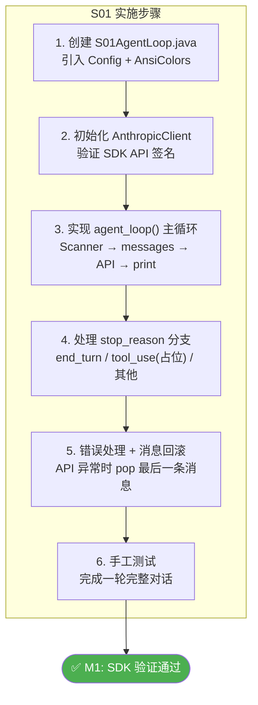

#### 核心实现要点

| Python 原代码                                                        | Java 实现 (SDK v2.20.0)                                                    |
| ----------------------------------------------------------------- | -------------------------------------------------------------------------- |
| `input(colored_prompt())`                                         | `Scanner(System.in).nextLine()`                                            |
| `client = Anthropic(api_key=...)`                                 | `AnthropicOkHttpClient.builder().apiKey(...).build()` 或 `AnthropicOkHttpClient.fromEnv()` |
| `client.messages.create(model=, max_tokens=, system=, messages=)` | `client.messages().create(MessageCreateParams.builder()....build())`        |
| `response.stop_reason == "end_turn"`                              | `response.stopReason() == StopReason.END_TURN`                             |
| `hasattr(block, "text")`                                          | `block.isText()` → `block.asText().text()`                                 |
| `messages.pop()`                                                  | `messages.remove(messages.size() - 1)`                                     |
| N/A                                                               | 多轮对话: `builder.addMessage(response)` 直接传入完整 Message 对象                  |

> **SDK v2.20.0 关键变化**:
> - 客户端类名: `AnthropicOkHttpClient`（非 `AnthropicClient.builder()`）
> - Content Block 使用联合类型: `block.isText()` / `block.isToolUse()` / `block.isThinking()`
> - StopReason 使用枚举: `StopReason.END_TURN` / `StopReason.TOOL_USE`
> - 支持 `fromEnv()` 直接从环境变量 `ANTHROPIC_API_KEY` 读取密钥

#### 验收条件

- [ ] 程序启动，打印 banner 信息
- [ ] 输入文本后收到 Claude 回复
- [ ] 多轮对话上下文连贯
- [ ] 输入 `quit` / `exit` 正常退出
- [ ] Ctrl+C 捕获正常退出
- [ ] API 错误不导致程序崩溃

### 3.2 S02: Tool Use（Day 4-7，预计 \~550 行）

> **策略**: S02 手写完整的 tool dispatch loop（教学价值最大化），S03+ 迁移到 SDK BetaToolRunner

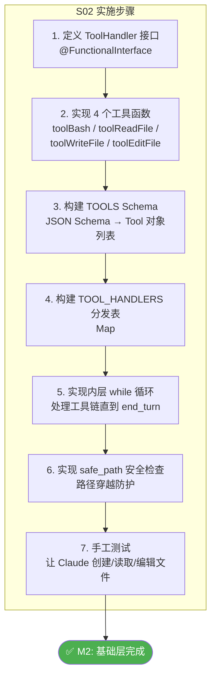

#### 核心实现要点

| Python 原代码                                 | Java 实现 (SDK v2.20.0)                                                    |
| ------------------------------------------ | -------------------------------------------------------------------------- |
| `TOOL_HANDLERS = {"bash": tool_bash, ...}` | `Map.of("bash", input -> toolBash(...), ...)`                              |
| `handler(**tool_input)`                    | `handler.execute(input)` — 从 Map 取值并手动类型转换                                 |
| `subprocess.run(cmd, shell=True, ...)`     | `new ProcessBuilder("sh", "-c", cmd).redirectErrorStream(true).start()`    |
| `Path.read_text(encoding="utf-8")`         | `Files.readString(path, UTF_8)`                                            |
| `content.count(old_string)`                | 手写计数或用 `Pattern`                                                          |
| `content.replace(old, new, 1)`             | `content.replaceFirst(Pattern.quote(old), Matcher.quoteReplacement(new))`  |
| `block.type == "tool_use"`                 | `block.isToolUse()` → `block.asToolUse().name()` / `.id()` / `.input(...)` |

#### bash 工具特殊处理

> **重要**: 必须使用 `redirectErrorStream(true)` 合并 stdout/stderr，
> 避免分开读取时因缓冲区满导致的**死锁**。

```java
private static String toolBash(Map<String, Object> input) {
    String command = (String) input.get("command");
    int timeout = ((Number) input.getOrDefault("timeout", 30)).intValue();

    // 危险命令黑名单
    List<String> dangerous = List.of("rm -rf /", "mkfs", "> /dev/sd", "dd if=");
    for (String pattern : dangerous) {
        if (command.contains(pattern))
            return "Error: Refused to run dangerous command containing '" + pattern + "'";
    }

    // 关键: redirectErrorStream(true) 合并 stderr 到 stdout，避免死锁
    ProcessBuilder pb = new ProcessBuilder("sh", "-c", command)
            .directory(WORKDIR.toFile())
            .redirectErrorStream(true);

    try {
        Process process = pb.start();

        // 必须在 waitFor 之前读取输出，避免缓冲区满阻塞子进程
        CompletableFuture<String> outputFuture = CompletableFuture.supplyAsync(() -> {
            try { return new String(process.getInputStream().readAllBytes(), UTF_8); }
            catch (IOException e) { return "Error reading output: " + e.getMessage(); }
        });

        boolean finished = process.waitFor(timeout, TimeUnit.SECONDS);
        if (!finished) {
            process.destroyForcibly();
            return "Error: Command timed out after " + timeout + "s";
        }

        String output = outputFuture.join();
        int exitCode = process.exitValue();
        return (exitCode == 0 ? "" : "Exit code: " + exitCode + "\n") + output;
    } catch (Exception e) {
        return "Error: " + e.getMessage();
    }
}
```

#### 验收条件

- [ ] Claude 能自主调用 bash 执行命令并返回结果
- [ ] Claude 能读取、创建、编辑文件
- [ ] 工具链调用（多步工具调用后回到 end\_turn）正常
- [ ] 路径穿越被阻止
- [ ] 危险命令被拒绝
- [ ] 工具输出超过 50,000 字符自动截断

***

## 4. Phase 2: 连接层 (Week 2-3)

### 4.1 S03: Sessions & Context Guard（Day 8-11，预计 \~1,100 行）

> **Tool Loop 切换点**: 本 Session 起使用 SDK 的 `BetaToolRunner` 替代手写 tool dispatch loop。
> 教学文档中应解释"为什么"：S02 中我们手写了完整的 tool loop 以理解底层机制，
> 从 S03 起使用 SDK helper 来减少样板代码，聚焦于 Session 管理的核心概念。

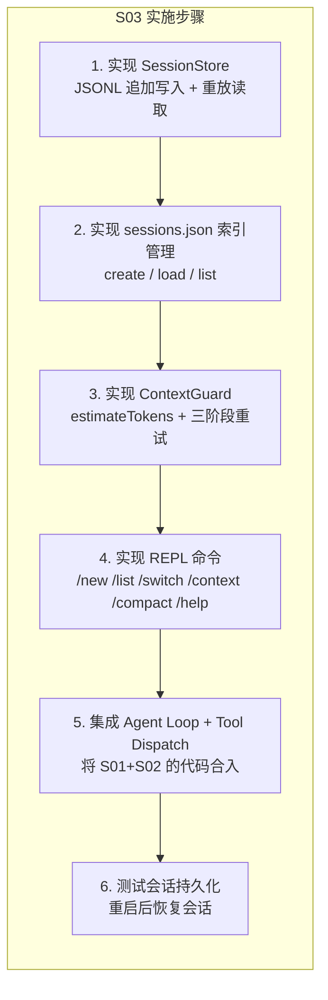

#### 核心数据结构

```java
// 会话事件（JSONL 每一行）
record TranscriptEvent(
    String type,          // "user" | "assistant" | "tool_use" | "tool_result"
    long timestamp,
    Map<String, Object> data
) {}

// 会话元数据（sessions.json 中的一条）
record SessionMeta(
    String id,
    String label,
    Instant createdAt,
    Instant lastActive,
    int messageCount
) {}
```

#### ContextGuard 三阶段实现

> **注意**: `guardApiCall` 使用 SDK v2.20.0 的 `MessageCreateParams`，
> 而非手动构建 JSON。`isOverflowError` 可利用 SDK 异常类 `AnthropicException` 的 `errorType()` 方法。

```java
public class ContextGuard {
    private static final int CONTEXT_BUDGET = 180_000;

    public Message guardApiCall(AnthropicClient client, MessageCreateParams.Builder builder,
                                List<Map<String, Object>> messages) {
        // 阶段 1: 正常调用
        try {
            return client.messages().create(builder.build());
        } catch (Exception e) {
            if (!isOverflowError(e)) throw e;
        }

        // 阶段 2: 截断工具结果
        truncateToolResults(messages, (int)(CONTEXT_BUDGET * 0.3));
        try {
            return client.messages().create(builder.messages(messages).build());
        } catch (Exception e) {
            if (!isOverflowError(e)) throw e;
        }

        // 阶段 3: LLM 压缩历史
        compactHistory(client, messages);
        return client.messages().create(builder.messages(messages).build());
    }
}
```

#### JSONL 读写实现

```java
// 追加写入
public void appendTranscript(String sessionId, TranscriptEvent event) {
    Path file = sessionDir.resolve(sessionId + ".jsonl");
    try (var writer = Files.newBufferedWriter(file, UTF_8,
            StandardOpenOption.CREATE, StandardOpenOption.APPEND)) {
        writer.write(JsonUtils.toJson(event));
        writer.newLine();
    }
}

// 重放读取
public List<MessageParam> rebuildHistory(String sessionId) {
    Path file = sessionDir.resolve(sessionId + ".jsonl");
    List<MessageParam> messages = new ArrayList<>();
    try (var reader = Files.newBufferedReader(file, UTF_8)) {
        String line;
        while ((line = reader.readLine()) != null) {
            TranscriptEvent event = JsonUtils.fromJson(line, TranscriptEvent.class);
            // 按 type 重建 MessageParam...
        }
    }
    return messages;
}
```

#### 验收条件

- [ ] 会话创建后，JSONL 文件被正确写入
- [ ] 重启程序后，`/list` 能看到历史会话
- [ ] `/switch` 能切换到历史会话并恢复上下文
- [ ] `/context` 显示当前 token 使用量
- [ ] `/compact` 触发历史压缩
- [ ] 长对话（超过 context budget）触发自动三阶段恢复

***

### 4.2 S04: Channels（Day 12-16，预计 \~1,200 行）

> **Telegram 策略**: 使用 `java.net.http.HttpClient` 手写长轮询（保持轻量，不引入 Telegram Bot 库）。
> 需注意: 长轮询断线重连、网络超时、409 Conflict（多实例竞争）等边界场景。

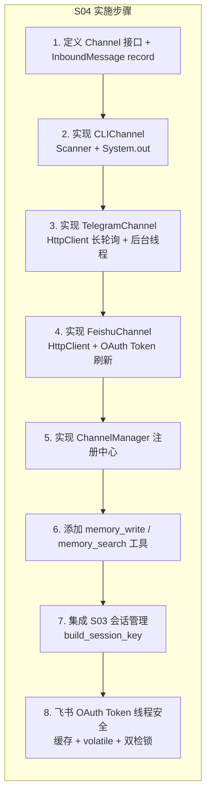

#### Channel 接口设计

```java
public interface Channel {
    Optional<InboundMessage> receive();
    boolean send(String to, String text);
    void close();
}

public record InboundMessage(
    String text,
    String senderId,
    String channel,
    String accountId,
    String peerId,
    boolean isGroup,
    List<Map<String, Object>> media,
    Map<String, Object> raw
) {
    // Builder 模式 或 compact constructor
}
```

#### TelegramChannel 核心逻辑

```java
public class TelegramChannel implements Channel {
    private final HttpClient http = HttpClient.newBuilder().connectTimeout(Duration.ofSeconds(35)).build();
    private final String token;
    private final BlockingQueue<InboundMessage> queue = new LinkedBlockingQueue<>();
    private final Set<Long> seen = ConcurrentHashMap.newKeySet(); // 去重
    private volatile long offset = 0;
    private final Thread pollThread;

    public TelegramChannel(String token) {
        this.token = token;
        this.pollThread = Thread.ofVirtual().name("tg-poll").start(this::pollLoop);
    }

    private void pollLoop() {
        while (!Thread.currentThread().isInterrupted()) {
            // HttpClient GET /getUpdates?offset=...&timeout=30
            // 解析 JSON, 构建 InboundMessage, 入队
            // 更新 offset, 去重 (seen.size() > 5000 时清空)
            // 注意: 网络异常时需指数退避重连，避免紧密循环
            // 注意: 409 Conflict 表示有另一个实例在轮询，应日志警告并退出
        }
    }

    @Override
    public Optional<InboundMessage> receive() {
        return Optional.ofNullable(queue.poll());
    }

    @Override
    public boolean send(String to, String text) {
        // 消息分块 (4096 限制), POST /sendMessage
        return true;
    }
}
```

#### 验收条件

- [ ] CLIChannel 正常工作（与 S01 行为一致）
- [ ] TelegramChannel 能接收和发送消息（需配置 BOT\_TOKEN）
- [ ] FeishuChannel 能接收和发送消息（需配置 APP\_ID/SECRET）
- [ ] ChannelManager 正确注册和查询渠道
- [ ] `memory_write` / `memory_search` 工具正常工作
- [ ] 会话键正确构建：`agent:main:direct:{channel}:{peer_id}`

***

### 4.3 S05: Gateway & Routing（Day 17-20，预计 \~900 行）

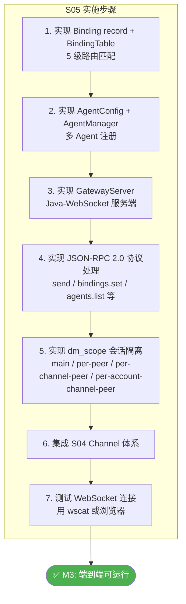

#### 5 级绑定表

```java
public record Binding(
    int tier,          // 1-5
    String matchKey,   // "peer_id" / "guild_id" / "account_id" / "channel" / "default"
    String matchValue, // 具体值
    String agentId,    // 路由到的 Agent
    int priority       // 同 tier 内优先级
) implements Comparable<Binding> {

    @Override
    public int compareTo(Binding other) {
        int cmp = Integer.compare(this.tier, other.tier);
        return cmp != 0 ? cmp : Integer.compare(other.priority, this.priority);
    }
}

public class BindingTable {
    private final List<Binding> bindings = new CopyOnWriteArrayList<>();

    public String resolve(InboundMessage msg) {
        return bindings.stream()
                .sorted()
                .filter(b -> matches(b, msg))
                .map(Binding::agentId)
                .findFirst()
                .orElse("main");
    }
}
```

#### WebSocket Gateway

```java
public class GatewayServer extends WebSocketServer {
    private final Map<String, BiFunction<Map<String, Object>, WebSocket, Object>> methods;
    private final Semaphore agentSemaphore = new Semaphore(4);

    public GatewayServer(int port, BindingTable bindings, AgentManager agents) {
        super(new InetSocketAddress(port));
        this.methods = Map.of(
            "send",           (params, ws) -> handleSend(params),
            "bindings.set",   (params, ws) -> handleBindingsSet(params),
            "bindings.list",  (params, ws) -> handleBindingsList(params),
            "sessions.list",  (params, ws) -> handleSessionsList(params),
            "agents.list",    (params, ws) -> handleAgentsList(params),
            "status",         (params, ws) -> handleStatus(params)
        );
    }

    @Override
    public void onMessage(WebSocket conn, String message) {
        // 解析 JSON-RPC 2.0, 分发到 methods
    }
}
```

#### 验收条件

- [ ] 5 级绑定表按 tier + priority 正确路由
- [ ] WebSocket 服务端正常启动和接受连接
- [ ] JSON-RPC 2.0 协议正确处理请求/响应
- [ ] 多 Agent 注册和查询正常
- [ ] dm\_scope 会话隔离正常工作
- [ ] 并发控制 Semaphore(4) 限制同时运行的 Agent 数

***

## 5. Phase 3: 智能层 (Week 4-5)

### 5.1 S06: Intelligence（Day 21-26，预计 \~1,500 行）

> **本 Session 是全项目最复杂的单文件**。Java 中实现 TF-IDF + 向量检索比 Python 更啰嗦，
> 需要额外 1 天用于调试混合检索管线。

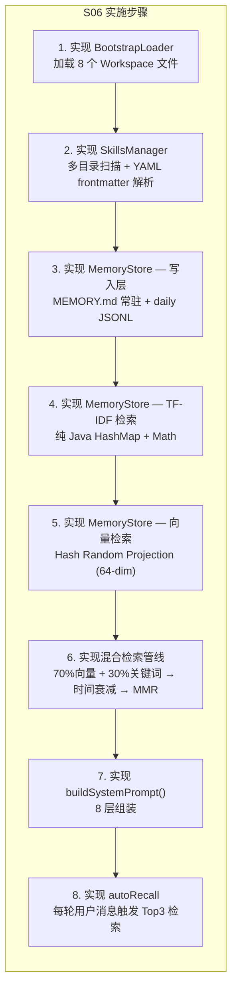

#### 8 层系统提示词组装

```java
public String buildSystemPrompt(String agentId, String channel, String promptMode) {
    StringBuilder sb = new StringBuilder();

    // Layer 1: Identity
    appendIfPresent(sb, "# Identity\n", bootstrap.get("IDENTITY"));

    // Layer 2: Soul / Personality (full mode only)
    if ("full".equals(promptMode))
        appendIfPresent(sb, "# Personality\n", bootstrap.get("SOUL"));

    // Layer 3: Tools Guidance
    appendIfPresent(sb, "# Tools\n", bootstrap.get("TOOLS"));

    // Layer 4: Skills (full mode only)
    if ("full".equals(promptMode))
        sb.append(skillsManager.renderPromptBlock());

    // Layer 5: Memory (full mode only)
    if ("full".equals(promptMode)) {
        appendIfPresent(sb, "# Memory\n", bootstrap.get("MEMORY"));
        String recalled = autoRecall(lastUserMessage);
        if (!recalled.isEmpty()) sb.append("\n## Recalled\n").append(recalled);
    }

    // Layer 6: Bootstrap Context
    for (String key : List.of("HEARTBEAT", "BOOTSTRAP", "AGENTS", "USER"))
        appendIfPresent(sb, "# " + key + "\n", bootstrap.get(key));

    // Layer 7: Runtime Context
    sb.append(String.format("\n# Runtime\nagent_id: %s\nmodel: %s\nchannel: %s\ntime: %s\n",
            agentId, modelId, channel, Instant.now()));

    // Layer 8: Channel Hints
    sb.append(getChannelHints(channel));

    return sb.toString();
}
```

#### TF-IDF 纯 Java 实现关键代码

```java
public class MemoryStore {

    // 分词（简易空格分词 + 小写）
    private String[] tokenize(String text) {
        return text.toLowerCase().split("\\W+");
    }

    // TF-IDF 向量
    private double[] tfidf(String[] tokens, Map<String, Integer> df, int totalDocs) {
        var tf = new HashMap<String, Integer>();
        for (String t : tokens) tf.merge(t, 1, Integer::sum);

        double[] vec = new double[df.size()];
        int i = 0;
        for (var entry : df.entrySet()) {
            int termFreq = tf.getOrDefault(entry.getKey(), 0);
            double idf = Math.log((double) totalDocs / (1 + entry.getValue()));
            vec[i++] = termFreq * idf;
        }
        return vec;
    }

    // Cosine 相似度
    private double cosine(double[] a, double[] b) {
        double dot = 0, na = 0, nb = 0;
        for (int i = 0; i < a.length; i++) {
            dot += a[i] * b[i]; na += a[i] * a[i]; nb += b[i] * b[i];
        }
        double d = Math.sqrt(na) * Math.sqrt(nb);
        return d == 0 ? 0 : dot / d;
    }

    // 混合检索
    public List<MemoryChunk> search(String query, int topK) {
        var kwResults = keywordSearch(query);       // TF-IDF
        var vecResults = vectorSearch(query);       // Hash projection
        var merged = mergeResults(kwResults, vecResults, 0.3, 0.7);
        applyTemporalDecay(merged);                 // e^(-0.01 * days)
        return mmrRerank(merged, topK, 0.7);        // Jaccard-based MMR
    }
}
```

#### 验收条件

- [ ] BootstrapLoader 加载 8 个 workspace 文件成功
- [ ] SkillsManager 扫描 5 个目录，发现并解析 example-skill
- [ ] `memory_write` 写入 daily JSONL 正常
- [ ] `memory_search` 返回 Top 3 相关结果
- [ ] `buildSystemPrompt()` 生成的 8 层 prompt 结构正确
- [ ] 自动召回（autoRecall）在每次用户输入时触发

***

## 6. Phase 4: 自主层 (Week 6-7 前半)

### 6.1 S07: Heartbeat & Cron（Day 27-30，预计 \~900 行）

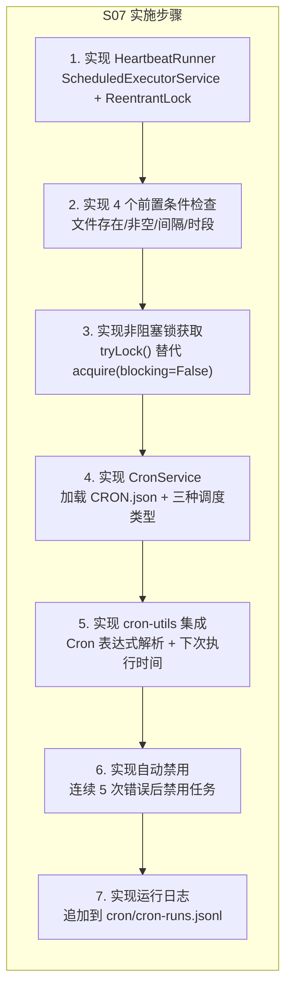

#### 关键并发模型

```java
public class HeartbeatRunner {
    private final ScheduledExecutorService scheduler = Executors.newSingleThreadScheduledExecutor(
            r -> Thread.ofVirtual().name("heartbeat").unstarted(r));
    private final ReentrantLock laneLock;  // 与主线程共享

    public void start() {
        scheduler.scheduleAtFixedRate(this::tick, 1, 1, TimeUnit.SECONDS);
    }

    private void tick() {
        if (!shouldRun()) return;

        // 非阻塞尝试获取锁 — 用户优先
        if (!laneLock.tryLock()) return;
        try {
            String result = runHeartbeat();
            if (!"HEARTBEAT_OK".equals(result) && !result.equals(lastOutput)) {
                outputQueue.offer(result);
                lastOutput = result;
            }
        } finally {
            laneLock.unlock();
        }
    }
}
```

#### CronService 三种调度

```java
public class CronService {

    private Instant nextFireTime(CronJob job, Instant now) {
        return switch (job.schedule().kind()) {
            case "at" -> Instant.parse(job.schedule().at());
            case "every" -> {
                Instant anchor = Instant.parse(job.schedule().anchor());
                long interval = job.schedule().everySeconds();
                long elapsed = Duration.between(anchor, now).getSeconds();
                long periods = elapsed / interval + 1;
                yield anchor.plusSeconds(periods * interval);
            }
            case "cron" -> {
                // 使用 cron-utils 库
                CronDefinition def = CronDefinitionBuilder.instanceDefinitionFor(CronType.UNIX);
                Cron cron = new CronParser(def).parse(job.schedule().expr());
                ExecutionTime et = ExecutionTime.forCron(cron);
                yield et.nextExecution(ZonedDateTime.ofInstant(now, ZoneId.of(job.schedule().tz())))
                        .map(ZonedDateTime::toInstant)
                        .orElse(Instant.MAX);
            }
            default -> Instant.MAX;
        };
    }
}
```

#### 验收条件

- [ ] Heartbeat 在空闲时自动触发
- [ ] 用户输入时 Heartbeat 被跳过（锁竞争）
- [ ] CRON.json 中的 4 个任务被正确加载
- [ ] `at` 类型任务在指定时间触发
- [ ] `every` 类型任务按间隔触发
- [ ] `cron` 类型任务按表达式触发
- [ ] 连续 5 次错误后任务自动禁用

***

### 6.2 S08: Delivery（Day 31-34，预计 \~1,200 行）

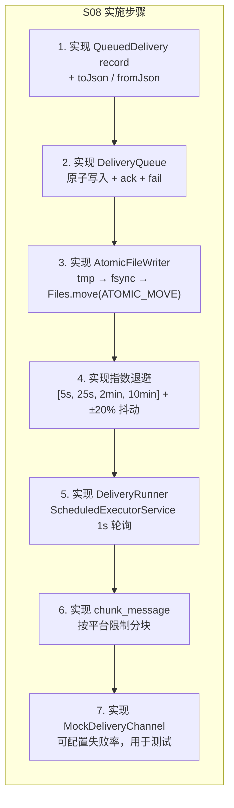

#### 退避计算

```java
private static final long[] BACKOFF_MS = {5_000, 25_000, 120_000, 600_000};

public static long computeBackoffMs(int retryCount) {
    int idx = Math.min(retryCount, BACKOFF_MS.length - 1);
    long base = BACKOFF_MS[idx];
    // ±20% 抖动
    double jitter = 0.8 + Math.random() * 0.4;
    return (long) (base * jitter);
}
```

#### 验收条件

- [ ] 消息入队后，队列目录下出现 JSON 文件
- [ ] 发送成功后，JSON 文件被删除（ack）
- [ ] 发送失败后，retry\_count 递增，next\_retry\_at 按退避更新
- [ ] 超过最大重试次数后，文件移入 `failed/` 目录
- [ ] 程序重启后，pending 消息被恢复处理
- [ ] MockDeliveryChannel 能模拟各种失败场景

***

## 7. Phase 5: 生产层 (Week 7 后半-Week 9)

### 7.1 S09: Resilience（Day 35-39，预计 \~1,500 行）

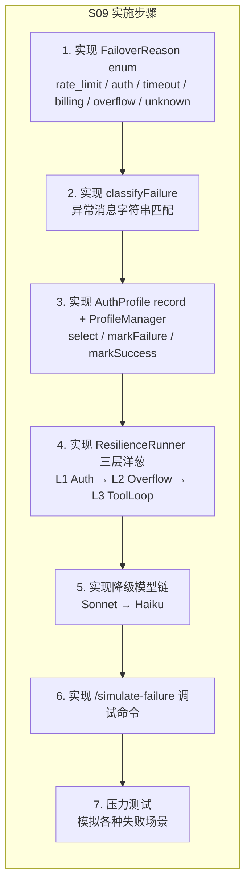

#### 三层洋葱核心实现

```java
public class ResilienceRunner {
    private final ProfileManager profileMgr;
    private final ContextGuard contextGuard;
    private int totalAttempts = 0, successes = 0, rotations = 0, compactions = 0;

    public record RunResult(String reply, List<MessageParam> updatedMessages) {}

    public RunResult run(List<MessageParam> messages, List<Tool> tools, String system) {
        Set<String> triedProfiles = new HashSet<>();

        // Layer 1: Auth Rotation
        while (true) {
            Optional<AuthProfile> profileOpt = profileMgr.selectProfile();
            if (profileOpt.isEmpty()) {
                // 尝试降级模型
                return tryFallbackModels(messages, tools, system);
            }

            AuthProfile profile = profileOpt.get();
            if (triedProfiles.contains(profile.name())) break;
            triedProfiles.add(profile.name());

            AnthropicClient client = buildClient(profile);
            int overflowAttempts = 0;

            // Layer 2: Overflow Recovery
            while (overflowAttempts < MAX_OVERFLOW_COMPACTION) {
                try {
                    // Layer 3: Tool-Use Loop
                    String reply = toolUseLoop(client, messages, tools, system);
                    profileMgr.markSuccess(profile);
                    successes++;
                    return new RunResult(reply, messages);
                } catch (Exception e) {
                    totalAttempts++;
                    FailoverReason reason = classifyFailure(e);
                    // SDK v2.20.0: 可使用 ((AnthropicException) e).errorType() 辅助分类

                    if (reason == FailoverReason.OVERFLOW) {
                        compactions++;
                        overflowAttempts++;
                        contextGuard.truncateAndCompact(client, messages);
                        continue;
                    }

                    profileMgr.markFailure(profile, reason, reason.cooldownSeconds());
                    rotations++;
                    break; // 跳到下一个 Profile
                }
            }
        }
        throw new RuntimeException("All profiles exhausted");
    }
}
```

#### 验收条件

- [ ] 单个 Profile 失败后，自动轮转到下一个
- [ ] Profile 冷却期内被跳过
- [ ] 上下文溢出触发截断 + 压缩（最多 3 次）
- [ ] 所有 Profile 耗尽后尝试降级模型
- [ ] `/simulate-failure rate_limit` 能触发模拟失败
- [ ] 统计信息（attempts / successes / rotations / compactions）正确

***

### 7.2 S10: Concurrency（Day 40-44，预计 \~1,400 行）

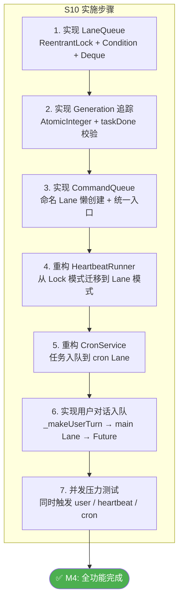

#### LaneQueue 完整实现

```java
public class LaneQueue {
    private final String name;
    private final int maxConcurrency;
    private final ArrayDeque<QueuedItem> deque = new ArrayDeque<>();
    private final ReentrantLock lock = new ReentrantLock();
    private final Condition idle = lock.newCondition();
    private final AtomicInteger generation = new AtomicInteger(0);
    private int activeCount = 0;

    record QueuedItem(Callable<Object> task, CompletableFuture<Object> future, int gen) {}

    public CompletableFuture<Object> enqueue(Callable<Object> task) {
        var future = new CompletableFuture<Object>();
        lock.lock();
        try {
            deque.addLast(new QueuedItem(task, future, generation.get()));
            pump();
        } finally {
            lock.unlock();
        }
        return future;
    }

    private void pump() {
        // 必须在持有 lock 的情况下调用
        while (activeCount < maxConcurrency && !deque.isEmpty()) {
            QueuedItem item = deque.pollFirst();
            if (item.gen() != generation.get()) {
                item.future().cancel(false);
                continue;
            }
            activeCount++;
            int gen = generation.get();

            Thread.ofVirtual().name(name + "-worker-" + gen).start(() -> {
                try {
                    Object result = item.task().call();
                    item.future().complete(result);
                } catch (Exception e) {
                    item.future().completeExceptionally(e);
                } finally {
                    taskDone(gen);
                }
            });
        }
    }

    private void taskDone(int expectedGen) {
        lock.lock();
        try {
            activeCount--;
            if (generation.get() == expectedGen) pump();
            if (activeCount == 0 && deque.isEmpty()) idle.signalAll();
        } finally {
            lock.unlock();
        }
    }

    public void waitForIdle(long timeoutMs) throws InterruptedException {
        lock.lock();
        try {
            long deadline = System.nanoTime() + TimeUnit.MILLISECONDS.toNanos(timeoutMs);
            while (activeCount > 0 || !deque.isEmpty()) {
                long remaining = deadline - System.nanoTime();
                if (remaining <= 0) return;
                idle.await(remaining, TimeUnit.NANOSECONDS);
            }
        } finally {
            lock.unlock();
        }
    }

    public void resetGeneration() {
        lock.lock();
        try {
            generation.incrementAndGet();
        } finally {
            lock.unlock();
        }
    }
}
```

#### 验收条件

- [ ] 用户对话通过 main Lane 串行执行
- [ ] Heartbeat 通过 heartbeat Lane 独立运行
- [ ] Cron 任务通过 cron Lane 独立运行
- [ ] 三条 Lane 互不阻塞
- [ ] Generation 不匹配的陈旧任务被安全忽略
- [ ] `waitForIdle()` 在所有任务完成后返回
- [ ] `resetGeneration()` 正确递增代数

***

## 8. Phase 6: 收尾 (Week 10)

### 8.1 文档编写（Day 45-47）

每个 Session 需要一个 `docs/sXX_xxx.md` 文件，内容包括：

1. **核心概念** — 本节引入的唯一新概念
2. **架构图** — 简要的数据流或组件图
3. **关键代码片段** — 突出 Java 版与 Python 版的差异
4. **运行方式** — `mvn compile exec:java -Dexec.mainClass=...`
5. **REPL 命令** — 本节支持的 `/` 命令
6. **学习要点** — 3\~5 个要点

### 8.2 集成测试（Day 48-50）

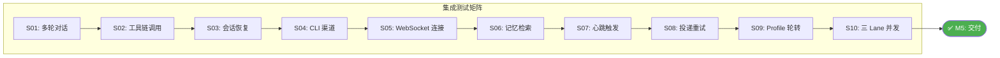

***

## 9. 每个 Session 的详细实施规格

### 9.1 输入/输出对照总表

| Session | 输入（Python 版行为）                     | 输出（Java 版行为）                          | 对齐验证方法                   |
| ------- | ---------------------------------- | ------------------------------------- | ------------------------ |
| S01     | `input()` → Claude API → `print()` | `Scanner` → Claude API → `System.out` | 同一 prompt，对比回复质量         |
| S02     | bash/read/write/edit 四工具           | 同四工具，ProcessBuilder 替代 subprocess     | 创建文件 → 读取 → 编辑 → 验证      |
| S03     | `.jsonl` 追加 → 重放                   | 同格式 JSONL，Jackson 序列化                 | Python 写的 JSONL，Java 能读取 |
| S04     | Telegram/Feishu 消息收发               | 同协议 HTTP 调用                           | 同一 Bot Token，两版收发互通      |
| S05     | WebSocket JSON-RPC                 | 同协议                                   | wscat 发同一 JSON，对比响应      |
| S06     | 8 层 prompt + TF-IDF                | 同结构 prompt + 同算法                      | 同 query，对比 Top3 检索结果     |
| S07     | 心跳 + cron 触发                       | 同触发逻辑                                 | 同 CRON.json，对比触发时间       |
| S08     | 原子队列 + 退避                          | 同文件格式 + 同退避表                          | 同失败场景，对比重试间隔             |
| S09     | 3 层重试 + Profile 轮转                 | 同逻辑                                   | /simulate-failure 同结果    |
| S10     | 三 Lane FIFO                        | 同 Lane 语义                             | 同并发负载，对比调度顺序             |

### 9.2 每个 Session 的公共方法签名

```java
// 每个 Session 都必须有：
public class SxxXxx {
    public static void main(String[] args) { ... }  // 入口
}

// S03+ 还需有：
private static boolean handleReplCommand(String input, ...) { ... }  // REPL 命令处理
```

***

## 10. 共享基础设施

### 10.1 Config.java

> **注意**: Anthropic SDK v2.20.0 自带 `AnthropicOkHttpClient.fromEnv()` 可直接从环境变量
> `ANTHROPIC_API_KEY` 读取 API 密钥。`Config.java` 主要用于管理其他配置项
> （如 `TELEGRAM_BOT_TOKEN`、`FEISHU_APP_ID` 等）。

```java
package com.claw0.common;

import io.github.cdimascio.dotenv.Dotenv;
import java.nio.file.Path;

public final class Config {
    private static final Dotenv dotenv;

    static {
        // 从项目根目录加载 .env
        Path root = Path.of(System.getProperty("user.dir"));
        dotenv = Dotenv.configure()
                .directory(root.toString())
                .ignoreIfMissing()
                .load();
    }

    public static String get(String key) {
        String val = dotenv.get(key);
        return val != null ? val : System.getenv(key);
    }

    public static String get(String key, String defaultValue) {
        String val = get(key);
        return val != null && !val.isEmpty() ? val : defaultValue;
    }

    private Config() {}
}
```

### 10.2 AnsiColors.java

```java
package com.claw0.common;

public final class AnsiColors {
    public static final String CYAN   = "\033[36m";
    public static final String GREEN  = "\033[32m";
    public static final String YELLOW = "\033[33m";
    public static final String RED    = "\033[31m";
    public static final String DIM    = "\033[2m";
    public static final String BOLD   = "\033[1m";
    public static final String RESET  = "\033[0m";

    public static String coloredPrompt() {
        return CYAN + BOLD + "You > " + RESET;
    }
    public static void printAssistant(String text) {
        System.out.println("\n" + GREEN + BOLD + "Assistant:" + RESET + " " + text + "\n");
    }
    public static void printTool(String name, String detail) {
        System.out.println("  " + DIM + "[tool: " + name + "] " + detail + RESET);
    }
    public static void printInfo(String text) {
        System.out.println(DIM + text + RESET);
    }

    private AnsiColors() {}
}
```

### 10.3 JsonUtils.java

```java
package com.claw0.common;

import com.fasterxml.jackson.core.JsonProcessingException;
import com.fasterxml.jackson.databind.ObjectMapper;
import com.fasterxml.jackson.databind.SerializationFeature;
import com.fasterxml.jackson.datatype.jsr310.JavaTimeModule;
import com.fasterxml.jackson.module.paramnames.ParameterNamesModule;
import java.io.*;
import java.nio.charset.StandardCharsets;
import java.nio.file.*;
import java.util.*;

public final class JsonUtils {
    private static final ObjectMapper MAPPER = new ObjectMapper()
            .registerModule(new JavaTimeModule())
            .registerModule(new ParameterNamesModule())   // record 零注解反序列化
            .disable(SerializationFeature.WRITE_DATES_AS_TIMESTAMPS);

    public static String toJson(Object obj) {
        try { return MAPPER.writeValueAsString(obj); }
        catch (JsonProcessingException e) { throw new UncheckedIOException(e); }
    }

    public static <T> T fromJson(String json, Class<T> type) {
        try { return MAPPER.readValue(json, type); }
        catch (JsonProcessingException e) { throw new UncheckedIOException(e); }
    }

    @SuppressWarnings("unchecked")
    public static Map<String, Object> toMap(String json) {
        return fromJson(json, Map.class);
    }

    public static void appendJsonl(Path file, Object obj) throws IOException {
        Files.createDirectories(file.getParent());
        try (var writer = Files.newBufferedWriter(file, StandardCharsets.UTF_8,
                StandardOpenOption.CREATE, StandardOpenOption.APPEND)) {
            writer.write(toJson(obj));
            writer.newLine();
        }
    }

    public static <T> List<T> readJsonl(Path file, Class<T> type) throws IOException {
        if (!Files.exists(file)) return new ArrayList<>();
        List<T> results = new ArrayList<>();
        try (var reader = Files.newBufferedReader(file, StandardCharsets.UTF_8)) {
            String line;
            while ((line = reader.readLine()) != null) {
                if (!line.isBlank()) results.add(fromJson(line.trim(), type));
            }
        }
        return results;
    }

    private JsonUtils() {}
}
```

***

## 11. 自包含模式下的代码组织策略

> **核心原则**: 每个 Session 的 `.java` 文件是完全自包含的（除 common 包外不 import 其他 Session），
> 读者可以仅阅读当前文件即理解全部逻辑。代码通过"复制粘贴 + 增量修改"的方式从前一个 Session 演进。

### 11.1 代码膨胀控制策略

自包含模式不可避免地导致后期 Session 代码量增长。以下策略用于控制每个文件保持在 **≤ 1,800 行** 的可读范围内：

| 策略 | 说明 | 适用 Session |
|---|---|---|
| **Region 折叠标记** | 使用 `// region S01-S02 Core` / `// endregion` 标记前序代码，IDE 可一键折叠 | S03+ |
| **内层类提取** | 超过 100 行的组件（如 ContextGuard、MemoryStore）定义为 `static inner class` | S06, S09 |
| **精简复制** | 复制前序代码时只保留被当前 Session 实际调用的方法，删除未使用的辅助方法 | 所有 |
| **常量内联** | 前序 Session 的配置常量直接内联到使用处，减少顶部常量区长度 | S08+ |
| **注释瘦身** | 前序代码区域使用最精简注释（`// [S02] tool dispatch`），详细注释仅在当前新增代码 | S05+ |

### 11.2 各 Session 代码量预算

| Session | 新增逻辑 | 前序代码 | 总行数估算 | 是否接近上限 |
|---|---|---|---|---|
| S01 | \~200 | 0 | **\~200** | |
| S02 | \~350 | \~200 (S01) | **\~550** | |
| S03 | \~500 | \~400 (S01+S02 精简) | **\~1,100** | |
| S04 | \~550 | \~500 (S01-S03 精简) | **\~1,200** | |
| S05 | \~400 | \~500 (S01-S04 精简) | **\~900** | |
| S06 | \~700 | \~600 (S01-S05 精简) | **\~1,500** | |
| S07 | \~350 | \~550 (S01-S06 精简) | **\~900** | |
| S08 | \~450 | \~600 (S01-S07 精简) | **\~1,200** | |
| S09 | \~500 | \~700 (S01-S08 精简) | **\~1,500** | |
| S10 | \~450 | \~750 (S01-S09 精简) | **\~1,400** | |
| **总计** | | | **\~10,450** | |

> **如果 S09 或 S10 接近 1,800 行**, 触发应急措施：将 ContextGuard 或 MemoryStore 移入 common 包，
> 减少自包含体积。这是对"单文件独立性"的最小妥协。

### 11.3 代码区域组织模板（S05+ 示例）

```java
public class S05GatewayRouting {

    // ================================================================
    // region S01-S02 Core: Agent Loop + Tool Dispatch
    //   (详见 S01AgentLoop.java / S02ToolUse.java)
    // ================================================================
    // ... 精简后的核心代码 ...
    // endregion

    // ================================================================
    // region S03: Session Management + Context Guard
    // ================================================================
    // ... 精简后的会话管理代码 ...
    // endregion

    // ================================================================
    // region S04: Channel Abstraction
    // ================================================================
    // ... 精简后的渠道代码 ...
    // endregion

    // ================================================================
    // S05 NEW: Gateway & Routing (本 Session 新增)
    // ================================================================
    // ... 当前 Session 的完整实现 ...

    public static void main(String[] args) { ... }
}
```

### 11.4 Graceful Shutdown 统一模式

S07+ 的 Session 包含后台线程（Heartbeat、Cron、Delivery），需要统一的 Shutdown 机制：

```java
public static void main(String[] args) {
    // ... 初始化 ...

    // 注册 ShutdownHook 确保优雅退出
    Runtime.getRuntime().addShutdownHook(Thread.ofVirtual().unstarted(() -> {
        printInfo("Shutting down...");
        heartbeatRunner.stop();        // S07+
        cronService.stop();            // S07+
        deliveryRunner.stop();         // S08+
        channelManager.closeAll();     // S04+
        gatewayServer.stop(1000);      // S05+
        printInfo("Goodbye!");
    }));

    // ... 主循环 ...
}
```

***

## 12. 测试策略

### 12.1 测试分层

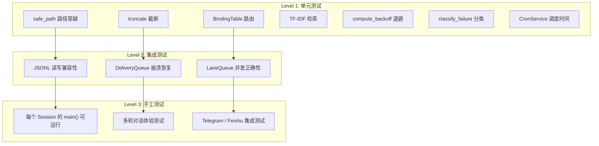

### 12.2 必须有单元测试的模块

| 模块                            | 测试重点                    | 测试数量 |
| ----------------------------- | ----------------------- | ---- |
| `safe_path`                   | 路径穿越防护                  | 5+   |
| `truncate`                    | 截断 + 边界情况               | 3    |
| `BindingTable.resolve`        | 5 级匹配 + 优先级             | 8+   |
| `ContextGuard.estimateTokens` | 各种输入的 token 估算          | 5    |
| `TfIdfSearch`                 | cosine / tfidf / 检索结果排序 | 6+   |
| `computeBackoffMs`            | 退避时间 + 抖动范围             | 4    |
| `classifyFailure`             | 6 种失败类型分类               | 6    |
| `CronService.nextFireTime`    | 三种调度类型计算                | 9+   |
| `LaneQueue`                   | 入队/出队/generation/idle   | 8+   |
| `AtomicFileWriter`            | 原子写入 + 崩溃恢复             | 4    |

### 12.3 Anthropic API Mock 策略

单元测试**不依赖真实 API**，采用以下策略：

| 层级 | Mock 方式 | 适用场景 |
|---|---|---|
| **纯逻辑测试** | 不涉及 API，直接测试算法 | safe\_path, TF-IDF, backoff, LaneQueue |
| **接口隔离** | 抽取 `AgentRunner` 接口，测试时注入 Mock 实现 | ContextGuard, ResilienceRunner |
| **录制回放** | 预录 API 响应 JSON，用 `MockWebServer`（OkHttp 测试库）回放 | S01 Agent Loop, S02 Tool Use |
| **集成测试** | 标记 `@Tag("integration")`，需真实 API Key，CI 中可选跳过 | S04 Telegram, S05 WebSocket |

```java
// 示例: 使用 OkHttp MockWebServer 测试 Agent Loop
@Test
void testAgentLoopWithMockedApi() {
    try (MockWebServer server = new MockWebServer()) {
        server.enqueue(new MockResponse()
            .setBody(RECORDED_API_RESPONSE_JSON)
            .setHeader("content-type", "application/json"));

        AnthropicClient client = AnthropicOkHttpClient.builder()
            .apiKey("test-key")
            .baseUrl(server.url("/").toString())
            .build();

        // ... 测试逻辑 ...
    }
}
```

### 12.4 logback.xml 配置

```xml
<!-- src/main/resources/logback.xml -->
<configuration>
    <appender name="STDOUT" class="ch.qos.logback.core.ConsoleAppender">
        <encoder>
            <pattern>%d{HH:mm:ss.SSS} [%thread] %-5level %logger{36} - %msg%n</pattern>
        </encoder>
    </appender>

    <!-- Session 代码日志 -->
    <logger name="com.claw0" level="INFO" />

    <!-- 降低 OkHttp / Anthropic SDK 日志级别 -->
    <logger name="okhttp3" level="WARN" />
    <logger name="com.anthropic" level="WARN" />

    <root level="INFO">
        <appender-ref ref="STDOUT" />
    </root>
</configuration>
```

***

## 13. 验收标准

### 13.1 功能验收

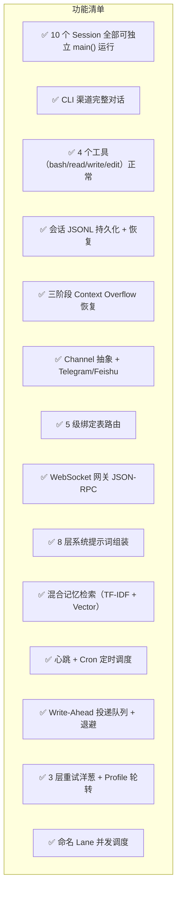

### 13.2 非功能验收

| 维度       | 标准                                   |
| -------- | ------------------------------------ |
| **可运行性** | 每个 Session 的 `main()` 都能独立启动         |
| **代码量**  | 每个 Session 文件 ≤ 1,800 行（教学可读性，含前序代码折叠区） |
| **编译**   | `mvn compile` 零警告、零错误                |
| **测试**   | `mvn test` 全部通过，覆盖率 ≥ 60%            |
| **文档**   | 10 个 Session 文档 + README 完整          |
| **兼容性**  | Java 21 (LTS) 编译运行，全面启用虚拟线程          |
| **数据兼容** | workspace/ 目录与 Python 版共用，JSONL 格式互通 |
| **SDK 版本** | Anthropic Java SDK ≥ 2.20.0         |
| **优雅退出** | S07+ Session 的后台线程在 Ctrl+C 时正常关闭     |

***

## 14. 编码规范

### 14.1 风格规范

| 规则                      | 说明                                                                    |
| ----------------------- | --------------------------------------------------------------------- |
| **单文件原则**               | 每个 Session 是一个 `.java` 文件（自包含），内部类/record/enum 内联定义。前序代码用 `// region` 折叠 |
| **命名**                  | 类 `PascalCase`，方法/变量 `camelCase`，常量 `UPPER_SNAKE`                     |
| **虚拟线程优先**              | 所有后台线程使用 `Thread.ofVirtual()`，不再使用 `daemon=true` 平台线程                 |
| **SequencedCollection** | `Deque` 操作使用 `getFirst()` / `getLast()` / `reversed()` 等 Java 21 新增方法 |
| **record 优先**           | 不可变数据结构用 `record`，配合 `jackson-module-parameter-names` 实现零注解序列化        |
| **var 适度使用**            | 局部变量类型明显时用 `var`，提高可读性                                                |
| **Stream 简洁**           | 简单的 filter/map/collect 用 Stream，复杂逻辑用 for 循环                          |
| **Optional 返回**         | 可能为空的返回值用 `Optional<T>`，不返回 `null`                                    |
| **UTF-8 强制**            | 所有文件 I/O 显式指定 `StandardCharsets.UTF_8`                                |
| **资源管理**                | 所有 I/O 资源用 try-with-resources                                         |
| **日志**                  | 重要事件用 SLF4J `logger.info/warn/error`，调试用 `printInfo()`                |
| **Text Blocks**         | JSON Schema 等多行字符串使用 Java 21 Text Block (`"""..."""`)                  |
| **Shutdown**            | S07+ 必须注册 `Runtime.addShutdownHook()` 确保后台线程优雅退出                      |

### 14.2 每个 Session 文件结构模板

```java
/**
 * Section XX: Title
 * "One-line summary of the core concept"
 *
 * [ASCII architecture diagram]
 *
 * Usage:
 *     mvn compile exec:java -Dexec.mainClass="com.claw0.sessions.SxxTitle"
 *
 * Required .env:
 *     ANTHROPIC_API_KEY=sk-ant-xxxxx
 *
 * SDK: anthropic-java 2.20.0
 */
package com.claw0.sessions;

// --- Imports (grouped: java.*, third-party, com.claw0) ---

public class SxxTitle {

    // ================================================================
    // region S01-S(xx-1): Previous Sessions Core
    //   (折叠区: 前序 Session 的精简核心代码)
    // ================================================================
    // ... collapsed code ...
    // endregion

    // ================================================================
    // Sxx NEW: Current Session (本 Session 新增)
    // ================================================================

    // --- Constants ---
    // --- Record / Inner Class definitions ---
    // --- Static fields (client, config) ---
    // --- Tool definitions (if applicable) ---
    // --- Tool implementations ---
    // --- Core logic (agent loop, etc.) ---
    // --- REPL command handler (if applicable) ---
    // --- Shutdown hook (S07+) ---
    // --- Entry point ---

    public static void main(String[] args) {
        // 环境检查 → 初始化 → 注册 ShutdownHook(S07+) → 运行
    }
}
```

***

## 15. 风险应对预案

### 15.1 风险 × 预案矩阵

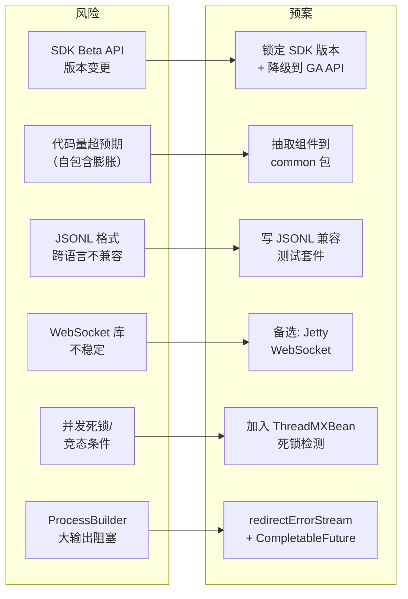

### 15.2 详细预案

#### 风险 1: SDK Beta API 版本变更

**概率**: 中（SDK 平均每周发布 1-2 个版本，Beta API 可能变更）

**说明**: S03+ 使用的 `BetaToolRunner`（`client.beta().messages()`）属于 Beta API。
SDK 的 Beta 前缀表示 API 签名可能在后续版本中变化。

**预案**:
1. 在 pom.xml 中**锁定** SDK 版本为 `2.20.0`，不随意升级
2. 如果 Beta API 发生破坏性变更，回退到 S02 的手写 tool dispatch loop（所有 Session 通用）
3. 如果 `BetaToolRunner` 被移除，使用 GA API 的 `client.messages().create()` + 手写循环

```java
// 降级方案: GA API + 手写 tool loop（无需 Beta）
Message response = client.messages().create(params);
while (response.stopReason() == StopReason.TOOL_USE) {
    // 提取 ToolUseBlock, 执行工具, 构建 ToolResultBlockParam
    // 重新调用 client.messages().create(...)
}
```

**影响**: 手写 tool loop 增加 \~50 行/Session，但无架构影响。

#### 风险 2: 代码量超预期（自包含膨胀）

**判定阈值**: 单个 Session 超过 1,800 行

**预案**: 按以下优先级依次应用：
1. **精简前序代码** — 删除当前 Session 未使用的前序方法
2. **使用 region 折叠** — IDE 支持的代码折叠，不影响功能
3. **抽取到 common 包** — 将 ContextGuard、MemoryStore 等移入 common（最后手段）

> 如果最终有 2+ 个组件被抽取到 common，则 common 包从 3 个文件扩展到 5 个。

#### 风险 3: JSONL 格式跨语言不兼容

**预案**: 与原方案相同 — 编写 JSONL 兼容测试套件。

#### 风险 4: WebSocket 库不稳定

**预案**: 与原方案相同 — 备选 Jetty WebSocket。

#### 风险 5: 并发死锁

**预防**: 在 S10 中加入死锁检测：

```java
// 启动时注册死锁检测
ScheduledExecutorService watchdog = Executors.newSingleThreadScheduledExecutor();
watchdog.scheduleAtFixedRate(() -> {
    long[] deadlocked = ManagementFactory.getThreadMXBean().findDeadlockedThreads();
    if (deadlocked != null) {
        System.err.println("DEADLOCK DETECTED! Threads: " + Arrays.toString(deadlocked));
    }
}, 5, 5, TimeUnit.SECONDS);
```

#### 风险 6: ProcessBuilder 大输出阻塞

**概率**: 高（bash 工具执行 `find /` 等命令时输出量巨大）

**预防**: 已在 S02 实现中采用 `redirectErrorStream(true)` 合并流 + `CompletableFuture` 异步读取。
详见 3.2 节 bash 工具代码。

**额外防护**: 输出超过 50,000 字符时截断（已在验收条件中要求）。

