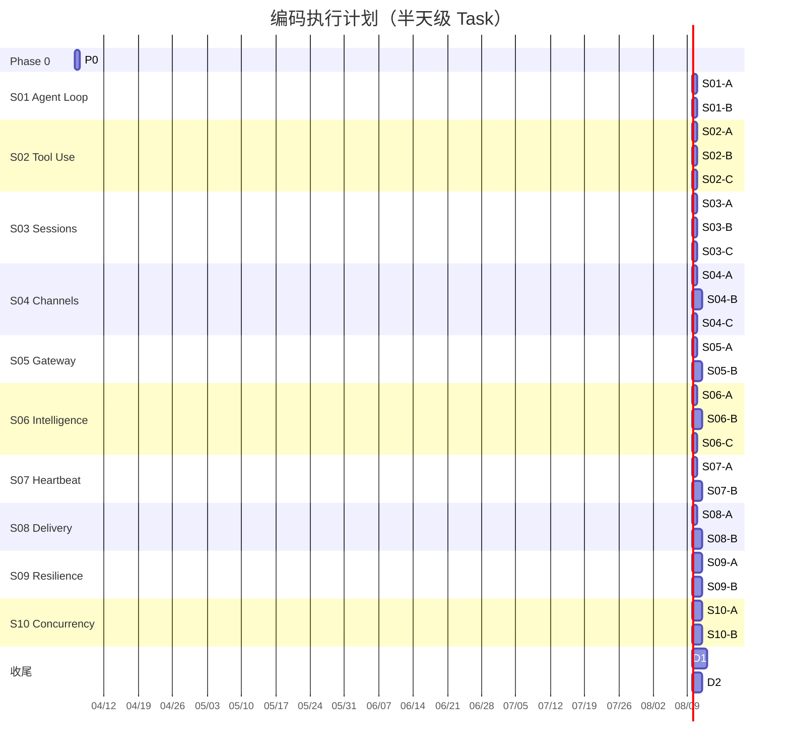

# claw0 Java 编码执行计划

> **用途**: AI 编码 Agent 的逐步执行输入，每次取一个 Task 实施
> **粒度**: 半天级（2-4 小时 / Task），每个 Task 产出可编译可验证的增量
> **依据**: [light-claw0-java-rewrite-plan.md](./light-claw0-java-rewrite-plan.md)
> **总计**: 28 个 Task，50 人天

---

## 1. 执行总览

### 1.1 时间线



### 1.2 Task 总表

| Task ID | Session | Task 名称 | 预计行数 | 依赖 | 产出文件 |
|---------|---------|-----------|---------|------|---------|
| P0 | — | 项目骨架 + common 工具类 | ~125 | 无 | pom.xml, Config.java, AnsiColors.java, JsonUtils.java, logback.xml |
| S01-A | S01 | SDK 验证 + 骨架 | ~80 | P0 | S01AgentLoop.java (部分) |
| S01-B | S01 | agent_loop 完整实现 | ~120 | S01-A | S01AgentLoop.java (完整) |
| S02-A | S02 | 4 个工具函数实现 | ~200 | S01-B | S02ToolUse.java (部分) |
| S02-B | S02 | Tool dispatch loop | ~150 | S02-A | S02ToolUse.java (部分) |
| S02-C | S02 | 安全防护 + 单元测试 | ~200 | S02-B | S02ToolUse.java, S02ToolUseTest.java |
| S03-A | S03 | SessionStore + JSONL | ~250 | S02-C | S03Sessions.java (部分) |
| S03-B | S03 | ContextGuard 三阶段 | ~200 | S03-A | S03Sessions.java (部分) |
| S03-C | S03 | REPL 命令 + 全集成 | ~250 | S03-B | S03Sessions.java (完整) |
| S04-A | S04 | Channel 接口 + CLIChannel | ~150 | S03-C | S04Channels.java (部分) |
| S04-B | S04 | Telegram + Feishu Channel | ~400 | S04-A | S04Channels.java (部分) |
| S04-C | S04 | ChannelManager + memory 工具 | ~250 | S04-B | S04Channels.java (完整) |
| S05-A | S05 | BindingTable + AgentManager | ~250 | S04-C | S05GatewayRouting.java (部分) |
| S05-B | S05 | WebSocket Gateway + JSON-RPC | ~350 | S05-A | S05GatewayRouting.java (完整) |
| S06-A | S06 | BootstrapLoader + SkillsManager | ~300 | S05-B | S06Intelligence.java (部分) |
| S06-B | S06 | MemoryStore (TF-IDF + 向量 + 混合检索) | ~450 | S06-A | S06Intelligence.java (部分) |
| S06-C | S06 | 8 层 prompt 组装 + autoRecall + 集成 | ~250 | S06-B | S06Intelligence.java (完整) |
| S07-A | S07 | HeartbeatRunner | ~200 | S06-C | S07HeartbeatCron.java (部分) |
| S07-B | S07 | CronService (三种调度) + ShutdownHook | ~350 | S07-A | S07HeartbeatCron.java (完整) |
| S08-A | S08 | DeliveryQueue + AtomicFileWriter | ~300 | S07-B | S08Delivery.java (部分) |
| S08-B | S08 | DeliveryRunner + MockChannel + 测试 | ~350 | S08-A | S08Delivery.java (完整) |
| S09-A | S09 | FailoverReason + ProfileManager | ~350 | S08-B | S09Resilience.java (部分) |
| S09-B | S09 | ResilienceRunner 三层洋葱 + 降级 | ~400 | S09-A | S09Resilience.java (完整) |
| S10-A | S10 | LaneQueue 完整实现 | ~350 | S09-B | S10Concurrency.java (部分) |
| S10-B | S10 | CommandQueue + 重构集成 + 测试 | ~350 | S10-A | S10Concurrency.java (完整) |
| D1 | — | 10 个 Session 文档 | — | S10-B | docs/*.md |
| D2 | — | 集成测试 + README | — | D1 | README.md, 测试脚本 |

---

## 2. Phase 0: 项目初始化

### Task P0: 项目骨架 + common 工具类

**预计**: ~125 行 | **耗时**: 半天 | **依赖**: 无

#### 产出清单

| 文件 | 说明 |
|------|------|
| `pom.xml` | 完整 Maven 配置，见 rewrite-plan §2.2 |
| `.gitignore` | Java/Maven 标准 + `.env` |
| `.env.example` | `ANTHROPIC_API_KEY=sk-ant-xxxxx` 等 |
| `src/main/resources/logback.xml` | 控制台日志，OkHttp/SDK 降为 WARN |
| `src/main/java/com/claw0/common/Config.java` | dotenv 加载，`get(key)` / `get(key, default)` |
| `src/main/java/com/claw0/common/AnsiColors.java` | ANSI 颜色常量 + `coloredPrompt()` / `printAssistant()` / `printTool()` / `printInfo()` |
| `src/main/java/com/claw0/common/JsonUtils.java` | Jackson ObjectMapper 单例 (含 `ParameterNamesModule` + `JavaTimeModule`) + `toJson()` / `fromJson()` / `toMap()` / `appendJsonl()` / `readJsonl()` |

#### 关键约束

- pom.xml 依赖版本: anthropic `2.20.0`, jackson `2.19.0` (BOM), logback `1.5.18`, junit `5.12.2`
- maven-compiler-plugin 必须启用 `<parameters>true</parameters>`
- 从原项目复制 `workspace/` 目录到 `claw0-java/workspace/`
- JsonUtils 的 ObjectMapper 必须注册 `ParameterNamesModule` 以支持 record 零注解反序列化

#### 验收条件

- [ ] `mvn compile` 零错误零警告
- [ ] Config.get("ANTHROPIC_API_KEY") 能从 .env 读取值
- [ ] JsonUtils.toJson / fromJson 对 record 类型正常工作

---

## 3. Phase 1: S01 Agent Loop (Day 1-3)

### Task S01-A: SDK 验证 + 骨架搭建

**预计**: ~80 行 | **耗时**: 半天 | **依赖**: P0
**产出**: `S01AgentLoop.java` (骨架)

#### 要实现的内容

1. **文件头注释**: Section 01 说明 + ASCII 架构图 + 运行命令
2. **常量**: `MODEL_ID` (从 Config 读取，默认 `claude-sonnet-4-20250514`), `SYSTEM_PROMPT`
3. **客户端初始化**: 使用 `AnthropicOkHttpClient`

#### SDK API 要点

```java
// 客户端创建 — 两种方式
AnthropicClient client = AnthropicOkHttpClient.fromEnv();  // 推荐: 自动读 ANTHROPIC_API_KEY
// 或
AnthropicClient client = AnthropicOkHttpClient.builder()
    .apiKey(Config.get("ANTHROPIC_API_KEY"))
    .build();

// 发送消息
Message response = client.messages().create(MessageCreateParams.builder()
    .model(MODEL_ID)
    .maxTokens(8096)
    .system(SystemPrompt.ofTextBlockParams(List.of(
        TextBlockParam.of(SYSTEM_PROMPT))))
    .messages(messages)
    .build());

// 检查 stop reason
response.stopReason() == StopReason.END_TURN

// 提取文本
response.content().stream()
    .filter(ContentBlock::isText)
    .map(block -> block.asText().text())
    .collect(Collectors.joining());

// 多轮对话: 添加 assistant 消息
// 需要将 response 转换为 MessageParam 加入 messages 列表
```

#### 验收条件

- [ ] `mvn compile` 通过
- [ ] 程序启动打印 banner
- [ ] 能向 Claude API 发送一条消息并收到回复

---

### Task S01-B: agent_loop 完整实现

**预计**: ~120 行 | **耗时**: 半天 | **依赖**: S01-A
**产出**: `S01AgentLoop.java` (完整)
**Python 参考**: `s01_agent_loop.py` 全文 (173 行)

#### 要实现的内容

1. **agent_loop()**: Scanner 读取输入 → 构建消息 → 调用 API → 根据 stop_reason 处理
   - `end_turn`: 提取文本，打印，加入 messages
   - `tool_use`: 占位提示（S02 实现）
   - 异常: 打印错误，回滚最后一条消息 (`messages.remove(messages.size() - 1)`)
2. **main()**: 检查 API Key → 打印 banner → 调用 agent_loop
3. **退出处理**: `quit` / `exit` 退出，Ctrl+C 捕获

#### 关键约束

- 多轮对话需要正确维护 messages 列表（user → assistant → user → ...）
- API 异常时必须 pop 最后一条用户消息，否则下一轮会因 role 交替规则失败
- 输入为空时 `continue`，不发送 API 请求

#### 验收条件

- [ ] 多轮对话上下文连贯（第二轮能引用第一轮的内容）
- [ ] 输入 `quit` / `exit` 正常退出
- [ ] API 错误不导致程序崩溃
- [ ] 空输入被跳过

---

## 4. Phase 1: S02 Tool Use (Day 4-7)

### Task S02-A: 4 个工具函数实现

**预计**: ~200 行 | **耗时**: 半天 | **依赖**: S01-B
**产出**: `S02ToolUse.java` (部分 — 先复制 S01 代码，再添加工具函数)
**Python 参考**: `s02_tool_use.py` 行 95-213

#### 自包含处理

从 S01AgentLoop.java 复制全部代码到 S02ToolUse.java，修改类名。在 S01 代码之后添加：

#### 要实现的内容

| 函数 | 核心逻辑 |
|------|---------|
| `safePath(String raw) → Path` | 解析路径，检查是否在 WORKDIR 内部，防止路径穿越 |
| `truncate(String text, int limit) → String` | 超过 limit 字符时截断并追加 `\n...[truncated]` |
| `toolBash(Map input) → String` | ProcessBuilder 执行 shell 命令，带超时和危险命令黑名单 |
| `toolReadFile(Map input) → String` | `Files.readString()` 读取文件内容 |
| `toolWriteFile(Map input) → String` | `Files.writeString()` 写入文件，自动创建父目录 |
| `toolEditFile(Map input) → String` | 精确字符串替换（唯一匹配检查 + `replaceFirst`） |

#### 关键约束

- **toolBash 必须**使用 `redirectErrorStream(true)` 合并 stdout/stderr 避免死锁
- **toolBash 必须**用 `CompletableFuture.supplyAsync()` 在 waitFor 之前读取输出
- 危险命令黑名单: `rm -rf /`, `mkfs`, `> /dev/sd`, `dd if=`
- 所有工具输出经过 `truncate(result, 50000)` 截断
- `toolEditFile` 中 `old_string` 必须在文件中恰好出现 1 次，否则报错
- 使用 `Pattern.quote()` 和 `Matcher.quoteReplacement()` 防止正则特殊字符问题

#### 验收条件

- [ ] `safePath("../../etc/passwd")` 抛出错误
- [ ] `toolBash` 命令超时能正确终止子进程
- [ ] `toolEditFile` 对非唯一匹配返回错误信息
- [ ] 所有工具输出不超过 50000 字符

---

### Task S02-B: Tool Schema 定义 + dispatch loop

**预计**: ~150 行 | **耗时**: 半天 | **依赖**: S02-A
**Python 参考**: `s02_tool_use.py` 行 215-440

#### 要实现的内容

1. **TOOLS Schema**: 定义 4 个工具的 JSON Schema（用 Java Text Block `"""..."""`），构建 `List<Tool>` 传递给 API
2. **TOOL_HANDLERS**: `Map<String, Function<Map<String,Object>, String>>` 分发表
3. **tool dispatch loop**: 在 `agent_loop()` 中处理 `StopReason.TOOL_USE`:
   - 提取 `ToolUseBlock`（通过 `block.isToolUse()` → `block.asToolUse()`）
   - 从 `.name()` 查找 handler，从 `.input()` 获取参数
   - 执行工具，收集结果
   - 构建 tool_result 消息回传 API
   - 循环直到 `StopReason.END_TURN`

#### SDK API 要点 — Tool Use (GA API, 手写 loop)

```java
// 定义 Tool Schema
Tool bashTool = Tool.builder()
    .name("bash")
    .description("Run a shell command")
    .inputSchema(Tool.InputSchema.builder()
        .putAdditionalProperty("type", JsonValue.from("object"))
        .putAdditionalProperty("properties", JsonValue.from(Map.of(
            "command", Map.of("type", "string", "description", "The command to run")
        )))
        .putAdditionalProperty("required", JsonValue.from(List.of("command")))
        .build())
    .build();

// 发送请求时附带 tools
MessageCreateParams.builder()
    .model(MODEL_ID)
    .maxTokens(8096)
    .tools(List.of(bashTool, readFileTool, writeFileTool, editFileTool))
    .messages(messages)
    .build();

// 处理 ToolUseBlock
for (ContentBlock block : response.content()) {
    if (block.isToolUse()) {
        var toolUse = block.asToolUse();
        String name = toolUse.name();
        String id = toolUse.id();
        // toolUse.input() 返回 JsonValue，需转为 Map
    }
}

// 构建 tool_result 回传
// 需要将 assistant 的完整 response 和 tool results 都加入 messages
```

#### 关键约束

- 这是手写的 tool dispatch loop（教学目的），S03+ 将切换到 BetaToolRunner
- 必须正确处理多个工具连续调用（一次 response 可能包含多个 ToolUseBlock）
- tool_result 的 `tool_use_id` 必须与对应的 `ToolUseBlock.id()` 匹配

#### 验收条件

- [ ] 让 Claude "创建一个文件" → 调用 write_file → 文件出现在 workspace
- [ ] 让 Claude "读取刚创建的文件" → 调用 read_file → 返回正确内容
- [ ] 工具链调用（多步工具调用后回到 end_turn）正常

---

### Task S02-C: 安全防护完善 + 单元测试

**预计**: ~200 行 | **耗时**: 半天 | **依赖**: S02-B
**产出**: `S02ToolUse.java` (完整), `S02ToolUseTest.java`

#### 要实现的内容

1. 完善所有边界场景处理（空输入、超大输出、特殊字符路径等）
2. 编写 `S02ToolUseTest.java` 单元测试:
   - `safePath`: 5+ 测试（正常路径、`..` 穿越、绝对路径、符号链接）
   - `truncate`: 3 测试（短文本不截断、恰好等于 limit、超出 limit）
   - `toolBash`: 危险命令拒绝测试（不需要真实执行）

#### 验收条件

- [ ] `mvn test` 全部通过
- [ ] 路径穿越被阻止
- [ ] 危险命令被拒绝

---

## 5. Phase 2: S03 Sessions & Context Guard (Day 8-11)

### Task S03-A: SessionStore + JSONL 读写

**预计**: ~250 行 | **耗时**: 半天 | **依赖**: S02-C
**Python 参考**: `s03_sessions.py` — `SessionStore` 类

#### 自包含处理

从 S02 复制核心代码，用 `// region S01-S02 Core` 标记。**本 Session 起 tool loop 切换到 SDK BetaToolRunner**。

#### 要实现的内容

1. **TranscriptEvent record**: `(String type, long timestamp, Map<String,Object> data)`
2. **SessionMeta record**: `(String id, String label, Instant createdAt, Instant lastActive, int messageCount)`
3. **SessionStore 类**:
   - `createSession(String label) → String sessionId`
   - `loadSession(String sessionId) → List<MessageParam>` — 从 JSONL 重建消息历史
   - `saveTurn(String sessionId, String role, Object content)` — 追加到 JSONL
   - `listSessions() → List<SessionMeta>` — 读取 sessions.json 索引
   - `_loadIndex()` / `_saveIndex()` — sessions.json 索引管理
   - `_rebuildHistory(Path file) → List<MessageParam>` — JSONL → SDK MessageParam 转换

#### 关键约束

- JSONL 文件格式必须与 Python 版互通（同一 workspace 下两个版本可以读取对方的会话文件）
- sessions.json 索引文件放在 `workspace/.sessions/sessions.json`
- JSONL 文件放在 `workspace/.sessions/{session_id}.jsonl`
- `_rebuildHistory` 需要按 type 字段区分 user/assistant/tool_use/tool_result，重建正确的 MessageParam 序列

#### 验收条件

- [ ] 创建会话后，JSONL 文件出现
- [ ] 重启程序后能通过 loadSession 恢复完整消息历史
- [ ] sessions.json 索引正确更新

---

### Task S03-B: ContextGuard 三阶段

**预计**: ~200 行 | **耗时**: 半天 | **依赖**: S03-A
**Python 参考**: `s03_sessions.py` — `ContextGuard` 类

#### 要实现的内容

1. **estimateTokens(String text) → int**: 粗略估算（`text.length() / 4`）
2. **estimateMessagesTokens(List messages) → int**: 遍历所有消息估算总 token
3. **truncateToolResults(List messages, int maxFraction)**: 截断过长的工具输出
4. **compactHistory(AnthropicClient client, List messages)**: 用 LLM 压缩早期对话
5. **guardApiCall(...)**: 三阶段重试 — 正常调用 → 截断工具结果 → LLM 压缩历史
6. **isOverflowError(Exception e) → boolean**: 利用 SDK 的 `AnthropicException.errorType()` 判断

#### 关键约束

- `CONTEXT_BUDGET = 180_000` token
- 阶段 2 截断比例: `CONTEXT_BUDGET * 0.3`
- `compactHistory` 调用 Claude API 生成摘要，替换前 N-2 条消息
- 必须处理压缩后仍然溢出的情况（抛出运行时异常）

---

### Task S03-C: REPL 命令 + BetaToolRunner 集成

**预计**: ~250 行 | **耗时**: 半天 | **依赖**: S03-B
**产出**: `S03Sessions.java` (完整)

#### 要实现的内容

1. **REPL 命令处理** `handleReplCommand(String input, ...)`:
   - `/new [label]` — 创建新会话
   - `/list` — 列出所有会话
   - `/switch <id>` — 切换到指定会话
   - `/context` — 显示当前 token 使用量
   - `/compact` — 手动触发历史压缩
   - `/help` — 显示可用命令
2. **集成 BetaToolRunner**: 替代 S02 的手写 tool loop

#### SDK API — BetaToolRunner 用法

```java
// S03+ 使用 BetaToolRunner 自动处理 tool loop
// 注意: 需要 beta() 路径和 anthropic-beta header
BetaToolRunner toolRunner = client.beta().messages().toolRunner(
    BetaMessageCreateParams.builder()
        .model(MODEL_ID)
        .maxTokens(8096)
        .putAdditionalHeader("anthropic-beta", "structured-outputs-2025-11-13")
        .addUserMessage(userInput)
        .addTool(GetWeatherTool.class)  // 需要工具类实现 Supplier<String>
        .build()
);
// 迭代获取最终消息
for (BetaMessage message : toolRunner) {
    // 处理消息
}
```

> **注意**: 如果 BetaToolRunner 集成有困难，可回退到 S02 的 GA API 手写 loop 方式。
> 回退方案见 rewrite-plan §15.2 风险 1。

#### 验收条件

- [ ] `/new test` 创建新会话，JSONL 文件出现
- [ ] `/list` 显示所有会话（含时间戳和消息数）
- [ ] `/switch` 切换后能恢复上下文
- [ ] `/context` 显示 token 估算
- [ ] 长对话触发自动三阶段恢复

---

## 6. Phase 2: S04 Channels (Day 12-16)

### Task S04-A: Channel 接口 + CLIChannel

**预计**: ~150 行 | **耗时**: 半天 | **依赖**: S03-C
**Python 参考**: `s04_channels.py` — `Channel`, `CLIChannel`, `InboundMessage`

#### 要实现的内容

1. **InboundMessage record**: `(text, senderId, channel, accountId, peerId, isGroup, media, raw)`
2. **Channel 接口**: `receive() → Optional<InboundMessage>`, `send(to, text) → boolean`, `close()`
3. **CLIChannel**: Scanner 输入 + System.out 输出

#### 验收条件

- [ ] CLIChannel 行为与 S01 一致（输入 → Claude → 输出）

---

### Task S04-B: TelegramChannel + FeishuChannel

**预计**: ~400 行 | **耗时**: 1 天 | **依赖**: S04-A
**Python 参考**: `s04_channels.py` — `TelegramChannel`, `FeishuChannel`

#### 要实现的内容

1. **TelegramChannel**: `java.net.http.HttpClient` 长轮询
   - 后台虚拟线程 `pollLoop()`: GET `/getUpdates?offset=...&timeout=30`
   - `send()`: POST `/sendMessage`，消息超 4096 字自动分块
   - 去重: `ConcurrentHashMap.newKeySet()` 记录已处理的 update_id
2. **FeishuChannel**: HttpClient + OAuth Token 管理
   - `getAccessToken()`: POST `/auth/v3/tenant_access_token/internal`
   - Token 缓存 + volatile + 过期刷新（双检锁）
   - `send()`: POST `/im/v1/messages`

#### 关键约束

- Telegram 长轮询: `connectTimeout(35s)` > `timeout=30` 参数
- 网络异常时需指数退避重连（1s, 2s, 4s, ...最大 30s），避免紧密循环
- 409 Conflict 表示另一个实例在轮询，应日志警告
- 飞书 Token 线程安全: 使用 volatile + 过期时间戳检查

#### 验收条件

- [ ] Telegram 能接收和发送消息（需配置 BOT_TOKEN）
- [ ] Feishu 能接收和发送消息（需配置 APP_ID/SECRET）
- [ ] 长消息正确分块发送

---

### Task S04-C: ChannelManager + memory 工具 + 集成

**预计**: ~250 行 | **耗时**: 半天 | **依赖**: S04-B
**产出**: `S04Channels.java` (完整)
**Python 参考**: `s04_channels.py` — `ChannelManager`, memory 工具, `run_agent_turn`

#### 要实现的内容

1. **ChannelManager**: 注册/查询渠道和账号，`buildSessionKey()` 构建会话键
2. **memory_write / memory_search 工具**: 写入 `workspace/MEMORY.md` + daily JSONL
3. **run_agent_turn()**: 将 InboundMessage 路由到正确的会话，执行 Agent 并回复
4. **主循环**: 轮询所有 Channel，处理入站消息
5. **REPL 命令**: `/channels`, `/accounts`

#### 验收条件

- [ ] 会话键格式: `agent:main:direct:{channel}:{peer_id}`
- [ ] `memory_write` 追加到 MEMORY.md 和 daily JSONL
- [ ] 多渠道消息正确路由

---

## 7. Phase 2: S05 Gateway & Routing (Day 17-20)

### Task S05-A: BindingTable + AgentManager

**预计**: ~250 行 | **耗时**: 半天 | **依赖**: S04-C
**Python 参考**: `s05_gateway_routing.py` — `BindingTable`, `AgentManager`, `Binding`, `AgentConfig`

#### 要实现的内容

1. **Binding record**: `(tier, matchKey, matchValue, agentId, priority)` — 实现 `Comparable<Binding>`
2. **BindingTable**: 5 级路由匹配 (peer > guild > account > channel > default)
3. **AgentConfig record**: Agent 配置（id, model, workspace, dm_scope 等）
4. **AgentManager**: Agent 注册、查询、每 Agent 独立 workspace 和 session store
5. **dm_scope 会话隔离**: `main` / `per-peer` / `per-channel-peer` / `per-account-channel-peer`

#### 验收条件

- [ ] 5 级绑定表按 tier + priority 正确路由
- [ ] dm_scope 正确影响会话键的生成

---

### Task S05-B: WebSocket Gateway + JSON-RPC 2.0

**预计**: ~350 行 | **耗时**: 1 天 | **依赖**: S05-A
**产出**: `S05GatewayRouting.java` (完整)
**Python 参考**: `s05_gateway_routing.py` — `GatewayServer`

#### 要实现的内容

1. **GatewayServer** (extends `WebSocketServer`):
   - `onMessage()`: 解析 JSON-RPC 2.0 请求，分发到 method 处理器
   - JSON-RPC methods: `send`, `bindings.set`, `bindings.list`, `sessions.list`, `agents.list`, `status`
   - 正确构建 JSON-RPC 响应（含 `id`, `result`/`error`）
2. **Semaphore(4)**: 限制同时运行的 Agent 数
3. **REPL 命令**: `/bindings`, `/route <channel> <peer>`, `/agents`, `/gateway`
4. **集成**: S04 Channel 体系 + BindingTable 路由

#### 关键约束

- WebSocket 服务端默认端口 8080，可通过 Config 配置
- JSON-RPC 2.0: 必须正确处理 `id` 字段（对应请求/响应）
- 并发: 用 `Semaphore.tryAcquire()` 非阻塞获取，获取失败返回 "server busy" 错误

#### 验收条件

- [ ] `wscat -c ws://localhost:8080` 能连接
- [ ] 发送 JSON-RPC 请求收到正确响应
- [ ] 多 Agent 注册和查询正常
- [ ] **M3 里程碑**: 端到端可运行

---

## 8. Phase 3: S06 Intelligence (Day 21-26)

### Task S06-A: BootstrapLoader + SkillsManager

**预计**: ~300 行 | **耗时**: 1 天 | **依赖**: S05-B
**Python 参考**: `s06_intelligence.py` — `BootstrapLoader`, `SkillsManager`

#### 要实现的内容

1. **BootstrapLoader**: 加载 workspace 下 8 个文件 (IDENTITY, SOUL, TOOLS, MEMORY, HEARTBEAT, BOOTSTRAP, AGENTS, USER)
   - 每文件截断 `MAX_FILE_CHARS = 8000` 字符
   - 总计截断 `MAX_TOTAL_CHARS = 30000` 字符
2. **SkillsManager**: 扫描 5 个目录寻找 `SKILL.md` 文件
   - 解析 YAML frontmatter（简易实现：`---` 之间的 `key: value` 行）
   - 渲染 prompt 块: `## Skills\n- skill_name: description\n`
   - `MAX_SKILLS = 20`, `MAX_SKILLS_PROMPT = 3000` 字符

#### 验收条件

- [ ] 加载 8 个 workspace 文件成功（部分不存在时跳过）
- [ ] 发现并解析 `workspace/skills/example-skill/SKILL.md`

---

### Task S06-B: MemoryStore (TF-IDF + 向量 + 混合检索)

**预计**: ~450 行 | **耗时**: 1.5 天 | **依赖**: S06-A
**Python 参考**: `s06_intelligence.py` — `MemoryStore` 类

#### 要实现的内容

1. **数据结构**: `MemoryChunk record (String text, Instant timestamp, String source, double score)`
2. **写入层**: `memoryWrite(key, value)` — 追加到 MEMORY.md (常驻) + daily JSONL
3. **tokenize(String text) → String[]**: 小写 + `\W+` 分词
4. **TF-IDF 检索**: `keywordSearch(String query) → List<MemoryChunk>`
   - 构建文档频率 (DF) Map
   - 计算 TF-IDF 向量
   - Cosine 相似度排序
5. **向量检索**: `vectorSearch(String query) → List<MemoryChunk>`
   - Hash Random Projection (64 维)
   - Hamming 距离排序
6. **混合检索管线**: `search(String query, int topK) → List<MemoryChunk>`
   - 合并: 70% 向量 + 30% 关键词
   - 时间衰减: `score *= exp(-0.01 * daysSinceCreation)`
   - MMR 重排: `lambda=0.7`, Jaccard-based diversity

#### 关键约束

- 纯 Java 实现，不引入任何外部 NLP/ML 库
- 所有数学运算用 `java.lang.Math`
- Hash Random Projection 的随机种子要固定（可复现）

#### 验收条件

- [ ] `memoryWrite("test", "hello world")` 追加到 daily JSONL
- [ ] `search("hello", 3)` 返回包含 "hello world" 的结果
- [ ] 混合检索结果按 score 降序排列

---

### Task S06-C: 8 层 prompt 组装 + autoRecall + 集成

**预计**: ~250 行 | **耗时**: 半天 | **依赖**: S06-B
**产出**: `S06Intelligence.java` (完整)
**Python 参考**: `s06_intelligence.py` — `build_system_prompt()`, `_auto_recall()`

#### 要实现的内容

1. **buildSystemPrompt(agentId, channel, promptMode) → String**: 8 层组装
   - L1: Identity, L2: Soul (full only), L3: Tools, L4: Skills (full only)
   - L5: Memory + recalled (full only), L6: Bootstrap context
   - L7: Runtime context (agentId, model, channel, time)
   - L8: Channel hints
2. **autoRecall(String userMessage) → String**: 每轮用户消息触发 Top3 检索
3. **REPL 命令**: `/soul`, `/skills`, `/memory`, `/search <query>`, `/prompt`, `/bootstrap`

#### 验收条件

- [ ] `buildSystemPrompt()` 生成包含 8 层的完整 prompt
- [ ] autoRecall 对每条用户消息触发检索
- [ ] `/search` 命令能搜索记忆并显示结果

---

## 9. Phase 4: S07 Heartbeat & Cron (Day 27-30)

### Task S07-A: HeartbeatRunner

**预计**: ~200 行 | **耗时**: 半天 | **依赖**: S06-C
**Python 参考**: `s07_heartbeat_cron.py` — `HeartbeatRunner` 类

#### 要实现的内容

1. **HeartbeatRunner**: `ScheduledExecutorService` + `ReentrantLock`
   - `start()`: `scheduleAtFixedRate(this::tick, 1, 1, SECONDS)`
   - `tick()`: `shouldRun()` 检查 → `tryLock()` 非阻塞获取 → 执行 heartbeat
   - `shouldRun()`: 4 个前置条件 — HEARTBEAT.md 存在、非空、间隔足够（默认 30 分钟）、在活跃时段（9:00-22:00）
   - `stop()`: shutdown executor
2. **与主线程的锁共享**: HeartbeatRunner 使用的 `ReentrantLock` 与用户对话共享，用户优先

#### 关键约束

- 使用 `Thread.ofVirtual()` 创建虚拟线程
- `tryLock()` 失败时静默跳过（不阻塞、不报错）
- heartbeat 输出去重: 与上次输出相同则不推送

---

### Task S07-B: CronService + ShutdownHook

**预计**: ~350 行 | **耗时**: 1 天 | **依赖**: S07-A
**产出**: `S07HeartbeatCron.java` (完整)
**Python 参考**: `s07_heartbeat_cron.py` — `CronService`

#### 要实现的内容

1. **CronJob record**: `(id, description, enabled, schedule, payload, consecutiveFailures)`
2. **CronService**:
   - `loadJobs(Path cronJson)`: 从 `workspace/CRON.json` 加载
   - `tick()`: 每秒检查所有 enabled 的 job 是否到达触发时间
   - `nextFireTime(CronJob, Instant now)`: 三种调度类型:
     - `at`: `Instant.parse(schedule.at)`
     - `every`: anchor + N * interval
     - `cron`: 使用 `cron-utils` 库解析表达式
   - `_runJob()`: 执行 payload (agent_turn / system_event)
   - 自动禁用: 连续 5 次失败后 `enabled = false`
   - 运行日志: 追加到 `workspace/cron/cron-runs.jsonl`
3. **ShutdownHook**: `Runtime.getRuntime().addShutdownHook()` 停止 heartbeat + cron
4. **REPL 命令**: `/heartbeat`, `/trigger`, `/cron`, `/cron-trigger <id>`, `/lanes`

#### 验收条件

- [ ] CRON.json 中的 4 个任务被正确加载
- [ ] `every` 类型任务按间隔触发
- [ ] 连续 5 次错误后任务自动禁用
- [ ] Ctrl+C 能正常关闭 heartbeat 和 cron

---

## 10. Phase 4: S08 Delivery (Day 31-34)

### Task S08-A: DeliveryQueue + AtomicFileWriter

**预计**: ~300 行 | **耗时**: 1 天 | **依赖**: S07-B
**Python 参考**: `s08_delivery.py` — `DeliveryQueue`, 原子写入

#### 要实现的内容

1. **QueuedDelivery record**: `(id, channel, to, text, createdAt, nextRetryAt, retryCount, lastError)`
2. **AtomicFileWriter.writeAtomically(Path target, String content)**: tmp → fsync → `Files.move(ATOMIC_MOVE)`
3. **DeliveryQueue**:
   - `enqueue(channel, to, text) → String id`: 原子写入 JSON 文件到 queue 目录
   - `ack(id)`: 删除 JSON 文件
   - `fail(id, error)`: 更新 retry_count + next_retry_at（指数退避）
   - `moveToFailed(id)`: 移入 `failed/` 目录
   - `loadPending() → List<QueuedDelivery>`: 扫描 queue 目录
4. **退避计算**: `computeBackoffMs(retryCount)` — `[5s, 25s, 2min, 10min]` + ±20% 抖动

---

### Task S08-B: DeliveryRunner + MockChannel + 集成

**预计**: ~350 行 | **耗时**: 1 天 | **依赖**: S08-A
**产出**: `S08Delivery.java` (完整)

#### 要实现的内容

1. **DeliveryRunner**: `ScheduledExecutorService` 每 1 秒轮询 queue 目录
   - 检查 `nextRetryAt <= now` 的消息
   - 尝试发送 → 成功则 ack，失败则 fail
   - 超过 `MAX_RETRIES=4` 次则 moveToFailed
2. **chunkMessage(String text, String channel) → List<String>**: 按平台限制分块
   - Telegram: 4096, Discord: 2000, 默认: 4096
3. **MockDeliveryChannel**: 可配置失败率，用于测试退避逻辑
4. **REPL 命令**: `/queue`, `/failed`, `/retry`, `/stats`

#### 验收条件

- [ ] 消息入队后 JSON 文件出现
- [ ] 发送成功后 JSON 文件删除
- [ ] 发送失败后 retry_count 递增
- [ ] 程序重启后 pending 消息被恢复处理
- [ ] MockDeliveryChannel 能模拟失败场景

---

## 11. Phase 5: S09 Resilience (Day 35-39)

### Task S09-A: 失败分类 + ProfileManager

**预计**: ~350 行 | **耗时**: 1 天 | **依赖**: S08-B
**Python 参考**: `s09_resilience.py` — `FailoverReason`, `AuthProfile`, `ProfileManager`, `classifyFailure`

#### 要实现的内容

1. **FailoverReason enum**: `RATE_LIMIT(60), AUTH(300), TIMEOUT(30), BILLING(3600), OVERFLOW(0), UNKNOWN(60)`
   - 每个值附带 `cooldownSeconds`
2. **classifyFailure(Exception e) → FailoverReason**: 异常消息字符串匹配
   - SDK v2.20.0: 可使用 `((AnthropicException) e).errorType()` 辅助分类
   - rate_limit: 含 "rate" 或 "429"
   - overflow: 含 "context" 或 "token"
   - auth: 含 "auth" 或 "401" 或 "403"
   - billing: 含 "billing" 或 "credit"
   - timeout: 含 "timeout" 或 "timed out"
3. **AuthProfile record**: `(name, apiKey, baseUrl, modelId, cooldownUntil, failureCount, successCount)`
4. **ProfileManager**:
   - `selectProfile() → Optional<AuthProfile>`: 选择不在冷却期的最佳 profile
   - `markFailure(profile, reason, cooldownSecs)`: 进入冷却
   - `markSuccess(profile)`: 重置失败计数
5. **SimulatedFailure**: `/simulate-failure rate_limit` 调试命令的实现

---

### Task S09-B: ResilienceRunner 三层洋葱 + 降级

**预计**: ~400 行 | **耗时**: 1.5 天 | **依赖**: S09-A
**产出**: `S09Resilience.java` (完整)
**Python 参考**: `s09_resilience.py` — `ResilienceRunner`

#### 要实现的内容

1. **ResilienceRunner.run(messages, tools, system) → RunResult**: 三层洋葱
   - **L1 Auth Rotation**: 遍历 profiles，跳过冷却中的
   - **L2 Overflow Recovery**: overflow 时截断+压缩（最多 `MAX_OVERFLOW_COMPACTION=3` 次）
   - **L3 Tool-Use Loop**: 正常的工具调用循环
2. **tryFallbackModels()**: 所有 profile 耗尽后尝试降级模型 (Sonnet → Haiku)
3. **统计信息**: `totalAttempts`, `successes`, `rotations`, `compactions`
4. **REPL 命令**: `/profiles`, `/cooldowns`, `/simulate-failure <type>`, `/fallback`, `/stats`

#### 验收条件

- [ ] 单个 Profile 失败后自动轮转
- [ ] Profile 冷却期内被跳过
- [ ] overflow 触发截断+压缩
- [ ] `/simulate-failure rate_limit` 触发模拟失败
- [ ] 统计信息正确

---

## 12. Phase 5: S10 Concurrency (Day 40-44)

### Task S10-A: LaneQueue 完整实现

**预计**: ~350 行 | **耗时**: 1 天 | **依赖**: S09-B
**Python 参考**: `s10_concurrency.py` — `LaneQueue` 类

#### 要实现的内容

1. **QueuedItem record**: `(Callable<Object> task, CompletableFuture<Object> future, int gen)`
2. **LaneQueue**:
   - `enqueue(Callable<Object> task) → CompletableFuture<Object>`
   - `pump()`: 在持有锁时调用，取出 deque 中的任务，检查 generation 匹配后用虚拟线程执行
   - `taskDone(int expectedGen)`: 减少 activeCount，如果 generation 匹配则继续 pump
   - `waitForIdle(long timeoutMs)`: 等待所有任务完成
   - `resetGeneration()`: 递增 generation，使陈旧任务被取消
3. **并发原语**: `ReentrantLock` + `Condition idle` + `AtomicInteger generation` + `ArrayDeque`

#### 关键约束

- pump() 必须在持有 lock 的情况下调用
- generation 不匹配的任务必须 `future.cancel(false)` 而非执行
- `Thread.ofVirtual().name(name + "-worker-" + gen)` 创建虚拟线程

#### 验收条件

- [ ] 入队后任务被执行
- [ ] maxConcurrency=1 时任务串行执行
- [ ] resetGeneration 后旧任务被忽略
- [ ] waitForIdle 在所有任务完成后返回

---

### Task S10-B: CommandQueue + 重构集成 + 测试

**预计**: ~350 行 | **耗时**: 1.5 天 | **依赖**: S10-A
**产出**: `S10Concurrency.java` (完整)
**Python 参考**: `s10_concurrency.py` — `CommandQueue`, 集成代码

#### 要实现的内容

1. **CommandQueue**:
   - `enqueue(String laneName, Callable<Object> task) → CompletableFuture<Object>`: 命名 Lane 懒创建
   - `resetAll()`: 所有 Lane 重置 generation
   - `waitForAll(long timeoutMs)`: 等待所有 Lane 空闲
   - 预定义 Lane: `LANE_MAIN(1)`, `LANE_CRON(1)`, `LANE_HEARTBEAT(1)`
2. **重构 HeartbeatRunner**: 从 Lock 模式迁移到 Lane 模式 — `commandQueue.enqueue("heartbeat", ...)`
3. **重构 CronService**: 任务入队到 cron Lane — `commandQueue.enqueue("cron", ...)`
4. **用户对话入队**: `_makeUserTurn(...)` → main Lane → `Future.get()` 等待结果
5. **REPL 命令**: `/lanes`, `/queue`, `/enqueue <lane> <prompt>`, `/concurrency`, `/generation`, `/reset`
6. **死锁检测**: `ThreadMXBean.findDeadlockedThreads()` watchdog
7. **ShutdownHook**: 关闭 CommandQueue + 所有 Lane

#### 验收条件

- [ ] 用户对话通过 main Lane 串行执行
- [ ] Heartbeat 和 Cron 通过各自 Lane 独立运行
- [ ] 三条 Lane 互不阻塞
- [ ] **M4 里程碑**: 全功能完成

---

## 13. Phase 6: 收尾 (Day 45-50)

### Task D1: 10 个 Session 文档

**耗时**: 3 天 | **依赖**: S10-B

为每个 Session 编写 `docs/sXX_xxx.md`，内容:
1. 核心概念（本节引入的唯一新概念）
2. 架构图（mermaid）
3. 关键代码片段（Java vs Python 差异）
4. 运行方式 (`mvn compile exec:java -Dexec.mainClass=...`)
5. REPL 命令列表
6. 学习要点（3-5 个）

---

### Task D2: 集成测试 + README

**耗时**: 2 天 | **依赖**: D1

1. **集成测试**: 按 S01→S10 顺序手工验证每个 Session 的 main() 可运行
2. **README.md**: 项目介绍、快速开始、Session 列表、运行方式、依赖说明
3. **最终检查**: `mvn compile` 零警告、`mvn test` 全通过
4. **M5 里程碑**: 交付

---

## 14. 跨 Task 注意事项

### 14.1 自包含代码复制清单

每个新 Session 需要从前一个 Session 复制代码。以下是每个 Task 的复制来源:

| Task | 复制来源 | 精简策略 |
|------|---------|---------|
| S02-A | S01 全部 | 无需精简 |
| S03-A | S02 全部 | 工具函数保留，banner 精简 |
| S04-A | S03 全部 | ContextGuard 保留骨架，REPL 精简 |
| S05-A | S04 核心 | Channel 只保留接口+CLI，Telegram/Feishu 保留但精简 |
| S06-A | S05 核心 | Gateway 保留骨架，BindingTable 保留 |
| S07-A | S06 核心 | MemoryStore 保留接口，内部实现精简 |
| S08-A | S07 核心 | HeartbeatRunner/CronService 保留 |
| S09-A | S08 核心 | DeliveryQueue 保留，Runner 精简 |
| S10-A | S09 核心 | ResilienceRunner 保留，SimulatedFailure 精简 |

### 14.2 每个 Session 的 region 折叠

```java
// region S01-S02 Core
// ... 前序代码 ...
// endregion

// ================================================================
// S03 NEW: Session Management (本 Session 新增)
// ================================================================
```

### 14.3 通用验收流程

每个 Task 完成后都需要:
1. `mvn compile` — 零错误
2. `mvn compile exec:java -Dexec.mainClass="com.claw0.sessions.SxxXxx"` — 能启动
3. 如果有测试: `mvn test` — 全通过
4. 手工验证 REPL 交互正常

### 14.4 SDK 降级备选

如果任何 Task 遇到 SDK 的 BetaToolRunner 问题，统一回退到 GA API 手写 tool loop:

```java
// GA API 手写 tool loop（回退方案）
Message response = client.messages().create(params);
while (response.stopReason() == StopReason.TOOL_USE) {
    List<ToolResultBlockParam> results = new ArrayList<>();
    for (ContentBlock block : response.content()) {
        if (block.isToolUse()) {
            var tu = block.asToolUse();
            String output = processToolCall(tu.name(), tu.input());
            results.add(ToolResultBlockParam.builder()
                .toolUseId(tu.id())
                .content(output)
                .build());
        }
    }
    // 将 assistant response + tool results 加入 messages，再次调用
    response = client.messages().create(updatedParams);
}
```
